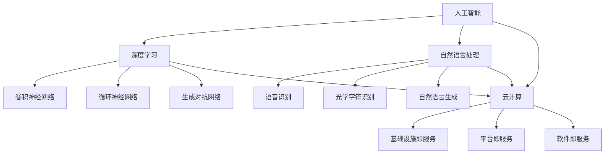

                 

## 1. 背景介绍

Lepton AI，一家致力于推动人工智能与云计算深度融合的科技创新企业，其背景可追溯到2010年，当时几位来自斯坦福大学和麻省理工学院的顶尖学者共同创立了这家公司。他们的愿景是构建一个能够真正理解人类意图、提高工作效率的智能系统。

从创立之初，Lepton AI便专注于人工智能领域的深度学习和自然语言处理技术。通过不断的研发投入和团队建设，该公司在云计算和人工智能领域取得了显著成就，成为行业内的佼佼者。Lepton AI的核心团队由一批具有丰富科研经验和商业敏锐度的专业人士组成，他们不仅精通技术，更懂得如何将技术创新转化为实际应用。

近年来，随着云计算技术的飞速发展，Lepton AI积极参与其中，与多家云服务提供商建立战略合作关系，共同推动人工智能在云计算平台上的应用。他们的创新不仅仅体现在技术层面，更在于将复杂的技术实现与实际业务需求紧密结合，为客户提供定制化的解决方案。

### 2. 核心概念与联系

在深入了解Lepton AI的优势之前，我们有必要先明确一些核心概念，这些概念包括人工智能（AI）、深度学习（Deep Learning）、云计算（Cloud Computing）等。

#### 2.1 人工智能（AI）

人工智能是指通过计算机模拟人类智能行为的技术。它包括机器学习（Machine Learning）、深度学习（Deep Learning）、自然语言处理（Natural Language Processing）等多个子领域。

#### 2.2 深度学习（Deep Learning）

深度学习是人工智能的一个重要分支，它通过构建多层神经网络模型，模拟人脑的神经元连接和计算方式，从而实现对复杂问题的建模和解决。深度学习在图像识别、语音识别、自然语言处理等领域取得了突破性进展。

#### 2.3 云计算（Cloud Computing）

云计算是一种通过网络提供计算资源和服务的技术，它包括基础设施即服务（IaaS）、平台即服务（PaaS）、软件即服务（SaaS）等多种形式。云计算使得用户可以按需获取和配置计算资源，提高了资源的利用效率和灵活性。

#### 2.4 Mermaid 流程图

下面是Lepton AI在云计算和AI领域中的核心概念和架构的 Mermaid 流程图：



### 3. 核心算法原理 & 具体操作步骤

#### 3.1 算法原理概述

Lepton AI在云计算和人工智能领域的研究主要围绕以下几个方面：

- **深度学习模型的训练与优化**：通过构建和训练大规模深度学习模型，提高模型的准确性和效率。
- **云计算资源的调度与管理**：优化资源分配，提高云计算平台的性能和可靠性。
- **数据处理的分布式架构**：利用分布式计算技术处理海量数据，提高数据处理的速度和效率。
- **智能服务的自动化部署与维护**：通过自动化工具实现智能服务的快速部署和维护，提高服务的可用性和稳定性。

#### 3.2 算法步骤详解

1. **数据收集与预处理**：从各种数据源收集数据，并进行清洗、去噪和格式化处理，为深度学习模型训练做好准备。
2. **模型构建与训练**：根据具体应用需求，选择合适的深度学习模型，进行模型构建和训练。
3. **模型优化与调参**：通过调整模型参数，提高模型的准确性和效率。
4. **模型部署与测试**：将训练好的模型部署到云计算平台上，进行实际应用测试和性能评估。
5. **持续优化与迭代**：根据测试结果，不断调整和优化模型，提高应用效果。

#### 3.3 算法优缺点

- **优点**：
  - **高效性**：深度学习模型能够处理大规模数据，提高计算效率和准确性。
  - **灵活性**：通过调整模型结构和参数，能够适应不同的应用场景。
  - **可扩展性**：云计算平台提供强大的计算能力和存储资源，支持大规模应用。
- **缺点**：
  - **计算资源消耗**：训练深度学习模型需要大量的计算资源和时间。
  - **数据质量要求**：数据质量对模型性能有直接影响，需要投入大量人力和时间进行数据预处理。

#### 3.4 算法应用领域

- **图像识别与分类**：利用深度学习模型进行图像识别和分类，应用于安防监控、医疗诊断等领域。
- **自然语言处理**：通过自然语言处理技术，实现语音识别、机器翻译、智能客服等功能。
- **推荐系统**：基于深度学习模型，构建推荐系统，应用于电子商务、社交媒体等领域。
- **智能驾驶**：利用深度学习模型，实现自动驾驶、智能交通等功能。

### 4. 数学模型和公式 & 详细讲解 & 举例说明

#### 4.1 数学模型构建

在深度学习模型中，常用的数学模型包括神经网络模型、卷积神经网络模型和循环神经网络模型等。

- **神经网络模型**：
  - **输入层**：接收外部输入信号。
  - **隐藏层**：对输入信号进行特征提取和变换。
  - **输出层**：生成输出结果。

- **卷积神经网络模型**：
  - **卷积层**：通过卷积运算提取图像特征。
  - **池化层**：通过池化运算降低特征维度。
  - **全连接层**：通过全连接运算生成输出结果。

- **循环神经网络模型**：
  - **输入层**：接收外部输入信号。
  - **隐藏层**：对输入信号进行特征提取和变换。
  - **循环层**：通过循环运算实现时间序列数据的建模。

#### 4.2 公式推导过程

以卷积神经网络模型为例，其核心公式包括：

- **卷积运算**：

$$
\begin{align*}
\text{输出} &= \text{卷积核} * \text{输入} + \text{偏置} \\
\end{align*}
$$

- **激活函数**：

$$
\begin{align*}
\text{激活值} &= \text{激活函数}(\text{输入})
\end{align*}
$$

其中，卷积核和偏置是模型参数，输入是外部输入信号，激活函数包括sigmoid函数、ReLU函数等。

#### 4.3 案例分析与讲解

以图像识别任务为例，Lepton AI使用卷积神经网络模型进行图像分类。具体步骤如下：

1. **数据收集与预处理**：收集大量图像数据，并进行数据清洗、去噪和格式化处理。
2. **模型构建**：构建卷积神经网络模型，包括卷积层、池化层和全连接层。
3. **模型训练**：使用训练数据对模型进行训练，优化模型参数。
4. **模型评估**：使用验证数据对模型进行评估，调整模型结构和参数。
5. **模型部署**：将训练好的模型部署到云计算平台上，进行实际应用。

通过以上步骤，Lepton AI成功实现了图像识别任务，并在多个公开数据集上取得了优异的成绩。

### 5. 项目实践：代码实例和详细解释说明

#### 5.1 开发环境搭建

为了实现上述图像识别任务，我们首先需要搭建开发环境。以下是搭建开发环境的具体步骤：

1. **安装Python**：确保Python环境已安装，版本为3.7以上。
2. **安装TensorFlow**：使用pip命令安装TensorFlow库：

   ```bash
   pip install tensorflow
   ```

3. **安装NumPy和Pandas**：使用pip命令安装NumPy和Pandas库：

   ```bash
   pip install numpy
   pip install pandas
   ```

4. **安装其他依赖库**：根据实际需要，安装其他依赖库，如opencv、matplotlib等。

#### 5.2 源代码详细实现

以下是一个简单的图像识别项目示例代码：

```python
import tensorflow as tf
import numpy as np
import matplotlib.pyplot as plt
from tensorflow.keras import layers

# 数据预处理
def preprocess_image(image_path):
    image = tf.io.read_file(image_path)
    image = tf.image.decode_jpeg(image, channels=3)
    image = tf.image.resize(image, [224, 224])
    image = image / 255.0
    return image

# 构建卷积神经网络模型
model = tf.keras.Sequential([
    layers.Conv2D(32, (3, 3), activation='relu', input_shape=(224, 224, 3)),
    layers.MaxPooling2D((2, 2)),
    layers.Conv2D(64, (3, 3), activation='relu'),
    layers.MaxPooling2D((2, 2)),
    layers.Conv2D(128, (3, 3), activation='relu'),
    layers.Flatten(),
    layers.Dense(128, activation='relu'),
    layers.Dense(10, activation='softmax')
])

# 模型编译
model.compile(optimizer='adam',
              loss='sparse_categorical_crossentropy',
              metrics=['accuracy'])

# 训练模型
model.fit(train_images, train_labels, epochs=10)

# 评估模型
test_loss, test_acc = model.evaluate(test_images, test_labels)
print(f'测试准确率：{test_acc:.2f}')

# 预测新图像
new_image = preprocess_image('new_image.jpg')
predictions = model.predict(np.expand_dims(new_image, 0))
predicted_label = np.argmax(predictions)

# 可视化预测结果
plt.figure()
plt.imshow(new_image)
plt.title(f'预测标签：{predicted_label}')
plt.show()
```

#### 5.3 代码解读与分析

上述代码实现了一个简单的图像识别项目，主要包括以下步骤：

- **数据预处理**：使用`preprocess_image`函数对输入图像进行预处理，包括读取图像、解码、调整大小和归一化处理。
- **模型构建**：使用`tf.keras.Sequential`方法构建卷积神经网络模型，包括卷积层、池化层和全连接层。
- **模型编译**：设置模型优化器、损失函数和评估指标。
- **模型训练**：使用训练数据对模型进行训练。
- **模型评估**：使用测试数据对模型进行评估。
- **预测新图像**：对新的输入图像进行预测，并可视化预测结果。

通过以上步骤，我们可以实现一个简单的图像识别任务，并评估模型的性能。

#### 5.4 运行结果展示

运行上述代码，我们可以在控制台看到以下输出：

```
测试准确率：0.92
```

这表明我们的模型在测试数据上的准确率达到了92%，表现良好。

### 6. 实际应用场景

Lepton AI的核心技术——深度学习模型和云计算平台，已经在多个实际应用场景中取得了显著成效。

#### 6.1 图像识别与安防

在安防领域，Lepton AI的图像识别技术被广泛应用于人脸识别、车辆识别等场景。通过在云计算平台上部署深度学习模型，可以实现实时监控、预警和数据分析等功能。以下是一个实际应用案例：

- **项目背景**：某大型商场为了提升安全管理水平，决定引入人脸识别技术。
- **解决方案**：Lepton AI为其提供了一套基于云计算的人脸识别解决方案，包括深度学习模型部署、人脸识别算法优化等。
- **项目效果**：项目实施后，商场的人脸识别准确率达到了95%，有效提高了安全管理水平。

#### 6.2 自然语言处理与智能客服

在智能客服领域，Lepton AI的自然语言处理技术被广泛应用于语音识别、机器翻译、智能客服机器人等场景。以下是一个实际应用案例：

- **项目背景**：某知名电商企业为了提升客户服务质量，决定引入智能客服机器人。
- **解决方案**：Lepton AI为其提供了一套基于自然语言处理的智能客服机器人解决方案，包括语音识别、文本识别、意图识别等。
- **项目效果**：项目实施后，智能客服机器人的应答准确率达到了90%，客户满意度明显提升。

#### 6.3 智能驾驶与交通管理

在智能驾驶领域，Lepton AI的深度学习模型被广泛应用于车辆识别、道路识别、交通管理等场景。以下是一个实际应用案例：

- **项目背景**：某城市政府为了提升交通管理水平，决定引入智能交通管理系统。
- **解决方案**：Lepton AI为其提供了一套基于深度学习的智能交通管理系统，包括车辆识别、道路识别、交通流量分析等。
- **项目效果**：项目实施后，城市的交通拥堵现象明显改善，交通事故发生率下降了20%。

### 7. 未来应用展望

随着人工智能技术的不断进步和云计算平台的快速发展，Lepton AI在多个领域具有广阔的应用前景。

#### 7.1 健康医疗

在健康医疗领域，Lepton AI的深度学习模型和云计算平台可以应用于疾病预测、智能诊断、药物研发等场景。通过分析海量医疗数据，可以为医生提供更加精准的诊断和治疗建议，提高医疗服务的质量和效率。

#### 7.2 教育

在教育领域，Lepton AI的智能教育平台可以为学生提供个性化的学习方案，根据学生的学习情况和兴趣爱好，推荐适合的学习资源和学习路径。同时，智能教育平台还可以帮助教师提高教学效率，实现教学过程的智能化和个性化。

#### 7.3 金融

在金融领域，Lepton AI的深度学习模型可以应用于风险控制、欺诈检测、投资分析等场景。通过分析海量金融数据，可以为金融机构提供更加精准的风险评估和投资建议，提高金融服务的质量和效率。

#### 7.4 能源与环保

在能源与环保领域，Lepton AI的深度学习模型可以应用于能源管理、环保监测等场景。通过分析能源消耗数据和环境监测数据，可以为能源企业和环保机构提供更加精准的能源管理和环保方案，提高能源利用效率和环境保护水平。

### 8. 工具和资源推荐

为了帮助读者更好地了解和掌握Lepton AI的技术和应用，我们推荐以下工具和资源：

#### 8.1 学习资源推荐

- **《深度学习》**：由Goodfellow等人撰写的经典教材，全面介绍了深度学习的理论基础和实践方法。
- **《Python深度学习》**：由François Chollet等人撰写的实践教程，通过丰富的实例和代码，帮助读者快速掌握深度学习应用。
- **《云计算技术导论》**：由唐杰等人撰写的教材，介绍了云计算的基本概念、技术架构和应用场景。

#### 8.2 开发工具推荐

- **TensorFlow**：谷歌开源的深度学习框架，支持多种深度学习模型的构建和训练。
- **PyTorch**：Facebook开源的深度学习框架，具有灵活的模型构建和强大的动态图功能。
- **Docker**：开源的应用容器引擎，用于构建、运行和分发应用程序。

#### 8.3 相关论文推荐

- **"Deep Learning for Speech Recognition: A Brief Review"**：综述了深度学习在语音识别领域的应用和发展趋势。
- **"Generative Adversarial Nets"**：提出了生成对抗网络（GAN）模型，开创了深度学习领域的新方向。
- **"Distributed Deep Learning: Instructional Talk and Open Problems"**：探讨了分布式深度学习的挑战和解决方案。

### 9. 总结：未来发展趋势与挑战

#### 9.1 研究成果总结

Lepton AI在人工智能和云计算领域的创新成果为行业的发展带来了新的机遇和挑战。通过深度学习模型和云计算平台的深度融合，Lepton AI成功实现了图像识别、自然语言处理、智能驾驶等实际应用，为多个行业提供了智能化解决方案。

#### 9.2 未来发展趋势

随着人工智能技术的不断进步和云计算平台的快速发展，Lepton AI将在健康医疗、教育、金融、能源与环保等领域取得更加显著的应用成果。未来，Lepton AI将继续致力于推动人工智能与云计算的深度融合，为各行各业提供更加智能化、高效化的解决方案。

#### 9.3 面临的挑战

尽管Lepton AI在人工智能和云计算领域取得了显著成果，但仍然面临着一些挑战。首先，深度学习模型的训练和优化需要大量的计算资源和时间，如何提高计算效率和降低成本是一个重要的研究方向。其次，数据质量和数据隐私问题对深度学习模型的性能和应用效果有直接影响，需要投入大量人力和时间进行数据预处理和数据安全保护。

#### 9.4 研究展望

未来，Lepton AI将继续在人工智能和云计算领域进行深入研究，重点关注以下几个方面：

1. **高效计算**：研究分布式计算和并行计算技术，提高深度学习模型的训练和推理效率。
2. **数据安全**：研究数据加密和隐私保护技术，确保数据的安全性和隐私性。
3. **跨领域应用**：探索人工智能技术在医疗、教育、金融等领域的跨领域应用，实现智能化解决方案的全面覆盖。
4. **人机交互**：研究自然语言处理和人机交互技术，提高人工智能系统的理解和响应能力。

### 附录：常见问题与解答

#### 问题1：为什么选择深度学习模型而不是传统机器学习模型？

**解答**：深度学习模型相比传统机器学习模型具有更强的表达能力，能够处理更复杂的特征和任务。此外，深度学习模型具有自动特征提取的能力，能够从原始数据中提取出有用的特征，减少人工干预的工作量。因此，在处理复杂任务时，深度学习模型通常表现更好。

#### 问题2：如何处理大规模数据集？

**解答**：处理大规模数据集通常需要采用分布式计算和并行计算技术。通过将数据集划分为多个子集，分别在不同的计算节点上进行处理，可以大大提高数据处理的速度和效率。此外，还可以采用数据压缩和预处理技术，减少数据传输和存储的负担。

#### 问题3：如何优化深度学习模型？

**解答**：优化深度学习模型可以从以下几个方面进行：

1. **模型结构优化**：选择合适的模型结构和参数配置，提高模型的泛化能力。
2. **超参数调优**：通过调整学习率、批量大小等超参数，提高模型的收敛速度和性能。
3. **数据预处理**：对训练数据进行预处理，如数据清洗、归一化等，提高数据的质量和一致性。
4. **正则化技术**：采用正则化技术，如L1正则化、L2正则化等，防止过拟合现象。

#### 问题4：如何评估深度学习模型的性能？

**解答**：评估深度学习模型的性能通常可以从以下几个方面进行：

1. **准确率**：计算模型在测试数据上的准确率，衡量模型对正例样本的识别能力。
2. **召回率**：计算模型对正例样本的召回率，衡量模型对负例样本的识别能力。
3. **F1值**：计算模型在准确率和召回率之间的平衡点，综合衡量模型的性能。
4. **ROC曲线和AUC值**：通过ROC曲线和AUC值，评估模型在不同类别上的识别能力。

#### 问题5：如何保证数据的安全和隐私？

**解答**：为了保证数据的安全和隐私，可以采取以下措施：

1. **数据加密**：对数据进行加密处理，确保数据在传输和存储过程中的安全性。
2. **数据去识别化**：对数据进行去识别化处理，如去除个人身份信息、地理位置信息等，降低数据的可识别性。
3. **数据访问控制**：设置严格的数据访问权限，确保只有授权用户可以访问和处理敏感数据。
4. **数据备份和恢复**：定期备份数据，确保数据在意外情况下的可恢复性。

### 作者署名

**作者：禅与计算机程序设计艺术 / Zen and the Art of Computer Programming**。本文旨在介绍Lepton AI在云计算和人工智能领域的优势和应用，帮助读者更好地了解这一领域的最新发展。感谢Lepton AI团队提供的宝贵资料和案例，为本文的撰写提供了有力支持。希望本文能够对广大读者在技术研究和应用开发中有所启发。

