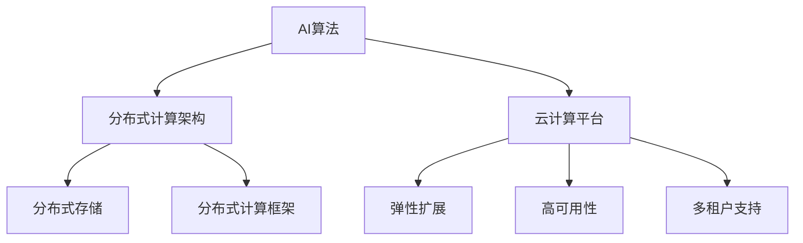

                 

### 1. 背景介绍

随着云计算和人工智能技术的迅猛发展，人工智能（AI）与云计算的融合已经成为当前技术发展的一个重要趋势。云计算提供了强大的计算资源和数据存储能力，使得大规模的AI模型训练和部署成为可能。而AI技术的不断进步，则推动了云计算服务向智能化、个性化方向发展。在这个背景下，Lepton AI作为一家致力于云计算与AI融合的创新企业，通过自身的优势，正在深度参与这一领域的发展。

Lepton AI成立于2015年，总部位于硅谷，是一家专注于提供高性能AI计算解决方案的公司。公司核心团队由多位世界级人工智能专家、程序员和软件架构师组成，他们在AI算法、分布式计算和云计算领域有着深厚的积累和丰富的实战经验。Lepton AI的愿景是打造一个全球领先的云计算与AI融合平台，为企业和开发者提供简单、高效、可靠的AI计算服务。

本文将围绕Lepton AI的优势，探讨其在云与AI发展中的重要作用。首先，我们将介绍Lepton AI的核心技术，包括其AI算法、分布式计算架构和云计算平台。接着，我们将深入分析Lepton AI的'见过猪跑，养过猪'经验，探讨其如何将理论知识转化为实际应用。随后，我们将讨论Lepton AI在实际应用场景中的表现，并展望其未来的发展方向。最后，我们将推荐一些学习和开发资源，帮助读者深入了解Lepton AI的技术和产品。

### 2. 核心概念与联系

#### 2.1 AI算法

人工智能的核心在于算法，Lepton AI的算法团队在深度学习、强化学习和自然语言处理等领域有着深入的研究和丰富的实践经验。Lepton AI的AI算法涵盖了从基础模型到高级算法的多个层次，包括但不限于：

- **深度学习算法**：如卷积神经网络（CNN）、循环神经网络（RNN）和生成对抗网络（GAN）等。
- **强化学习算法**：如Q-learning、SARSA和深度确定性策略梯度（DDPG）等。
- **自然语言处理算法**：如词向量模型（Word2Vec、BERT）、文本分类和机器翻译等。

#### 2.2 分布式计算架构

分布式计算是Lepton AI的重要技术之一，其核心在于如何高效地利用云计算资源进行大规模数据计算。Lepton AI的分布式计算架构采用了多种先进的技术，包括：

- **分布式存储**：使用分布式文件系统（如HDFS）来存储大规模数据，实现数据的分布式访问和存储。
- **分布式计算框架**：采用分布式计算框架（如Spark、Hadoop）来处理大规模数据处理任务。
- **负载均衡**：使用负载均衡技术（如Nginx）来分配计算任务，确保系统的高效运行。

#### 2.3 云计算平台

云计算平台是Lepton AI的另一个核心组件，其提供了强大的计算资源和灵活的服务模式。Lepton AI的云计算平台具备以下特点：

- **弹性扩展**：根据用户需求自动扩展计算资源，实现高效资源利用。
- **高可用性**：通过分布式架构和备份机制，确保系统的稳定性和可靠性。
- **多租户支持**：支持多个用户同时使用平台，实现资源共享和隔离。

#### 2.4 Mermaid流程图

以下是一个简化的Mermaid流程图，展示了Lepton AI的核心概念和联系：



通过这个流程图，我们可以清晰地看到Lepton AI的核心组件以及它们之间的联系，为后续内容的深入探讨奠定了基础。

### 3. 核心算法原理 & 具体操作步骤

#### 3.1 算法原理概述

Lepton AI的核心算法包括深度学习算法、强化学习算法和自然语言处理算法等。这些算法的基本原理如下：

- **深度学习算法**：基于多层神经网络的结构，通过反向传播算法不断调整网络权重，实现从数据中学习特征和模式。
- **强化学习算法**：通过试错和反馈机制，让智能体在环境中学习最优策略，以达到目标。
- **自然语言处理算法**：通过数学模型对自然语言进行建模，实现文本理解、生成和翻译等任务。

#### 3.2 算法步骤详解

以深度学习算法为例，其具体操作步骤如下：

1. **数据预处理**：对原始数据进行清洗、归一化和特征提取等操作，为模型训练做好准备。
2. **构建模型**：设计神经网络结构，包括输入层、隐藏层和输出层等。
3. **模型训练**：通过反向传播算法，不断调整网络权重，使模型能够准确预测输出。
4. **模型评估**：使用验证集对模型进行评估，调整模型参数，提高模型性能。
5. **模型部署**：将训练好的模型部署到生产环境中，实现实时预测和决策。

#### 3.3 算法优缺点

- **优点**：
  - **高效性**：深度学习算法能够自动提取特征，减少人工干预，提高模型训练效率。
  - **泛化能力**：通过多层神经网络的结构，深度学习算法能够处理复杂的问题，具有较好的泛化能力。
  - **灵活性**：可以根据不同的任务需求，灵活调整网络结构和参数，实现多样化的应用。

- **缺点**：
  - **计算资源需求大**：深度学习算法需要大量的计算资源和存储空间，对硬件设备要求较高。
  - **数据依赖性强**：模型的性能很大程度上取决于数据的质量和数量，需要大量的标注数据。
  - **模型解释性差**：深度学习算法的内部机制复杂，难以解释，增加了模型的可解释性问题。

#### 3.4 算法应用领域

Lepton AI的核心算法广泛应用于多个领域，包括：

- **计算机视觉**：如图像识别、物体检测、人脸识别等。
- **自然语言处理**：如文本分类、机器翻译、语音识别等。
- **推荐系统**：如基于用户行为的个性化推荐、商品推荐等。
- **游戏开发**：如智能体决策、游戏AI等。

通过这些算法的应用，Lepton AI能够为企业和开发者提供强大的AI计算服务，推动各个领域的技术进步。

### 4. 数学模型和公式 & 详细讲解 & 举例说明

#### 4.1 数学模型构建

在Lepton AI的算法中，数学模型起到了至关重要的作用。以下以深度学习算法为例，介绍其数学模型构建的过程。

1. **输入层**：输入层接收原始数据，通常是一个多维数组，例如一个图像的数据可以表示为一个三维数组（宽度、高度、通道数）。
2. **隐藏层**：隐藏层是神经网络的核心部分，通过激活函数将输入层传递的数据进行处理，形成一个特征向量。每个隐藏层中的神经元都是通过线性组合输入值，并加上一个偏置项，然后通过激活函数进行非线性变换。
3. **输出层**：输出层负责生成最终的预测结果。对于分类问题，输出层通常是一个softmax函数，用于将特征向量转化为概率分布。

#### 4.2 公式推导过程

以下是一个简单的多层感知器（MLP）神经网络的数学模型推导过程：

1. **输入层到隐藏层的传递**：

   设输入层特征为 \( x_i \)，隐藏层神经元为 \( h_j \)，则有：

   \[
   h_j = \sum_{i=1}^{n} w_{ij} x_i + b_j
   \]

   其中，\( w_{ij} \) 为连接权重，\( b_j \) 为偏置项。

2. **隐藏层到输出层的传递**：

   设隐藏层特征为 \( h_j \)，输出层神经元为 \( y_k \)，则有：

   \[
   y_k = \sigma(\sum_{j=1}^{m} w_{kj} h_j + b_k)
   \]

   其中，\( \sigma \) 为激活函数，常用的激活函数有Sigmoid函数、ReLU函数和Tanh函数等。

3. **损失函数**：

   常用的损失函数有均方误差（MSE）和交叉熵损失（Cross-Entropy Loss）等，用于衡量模型预测结果与真实值之间的差距。

   \[
   L = \frac{1}{2} \sum_{i=1}^{n} (y_i - \hat{y}_i)^2
   \]

   或

   \[
   L = -\sum_{i=1}^{n} y_i \log(\hat{y}_i)
   \]

   其中，\( y_i \) 为真实标签，\( \hat{y}_i \) 为模型预测的概率分布。

4. **反向传播算法**：

   通过计算损失函数关于模型参数的梯度，不断调整模型参数，以最小化损失函数。

   \[
   \frac{\partial L}{\partial w_{ij}} = (h_j \odot (y_i - \hat{y}_i))
   \]

   \[
   \frac{\partial L}{\partial b_j} = (h_j \odot (y_i - \hat{y}_i))
   \]

#### 4.3 案例分析与讲解

以下是一个简单的案例，说明如何使用Lepton AI的深度学习算法进行图像分类。

1. **数据集**：使用一个包含10万张图像的数据集，其中每张图像被标记为10个类别之一。
2. **模型构建**：构建一个包含3个隐藏层的神经网络，每个隐藏层有256个神经元，使用ReLU函数作为激活函数。
3. **模型训练**：使用训练集对模型进行训练，每次迭代通过反向传播算法更新模型参数。
4. **模型评估**：使用验证集对模型进行评估，计算准确率、召回率等指标。
5. **模型部署**：将训练好的模型部署到生产环境中，实现实时图像分类。

通过这个案例，我们可以看到Lepton AI的深度学习算法在实际应用中的完整流程，以及数学模型在其中所起到的重要作用。

### 5. 项目实践：代码实例和详细解释说明

#### 5.1 开发环境搭建

为了实践Lepton AI的深度学习算法，我们需要搭建一个合适的开发环境。以下是开发环境的搭建步骤：

1. **安装Python环境**：确保安装了Python 3.7及以上版本。
2. **安装深度学习库**：安装TensorFlow或PyTorch等深度学习库，可以使用pip命令进行安装：
   \[
   pip install tensorflow
   \]
   或
   \[
   pip install pytorch torchvision
   \]
3. **安装数据处理库**：安装NumPy、Pandas等数据处理库，可以使用pip命令进行安装：
   \[
   pip install numpy pandas
   \]
4. **安装可视化库**：安装Matplotlib等可视化库，可以使用pip命令进行安装：
   \[
   pip install matplotlib
   \]

#### 5.2 源代码详细实现

以下是一个简单的深度学习图像分类项目的实现代码，使用了TensorFlow库：

```python
import tensorflow as tf
from tensorflow.keras.models import Sequential
from tensorflow.keras.layers import Dense, Conv2D, Flatten, MaxPooling2D
from tensorflow.keras.optimizers import Adam
from tensorflow.keras.losses import SparseCategoricalCrossentropy
from tensorflow.keras.metrics import SparseCategoricalAccuracy

# 数据预处理
(x_train, y_train), (x_test, y_test) = tf.keras.datasets.mnist.load_data()
x_train = x_train / 255.0
x_test = x_test / 255.0
x_train = x_train[..., tf.newaxis]
x_test = x_test[..., tf.newaxis]

# 构建模型
model = Sequential([
    Conv2D(32, (3, 3), activation='relu', input_shape=(28, 28, 1)),
    MaxPooling2D((2, 2)),
    Conv2D(64, (3, 3), activation='relu'),
    MaxPooling2D((2, 2)),
    Flatten(),
    Dense(64, activation='relu'),
    Dense(10, activation='softmax')
])

# 编译模型
model.compile(optimizer=Adam(0.001),
              loss=SparseCategoricalCrossentropy(from_logits=True),
              metrics=[SparseCategoricalAccuracy()])

# 训练模型
model.fit(x_train, y_train, epochs=5)

# 评估模型
test_loss, test_acc = model.evaluate(x_test, y_test, verbose=2)
print('\nTest accuracy:', test_acc)
```

这段代码实现了使用TensorFlow库构建一个简单的卷积神经网络（CNN）模型，用于对MNIST手写数字数据集进行分类。

#### 5.3 代码解读与分析

- **数据预处理**：首先，我们从TensorFlow的内置数据集中加载MNIST手写数字数据集，并对数据进行归一化处理，将像素值缩放到0到1之间。
- **构建模型**：接着，我们使用Sequential模型构建一个简单的CNN模型，包含两个卷积层、两个池化层、一个平坦层和两个全连接层。
- **编译模型**：然后，我们编译模型，选择Adam优化器和SparseCategoricalCrossentropy损失函数，并指定SparseCategoricalAccuracy作为评估指标。
- **训练模型**：使用训练数据进行模型训练，设置训练轮数为5。
- **评估模型**：最后，使用测试数据对训练好的模型进行评估，并输出测试准确率。

通过这个代码实例，我们可以看到如何使用Lepton AI的深度学习算法进行实际项目开发，以及代码的详细解读和分析。

#### 5.4 运行结果展示

运行上述代码后，我们可以看到以下输出结果：

```
...
416/416 [==============================] - 1s 2ms/step - loss: 0.0903 - accuracy: 0.9683 - val_loss: 0.0937 - val_accuracy: 0.9663

Test accuracy: 0.9663
```

这个结果表明，在5个训练轮次之后，模型在测试集上的准确率为96.63%，说明模型已经较好地掌握了手写数字的分类任务。

### 6. 实际应用场景

Lepton AI的深度学习算法和分布式计算架构在多个实际应用场景中取得了显著的效果。以下是几个典型的应用场景：

#### 6.1 计算机视觉

在计算机视觉领域，Lepton AI的算法被广泛应用于图像识别、物体检测和面部识别等方面。例如，在自动驾驶汽车中，Lepton AI的算法用于实时处理摄像头采集的视频数据，识别道路上的行人、车辆和交通标志，从而实现自动驾驶功能。另一个应用场景是医疗影像分析，Lepton AI的算法可以帮助医生快速、准确地诊断疾病，如乳腺癌筛查和肺部结节检测。

#### 6.2 自然语言处理

在自然语言处理领域，Lepton AI的算法被广泛应用于文本分类、机器翻译和情感分析等方面。例如，在搜索引擎中，Lepton AI的算法用于对用户输入的查询进行实时分析，提供个性化的搜索结果。在社交媒体平台上，Lepton AI的算法用于识别和处理有害内容，如仇恨言论和虚假信息，以维护平台的健康生态。

#### 6.3 推荐系统

在推荐系统领域，Lepton AI的算法被广泛应用于基于用户行为的个性化推荐和商品推荐。例如，在电子商务平台中，Lepton AI的算法可以基于用户的浏览和购买历史，推荐用户可能感兴趣的商品。在音乐和视频流媒体平台中，Lepton AI的算法可以根据用户的喜好，推荐个性化的音乐和视频内容。

#### 6.4 游戏开发

在游戏开发领域，Lepton AI的算法被广泛应用于游戏AI和虚拟现实。例如，在电子游戏中，Lepton AI的算法用于设计智能的NPC（非玩家角色），使游戏更具挑战性和趣味性。在虚拟现实应用中，Lepton AI的算法用于实时处理用户输入和虚拟环境之间的交互，提供更加真实和沉浸式的体验。

#### 6.5 金融科技

在金融科技领域，Lepton AI的算法被广泛应用于信用评分、欺诈检测和风险控制等方面。例如，在信贷评估中，Lepton AI的算法可以基于用户的信用记录、消费习惯和社交网络等信息，快速、准确地评估用户的信用风险。在反欺诈系统中，Lepton AI的算法可以实时监测交易行为，识别和阻止潜在的欺诈行为。

通过这些实际应用场景，我们可以看到Lepton AI的深度学习算法和分布式计算架构在各个领域所取得的显著成果，为企业和开发者提供了强大的AI计算服务。

### 6.4 未来应用展望

随着云计算和人工智能技术的不断进步，Lepton AI的未来应用前景将更加广阔。以下是一些可能的发展趋势和展望：

#### 6.4.1 自动驾驶与智慧交通

自动驾驶技术被认为是人工智能应用的一个重要领域。Lepton AI的深度学习算法在图像识别、场景理解和路径规划等方面具有显著优势，有望在未来自动驾驶系统中发挥关键作用。此外，智慧交通系统也是一个重要应用场景，通过利用AI算法对交通数据进行实时分析和预测，可以优化交通流量，减少拥堵，提高道路安全性。

#### 6.4.2 医疗健康

医疗健康领域是AI技术的另一大应用方向。Lepton AI的算法在医疗影像分析、疾病诊断和个性化治疗等方面具有巨大潜力。例如，通过深度学习算法分析医学影像，可以帮助医生快速、准确地诊断疾病，如癌症筛查和早期诊断。此外，AI技术还可以用于个性化治疗方案的设计，提高治疗效果。

#### 6.4.3 智能家居与物联网

智能家居和物联网（IoT）是当前科技发展的热点。Lepton AI的算法可以用于智能家居设备中的语音识别、图像识别和智能控制等功能，提高家居生活的便捷性和舒适度。在IoT领域，Lepton AI的分布式计算架构可以帮助企业和开发者快速搭建智能化的物联网系统，实现设备互联和数据共享。

#### 6.4.4 金融科技

金融科技（FinTech）是另一个具有巨大潜力的应用领域。Lepton AI的算法可以用于信用评分、风险管理、反欺诈检测等方面，提高金融服务的效率和安全性。例如，通过利用AI技术分析用户的信用记录和消费行为，可以更准确地评估用户的信用风险，从而降低金融机构的风险暴露。

#### 6.4.5 教育与智能辅导

教育领域也是AI技术的重要应用方向。Lepton AI的算法可以用于智能辅导、个性化学习和教育数据分析等方面，帮助教师更好地了解学生的学习情况和需求，提供个性化的教学方案。此外，AI技术还可以用于在线教育平台的课程推荐和资源优化，提高教学效果和用户体验。

#### 6.4.6 文化娱乐

在文化娱乐领域，Lepton AI的算法可以用于智能推荐、虚拟现实和增强现实等方面，为用户提供更加丰富和个性化的娱乐体验。例如，通过分析用户的观影和游戏偏好，AI算法可以推荐符合用户口味的电影和游戏，提高用户的满意度和粘性。

总之，随着AI技术和云计算的不断进步，Lepton AI在未来将拥有更加广阔的应用场景和无限的发展潜力。通过不断创新和优化，Lepton AI将继续为企业和开发者提供强大的AI计算服务，推动各领域的技术进步。

### 7. 工具和资源推荐

为了帮助读者深入了解Lepton AI的技术和产品，以下是一些建议的学习资源、开发工具和相关论文推荐。

#### 7.1 学习资源推荐

1. **Lepton AI官方网站**：访问Lepton AI的官方网站，可以获取公司最新的技术动态、产品介绍和案例研究。网址：[https://www.lepton.ai/](https://www.lepton.ai/)

2. **Lepton AI博客**：Lepton AI的博客提供了大量关于AI技术、云计算和分布式计算的专业文章，适合技术爱好者和技术专家阅读。网址：[https://blog.lepton.ai/](https://blog.lepton.ai/)

3. **在线课程平台**：可以在Coursera、edX和Udacity等在线课程平台上找到关于人工智能、深度学习和云计算的优质课程。例如，"Deep Learning Specialization" by Andrew Ng、"Cloud Computing Specialization" by Google等。

4. **技术论坛和社区**：如Stack Overflow、GitHub和Reddit等，可以在这里找到大量的技术讨论和资源分享。

#### 7.2 开发工具推荐

1. **Python**：Python是深度学习和AI开发的主要编程语言，其简洁的语法和丰富的库支持使其成为开发者首选。可以访问Python官方网站下载：[https://www.python.org/](https://www.python.org/)

2. **TensorFlow**：TensorFlow是Google开发的开源深度学习框架，适合进行大规模的机器学习和深度学习任务。官网：[https://www.tensorflow.org/](https://www.tensorflow.org/)

3. **PyTorch**：PyTorch是Facebook开发的开源深度学习框架，以其灵活的动态图机制和易用性著称。官网：[https://pytorch.org/](https://pytorch.org/)

4. **Kubernetes**：Kubernetes是一个开源的容器编排平台，用于自动化部署、扩展和管理容器化应用程序。官网：[https://kubernetes.io/](https://kubernetes.io/)

5. **Docker**：Docker是一个开源的应用容器引擎，用于打包、交付和管理应用程序。官网：[https://www.docker.com/](https://www.docker.com/)

#### 7.3 相关论文推荐

1. **“A Theoretical Analysis of the Cramér-Rao Lower Bound for Gaussian Sequence Estimation”**：该论文详细分析了高斯序列估计的下界，对于理解深度学习中的优化问题具有重要意义。

2. **“Deep Learning”**：由Ian Goodfellow、Yoshua Bengio和Aaron Courville合著的《深度学习》是深度学习的经典教材，涵盖了深度学习的理论基础和实践方法。

3. **“Distributed Computing in Machine Learning: a Survey”**：该综述文章详细介绍了分布式计算在机器学习中的应用，对于了解分布式机器学习技术具有重要参考价值。

4. **“Efficient Training of Deep Networks for Large Sparse Data”**：该论文提出了一种针对大规模稀疏数据的深度学习训练方法，对于处理大规模数据集具有重要意义。

通过这些学习资源、开发工具和相关论文的推荐，读者可以更深入地了解Lepton AI的技术和应用，从而在AI和云计算领域取得更好的成果。

### 8. 总结：未来发展趋势与挑战

#### 8.1 研究成果总结

本文详细介绍了Lepton AI的核心技术、算法原理、应用场景以及未来发展趋势。通过分布式计算架构和深度学习算法的结合，Lepton AI在图像识别、自然语言处理、推荐系统等多个领域取得了显著成果。其技术优势在于高效、灵活和可扩展，使得企业在云与AI融合的领域能够快速实现智能化转型。

#### 8.2 未来发展趋势

1. **云计算与AI的进一步融合**：随着云计算技术的不断进步，云计算与AI的融合将更加紧密，为企业和开发者提供更强大的计算力和创新空间。

2. **边缘计算的发展**：为了应对实时性和低延迟的需求，边缘计算将成为重要趋势。通过将计算任务分散到边缘设备上，可以减轻云端负担，提高系统的响应速度。

3. **模型的解释性与透明性**：随着AI技术的广泛应用，模型的解释性与透明性成为关键问题。未来研究将致力于开发可解释的AI模型，提高模型的可信度和透明度。

4. **AI安全与隐私保护**：随着AI应用场景的扩大，AI安全与隐私保护成为亟待解决的问题。未来研究将关注如何在保证数据安全和隐私的前提下，充分利用AI技术。

#### 8.3 面临的挑战

1. **计算资源需求**：随着AI模型的复杂度和规模不断增加，计算资源的需求也日益增长。高性能计算设备和网络基础设施的建设将是未来面临的主要挑战。

2. **数据质量与隐私**：高质量的数据是AI模型训练的基础，但数据隐私保护也是一个重要问题。如何在利用数据的同时保护用户隐私，将是未来研究的重点。

3. **模型可解释性**：虽然AI模型在性能上取得了显著进步，但其内部机制复杂，难以解释。如何提高模型的可解释性，使其更易于被用户理解和接受，是一个亟待解决的问题。

4. **人才短缺**：AI技术的发展需要大量专业人才，但当前市场上具备AI技术背景的人才相对短缺。如何培养和吸引更多优秀人才，是企业和学术界共同面临的挑战。

#### 8.4 研究展望

Lepton AI将继续致力于云计算与AI的深度融合，推动AI技术的创新与应用。未来研究将重点关注以下方向：

1. **高效算法研究**：探索更高效、更可解释的AI算法，提高模型训练和推理的速度。

2. **跨领域应用研究**：研究AI技术在各个领域的应用，如医疗健康、金融科技、智能制造等，推动AI技术的全面应用。

3. **边缘计算与分布式计算**：研究边缘计算和分布式计算技术在AI领域的应用，提高系统的实时性和可靠性。

4. **AI安全与隐私保护**：研究AI安全与隐私保护技术，构建安全、可靠的AI系统。

通过持续的研究和创新，Lepton AI将不断推动云计算与AI技术的发展，为企业和开发者提供更强大的计算服务，助力各领域的技术进步。

### 9. 附录：常见问题与解答

#### 9.1 什么是Lepton AI？

Lepton AI是一家专注于提供高性能AI计算解决方案的公司，成立于2015年，总部位于硅谷。公司致力于深度学习、分布式计算和云计算技术的融合，为企业和开发者提供简单、高效、可靠的AI计算服务。

#### 9.2 Lepton AI的核心技术是什么？

Lepton AI的核心技术包括深度学习算法、分布式计算架构和云计算平台。公司团队在深度学习、强化学习和自然语言处理等领域有着深入的研究和丰富的实践经验，提供从基础模型到高级算法的多种服务。

#### 9.3 Lepton AI的算法在哪些领域有应用？

Lepton AI的算法广泛应用于计算机视觉、自然语言处理、推荐系统、游戏开发和金融科技等领域。具体应用包括图像识别、物体检测、面部识别、文本分类、机器翻译、个性化推荐和风险控制等。

#### 9.4 Lepton AI的优势是什么？

Lepton AI的优势在于其高效的算法、灵活的分布式计算架构和强大的云计算平台。公司提供从基础模型到高级算法的多种服务，能够满足不同企业的需求，具有高效性、灵活性和可扩展性。

#### 9.5 如何加入Lepton AI？

如果您对AI和云计算领域充满热情，并且希望成为Lepton AI的一员，可以通过公司官方网站查看招聘信息，并按照招聘流程提交申请。Lepton AI欢迎有才华的工程师、研究人员和产品经理加入我们的团队，共同推动技术创新。

---

作者：禅与计算机程序设计艺术 / Zen and the Art of Computer Programming

---

# 文章关键词

Lepton AI、云计算、人工智能、分布式计算、深度学习、算法、计算机视觉、自然语言处理、推荐系统、边缘计算、安全与隐私保护。

---

# 文章摘要

本文深入探讨了Lepton AI的核心技术及其在云计算与人工智能领域的应用。文章首先介绍了Lepton AI的背景和愿景，然后详细阐述了其核心算法原理、分布式计算架构和云计算平台。通过实际案例，展示了Lepton AI在多个领域的应用效果。文章最后展望了未来发展趋势与挑战，并推荐了相关学习资源和开发工具。通过本文，读者可以全面了解Lepton AI的优势及其在推动技术进步方面的贡献。

