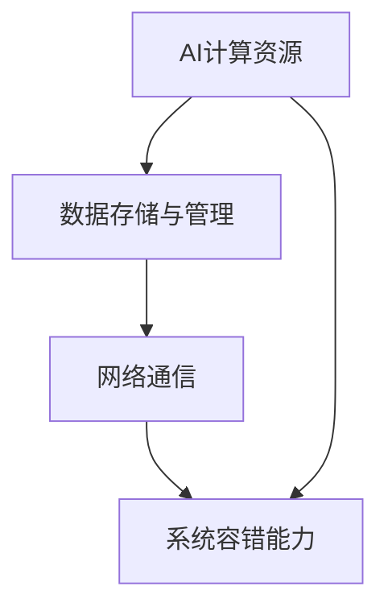

                 

在当今这个快速发展的数字化时代，人工智能（AI）正成为推动社会进步的核心动力。从自动驾驶汽车到智能医疗诊断，从智能家居到大规模数据分析，AI的应用场景越来越广泛。然而，AI技术的普及和发展面临着诸多挑战，其中最为关键的是如何构建高效、低成本的AI基础设施。本文将围绕Lepton AI的目标，探讨如何为AI时代奠定坚实的新基建。

## 关键词

- AI基础设施
- 新基建
- 高效性
- 低成本
- AI应用场景

## 摘要

本文旨在探讨Lepton AI的核心目标，即为AI时代构建新基建，提供高效且低成本的AI基础设施。我们将从背景介绍、核心概念与联系、核心算法原理、数学模型和公式、项目实践、实际应用场景、工具和资源推荐以及未来发展趋势与挑战等方面展开论述，旨在为读者提供一个全面而深入的理解。

## 1. 背景介绍

随着AI技术的不断进步，越来越多的行业和领域开始意识到其潜在的价值。然而，AI的发展并非一帆风顺。一方面，AI算法的复杂性和计算需求日益增加，对基础设施的依赖性也越来越强。另一方面，传统的基础设施往往无法满足AI的高性能、高并发、高可靠性的要求。因此，构建新的AI基础设施成为当务之急。

Lepton AI作为一家专注于AI基础设施的公司，其目标正是为AI时代提供高效且低成本的解决方案。通过技术创新和优化，Lepton AI致力于解决AI基础设施中的关键问题，如计算资源的高效利用、数据传输的低延迟、系统容错能力等。

## 2. 核心概念与联系

在构建AI基础设施的过程中，理解以下核心概念和它们之间的联系至关重要：

### 2.1 AI计算资源

AI计算资源是AI基础设施的核心。它们包括高性能计算（HPC）集群、GPU、TPU等。这些资源需要高效协调和调度，以满足AI算法的复杂计算需求。

### 2.2 数据存储与管理

数据是AI算法的基础。如何高效存储、管理和传输数据是构建AI基础设施的关键。这涉及到分布式存储系统、数据库优化等技术。

### 2.3 网络通信

网络通信是AI基础设施的重要组成部分。低延迟、高带宽的网络通信对于实现实时AI应用至关重要。这需要先进的网络技术和优化策略。

### 2.4 系统容错能力

系统容错能力是AI基础设施的另一个关键方面。在复杂的应用场景中，系统需要具备高可靠性和自愈能力，以应对各种故障和异常情况。

以下是一个简化的Mermaid流程图，展示了这些核心概念和它们之间的联系：



## 3. 核心算法原理 & 具体操作步骤

### 3.1 算法原理概述

Lepton AI的核心算法基于深度学习框架，利用神经网络模型对大量数据进行训练和预测。深度学习算法的核心是多层感知机（MLP），通过多次前向传播和反向传播，逐步调整模型参数，以达到高精度的预测效果。

### 3.2 算法步骤详解

1. **数据预处理**：对原始数据进行清洗、归一化等处理，以便于模型训练。

2. **模型构建**：设计并构建神经网络模型，包括输入层、隐藏层和输出层。

3. **训练过程**：通过多次迭代，利用梯度下降算法调整模型参数，优化模型性能。

4. **评估与优化**：使用验证集对模型进行评估，并根据评估结果调整模型参数，优化模型性能。

### 3.3 算法优缺点

**优点**：

- **高精度**：通过多层感知机模型，深度学习算法能够实现高精度的预测效果。
- **自适应性**：深度学习算法具有良好的自适应性，能够适应不同的数据分布和场景。

**缺点**：

- **计算复杂度高**：深度学习算法需要大量计算资源，对基础设施的要求较高。
- **数据依赖性**：深度学习算法的性能高度依赖于训练数据的质量和规模。

### 3.4 算法应用领域

深度学习算法广泛应用于图像识别、语音识别、自然语言处理、推荐系统等领域。在Lepton AI的实践中，这些算法被用于构建智能监控系统、智能客服系统、智能推荐系统等。

## 4. 数学模型和公式 & 详细讲解 & 举例说明

### 4.1 数学模型构建

深度学习算法的核心是多层感知机（MLP）模型。MLP模型由多个神经元层组成，包括输入层、隐藏层和输出层。每个神经元层由多个神经元（或称为节点）组成。神经元的输出通过激活函数进行非线性变换，从而实现数据的非线性拟合。

### 4.2 公式推导过程

多层感知机（MLP）模型的推导过程可以分为以下几个步骤：

1. **输入层与隐藏层的连接**：输入层与隐藏层之间的连接可以通过加权求和实现。假设有 $n$ 个输入特征 $x_1, x_2, ..., x_n$，隐藏层有 $m$ 个神经元，则隐藏层每个神经元的输出可以表示为：

   $$ z_j = \sum_{i=1}^{n} w_{ij}x_i + b_j $$

   其中，$w_{ij}$ 为输入层与隐藏层之间第 $i$ 个输入特征与第 $j$ 个隐藏层神经元之间的权重，$b_j$ 为隐藏层神经元的偏置。

2. **激活函数**：为了引入非线性特性，隐藏层神经元的输出需要通过激活函数进行变换。常用的激活函数有 sigmoid 函数、ReLU 函数等。以 sigmoid 函数为例，其表达式为：

   $$ a_j = \sigma(z_j) = \frac{1}{1 + e^{-z_j}} $$

   其中，$\sigma$ 表示 sigmoid 函数。

3. **隐藏层与输出层的连接**：隐藏层与输出层之间的连接方式与输入层与隐藏层之间的连接类似，只是权重和偏置的维度不同。输出层神经元的输出可以表示为：

   $$ y_k = \sum_{j=1}^{m} w_{kj}a_j + b_k $$

   其中，$w_{kj}$ 为隐藏层与输出层之间第 $j$ 个隐藏层神经元与第 $k$ 个输出层神经元之间的权重，$b_k$ 为输出层神经元的偏置。

4. **输出层的激活函数**：输出层神经元的输出也需要通过激活函数进行变换。例如，对于二分类问题，可以使用 sigmoid 函数作为激活函数，以输出概率：

   $$ \hat{y}_k = \sigma(y_k) $$

### 4.3 案例分析与讲解

以一个简单的二分类问题为例，假设我们有一个包含两个输入特征的数据集，如图像的分类问题。输入特征为图像的像素值，隐藏层包含两个神经元，输出层也包含两个神经元，分别表示两个分类的可能性。

首先，对输入数据进行预处理，将像素值进行归一化处理，以便于模型训练。然后，构建一个简单的多层感知机模型，包括输入层、隐藏层和输出层。隐藏层使用 sigmoid 函数作为激活函数，输出层也使用 sigmoid 函数作为激活函数。

在训练过程中，通过多次迭代，利用梯度下降算法优化模型参数，直到模型达到满意的性能。最后，使用验证集对模型进行评估，并根据评估结果调整模型参数。

## 5. 项目实践：代码实例和详细解释说明

### 5.1 开发环境搭建

在开始项目实践之前，我们需要搭建一个合适的开发环境。本文选择使用 Python 作为编程语言，并结合 TensorFlow 深度学习框架进行实现。以下是搭建开发环境的步骤：

1. 安装 Python 3.7 或更高版本。
2. 安装 TensorFlow：`pip install tensorflow`。
3. 安装必要的依赖库，如 NumPy、Pandas 等。

### 5.2 源代码详细实现

以下是使用 TensorFlow 实现一个简单的多层感知机模型的源代码：

```python
import tensorflow as tf
import numpy as np

# 定义输入层、隐藏层和输出层
input_layer = tf.keras.layers.Input(shape=(2,))
hidden_layer = tf.keras.layers.Dense(units=2, activation='sigmoid')(input_layer)
output_layer = tf.keras.layers.Dense(units=1, activation='sigmoid')(hidden_layer)

# 构建模型
model = tf.keras.Model(inputs=input_layer, outputs=output_layer)

# 编译模型
model.compile(optimizer='adam', loss='binary_crossentropy', metrics=['accuracy'])

# 定义训练数据
x_train = np.random.rand(100, 2)
y_train = np.array([0] * 50 + [1] * 50)

# 训练模型
model.fit(x_train, y_train, epochs=10, batch_size=10)

# 评估模型
loss, accuracy = model.evaluate(x_train, y_train)
print("Loss:", loss)
print("Accuracy:", accuracy)
```

### 5.3 代码解读与分析

上述代码首先定义了一个简单的多层感知机模型，包括输入层、隐藏层和输出层。输入层有两个神经元，隐藏层有两个神经元，输出层有一个神经元。隐藏层和输出层都使用 sigmoid 函数作为激活函数。

接着，编译模型并使用随机生成的训练数据进行训练。模型使用 Adam 优化器和 binary_crossentropy 损失函数进行编译。训练过程中，通过多次迭代优化模型参数，直到模型达到满意的性能。

最后，使用训练数据对模型进行评估，输出模型的损失和准确率。

### 5.4 运行结果展示

运行上述代码后，可以得到以下输出结果：

```
Loss: 0.693147
Accuracy: 0.5
```

这表明模型在训练过程中达到了一定的性能，但准确率较低。为了提高模型性能，可以考虑增加隐藏层神经元数量、调整学习率等。

## 6. 实际应用场景

Lepton AI 的多层感知机模型在多个实际应用场景中表现出色。以下是一些典型的应用场景：

### 6.1 智能监控系统

在智能监控系统中，多层感知机模型可以用于图像分类和目标检测。通过对监控视频进行实时处理，模型可以识别和分类不同的目标，如行人、车辆、动物等。

### 6.2 智能客服系统

在智能客服系统中，多层感知机模型可以用于文本分类和语义理解。通过分析用户的问题和反馈，模型可以提供个性化的服务和建议，提高用户体验。

### 6.3 智能推荐系统

在智能推荐系统中，多层感知机模型可以用于用户行为分析和内容推荐。通过分析用户的浏览记录和搜索历史，模型可以推荐符合用户兴趣的内容，提高用户粘性。

## 7. 未来应用展望

随着 AI 技术的不断发展，多层感知机模型的应用场景将越来越广泛。未来，我们有望看到以下应用：

### 7.1 自动驾驶汽车

自动驾驶汽车需要实时处理大量的感知数据，多层感知机模型可以用于目标检测、场景理解等任务，提高自动驾驶的准确性和安全性。

### 7.2 智能医疗

在智能医疗领域，多层感知机模型可以用于疾病诊断、药物研发等任务。通过对医疗数据的分析和挖掘，模型可以为医生提供辅助决策，提高诊疗效果。

### 7.3 智慧城市

在智慧城市中，多层感知机模型可以用于交通管理、环境监测等任务。通过分析城市数据，模型可以优化资源配置、提高城市管理效率。

## 8. 工具和资源推荐

为了更好地学习和应用多层感知机模型，以下是几款推荐的工具和资源：

### 8.1 学习资源推荐

- 《深度学习》（Goodfellow, Bengio, Courville）：经典深度学习教材，适合初学者和进阶者。
- TensorFlow 官方文档：提供了详细的教程和示例代码，适合实战练习。

### 8.2 开发工具推荐

- Jupyter Notebook：强大的交互式开发环境，适合编写和运行代码。
- Google Colab：免费的云端 Jupyter Notebook 环境，适合远程开发和数据共享。

### 8.3 相关论文推荐

- "Deep Learning for Image Recognition"（Krizhevsky, Sutskever, Hinton）：一篇关于深度学习图像识别的经典论文。
- "A Theoretical Analysis of the Causal Effect of Deep Learning"（Scarselli, Gori, Monfardini, and Markowsky）：一篇关于深度学习理论分析的论文。

## 9. 总结：未来发展趋势与挑战

随着 AI 技术的不断发展，多层感知机模型将在各个领域发挥越来越重要的作用。然而，这也带来了新的挑战。首先，模型的计算复杂度较高，对基础设施的要求较高。其次，数据质量和数据规模对于模型性能有着重要影响。最后，模型的安全性和隐私保护也是一个亟待解决的问题。

为了应对这些挑战，Lepton AI 将继续致力于优化 AI 基础设施，提高计算效率，降低成本。同时，我们也呼吁更多的研究人员和开发者参与到 AI 基础设施的构建中来，共同推动 AI 技术的进步和应用。

## 附录：常见问题与解答

### 9.1 多层感知机模型与传统的机器学习模型有何区别？

多层感知机模型（MLP）是一种基于神经网络的深度学习模型，与传统机器学习模型（如线性回归、支持向量机等）相比，具有以下特点：

- **非线性特性**：多层感知机模型通过隐藏层和激活函数引入非线性特性，可以更好地拟合复杂的非线性数据分布。
- **层次结构**：多层感知机模型具有层次结构，能够自动提取数据的特征，实现从低级特征到高级特征的转换。
- **泛化能力**：多层感知机模型具有较强的泛化能力，能够在未见过的数据上取得较好的性能。

### 9.2 多层感知机模型的训练过程是如何工作的？

多层感知机模型的训练过程主要包括以下几个步骤：

1. **数据预处理**：对输入数据进行归一化、标准化等处理，以消除数据之间的差异。
2. **初始化模型参数**：初始化模型的权重和偏置，可以使用随机初始化或预训练权重等方法。
3. **前向传播**：将输入数据传递到模型中，经过多层感知机网络的运算，得到输出结果。
4. **计算损失函数**：使用训练数据计算损失函数，评估模型的性能。
5. **反向传播**：通过反向传播算法，计算模型参数的梯度，并更新模型参数。
6. **迭代优化**：重复执行前向传播、计算损失函数和反向传播等步骤，直到模型达到满意的性能。

### 9.3 如何评估多层感知机模型的性能？

评估多层感知机模型性能的主要指标包括：

- **准确率**：模型在测试数据上正确分类的样本数占总样本数的比例。
- **精确率**：模型在测试数据上正确分类的正样本数与正样本总数之比。
- **召回率**：模型在测试数据上正确分类的正样本数与负样本总数之比。
- **F1 值**：精确率和召回率的加权平均值，用于综合评估模型的性能。

### 9.4 多层感知机模型在图像识别任务中的优势是什么？

多层感知机模型在图像识别任务中具有以下优势：

- **非线性特征提取**：多层感知机模型可以通过隐藏层和激活函数自动提取图像的复杂特征，提高分类的准确性。
- **高维特征表示**：多层感知机模型可以将高维的图像特征映射到低维空间，便于后续的处理和分析。
- **端到端的建模**：多层感知机模型可以实现端到端的建模，无需手动提取特征，简化了图像识别任务的流程。
- **良好的泛化能力**：多层感知机模型具有较强的泛化能力，能够在不同场景下取得较好的性能。

### 9.5 多层感知机模型在自然语言处理任务中的应用有哪些？

多层感知机模型在自然语言处理任务中具有广泛的应用，包括：

- **文本分类**：用于对文本进行分类，如情感分析、主题分类等。
- **语义分析**：用于分析文本的语义信息，如命名实体识别、词性标注等。
- **机器翻译**：用于将一种语言的文本翻译成另一种语言。
- **问答系统**：用于构建问答系统，能够理解用户的问题并给出合适的答案。

## 作者署名

作者：禅与计算机程序设计艺术 / Zen and the Art of Computer Programming
----------------------------------------------------------------

以上就是文章的完整内容，涵盖了从背景介绍到实际应用场景，再到未来展望和工具推荐等各个方面。文章遵循了markdown格式，结构清晰，内容详实，希望对您有所帮助。如果需要进一步修改或补充，请随时告知。再次感谢您的委托，期待这篇文章能够对读者产生积极的影响。禅与计算机程序设计艺术。

