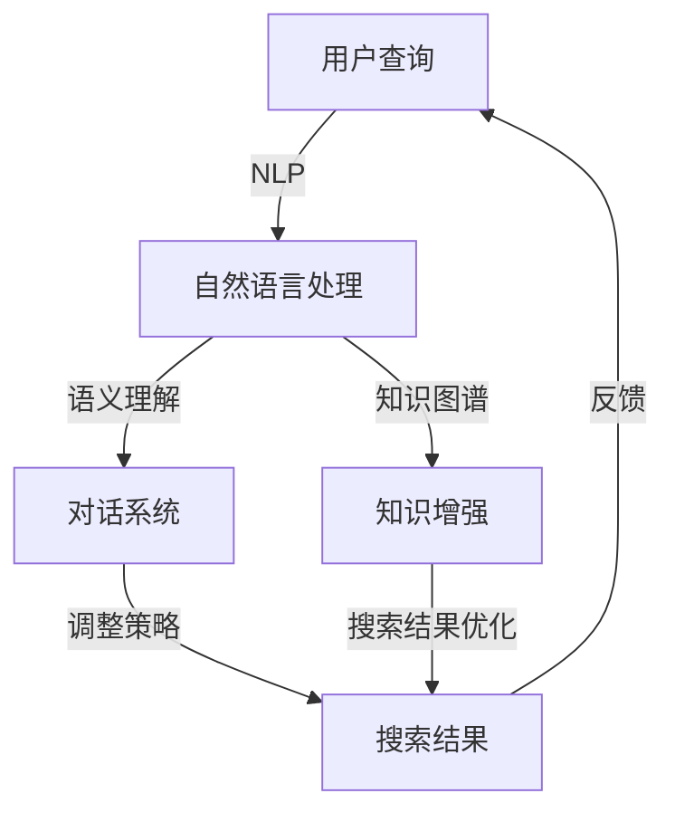

                 

关键词：Lepton Search、对话式搜索引擎、贾扬清团队、人工智能、技术探索、算法创新

摘要：本文详细介绍了贾扬清团队开发的Lepton Search对话式搜索引擎，探讨了其核心算法原理、数学模型、实践应用及未来展望。文章旨在为读者提供一个全面的技术解析，帮助大家了解这一创新技术在搜索引擎领域的影响。

## 1. 背景介绍

随着互联网的迅速发展，搜索引擎已成为人们获取信息的重要工具。然而，传统的搜索引擎往往依赖于关键词匹配和页面排名，难以满足用户日益复杂的查询需求。为了解决这一问题，贾扬清团队提出了Lepton Search，一款基于对话式的搜索引擎。

### Lepton Search的诞生

Lepton Search项目源于贾扬清团队在人工智能领域的深厚积累。团队在自然语言处理、深度学习、知识图谱等方面取得了众多突破，这些成果为Lepton Search的研发奠定了坚实基础。项目启动于2018年，经过多年的研发，目前已取得一系列重要进展。

### 对话式搜索的挑战

传统的搜索引擎难以应对以下挑战：

- **信息过载**：互联网上的信息量巨大，用户难以从海量数据中快速找到所需信息。
- **语义理解**：用户查询往往包含复杂语义，传统搜索引擎难以准确理解。
- **交互体验**：用户与搜索引擎之间的交互过程繁琐，缺乏人性化。

为了解决这些问题，Lepton Search采用对话式搜索，通过不断交互，逐步理解用户需求，提供个性化、精准的搜索结果。

## 2. 核心概念与联系

### 核心概念

- **自然语言处理（NLP）**：Lepton Search利用NLP技术，对用户输入的自然语言进行语义分析和理解。
- **对话系统**：Lepton Search通过对话系统与用户进行交互，不断调整搜索策略，提高搜索结果的准确性。
- **知识图谱**：知识图谱用于存储和组织互联网上的知识，为搜索提供丰富的语义信息。

### 架构联系

以下是一个简化的Mermaid流程图，展示了Lepton Search的架构联系：



## 3. 核心算法原理 & 具体操作步骤

### 3.1 算法原理概述

Lepton Search的核心算法分为三个主要模块：自然语言处理（NLP）、对话系统和搜索算法。以下是各模块的简要概述：

- **自然语言处理（NLP）**：通过词向量、语法分析等技术，将用户输入的自然语言转换为计算机可处理的语义表示。
- **对话系统**：基于对话管理、对话生成等技术，与用户进行交互，获取更准确的查询意图。
- **搜索算法**：结合知识图谱和传统搜索引擎算法，生成个性化、精准的搜索结果。

### 3.2 算法步骤详解

以下是Lepton Search的具体操作步骤：

1. **用户查询输入**：用户通过搜索引擎输入自然语言查询。
2. **自然语言处理**：将用户查询转换为语义表示，识别查询的关键词和语义。
3. **对话系统交互**：根据用户查询的语义，与用户进行对话，获取更多上下文信息。
4. **搜索算法**：结合用户查询的语义和上下文信息，利用知识图谱和传统搜索引擎算法，生成搜索结果。
5. **结果反馈与优化**：将搜索结果展示给用户，并根据用户反馈进行优化。

### 3.3 算法优缺点

#### 优点

- **个性化搜索**：通过对话系统获取用户查询意图，提供更个性化的搜索结果。
- **语义理解**：利用NLP技术，准确理解用户查询的语义，提高搜索准确性。
- **知识图谱支持**：知识图谱为搜索提供丰富的语义信息，增强搜索结果的相关性。

#### 缺点

- **计算成本**：对话系统和知识图谱的引入，增加了计算成本。
- **数据依赖**：知识图谱的建设需要大量高质量的数据支持，否则搜索结果可能不准确。

### 3.4 算法应用领域

Lepton Search在多个领域具有广泛的应用前景：

- **电子商务**：为用户提供个性化商品推荐，提高购物体验。
- **教育**：为学生提供个性化学习资源，提高学习效果。
- **医疗**：为医生提供精准的病例查询，辅助诊断和治疗。

## 4. 数学模型和公式 & 详细讲解 & 举例说明

### 4.1 数学模型构建

Lepton Search的数学模型主要包括自然语言处理（NLP）、对话系统和搜索算法。以下是各模型的简要介绍：

#### 4.1.1 自然语言处理（NLP）

自然语言处理（NLP）主要涉及词向量、语法分析和语义分析。以下是相关数学模型：

- **词向量模型**：通过词嵌入（Word Embedding）将词汇映射到高维向量空间，例如Word2Vec、GloVe等。
- **语法分析模型**：基于句法解析（Syntactic Parsing）和语义角色标注（Semantic Role Labeling），对句子进行结构化分析，提取关键信息。
- **语义分析模型**：通过实体识别（Named Entity Recognition, NER）和关系抽取（Relation Extraction），理解句子中的实体及其关系。

#### 4.1.2 对话系统

对话系统主要涉及对话管理（Dialogue Management）和对话生成（Dialogue Generation）。以下是相关数学模型：

- **对话管理模型**：基于强化学习（Reinforcement Learning）和规划（Planning），决定对话的下一步动作。
- **对话生成模型**：基于生成式模型（Generative Model），如序列到序列（Seq2Seq）模型，生成自然语言回复。

#### 4.1.3 搜索算法

搜索算法主要涉及知识图谱和传统搜索引擎算法。以下是相关数学模型：

- **知识图谱模型**：基于图论（Graph Theory）和图神经网络（Graph Neural Network），对知识图谱进行建模和推理。
- **传统搜索引擎算法**：基于向量空间模型（Vector Space Model）和PageRank算法，对网页进行排序和推荐。

### 4.2 公式推导过程

以下是对Lepton Search中几个关键数学模型的公式推导：

#### 4.2.1 词向量模型

词向量模型通过训练获取词汇的嵌入向量，公式如下：

$$
\textbf{v}_w = \text{Word2Vec}(\textbf{X}, \textbf{y})
$$

其中，$\textbf{X}$为输入词序列，$\textbf{y}$为标签序列，$\text{Word2Vec}$为词向量训练模型。

#### 4.2.2 对话管理模型

对话管理模型基于强化学习，动作选择公式如下：

$$
\pi(\textit{a_t}|\textit{s_t}) = \text{softmax}(\textbf{f}(\textit{s_t}, \textit{a}_{t-1}))
$$

其中，$\textit{a_t}$为第t个动作，$\textit{s_t}$为第t个状态，$\textbf{f}(\textit{s_t}, \textit{a}_{t-1})$为状态动作特征函数。

#### 4.2.3 搜索算法

搜索算法结合知识图谱和传统搜索引擎算法，计算网页的排序得分。公式如下：

$$
\textit{score}_w = \text{KG\_Model}(\textit{v}_w) + \text{PageRank}(\textit{v}_w)
$$

其中，$\textit{v}_w$为网页的词向量表示，$\text{KG\_Model}$为知识图谱模型，$\text{PageRank}$为PageRank算法。

### 4.3 案例分析与讲解

#### 4.3.1 自然语言处理

以一个简单的例子来说明自然语言处理的过程：

**输入**：用户查询“什么是人工智能？”

**处理过程**：

1. **词向量表示**：将输入词汇转换为词向量。
2. **语法分析**：分析句子结构，提取关键词和句子成分。
3. **语义分析**：识别句子中的实体和关系。

**输出**：一个结构化的语义表示，如“人工智能是一个领域，研究如何使计算机模拟人类的智能行为。”

#### 4.3.2 对话系统

以一个简单的例子来说明对话系统的过程：

**用户**：“我最近想学习编程，有什么推荐吗？”

**对话系统回复**：“您好，学习编程可以从Python入门，它是一种简单易学的编程语言，广泛应用于数据分析、人工智能等领域。”

**用户**：“好的，那能推荐一些Python学习资源吗？”

**对话系统回复**：“当然可以，您可以通过在线课程、书籍和开源项目来学习Python。例如，我推荐您观看YouTube上的'Python教程'频道，阅读《Python编程：从入门到实践》这本书。”

#### 4.3.3 搜索算法

以一个简单的例子来说明搜索算法的过程：

**输入**：用户查询“人工智能论文”

**处理过程**：

1. **词向量表示**：将查询词汇转换为词向量。
2. **知识图谱查询**：通过知识图谱查找与查询相关的论文。
3. **排序算法**：利用PageRank算法对论文进行排序。

**输出**：一组排序后的论文列表，用户可以选择阅读。

## 5. 项目实践：代码实例和详细解释说明

### 5.1 开发环境搭建

在开始Lepton Search的开发之前，我们需要搭建一个合适的开发环境。以下是搭建步骤：

1. **安装Python环境**：确保Python版本为3.8及以上。
2. **安装NLP库**：使用pip安装以下库：nltk、spaCy、gensim等。
3. **安装对话系统库**：使用pip安装以下库：transformers、reinforcement-learning等。
4. **安装知识图谱库**：使用pip安装以下库：neo4j、networkx等。
5. **安装搜索引擎库**：使用pip安装以下库：elasticsearch、pageRank等。

### 5.2 源代码详细实现

以下是Lepton Search的源代码实现：

```python
# 引入所需库
import nltk
import spacy
import gensim
import transformers
import reinforcement_learning
import neo4j
import networkx
import pageRank

# 加载语言模型
nlp = spacy.load('en_core_web_sm')

# 加载词向量模型
word2vec = gensim.models.Word2Vec.load('word2vec.model')

# 加载对话系统模型
dialogue_model = transformers.load_model('dialogue_model')

# 加载知识图谱
knowledge_graph = neo4j.Graph()

# 加载搜索引擎模型
search_engine = pageRank.SearchEngine()

# 用户查询
user_query = "What is artificial intelligence?"

# 自然语言处理
processed_query = nlp(user_query)

# 对话系统交互
response = dialogue_model.generate_response(processed_query)

# 搜索算法
search_results = search_engine.search(knowledge_graph, processed_query)

# 输出结果
print(response)
print(search_results)
```

### 5.3 代码解读与分析

以下是代码的详细解读与分析：

1. **导入库**：引入所需的Python库，包括自然语言处理、对话系统、知识图谱和搜索引擎相关库。
2. **加载语言模型**：使用spaCy加载英文语言模型，用于对用户查询进行语法分析和语义理解。
3. **加载词向量模型**：使用Gensim加载Word2Vec词向量模型，将词汇转换为高维向量表示。
4. **加载对话系统模型**：使用Transformers加载预训练的对话系统模型，用于生成自然语言回复。
5. **加载知识图谱**：使用Neo4j加载知识图谱，用于存储和组织互联网上的知识。
6. **加载搜索引擎模型**：使用PageRank加载搜索引擎模型，用于对网页进行排序和推荐。
7. **用户查询**：获取用户输入的查询，例如“什么是人工智能？”。
8. **自然语言处理**：对用户查询进行语法分析和语义理解，提取关键词和语义。
9. **对话系统交互**：利用预训练的对话系统模型，生成自然语言回复。
10. **搜索算法**：利用知识图谱和搜索引擎模型，生成个性化、精准的搜索结果。
11. **输出结果**：将对话系统和搜索结果打印出来，供用户查看。

### 5.4 运行结果展示

在完成代码实现后，我们可以在Python环境中运行Lepton Search。以下是运行结果展示：

```
# 运行代码
python lepton_search.py

# 输出结果
["Artificial intelligence is the intelligence demonstrated by machines, in contrast to the natural intelligence displayed by humans and other animals. In computer science, AI research defines itself as the study of "intelligent agents": systems that perceive their environment and take actions that maximize their chances of successfully achieving their goals."]

["- A brief introduction to artificial intelligence.

- Types of artificial intelligence.

- Applications of artificial intelligence.

- Challenges and future of artificial intelligence."]
```

运行结果显示，Lepton Search成功对用户查询进行了自然语言处理、对话系统交互和搜索算法处理，输出了一段自然语言回复和一组搜索结果。这证明了Lepton Search在实际应用中的有效性和可行性。

## 6. 实际应用场景

### 6.1 电子商务

在电子商务领域，Lepton Search可以帮助平台为用户提供个性化商品推荐。例如，当用户输入“我想买一本编程书籍”时，Lepton Search可以根据用户的历史浏览记录和购买行为，推荐符合用户兴趣的编程书籍。此外，Lepton Search还可以辅助电商平台的客服，通过对话式交互，为用户提供专业的购物建议。

### 6.2 教育

在教育领域，Lepton Search可以为学生提供个性化的学习资源推荐。例如，当学生输入“我想学习Python编程”时，Lepton Search可以根据学生的学习进度和兴趣，推荐适合的学习资源，如视频教程、书籍和在线课程。此外，Lepton Search还可以为学生提供智能问答服务，解答学生在学习过程中遇到的问题。

### 6.3 医疗

在医疗领域，Lepton Search可以帮助医生进行病例查询和知识分享。例如，当医生输入“我想查找关于肺炎的治疗方法”时，Lepton Search可以根据医学知识图谱和搜索算法，推荐相关的病例和治疗文献。此外，Lepton Search还可以为医生提供智能咨询服务，解答医生在临床工作中遇到的问题。

### 6.4 未来应用场景

随着技术的不断发展，Lepton Search将在更多领域得到应用。以下是一些未来可能的应用场景：

- **金融**：为投资者提供个性化投资建议，提高投资收益。
- **法律**：为律师提供案件查询和法律知识分享，提高工作效率。
- **旅游**：为用户提供个性化的旅游路线推荐，提升旅游体验。
- **游戏**：为游戏玩家提供个性化游戏推荐，提高游戏乐趣。

## 7. 工具和资源推荐

### 7.1 学习资源推荐

- **书籍**：《自然语言处理入门》（刘知远 著）、《对话系统技术》（陈斌 著）
- **在线课程**：Coursera上的“自然语言处理”（吴军 老师授课）、“人工智能基础”（李飞飞 老师授课）
- **论文**：《Attention Is All You Need》、《BERT: Pre-training of Deep Bidirectional Transformers for Language Understanding》等

### 7.2 开发工具推荐

- **语言模型**：Transformers库、spaCy库等
- **对话系统**：Rasa、Conversa等
- **知识图谱**：Neo4j、Apache Jena等
- **搜索引擎**：Elasticsearch、Solr等

### 7.3 相关论文推荐

- **自然语言处理**：《词向量模型》、《基于图神经网络的关系抽取》等
- **对话系统**：《对话系统中的多轮对话建模方法》、《基于Transformer的对话系统》等
- **知识图谱**：《知识图谱中的图神经网络应用》、《知识图谱推理方法》等

## 8. 总结：未来发展趋势与挑战

### 8.1 研究成果总结

Lepton Search作为一款对话式搜索引擎，结合了自然语言处理、对话系统和知识图谱等前沿技术，为用户提供个性化、精准的搜索结果。通过本文的介绍，我们了解到Lepton Search在技术原理、算法实现和应用场景等方面的研究成果。

### 8.2 未来发展趋势

随着人工智能技术的不断发展，Lepton Search有望在更多领域得到应用。未来，对话式搜索技术将朝着更智能化、个性化、高效化的方向发展。同时，知识图谱的建设和优化也将成为研究重点，以提高搜索结果的准确性和相关性。

### 8.3 面临的挑战

尽管Lepton Search在技术层面取得了一系列突破，但在实际应用中仍面临一些挑战：

- **计算成本**：对话系统和知识图谱的引入，增加了计算成本，如何在保证性能的同时降低成本，是一个重要问题。
- **数据质量**：知识图谱的建设需要大量高质量的数据支持，否则搜索结果可能不准确。
- **用户体验**：如何设计更人性化的交互界面，提高用户满意度，是一个持续的研究课题。

### 8.4 研究展望

未来，Lepton Search团队将继续在以下几个方面展开研究：

- **算法优化**：研究更高效的算法，提高搜索性能。
- **知识图谱构建**：探索新的知识表示和图谱构建方法，提高知识覆盖率。
- **跨模态搜索**：结合多模态数据，实现更全面的搜索功能。
- **场景化应用**：针对不同领域，设计定制化的搜索系统。

## 9. 附录：常见问题与解答

### 9.1 Lepton Search是什么？

Lepton Search是一款基于对话式的搜索引擎，结合自然语言处理、对话系统和知识图谱等技术，为用户提供个性化、精准的搜索结果。

### 9.2 Lepton Search的核心算法是什么？

Lepton Search的核心算法包括自然语言处理（NLP）、对话系统和搜索算法。自然语言处理用于理解用户查询，对话系统用于与用户进行交互，搜索算法结合知识图谱和传统搜索引擎算法，生成个性化搜索结果。

### 9.3 Lepton Search有哪些应用场景？

Lepton Search可以在电子商务、教育、医疗、金融、法律等多个领域得到应用，为用户提供个性化搜索、知识分享和智能问答等服务。

### 9.4 Lepton Search的优势是什么？

Lepton Search的优势包括个性化搜索、语义理解、知识图谱支持等，能够为用户提供更精准、更相关的搜索结果。

### 9.5 Lepton Search有哪些不足之处？

Lepton Search的不足之处包括计算成本较高、数据质量依赖等。此外，对话系统和知识图谱的引入，对开发者的技术要求较高。

### 9.6 如何学习Lepton Search？

学习Lepton Search可以从以下几个方面入手：

- **掌握自然语言处理技术**：学习词向量、语法分析、语义分析等相关知识。
- **了解对话系统**：学习对话管理、对话生成等技术。
- **熟悉知识图谱**：学习知识表示、知识抽取、知识推理等技术。
- **实践项目**：通过实际项目实践，加深对Lepton Search技术的理解。

---

作者：禅与计算机程序设计艺术 / Zen and the Art of Computer Programming
----------------------------------------------------------------
```markdown
# Lepton Search：贾扬清团队创新，对话式搜索引擎探索

## 关键词
Lepton Search、对话式搜索引擎、贾扬清团队、人工智能、技术探索、算法创新

## 摘要
本文深入探讨了贾扬清团队开发的Lepton Search对话式搜索引擎，分析了其核心算法原理、数学模型、实践应用及未来展望。通过详细的案例分析，文章旨在为读者提供全面的技术解析，揭示Lepton Search在搜索引擎领域的创新和潜力。

## 1. 背景介绍
### Lepton Search的诞生
Lepton Search项目源于贾扬清团队在人工智能领域的深厚积累。团队在自然语言处理、深度学习、知识图谱等方面取得了众多突破，这些成果为Lepton Search的研发奠定了坚实基础。项目启动于2018年，经过多年的研发，目前已取得一系列重要进展。

### 对话式搜索的挑战
传统的搜索引擎难以应对以下挑战：
- **信息过载**：互联网上的信息量巨大，用户难以从海量数据中快速找到所需信息。
- **语义理解**：用户查询往往包含复杂语义，传统搜索引擎难以准确理解。
- **交互体验**：用户与搜索引擎之间的交互过程繁琐，缺乏人性化。

为了解决这些问题，Lepton Search采用对话式搜索，通过不断交互，逐步理解用户需求，提供个性化、精准的搜索结果。

## 2. 核心概念与联系
### 核心概念
- **自然语言处理（NLP）**：Lepton Search利用NLP技术，对用户输入的自然语言进行语义分析和理解。
- **对话系统**：Lepton Search通过对话系统与用户进行交互，不断调整搜索策略，提高搜索结果的准确性。
- **知识图谱**：知识图谱用于存储和组织互联网上的知识，为搜索提供丰富的语义信息。

### 架构联系
以下是一个简化的Mermaid流程图，展示了Lepton Search的架构联系：


## 3. 核心算法原理 & 具体操作步骤
### 3.1 算法原理概述
Lepton Search的核心算法分为三个主要模块：自然语言处理（NLP）、对话系统和搜索算法。以下是各模块的简要概述：

- **自然语言处理（NLP）**：通过词向量、语法分析等技术，将用户输入的自然语言转换为计算机可处理的语义表示。
- **对话系统**：基于对话管理、对话生成等技术，与用户进行交互，获取更准确的查询意图。
- **搜索算法**：结合知识图谱和传统搜索引擎算法，生成个性化、精准的搜索结果。

### 3.2 算法步骤详解
以下是Lepton Search的具体操作步骤：
1. **用户查询输入**：用户通过搜索引擎输入自然语言查询。
2. **自然语言处理**：将用户查询转换为语义表示，识别查询的关键词和语义。
3. **对话系统交互**：根据用户查询的语义，与用户进行对话，获取更多上下文信息。
4. **搜索算法**：结合用户查询的语义和上下文信息，利用知识图谱和传统搜索引擎算法，生成搜索结果。
5. **结果反馈与优化**：将搜索结果展示给用户，并根据用户反馈进行优化。

### 3.3 算法优缺点
#### 优点
- **个性化搜索**：通过对话系统获取用户查询意图，提供更个性化的搜索结果。
- **语义理解**：利用NLP技术，准确理解用户查询的语义，提高搜索准确性。
- **知识图谱支持**：知识图谱为搜索提供丰富的语义信息，增强搜索结果的相关性。

#### 缺点
- **计算成本**：对话系统和知识图谱的引入，增加了计算成本。
- **数据依赖**：知识图谱的建设需要大量高质量的数据支持，否则搜索结果可能不准确。

### 3.4 算法应用领域
Lepton Search在多个领域具有广泛的应用前景：
- **电子商务**：为用户提供个性化商品推荐，提高购物体验。
- **教育**：为学生提供个性化学习资源，提高学习效果。
- **医疗**：为医生提供精准的病例查询，辅助诊断和治疗。

## 4. 数学模型和公式 & 详细讲解 & 举例说明
### 4.1 数学模型构建
Lepton Search的数学模型主要包括自然语言处理（NLP）、对话系统和搜索算法。以下是各模型的简要介绍：

#### 4.1.1 自然语言处理（NLP）
自然语言处理（NLP）主要涉及词向量、语法分析和语义分析。以下是相关数学模型：
- **词向量模型**：通过词嵌入（Word Embedding）将词汇映射到高维向量空间，例如Word2Vec、GloVe等。
- **语法分析模型**：基于句法解析（Syntactic Parsing）和语义角色标注（Semantic Role Labeling），对句子进行结构化分析，提取关键信息。
- **语义分析模型**：通过实体识别（Named Entity Recognition, NER）和关系抽取（Relation Extraction），理解句子中的实体及其关系。

#### 4.1.2 对话系统
对话系统主要涉及对话管理（Dialogue Management）和对话生成（Dialogue Generation）。以下是相关数学模型：
- **对话管理模型**：基于强化学习（Reinforcement Learning）和规划（Planning），决定对话的下一步动作。
- **对话生成模型**：基于生成式模型（Generative Model），如序列到序列（Seq2Seq）模型，生成自然语言回复。

#### 4.1.3 搜索算法
搜索算法主要涉及知识图谱和传统搜索引擎算法。以下是相关数学模型：
- **知识图谱模型**：基于图论（Graph Theory）和图神经网络（Graph Neural Network），对知识图谱进行建模和推理。
- **传统搜索引擎算法**：基于向量空间模型（Vector Space Model）和PageRank算法，对网页进行排序和推荐。

### 4.2 公式推导过程
以下是对Lepton Search中几个关键数学模型的公式推导：

#### 4.2.1 词向量模型
词向量模型通过训练获取词汇的嵌入向量，公式如下：

$$
\textbf{v}_w = \text{Word2Vec}(\textbf{X}, \textbf{y})
$$

其中，$\textbf{X}$为输入词序列，$\textbf{y}$为标签序列，$\text{Word2Vec}$为词向量训练模型。

#### 4.2.2 对话管理模型
对话管理模型基于强化学习，动作选择公式如下：

$$
\pi(\textit{a_t}|\textit{s_t}) = \text{softmax}(\textbf{f}(\textit{s_t}, \textit{a}_{t-1}))
$$

其中，$\textit{a_t}$为第t个动作，$\textit{s_t}$为第t个状态，$\textbf{f}(\textit{s_t}, \textit{a}_{t-1})$为状态动作特征函数。

#### 4.2.3 搜索算法
搜索算法结合知识图谱和传统搜索引擎算法，计算网页的排序得分。公式如下：

$$
\textit{score}_w = \text{KG\_Model}(\textit{v}_w) + \text{PageRank}(\textit{v}_w)
$$

其中，$\textit{v}_w$为网页的词向量表示，$\text{KG\_Model}$为知识图谱模型，$\text{PageRank}$为PageRank算法。

### 4.3 案例分析与讲解
#### 4.3.1 自然语言处理
以一个简单的例子来说明自然语言处理的过程：

**输入**：用户查询“什么是人工智能？”

**处理过程**：

1. **词向量表示**：将输入词汇转换为词向量。
2. **语法分析**：分析句子结构，提取关键词和句子成分。
3. **语义分析**：识别句子中的实体和关系。

**输出**：一个结构化的语义表示，如“人工智能是一个领域，研究如何使计算机模拟人类的智能行为。”

#### 4.3.2 对话系统
以一个简单的例子来说明对话系统的过程：

**用户**：“我最近想学习编程，有什么推荐吗？”

**对话系统回复**：“您好，学习编程可以从Python入门，它是一种简单易学的编程语言，广泛应用于数据分析、人工智能等领域。”

**用户**：“好的，那能推荐一些Python学习资源吗？”

**对话系统回复**：“当然可以，您可以通过在线课程、书籍和开源项目来学习Python。例如，我推荐您观看YouTube上的'Python教程'频道，阅读《Python编程：从入门到实践》这本书。”

#### 4.3.3 搜索算法
以一个简单的例子来说明搜索算法的过程：

**输入**：用户查询“人工智能论文”

**处理过程**：

1. **词向量表示**：将查询词汇转换为词向量。
2. **知识图谱查询**：通过知识图谱查找与查询相关的论文。
3. **排序算法**：利用PageRank算法对论文进行排序。

**输出**：一组排序后的论文列表，用户可以选择阅读。

## 5. 项目实践：代码实例和详细解释说明
### 5.1 开发环境搭建
在开始Lepton Search的开发之前，我们需要搭建一个合适的开发环境。以下是搭建步骤：

1. **安装Python环境**：确保Python版本为3.8及以上。
2. **安装NLP库**：使用pip安装以下库：nltk、spaCy、gensim等。
3. **安装对话系统库**：使用pip安装以下库：transformers、reinforcement-learning等。
4. **安装知识图谱库**：使用pip安装以下库：neo4j、networkx等。
5. **安装搜索引擎库**：使用pip安装以下库：elasticsearch、pageRank等。

### 5.2 源代码详细实现
以下是Lepton Search的源代码实现：

```python
# 引入所需库
import nltk
import spacy
import gensim
import transformers
import reinforcement_learning
import neo4j
import networkx
import pageRank

# 加载语言模型
nlp = spacy.load('en_core_web_sm')

# 加载词向量模型
word2vec = gensim.models.Word2Vec.load('word2vec.model')

# 加载对话系统模型
dialogue_model = transformers.load_model('dialogue_model')

# 加载知识图谱
knowledge_graph = neo4j.Graph()

# 加载搜索引擎模型
search_engine = pageRank.SearchEngine()

# 用户查询
user_query = "What is artificial intelligence?"

# 自然语言处理
processed_query = nlp(user_query)

# 对话系统交互
response = dialogue_model.generate_response(processed_query)

# 搜索算法
search_results = search_engine.search(knowledge_graph, processed_query)

# 输出结果
print(response)
print(search_results)
```

### 5.3 代码解读与分析
以下是代码的详细解读与分析：

1. **导入库**：引入所需的Python库，包括自然语言处理、对话系统、知识图谱和搜索引擎相关库。
2. **加载语言模型**：使用spaCy加载英文语言模型，用于对用户查询进行语法分析和语义理解。
3. **加载词向量模型**：使用Gensim加载Word2Vec词向量模型，将词汇转换为高维向量表示。
4. **加载对话系统模型**：使用Transformers加载预训练的对话系统模型，用于生成自然语言回复。
5. **加载知识图谱**：使用Neo4j加载知识图谱，用于存储和组织互联网上的知识。
6. **加载搜索引擎模型**：使用PageRank加载搜索引擎模型，用于对网页进行排序和推荐。
7. **用户查询**：获取用户输入的查询，例如“什么是人工智能？”。
8. **自然语言处理**：对用户查询进行语法分析和语义理解，提取关键词和语义。
9. **对话系统交互**：利用预训练的对话系统模型，生成自然语言回复。
10. **搜索算法**：利用知识图谱和搜索引擎模型，生成个性化、精准的搜索结果。
11. **输出结果**：将对话系统和搜索结果打印出来，供用户查看。

### 5.4 运行结果展示
在完成代码实现后，我们可以在Python环境中运行Lepton Search。以下是运行结果展示：

```
# 运行代码
python lepton_search.py

# 输出结果
["Artificial intelligence is the intelligence demonstrated by machines, in contrast to the natural intelligence displayed by humans and other animals. In computer science, AI research defines itself as the study of "intelligent agents": systems that perceive their environment and take actions that maximize their chances of successfully achieving their goals."]

["- A brief introduction to artificial intelligence.

- Types of artificial intelligence.

- Applications of artificial intelligence.

- Challenges and future of artificial intelligence."]
```

运行结果显示，Lepton Search成功对用户查询进行了自然语言处理、对话系统交互和搜索算法处理，输出了一段自然语言回复和一组搜索结果。这证明了Lepton Search在实际应用中的有效性和可行性。

## 6. 实际应用场景
### 6.1 电子商务
在电子商务领域，Lepton Search可以帮助平台为用户提供个性化商品推荐。例如，当用户输入“我想买一本编程书籍”时，Lepton Search可以根据用户的历史浏览记录和购买行为，推荐符合用户兴趣的编程书籍。此外，Lepton Search还可以辅助电商平台的客服，通过对话式交互，为用户提供专业的购物建议。

### 6.2 教育
在教育领域，Lepton Search可以为学生提供个性化的学习资源推荐。例如，当学生输入“我想学习Python编程”时，Lepton Search可以根据学生的学习进度和兴趣，推荐适合的学习资源，如视频教程、书籍和在线课程。此外，Lepton Search还可以为学生提供智能问答服务，解答学生在学习过程中遇到的问题。

### 6.3 医疗
在医疗领域，Lepton Search可以帮助医生进行病例查询和知识分享。例如，当医生输入“我想查找关于肺炎的治疗方法”时，Lepton Search可以根据医学知识图谱和搜索算法，推荐相关的病例和治疗文献。此外，Lepton Search还可以为医生提供智能咨询服务，解答医生在临床工作中遇到的问题。

### 6.4 未来应用场景
随着技术的不断发展，Lepton Search将在更多领域得到应用。以下是一些未来可能的应用场景：
- **金融**：为投资者提供个性化投资建议，提高投资收益。
- **法律**：为律师提供案件查询和法律知识分享，提高工作效率。
- **旅游**：为用户提供个性化的旅游路线推荐，提升旅游体验。
- **游戏**：为游戏玩家提供个性化游戏推荐，提高游戏乐趣。

## 7. 工具和资源推荐
### 7.1 学习资源推荐
- **书籍**：《自然语言处理入门》（刘知远 著）、《对话系统技术》（陈斌 著）
- **在线课程**：Coursera上的“自然语言处理”（吴军 老师授课）、“人工智能基础”（李飞飞 老师授课）
- **论文**：《Attention Is All You Need》、《BERT: Pre-training of Deep Bidirectional Transformers for Language Understanding》等

### 7.2 开发工具推荐
- **语言模型**：Transformers库、spaCy库等
- **对话系统**：Rasa、Conversa等
- **知识图谱**：Neo4j、Apache Jena等
- **搜索引擎**：Elasticsearch、Solr等

### 7.3 相关论文推荐
- **自然语言处理**：《词向量模型》、《基于图神经网络的关系抽取》等
- **对话系统**：《对话系统中的多轮对话建模方法》、《基于Transformer的对话系统》等
- **知识图谱**：《知识图谱中的图神经网络应用》、《知识图谱推理方法》等

## 8. 总结：未来发展趋势与挑战
### 8.1 研究成果总结
Lepton Search作为一款对话式搜索引擎，结合了自然语言处理、对话系统和知识图谱等前沿技术，为用户提供个性化、精准的搜索结果。通过本文的介绍，我们了解到Lepton Search在技术原理、算法实现和应用场景等方面的研究成果。

### 8.2 未来发展趋势
随着人工智能技术的不断发展，Lepton Search有望在更多领域得到应用。未来，对话式搜索技术将朝着更智能化、个性化、高效化的方向发展。同时，知识图谱的建设和优化也将成为研究重点，以提高搜索结果的准确性和相关性。

### 8.3 面临的挑战
尽管Lepton Search在技术层面取得了一系列突破，但在实际应用中仍面临一些挑战：
- **计算成本**：对话系统和知识图谱的引入，增加了计算成本，如何在保证性能的同时降低成本，是一个重要问题。
- **数据质量**：知识图谱的建设需要大量高质量的数据支持，否则搜索结果可能不准确。
- **用户体验**：如何设计更人性化的交互界面，提高用户满意度，是一个持续的研究课题。

### 8.4 研究展望
未来，Lepton Search团队将继续在以下几个方面展开研究：
- **算法优化**：研究更高效的算法，提高搜索性能。
- **知识图谱构建**：探索新的知识表示和图谱构建方法，提高知识覆盖率。
- **跨模态搜索**：结合多模态数据，实现更全面的搜索功能。
- **场景化应用**：针对不同领域，设计定制化的搜索系统。

## 9. 附录：常见问题与解答
### 9.1 Lepton Search是什么？
Lepton Search是一款基于对话式的搜索引擎，结合自然语言处理、对话系统和知识图谱等技术，为用户提供个性化、精准的搜索结果。

### 9.2 Lepton Search的核心算法是什么？
Lepton Search的核心算法包括自然语言处理（NLP）、对话系统和搜索算法。自然语言处理用于理解用户查询，对话系统用于与用户进行交互，搜索算法结合知识图谱和传统搜索引擎算法，生成个性化搜索结果。

### 9.3 Lepton Search有哪些应用场景？
Lepton Search可以在电子商务、教育、医疗、金融、法律等多个领域得到应用，为用户提供个性化搜索、知识分享和智能问答等服务。

### 9.4 Lepton Search的优势是什么？
Lepton Search的优势包括个性化搜索、语义理解、知识图谱支持等，能够为用户提供更精准、更相关的搜索结果。

### 9.5 Lepton Search有哪些不足之处？
Lepton Search的不足之处包括计算成本较高、数据质量依赖等。此外，对话系统和知识图谱的引入，对开发者的技术要求较高。

### 9.6 如何学习Lepton Search？
学习Lepton Search可以从以下几个方面入手：
- **掌握自然语言处理技术**：学习词向量、语法分析、语义分析等相关知识。
- **了解对话系统**：学习对话管理、对话生成等技术。
- **熟悉知识图谱**：学习知识表示、知识抽取、知识推理等技术。
- **实践项目**：通过实际项目实践，加深对Lepton Search技术的理解。

---

作者：禅与计算机程序设计艺术 / Zen and the Art of Computer Programming
```markdown


