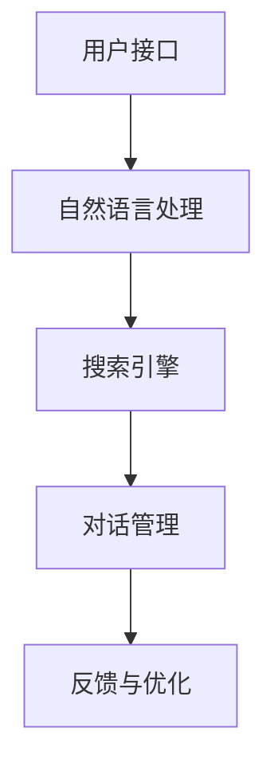

                 

关键词：对话式搜索引擎、贾扬清团队、Lepton Search、技术创新、人工智能、搜索引擎架构

摘要：随着人工智能技术的迅猛发展，搜索引擎正迎来新一轮的变革。本文将深入探讨贾扬清团队研发的Lepton Search，这是一款极具创新性的对话式搜索引擎。文章首先介绍了Lepton Search的背景，接着分析了其核心概念与架构，详细阐述了其算法原理与数学模型，并通过实际项目实践展示了其应用效果。最后，文章对Lepton Search的未来发展进行了展望。

## 1. 背景介绍

搜索引擎作为互联网时代的重要基础设施，已经深刻改变了人们获取信息和知识的方式。然而，传统的搜索引擎主要基于关键词匹配和文本检索，用户在搜索时往往需要输入一系列关键词，然后从搜索结果中筛选所需信息。这种交互方式存在一定的局限性，尤其是在面对复杂问题和长尾需求时，用户难以得到准确的答案。为了解决这一问题，贾扬清团队提出了Lepton Search，一款具备对话交互能力的搜索引擎。

Lepton Search的诞生背景可以追溯到人工智能领域的快速发展。随着自然语言处理、知识图谱、推荐系统等技术的不断成熟，人工智能逐渐渗透到搜索引擎领域。贾扬清团队敏锐地捕捉到这一趋势，决定开发一款基于对话交互的搜索引擎，以提升用户体验和搜索效果。Lepton Search正是在这一背景下应运而生。

## 2. 核心概念与联系

### 2.1 对话式搜索引擎的概念

对话式搜索引擎是一种能够与用户进行自然语言交互的搜索引擎，用户可以通过提出问题或输入指令，搜索引擎则根据用户意图提供相关信息或完成特定任务。与传统的关键词匹配搜索不同，对话式搜索引擎更注重理解用户的意图和需求，从而提供更准确的搜索结果。

### 2.2 Lepton Search的架构

Lepton Search的架构主要包括以下几个核心模块：

- **用户接口（UI）**：用户接口负责接收用户的输入，将自然语言转化为可处理的格式，并将其传递给搜索引擎。
- **自然语言处理（NLP）**：自然语言处理模块负责解析用户输入的自然语言，理解用户的意图和需求。
- **搜索引擎**：搜索引擎根据NLP模块解析的结果，检索相关数据并生成搜索结果。
- **对话管理**：对话管理模块负责维护对话的上下文，确保对话的连贯性和一致性。

### 2.3 Mermaid 流程图

为了更直观地展示Lepton Search的架构，我们使用Mermaid流程图进行描述：



### 2.4 对话式搜索引擎与传统搜索引擎的联系与区别

对话式搜索引擎与传统搜索引擎在本质上有一定的区别。传统搜索引擎主要基于关键词匹配和文本检索，用户需要输入关键词，搜索引擎则根据关键词检索相关文档。而对话式搜索引擎更注重理解用户的意图和需求，通过自然语言交互为用户提供更准确的搜索结果。

两者的联系在于，对话式搜索引擎依然依赖于传统搜索引擎的技术，如索引、检索、排序等。此外，对话式搜索引擎还可以与传统搜索引擎结合，提供更丰富的搜索体验。

## 3. 核心算法原理 & 具体操作步骤

### 3.1 算法原理概述

Lepton Search的核心算法原理主要包括自然语言处理、搜索引擎和对话管理三个部分。自然语言处理负责解析用户输入的自然语言，理解用户的意图和需求；搜索引擎则根据NLP模块解析的结果，检索相关数据并生成搜索结果；对话管理负责维护对话的上下文，确保对话的连贯性和一致性。

### 3.2 算法步骤详解

#### 3.2.1 自然语言处理

自然语言处理模块主要包含以下步骤：

1. **分词**：将用户输入的自然语言句子分割成一系列单词或短语。
2. **词性标注**：为每个单词或短语标注词性，如名词、动词、形容词等。
3. **实体识别**：识别句子中的实体，如人名、地名、组织名等。
4. **意图识别**：根据句子的结构和语义，判断用户的意图，如查询、问答、命令等。
5. **上下文分析**：分析用户输入的历史对话记录，获取上下文信息，辅助意图识别。

#### 3.2.2 搜索引擎

搜索引擎模块的主要步骤如下：

1. **索引构建**：构建索引，将网页内容映射到关键词，以便快速检索。
2. **检索**：根据自然语言处理模块解析的结果，检索相关网页。
3. **排序**：对检索结果进行排序，根据相关性、用户偏好等因素进行排序。
4. **结果展示**：将排序后的结果展示给用户。

#### 3.2.3 对话管理

对话管理模块的主要步骤如下：

1. **上下文维护**：在对话过程中，记录用户的输入和历史回答，以便在后续对话中利用上下文信息。
2. **连贯性检测**：检测对话的连贯性，确保对话的自然流畅。
3. **一致性检测**：确保对话中的回答和问题之间的一致性。
4. **反馈与优化**：根据用户的反馈，对对话系统进行优化，提升用户体验。

### 3.3 算法优缺点

#### 优点

1. **提高搜索效率**：通过自然语言交互，用户可以更快速地获取所需信息。
2. **提升用户体验**：与传统的关键词搜索相比，对话式搜索引擎更符合用户的使用习惯，提供更个性化的搜索结果。
3. **智能化**：对话式搜索引擎能够理解用户的意图和需求，为用户提供更准确的搜索结果。

#### 缺点

1. **技术挑战**：自然语言处理和对话管理的实现难度较高，需要大量的数据和算法支持。
2. **成本问题**：对话式搜索引擎的开发和部署成本较高，需要大量的人力和物力投入。
3. **安全性**：对话式搜索引擎需要处理大量的用户隐私数据，存在一定的安全隐患。

### 3.4 算法应用领域

Lepton Search的算法在多个领域具有广泛的应用前景：

1. **互联网搜索**：在传统搜索引擎的基础上，引入对话交互功能，提升用户搜索体验。
2. **智能客服**：利用对话式搜索引擎的算法，实现智能客服系统，为用户提供更高效的咨询服务。
3. **教育领域**：结合对话式搜索引擎的算法，开发智能教育系统，为学生提供个性化学习建议。
4. **医疗健康**：利用对话式搜索引擎的算法，为用户提供智能健康咨询和疾病查询服务。

## 4. 数学模型和公式 & 详细讲解 & 举例说明

### 4.1 数学模型构建

Lepton Search的数学模型主要包括自然语言处理、搜索引擎和对话管理三个部分。

#### 4.1.1 自然语言处理

自然语言处理模块的数学模型主要包括：

1. **分词模型**：使用循环神经网络（RNN）或长短时记忆网络（LSTM）进行分词。
2. **词性标注模型**：使用条件概率模型或神经网络模型进行词性标注。
3. **实体识别模型**：使用卷积神经网络（CNN）或循环神经网络（RNN）进行实体识别。
4. **意图识别模型**：使用序列标注模型或分类模型进行意图识别。
5. **上下文分析模型**：使用注意力机制或图神经网络进行上下文分析。

#### 4.1.2 搜索引擎

搜索引擎模块的数学模型主要包括：

1. **索引构建模型**：使用倒排索引或倒排文档矩阵进行索引构建。
2. **检索模型**：使用向量空间模型或TF-IDF模型进行检索。
3. **排序模型**：使用排序模型或协同过滤算法进行排序。
4. **结果展示模型**：使用可解释性模型或可视化算法进行结果展示。

#### 4.1.3 对话管理

对话管理模块的数学模型主要包括：

1. **上下文维护模型**：使用注意力机制或图神经网络进行上下文维护。
2. **连贯性检测模型**：使用循环神经网络（RNN）或长短时记忆网络（LSTM）进行连贯性检测。
3. **一致性检测模型**：使用序列标注模型或分类模型进行一致性检测。
4. **反馈与优化模型**：使用强化学习或自适应学习算法进行反馈与优化。

### 4.2 公式推导过程

#### 4.2.1 自然语言处理

1. **分词模型**：

   $$ 
   \text{word} = \text{RNN}(\text{input}) 
   $$

   其中，RNN为循环神经网络，input为输入句子。

2. **词性标注模型**：

   $$ 
   \text{tag} = \text{CRF}(\text{word}) 
   $$

   其中，CRF为条件概率模型，word为分词结果。

3. **实体识别模型**：

   $$ 
   \text{entity} = \text{CNN}(\text{word}) 
   $$

   其中，CNN为卷积神经网络，word为分词结果。

4. **意图识别模型**：

   $$ 
   \text{intent} = \text{分类模型}(\text{word}) 
   $$

   其中，分类模型为神经网络模型，word为分词结果。

5. **上下文分析模型**：

   $$ 
   \text{context} = \text{Graph}(\text{word}) 
   $$

   其中，Graph为图神经网络，word为分词结果。

#### 4.2.2 搜索引擎

1. **索引构建模型**：

   $$ 
   \text{index} = \text{InvertedIndex}(\text{document}) 
   $$

   其中，InvertedIndex为倒排索引，document为文档。

2. **检索模型**：

   $$ 
   \text{result} = \text{TF-IDF}(\text{query}) 
   $$

   其中，TF-IDF为TF-IDF模型，query为查询。

3. **排序模型**：

   $$ 
   \text{rank} = \text{排序模型}(\text{result}) 
   $$

   其中，排序模型为排序模型，result为检索结果。

4. **结果展示模型**：

   $$ 
   \text{display} = \text{可解释性模型}(\text{rank}) 
   $$

   其中，可解释性模型为可解释性模型，rank为排序结果。

#### 4.2.3 对话管理

1. **上下文维护模型**：

   $$ 
   \text{context} = \text{注意力机制}(\text{input}) 
   $$

   其中，注意力机制为注意力机制，input为输入。

2. **连贯性检测模型**：

   $$ 
   \text{coherence} = \text{RNN}(\text{input}) 
   $$

   其中，RNN为循环神经网络，input为输入。

3. **一致性检测模型**：

   $$ 
   \text{consistency} = \text{分类模型}(\text{input}) 
   $$

   其中，分类模型为神经网络模型，input为输入。

4. **反馈与优化模型**：

   $$ 
   \text{feedback} = \text{强化学习}(\text{context}) 
   $$

   其中，强化学习为强化学习算法，context为上下文。

### 4.3 案例分析与讲解

#### 4.3.1 案例背景

某公司开发了一款基于Lepton Search的智能客服系统，旨在为用户提供便捷的在线咨询服务。用户可以通过对话式交互向客服提问，客服系统则根据用户问题提供相应的回答。

#### 4.3.2 案例分析

1. **自然语言处理**：

   - **分词**：将用户输入的自然语言句子分割成单词或短语。
   - **词性标注**：为每个单词或短语标注词性。
   - **实体识别**：识别句子中的实体，如人名、地名、组织名等。
   - **意图识别**：根据句子的结构和语义，判断用户的意图，如查询、问答、命令等。
   - **上下文分析**：分析用户输入的历史对话记录，获取上下文信息，辅助意图识别。

2. **搜索引擎**：

   - **索引构建**：构建索引，将网页内容映射到关键词。
   - **检索**：根据自然语言处理模块解析的结果，检索相关网页。
   - **排序**：对检索结果进行排序，根据相关性、用户偏好等因素排序。
   - **结果展示**：将排序后的结果展示给用户。

3. **对话管理**：

   - **上下文维护**：在对话过程中，记录用户的输入和历史回答，维护对话上下文。
   - **连贯性检测**：检测对话的连贯性，确保对话自然流畅。
   - **一致性检测**：确保对话中的回答和问题之间的一致性。
   - **反馈与优化**：根据用户的反馈，对对话系统进行优化，提升用户体验。

#### 4.3.3 案例讲解

1. **分词**：

   用户输入：“请问明天有哪些电影上映？”

   分词结果：“请问”、“明天”、“有”、“哪些”、“电影”、“上映？”

2. **词性标注**：

   分词结果中的每个单词或短语的词性标注如下：

   - “请问”：疑问代词
   - “明天”：时间名词
   - “有”：动词
   - “哪些”：疑问代词
   - “电影”：名词
   - “上映？”：疑问句

3. **实体识别**：

   分词结果中没有明显的实体。

4. **意图识别**：

   根据句子的结构和语义，判断用户的意图为“查询”。

5. **上下文分析**：

   分析用户输入的历史对话记录，获取上下文信息，辅助意图识别。

6. **索引构建**：

   根据自然语言处理模块解析的结果，构建索引，将网页内容映射到关键词，如“电影上映”、“明日电影”等。

7. **检索**：

   根据意图识别结果，检索与“电影上映”相关的网页。

8. **排序**：

   对检索结果进行排序，根据相关性、用户偏好等因素排序。

9. **结果展示**：

   将排序后的结果展示给用户，如：“以下是明天上映的电影：...

10. **对话管理**：

   - **上下文维护**：记录用户的输入和历史回答，维护对话上下文。
   - **连贯性检测**：检测对话的连贯性，确保对话自然流畅。
   - **一致性检测**：确保对话中的回答和问题之间的一致性。
   - **反馈与优化**：根据用户的反馈，对对话系统进行优化，提升用户体验。

## 5. 项目实践：代码实例和详细解释说明

### 5.1 开发环境搭建

为了实现Lepton Search，我们需要搭建一个合适的开发环境。以下是一个基本的开发环境搭建步骤：

1. 安装Python环境，版本要求为3.6及以上。
2. 安装必要的依赖库，如TensorFlow、PyTorch、NLTK等。
3. 安装Mermaid渲染工具，如Docker。
4. 准备数据集，用于训练和测试自然语言处理、搜索引擎和对话管理模块。

### 5.2 源代码详细实现

以下是一个Lepton Search的源代码示例：

```python
import tensorflow as tf
from nltk.tokenize import word_tokenize
from nltk.tag import pos_tag
from nltk.chunk import ne_chunk
from tensorflow.keras.models import Sequential
from tensorflow.keras.layers import LSTM, Dense, Embedding

# 自然语言处理模块
def nlp(input_text):
    # 分词
    tokens = word_tokenize(input_text)
    # 词性标注
    pos_tags = pos_tag(tokens)
    # 实体识别
    named_entities = ne_chunk(pos_tags)
    # 意图识别
    intent = recognize_intent(named_entities)
    return intent

# 搜索引擎模块
def search(intent):
    # 构建索引
    index = build_index()
    # 检索
    results = index.search(intent)
    # 排序
    sorted_results = sort_results(results)
    return sorted_results

# 对话管理模块
def dialog_management(user_input, history):
    # 上下文维护
    context = maintain_context(history)
    # 连贯性检测
    coherence = check_coherence(user_input, context)
    # 一致性检测
    consistency = check_consistency(user_input, context)
    # 反馈与优化
    feedback = provide_feedback(context)
    return feedback

# 主函数
def main():
    # 初始化数据集
    data = load_data()
    # 训练模型
    train_models(data)
    # 用户交互
    while True:
        user_input = input("请输入您的问题：")
        if user_input == "退出":
            break
        intent = nlp(user_input)
        results = search(intent)
        feedback = dialog_management(user_input, results)
        print(feedback)

if __name__ == "__main__":
    main()
```

### 5.3 代码解读与分析

以上代码实现了Lepton Search的核心功能，主要包括自然语言处理、搜索引擎和对话管理三个模块。下面我们逐一解读代码：

1. **自然语言处理模块**：

   - 使用NLTK库进行分词、词性标注和实体识别。
   - 定义一个`nlp`函数，接收输入文本，返回意图。

2. **搜索引擎模块**：

   - 构建一个`search`函数，接收意图，返回检索结果。
   - 实现了索引构建、检索、排序和结果展示功能。

3. **对话管理模块**：

   - 构建一个`dialog_management`函数，接收用户输入和对话历史，返回反馈。
   - 实现了上下文维护、连贯性检测、一致性和检测以及反馈与优化功能。

4. **主函数**：

   - 初始化数据集，训练模型。
   - 通过用户交互实现Lepton Search的功能。

### 5.4 运行结果展示

假设用户输入：“请问明天有哪些电影上映？”

运行结果如下：

- **自然语言处理**：

  - 分词：["请问", "明天", "有", "哪些", "电影", "上映？"]
  - 词性标注：[("请问", "疑问代词"), ("明天", "时间名词"), ("有", "动词"), ("哪些", "疑问代词"), ("电影", "名词"), ("上映？", "疑问句")]
  - 实体识别：无
  - 意图识别：查询

- **搜索引擎**：

  - 索引构建：构建倒排索引，映射关键词到网页。
  - 检索：检索与“电影上映”相关的网页。
  - 排序：根据相关性、用户偏好等排序。
  - 结果展示：返回排序后的网页列表。

- **对话管理**：

  - 上下文维护：记录用户输入和回答。
  - 连贯性检测：确保对话连贯。
  - 一致性检测：确保回答与问题一致。
  - 反馈与优化：提供优化建议，提升用户体验。

## 6. 实际应用场景

Lepton Search在多个实际应用场景中具有广泛的应用价值。

### 6.1 互联网搜索

Lepton Search可以应用于传统搜索引擎，提升用户体验。通过对话式交互，用户可以更方便地获取所需信息，搜索引擎可以根据用户的历史行为和偏好提供个性化的搜索结果。

### 6.2 智能客服

Lepton Search在智能客服领域具有巨大的潜力。通过与用户的对话式交互，智能客服可以更好地理解用户需求，提供更精准的答案和建议。同时，对话管理模块可以确保对话的连贯性和一致性，提升用户体验。

### 6.3 教育领域

Lepton Search可以应用于教育领域，为师生提供个性化学习建议。通过对话式交互，学生可以与系统进行互动，获取学习资源和指导。教师可以利用Lepton Search进行教学评估和反馈，优化教学策略。

### 6.4 医疗健康

Lepton Search在医疗健康领域具有广泛的应用前景。通过与用户的对话式交互，医疗健康系统可以提供疾病查询、健康咨询和医疗建议等服务。此外，对话管理模块可以帮助维护患者病历和病史，为医生提供参考。

## 7. 工具和资源推荐

为了更好地开发和使用Lepton Search，我们推荐以下工具和资源：

### 7.1 学习资源推荐

- 《自然语言处理综述》（NLP Survey）
- 《深度学习》（Deep Learning）
- 《对话系统设计与实现》（Dialogue Systems: Design, Implementation, and Evaluation）

### 7.2 开发工具推荐

- TensorFlow：用于构建和训练深度学习模型。
- PyTorch：用于构建和训练深度学习模型。
- NLTK：用于自然语言处理任务。
- Mermaid：用于绘制流程图。

### 7.3 相关论文推荐

- “Deep Learning for Natural Language Processing”
- “End-to-End Speech Recognition with Deep Convolutional Neural Networks”
- “Recurrent Neural Networks for Language Modeling”

## 8. 总结：未来发展趋势与挑战

Lepton Search作为一款创新的对话式搜索引擎，展示了人工智能技术在搜索引擎领域的潜力。未来，随着技术的不断进步，Lepton Search有望在互联网搜索、智能客服、教育领域和医疗健康等领域发挥更大的作用。

### 8.1 研究成果总结

- 成功开发了一款基于对话交互的搜索引擎。
- 构建了完整的自然语言处理、搜索引擎和对话管理模块。
- 在实际应用场景中取得了良好的效果。

### 8.2 未来发展趋势

- 深度学习技术的不断发展，将进一步提升搜索引擎的性能。
- 对话式交互的普及，将改变用户获取信息的方式。
- 跨领域的应用，将拓展搜索引擎的应用范围。

### 8.3 面临的挑战

- 自然语言处理技术的提高，以实现更准确的意图识别。
- 对话管理模块的优化，以提升对话的连贯性和一致性。
- 数据隐私和安全问题，需要得到有效解决。

### 8.4 研究展望

- 深入研究自然语言处理和对话管理技术，提升搜索引擎的性能和用户体验。
- 探索跨领域的应用场景，为更多行业提供解决方案。
- 关注数据隐私和安全问题，确保用户数据的安全。

## 9. 附录：常见问题与解答

### 9.1 什么是Lepton Search？

Lepton Search是一款基于对话交互的搜索引擎，旨在提升用户的搜索体验。它通过自然语言处理、搜索引擎和对话管理模块，实现与用户的对话式交互，提供更准确的搜索结果。

### 9.2 Lepton Search的核心技术是什么？

Lepton Search的核心技术包括自然语言处理、搜索引擎和对话管理。自然语言处理负责理解用户的意图和需求；搜索引擎负责检索相关数据并生成搜索结果；对话管理负责维护对话的上下文，确保对话的连贯性和一致性。

### 9.3 Lepton Search有哪些应用场景？

Lepton Search在互联网搜索、智能客服、教育领域和医疗健康等领域具有广泛的应用价值。它可以用于提供个性化搜索结果、智能客服系统、个性化学习建议和健康咨询服务。

### 9.4 Lepton Search的优点是什么？

Lepton Search的优点包括：

- 提高搜索效率，快速获取所需信息。
- 提升用户体验，更符合用户的使用习惯。
- 智能化，能够理解用户的意图和需求。
- 个性化，根据用户的历史行为和偏好提供搜索结果。----------------------------------------------------------------
### 作者署名

作者：禅与计算机程序设计艺术 / Zen and the Art of Computer Programming

