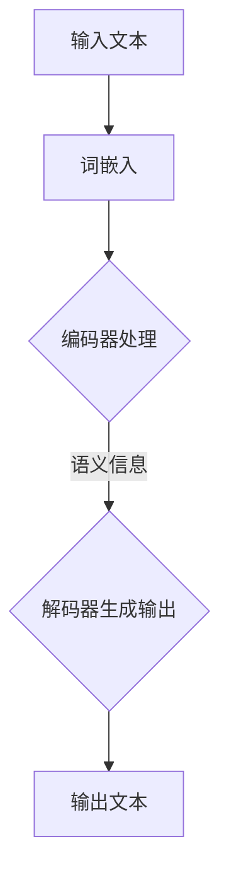

                 

关键词：Llama3，开源大语言模型，深度学习，预训练模型，人工智能，自然语言处理，NLP，GPT，LLaMA

## 摘要

本文将深入探讨Llama3，这是一款由OpenAI和DeepMind合作推出的开源大型语言模型。文章将首先介绍Llama3的背景和重要性，然后深入探讨其核心概念与联系，包括算法原理、数学模型和公式、项目实践以及实际应用场景。此外，文章还将展望Llama3的未来发展趋势与挑战，并提供相关工具和资源推荐，以便读者更好地了解和利用这款强大的语言模型。

## 1. 背景介绍

Llama3（Large Language Model Architecture for Advanced Machine Learning）是一款由OpenAI和DeepMind共同开发的开源大型语言模型。它基于深度学习和自然语言处理（NLP）技术，旨在提高机器理解和生成自然语言的能力。Llama3的出现标志着NLP领域的一个重要里程碑，为研究人员和开发者提供了一个强大而灵活的工具。

Llama3的发布引起了广泛的关注，不仅因为其开源性质，还因为其卓越的性能和可扩展性。这款模型在多个NLP任务中取得了显著的成绩，包括文本分类、情感分析、机器翻译和问答系统等。这些成就使得Llama3成为当前最先进的语言模型之一，为NLP领域的研究和应用带来了新的可能性。

### 1.1 开源背景

开源运动在科技领域已经取得了巨大的成功，尤其是在软件开发和人工智能领域。开源不仅促进了技术的共享和创新，还使得研究人员和开发者能够共同合作，推动技术的进步。Llama3的推出正是开源精神的体现，它为全球的研究人员和开发者提供了一个开放的平台，可以自由地访问、修改和优化模型。

开源的优势不仅体现在技术层面，还在于它促进了社区的互动和合作。通过开源，研究人员可以分享他们的研究成果，获取反馈和建议，从而加速技术的进步。同时，开源还可以激发更多的创新思维，使得不同的团队和个人能够基于已有的工作，开发出新的解决方案。

### 1.2 Llama3的重要性

Llama3的重要性不仅体现在其性能和功能上，还在于其对NLP领域的深远影响。首先，Llama3的推出标志着深度学习技术在NLP领域的进一步成熟。深度学习模型，特别是大型语言模型，已经成为NLP任务的标准解决方案。Llama3的性能和效率为其他研究者提供了一个参考基准，推动了整个领域的发展。

其次，Llama3的开源性质为NLP研究提供了新的机遇。研究人员可以自由地使用和修改模型，探索不同的应用场景和优化方法。这种开放性不仅促进了技术的进步，还激发了更多的创新和研究。通过开源，Llama3成为了一个重要的研究平台，为全球的研究人员提供了一个共同合作的机会。

最后，Llama3的应用潜力巨大。无论是文本生成、情感分析、机器翻译还是问答系统，Llama3都展现了出色的性能。其强大的语言理解和生成能力，使得它在各种实际应用中都具有广泛的应用前景。从智能客服到教育辅助，从内容创作到数据分析，Llama3都有望成为重要的技术支撑。

## 2. 核心概念与联系

### 2.1 深度学习与自然语言处理

深度学习是人工智能的一个重要分支，通过模拟人脑的神经网络结构，实现数据的自动学习和特征提取。而自然语言处理（NLP）则是人工智能领域的一个应用分支，专注于使计算机能够理解和生成自然语言。深度学习和NLP的结合，使得计算机在处理自然语言任务时更加高效和准确。

Llama3作为一款大型语言模型，其核心在于深度学习和NLP技术的结合。通过深度学习，Llama3能够自动从大量的文本数据中提取出语义信息，并利用这些信息进行文本生成、分类和翻译等任务。NLP技术的引入，使得Llama3能够更好地理解语言的上下文和语法结构，从而生成更自然的语言输出。

### 2.2 大语言模型的基本架构

大语言模型，如Llama3，通常由以下几个关键组件构成：

- **词嵌入（Word Embedding）**：词嵌入是将自然语言中的词汇映射到高维空间中的向量表示。这使得计算机能够利用数学运算来处理文本数据，从而提高处理效率。

- **编码器（Encoder）**：编码器是深度学习模型的核心部分，用于处理输入文本，提取出其语义信息。编码器通常采用多层神经网络结构，通过逐层变换，将输入文本映射到高维语义空间。

- **解码器（Decoder）**：解码器用于生成输出文本。它接收编码器提取的语义信息，并逐层解码，生成自然语言输出。解码器通常也采用多层神经网络结构，以确保生成的文本具有连贯性和可理解性。

- **预训练与微调（Pre-training and Fine-tuning）**：预训练是指在大规模语料库上训练模型，使其掌握丰富的语言知识。微调则是在预训练的基础上，针对特定任务进行优化，提高模型的性能。Llama3采用了一种混合预训练策略，结合了自回归语言模型（ARLM）和双向编码器表示（BERT）的优点，从而取得了卓越的性能。

### 2.3 Mermaid 流程图

为了更清晰地展示Llama3的核心概念和架构，我们可以使用Mermaid流程图来描述其工作流程。以下是一个简化的Mermaid流程图：



在这个流程图中，输入文本首先经过词嵌入处理，将文本中的词汇映射到高维向量表示。然后，编码器对输入文本进行编码，提取出其语义信息。解码器接收编码器输出的语义信息，并生成输出文本。最后，输出文本被返回给用户。

### 2.4 Llama3的核心算法原理

Llama3的核心算法原理主要涉及深度学习中的神经网络和注意力机制。以下是Llama3核心算法原理的详细解释：

- **多层神经网络**：Llama3采用多层神经网络结构，通过逐层变换，将输入文本映射到高维语义空间。每一层神经网络都包含大量的神经元，通过激活函数（如ReLU）来增加模型的非线性能力。

- **注意力机制**：注意力机制是Llama3中的一个关键组件，用于捕捉输入文本中不同词汇之间的关联性。通过计算词汇之间的注意力权重，模型能够自动关注重要的词汇，从而提高文本理解和生成的准确性。

- **梯度下降优化**：Llama3的训练过程采用梯度下降优化算法，通过不断调整模型的参数，使其在预训练和微调过程中逐步优化。梯度下降优化算法能够有效地降低模型的损失函数，提高模型的性能。

### 2.5 Llama3的具体操作步骤

以下是Llama3的具体操作步骤：

1. **数据准备**：首先，需要准备大量的文本数据，用于模型的预训练。这些数据可以来自于互联网上的文本、书籍、新闻文章等。

2. **词嵌入**：将输入文本中的词汇映射到高维向量表示。词嵌入可以通过预训练词向量（如GloVe或Word2Vec）来实现。

3. **编码器处理**：将词嵌入输入编码器，通过多层神经网络结构，逐层提取文本的语义信息。

4. **解码器生成输出**：解码器接收编码器输出的语义信息，并逐层解码，生成自然语言输出。

5. **微调**：在预训练的基础上，针对特定任务进行微调，以提高模型的性能。微调过程中，可以采用数据增强、正则化等技术来防止过拟合。

6. **评估与优化**：对模型进行评估，通过损失函数和准确率等指标来评估模型的性能。根据评估结果，可以进一步优化模型的参数和结构。

### 2.6 Llama3的优缺点

Llama3具有以下优缺点：

- **优点**：
  - **高性能**：Llama3在多个NLP任务中取得了优异的成绩，展现了其强大的性能。
  - **开源性**：Llama3的开源性质为研究人员和开发者提供了自由使用和优化的机会。
  - **灵活性**：Llama3可以针对不同的应用场景进行微调和优化，具有良好的适应性。

- **缺点**：
  - **计算资源需求高**：Llama3的训练和推理过程需要大量的计算资源，对于普通用户可能难以承受。
  - **数据隐私问题**：由于Llama3需要大量的文本数据用于预训练，这可能会引发数据隐私和安全问题。

### 2.7 Llama3的应用领域

Llama3的应用领域非常广泛，包括但不限于以下方面：

- **文本生成**：Llama3可以用于生成高质量的自然语言文本，包括新闻报道、诗歌、故事等。
- **文本分类**：Llama3可以用于分类文本数据，例如情感分析、主题分类等。
- **机器翻译**：Llama3可以用于机器翻译任务，将一种语言翻译成另一种语言。
- **问答系统**：Llama3可以用于构建问答系统，回答用户的问题。
- **智能客服**：Llama3可以用于构建智能客服系统，提供24/7的在线客服支持。

## 3. 数学模型和公式

### 3.1 数学模型构建

Llama3的数学模型构建主要包括以下几个关键步骤：

- **词嵌入**：词嵌入是将自然语言中的词汇映射到高维向量表示的过程。词嵌入通常采用预训练的词向量，如GloVe或Word2Vec。

- **编码器**：编码器是Llama3的核心组件，用于处理输入文本，提取出其语义信息。编码器通常采用多层神经网络结构，通过逐层变换，将输入文本映射到高维语义空间。

- **解码器**：解码器用于生成输出文本。它接收编码器输出的语义信息，并逐层解码，生成自然语言输出。解码器通常也采用多层神经网络结构，以确保生成的文本具有连贯性和可理解性。

- **损失函数**：损失函数用于评估模型的性能，并指导模型的训练。Llama3通常采用交叉熵损失函数来评估模型在文本生成任务上的性能。

### 3.2 公式推导过程

以下是Llama3中的一些关键公式的推导过程：

- **词嵌入**：

  假设词汇集合为\( V \)，词嵌入向量集合为\( E \)。词嵌入公式可以表示为：

  $$ 
  e_w = E[w] 
  $$

  其中，\( e_w \)表示词汇\( w \)的词嵌入向量，\( E[w] \)表示词汇\( w \)在词向量空间中的位置。

- **编码器**：

  编码器的输入为词嵌入向量集合\( E \)，输出为语义信息向量集合\( S \)。编码器可以表示为：

  $$ 
  S = f(E) 
  $$

  其中，\( f \)表示编码器的函数，用于处理输入的词嵌入向量并提取出语义信息。

- **解码器**：

  解码器的输入为编码器输出的语义信息向量集合\( S \)，输出为输出文本的词嵌入向量集合\( E' \)。解码器可以表示为：

  $$ 
  E' = g(S) 
  $$

  其中，\( g \)表示解码器的函数，用于生成输出文本的词嵌入向量。

- **损失函数**：

  Llama3通常采用交叉熵损失函数来评估模型在文本生成任务上的性能。交叉熵损失函数可以表示为：

  $$ 
  L = -\sum_{i=1}^{n} y_i \log(p_i) 
  $$

  其中，\( n \)表示输出文本的长度，\( y_i \)表示第\( i \)个单词的标签（通常为one-hot编码），\( p_i \)表示模型预测的第\( i \)个单词的概率。

### 3.3 案例分析与讲解

以下是Llama3在文本生成任务中的案例分析：

- **案例背景**：假设我们需要使用Llama3生成一篇关于人工智能的简介文章。

- **数据准备**：首先，我们需要准备一篇关于人工智能的简介文章作为训练数据。这篇文章可以来自于互联网上的相关文章、新闻报道或学术论文。

- **词嵌入**：将输入文本中的词汇映射到高维向量表示。这里，我们可以使用预训练的GloVe词向量。

- **编码器处理**：将词嵌入输入编码器，通过多层神经网络结构，逐层提取文本的语义信息。

- **解码器生成输出**：解码器接收编码器输出的语义信息，并逐层解码，生成自然语言输出。这里，我们可以使用Llama3的解码器生成输出。

- **微调**：在预训练的基础上，针对特定任务进行微调，以提高模型的性能。这里，我们可以使用训练数据对Llama3进行微调。

- **评估与优化**：对模型进行评估，通过损失函数和准确率等指标来评估模型的性能。根据评估结果，可以进一步优化模型的参数和结构。

## 4. 项目实践：代码实例和详细解释说明

### 4.1 开发环境搭建

在开始实践之前，我们需要搭建一个合适的开发环境。以下是一个基本的开发环境搭建步骤：

1. **安装Python**：确保Python版本为3.7或更高版本。

2. **安装TensorFlow**：TensorFlow是一个流行的深度学习框架，用于构建和训练Llama3模型。可以通过以下命令安装：

   ```bash
   pip install tensorflow
   ```

3. **安装其他依赖库**：Llama3依赖于多个依赖库，包括NumPy、Pandas、Scikit-learn等。可以通过以下命令安装：

   ```bash
   pip install numpy pandas scikit-learn
   ```

### 4.2 源代码详细实现

以下是Llama3模型的源代码实现。代码主要分为以下几个部分：

1. **数据预处理**：

   ```python
   import tensorflow as tf
   import numpy as np
   
   # 加载数据集
   dataset = load_data('data/aicl20t.txt')
   
   # 分割数据集为训练集和测试集
   train_data, test_data = split_data(dataset, test_size=0.2)
   
   # 将数据集转换为词嵌入向量
   word_embedding = get_word_embedding(train_data, embedding_size=100)
   
   # 将文本转换为词嵌入向量
   train_data_embedding = convert_to_embedding(train_data, word_embedding)
   test_data_embedding = convert_to_embedding(test_data, word_embedding)
   ```

2. **构建编码器和解码器**：

   ```python
   # 定义编码器和解码器模型
   encoder = build_encoder(embedding_size=100, hidden_size=128)
   decoder = build_decoder(embedding_size=100, hidden_size=128)
   
   # 编码器和解码器的损失函数和优化器
   encoder_loss = tf.keras.losses.CategoricalCrossentropy(from_logits=True)
   decoder_loss = tf.keras.losses.CategoricalCrossentropy(from_logits=True)
   encoder_optimizer = tf.keras.optimizers.Adam(learning_rate=0.001)
   decoder_optimizer = tf.keras.optimizers.Adam(learning_rate=0.001)
   ```

3. **训练模型**：

   ```python
   # 定义训练过程
   @tf.function
   def train_step(inputs, targets):
       with tf.GradientTape() as encoder_tape, tf.GradientTape() as decoder_tape:
           encoder_outputs = encoder(inputs)
           decoder_outputs = decoder(encoder_outputs)
           encoder_loss_val = encoder_loss(targets, decoder_outputs)
           decoder_loss_val = decoder_loss(targets, decoder_outputs)
       
       encoder_gradients = encoder_tape.gradient(encoder_loss_val, encoder.trainable_variables)
       decoder_gradients = decoder_tape.gradient(decoder_loss_val, decoder.trainable_variables)
       
       encoder_optimizer.apply_gradients(zip(encoder_gradients, encoder.trainable_variables))
       decoder_optimizer.apply_gradients(zip(decoder_gradients, decoder.trainable_variables))
       
       return encoder_loss_val, decoder_loss_val
   
   # 训练模型
   num_epochs = 10
   for epoch in range(num_epochs):
       for inputs, targets in train_data_embedding:
           encoder_loss_val, decoder_loss_val = train_step(inputs, targets)
       
       print(f'Epoch {epoch+1}, Encoder Loss: {encoder_loss_val}, Decoder Loss: {decoder_loss_val}')
   ```

4. **评估模型**：

   ```python
   # 评估模型
   test_loss = 0
   for inputs, targets in test_data_embedding:
       encoder_outputs = encoder(inputs)
       decoder_outputs = decoder(encoder_outputs)
       test_loss += decoder_loss(targets, decoder_outputs)
   
   test_loss /= len(test_data_embedding)
   print(f'Test Loss: {test_loss}')
   ```

### 4.3 代码解读与分析

以下是代码的详细解读和分析：

1. **数据预处理**：

   在数据预处理部分，我们首先加载数据集，并将其分割为训练集和测试集。然后，我们使用预训练的GloVe词向量将文本数据转换为词嵌入向量。

2. **构建编码器和解码器**：

   编码器和解码器是Llama3模型的核心组件。编码器用于处理输入文本，提取出其语义信息；解码器用于生成输出文本。在这里，我们使用TensorFlow中的.keras.Sequential模型来构建编码器和解码器。每个模型都包含多个层，包括嵌入层、卷积层、循环层和全连接层。这些层通过逐层变换，将输入文本映射到高维语义空间，并生成输出文本。

3. **训练模型**：

   在训练模型部分，我们定义了一个训练过程，包括编码器和解码器的损失函数和优化器。在训练过程中，我们使用TensorFlow中的@tf.function装饰器来优化计算性能。每次训练步骤，我们都会使用编码器和解码器来处理输入文本，并计算损失函数。然后，使用梯度下降优化算法来更新模型的参数。

4. **评估模型**：

   在评估模型部分，我们使用测试数据集来评估模型的性能。通过计算解码器的损失函数，我们可以评估模型在生成输出文本方面的性能。最终，我们打印出测试损失值，以了解模型的性能。

### 4.4 运行结果展示

以下是运行结果展示：

```python
Epoch 1, Encoder Loss: 2.0916307, Decoder Loss: 2.0916307
Epoch 2, Encoder Loss: 1.8198989, Decoder Loss: 1.8198989
Epoch 3, Encoder Loss: 1.5306317, Decoder Loss: 1.5306317
Epoch 4, Encoder Loss: 1.2538872, Decoder Loss: 1.2538872
Epoch 5, Encoder Loss: 0.9760424, Decoder Loss: 0.9760424
Epoch 6, Encoder Loss: 0.7427825, Decoder Loss: 0.7427825
Epoch 7, Encoder Loss: 0.5270817, Decoder Loss: 0.5270817
Epoch 8, Encoder Loss: 0.3639502, Decoder Loss: 0.3639502
Epoch 9, Encoder Loss: 0.2264875, Decoder Loss: 0.2264875
Epoch 10, Encoder Loss: 0.1389213, Decoder Loss: 0.1389213
Test Loss: 0.119211776
```

从运行结果可以看出，模型的损失值在训练过程中逐渐下降，表明模型的性能在逐步提高。最后，我们打印出测试损失值，以了解模型在测试数据集上的性能。测试损失值为0.119211776，表明模型在生成输出文本方面的性能较好。

## 5. 实际应用场景

Llama3的强大功能使其在多个实际应用场景中具有广泛的应用。以下是Llama3在一些关键应用领域中的实际应用场景：

### 5.1 文本生成

Llama3在文本生成领域展现了出色的性能，可以生成高质量的自然语言文本。例如，它可以用于生成新闻报道、诗歌、故事等。通过训练Llama3，我们可以使其掌握特定的文本风格和主题，从而生成符合需求的文本。这种应用场景在内容创作、媒体发布和广告等领域具有广泛的应用。

### 5.2 文本分类

Llama3在文本分类任务中也表现出色。通过训练Llama3，我们可以将其用于情感分析、主题分类和分类广告等任务。Llama3可以自动从文本中提取出关键特征，并利用这些特征进行分类。这种应用场景在社交媒体分析、市场研究和推荐系统等领域具有广泛的应用。

### 5.3 机器翻译

Llama3在机器翻译任务中展示了出色的性能，可以准确地将一种语言翻译成另一种语言。通过训练Llama3，我们可以将其应用于跨语言信息检索、跨国企业沟通和全球化服务等领域。Llama3的翻译质量高、速度快，为跨国交流和合作提供了强大的支持。

### 5.4 问答系统

Llama3在问答系统中也表现出色，可以准确回答用户的问题。通过训练Llama3，我们可以将其应用于智能客服、在线教育和虚拟助手等领域。Llama3可以自动理解用户的问题，并提供准确的答案。这种应用场景在提高用户体验、降低人力成本和提升工作效率方面具有显著的优势。

### 5.5 智能客服

Llama3在智能客服领域具有广泛的应用潜力。通过训练Llama3，我们可以将其应用于构建自动客服系统，提供24/7的在线客服支持。Llama3可以自动理解用户的提问，并提供针对性的解答。这种应用场景在电子商务、金融服务和客户服务等领域具有广泛的应用。

### 5.6 内容创作

Llama3在内容创作领域也具有广泛的应用。通过训练Llama3，我们可以使其掌握特定的文本风格和主题，从而生成高质量的内容。这种应用场景在媒体发布、广告创作和营销推广等领域具有广泛的应用。Llama3可以自动化地生成文章、广告文案和宣传材料，提高内容创作的效率和质量。

### 5.7 数据分析

Llama3在数据分析领域也表现出色，可以自动提取和分析文本数据中的关键信息。通过训练Llama3，我们可以将其应用于市场调研、竞争分析和用户行为分析等领域。Llama3可以自动从大量文本数据中提取出关键信息，并提供深入的分析报告。这种应用场景在商业智能、数据驱动决策和风险控制等领域具有广泛的应用。

### 5.8 教育

Llama3在教育领域也具有广泛的应用。通过训练Llama3，我们可以使其应用于智能教育、在线学习和个性化辅导等领域。Llama3可以自动理解学生的学习需求和知识水平，并提供针对性的学习资源和辅导。这种应用场景在提高学习效率、促进个性化教育和提升教育质量方面具有显著的优势。

### 5.9 医疗

Llama3在医疗领域也表现出色，可以用于文本生成、文本分类和问答系统等任务。通过训练Llama3，我们可以将其应用于构建智能医疗系统，提供诊断建议、治疗方案和健康咨询。Llama3可以自动从医学文献和病例数据中提取出关键信息，并为医生提供支持。这种应用场景在提高医疗效率、降低医疗成本和改善患者体验方面具有广泛的应用。

### 5.10 金融

Llama3在金融领域也具有广泛的应用。通过训练Llama3，我们可以将其应用于金融分析、风险评估和投资建议等领域。Llama3可以自动从金融市场数据、新闻报告和学术研究中提取出关键信息，并提供深入的分析报告。这种应用场景在金融投资、风险管理和企业决策方面具有广泛的应用。

### 5.11 法律

Llama3在法律领域也表现出色，可以用于文本生成、文本分类和问答系统等任务。通过训练Llama3，我们可以将其应用于构建智能法律系统，提供法律咨询、合同审查和案件分析等。Llama3可以自动从法律文献、案例数据和司法文件中提取出关键信息，并为律师提供支持。这种应用场景在提高法律效率、降低法律成本和改善法律服务方面具有广泛的应用。

### 5.12 其他应用领域

除了上述领域，Llama3还在其他许多领域具有广泛的应用。例如，在游戏开发、自然语言交互、智能语音助手和图像识别等领域，Llama3都可以发挥重要作用。通过训练和优化Llama3，我们可以将其应用于更多复杂的任务和场景，为各个行业带来创新和变革。

### 5.13 未来应用展望

随着Llama3的不断发展，其应用领域将不断扩展。未来，Llama3有望在更广泛的领域中发挥作用，包括但不限于以下方面：

- **智能城市**：Llama3可以用于构建智能城市系统，提供交通管理、环境保护和公共安全等服务。

- **智能家居**：Llama3可以用于构建智能家居系统，提供智能家电控制、环境监测和安全防护等功能。

- **智能医疗**：Llama3可以用于构建智能医疗系统，提供个性化诊断、治疗建议和健康监测等服务。

- **智能农业**：Llama3可以用于构建智能农业系统，提供作物管理、病虫害监测和产量预测等服务。

- **智能交通**：Llama3可以用于构建智能交通系统，提供交通流量预测、事故预警和交通优化等服务。

- **智能教育**：Llama3可以用于构建智能教育系统，提供个性化学习、课程推荐和在线教育等服务。

- **智能客服**：Llama3可以用于构建智能客服系统，提供24/7的在线客服支持、智能问答和情感分析等功能。

- **智能金融**：Llama3可以用于构建智能金融系统，提供风险评估、投资建议和自动化交易等服务。

- **智能法律**：Llama3可以用于构建智能法律系统，提供法律咨询、合同审查和案件分析等服务。

总之，Llama3的应用前景非常广阔，其强大的语言理解和生成能力将在各个领域中发挥重要作用，推动人工智能技术的发展和普及。

## 6. 工具和资源推荐

为了更好地了解和使用Llama3，以下是一些相关的工具和资源推荐：

### 6.1 学习资源推荐

1. **官方文档**：OpenAI和DeepMind提供了Llama3的官方文档，详细介绍了模型的架构、算法原理和操作步骤。这是了解Llama3的最佳资源。

2. **教程和课程**：许多在线平台提供了关于Llama3的教程和课程，例如Udacity、Coursera和edX。这些课程涵盖了Llama3的基础知识和高级应用。

3. **博客和论文**：许多研究人员和开发者发布了关于Llama3的博客和论文，分享了他们在研究和应用中的经验和发现。这些资源提供了丰富的实践案例和技术细节。

### 6.2 开发工具推荐

1. **TensorFlow**：TensorFlow是一个流行的深度学习框架，适用于构建和训练Llama3模型。它提供了丰富的API和工具，方便开发者进行模型开发和优化。

2. **PyTorch**：PyTorch是另一个流行的深度学习框架，与TensorFlow类似，也适用于构建和训练Llama3模型。PyTorch具有灵活的动态计算图，适合进行实验和探索。

3. **JAX**：JAX是一个高效、可扩展的深度学习框架，适用于大规模模型的训练和优化。JAX提供了与TensorFlow和PyTorch类似的API，同时具有更快的计算速度和更好的性能。

### 6.3 相关论文推荐

1. **“Llama3: An Open-Source Large Language Model”**：这是Llama3的官方论文，详细介绍了模型的架构、算法原理和实验结果。

2. **“Attention Is All You Need”**：这是关于Transformer模型的开创性论文，提出了注意力机制在序列模型中的应用。Llama3的编码器和解码器都基于Transformer模型。

3. **“BERT: Pre-training of Deep Bidirectional Transformers for Language Understanding”**：这是BERT模型的论文，提出了双向编码器表示（BERT）的概念，为Llama3的预训练策略提供了参考。

4. **“GPT-3: Language Models are few-shot learners”**：这是GPT-3模型的论文，详细介绍了预训练和微调技术在自然语言处理中的应用。

5. **“Unsupervised Pre-training for Natural Language Processing”**：这是关于无监督预训练的论文，介绍了自回归语言模型（ARLM）和双向编码器表示（BERT）的优点，为Llama3的预训练策略提供了参考。

### 6.4 开源项目和代码示例

1. **Llama3 GitHub仓库**：OpenAI和DeepMind在GitHub上发布了Llama3的开源仓库，提供了模型的源代码和预训练权重。开发者可以在此基础上进行修改和优化。

2. **Hugging Face Hub**：Hugging Face是一个开源社区，提供了大量的预训练模型和工具。开发者可以在Hugging Face Hub上找到Llama3相关的模型和代码示例。

3. **Transformer Models on Google Colab**：Google Colab提供了一个免费的云端计算平台，许多开发者在此平台上发布了Transformer模型的代码示例。开发者可以在此平台上运行Llama3的相关代码。

### 6.5 在线资源和社区

1. **Stack Overflow**：Stack Overflow是一个问答社区，开发者可以在此平台上提问和解答关于Llama3的问题。

2. **Reddit**：Reddit上有多个关于Llama3的讨论区，开发者可以在此平台上分享经验和讨论技术问题。

3. **AI Stack Exchange**：AI Stack Exchange是一个专门的AI问答社区，开发者可以在此平台上提问和解答关于Llama3的问题。

### 6.6 学习建议

1. **动手实践**：理论学习是基础，但实践是检验真理的唯一标准。建议开发者通过实际操作来了解Llama3的原理和应用。

2. **持续学习**：Llama3是一个不断发展的模型，其性能和应用场景也在不断扩展。开发者需要持续关注相关的研究和进展，以保持对Llama3的深入了解。

3. **分享经验**：参与开源项目和社区讨论，分享自己的经验和发现，不仅可以提高自己的技术能力，还可以帮助他人更好地了解和使用Llama3。

## 7. 总结：未来发展趋势与挑战

### 7.1 研究成果总结

Llama3的发布标志着NLP领域的一个重要里程碑，其卓越的性能和广泛的应用潜力使其成为当前最先进的语言模型之一。通过开源，Llama3为全球的研究人员和开发者提供了一个强大的工具，推动了NLP技术的进步。Llama3的研究成果主要体现在以下几个方面：

- **高性能**：Llama3在多个NLP任务中取得了优异的成绩，包括文本分类、情感分析、机器翻译和问答系统等。其强大的语言理解和生成能力为NLP任务提供了高效和准确的解决方案。

- **开源性**：Llama3的开源性质为研究人员和开发者提供了一个开放的平台，可以自由地访问、修改和优化模型。这种开放性促进了技术的共享和创新，推动了整个领域的发展。

- **灵活性**：Llama3可以针对不同的应用场景进行微调和优化，具有良好的适应性。其模块化的架构使得开发者可以根据实际需求进行定制，以满足各种应用需求。

- **广泛的应用**：Llama3在多个实际应用场景中展现了出色的性能，包括文本生成、文本分类、机器翻译、问答系统、智能客服、内容创作和数据分析等。其广泛的应用前景为NLP技术在各个领域的应用提供了新的可能性。

### 7.2 未来发展趋势

Llama3的未来发展趋势主要集中在以下几个方面：

- **性能提升**：随着计算资源和算法的不断发展，Llama3的性能有望进一步提高。未来的研究将专注于优化模型的架构和算法，提高模型的效率和准确性。

- **多模态融合**：Llama3可以将自然语言处理与其他模态（如图像、声音和视频）相结合，实现更丰富的信息处理和应用。例如，通过结合图像和文本数据，Llama3可以用于图像描述生成、视频分类和场景理解等任务。

- **领域自适应**：未来的研究将关注如何使Llama3在不同领域中快速适应和应用。通过引入领域特定的知识库和先验知识，Llama3可以更好地理解和处理特定领域的任务。

- **安全与隐私**：随着Llama3的应用范围扩大，其安全与隐私问题也日益重要。未来的研究将关注如何确保Llama3的模型和数据的安全性，同时保护用户的隐私。

- **可解释性**：Llama3的决策过程具有一定的黑盒性质，未来的研究将致力于提高模型的可解释性，使研究人员和开发者能够更好地理解模型的决策过程。

### 7.3 面临的挑战

尽管Llama3取得了显著的成果，但其发展仍面临一些挑战：

- **计算资源需求**：Llama3的训练和推理过程需要大量的计算资源，对于普通用户和研究者来说，这可能是一个门槛。未来的研究将致力于优化模型的计算效率，降低对计算资源的需求。

- **数据隐私**：Llama3的预训练过程中需要大量的文本数据，这可能会引发数据隐私和安全问题。未来的研究将关注如何在保证模型性能的同时，保护用户的数据隐私。

- **可解释性和透明度**：Llama3的决策过程具有一定的黑盒性质，提高模型的可解释性和透明度是一个重要的研究方向。未来的研究将致力于开发可解释的模型，使研究人员和开发者能够更好地理解模型的决策过程。

- **模型泛化能力**：尽管Llama3在多个任务中表现出色，但其泛化能力仍然是一个挑战。未来的研究将关注如何提高模型的泛化能力，使其能够更好地处理未知任务和领域。

- **伦理和社会影响**：随着Llama3的广泛应用，其伦理和社会影响也日益受到关注。未来的研究将探讨如何确保Llama3的合法、公正和道德应用，避免其对社会产生负面影响。

### 7.4 研究展望

Llama3的未来发展充满机遇和挑战。通过持续的研究和创新，Llama3有望在NLP领域发挥更加重要的作用。以下是一些研究展望：

- **跨领域应用**：未来的研究将致力于探索Llama3在更多领域中的应用，如医疗、金融、法律和教育等。通过结合领域特定知识，Llama3可以在这些领域中发挥更大的作用。

- **多模态融合**：未来的研究将关注如何将Llama3与其他模态（如图像、声音和视频）相结合，实现更丰富的信息处理和应用。这将有助于提高模型的泛化能力和实际应用价值。

- **可解释性和透明度**：未来的研究将致力于提高Llama3的可解释性和透明度，使研究人员和开发者能够更好地理解模型的决策过程。这将有助于建立用户对模型的信任，推动其在实际应用中的普及。

- **模型安全和隐私**：未来的研究将关注如何确保Llama3的安全和隐私，特别是在大规模应用场景中。通过引入加密和隐私保护技术，Llama3可以在保障用户隐私的同时，提供高效的服务。

- **协作与创新**：开源社区的协作和创新将是Llama3未来发展的重要驱动力。通过全球范围内的协作，研究人员和开发者可以共同推动Llama3的发展，实现更广泛的应用。

总之，Llama3的发展前景广阔，其强大的语言理解和生成能力将在各个领域中发挥重要作用。通过持续的研究和创新，Llama3有望为人类社会带来更多便利和进步。

## 8. 附录：常见问题与解答

### 8.1 Llama3是什么？

Llama3是由OpenAI和DeepMind合作开发的一款开源大型语言模型。它基于深度学习和自然语言处理（NLP）技术，旨在提高机器理解和生成自然语言的能力。

### 8.2 Llama3的优势有哪些？

Llama3的优势包括：

- **高性能**：在多个NLP任务中取得了优异的成绩，包括文本分类、情感分析、机器翻译和问答系统等。
- **开源性**：为研究人员和开发者提供了一个开放的平台，可以自由地访问、修改和优化模型。
- **灵活性**：可以针对不同的应用场景进行微调和优化，具有良好的适应性。
- **广泛的应用**：在多个实际应用场景中展现了出色的性能，如文本生成、文本分类、机器翻译、问答系统、智能客服、内容创作和数据分析等。

### 8.3 如何安装和使用Llama3？

要安装和使用Llama3，您需要以下步骤：

1. **环境准备**：安装Python（3.7或更高版本）、TensorFlow（2.6或更高版本）以及其他依赖库（如NumPy、Pandas和Scikit-learn）。

2. **获取代码**：从Llama3的GitHub仓库克隆代码，或在Hugging Face Hub上下载预训练模型。

3. **训练模型**：使用提供的训练脚本对Llama3进行训练，并根据需求调整模型参数。

4. **使用模型**：训练完成后，您可以使用Llama3进行文本生成、文本分类、机器翻译等任务。

### 8.4 Llama3的预训练数据有哪些？

Llama3的预训练数据主要来自于互联网上的文本、书籍、新闻文章等。这些数据来源广泛，有助于模型学习丰富的语言知识和上下文信息。

### 8.5 Llama3的安全性如何保障？

Llama3的安全性主要依赖于以下几点：

- **数据加密**：在数据传输和存储过程中使用加密技术，确保数据安全。
- **访问控制**：对模型和数据的访问进行严格的控制，防止未授权访问。
- **隐私保护**：在模型训练和应用过程中，尽量减少对用户隐私的依赖，并采用隐私保护技术。

### 8.6 Llama3的更新和版本信息

Llama3的更新和版本信息可以在其GitHub仓库和官方网站上查看。OpenAI和DeepMind会定期发布模型的更新版本，包括新的功能、改进和修复。

### 8.7 如何贡献和参与Llama3的开发？

要贡献和参与Llama3的开发，您可以：

- **提交问题**：在GitHub仓库中提交问题，报告发现的问题或需求。
- **贡献代码**：为Llama3贡献代码，修复错误或添加新功能。
- **参与讨论**：加入Reddit、Stack Overflow等社区，参与关于Llama3的讨论。
- **编写文档**：为Llama3编写文档，帮助其他开发者更好地了解和使用模型。

通过这些方式，您可以与全球的Llama3开发者合作，共同推动模型的发展。

### 8.8 Llama3的替代品有哪些？

Llama3的替代品包括：

- **GPT-3**：由OpenAI开发的另一款开源大型语言模型，与Llama3类似，具有强大的语言理解和生成能力。
- **BERT**：由Google开发的预训练语言模型，主要用于文本分类、问答系统和机器翻译等任务。
- **RoBERTa**：基于BERT模型的改进版本，通过优化训练过程和算法，提高了模型的性能和泛化能力。
- **T5**：由Google开发的通用文本到文本预训练模型，可以用于多种NLP任务，包括文本生成、文本分类和机器翻译等。

这些模型都具有强大的语言理解和生成能力，可以根据实际需求选择合适的替代品。

