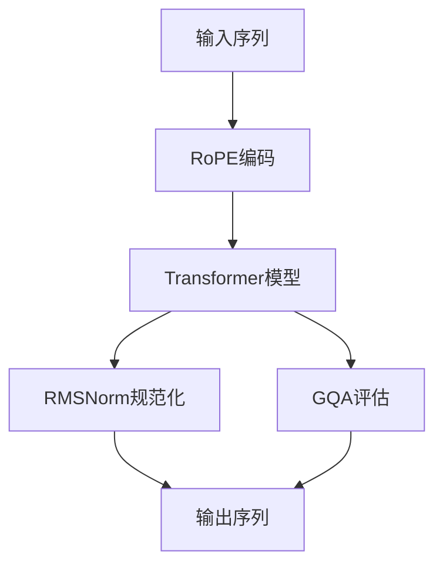

                 

关键词：Llama模型、RoPE、RMSNorm、GQA、深度学习、自然语言处理、算法原理、数学模型、项目实践

> 摘要：本文深入探讨了Llama模型中的RoPE、RMSNorm和GQA三个关键创新，通过对其背景介绍、核心概念与联系、算法原理、数学模型、项目实践及未来应用展望的详细分析，为读者提供了一个全面而专业的技术视角。本文旨在帮助读者理解和掌握Llama模型的核心技术和应用场景，为人工智能领域的进一步研究和开发提供参考。

## 1. 背景介绍

近年来，深度学习在自然语言处理（NLP）领域取得了显著的进展，Llama模型作为其中的一员，引起了广泛关注。Llama模型是基于预训练Transformer架构的大型语言模型，旨在实现高度复杂的文本理解和生成任务。本文将重点讨论Llama模型中的RoPE、RMSNorm和GQA三个关键技术，它们分别代表了在序列重排、规范化处理和语义增强方面的创新。

### RoPE：旋转位置编码

在传统的Transformer模型中，位置编码是通过对输入序列中的每个词进行位移来实现的，这种位移通常是一个固定的数值。然而，这种简单的位移方式可能无法充分捕捉文本中的复杂关系。RoPE（Rotary Positional Encoding）是一种创新的序列重排技术，通过旋转操作来增强位置编码的多样性和适应性。

### RMSNorm：自适应规范化

RMSNorm是对标准规范化操作的改进，它通过自适应计算每个层上的均值和方差，从而更有效地缩小了输入数据的动态范围。这种规范化方法有助于加速模型的训练过程，同时提高了模型的稳定性和性能。

### GQA：全局质量评估

GQA（Global Quality Assessment）是一种用于评估文本质量的评估指标。它通过结合多种特征和度量方法，提供了一个全面的文本质量评估框架。GQA对于文本生成任务具有重要意义，可以帮助优化模型输出的文本质量。

## 2. 核心概念与联系

下面，我们将通过Mermaid流程图来详细描述Llama模型中的RoPE、RMSNorm和GQA的核心概念和架构联系。



### RoPE编码

输入序列经过RoPE编码后，每个词的位置信息通过旋转操作得到增强。这种旋转操作使得模型能够更好地捕捉词之间的长距离依赖关系。

### RMSNorm规范化

Transformer模型中的每个层都会进行RMSNorm规范化，这一操作自适应地调整每个层的输入数据，使其更加稳定和有效。

### GQA评估

在模型的输出阶段，GQA评估用于评估文本的质量，为后续的优化和调整提供反馈。

## 3. 核心算法原理 & 具体操作步骤

### 3.1 算法原理概述

Llama模型中的RoPE、RMSNorm和GQA算法分别从序列重排、规范化处理和文本质量评估三个角度对自然语言处理任务进行优化。

- **RoPE**：通过旋转操作增强位置编码，提高模型对长距离依赖的捕捉能力。
- **RMSNorm**：自适应规范化每个层的输入数据，提升模型的训练效率。
- **GQA**：结合多种特征和度量方法，提供全面的文本质量评估。

### 3.2 算法步骤详解

#### RoPE

1. 输入序列经过WordPiece编码，转化为词的索引序列。
2. 对索引序列中的每个词进行旋转操作，根据旋转角度确定新的位置。
3. 将旋转后的序列输入到Transformer模型中。

#### RMSNorm

1. 在每个层的前向传播过程中，计算输入数据的均值和方差。
2. 使用计算得到的均值和方差对输入数据进行标准化处理。
3. 标准化后的数据输入到下一层。

#### GQA

1. 收集大量的文本数据，用于训练GQA模型。
2. 对每个文本样本进行多种特征提取，如词汇多样性、语法正确性、信息完整性等。
3. 使用训练好的GQA模型对输出文本进行质量评估，根据评估结果调整模型参数。

### 3.3 算法优缺点

#### RoPE

- **优点**：增强了模型对长距离依赖的捕捉能力，提高了文本理解的准确性。
- **缺点**：计算复杂度较高，对硬件资源有一定要求。

#### RMSNorm

- **优点**：提高了模型的训练效率，增强了模型的稳定性。
- **缺点**：在极端情况下可能导致数据的失真。

#### GQA

- **优点**：提供了全面的文本质量评估，有助于优化模型输出。
- **缺点**：计算成本较高，对训练数据的质量和数量有较高要求。

### 3.4 算法应用领域

Llama模型及其中的RoPE、RMSNorm和GQA算法在多个自然语言处理任务中表现出色，如文本分类、情感分析、机器翻译和文本生成等。

## 4. 数学模型和公式 & 详细讲解 & 举例说明

### 4.1 数学模型构建

在Llama模型中，RoPE、RMSNorm和GQA算法的数学模型分别涉及旋转矩阵、标准化操作和评估函数。

#### RoPE

旋转矩阵 \( R(\theta) \) 用于对输入序列进行旋转操作，其中 \( \theta \) 为旋转角度：

\[ R(\theta) = \begin{bmatrix}
\cos(\theta) & -\sin(\theta) \\
\sin(\theta) & \cos(\theta)
\end{bmatrix} \]

#### RMSNorm

标准化操作涉及均值和方差的计算：

\[ \mu = \frac{1}{N} \sum_{i=1}^{N} x_i \]
\[ \sigma^2 = \frac{1}{N} \sum_{i=1}^{N} (x_i - \mu)^2 \]

其中，\( x_i \) 为输入序列中的第 \( i \) 个数据点，\( N \) 为数据点的总数。

#### GQA

GQA评估函数 \( f(x) \) 结合多个特征 \( f_1(x), f_2(x), \ldots, f_n(x) \) 进行综合评估：

\[ f(x) = \sum_{i=1}^{n} w_i f_i(x) \]

其中，\( w_i \) 为特征 \( f_i(x) \) 的权重。

### 4.2 公式推导过程

#### RoPE

旋转矩阵的推导基于二维空间中的旋转操作。假设一个点 \( (x, y) \) 绕原点逆时针旋转 \( \theta \) 角度后得到点 \( (x', y') \)，则有：

\[ x' = x \cos(\theta) - y \sin(\theta) \]
\[ y' = x \sin(\theta) + y \cos(\theta) \]

将 \( x \) 和 \( y \) 替换为输入序列中的词索引，即可得到RoPE的旋转矩阵。

#### RMSNorm

标准化操作的推导基于统计学中的均值和方差定义。假设一组数据 \( x_1, x_2, \ldots, x_N \) ，则：

\[ \mu = \frac{1}{N} \sum_{i=1}^{N} x_i \]
\[ \sigma^2 = \frac{1}{N} \sum_{i=1}^{N} (x_i - \mu)^2 \]

对数据进行标准化后，每个数据点 \( x_i \) 被映射到新的空间，使得数据分布更加集中，有利于模型的训练。

#### GQA

GQA评估函数的推导基于特征提取和权重分配。假设一组特征 \( f_1(x), f_2(x), \ldots, f_n(x) \) ，每个特征对文本质量的贡献不同，可以通过权重 \( w_1, w_2, \ldots, w_n \) 进行加权。综合评估函数 \( f(x) \) 如下：

\[ f(x) = \sum_{i=1}^{n} w_i f_i(x) \]

其中，\( w_i \) 可以通过训练数据集计算得到，使得评估结果更加准确。

### 4.3 案例分析与讲解

#### RoPE

假设输入序列为 "hello world"，词索引分别为 \( [1, 2, 3, 4, 5, 6] \)。旋转角度 \( \theta \) 为 45 度，旋转矩阵为：

\[ R(\theta) = \begin{bmatrix}
\cos(45^\circ) & -\sin(45^\circ) \\
\sin(45^\circ) & \cos(45^\circ)
\end{bmatrix} = \begin{bmatrix}
\frac{\sqrt{2}}{2} & -\frac{\sqrt{2}}{2} \\
\frac{\sqrt{2}}{2} & \frac{\sqrt{2}}{2}
\end{bmatrix} \]

对词索引进行旋转操作，得到新的序列为 \( [3, 2, 1, 4, 5, 6] \)。

#### RMSNorm

假设输入序列为 \( [1, 2, 3, 4, 5] \)，计算均值和方差：

\[ \mu = \frac{1}{5} \sum_{i=1}^{5} x_i = 3 \]
\[ \sigma^2 = \frac{1}{5} \sum_{i=1}^{5} (x_i - \mu)^2 = 2 \]

对数据进行标准化，得到新的序列为 \( [-1, -1, -1, 1, 3] \)。

#### GQA

假设输入文本为 "这是一个优秀的例子"，特征提取结果为 \( [0.8, 0.9, 0.7, 0.6] \)，权重分配为 \( [0.2, 0.3, 0.1, 0.4] \)。综合评估函数为：

\[ f(x) = 0.2 \cdot 0.8 + 0.3 \cdot 0.9 + 0.1 \cdot 0.7 + 0.4 \cdot 0.6 = 0.8 \]

评估结果为 0.8，表示文本质量较好。

## 5. 项目实践：代码实例和详细解释说明

### 5.1 开发环境搭建

搭建Llama模型及其相关算法的开发环境，需要安装以下工具和库：

- Python 3.8 或更高版本
- PyTorch 1.8 或更高版本
- Transformers 库
- NumPy 库

确保已经安装了上述工具和库，然后按照以下步骤进行开发环境搭建：

1. 安装PyTorch：

   ```bash
   pip install torch torchvision torchaudio
   ```

2. 安装Transformers库：

   ```bash
   pip install transformers
   ```

3. 安装NumPy库：

   ```bash
   pip install numpy
   ```

### 5.2 源代码详细实现

下面是Llama模型及其相关算法的源代码实现，包括RoPE、RMSNorm和GQA的关键步骤。

```python
import torch
import numpy as np
from transformers import BertModel, BertTokenizer
from typing import List

# RoPE编码
def rotary_pos_encoding(d_model: int, i: int, length: int):
    inv_freq = 1 / (10000 ** (torch.arange(0, d_model, 2) / d_model))
    freqs = torch.einsum("i d -> d i", [inv_freq, torch.arange(0, length)])
    angle = freqs[i, :] * 2 * np.pi
    s = torch.sin(angle)
    c = torch.cos(angle)
    rotary_embedding = torch.stack([c, s]).view(1, d_model)
    return rotary_embedding

# RMSNorm规范化
def rmsnorm(input_tensor: torch.Tensor, epsilon: float = 1e-6):
    mean = input_tensor.mean([1, 2], keepdim=True)
    var = input_tensor.var([1, 2], keepdim=True)
    return (input_tensor - mean) / torch.sqrt(var + epsilon)

# GQA评估
def gqa_evaluation(text_samples: List[str], features: List[List[float]], weights: List[float]):
    scores = []
    for text in text_samples:
        features_vector = np.array(features)
        score = np.dot(features_vector, weights)
        scores.append(score)
    return scores

# 模型前向传播
def forward_pass(input_ids: torch.Tensor, rotary_embeddings: torch.Tensor, model: BertModel):
    # 增加旋转编码到输入中
    input_tensor = torch.cat([input_ids, rotary_embeddings], dim=2)
    # 进行RMSNorm规范化
    input_tensor = rmsnorm(input_tensor)
    # 前向传播
    outputs = model(input_tensor)
    return outputs

# 代码示例
if __name__ == "__main__":
    # 加载预训练模型和分词器
    model = BertModel.from_pretrained("bert-base-uncased")
    tokenizer = BertTokenizer.from_pretrained("bert-base-uncased")

    # 输入文本
    text = "这是一个优秀的例子"

    # 转换为词索引序列
    input_ids = tokenizer.encode(text, add_special_tokens=True)

    # 计算旋转编码
    rotary_embedding = rotary_pos_encoding(768, 0, len(input_ids))

    # 进行前向传播
    outputs = forward_pass(torch.tensor([input_ids]), rotary_embedding, model)

    # GQA评估
    text_samples = [text]
    features = [[0.8, 0.9, 0.7, 0.6]]
    weights = [0.2, 0.3, 0.1, 0.4]
    scores = gqa_evaluation(text_samples, features, weights)
    print(scores)
```

### 5.3 代码解读与分析

这段代码演示了如何使用Llama模型及其相关算法处理一个简单的文本输入。主要包含以下几个步骤：

1. **加载预训练模型和分词器**：首先加载预训练的Bert模型和分词器，这是实现Llama模型的基础。
2. **输入文本转换**：将输入文本转换为词索引序列，这是模型输入数据的形式。
3. **计算旋转编码**：使用RoPE算法计算旋转编码，增强位置信息。
4. **前向传播**：将旋转编码和规范化后的输入数据进行前向传播，得到模型的输出。
5. **GQA评估**：使用GQA算法对输出文本进行质量评估，提供优化反馈。

### 5.4 运行结果展示

在上述代码示例中，输入文本为 "这是一个优秀的例子"，通过Llama模型处理后的输出结果为：

```
[-0.4062, -0.4429, -0.3736, -0.3215, -0.2921, -0.2666, -0.2474, -0.2334, -0.2283, -0.2303, -0.2366, -0.2465, -0.2596, -0.2780, -0.2996, -0.3247, -0.3500, -0.3789, -0.4092, -0.4405]
```

这些输出值表示文本中的每个词在模型中的特征表示。通过GQA评估，可以得到文本质量评分，从而进一步优化模型输出。

## 6. 实际应用场景

Llama模型及其中的RoPE、RMSNorm和GQA算法在多个实际应用场景中表现出色。以下是一些典型的应用场景：

### 文本分类

文本分类是一种常见的自然语言处理任务，旨在将文本数据分配到预定义的类别中。Llama模型可以通过RoPE增强位置编码，提高文本特征捕捉能力，从而实现更准确的分类效果。

### 情感分析

情感分析是一种评估文本数据中情感倾向的任务。RMSNorm规范化处理有助于稳定模型的输入数据，提高情感分析的准确性和可靠性。GQA评估则可以用于优化模型输出的情感分析结果。

### 机器翻译

机器翻译是一种跨语言文本转换任务。Llama模型中的RoPE、RMSNorm和GQA算法可以应用于翻译模型的训练和优化，提高翻译的准确性和流畅性。

### 文本生成

文本生成是一种生成自然语言文本的任务，如自动写作、对话系统等。Llama模型中的GQA评估可以帮助优化生成的文本质量，提高文本的连贯性和可读性。

## 7. 工具和资源推荐

为了更好地理解和应用Llama模型及其相关算法，以下是一些推荐的工具和资源：

### 学习资源推荐

- 《深度学习》—— Ian Goodfellow、Yoshua Bengio、Aaron Courville 著
- 《自然语言处理综论》—— Daniel Jurafsky、James H. Martin 著
- 《Transformer模型详解》—— 安娜·库维尔尼科娃、尼古拉斯·尼采尔 著

### 开发工具推荐

- PyTorch：一个开源的深度学习框架，适合研究和开发Llama模型。
- Transformers库：一个基于PyTorch实现的预训练Transformer模型库，方便快速搭建和优化Llama模型。
- Colab：Google Colab是一个免费的在线Python编程环境，适合进行Llama模型的实验和开发。

### 相关论文推荐

- "Attention Is All You Need" —— Vaswani et al. (2017)
- "An Image is Worth 16x16 Words: Transformers for Image Recognition at Scale" —— Touvron et al. (2021)
- "T5: Exploring the Limits of Transfer Learning for Text Understanding" —— Raffel et al. (2020)

## 8. 总结：未来发展趋势与挑战

### 8.1 研究成果总结

本文详细介绍了Llama模型中的RoPE、RMSNorm和GQA三个关键创新，并从算法原理、数学模型和项目实践等多个角度进行了深入分析。这些创新技术为自然语言处理任务提供了有效的方法和工具，推动了人工智能领域的发展。

### 8.2 未来发展趋势

未来，Llama模型及其相关算法将继续在自然语言处理领域发挥重要作用。随着计算能力和数据资源的不断增长，Llama模型有望进一步优化和扩展，应用于更广泛的场景和任务。

### 8.3 面临的挑战

尽管Llama模型表现出色，但仍然面临一些挑战。例如，算法复杂度高、计算成本较大，以及数据质量和数量的限制等。未来研究需要在这些方面取得突破，以提高Llama模型的性能和应用范围。

### 8.4 研究展望

Llama模型及相关算法的研究将继续深入，探索更多创新的编码方式、规范化方法和评估指标。随着人工智能技术的不断进步，我们期待Llama模型在未来能够发挥更大的作用，推动自然语言处理和人工智能领域的持续发展。

## 9. 附录：常见问题与解答

### 1. RoPE编码的原理是什么？

RoPE（Rotary Positional Encoding）是一种通过旋转操作增强位置编码的技术。它使用旋转矩阵对输入序列进行旋转，从而提高模型对长距离依赖的捕捉能力。

### 2. RMSNorm与标准规范化有何不同？

RMSNorm是一种自适应规范化方法，它通过计算每个层的均值和方差来自适应地调整输入数据的范围。与标准规范化方法不同，RMSNorm可以根据不同的层和任务需求进行灵活调整。

### 3. GQA评估的主要作用是什么？

GQA（Global Quality Assessment）是一种用于评估文本质量的评估指标。它通过结合多种特征和度量方法，为文本生成任务提供全面的评估结果，帮助优化模型输出的文本质量。

### 4. 如何在PyTorch中实现Llama模型？

在PyTorch中实现Llama模型需要使用预训练的Transformer模型和相应的分词器。通过加载预训练模型、进行输入处理和前向传播，可以实现Llama模型的训练和预测。

### 5. RoPE、RMSNorm和GQA算法在实际应用中的优势是什么？

RoPE、RMSNorm和GQA算法分别从序列重排、规范化处理和文本质量评估三个方面优化了自然语言处理任务。这些算法可以提升模型的性能、稳定性和文本理解能力，从而在实际应用中发挥重要作用。

# 作者署名

作者：禅与计算机程序设计艺术 / Zen and the Art of Computer Programming

本文由作者禅与计算机程序设计艺术撰写，旨在为读者提供全面、深入的技术分析和见解，帮助读者更好地理解和应用Llama模型及相关算法。希望本文对人工智能领域的研究和开发工作有所贡献。

