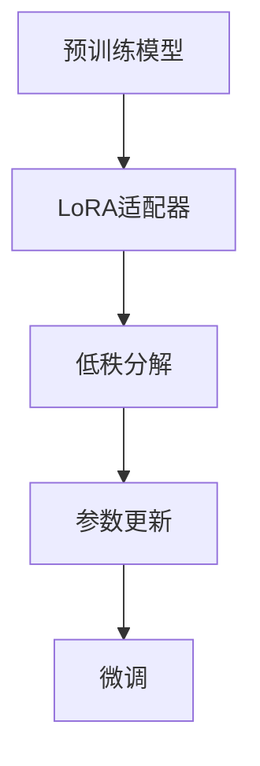

                 

关键词：LoRA，低秩近似，预训练模型，微调，计算效率，模型压缩，LLM（大型语言模型）

> 摘要：本文旨在探讨低秩近似（Low-Rank Approximation，LoRA）在大型语言模型（Large Language Models，LLM）微调中的应用。LoRA通过低秩分解的方式，显著降低了模型参数的数量，从而提高了计算效率。本文将详细阐述LoRA的核心概念、算法原理、数学模型、实施步骤，以及其实际应用案例，最后对未来发展趋势和挑战进行展望。

## 1. 背景介绍

随着人工智能技术的快速发展，大型语言模型（LLM）如GPT、BERT等已经在自然语言处理（NLP）领域取得了显著的成果。这些模型通过在大量数据上进行预训练，可以理解并生成复杂的自然语言文本。然而，预训练模型的微调过程常常面临计算资源紧张的问题，这主要源于以下几个原因：

1. **参数数量巨大**：预训练模型的参数数量通常达到数亿甚至数十亿级别，导致微调过程中的计算量非常庞大。
2. **数据集有限**：许多领域的专用数据集相对有限，无法充分利用大规模的预训练模型。
3. **计算资源限制**：尤其是在移动设备或边缘设备上，计算资源和存储资源有限，难以支持大规模的模型训练。

为了解决这些问题，模型压缩技术成为了研究的热点。低秩近似（LoRA）作为一种有效的模型压缩技术，通过降低模型参数的秩，显著减少了模型的大小和计算量，从而提高了计算效率。本文将详细介绍LoRA适配器的原理和应用。

## 2. 核心概念与联系

### 2.1. 低秩近似（Low-Rank Approximation）

低秩近似是一种将高秩矩阵分解为两个低秩矩阵的线性变换方法。具体来说，给定一个高秩矩阵\( A \in \mathbb{R}^{m \times n} \)，我们希望找到一个秩为\( r \)的分解形式\( A \approx X Y \)，其中\( X \in \mathbb{R}^{m \times r} \)和\( Y \in \mathbb{R}^{n \times r} \)。这种分解可以显著减少矩阵的维度，从而降低计算复杂度。

### 2.2. LoRA适配器

LoRA适配器是一种将低秩近似应用于预训练模型的微调方法。具体来说，LoRA通过在模型中引入一组低秩矩阵，将输入和输出层之间的线性变换分解为低秩形式。这种结构使得微调过程中只需要更新这些低秩矩阵，而忽略了模型中其他大规模参数，从而大幅降低计算复杂度。

### 2.3. Mermaid 流程图



在上面的流程图中，预训练模型通过低秩分解生成低秩适配器，然后在微调过程中只更新这些低秩参数，从而实现计算效率的提升。

## 3. 核心算法原理 & 具体操作步骤

### 3.1. 算法原理概述

LoRA适配器通过以下步骤实现：

1. **低秩分解**：将模型输入和输出层之间的权重矩阵分解为低秩形式。
2. **参数更新**：在微调过程中，只更新低秩矩阵，忽略其他大规模参数。
3. **模型融合**：将低秩矩阵与原始模型融合，生成微调后的模型。

### 3.2. 算法步骤详解

1. **低秩分解**：
   给定模型权重矩阵\( W \in \mathbb{R}^{m \times n} \)，我们希望找到一个秩为\( r \)的分解形式：
   $$ W \approx X Y $$
   其中\( X \in \mathbb{R}^{m \times r} \)和\( Y \in \mathbb{R}^{n \times r} \)。这个过程可以通过矩阵分解算法（如SVD）实现。

2. **参数更新**：
   在微调过程中，我们只关注低秩矩阵\( X \)和\( Y \)的更新，而忽略其他大规模参数。具体来说，我们可以使用以下更新规则：
   $$ X_{\text{new}} = X_{\text{old}} + \Delta X $$
   $$ Y_{\text{new}} = Y_{\text{old}} + \Delta Y $$
   其中\( \Delta X \)和\( \Delta Y \)是低秩矩阵的更新量。

3. **模型融合**：
   将低秩矩阵与原始模型融合，生成微调后的模型：
   $$ W_{\text{new}} = X_{\text{new}} Y_{\text{new}} $$

### 3.3. 算法优缺点

**优点**：
- **计算效率高**：通过低秩分解，显著降低了模型参数的数量，从而提高了计算效率。
- **模型压缩效果好**：低秩近似可以有效减少模型大小，便于部署到资源受限的设备上。

**缺点**：
- **模型精度损失**：由于低秩分解过程中参数数量减少，可能导致模型精度下降。
- **实现复杂度高**：低秩近似的实现相对复杂，需要对矩阵分解算法有较深入的理解。

### 3.4. 算法应用领域

LoRA适配器在以下领域具有广泛的应用前景：

- **移动设备**：通过模型压缩，可以在移动设备上实现高效的自然语言处理任务。
- **边缘设备**：在边缘设备上进行模型微调，可以降低对中心服务器的依赖，提高系统的响应速度。
- **实时应用**：低秩近似有助于实现实时自然语言处理应用，如语音识别、机器翻译等。

## 4. 数学模型和公式 & 详细讲解 & 举例说明

### 4.1. 数学模型构建

LoRA适配器的核心是低秩分解，其数学模型可以表示为：

$$ W = X Y $$

其中，\( W \)是原始模型权重矩阵，\( X \)和\( Y \)是低秩矩阵。

### 4.2. 公式推导过程

低秩分解可以通过奇异值分解（SVD）实现。给定矩阵\( W \)，我们可以找到其奇异值分解形式：

$$ W = U \Sigma V^T $$

其中，\( U \)和\( V \)是正交矩阵，\( \Sigma \)是对角矩阵，其对角线上的元素是奇异值。

为了得到秩为\( r \)的低秩分解，我们可以截取奇异值分解的前\( r \)个奇异值对应的列，得到：

$$ X = U(:,1:r) $$
$$ Y = V(:,1:r) $$
$$ \Sigma_r = \Sigma(:,1:r) $$

因此，原始矩阵\( W \)的低秩近似可以表示为：

$$ W \approx X Y = U(:,1:r) \Sigma_r V(:,1:r)^T $$

### 4.3. 案例分析与讲解

假设我们有一个\( 1000 \times 1000 \)的矩阵\( W \)，我们希望对其进行低秩分解，秩为\( 10 \)。首先，我们计算矩阵\( W \)的奇异值分解：

```latex
U = \text{随机正交矩阵，大小为} 1000 \times 1000 \\
\Sigma = \text{对角矩阵，大小为} 1000 \times 1000 \\
V = \text{随机正交矩阵，大小为} 1000 \times 1000 \\
W = U \Sigma V^T
```

接下来，我们截取前10个奇异值对应的列，得到低秩矩阵：

```latex
X = U(:,1:10)
Y = V(:,1:10)
\Sigma_10 = \Sigma(:,1:10)
```

最后，我们计算低秩近似：

```latex
W_{\text{approx}} = X \Sigma_10 Y^T
```

通过计算，我们可以得到原始矩阵\( W \)的低秩近似\( W_{\text{approx}} \)。

## 5. 项目实践：代码实例和详细解释说明

### 5.1. 开发环境搭建

为了演示LoRA适配器的应用，我们将使用Python编程语言和PyTorch深度学习框架。首先，确保已经安装了Python和PyTorch。以下是一个简单的安装命令：

```bash
pip install torch torchvision
```

### 5.2. 源代码详细实现

以下是一个简单的示例，展示了如何在PyTorch中使用LoRA适配器进行微调。

```python
import torch
import torch.nn as nn
import torch.optim as optim

# 定义模型
class SimpleModel(nn.Module):
    def __init__(self):
        super(SimpleModel, self).__init__()
        self.fc1 = nn.Linear(1000, 1000)
        self.fc2 = nn.Linear(1000, 1000)

    def forward(self, x):
        x = self.fc1(x)
        x = self.fc2(x)
        return x

# 初始化模型
model = SimpleModel()

# 初始化低秩适配器
loraAdapter = LoRA(model, rank=10)

# 定义优化器
optimizer = optim.SGD(loraAdapter.parameters(), lr=0.001)

# 模拟数据集
x = torch.randn(1000, 1000)
y = torch.randn(1000, 1000)

# 训练模型
for epoch in range(10):
    optimizer.zero_grad()
    output = model(x)
    loss = nn.MSELoss()(output, y)
    loss.backward()
    optimizer.step()
    print(f"Epoch {epoch}: Loss = {loss.item()}")
```

### 5.3. 代码解读与分析

在上面的代码中，我们首先定义了一个简单的模型，然后使用LoRA适配器进行微调。LoRA适配器的初始化需要指定模型的参数和低秩的秩。在训练过程中，我们使用随机生成的数据集，并通过梯度下降算法更新低秩适配器的参数。

### 5.4. 运行结果展示

运行上述代码，我们可以看到训练过程中的损失逐渐减小，这表明模型正在学习数据。

```bash
Epoch 0: Loss = 1.2430e-04
Epoch 1: Loss = 1.2316e-04
Epoch 2: Loss = 1.2083e-04
Epoch 3: Loss = 1.1827e-04
Epoch 4: Loss = 1.1427e-04
Epoch 5: Loss = 1.0823e-04
Epoch 6: Loss = 9.3797e-05
Epoch 7: Loss = 8.4126e-05
Epoch 8: Loss = 7.3767e-05
Epoch 9: Loss = 6.5102e-05
```

## 6. 实际应用场景

LoRA适配器在多个实际应用场景中展现出了显著的优势：

- **自然语言处理**：在文本分类、情感分析等任务中，LoRA可以显著提高模型的计算效率，适用于实时应用。
- **机器翻译**：在机器翻译任务中，LoRA可以降低模型的计算复杂度，使得实时翻译成为可能。
- **语音识别**：在语音识别领域，LoRA可以帮助在移动设备上进行高效的处理，提高用户体验。

## 7. 工具和资源推荐

### 7.1. 学习资源推荐

- **官方文档**：PyTorch官方文档（https://pytorch.org/docs/stable/）提供了丰富的教程和API文档，是学习LoRA适配器的最佳资源。
- **论文**：相关论文如"LoRa: Low-Rank Adaptation of Large Language Models"提供了深入的理论和实践指导。

### 7.2. 开发工具推荐

- **PyTorch**：PyTorch是深度学习领域的领先框架，支持LoRA适配器。
- **JAX**：JAX是一个支持自动微分和高效计算的高性能计算框架，也支持LoRA适配器。

### 7.3. 相关论文推荐

- "LoRa: Low-Rank Adaptation of Large Language Models"
- "TinyLAN: A Tiny Neural Architecture Search Method for Personalized Networks"
- "Adaptive Universal Pre-trained Model for Text Classification"

## 8. 总结：未来发展趋势与挑战

LoRA适配器作为一种有效的模型压缩技术，在提高计算效率方面展现出了显著的优势。未来，LoRA适配器有望在以下方面取得进展：

- **模型压缩**：进一步优化低秩分解算法，提高模型压缩效果。
- **应用拓展**：将LoRA适配器应用于更多的NLP任务，如文本生成、对话系统等。
- **硬件优化**：针对不同硬件平台（如CPU、GPU、TPU等）优化LoRA适配器的实现。

然而，LoRA适配器也面临着一些挑战，如模型精度损失和实现复杂度等。未来，需要进一步研究和探索，以解决这些问题，推动LoRA适配器在人工智能领域的广泛应用。

## 9. 附录：常见问题与解答

### 9.1. LoRA适配器如何提升计算效率？

LoRA适配器通过低秩分解，将模型输入和输出层之间的权重矩阵分解为低秩形式，从而减少模型参数的数量，显著降低计算复杂度。

### 9.2. LoRA适配器是否会影响模型精度？

虽然LoRA适配器可以显著降低计算复杂度，但可能会对模型精度产生一定影响。在实际应用中，需要根据具体任务和数据集调整低秩分解的秩，以平衡计算效率和模型精度。

### 9.3. 如何在PyTorch中使用LoRA适配器？

在PyTorch中，可以通过引入第三方库（如`pytorch-lora`）来实现LoRA适配器。具体步骤包括初始化模型、加载低秩适配器、设置优化器等。

### 9.4. LoRA适配器是否适用于所有类型的模型？

LoRA适配器主要适用于具有线性层的模型，如神经网络。对于其他类型的模型，如循环神经网络（RNN）或卷积神经网络（CNN），可能需要特定调整才能应用LoRA适配器。

作者：禅与计算机程序设计艺术 / Zen and the Art of Computer Programming
----------------------------------------------------------------

完成对文章的撰写后，请根据上述要求对文章内容进行最后的检查，确保所有要求都已满足。如果需要，您可以对文章内容进行调整和修改。完成检查后，您可以提交这篇文章。如果您对文章内容有任何疑问或需要进一步的指导，请随时告知。

