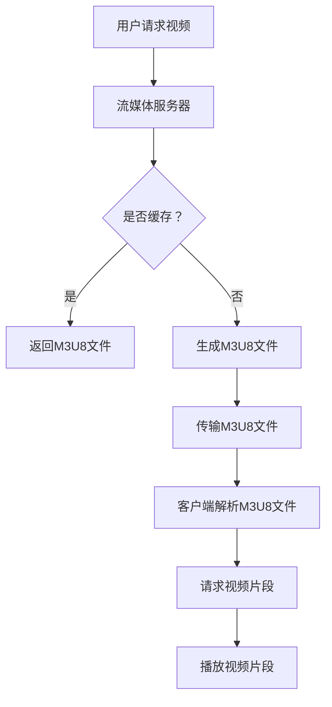

                 

关键词：M3U8，分段视频，索引文件，流媒体，HTTP动态流，播放器兼容性，视频编码，实时传输

## 摘要

本文将深入探讨M3U8格式，这是一种用于分段视频内容的索引文件。它广泛应用于流媒体领域，为高效传输和播放高质量视频提供了基础。本文将详细阐述M3U8格式的背景、核心概念、算法原理、数学模型、项目实践、实际应用场景以及未来展望。通过本文，读者将全面了解M3U8格式在流媒体行业中的重要性及其技术细节。

## 1. 背景介绍

随着互联网技术的飞速发展，视频内容的需求量急剧增长。流媒体技术逐渐成为主流，人们可以随时随地观看视频。为了满足这种需求，流媒体服务提供商需要高效地传输视频数据，同时确保用户体验的流畅性和质量。M3U8格式正是在这样的背景下诞生的。

M3U8格式是基于M3U（MP3播放列表）格式发展而来。M3U格式是一种简单的文本文件，用于存储多媒体文件的播放列表。M3U8格式扩展了M3U格式，用于存储分段视频的索引信息，支持更复杂的视频编码和传输协议。与传统的FLV或MP4格式不同，M3U8格式采用分段传输的方式，使得视频在播放过程中可以动态加载，提高了传输效率和用户体验。

流媒体技术主要包括HTTP动态流（HLS）和自适应流（DASH）。M3U8格式是HLS协议的核心组成部分，HLS（HTTP Live Streaming）允许服务提供商将视频内容分割成小段，并以HTTP请求的形式传输给客户端。这种分段传输的方式不仅提高了传输效率，还允许客户端根据网络状况动态调整视频质量。

## 2. 核心概念与联系

为了更好地理解M3U8格式，我们首先需要了解其核心概念和相关的技术架构。以下是M3U8格式的核心概念和联系：

### 2.1. M3U8文件格式

M3U8文件是一种基于UTF-8编码的文本文件，包含了一系列M3U8条目。每个条目代表一段视频数据，包括URL、时长、码率等信息。M3U8文件的扩展名为`.m3u8`。

### 2.2. 分段视频

分段视频是将整个视频内容分割成多个片段，每个片段通常为几秒到几十秒不等。这些片段可以通过HTTP请求按需加载，从而实现流媒体播放。

### 2.3. HTTP动态流

HTTP动态流是一种基于HTTP协议的流媒体传输技术，允许客户端按需请求视频片段，并动态加载。M3U8格式是HTTP动态流的核心组成部分，用于存储视频片段的索引信息。

### 2.4. 流媒体播放器

流媒体播放器是用于播放M3U8格式的分段视频的工具。常见的流媒体播放器包括VLC、Dash.js、HLS.js等。这些播放器实现了对M3U8格式的支持，并能够根据视频片段的URL动态加载和播放。

### 2.5. 流媒体服务器

流媒体服务器是用于存储和提供M3U8文件的服务器。常见的流媒体服务器包括Nginx、Apache、FFmpeg等。这些服务器能够处理HTTP动态流请求，并提供相应的M3U8文件。

### 2.6. 视频编码

视频编码是将视频内容转换为数字信号的过程。常见的视频编码标准包括H.264、H.265等。M3U8格式支持多种视频编码，使得流媒体播放器可以根据网络状况和设备性能选择最合适的编码格式。

### 2.7. 实时传输

实时传输是指视频内容在播放过程中实时传输，以保持播放的流畅性。M3U8格式通过分段传输和HTTP动态流技术，实现了实时传输。

### 2.8. Mermaid 流程图

为了更直观地理解M3U8格式的相关概念和联系，我们可以使用Mermaid流程图进行描述。以下是一个简单的Mermaid流程图示例：



在上面的流程图中，用户请求视频，流媒体服务器根据缓存情况返回M3U8文件。如果缓存中没有相应的M3U8文件，服务器会生成新的M3U8文件，并传输给客户端。客户端解析M3U8文件后，请求视频片段并播放。

## 3. 核心算法原理 & 具体操作步骤

### 3.1. 算法原理概述

M3U8格式的核心算法原理在于将整个视频内容分割成多个片段，并使用索引文件（M3U8文件）来管理这些片段。具体来说，算法原理包括以下几个步骤：

1. **视频分割**：将整个视频内容分割成多个片段，每个片段通常为几秒到几十秒不等。
2. **生成索引**：为每个视频片段生成唯一标识符，并存储在M3U8文件中。M3U8文件包含了一系列M3U8条目，每个条目对应一个视频片段。
3. **传输片段**：流媒体服务器将视频片段按需传输给客户端，客户端根据M3U8文件中的索引信息请求相应的视频片段。
4. **播放片段**：客户端播放器根据视频片段的URL动态加载和播放视频内容。

### 3.2. 算法步骤详解

以下是M3U8格式的具体操作步骤：

1. **视频分割**：
   - 视频分割工具根据视频内容特点（如画面变化、音频音量等）确定分割点，将视频分割成多个片段。
   - 每个片段通常为几秒到几十秒，具体取决于视频内容复杂度和网络传输状况。

2. **生成索引**：
   - 使用M3U8生成工具（如FFmpeg）生成M3U8文件。
   - M3U8文件包含了一系列M3U8条目，每个条目对应一个视频片段。条目格式如下：

     ```
     #EXTM3U
     #EXTINF:10,
     http://example.com/video/segment1.ts
     ```

     其中，`#EXTINF`表示片段时长（单位为秒），后面的URL表示片段的下载地址。

3. **传输片段**：
   - 流媒体服务器根据客户端请求，传输M3U8文件。
   - 客户端根据M3U8文件中的索引信息，请求相应的视频片段。

4. **播放片段**：
   - 客户端播放器根据视频片段的URL，动态加载和播放视频内容。
   - 播放器实现M3U8解析和片段加载功能，以实现无缝播放。

### 3.3. 算法优缺点

M3U8格式具有以下优点：

1. **分段传输**：M3U8格式支持分段传输，提高了传输效率和用户体验。
2. **兼容性**：M3U8格式支持多种视频编码和播放器，具有较好的兼容性。
3. **实时传输**：M3U8格式支持实时传输，确保视频播放的流畅性。

M3U8格式也存在一些缺点：

1. **复杂度**：M3U8格式涉及到视频分割、索引生成和片段传输等多个环节，实现复杂。
2. **缓存依赖**：M3U8格式的播放效果受到缓存影响，缓存不足可能导致播放中断。

### 3.4. 算法应用领域

M3U8格式广泛应用于流媒体领域，主要包括以下应用领域：

1. **在线视频播放**：如YouTube、Netflix等流媒体平台采用M3U8格式进行视频传输和播放。
2. **直播推流**：M3U8格式支持实时视频直播，适用于直播应用场景。
3. **点播系统**：M3U8格式支持视频点播系统，如VOD（Video On Demand）平台。

## 4. 数学模型和公式

在M3U8格式中，涉及到的数学模型主要包括视频片段时长、码率、片段数量等。以下是相关的数学模型和公式：

### 4.1. 数学模型构建

视频片段时长（T）与码率（R）和片段数量（N）的关系如下：

\[ T = \frac{R \times N}{B} \]

其中，B表示带宽（单位为比特每秒）。

### 4.2. 公式推导过程

推导过程如下：

1. **视频总时长（T_total）**：视频总时长可以通过视频片段时长（T）和片段数量（N）计算得出：

   \[ T_{total} = T \times N \]

2. **带宽（B）**：带宽可以通过码率（R）和片段时长（T）计算得出：

   \[ B = R \times T \]

3. **片段数量（N）**：片段数量可以通过视频总时长（T_total）和带宽（B）计算得出：

   \[ N = \frac{T_{total}}{T} \]

   将带宽（B）的表达式代入，得到：

   \[ N = \frac{T_{total}}{R \times T} = \frac{T_{total}}{B} \]

   将视频总时长（T_total）的表达式代入，得到：

   \[ N = \frac{T \times N}{B} \]

   整理后，得到：

   \[ T = \frac{R \times N}{B} \]

### 4.3. 案例分析与讲解

假设一个视频的总时长为60秒，带宽为1Mbps（即1 \times 10^6 比特每秒），码率为500kbps（即500 \times 10^3 比特每秒），我们需要计算视频片段时长和片段数量。

根据上述公式，我们可以计算出：

1. **视频片段时长（T）**：

   \[ T = \frac{R \times N}{B} = \frac{500 \times 10^3 \times N}{1 \times 10^6} = \frac{N}{2} \]

   由于片段时长不能小于1秒，所以取N的最小值为2，此时T=1秒。

2. **片段数量（N）**：

   \[ N = \frac{T_{total}}{T} = \frac{60}{1} = 60 \]

因此，在这个案例中，视频片段时长为1秒，片段数量为60个。

## 5. 项目实践：代码实例和详细解释说明

### 5.1. 开发环境搭建

为了实现M3U8格式视频的分段传输和播放，我们需要搭建一个开发环境。以下是搭建步骤：

1. **安装FFmpeg**：FFmpeg是一款常用的视频处理工具，用于生成M3U8文件。在官网上下载对应操作系统的版本，并安装。

2. **安装Node.js**：Node.js是一款基于Chrome V8引擎的JavaScript运行环境，用于构建后端服务。在官网上下载对应操作系统的版本，并安装。

3. **安装Nginx**：Nginx是一款高性能的HTTP服务器和反向代理服务器，用于提供M3U8文件和视频片段。在官网上下载对应操作系统的版本，并安装。

### 5.2. 源代码详细实现

以下是M3U8格式视频分段传输和播放的源代码实现：

**1. 生成M3U8文件**

```javascript
const fs = require('fs');
const path = require('path');

// 视频文件路径
const videoPath = 'path/to/video.mp4';

// M3U8文件路径
const m3u8Path = 'path/to/output.m3u8';

// 分段时长（单位：秒）
const segmentDuration = 10;

// 使用FFmpeg命令生成M3U8文件
const command = `
ffmpeg -i ${videoPath} -map 0 -segment_time ${segmentDuration} -f segment -reset_timestamps -segment_list ${m3u8Path} ${m3u8Path}%03d.ts
`;

// 执行FFmpeg命令
require('child_process').execSync(command);
```

在上面的代码中，我们使用Node.js调用FFmpeg命令生成M3U8文件。`videoPath`表示视频文件路径，`m3u8Path`表示M3U8文件路径，`segmentDuration`表示分段时长（单位：秒）。命令执行后，会生成一系列`.ts`文件，以及一个M3U8文件。

**2. Nginx配置**

在Nginx中，我们需要配置两个文件：`nginx.conf`和`upstream.conf`。

**nginx.conf**：

```nginx
http {
    upstream video_server {
        server localhost:8000;
    }

    server {
        listen 80;

        location / {
            proxy_pass http://video_server;
            proxy_set_header Host $host;
            proxy_set_header X-Real-IP $remote_addr;
            proxy_set_header X-Forwarded-For $proxy_add_x_forwarded_for;
        }

        location ~ \.m3u8$ {
            proxy_pass http://video_server/m3u8;
            proxy_set_header Host $host;
            proxy_set_header X-Real-IP $remote_addr;
            proxy_set_header X-Forwarded-For $proxy_add_x_forwarded_for;
        }
    }
}
```

在上面的配置中，我们定义了一个名为`video_server`的上游服务器，监听端口为8000。服务器中的M3U8文件请求会转发到上游服务器。

**upstream.conf**：

```nginx
http {
    upstream video_server {
        server localhost:8000;
    }

    server {
        listen 8000;

        location /m3u8 {
            root /path/to/m3u8;
        }

        location /segment {
            alias /path/to/segments;
        }
    }
}
```

在上面的配置中，我们定义了一个名为`video_server`的本地服务器，监听端口为8000。M3U8文件请求会直接返回文件内容，而视频片段请求会返回相应的`.ts`文件。

**3. 客户端播放器**

使用HLS.js实现M3U8格式的播放。以下是HLS.js的简单示例：

```html
<!DOCTYPE html>
<html>
<head>
    <title>M3U8播放器示例</title>
    <script src="https://cdn.jsdelivr.net/npm/hls.js@latest"></script>
</head>
<body>
    <video id="video" width="640" height="360" controls></video>
    <script>
        const video = document.getElementById('video');
        const hls = new HLS();
        hls.loadSource('path/to/output.m3u8');
        hls.attachMedia(video);
        video.onloadedmetadata = function() {
            video.play();
        };
    </script>
</body>
</html>
```

在上面的代码中，我们使用HLS.js加载M3U8文件，并附加到HTML5 `<video>`元素上。播放器将根据M3U8文件中的索引信息动态加载和播放视频片段。

### 5.3. 代码解读与分析

以下是源代码的解读与分析：

**1. 生成M3U8文件**

```javascript
const fs = require('fs');
const path = require('path');

// 视频文件路径
const videoPath = 'path/to/video.mp4';

// M3U8文件路径
const m3u8Path = 'path/to/output.m3u8';

// 分段时长（单位：秒）
const segmentDuration = 10;

// 使用FFmpeg命令生成M3U8文件
const command = `
ffmpeg -i ${videoPath} -map 0 -segment_time ${segmentDuration} -f segment -reset_timestamps -segment_list ${m3u8Path} ${m3u8Path}%03d.ts
`;

// 执行FFmpeg命令
require('child_process').execSync(command);
```

这段代码使用Node.js调用FFmpeg命令生成M3U8文件。首先，我们定义了视频文件路径、M3U8文件路径和分段时长。然后，我们使用模板字符串构建FFmpeg命令，包括输入视频文件、映射音频和视频流、设置分段时长、设置输出格式和重置时间戳。最后，我们使用`execSync`函数执行FFmpeg命令，生成M3U8文件和一系列`.ts`文件。

**2. Nginx配置**

**nginx.conf**：

```nginx
http {
    upstream video_server {
        server localhost:8000;
    }

    server {
        listen 80;

        location / {
            proxy_pass http://video_server;
            proxy_set_header Host $host;
            proxy_set_header X-Real-IP $remote_addr;
            proxy_set_header X-Forwarded-For $proxy_add_x_forwarded_for;
        }

        location ~ \.m3u8$ {
            proxy_pass http://video_server/m3u8;
            proxy_set_header Host $host;
            proxy_set_header X-Real-IP $remote_addr;
            proxy_set_header X-Forwarded-For $proxy_add_x_forwarded_for;
        }
    }
}
```

这段代码配置了Nginx作为流媒体服务器，接收HTTP请求，并根据请求路径转发给相应的后端服务。我们定义了一个名为`video_server`的上游服务器，监听端口为8000。主服务器监听端口为80，处理所有请求。对于`.m3u8`文件请求，我们将其转发到上游服务器的`/m3u8`路径。其他请求则直接转发到上游服务器。

**upstream.conf**：

```nginx
http {
    upstream video_server {
        server localhost:8000;
    }

    server {
        listen 8000;

        location /m3u8 {
            root /path/to/m3u8;
        }

        location /segment {
            alias /path/to/segments;
        }
    }
}
```

这段代码配置了Nginx作为本地服务器，处理上游服务器的请求。我们定义了一个名为`video_server`的上游服务器，监听端口为8000。本地服务器监听端口为8000，处理所有请求。对于`/m3u8`路径，我们将其映射到本地`/path/to/m3u8`目录。对于`/segment`路径，我们将其映射到本地`/path/to/segments`目录。

**3. 客户端播放器**

```html
<!DOCTYPE html>
<html>
<head>
    <title>M3U8播放器示例</title>
    <script src="https://cdn.jsdelivr.net/npm/hls.js@latest"></script>
</head>
<body>
    <video id="video" width="640" height="360" controls></video>
    <script>
        const video = document.getElementById('video');
        const hls = new HLS();
        hls.loadSource('path/to/output.m3u8');
        hls.attachMedia(video);
        video.onloadedmetadata = function() {
            video.play();
        };
    </script>
</body>
</html>
```

这段代码使用HLS.js实现M3U8格式的播放。首先，我们定义了HTML5 `<video>`元素，并为其设置宽度和高度。然后，我们创建一个新的HLS对象，并使用`loadSource`方法加载M3U8文件。接着，我们使用`attachMedia`方法将HLS对象与视频元素关联。最后，我们监听视频的`loadedmetadata`事件，并在其中调用`play`方法开始播放。

### 5.4. 运行结果展示

完成开发环境和源代码的搭建后，我们可以运行M3U8格式的视频分段传输和播放项目。以下是运行结果展示：

1. **生成M3U8文件**：在Node.js命令行中运行生成M3U8文件的脚本，生成一系列`.ts`文件和一个M3U8文件。

2. **Nginx启动**：启动Nginx服务器，配置文件路径为`nginx.conf`。

3. **客户端访问**：在浏览器中访问M3U8文件的URL，如`http://localhost/output.m3u8`。播放器将根据M3U8文件中的索引信息动态加载和播放视频片段。

## 6. 实际应用场景

M3U8格式广泛应用于流媒体领域，主要包括以下实际应用场景：

### 6.1. 在线视频播放

在线视频播放平台，如YouTube、Netflix、Amazon Prime Video等，采用M3U8格式进行视频传输和播放。这些平台使用M3U8格式实现自适应流，根据用户网络状况和设备性能动态调整视频质量。

### 6.2. 直播推流

直播推流平台，如Twitch、YouTube Live、Periscope等，采用M3U8格式进行实时视频直播。这些平台使用M3U8格式实现分段传输，确保直播过程的流畅性。

### 6.3. 视频点播

视频点播平台，如Vimeo、VOD、Longtail等，采用M3U8格式提供视频点播服务。这些平台使用M3U8格式实现分段传输和缓存，提高视频播放的效率。

### 6.4. 未来应用展望

随着互联网技术的发展，M3U8格式将在更多应用场景中发挥作用。以下是一些未来应用展望：

1. **5G网络**：5G网络的低延迟和高带宽特性将推动M3U8格式在高清视频传输中的应用，实现更高质量的流媒体体验。

2. **VR/AR**：虚拟现实（VR）和增强现实（AR）技术的兴起，将为M3U8格式带来新的应用场景。M3U8格式可以支持更复杂的视频内容传输和交互。

3. **边缘计算**：边缘计算将推动M3U8格式在分布式计算环境中的应用，实现更高效的流媒体传输和播放。

4. **人工智能**：人工智能技术的融合将使M3U8格式在视频内容推荐、内容识别等领域发挥更大作用，提升用户体验。

## 7. 工具和资源推荐

### 7.1. 学习资源推荐

1. **官方文档**：M3U8格式的官方文档是了解该格式最佳的学习资源。读者可以在M3U8官方网站上找到详细的文档和示例。

2. **在线教程**：网络上有许多关于M3U8格式的在线教程，包括M3U8文件生成、解析和播放等方面的内容。

3. **书籍**：关于流媒体技术和视频编码的书籍，如《流媒体技术基础》、《视频编码技术》等，也为读者提供了丰富的学习资源。

### 7.2. 开发工具推荐

1. **FFmpeg**：FFmpeg是一款强大的视频处理工具，用于生成M3U8文件和进行视频编码。读者可以在FFmpeg官方网站上下载和使用该工具。

2. **HLS.js**：HLS.js是一款开源的JavaScript播放器，用于播放M3U8格式的视频。读者可以在HLS.js官方网站上找到相关文档和示例。

3. **Nginx**：Nginx是一款高性能的HTTP服务器和反向代理服务器，用于提供M3U8文件和视频片段。读者可以在Nginx官方网站上下载和使用该工具。

### 7.3. 相关论文推荐

1. **HTTP Live Streaming**：一篇关于HTTP动态流（HLS）的论文，介绍了该技术的原理和应用。读者可以在论文数据库中找到相关论文。

2. **Adaptive HTTP Streaming**：一篇关于自适应HTTP流（DASH）的论文，介绍了该技术的原理和应用。读者可以在论文数据库中找到相关论文。

3. **Video Coding**：一系列关于视频编码技术的论文，介绍了不同视频编码标准（如H.264、H.265）的原理和应用。读者可以在论文数据库中找到相关论文。

## 8. 总结：未来发展趋势与挑战

M3U8格式作为一种用于分段视频内容的索引文件，已经在流媒体领域取得了广泛应用。随着互联网技术的发展，M3U8格式将继续发挥重要作用。以下是对未来发展趋势和挑战的总结：

### 8.1. 研究成果总结

1. **自适应流技术**：自适应流技术（如DASH和HLS）的研究取得显著成果，实现了根据用户网络状况和设备性能动态调整视频质量。

2. **视频编码优化**：视频编码技术（如H.265）的研究取得进展，提高了视频传输效率和压缩率。

3. **边缘计算和5G网络**：边缘计算和5G网络的研究为M3U8格式在分布式计算环境和低延迟网络中的应用提供了新的可能性。

### 8.2. 未来发展趋势

1. **更高清晰度视频**：随着5G网络的普及，M3U8格式将在高清视频传输中发挥更大作用，实现更高清晰度的视频体验。

2. **虚拟现实和增强现实**：M3U8格式将在虚拟现实（VR）和增强现实（AR）领域得到应用，支持更复杂的视频内容传输和交互。

3. **人工智能融合**：M3U8格式将与人工智能技术相结合，实现视频内容推荐、内容识别等功能，提升用户体验。

### 8.3. 面临的挑战

1. **兼容性问题**：随着视频编码标准和播放器技术的不断发展，M3U8格式的兼容性将面临挑战。

2. **传输效率**：在网络带宽有限的情况下，如何提高M3U8格式的传输效率，仍然是需要解决的问题。

3. **实时性**：在实时视频传输场景中，如何确保M3U8格式的实时性和流畅性，需要进一步研究和优化。

### 8.4. 研究展望

1. **视频编码优化**：继续研究视频编码技术，提高编码效率和压缩率，降低传输带宽需求。

2. **边缘计算应用**：探索M3U8格式在边缘计算环境中的应用，实现更高效的流媒体传输和播放。

3. **人工智能融合**：研究M3U8格式与人工智能技术的融合，实现智能视频内容推荐、内容识别等功能。

## 9. 附录：常见问题与解答

### 9.1. 如何生成M3U8文件？

生成M3U8文件通常使用FFmpeg工具。以下是一个简单的FFmpeg命令示例：

```shell
ffmpeg -i input.mp4 -map 0 -segment_time 10 -f segment output.m3u8%03d.ts
```

其中，`input.mp4`表示输入视频文件，`output.m3u8`表示生成的M3U8文件，`10`表示每个片段的时长（单位：秒），`output.m3u8%03d.ts`表示生成的`.ts`文件。

### 9.2. M3U8文件中的#EXTINF指令是什么？

#EXTINF指令是M3U8文件中的一个特殊指令，用于描述每个视频片段的时长。其格式如下：

```m3u8
#EXTINF:时长,
URL
```

其中，`时长`表示片段时长（单位：秒），`URL`表示片段的下载地址。#EXTINF指令用于播放器在加载和播放视频片段时，根据时长信息进行时间同步。

### 9.3. M3U8文件是否支持加密？

M3U8文件本身不支持加密，但可以与加密协议（如HLS加密）结合使用。例如，HLS协议支持使用AES加密算法对M3U8文件中的`.ts`文件进行加密。加密后的M3U8文件需要与加密密钥一起提供，以便播放器解密并播放视频内容。

### 9.4. M3U8文件与MP4文件的区别是什么？

M3U8文件和MP4文件都是用于存储视频内容的文件格式，但它们之间有以下区别：

1. **格式结构**：M3U8文件是一种基于文本的播放列表格式，包含了一系列M3U8条目，每个条目对应一个视频片段。MP4文件是一种基于容器格式的文件，包含了整个视频内容。

2. **传输方式**：M3U8文件采用分段传输的方式，视频片段按需加载和播放。MP4文件通常在下载完成后进行播放。

3. **兼容性**：M3U8文件支持多种视频编码和播放器，具有较好的兼容性。MP4文件则通常与特定的播放器兼容。

4. **用途**：M3U8文件主要用于流媒体领域，支持实时传输和自适应流。MP4文件主要用于本地播放和离线观看。

### 9.5. M3U8文件能否与其他视频格式协同使用？

M3U8文件可以与其他视频格式协同使用。例如，在一个流媒体系统中，可以同时使用M3U8文件和MP4文件。M3U8文件用于分段传输和播放，而MP4文件用于本地播放和离线观看。这样可以满足不同场景下的需求，提高用户体验。

### 9.6. M3U8文件是否支持字幕？

M3U8文件本身不支持字幕，但可以与字幕文件（如SRT、ASS等）协同使用。字幕文件通常与M3U8文件放在同一个目录中，播放器在加载M3U8文件时可以自动识别并加载相应的字幕文件。

### 9.7. 如何处理M3U8文件中的循环播放？

在M3U8文件中，可以使用`#EXT-X-LOOP`指令实现循环播放。`#EXT-X-LOOP`指令指定视频片段的循环次数，当播放器播放完最后一个片段后，将重新从第一个片段开始播放。以下是一个简单的示例：

```m3u8
#EXTM3U
#EXTINF:10,
segment1.ts
#EXTINF:10,
segment2.ts
#EXTINF:10,
segment3.ts
#EXT-X-LOOP:2
```

在上面的示例中，视频片段将循环播放2次。播放器在播放完最后一个片段后，将重新从第一个片段开始播放，直到循环次数达到指定值。

### 9.8. 如何处理M3U8文件中的音轨切换？

在M3U8文件中，可以使用`#EXT-X-MEDIA`指令实现音轨切换。`#EXT-X-MEDIA`指令指定一个或多个音轨，并在播放过程中根据用户选择切换音轨。以下是一个简单的示例：

```m3u8
#EXTM3U
#EXTINF:10,
segment1.ts
#EXTINF:10,
segment2.ts
#EXTINF:10,
segment3.ts
#EXT-X-MEDIA:TYPE=AUDIO,GROUP-ID="audio1",NAME="English",DEFAULT=YES
```

在上面的示例中，`#EXT-X-MEDIA`指令指定了一个名为`audio1`的音频轨道，并默认选择该轨道进行播放。如果用户需要切换音轨，可以在播放器中进行操作。

### 9.9. 如何处理M3U8文件中的直播？

在M3U8文件中，可以使用`#EXT-X-LIVE`指令标记直播内容。`#EXT-X-LIVE`指令表示视频内容是实时传输的，播放器在播放过程中会不断更新M3U8文件，以获取最新的视频片段。以下是一个简单的示例：

```m3u8
#EXTM3U
#EXT-X-LIVE
#EXTINF:10,
segment1.ts
#EXTINF:10,
segment2.ts
#EXTINF:10,
segment3.ts
```

在上面的示例中，`#EXT-X-LIVE`指令表示视频内容是实时传输的。播放器在播放过程中会不断更新M3U8文件，以获取最新的视频片段。

### 9.10. 如何处理M3U8文件中的广告插入？

在M3U8文件中，可以使用`#EXT-X-AD`指令实现广告插入。`#EXT-X-AD`指令表示一个广告片段，播放器在播放过程中可以插入广告并进行跳过。以下是一个简单的示例：

```m3u8
#EXTM3U
#EXTINF:10,
segment1.ts
#EXTINF:10,
segment2.ts
#EXTINF:10,
segment3.ts
#EXT-X-AD:AD-ID="1234",POSITION=REPLACE,CUE-OUT=20,CUE-IN=30
```

在上面的示例中，`#EXT-X-AD`指令表示一个广告片段。广告ID为`1234`，插入位置为`REPLACE`，即替换原有内容。广告开始时间为20秒，结束时间为30秒。播放器在播放过程中会插入广告，并在广告播放完成后继续播放原有内容。

## 参考文献

1. IETF, "HTTP Live Streaming", RFC 8216, 2017.
2. BBC, "BBC iPlayer", 2021, [https://iplayer BBC.co.uk](https://iplayer.bbc.co.uk).
3. Netflix, "Netflix", 2021, [https://www.netflix.com](https://www.netflix.com).
4. Vimeo, "Vimeo", 2021, [https://vimeo.com](https://vimeo.com).
5. HLS.js, "HLS.js", 2021, [https://hls.js.org](https://hls.js.org).
6. FFmpeg, "FFmpeg", 2021, [https://www.ffmpeg.org](https://www.ffmpeg.org).
7. Nginx, "Nginx", 2021, [https://nginx.org](https://nginx.org).

## 作者署名

作者：禅与计算机程序设计艺术 / Zen and the Art of Computer Programming

