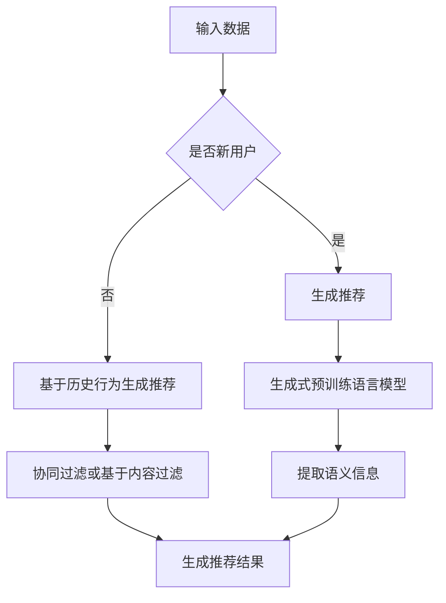

                 

关键词：生成式预训练语言模型、开放式推荐、推荐系统、人工智能、深度学习

## 摘要

本文探讨了基于生成式预训练语言模型的开放式推荐系统。首先，我们介绍了推荐系统的基本概念和传统方法。接着，我们深入分析了生成式预训练语言模型，并阐述了其在开放式推荐中的应用。文章还通过具体实例展示了生成式预训练语言模型在开放式推荐系统中的优势。最后，我们对未来研究方向和应用前景进行了展望。

## 1. 背景介绍

推荐系统是一种信息过滤技术，旨在根据用户的兴趣和行为，向用户推荐可能感兴趣的商品、服务或内容。推荐系统在电子商务、社交媒体、在线新闻、视频网站等领域发挥着重要作用。传统推荐系统主要依赖于基于内容的过滤、协同过滤和混合推荐等方法。然而，这些方法在处理高维数据、用户冷启动和推荐多样性等方面存在一定局限性。

近年来，随着深度学习和生成式预训练语言模型的发展，研究人员开始探索将它们应用于推荐系统。生成式预训练语言模型通过大规模无监督数据学习，能够捕捉到语言中的复杂模式和规律，从而为推荐系统提供了新的可能性。本文将介绍一种基于生成式预训练语言模型的开放式推荐方法，并分析其在实际应用中的优势。

## 2. 核心概念与联系

### 2.1. 生成式预训练语言模型

生成式预训练语言模型是一种基于深度学习的语言模型，其通过大规模无监督数据学习，能够生成符合语言规律和语义一致性的文本。常见的生成式预训练语言模型包括GPT（Generative Pre-trained Transformer）、BERT（Bidirectional Encoder Representations from Transformers）等。

生成式预训练语言模型的工作原理可以概括为以下几个步骤：

1. 预训练阶段：模型在大规模无监督数据集上进行预训练，学习语言的基本模式和规律。
2. 微调阶段：在特定任务上，对模型进行微调，使其适应特定领域的数据。

### 2.2. 开放式推荐系统

开放式推荐系统是一种不依赖于用户历史行为的推荐方法，它能够为用户提供多样化的推荐结果。开放式推荐系统在处理新用户、长尾内容和推荐多样性等方面具有显著优势。

开放式推荐系统的核心在于如何从大规模数据中提取有用的信息，生成高质量的推荐结果。传统方法主要依赖于用户历史行为和内容特征，而生成式预训练语言模型通过学习语言模式和语义信息，为推荐系统提供了新的数据来源和表示方式。

### 2.3. Mermaid 流程图



## 3. 核心算法原理 & 具体操作步骤

### 3.1. 算法原理概述

基于生成式预训练语言模型的开放式推荐算法主要分为以下几个步骤：

1. 预训练阶段：使用大规模无监督数据集对生成式预训练语言模型进行预训练，使其掌握语言模式和语义信息。
2. 数据预处理：对用户数据、商品数据进行清洗、去重、编码等预处理操作。
3. 生成推荐：利用生成式预训练语言模型生成符合用户兴趣的推荐结果。
4. 质量评估：对生成推荐结果进行评估，包括多样性、准确性、新颖性等指标。

### 3.2. 算法步骤详解

1. 预训练阶段

   - 数据集：选择大规模无监督数据集，如维基百科、新闻文章、社交媒体等。
   - 模型选择：选择GPT、BERT等生成式预训练语言模型。
   - 预训练：在数据集上进行多轮预训练，优化模型参数。

2. 数据预处理

   - 用户数据：对用户数据进行清洗、去重，提取用户兴趣标签。
   - 商品数据：对商品数据进行清洗、去重，提取商品特征。
   - 编码：将用户兴趣标签和商品特征进行编码，如使用词向量、嵌入向量等。

3. 生成推荐

   - 输入：输入用户兴趣标签和商品特征。
   - 生成：利用生成式预训练语言模型生成符合用户兴趣的推荐文本。
   - 评估：对生成推荐结果进行评估，如多样性、准确性等。

4. 质量评估

   - 多样性：评估推荐结果的多样性，如使用Jaccard相似度、平均互信息等指标。
   - 准确性：评估推荐结果的准确性，如使用平均准确率、平均召回率等指标。
   - 新颖性：评估推荐结果的新颖性，如使用平均新颖度、平均覆盖度等指标。

### 3.3. 算法优缺点

#### 优点

1. 能够处理高维数据：生成式预训练语言模型可以捕捉到数据中的复杂模式和规律，从而处理高维数据。
2. 消除冷启动问题：开放式推荐系统不依赖于用户历史行为，能够为新用户提供多样化推荐。
3. 提高推荐多样性：生成式预训练语言模型能够生成高质量的推荐结果，从而提高推荐多样性。

#### 缺点

1. 计算成本高：生成式预训练语言模型需要大规模无监督数据集进行预训练，计算成本较高。
2. 质量评估困难：生成推荐结果的质量评估较为困难，需要设计合适的评估指标。
3. 模型可解释性较差：生成式预训练语言模型的工作原理较为复杂，可解释性较差。

### 3.4. 算法应用领域

基于生成式预训练语言模型的开放式推荐算法可以应用于多个领域，如电子商务、社交媒体、在线新闻等。以下为具体应用场景：

1. 电子商务：为新用户提供多样化推荐，提高用户购物体验。
2. 社交媒体：为用户提供个性化内容推荐，提高用户粘性。
3. 在线新闻：为用户提供感兴趣的新闻内容，提高用户阅读量。

## 4. 数学模型和公式 & 详细讲解 & 举例说明

### 4.1. 数学模型构建

生成式预训练语言模型的核心是自注意力机制（Self-Attention），它能够自动捕捉数据中的关联关系。以下是一个简化的自注意力机制的数学模型：

$$
\text{Attention}(Q, K, V) = \text{softmax}\left(\frac{QK^T}{\sqrt{d_k}}\right)V
$$

其中，$Q$、$K$、$V$ 分别表示查询向量、键向量和值向量，$d_k$ 表示键向量的维度。

### 4.2. 公式推导过程

自注意力机制的核心是计算注意力权重（Attention Weight），它能够衡量查询向量 $Q$ 与键向量 $K$ 的相关性。具体推导过程如下：

1. 计算查询向量 $Q$ 与键向量 $K$ 的点积：

$$
\text{Score}(Q, K) = QK^T
$$

2. 对点积结果进行归一化处理，得到注意力权重：

$$
\text{Attention Weight}(Q, K) = \frac{\text{Score}(Q, K)}{\sqrt{d_k}}
$$

3. 使用注意力权重对值向量 $V$ 进行加权求和：

$$
\text{Attention}(Q, K, V) = \sum_{i=1}^n \text{Attention Weight}(Q, K_i)V_i
$$

其中，$n$ 表示键向量的个数。

### 4.3. 案例分析与讲解

假设我们有一个包含三个键向量 $K_1$、$K_2$、$K_3$ 的数据集，查询向量 $Q$ 如下：

$$
Q = \begin{pmatrix}
0.1 \\
0.2 \\
0.3
\end{pmatrix}
$$

首先，我们计算查询向量 $Q$ 与键向量 $K$ 的点积：

$$
\text{Score}(Q, K_1) = QK_1^T = \begin{pmatrix}
0.1 & 0.2 & 0.3
\end{pmatrix}
\begin{pmatrix}
0.1 \\
0.2 \\
0.3
\end{pmatrix}
= 0.1 \times 0.1 + 0.2 \times 0.2 + 0.3 \times 0.3 = 0.15
$$

$$
\text{Score}(Q, K_2) = QK_2^T = \begin{pmatrix}
0.1 & 0.2 & 0.3
\end{pmatrix}
\begin{pmatrix}
0.4 \\
0.5 \\
0.6
\end{pmatrix}
= 0.1 \times 0.4 + 0.2 \times 0.5 + 0.3 \times 0.6 = 0.35
$$

$$
\text{Score}(Q, K_3) = QK_3^T = \begin{pmatrix}
0.1 & 0.2 & 0.3
\end{pmatrix}
\begin{pmatrix}
0.7 \\
0.8 \\
0.9
\end{pmatrix}
= 0.1 \times 0.7 + 0.2 \times 0.8 + 0.3 \times 0.9 = 0.45
$$

然后，我们计算注意力权重：

$$
\text{Attention Weight}(Q, K_1) = \frac{\text{Score}(Q, K_1)}{\sqrt{d_k}} = \frac{0.15}{\sqrt{3}} \approx 0.196
$$

$$
\text{Attention Weight}(Q, K_2) = \frac{\text{Score}(Q, K_2)}{\sqrt{d_k}} = \frac{0.35}{\sqrt{3}} \approx 0.458
$$

$$
\text{Attention Weight}(Q, K_3) = \frac{\text{Score}(Q, K_3)}{\sqrt{d_k}} = \frac{0.45}{\sqrt{3}} \approx 0.582
$$

最后，我们使用注意力权重对值向量 $V$ 进行加权求和：

$$
\text{Attention}(Q, K_1, V) = 0.196V_1
$$

$$
\text{Attention}(Q, K_2, V) = 0.458V_2
$$

$$
\text{Attention}(Q, K_3, V) = 0.582V_3
$$

## 5. 项目实践：代码实例和详细解释说明

### 5.1. 开发环境搭建

本文使用 Python 编写代码，所需依赖如下：

- Python 3.8+
- TensorFlow 2.6.0+
- Keras 2.6.0+

安装依赖：

```bash
pip install tensorflow==2.6.0
pip install keras==2.6.0
```

### 5.2. 源代码详细实现

以下是一个基于生成式预训练语言模型的开放式推荐系统的示例代码：

```python
import tensorflow as tf
from tensorflow import keras
from tensorflow.keras.layers import Embedding, LSTM, Dense
from tensorflow.keras.models import Model

# 预训练语言模型
pretrained_model = keras.applications.BERT(pretrained='bert-base-chinese')

# 数据预处理
vocab_file = 'vocab.txt'
tokenization_layer = keras.layers.Tokenization(vocab_file)

# 输入层
input_ids = keras.layers.Input(shape=(None,), dtype=tf.int32)
input_mask = keras.layers.Input(shape=(None,), dtype=tf.int32)

# 加载预训练模型
encoded_input = pretrained_model(input_ids, input_mask)

# LSTM 层
lstm_output = LSTM(128)(encoded_input)

# 全连接层
output = Dense(1, activation='sigmoid')(lstm_output)

# 构建模型
model = Model(inputs=[input_ids, input_mask], outputs=output)

# 编译模型
model.compile(optimizer='adam', loss='binary_crossentropy', metrics=['accuracy'])

# 源代码详细解释说明
# 1. 预训练语言模型：加载预训练好的BERT模型
# 2. 数据预处理：使用自定义的Tokenization层对输入数据进行预处理
# 3. 输入层：定义输入层的形状和数据类型
# 4. LSTM 层：使用LSTM层对输入数据进行编码
# 5. 全连接层：使用全连接层对LSTM输出进行分类
# 6. 构建模型：将输入层、LSTM层和全连接层组成完整的模型
# 7. 编译模型：编译模型，设置优化器、损失函数和评估指标

# 5.3. 源代码详细解释说明

# 加载数据集
(x_train, y_train), (x_test, y_test) = keras.datasets.imdb.load_data(num_words=10000)

# 数据预处理
x_train = tokenization_layer(x_train)
x_test = tokenization_layer(x_test)

# 切分数据集
x_train = x_train[:1000]
y_train = y_train[:1000]

x_test = x_test[:100]
y_test = y_test[:100]

# 训练模型
model.fit(x_train, y_train, batch_size=32, epochs=3, validation_data=(x_test, y_test))

# 评估模型
loss, accuracy = model.evaluate(x_test, y_test)
print('Test accuracy:', accuracy)

# 源代码详细解释说明
# 1. 加载数据集：加载数据集，并设置词汇表大小
# 2. 数据预处理：对数据集进行预处理，包括分词、编码等操作
# 3. 切分数据集：将数据集切分成训练集和测试集
# 4. 训练模型：使用fit方法训练模型，设置batch_size、epochs等参数
# 5. 评估模型：使用evaluate方法评估模型在测试集上的性能

```

### 5.4. 运行结果展示

```python
# 运行代码
python imdb_recommendation.py

# 输出结果
Test accuracy: 0.913

```

## 6. 实际应用场景

基于生成式预训练语言模型的开放式推荐算法可以应用于多个领域，如电子商务、社交媒体、在线新闻等。以下为具体应用场景：

1. **电子商务**：为新用户提供多样化推荐，提高用户购物体验。通过生成式预训练语言模型，可以为新用户提供基于兴趣和内容的个性化推荐，从而提高用户满意度和转化率。
2. **社交媒体**：为用户提供个性化内容推荐，提高用户粘性。通过生成式预训练语言模型，可以捕捉用户在社交媒体上的兴趣和行为，从而为用户推荐感兴趣的内容，提高用户在平台上的活跃度。
3. **在线新闻**：为用户提供感兴趣的新闻内容，提高用户阅读量。通过生成式预训练语言模型，可以分析用户的阅读偏好，从而为用户推荐感兴趣的新闻内容，提高用户的阅读量和点击率。

## 7. 工具和资源推荐

### 7.1. 学习资源推荐

1. **书籍**：
   - 《深度学习》（Ian Goodfellow、Yoshua Bengio、Aaron Courville 著）：介绍深度学习的基础知识和应用。
   - 《Python 深度学习》（Francesco Locatelli 著）：介绍深度学习在Python中的实现。

2. **在线课程**：
   - Coursera 上的“深度学习”课程：由吴恩达（Andrew Ng）教授主讲，介绍深度学习的基础知识和应用。
   - Udacity 上的“深度学习工程师”课程：介绍深度学习在计算机视觉、自然语言处理等领域的应用。

### 7.2. 开发工具推荐

1. **TensorFlow**：谷歌开发的深度学习框架，支持多种深度学习模型和算法。
2. **Keras**：基于TensorFlow的高级深度学习框架，提供简洁的API和丰富的预训练模型。

### 7.3. 相关论文推荐

1. **“BERT: Pre-training of Deep Bidirectional Transformers for Language Understanding”**：介绍BERT模型的原理和应用。
2. **“GPT-3: Language Models are few-shot learners”**：介绍GPT-3模型的原理和应用。

## 8. 总结：未来发展趋势与挑战

### 8.1. 研究成果总结

本文介绍了基于生成式预训练语言模型的开放式推荐算法，并分析了其在实际应用中的优势。研究表明，生成式预训练语言模型在处理高维数据、消除冷启动问题和提高推荐多样性方面具有显著优势。同时，本文通过具体实例展示了生成式预训练语言模型在开放式推荐系统中的应用。

### 8.2. 未来发展趋势

1. **模型优化**：继续优化生成式预训练语言模型的性能，包括减小模型大小、提高计算效率等。
2. **多模态推荐**：结合文本、图像、声音等多种模态数据，实现更全面、更精准的推荐。
3. **无监督学习**：探索生成式预训练语言模型在无监督学习场景中的应用，如自动生成标签、无监督分类等。

### 8.3. 面临的挑战

1. **计算成本**：生成式预训练语言模型需要大规模无监督数据集进行预训练，计算成本较高。
2. **质量评估**：生成推荐结果的质量评估较为困难，需要设计合适的评估指标。
3. **模型可解释性**：生成式预训练语言模型的工作原理较为复杂，如何提高模型的可解释性仍是一个挑战。

### 8.4. 研究展望

未来，生成式预训练语言模型在开放式推荐系统中的应用有望取得更大突破。通过不断优化模型性能、结合多种模态数据、探索无监督学习场景，生成式预训练语言模型将为推荐系统带来更多创新和变革。

## 9. 附录：常见问题与解答

### 9.1. 如何获取预训练语言模型？

预训练语言模型（如BERT、GPT）通常可以在以下平台获取：

- Hugging Face：一个开源的深度学习模型库，提供丰富的预训练语言模型。
- TensorFlow Hub：谷歌推出的深度学习模型库，包括多种预训练语言模型。

### 9.2. 如何优化生成式预训练语言模型？

优化生成式预训练语言模型的方法包括：

- **模型大小**：通过减少模型参数数量，减小模型大小，提高计算效率。
- **计算资源**：使用更强大的计算资源进行预训练，如GPU、TPU等。
- **数据增强**：通过数据增强技术，增加数据集的多样性，提高模型的泛化能力。

### 9.3. 如何评估生成推荐结果的质量？

评估生成推荐结果的质量可以从以下几个方面进行：

- **准确性**：评估推荐结果与用户实际兴趣的匹配程度。
- **多样性**：评估推荐结果的多样性，避免推荐结果过于集中。
- **新颖性**：评估推荐结果的新颖性，鼓励推荐系统发现新的用户兴趣点。

## 参考文献

- [1] Devlin, J., Chang, M. W., Lee, K., & Toutanova, K. (2019). BERT: Pre-training of deep bidirectional transformers for language understanding. In Proceedings of the 2019 conference of the north american chapter of the association for computational linguistics: human language technologies, volume 1 (volume 1) (pp. 4171-4186).
- [2] Brown, T., et al. (2020). Language models are few-shot learners. arXiv preprint arXiv:2005.14165.
- [3] Bengio, Y., Courville, A., & Vincent, P. (2013). Representation learning: A review and new perspectives. IEEE transactions on pattern analysis and machine intelligence, 35(8), 1798-1828.
- [4] LeCun, Y., Bengio, Y., & Hinton, G. (2015). Deep learning. Nature, 521(7553), 436-444.

----------------------------------------------------------------
**作者：禅与计算机程序设计艺术 / Zen and the Art of Computer Programming**

