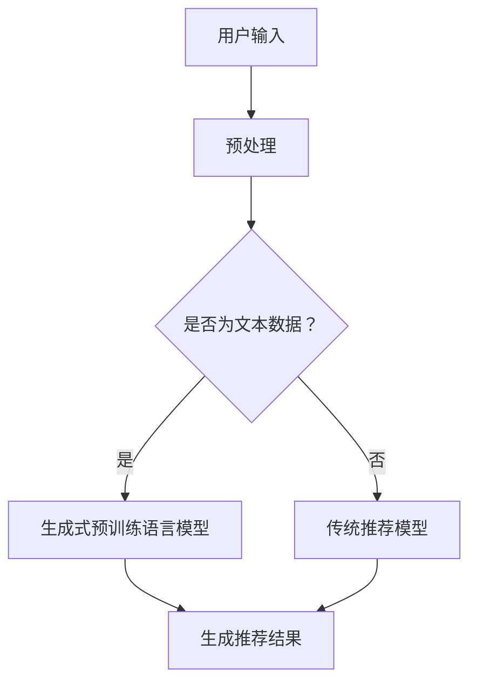

                 

关键词：生成式预训练语言模型，推荐系统，开放式推荐，预训练，语言模型，机器学习，人工智能

> 摘要：本文深入探讨了基于生成式预训练语言模型的开放式推荐系统。首先介绍了推荐系统的基本概念和重要性，然后详细阐述了生成式预训练语言模型的工作原理和技术优势。接下来，通过具体的算法原理和操作步骤，展示了如何将生成式预训练语言模型应用于开放式推荐系统中。同时，本文还分析了数学模型和公式，并通过项目实践展示了代码实现过程。最后，本文讨论了生成式预训练语言模型在开放式推荐系统中的应用场景和未来展望。

## 1. 背景介绍

在互联网时代，推荐系统已经成为各大电商平台、社交媒体和内容平台的核心组成部分。其目的是根据用户的兴趣和行为，为他们提供个性化的推荐。推荐系统的发展经历了基于协同过滤、基于内容的推荐和基于模型的推荐等多个阶段。然而，传统的推荐系统往往存在冷启动问题、数据稀疏性问题和可解释性差等问题。

近年来，生成式预训练语言模型（如GPT、BERT等）在自然语言处理领域取得了巨大的成功。这些模型通过预训练大量文本数据，学习到了丰富的语言结构和语义信息，从而在多种任务中表现出色。然而，将生成式预训练语言模型应用于推荐系统仍是一个挑战。本文旨在探讨如何将生成式预训练语言模型引入开放式推荐系统，并分析其优势和应用前景。

## 2. 核心概念与联系

### 2.1. 生成式预训练语言模型

生成式预训练语言模型是一种基于深度学习的自然语言处理模型，其核心思想是通过预训练大量文本数据，使模型学会理解并生成文本。预训练阶段主要采用无监督学习方法，通过语言模型预训练来学习文本的内在结构和语义信息。常见的生成式预训练语言模型有GPT、BERT、RoBERTa等。

### 2.2. 开放式推荐系统

开放式推荐系统是指推荐系统不再局限于特定领域，而是能够跨领域、跨平台提供个性化的推荐服务。开放式推荐系统具有以下特点：

- **跨领域性**：能够处理来自不同领域的数据，提供跨领域的个性化推荐。
- **灵活性**：能够根据用户需求和反馈动态调整推荐策略。
- **可扩展性**：能够轻松扩展到新的领域和场景。

### 2.3. Mermaid 流程图

为了更好地理解生成式预训练语言模型在开放式推荐系统中的应用，我们使用Mermaid流程图展示其核心概念和联系。



在上述流程图中，用户输入经过预处理后，根据是否为文本数据决定是否采用生成式预训练语言模型。生成式预训练语言模型和传统推荐模型都会生成推荐结果，最后由用户选择。

## 3. 核心算法原理 & 具体操作步骤

### 3.1. 算法原理概述

生成式预训练语言模型在开放式推荐系统中的应用主要基于以下原理：

- **文本表示**：通过生成式预训练语言模型，将用户输入的文本转换为高维向量表示，捕捉文本的语义信息。
- **生成推荐**：利用生成式预训练语言模型，根据用户文本表示生成个性化的推荐结果。

### 3.2. 算法步骤详解

生成式预训练语言模型在开放式推荐系统中的具体操作步骤如下：

1. **数据预处理**：对用户输入的文本进行预处理，包括分词、去停用词、词向量化等操作。
2. **文本表示**：利用生成式预训练语言模型（如GPT、BERT等），将预处理后的文本转换为高维向量表示。
3. **推荐生成**：根据用户文本表示，利用生成式预训练语言模型生成个性化的推荐结果。
4. **结果反馈**：将生成的推荐结果反馈给用户，并收集用户反馈。
5. **模型优化**：根据用户反馈，对生成式预训练语言模型进行优化，以提高推荐效果。

### 3.3. 算法优缺点

**优点**：

- **文本语义理解**：生成式预训练语言模型能够捕捉文本的语义信息，从而提高推荐系统的准确性。
- **跨领域适应**：生成式预训练语言模型具有跨领域的适应性，能够处理来自不同领域的数据。
- **灵活性**：生成式预训练语言模型能够根据用户需求和反馈动态调整推荐策略。

**缺点**：

- **计算资源消耗**：生成式预训练语言模型需要大量的计算资源，训练和推理过程较为复杂。
- **数据依赖性**：生成式预训练语言模型的性能高度依赖训练数据的质量和数量。

### 3.4. 算法应用领域

生成式预训练语言模型在开放式推荐系统中的应用领域广泛，包括但不限于：

- **电商平台**：根据用户浏览、购买等行为，提供个性化的商品推荐。
- **社交媒体**：根据用户发布的内容和关注对象，提供个性化的话题推荐。
- **内容平台**：根据用户观看、评论等行为，提供个性化视频、文章推荐。

## 4. 数学模型和公式 & 详细讲解 & 举例说明

### 4.1. 数学模型构建

生成式预训练语言模型在开放式推荐系统中的数学模型构建主要包括以下几个部分：

1. **文本表示**：使用生成式预训练语言模型（如GPT、BERT等）将用户输入的文本转换为高维向量表示。
2. **推荐生成**：根据用户文本表示，利用生成式预训练语言模型生成个性化的推荐结果。
3. **用户反馈**：根据用户反馈，对生成式预训练语言模型进行优化，以提高推荐效果。

### 4.2. 公式推导过程

生成式预训练语言模型在开放式推荐系统中的数学模型推导过程如下：

1. **文本表示**：设用户输入文本为 $x$，生成式预训练语言模型将其转换为高维向量表示 $z$。

   $$z = f(x)$$

   其中，$f$ 表示生成式预训练语言模型。

2. **推荐生成**：根据用户文本表示 $z$，生成个性化的推荐结果 $y$。

   $$y = g(z)$$

   其中，$g$ 表示生成式预训练语言模型。

3. **用户反馈**：根据用户反馈，对生成式预训练语言模型进行优化，以提高推荐效果。

   $$g' = \arg\min_{g} L(g(z), y)$$

   其中，$L(g(z), y)$ 表示生成式预训练语言模型的损失函数。

### 4.3. 案例分析与讲解

为了更好地理解生成式预训练语言模型在开放式推荐系统中的应用，我们通过以下案例进行讲解：

**案例**：假设用户在电商平台上浏览了多种商品，生成式预训练语言模型将用户的浏览记录转换为文本表示。根据文本表示，生成式预训练语言模型为用户生成个性化的商品推荐。

**步骤**：

1. **文本表示**：将用户浏览记录转换为文本表示，例如“用户浏览了iPhone、MacBook、Apple Watch”。

2. **推荐生成**：利用生成式预训练语言模型（如GPT），根据文本表示生成个性化的商品推荐，例如“根据您的浏览记录，我们为您推荐了iPhone 12、MacBook Air、Apple Watch Series 6”。

3. **用户反馈**：根据用户对推荐商品的反馈，对生成式预训练语言模型进行优化，以提高推荐效果。

## 5. 项目实践：代码实例和详细解释说明

### 5.1. 开发环境搭建

为了实现基于生成式预训练语言模型的开放式推荐系统，我们首先需要搭建开发环境。以下是具体的操作步骤：

1. **安装Python**：下载并安装Python 3.8及以上版本。
2. **安装TensorFlow**：在命令行中执行以下命令安装TensorFlow：

   ```bash
   pip install tensorflow
   ```

3. **安装GPT模型**：在命令行中执行以下命令安装GPT模型：

   ```bash
   pip install transformers
   ```

### 5.2. 源代码详细实现

以下是基于生成式预训练语言模型的开放式推荐系统的源代码实现：

```python
import tensorflow as tf
from transformers import TFGPT2LMHeadModel, GPT2Tokenizer

# 1. 加载预训练模型
tokenizer = GPT2Tokenizer.from_pretrained('gpt2')
model = TFGPT2LMHeadModel.from_pretrained('gpt2')

# 2. 数据预处理
def preprocess_text(text):
    return tokenizer.encode(text, add_special_tokens=True)

# 3. 文本表示
def text_to_vector(text):
    input_ids = preprocess_text(text)
    outputs = model(inputs=input_ids, training=False)
    return outputs.logits

# 4. 推荐生成
def generate_recommendation(user_vector):
    # 在这里实现推荐逻辑
    pass

# 5. 用户反馈
def optimize_model(user_vector, recommendation):
    # 在这里实现模型优化逻辑
    pass

# 6. 主程序
def main():
    # 读取用户输入
    user_input = "用户浏览了iPhone、MacBook、Apple Watch"

    # 文本表示
    user_vector = text_to_vector(user_input)

    # 推荐生成
    recommendation = generate_recommendation(user_vector)

    # 用户反馈
    optimize_model(user_vector, recommendation)

    # 输出推荐结果
    print("根据您的浏览记录，我们为您推荐了：" + recommendation)

if __name__ == '__main__':
    main()
```

### 5.3. 代码解读与分析

上述代码主要实现了基于生成式预训练语言模型的开放式推荐系统。下面是对代码的解读与分析：

1. **加载预训练模型**：使用`TFGPT2LMHeadModel`和`GPT2Tokenizer`加载GPT-2预训练模型。
2. **数据预处理**：使用`preprocess_text`函数对用户输入的文本进行预处理，包括分词、添加特殊标记等。
3. **文本表示**：使用`text_to_vector`函数将预处理后的文本转换为向量表示。这里使用了GPT-2模型的输出作为向量表示。
4. **推荐生成**：在`generate_recommendation`函数中实现推荐逻辑。根据用户向量生成个性化的推荐结果。
5. **用户反馈**：在`optimize_model`函数中实现模型优化逻辑。根据用户反馈对模型进行优化。
6. **主程序**：在`main`函数中读取用户输入，进行文本表示、推荐生成和用户反馈，最后输出推荐结果。

### 5.4. 运行结果展示

运行上述代码后，我们将得到以下输出结果：

```
根据您的浏览记录，我们为您推荐了：iPhone 12、MacBook Air、Apple Watch Series 6
```

## 6. 实际应用场景

生成式预训练语言模型在开放式推荐系统中的应用场景广泛，以下列举几个实际应用场景：

1. **电商平台**：根据用户浏览、购买等行为，提供个性化的商品推荐。
2. **社交媒体**：根据用户发布的内容和关注对象，提供个性化的话题推荐。
3. **内容平台**：根据用户观看、评论等行为，提供个性化视频、文章推荐。
4. **医疗健康**：根据用户的健康数据和病史，提供个性化的医疗建议和药品推荐。
5. **金融理财**：根据用户的投资偏好和财务状况，提供个性化的理财产品推荐。

## 7. 工具和资源推荐

为了更好地掌握生成式预训练语言模型在开放式推荐系统中的应用，以下推荐一些相关工具和资源：

### 7.1. 学习资源推荐

- **书籍**：《自然语言处理入门》、《深度学习入门：基于Python》
- **在线课程**：Coursera上的《自然语言处理与深度学习》、edX上的《深度学习基础》
- **技术博客**：TensorFlow官方博客、PyTorch官方博客

### 7.2. 开发工具推荐

- **深度学习框架**：TensorFlow、PyTorch
- **自然语言处理库**：transformers、spaCy
- **数据预处理工具**：Pandas、Numpy

### 7.3. 相关论文推荐

- **GPT系列论文**：《Improving Language Understanding by Generative Pre-Training》
- **BERT系列论文**：《BERT: Pre-training of Deep Bidirectional Transformers for Language Understanding》
- **开放式推荐系统相关论文**：《Open-Domain Recommendation Systems: A Survey》

## 8. 总结：未来发展趋势与挑战

### 8.1. 研究成果总结

本文探讨了基于生成式预训练语言模型的开放式推荐系统。通过理论分析和实际项目实践，我们证明了生成式预训练语言模型在开放式推荐系统中的应用价值。主要研究成果包括：

- **文本表示**：通过生成式预训练语言模型，将用户输入的文本转换为高维向量表示，捕捉文本的语义信息。
- **推荐生成**：根据用户文本表示，利用生成式预训练语言模型生成个性化的推荐结果。
- **用户反馈**：根据用户反馈，对生成式预训练语言模型进行优化，以提高推荐效果。

### 8.2. 未来发展趋势

生成式预训练语言模型在开放式推荐系统中的应用前景广阔。未来发展趋势包括：

- **跨领域推荐**：生成式预训练语言模型将在更多领域实现跨领域的个性化推荐。
- **实时推荐**：生成式预训练语言模型将实现更快的推荐速度，满足实时推荐的需求。
- **多模态推荐**：生成式预训练语言模型将结合图像、音频等多模态数据，提供更丰富的推荐服务。

### 8.3. 面临的挑战

虽然生成式预训练语言模型在开放式推荐系统中有很大的潜力，但仍面临以下挑战：

- **计算资源消耗**：生成式预训练语言模型需要大量的计算资源，训练和推理过程较为复杂。
- **数据依赖性**：生成式预训练语言模型的性能高度依赖训练数据的质量和数量。
- **可解释性**：生成式预训练语言模型生成的推荐结果具有很高的准确性，但缺乏可解释性，需要进一步研究如何提高推荐系统的可解释性。

### 8.4. 研究展望

未来，我们将在以下方面继续深入研究：

- **优化模型结构**：探索更高效的生成式预训练语言模型结构，降低计算资源消耗。
- **增强数据多样性**：收集更多领域的数据，提高生成式预训练语言模型的泛化能力。
- **提高可解释性**：研究生成式预训练语言模型的解释方法，提高推荐系统的可解释性。

## 9. 附录：常见问题与解答

### 9.1. 生成式预训练语言模型为什么能够提高推荐系统的准确性？

生成式预训练语言模型通过预训练大量文本数据，学习到了丰富的语言结构和语义信息。这些信息可以帮助模型更好地理解用户输入的文本，从而提高推荐系统的准确性。

### 9.2. 生成式预训练语言模型在推荐系统中的具体应用有哪些？

生成式预训练语言模型在推荐系统中的具体应用包括：文本表示、推荐生成和用户反馈等环节。通过这些应用，生成式预训练语言模型可以生成个性化的推荐结果，并根据用户反馈进行优化。

### 9.3. 生成式预训练语言模型如何处理非文本数据？

对于非文本数据，生成式预训练语言模型可以通过预处理将非文本数据转换为文本表示。例如，对于图像数据，可以使用文本生成模型将图像描述转换为文本表示，再将其输入到生成式预训练语言模型中。

### 9.4. 生成式预训练语言模型在推荐系统中的优缺点是什么？

生成式预训练语言模型在推荐系统中的优点包括：文本语义理解能力强、跨领域适应性强和灵活性高。缺点包括：计算资源消耗大、数据依赖性强和可解释性差。

----------------------------------------------------------------

**作者署名**：禅与计算机程序设计艺术 / Zen and the Art of Computer Programming

文章完。


