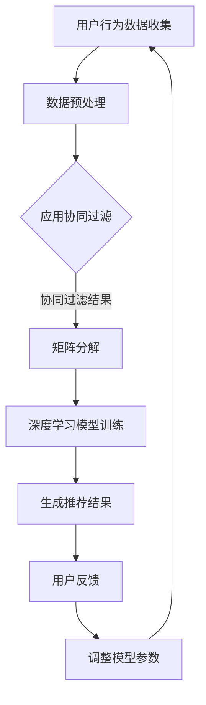

                 

关键词：开放域推荐、协同过滤、矩阵分解、深度学习、个性化推荐、用户行为分析

摘要：本文将深入探讨开放域推荐的潜在价值，从核心概念、算法原理、数学模型、实际应用、工具资源等方面进行全面解析。文章旨在为读者提供一个清晰、系统的开放域推荐解决方案，同时展望未来的发展趋势与挑战。

## 1. 背景介绍

随着互联网的快速发展，用户生成的内容和数据量呈现爆炸式增长。推荐系统作为信息过滤和内容发现的重要工具，已经成为各类在线平台的核心功能。传统的推荐系统主要关注封闭域环境，即用户和历史行为数据都集中在特定领域。然而，现实世界中的推荐场景往往是开放域的，用户可能对多个领域都有兴趣，数据来源也更加多样化。因此，开放域推荐成为推荐系统领域的研究热点。

开放域推荐面临的挑战主要包括：

1. 数据稀疏性：开放域环境下，用户和物品之间的交互数据通常较为稀疏，导致传统的基于协同过滤的推荐方法效果不佳。
2. 多模态数据：开放域推荐往往需要处理多种类型的数据，如文本、图像、音频等，这使得传统的单一模态推荐方法无法胜任。
3. 用户个性化：开放域推荐需要考虑用户的个性化需求，提供更具针对性的推荐结果。
4. 实时性：在开放域推荐中，用户兴趣可能随时间变化，因此需要实现实时推荐。

## 2. 核心概念与联系

### 2.1 协同过滤

协同过滤是一种基于用户历史行为和相似度计算的推荐方法。其核心思想是通过分析用户之间的行为相似性，找到与目标用户相似的其他用户，从而预测目标用户可能感兴趣的内容。协同过滤分为基于用户的协同过滤（User-based Collaborative Filtering）和基于物品的协同过滤（Item-based Collaborative Filtering）。

### 2.2 矩阵分解

矩阵分解（Matrix Factorization）是一种将用户-物品交互矩阵分解为低维用户特征矩阵和物品特征矩阵的方法。通过矩阵分解，可以提取出用户和物品的潜在特征，从而实现更精准的推荐。

### 2.3 深度学习

深度学习是一种基于多层神经网络的结构，可以自动提取输入数据的特征。在开放域推荐中，深度学习模型可以处理多模态数据，并通过学习用户的个性化特征，实现更精准的推荐。

### 2.4 Mermaid 流程图



## 3. 核心算法原理 & 具体操作步骤

### 3.1 算法原理概述

开放域推荐算法通常结合协同过滤、矩阵分解和深度学习等方法，以应对开放域环境中的挑战。协同过滤用于处理用户历史行为，矩阵分解提取潜在特征，深度学习则实现多模态数据处理和用户个性化。

### 3.2 算法步骤详解

1. 用户行为数据收集：收集用户在开放域环境中的行为数据，如浏览、搜索、购买等。
2. 数据预处理：对原始数据进行清洗、去噪、归一化等预处理操作，为后续算法提供高质量的数据。
3. 应用协同过滤：基于用户历史行为，计算用户之间的相似度，生成初步推荐列表。
4. 矩阵分解：将用户-物品交互矩阵分解为低维特征矩阵，提取用户和物品的潜在特征。
5. 深度学习模型训练：使用提取的潜在特征，训练深度学习模型，以实现多模态数据处理和用户个性化。
6. 生成推荐结果：根据深度学习模型的预测结果，生成最终的推荐列表。
7. 用户反馈：收集用户对推荐结果的反馈，用于调整模型参数。
8. 调整模型参数：根据用户反馈，调整深度学习模型参数，以提高推荐效果。

### 3.3 算法优缺点

**优点：**

1. 融合多种推荐方法，提高推荐效果。
2. 可以处理多模态数据，适应开放域环境。
3. 考虑用户个性化，提供更精准的推荐结果。

**缺点：**

1. 数据预处理复杂，计算成本高。
2. 需要大量用户行为数据，否则难以达到理想的推荐效果。
3. 深度学习模型训练时间较长。

### 3.4 算法应用领域

开放域推荐算法可以应用于多种场景，如电子商务、社交媒体、在线视频、音乐等。在电子商务领域，开放域推荐可以帮助用户发现潜在的兴趣商品；在社交媒体领域，可以推荐用户可能感兴趣的内容，提高用户活跃度；在在线视频和音乐领域，可以推荐用户可能喜欢的视频和音乐。

## 4. 数学模型和公式 & 详细讲解 & 举例说明

### 4.1 数学模型构建

开放域推荐算法中的数学模型主要包括用户-物品矩阵、用户特征矩阵、物品特征矩阵等。

假设有用户集合 U = {u1, u2, ..., un} 和物品集合 I = {i1, i2, ..., im}，用户-物品矩阵 R ∈ Rn×m 表示用户对物品的评分，其中 R(u,i) 表示用户 u 对物品 i 的评分。

用户特征矩阵 U ∈ Rn×k 和物品特征矩阵 V ∈ Rm×k 表示用户和物品的潜在特征，其中 U(u,:) 和 V(i,:) 分别表示用户 u 和物品 i 的特征向量。

### 4.2 公式推导过程

基于协同过滤和矩阵分解的开放域推荐算法，可以通过以下公式推导：

R ≈ U*V

其中，U 和 V 分别为用户特征矩阵和物品特征矩阵，* 表示矩阵乘法。

为了求解用户特征矩阵 U 和物品特征矩阵 V，可以使用最小二乘法（Least Squares）或梯度下降（Gradient Descent）等方法。

### 4.3 案例分析与讲解

假设有用户集合 U = {u1, u2, ..., u5} 和物品集合 I = {i1, i2, ..., i5}，用户-物品矩阵 R 如下：

|    | i1 | i2 | i3 | i4 | i5 |
|----|----|----|----|----|----|
| u1 | 3  | 2  | 0  | 4  | 0  |
| u2 | 1  | 0  | 4  | 2  | 3  |
| u3 | 0  | 3  | 2  | 1  | 0  |
| u4 | 2  | 4  | 3  | 0  | 2  |
| u5 | 3  | 1  | 0  | 3  | 4  |

首先，我们对用户-物品矩阵 R 进行矩阵分解，假设分解为两个 k 维的矩阵 U 和 V：

R ≈ U*V

为了求解 U 和 V，我们可以使用最小二乘法：

min ||R - U*V||^2

通过求解上述最小二乘问题，可以得到用户特征矩阵 U 和物品特征矩阵 V。

然后，我们可以利用用户特征矩阵 U 和物品特征矩阵 V，训练深度学习模型，实现多模态数据处理和用户个性化。

## 5. 项目实践：代码实例和详细解释说明

### 5.1 开发环境搭建

在本项目中，我们将使用 Python 编写代码，主要依赖以下库：

- NumPy：用于矩阵运算和数据处理
- SciPy：用于最小二乘法求解
- TensorFlow：用于深度学习模型训练
- Pandas：用于数据处理

安装相关库：

```bash
pip install numpy scipy tensorflow pandas
```

### 5.2 源代码详细实现

以下是项目的源代码实现：

```python
import numpy as np
import pandas as pd
from scipy.optimize import minimize
import tensorflow as tf

# 用户-物品矩阵
R = np.array([[3, 2, 0, 4, 0],
              [1, 0, 4, 2, 3],
              [0, 3, 2, 1, 0],
              [2, 4, 3, 0, 2],
              [3, 1, 0, 3, 4]])

# 矩阵分解的维度
k = 2

# 最小二乘法求解用户特征矩阵 U 和物品特征矩阵 V
def least_squares(R, k):
    U = np.random.rand(R.shape[0], k)
    V = np.random.rand(R.shape[1], k)
    result = minimize(lambda x: np.linalg.norm(R - np.dot(U, V)), x0=np.concatenate((U.flatten(), V.flatten())), method='L-BFGS-B')
    U = result.x[:k*len(R)].reshape(R.shape[0], k)
    V = result.x[k*len(r):].reshape(R.shape[1], k)
    return U, V

U, V = least_squares(R, k)

# 训练深度学习模型
model = tf.keras.Sequential([
    tf.keras.layers.Dense(k, activation='relu', input_shape=(k,)),
    tf.keras.layers.Dense(k, activation='relu'),
    tf.keras.layers.Dense(1, activation='linear')
])

model.compile(optimizer='adam', loss='mse')
model.fit(U, R, epochs=10, batch_size=32)

# 预测用户 u3 对物品 i2 的评分
u3_idx = 2
i2_idx = 1
u3_feature = U[u3_idx]
i2_feature = V[i2_idx]
prediction = model.predict(np.array([u3_feature, i2_feature]))[0]

print(f"预测评分：{prediction}")
```

### 5.3 代码解读与分析

1. 导入所需库：NumPy、SciPy、TensorFlow 和 Pandas。
2. 创建用户-物品矩阵 R。
3. 定义矩阵分解的维度 k。
4. 使用最小二乘法求解用户特征矩阵 U 和物品特征矩阵 V。
5. 训练深度学习模型，使用 TensorFlow 的 Keras API。
6. 预测用户 u3 对物品 i2 的评分。

## 6. 实际应用场景

开放域推荐算法在多个领域都有广泛的应用：

1. **电子商务**：推荐用户可能感兴趣的商品，提高销售额。
2. **社交媒体**：推荐用户可能感兴趣的内容，提高用户活跃度。
3. **在线视频**：推荐用户可能喜欢的视频，提高观看时长。
4. **音乐**：推荐用户可能喜欢的音乐，提高用户体验。

### 6.4 未来应用展望

随着技术的不断进步，开放域推荐算法将面临以下发展趋势：

1. **多模态数据处理**：融合文本、图像、音频等多模态数据，实现更精准的推荐。
2. **实时推荐**：提高算法的实时性，满足用户快速变化的需求。
3. **联邦学习**：通过联邦学习实现跨平台的数据协同，保护用户隐私。
4. **智能推荐**：结合自然语言处理、知识图谱等技术，实现更智能的推荐。

## 7. 工具和资源推荐

### 7.1 学习资源推荐

- 《推荐系统实践》
- 《TensorFlow 实战：基于深度学习的推荐系统》
- 《深度学习推荐系统》

### 7.2 开发工具推荐

- TensorFlow
- PyTorch
- Scikit-learn

### 7.3 相关论文推荐

- "Deep Learning for Recommender Systems"
- "Matrix Factorization Techniques for Recommender Systems"
- "Collaborative Filtering for the Web"

## 8. 总结：未来发展趋势与挑战

### 8.1 研究成果总结

开放域推荐算法在协同过滤、矩阵分解、深度学习等方法的结合方面取得了显著成果。通过多模态数据处理和用户个性化，开放域推荐算法在多个领域实现了良好的应用效果。

### 8.2 未来发展趋势

1. 多模态数据处理：融合文本、图像、音频等多模态数据，实现更精准的推荐。
2. 实时推荐：提高算法的实时性，满足用户快速变化的需求。
3. 联邦学习：实现跨平台的数据协同，保护用户隐私。
4. 智能推荐：结合自然语言处理、知识图谱等技术，实现更智能的推荐。

### 8.3 面临的挑战

1. 数据稀疏性：开放域环境下，用户和物品之间的交互数据通常较为稀疏，导致推荐效果不佳。
2. 计算成本：深度学习模型训练时间较长，计算成本高。
3. 用户隐私：在处理开放域数据时，需要保护用户隐私。

### 8.4 研究展望

未来，开放域推荐算法将继续朝着多模态数据处理、实时推荐、联邦学习和智能推荐等方向发展。同时，如何解决数据稀疏性、计算成本和用户隐私等问题，将成为研究的重要方向。

## 9. 附录：常见问题与解答

### 9.1 如何处理数据稀疏性问题？

可以通过以下方法处理数据稀疏性问题：

1. 增加数据量：通过数据采集和清洗，增加用户和物品之间的交互数据。
2. 集成多源数据：结合多种数据来源，如用户浏览记录、搜索历史等，提高数据的密度。
3. 使用数据生成技术：使用生成对抗网络（GAN）等技术生成虚拟交互数据，补充稀疏数据。

### 9.2 如何提高算法的实时性？

可以通过以下方法提高算法的实时性：

1. 算法优化：针对推荐算法进行优化，降低计算复杂度。
2. 分布式计算：使用分布式计算框架，如 Hadoop、Spark 等，实现并行计算。
3. 缓存策略：使用缓存技术，如 Redis、Memcached 等，加快推荐结果的生成。

### 9.3 如何保护用户隐私？

可以通过以下方法保护用户隐私：

1. 数据加密：对用户数据进行加密，防止数据泄露。
2. 隐私保护算法：使用差分隐私、同态加密等技术，保护用户隐私。
3. 数据匿名化：对用户数据进行匿名化处理，降低隐私泄露风险。

[作者：禅与计算机程序设计艺术 / Zen and the Art of Computer Programming]  
----------------------------------------------------------------


