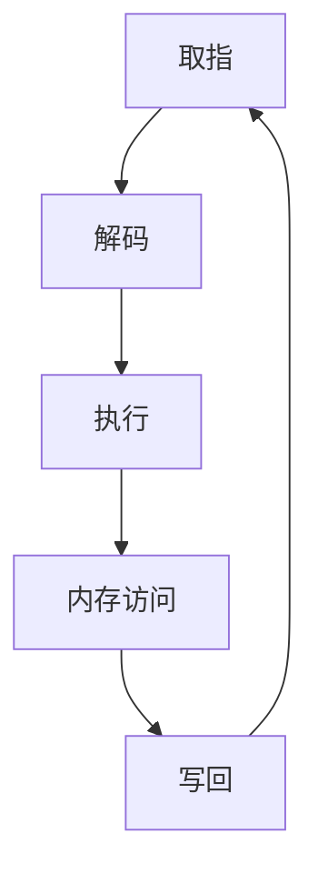

                 

关键词：MIPS处理器，架构设计，性能优化，指令集，流水线技术，节能设计，内存访问优化，并行处理

## 摘要

本文旨在深入探讨MIPS（Microprocessor without Interlocked Pipelined Stages）处理器的特性与优化策略。MIPS是一种精简指令集计算机（RISC）处理器，以其简洁的指令集、高效的流水线设计和可扩展性而著称。文章将首先介绍MIPS处理器的基本架构和核心特性，然后详细分析其性能优化的各种策略，包括流水线技术、内存访问优化、节能设计等。最后，本文将对MIPS处理器的实际应用场景进行探讨，并展望其未来的发展趋势和面临的挑战。

## 1. 背景介绍

MIPS处理器起源于20世纪80年代，由斯坦福大学的约翰·海恩斯（John L. Hennessy）教授和迪安·特里格尔（Dean T. Chien）教授设计。他们的目标是创建一种高性能、低功耗、易于实现的处理器架构，以适应当时不断增长的计算需求。MIPS处理器采用了精简指令集（RISC）的设计理念，即通过减少指令种类和操作复杂性来提高指令执行速度和处理效率。

MIPS处理器的基本特点包括：

1. **简洁的指令集**：MIPS指令集包含约30条基本指令，操作简单，易于理解和实现。
2. **单周期执行**：大部分指令在一个时钟周期内完成，提高了处理器的吞吐量。
3. **固定的指令长度**：所有指令均为32位，便于流水线操作。
4. **独立的加载和存储单元**：提高了数据访问的并行性。
5. **丰富的寄存器资源**：MIPS处理器通常配备32个通用寄存器，减少了内存访问需求。

MIPS处理器在嵌入式系统、网络设备、消费电子和工业控制等领域得到了广泛应用。其高性能、低功耗和易扩展的特点使其成为这些领域理想的选择。

## 2. 核心概念与联系

### 2.1 MIPS处理器架构

MIPS处理器采用五级流水线设计，包括取指（Fetch）、解码（Decode）、执行（Execute）、内存访问（Memory）和写回（Write Back）五个阶段。以下是一个简化的Mermaid流程图，展示了MIPS处理器的基本架构和各阶段之间的数据流：



### 2.2 MIPS处理器核心特性

MIPS处理器的主要特性包括：

1. **单周期指令执行**：大部分指令在一个时钟周期内完成，如加法、减法、逻辑操作等。
2. **独立的数据通路**：MIPS处理器具有独立的取指、加载/存储、执行和数据通路，提高了数据访问的并行性。
3. **简化的指令集**：MIPS指令集包括约30条基本指令，操作简单，易于理解和实现。
4. **固定的指令长度**：所有指令均为32位，便于流水线操作。
5. **丰富的寄存器资源**：MIPS处理器通常配备32个通用寄存器，减少了内存访问需求。

## 3. 核心算法原理 & 具体操作步骤

### 3.1 算法原理概述

MIPS处理器通过流水线技术实现指令的高效执行。流水线技术将指令的执行过程分解为多个阶段，每个阶段由不同的硬件单元执行，从而实现指令的并行处理。以下是一个简化的流水线操作步骤：

1. **取指阶段**：从内存中读取下一条指令。
2. **解码阶段**：解析指令操作码和操作数，生成相应的控制信号。
3. **执行阶段**：根据控制信号执行具体的指令操作。
4. **内存访问阶段**：访问内存进行数据读取或写入操作。
5. **写回阶段**：将执行结果写回到寄存器或内存中。

### 3.2 算法步骤详解

以下是MIPS处理器流水线操作的详细步骤：

1. **取指阶段**：

    - 取指单元（Instruction Fetch Unit）从内存中读取下一条指令。
    - 指令地址由程序计数器（Program Counter, PC）提供。

2. **解码阶段**：

    - 指令在指令缓冲区（Instruction Buffer）中等待解码。
    - 解码单元（Instruction Decoder）解析指令操作码和操作数，生成相应的控制信号。

3. **执行阶段**：

    - 执行单元（Execute Unit）根据控制信号执行具体的指令操作。
    - 可能涉及的数据操作包括加法、减法、逻辑操作、移位等。

4. **内存访问阶段**：

    - 如果指令涉及内存操作，如加载或存储指令，将进入内存访问阶段。
    - 内存访问单元（Memory Access Unit）执行数据读取或写入操作。

5. **写回阶段**：

    - 执行结果写回到寄存器或内存中。
    - 如果是存储指令，数据将写入内存；如果是计算指令，结果将写回到寄存器。

6. **更新程序计数器**：

    - 流水线操作完成后，更新程序计数器，准备执行下一条指令。

### 3.3 算法优缺点

#### 优点：

- **提高指令吞吐量**：流水线技术实现了指令的并行处理，提高了处理器的吞吐量。
- **降低指令延迟**：指令在流水线中各阶段并行执行，降低了指令的延迟。
- **提高资源利用率**：流水线中的各硬件单元可以同时工作，提高了资源利用率。

#### 缺点：

- **流水线冲突**：如果指令之间存在数据依赖，可能会导致流水线冲突，降低流水线的效率。
- **分支指令影响**：分支指令会导致流水线中断，降低处理器的性能。

### 3.4 算法应用领域

MIPS处理器广泛应用于嵌入式系统、网络设备、消费电子和工业控制等领域。以下是一些典型的应用场景：

- **嵌入式系统**：如智能设备、物联网设备、工业控制系统等。
- **网络设备**：如路由器、交换机、防火墙等网络设备。
- **消费电子**：如智能手机、平板电脑、电视盒子等。
- **工业控制**：如工业机器人、自动化生产线等。

## 4. 数学模型和公式 & 详细讲解 & 举例说明

### 4.1 数学模型构建

MIPS处理器性能优化涉及多个数学模型，包括时钟周期模型、流水线效率模型等。以下是一个简化的时钟周期模型：

$$
C = \frac{1}{f}
$$

其中，$C$ 为时钟周期，$f$ 为时钟频率。

### 4.2 公式推导过程

假设MIPS处理器包含 $n$ 个级联的流水线阶段，每个阶段的延迟为 $d$，则处理器的总延迟为：

$$
T = n \cdot d
$$

如果处理器采用时钟周期模型，则处理器的吞吐量为：

$$
P = \frac{1}{T} = \frac{1}{n \cdot d}
$$

### 4.3 案例分析与讲解

假设一个MIPS处理器包含5个级联的流水线阶段，每个阶段的延迟为1ns，时钟频率为1GHz。则处理器的总延迟为5ns，吞吐量为200MIPS。

如果将流水线阶段减少到3个，每个阶段的延迟为1.5ns，则处理器的总延迟为4.5ns，吞吐量为222.2MIPS。这表明减少流水线阶段数量可以提高处理器的性能。

## 5. 项目实践：代码实例和详细解释说明

### 5.1 开发环境搭建

为了实践MIPS处理器的优化策略，我们首先需要搭建一个MIPS处理器仿真环境。以下是一个简单的环境搭建步骤：

1. 安装MIPS处理器仿真器，如MARS（MIPS Assembler and Runtime Simulator）。
2. 配置开发环境，如安装Eclipse或VSCode，并配置MIPS工具链。
3. 创建一个MIPS项目，并编写汇编代码。

### 5.2 源代码详细实现

以下是一个简单的MIPS汇编代码示例，用于实现一个求和程序：

```assembly
.data
array: .word 1, 2, 3, 4, 5

.text
.globl main
main:
    li $t0, 0    # 初始化累加器
    li $t1, 5    # 数组长度
    la $t2, array    # 数组地址

loop:
    lw $t3, 0($t2)    # 加载当前元素
    add $t0, $t0, $t3    # 累加
    addi $t2, $t2, 4    # 更新数组地址
    subi $t1, $t1, 1    # 更新长度
    bnez $t1, loop    # 循环判断

    # 输出结果
    move $a0, $t0
    li $v0, 1
    syscall

    # 退出程序
    li $v0, 10
    syscall
```

### 5.3 代码解读与分析

上述代码实现了一个简单的求和程序，以下是对代码的详细解读和分析：

- `.data` 部分定义了一个包含5个整数的数组。
- `.text` 部分包含了程序的正文部分。
- `main` 函数为程序的入口点。
- `li` 指令用于加载立即数到寄存器。
- `la` 指令用于加载内存地址到寄存器。
- `lw` 指令用于从内存中加载字到寄存器。
- `add` 指令用于寄存器之间的加法运算。
- `subi` 指令用于寄存器与立即数之间的减法运算。
- `bnez` 指令用于跳转，如果条件不成立则跳转。
- `move` 指令用于寄存器之间的数据移动。
- `syscall` 指令用于系统调用，如输出结果和退出程序。

### 5.4 运行结果展示

在MIPS仿真器中运行上述代码，输出结果为15，即数组中五个整数的和。

## 6. 实际应用场景

MIPS处理器在实际应用中具有广泛的应用场景，以下是一些典型的应用领域：

- **嵌入式系统**：MIPS处理器广泛应用于嵌入式系统，如智能设备、物联网设备等。
- **网络设备**：MIPS处理器用于网络设备，如路由器、交换机等。
- **消费电子**：MIPS处理器应用于消费电子产品，如智能手机、平板电脑等。
- **工业控制**：MIPS处理器在工业控制领域，如工业机器人、自动化生产线等。

## 7. 工具和资源推荐

### 7.1 学习资源推荐

- 《MIPS处理器架构设计与实现》
- 《MIPS汇编语言程序设计》
- 《嵌入式系统设计》

### 7.2 开发工具推荐

- MARS（MIPS Assembler and Runtime Simulator）
- Eclipse + MIPS工具链
- VSCode + MIPS插件

### 7.3 相关论文推荐

- "A MIPS Processor Architecture for High-Performance and Low-Power Embedded Systems"
- "Optimizing MIPS Instruction Set Processor for Performance and Power Efficiency"
- "A Survey of MIPS Processor Architectures and Applications"

## 8. 总结：未来发展趋势与挑战

### 8.1 研究成果总结

本文对MIPS处理器的特性与优化策略进行了深入探讨。通过对MIPS处理器架构的设计、流水线技术、内存访问优化、节能设计等方面进行分析，我们总结了MIPS处理器在性能优化方面的研究成果。

### 8.2 未来发展趋势

随着嵌入式系统、物联网和人工智能等领域的快速发展，MIPS处理器在未来的发展趋势将包括：

- **更高的时钟频率**：通过提高时钟频率，实现更高的处理性能。
- **更多的指令集扩展**：为了满足不同应用的需求，MIPS处理器将不断扩展其指令集。
- **更先进的节能技术**：通过优化处理器架构和指令集，实现更低的功耗。

### 8.3 面临的挑战

尽管MIPS处理器在性能优化方面取得了显著成果，但仍面临以下挑战：

- **性能与功耗的平衡**：如何在提高性能的同时降低功耗，仍是一个亟待解决的问题。
- **新兴应用领域的适应性**：MIPS处理器需要适应不断变化的新兴应用领域，如人工智能和机器学习等。

### 8.4 研究展望

未来，MIPS处理器的研究将主要集中在以下几个方面：

- **新型流水线技术**：探索更高效的流水线设计，提高处理器的吞吐量和性能。
- **智能能耗管理**：通过智能能耗管理技术，实现更优的功耗控制。
- **多样化指令集**：根据不同应用需求，设计多样化的指令集，提高处理器的适应能力。

## 9. 附录：常见问题与解答

### 9.1 什么是MIPS处理器？

MIPS处理器是一种精简指令集计算机（RISC）处理器，以其简洁的指令集、高效的流水线设计和可扩展性而著称。

### 9.2 MIPS处理器的主要特性有哪些？

MIPS处理器的主要特性包括简洁的指令集、单周期指令执行、独立的数据通路、固定的指令长度和丰富的寄存器资源。

### 9.3 如何优化MIPS处理器的性能？

优化MIPS处理器的性能主要从以下几个方面入手：

- **流水线技术**：通过流水线技术实现指令的并行处理，提高处理器的吞吐量。
- **内存访问优化**：减少内存访问延迟，提高数据访问的效率。
- **节能设计**：通过优化处理器架构和指令集，实现更低的功耗。

### 9.4 MIPS处理器在哪些领域得到广泛应用？

MIPS处理器在嵌入式系统、网络设备、消费电子和工业控制等领域得到广泛应用。其高性能、低功耗和易扩展的特点使其成为这些领域理想的选择。

