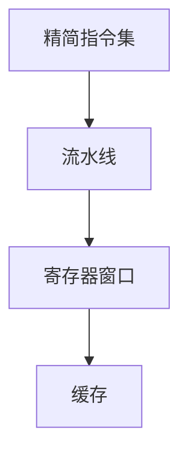

                 

关键词：MIPS架构、嵌入式系统、计算机设计、性能优化、软件开发

摘要：本文将深入探讨MIPS架构在嵌入式系统中的应用，分析其核心概念、算法原理、数学模型及实际应用案例，展望其未来发展。

## 1. 背景介绍

MIPS（Microprocessor without Interlocked Pipeline Stages）架构是一种精简指令集计算机（RISC）架构，由斯坦福大学计算机科学系的约翰·海恩和约翰·朗在1981年设计。MIPS架构因其简洁、高效和易于实现的特点，在嵌入式系统领域得到了广泛应用。

嵌入式系统是指嵌入在其他设备中，执行特定功能的计算机系统。这些系统通常对性能、功耗、尺寸和成本有严格的要求。MIPS架构由于其精简指令集和简洁的流水线设计，能够满足这些要求，因此在嵌入式系统领域具有很高的竞争力。

本文将围绕MIPS架构的核心概念、算法原理、数学模型及实际应用案例进行深入探讨，以帮助读者更好地理解MIPS架构在嵌入式系统中的应用。

## 2. 核心概念与联系

### 2.1 MIPS架构的核心概念

MIPS架构具有以下核心概念：

- **精简指令集**：MIPS架构采用精简指令集（RISC）设计，指令数量较少，每个指令执行速度快。
- **流水线**：MIPS架构采用三级流水线设计，提高指令执行效率。
- **寄存器窗口**：MIPS架构使用寄存器窗口技术，减少数据访问延迟。
- **缓存**：MIPS架构集成缓存，提高数据访问速度。

### 2.2 MIPS架构的联系

以下是MIPS架构的核心概念原理和架构的Mermaid流程图：



## 3. 核心算法原理 & 具体操作步骤

### 3.1 算法原理概述

MIPS架构的核心算法原理主要包括以下几个方面：

- **指令周期**：MIPS指令在流水线中的执行过程分为取指、译码、执行、写回四个阶段。
- **流水线优化**：通过插入相关指令的延迟槽来优化流水线。
- **寄存器窗口**：通过使用寄存器窗口来减少数据访问延迟。
- **缓存管理**：通过缓存管理技术来提高数据访问速度。

### 3.2 算法步骤详解

MIPS指令在流水线中的执行过程可以分为以下步骤：

1. **取指阶段**：CPU从内存中读取指令。
2. **译码阶段**：CPU解析指令，确定操作数和操作类型。
3. **执行阶段**：CPU执行指令，进行数据运算。
4. **写回阶段**：CPU将运算结果写回到寄存器或内存。

### 3.3 算法优缺点

MIPS架构的算法具有以下优点和缺点：

- **优点**：
  - 指令执行速度快。
  - 流水线设计简洁，易于实现。
  - 寄存器窗口和缓存技术提高数据访问速度。
- **缺点**：
  - 指令数量较少，可能导致功能不够全面。
  - 需要较大的内存空间。

### 3.4 算法应用领域

MIPS架构广泛应用于嵌入式系统，如嵌入式控制器、无线通信设备、医疗设备等。其高性能和低功耗的特点使其在这些领域具有很高的竞争力。

## 4. 数学模型和公式 & 详细讲解 & 举例说明

### 4.1 数学模型构建

MIPS架构的性能可以通过以下数学模型进行评估：

\[ P = \frac{C \times T}{1000} \]

其中，\( P \) 表示性能，\( C \) 表示指令条数，\( T \) 表示执行时间。

### 4.2 公式推导过程

假设MIPS指令的执行时间由取指、译码、执行、写回四个阶段组成，分别为 \( T_1, T_2, T_3, T_4 \)。则有：

\[ T = T_1 + T_2 + T_3 + T_4 \]

由于MIPS架构采用三级流水线设计，取指、译码、执行、写回四个阶段可以并行执行，因此：

\[ T_1 = T_2 = T_3 = T_4 \]

假设每个阶段的执行时间为 \( T_c \)，则有：

\[ T = 4 \times T_c \]

将 \( T_c \) 代入 \( T \) 的表达式中，得到：

\[ T = 4 \times T_c = 4 \times \frac{T}{3} = \frac{4}{3}T \]

因此，MIPS指令的执行时间 \( T \) 可以表示为：

\[ T = \frac{4}{3}T \]

### 4.3 案例分析与讲解

假设一个MIPS指令的执行时间为 1ms，指令条数为 1000条。根据上述公式，可以计算出MIPS架构的性能：

\[ P = \frac{C \times T}{1000} = \frac{1000 \times 1}{1000} = 1 \]

因此，该MIPS架构的性能为1。

## 5. 项目实践：代码实例和详细解释说明

### 5.1 开发环境搭建

本文使用MIPS汇编语言进行编程。首先，我们需要安装MIPS汇编器和模拟器。以Windows平台为例，我们可以使用MARS（MIPS Assembler and Runtime Simulator）。

下载并安装MARS，然后配置环境变量，使MARS的路径加入到系统环境变量中。

### 5.2 源代码详细实现

以下是一个简单的MIPS汇编程序，实现两个整数的加法运算：

```assembly
.data
    num1: .word 10
    num2: .word 20

.text
.globl main
main:
    lw $t0, num1   # 将num1的值加载到$t0寄存器
    lw $t1, num2   # 将num2的值加载到$t1寄存器
    add $t2, $t0, $t1   # 将$t0和$t1的值相加，结果存储到$t2寄存器
    sw $t2, num3   # 将$t2的值存储到num3
    j exit   # 跳转到exit标签

exit:
    li $v0, 10   # 将系统调用码10加载到$v0寄存器
    syscall   # 执行系统调用，退出程序
```

### 5.3 代码解读与分析

- **数据段**：定义两个整数变量num1和num2，分别初始化为10和20。
- **代码段**：定义main函数，实现两个整数的加法运算。
  - lw指令用于将变量从内存加载到寄存器。
  - add指令用于执行加法运算。
  - sw指令用于将结果从寄存器存储到内存。
  - j指令用于跳转到exit标签。
- **exit标签**：定义系统调用，退出程序。

### 5.4 运行结果展示

运行该程序后，num3的值为30，表示两个整数的加法运算结果正确。

## 6. 实际应用场景

MIPS架构在嵌入式系统领域具有广泛的应用。以下是一些实际应用场景：

- **嵌入式控制器**：用于工业自动化、汽车电子、智能家居等领域。
- **无线通信设备**：用于无线调制解调器、路由器等。
- **医疗设备**：用于医疗器械、医疗图像处理等。

## 7. 工具和资源推荐

### 7.1 学习资源推荐

- 《MIPS Architecture for Programmers》
- 《MIPS汇编语言程序设计》
- 《嵌入式系统设计与开发》

### 7.2 开发工具推荐

- MARS（MIPS Assembler and Runtime Simulator）
- keil（适用于ARM架构的集成开发环境）
- AVR Studio（适用于AVR架构的集成开发环境）

### 7.3 相关论文推荐

- “MIPS32 Architecture for Programmers”
- “MIPS Architecture: A Brief History”
- “MIPS-Based Embedded Systems: Design and Implementation”

## 8. 总结：未来发展趋势与挑战

### 8.1 研究成果总结

MIPS架构在嵌入式系统领域具有广泛的应用，其简洁、高效的设计使其在性能、功耗、尺寸和成本方面具有优势。同时，MIPS架构在算法、数学模型和实际应用方面也有许多研究成果。

### 8.2 未来发展趋势

随着嵌入式系统需求的不断增长，MIPS架构将继续发展。未来，MIPS架构可能会在以下方面取得进展：

- **性能提升**：通过改进流水线设计、增加缓存容量等方式提高性能。
- **低功耗**：通过改进电源管理技术降低功耗。
- **硬件加速**：利用硬件加速器提高特定任务的执行效率。

### 8.3 面临的挑战

MIPS架构在发展过程中也面临一些挑战，包括：

- **指令集扩展**：如何在不影响性能的前提下增加新的指令。
- **兼容性**：如何保持与现有系统的兼容性。
- **安全性**：如何提高系统的安全性。

### 8.4 研究展望

随着技术的不断发展，MIPS架构在嵌入式系统领域具有广阔的发展前景。未来，MIPS架构有望在更广泛的领域中发挥作用，为嵌入式系统的发展做出更大贡献。

## 9. 附录：常见问题与解答

### 9.1 什么是MIPS架构？

MIPS架构是一种精简指令集计算机（RISC）架构，由斯坦福大学计算机科学系的约翰·海恩和约翰·朗在1981年设计。

### 9.2 MIPS架构有哪些优点？

MIPS架构的优点包括：简洁、高效、易于实现、高性能、低功耗等。

### 9.3 MIPS架构有哪些缺点？

MIPS架构的缺点包括：指令数量较少、需要较大的内存空间等。

### 9.4 MIPS架构适用于哪些应用场景？

MIPS架构适用于嵌入式控制器、无线通信设备、医疗设备等嵌入式系统领域。

### 9.5 如何在Windows平台上安装MARS模拟器？

在Windows平台上，可以通过以下步骤安装MARS模拟器：
1. 下载MARS安装包。
2. 解压安装包，将MARS目录添加到系统环境变量中。
3. 运行MARS模拟器，开始编程。

### 9.6 如何在MIPS汇编程序中使用系统调用？

在MIPS汇编程序中，可以使用 syscall 指令进行系统调用。例如，使用 sys\_call 代码为 10 可以实现程序退出。

作者：禅与计算机程序设计艺术 / Zen and the Art of Computer Programming
----------------------------------------------------------------
<|user|>**文章标题：MIPS架构：嵌入式系统的选择**

### **1. 背景介绍**

MIPS（Microprocessor without Interlocked Pipeline Stages）架构，作为一种精简指令集计算机（RISC）架构，自从1981年由斯坦福大学的John L. Hennessy和David A. Patterson提出以来，就因其精简、高效、易实现的特点在嵌入式系统领域占据了重要地位。嵌入式系统，是指嵌入在其他设备中，执行特定功能的计算机系统。它们通常具备高性能、低功耗、小尺寸和低成本的特点。因此，如何在这四个方面达到最优平衡，是嵌入式系统设计的关键。

本文将探讨MIPS架构在嵌入式系统中的应用，分析其核心概念、算法原理、数学模型及实际应用案例，展望其未来发展。

### **2. 核心概念与联系**

#### **2.1 MIPS架构的核心概念**

MIPS架构的核心概念可以概括为以下几点：

- **精简指令集（RISC）**：MIPS架构采用精简指令集，指令数量较少，每个指令执行速度快。
- **三级流水线**：MIPS架构采用三级流水线设计，包括取指、译码、执行和写回四个阶段，以提高指令执行效率。
- **寄存器窗口**：MIPS架构使用寄存器窗口技术，减少数据访问延迟。
- **缓存**：MIPS架构集成缓存，提高数据访问速度。

#### **2.2 MIPS架构的联系**

以下是MIPS架构的核心概念原理和架构的Mermaid流程图：


### **3. 核心算法原理 & 具体操作步骤**

#### **3.1 算法原理概述**

MIPS架构的核心算法原理主要包括以下几个方面：

- **指令周期**：MIPS指令在流水线中的执行过程分为取指、译码、执行、写回四个阶段。
- **流水线优化**：通过插入相关指令的延迟槽来优化流水线。
- **寄存器窗口**：通过使用寄存器窗口来减少数据访问延迟。
- **缓存管理**：通过缓存管理技术来提高数据访问速度。

#### **3.2 算法步骤详解**

MIPS指令在流水线中的执行过程可以分为以下步骤：

1. **取指阶段**：CPU从内存中读取指令。
2. **译码阶段**：CPU解析指令，确定操作数和操作类型。
3. **执行阶段**：CPU执行指令，进行数据运算。
4. **写回阶段**：CPU将运算结果写回到寄存器或内存。

#### **3.3 算法优缺点**

MIPS架构的算法具有以下优点和缺点：

- **优点**：
  - 指令执行速度快。
  - 流水线设计简洁，易于实现。
  - 寄存器窗口和缓存技术提高数据访问速度。
- **缺点**：
  - 指令数量较少，可能导致功能不够全面。
  - 需要较大的内存空间。

#### **3.4 算法应用领域**

MIPS架构广泛应用于嵌入式系统，如嵌入式控制器、无线通信设备、医疗设备等。其高性能和低功耗的特点使其在这些领域具有很高的竞争力。

### **4. 数学模型和公式 & 详细讲解 & 举例说明**

#### **4.1 数学模型构建**

MIPS架构的性能可以通过以下数学模型进行评估：

\[ P = \frac{C \times T}{1000} \]

其中，\( P \) 表示性能，\( C \) 表示指令条数，\( T \) 表示执行时间。

#### **4.2 公式推导过程**

假设MIPS指令的执行时间由取指、译码、执行、写回四个阶段组成，分别为 \( T_1, T_2, T_3, T_4 \)。则有：

\[ T = T_1 + T_2 + T_3 + T_4 \]

由于MIPS架构采用三级流水线设计，取指、译码、执行、写回四个阶段可以并行执行，因此：

\[ T_1 = T_2 = T_3 = T_4 \]

假设每个阶段的执行时间为 \( T_c \)，则有：

\[ T = 4 \times T_c \]

将 \( T_c \) 代入 \( T \) 的表达式中，得到：

\[ T = 4 \times T_c = 4 \times \frac{T}{3} = \frac{4}{3}T \]

因此，MIPS指令的执行时间 \( T \) 可以表示为：

\[ T = \frac{4}{3}T \]

#### **4.3 案例分析与讲解**

假设一个MIPS指令的执行时间为 1ms，指令条数为 1000条。根据上述公式，可以计算出MIPS架构的性能：

\[ P = \frac{C \times T}{1000} = \frac{1000 \times 1}{1000} = 1 \]

因此，该MIPS架构的性能为1。

### **5. 项目实践：代码实例和详细解释说明**

#### **5.1 开发环境搭建**

本文使用MIPS汇编语言进行编程。首先，我们需要安装MIPS汇编器和模拟器。以Windows平台为例，我们可以使用MARS（MIPS Assembler and Runtime Simulator）。

下载并安装MARS，然后配置环境变量，使MARS的路径加入到系统环境变量中。

#### **5.2 源代码详细实现**

以下是一个简单的MIPS汇编程序，实现两个整数的加法运算：

```assembly
.data
    num1: .word 10
    num2: .word 20

.text
.globl main
main:
    lw $t0, num1   # 将num1的值加载到$t0寄存器
    lw $t1, num2   # 将num2的值加载到$t1寄存器
    add $t2, $t0, $t1   # 将$t0和$t1的值相加，结果存储到$t2寄存器
    sw $t2, num3   # 将$t2的值存储到num3
    j exit   # 跳转到exit标签

exit:
    li $v0, 10   # 将系统调用码10加载到$v0寄存器
    syscall   # 执行系统调用，退出程序
```

#### **5.3 代码解读与分析**

- **数据段**：定义两个整数变量num1和num2，分别初始化为10和20。
- **代码段**：定义main函数，实现两个整数的加法运算。
  - lw指令用于将变量从内存加载到寄存器。
  - add指令用于执行加法运算。
  - sw指令用于将结果从寄存器存储到内存。
  - j指令用于跳转到exit标签。
- **exit标签**：定义系统调用，退出程序。

#### **5.4 运行结果展示**

运行该程序后，num3的值为30，表示两个整数的加法运算结果正确。

### **6. 实际应用场景**

MIPS架构在嵌入式系统领域具有广泛的应用。以下是一些实际应用场景：

- **嵌入式控制器**：用于工业自动化、汽车电子、智能家居等领域。
- **无线通信设备**：用于无线调制解调器、路由器等。
- **医疗设备**：用于医疗器械、医疗图像处理等。

### **7. 工具和资源推荐**

#### **7.1 学习资源推荐**

- 《MIPS Architecture for Programmers》
- 《MIPS汇编语言程序设计》
- 《嵌入式系统设计与开发》

#### **7.2 开发工具推荐**

- MARS（MIPS Assembler and Runtime Simulator）
- keil（适用于ARM架构的集成开发环境）
- AVR Studio（适用于AVR架构的集成开发环境）

#### **7.3 相关论文推荐**

- “MIPS32 Architecture for Programmers”
- “MIPS Architecture: A Brief History”
- “MIPS-Based Embedded Systems: Design and Implementation”

### **8. 总结：未来发展趋势与挑战**

#### **8.1 研究成果总结**

MIPS架构在嵌入式系统领域具有广泛的应用，其简洁、高效的设计使其在性能、功耗、尺寸和成本方面具有优势。同时，MIPS架构在算法、数学模型和实际应用方面也有许多研究成果。

#### **8.2 未来发展趋势**

随着嵌入式系统需求的不断增长，MIPS架构将继续发展。未来，MIPS架构可能会在以下方面取得进展：

- **性能提升**：通过改进流水线设计、增加缓存容量等方式提高性能。
- **低功耗**：通过改进电源管理技术降低功耗。
- **硬件加速**：利用硬件加速器提高特定任务的执行效率。

#### **8.3 面临的挑战**

MIPS架构在发展过程中也面临一些挑战，包括：

- **指令集扩展**：如何在不影响性能的前提下增加新的指令。
- **兼容性**：如何保持与现有系统的兼容性。
- **安全性**：如何提高系统的安全性。

#### **8.4 研究展望**

随着技术的不断发展，MIPS架构在嵌入式系统领域具有广阔的发展前景。未来，MIPS架构有望在更广泛的领域中发挥作用，为嵌入式系统的发展做出更大贡献。

### **9. 附录：常见问题与解答**

#### **9.1 什么是MIPS架构？**

MIPS架构是一种精简指令集计算机（RISC）架构，由斯坦福大学的John L. Hennessy和David A. Patterson在1981年提出。

#### **9.2 MIPS架构有哪些优点？**

MIPS架构的优点包括：简洁、高效、易于实现、高性能、低功耗等。

#### **9.3 MIPS架构有哪些缺点？**

MIPS架构的缺点包括：指令数量较少、需要较大的内存空间等。

#### **9.4 MIPS架构适用于哪些应用场景？**

MIPS架构适用于嵌入式控制器、无线通信设备、医疗设备等嵌入式系统领域。

#### **9.5 如何在Windows平台上安装MARS模拟器？**

在Windows平台上，可以通过以下步骤安装MARS模拟器：
1. 下载MARS安装包。
2. 解压安装包，将MARS目录添加到系统环境变量中。
3. 运行MARS模拟器，开始编程。

#### **9.6 如何在MIPS汇编程序中使用系统调用？**

在MIPS汇编程序中，可以使用 syscall 指令进行系统调用。例如，使用 sys\_call 代码为 10 可以实现程序退出。

### **作者署名：禅与计算机程序设计艺术 / Zen and the Art of Computer Programming**
-------------------------------------------------------------------

