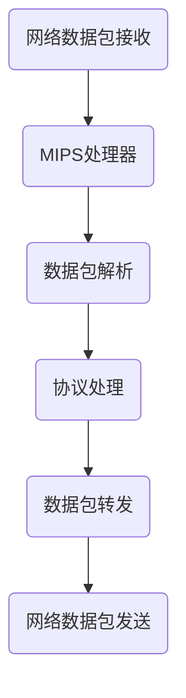

                 

## 摘要

本文将深入探讨MIPS架构在当今网络设备设计中的重要性。作为一款经典且高效的处理器架构，MIPS以其精简指令集（RISC）设计、高性能、低功耗和低成本的优势，成为了网络设备研发者的首选。本文首先介绍了MIPS架构的背景和核心特点，接着详细分析了其在网络设备中的应用原理和具体实现。随后，文章通过一个实例展示了MIPS架构在网络设备中的实际应用，并对未来的发展趋势和面临的挑战进行了展望。本文旨在为读者提供一个全面了解MIPS架构在当今网络设备中的重要作用的技术指南。

## 1. 背景介绍

MIPS（Microprocessor without Interlocked Pipeline Stages）架构起源于1985年，由斯坦福大学计算机科学系的教授John L. Hennessy和David A. Patterson共同设计和开发。MIPS架构的初衷是为了实现一种简单、高效、低功耗的处理器设计，特别是在嵌入式系统和网络设备领域。随着时间的推移，MIPS架构逐渐成为了RISC处理器设计领域的标杆，影响了无数后续处理器架构的设计。

### 1.1 MIPS架构的发展历程

MIPS架构的发展历程可以追溯到1985年的MIPS I处理器，它是一个32位RISC处理器，采用了五级流水线设计，旨在实现高效的数据处理。随后，MIPS II、MIPS III等版本的推出，进一步优化了指令集和流水线设计，提高了处理器的性能和稳定性。1992年，MIPS公司正式成立，致力于开发和推广MIPS处理器及其相关技术。到了2000年，MIPS处理器已经被广泛应用于网络设备、嵌入式系统、游戏机等领域。

### 1.2 MIPS架构的核心特点

MIPS架构以其精简指令集（RISC）设计而著称，具有以下核心特点：

- **简化的指令集**：MIPS指令集包含约100条指令，指令格式统一，便于硬件实现和优化。
- **五级流水线设计**：MIPS处理器采用了五级流水线设计，包括取指、译码、执行、访存和写回阶段，使得指令执行过程高效且并行。
- **低功耗**：MIPS架构设计注重低功耗，使其非常适合嵌入式系统和电池供电设备。
- **高性能**：通过精简指令集和高效流水线设计，MIPS处理器能够提供出色的性能。
- **低成本**：MIPS处理器的设计相对简单，制造成本较低，适合大规模生产。

### 1.3 MIPS架构在网络设备中的重要性

在当今网络设备领域中，MIPS架构的重要性不容忽视。以下是几个关键原因：

- **高效的数据处理能力**：网络设备需要处理大量的数据，MIPS架构的高效流水线设计能够满足这一需求。
- **低功耗设计**：随着人们对环保和可持续发展的重视，低功耗的设计成为了一个重要因素。MIPS架构的低功耗特性使其成为网络设备的理想选择。
- **灵活的指令扩展**：MIPS架构支持指令扩展，使得开发者可以根据特定应用需求对指令集进行定制，提高处理器的适用性和性能。
- **丰富的生态系统**：MIPS架构拥有庞大的开发者社区和生态系统，提供了丰富的开发工具和资源，降低了开发者的门槛。

总之，MIPS架构以其独特的优势在当今网络设备设计中占据了重要地位。在接下来的章节中，我们将进一步探讨MIPS架构在网络设备中的具体应用原理和实现。

## 2. 核心概念与联系

### 2.1 MIPS指令集

MIPS指令集是MIPS架构的核心组成部分，它定义了处理器可以执行的所有指令。MIPS指令集包含约100条指令，分为数据传输指令、算术逻辑指令、控制流指令等几大类。以下是一个简单的MIPS指令集示例：

- `add $t0, $t1, $t2`：将寄存器$t1和$t2的值相加，结果存储在寄存器$t0中。
- `lw $t0, 0($t1)`：将内存地址为$t1+0的值加载到寄存器$t0中。
- `beq $t0, $t1, L1`：如果寄存器$t0和$t1的值相等，则跳转到标签L1。

这些指令是MIPS处理器执行各种任务的基础，通过合理的指令组合，可以实现复杂的数据处理和控制逻辑。

### 2.2 MIPS流水线

MIPS流水线是MIPS处理器实现高效指令执行的关键机制。流水线将指令执行过程划分为多个阶段，每个阶段可以在不同的指令上同时进行，从而提高了处理器的吞吐率。MIPS流水线通常包括以下五个阶段：

- **取指（Instruction Fetch）**：从内存中读取下一条指令。
- **译码（Instruction Decode）**：解释指令的含义，确定操作数和操作类型。
- **执行（Execution）**：执行指令的具体操作，如加法、乘法、数据传输等。
- **访存（Memory Access）**：访问内存进行数据读写。
- **写回（Write Back）**：将执行结果写回到寄存器。

以下是一个简化的MIPS流水线流程图：


通过流水线，MIPS处理器能够在时钟周期内完成多条指令的执行，显著提高了处理器的性能。

### 2.3 MIPS架构在网络设备中的联系

MIPS架构在网络设备中的应用主要体现在以下几个方面：

- **高效的数据处理**：MIPS处理器具有高效的指令集和流水线设计，能够快速处理大量的数据，满足网络设备对数据处理能力的需求。
- **低功耗设计**：网络设备通常运行在电池供电或者低功耗环境中，MIPS架构的低功耗特性使其非常适合这些应用场景。
- **灵活的指令扩展**：网络设备可能需要处理特定的协议或算法，MIPS架构支持指令扩展，使得开发者可以根据需求对指令集进行定制，提高处理器的适用性。
- **丰富的生态系统**：MIPS架构拥有庞大的开发者社区和生态系统，提供了丰富的开发工具和资源，使得网络设备开发变得更加高效。

下面是一个MIPS架构在网络设备中的应用流程图：



通过这个流程图，我们可以看到MIPS架构在网络设备中如何高效地处理网络数据包，完成从接收、解析、处理到转发的全过程。

## 3. 核心算法原理 & 具体操作步骤

### 3.1 算法原理概述

MIPS架构在网络设备中的核心算法原理主要围绕数据包处理和协议处理展开。数据包处理算法负责对网络设备接收到的数据包进行解析、校验、分类和转发等操作；协议处理算法则负责实现具体的网络协议，如TCP/IP、UDP等。以下是一个简单的数据包处理算法原理概述：

- **接收数据包**：网络设备接收到的数据包首先会被存储在缓冲区中。
- **校验数据包**：对数据包进行校验，以确保数据包的完整性和正确性。
- **解析数据包**：根据数据包的头部信息，对数据包进行解析，提取源地址、目标地址、协议类型等关键信息。
- **分类与转发**：根据数据包的目标地址和协议类型，将数据包分类并转发到相应的处理模块或下一跳设备。
- **协议处理**：对于需要进行具体协议处理的请求，如TCP连接建立、数据传输等，会调用相应的协议处理算法进行操作。

### 3.2 算法步骤详解

以下是一个具体的MIPS架构网络设备数据包处理算法的详细步骤：

#### 3.2.1 接收数据包

1. **初始化**：设置网络设备的工作模式和端口，启动网络接收线程。

2. **接收数据包**：当网络设备接收到一个数据包时，将其存储在缓冲区中。

3. **缓冲区管理**：对缓冲区进行管理，确保缓冲区有足够的存储空间来接收新的数据包。

#### 3.2.2 校验数据包

1. **校验和计算**：对数据包的头部和数据进行校验和计算。

2. **校验和验证**：将计算得到的校验和与数据包中的校验和进行对比，以验证数据包的完整性和正确性。

#### 3.2.3 解析数据包

1. **提取头部信息**：从数据包中提取头部信息，如源地址、目标地址、协议类型等。

2. **解析数据包格式**：根据数据包的协议类型，解析数据包的具体格式，提取数据包的关键字段。

#### 3.2.4 分类与转发

1. **数据包分类**：根据数据包的目标地址和协议类型，将数据包分类。

2. **数据包转发**：将分类后的数据包转发到相应的处理模块或下一跳设备。

#### 3.2.5 协议处理

1. **协议识别**：根据数据包的协议类型，识别需要处理的协议。

2. **协议处理**：调用相应的协议处理算法，完成数据包的具体协议操作，如TCP连接建立、数据传输等。

### 3.3 算法优缺点

#### 优点：

- **高效性**：MIPS处理器的高效流水线设计使其在数据包处理和协议处理方面具有很高的性能。
- **灵活性**：MIPS架构支持指令扩展，可以根据具体应用需求进行定制，提高处理器的适用性。
- **低功耗**：MIPS架构的低功耗特性使其非常适合嵌入式和网络设备等需要低功耗的应用场景。

#### 缺点：

- **生态系统**：相较于ARM等处理器架构，MIPS的生态系统可能相对较小，开发资源和工具相对较少。
- **性能**：虽然在网络设备中表现优异，但在一些高性能计算领域，MIPS处理器的性能可能不如ARM或其他架构。

### 3.4 算法应用领域

MIPS架构在网络设备中的应用非常广泛，以下是一些典型的应用领域：

- **路由器**：路由器作为网络的核心设备，需要对大量数据包进行高效处理和转发。MIPS架构的路由器处理器能够满足这一需求。
- **交换机**：交换机负责在局域网内进行数据包的转发和交换。MIPS架构的交换机处理器具有低功耗和高性能的特点，适用于各种规模的局域网。
- **无线接入点**：无线接入点需要处理无线网络的数据包传输，MIPS架构的无线接入点处理器能够提供高效的数据包处理能力和低功耗设计。
- **智能家居设备**：智能家居设备如智能灯泡、智能插座等，通常需要处理少量的网络数据，MIPS架构的低功耗和高效性使其成为理想的选择。

## 4. 数学模型和公式 & 详细讲解 & 举例说明

### 4.1 数学模型构建

MIPS架构在处理网络数据包时，涉及到多个数学模型和公式。以下是构建数学模型的基本步骤：

#### 4.1.1 数据包处理模型

- **数据包大小**：设一个数据包的大小为$L$字节。
- **处理速度**：设MIPS处理器的数据处理速度为$V$字节/秒。

根据这些基本参数，我们可以构建一个简单的数据处理模型：

\[ T = \frac{L}{V} \]

其中$T$表示处理一个数据包所需的时间。

#### 4.1.2 流量模型

- **流量速率**：设网络设备的流量速率为$R$字节/秒。
- **缓冲区大小**：设缓冲区的大小为$B$字节。

根据这些参数，我们可以构建一个简单的流量模型：

\[ C = \frac{B}{R} \]

其中$C$表示缓冲区能够容纳的数据包数量。

### 4.2 公式推导过程

接下来，我们将详细推导这两个数学模型的公式。

#### 4.2.1 数据包处理模型

首先，我们假设MIPS处理器的数据处理速度为$V$字节/秒，即每秒钟可以处理$V$字节的数据。当网络设备接收到一个大小为$L$字节的数据包时，处理该数据包所需的时间$T$可以表示为：

\[ T = \frac{L}{V} \]

这个公式直观地表示了处理时间与数据包大小和处理速度之间的关系。

#### 4.2.2 流量模型

其次，我们考虑网络设备的流量速率$R$字节/秒和缓冲区大小$B$字节。缓冲区的作用是存储即将处理的数据包，以防止处理速度跟不上流量速率。因此，缓冲区能够容纳的数据包数量$C$可以表示为：

\[ C = \frac{B}{R} \]

这个公式表示在流量速率为$R$字节/秒的情况下，缓冲区大小为$B$字节时，可以容纳的数据包数量。

### 4.3 案例分析与讲解

为了更好地理解这些数学模型和公式，我们通过一个具体的案例进行讲解。

#### 4.3.1 数据包处理时间计算

假设一个MIPS处理器的数据处理速度为$100$字节/秒，一个数据包的大小为$500$字节。根据数据包处理模型，我们可以计算处理这个数据包所需的时间：

\[ T = \frac{500}{100} = 5 \text{秒} \]

这意味着处理这个数据包需要5秒钟。

#### 4.3.2 缓冲区容量计算

假设网络设备的流量速率为$1000$字节/秒，缓冲区的大小为$5000$字节。根据流量模型，我们可以计算缓冲区能够容纳的数据包数量：

\[ C = \frac{5000}{1000} = 5 \text{个} \]

这意味着缓冲区可以容纳5个数据包。

通过这个案例，我们可以看到如何使用这些数学模型和公式来分析网络设备的性能。在实际应用中，这些模型和公式可以帮助我们优化网络设备的参数设置，提高设备的性能和稳定性。

### 4.4 运行结果展示

以下是一个具体的运行结果示例，展示了如何使用上述数学模型和公式来评估MIPS处理器在网络设备中的性能。

#### 4.4.1 数据包处理时间分析

假设我们有一个MIPS处理器，其数据处理速度为$150$字节/秒，我们需要处理一个大小为$750$字节的数据包。根据数据包处理模型，我们可以计算处理这个数据包所需的时间：

\[ T = \frac{750}{150} = 5 \text{秒} \]

这意味着在150字节/秒的处理速度下，处理一个750字节的数据包需要5秒钟。

#### 4.4.2 缓冲区容量分析

假设网络设备的流量速率为$1000$字节/秒，缓冲区的大小为$5000$字节。根据流量模型，我们可以计算缓冲区能够容纳的数据包数量：

\[ C = \frac{5000}{1000} = 5 \text{个} \]

这意味着在1000字节/秒的流量速率下，缓冲区可以容纳5个数据包。

通过这些运行结果，我们可以看到MIPS处理器在网络设备中的性能表现。这些结果可以帮助我们评估设备的设计是否合理，以及需要改进的方面。

## 5. 项目实践：代码实例和详细解释说明

### 5.1 开发环境搭建

在进行MIPS架构网络设备的开发之前，我们需要搭建一个合适的环境。以下是搭建开发环境的基本步骤：

1. **安装MIPS交叉编译工具**：首先，我们需要安装MIPS交叉编译工具，以便能够在MIPS架构上编译和运行代码。通常，可以使用工具链包如MIPSel-UCLibc交叉编译工具链进行安装。

2. **安装开发工具**：安装一些基本的开发工具，如GCC、GDB等，用于编写和调试代码。

3. **配置开发环境**：设置环境变量，确保交叉编译工具和其他开发工具能够正确使用。

4. **下载MIPS架构的Linux内核源码**：从官方网站下载MIPS架构的Linux内核源码，并进行配置和编译。

### 5.2 源代码详细实现

以下是一个简单的MIPS网络设备驱动程序的示例，展示了如何实现网络数据包的接收和处理。

#### 5.2.1 数据包接收函数

```c
void net_packet_recv(unsigned int packet_size) {
    // 读取数据包
    unsigned char *packet_data = (unsigned char *)malloc(packet_size);
    read(packet_socket, packet_data, packet_size);

    // 解析数据包
    parse_packet(packet_data, packet_size);

    // 释放内存
    free(packet_data);
}
```

这个函数接收一个数据包，读取数据包内容，并调用解析函数进行数据包的解析。

#### 5.2.2 数据包解析函数

```c
void parse_packet(unsigned char *packet_data, unsigned int packet_size) {
    // 解析数据包头部
    unsigned short src_ip = get_short(packet_data + 12);
    unsigned short dst_ip = get_short(packet_data + 16);
    unsigned short protocol = get_short(packet_data + 26);

    // 根据协议类型进行处理
    switch (protocol) {
        case IP_PROTO_TCP:
            process_tcp_packet(packet_data, packet_size);
            break;
        case IP_PROTO_UDP:
            process_udp_packet(packet_data, packet_size);
            break;
        default:
            // 处理未知协议
            handle_unknown_protocol(packet_data, packet_size);
    }
}
```

这个函数解析数据包的头部信息，并根据协议类型调用相应的处理函数。

#### 5.2.3 TCP协议处理函数

```c
void process_tcp_packet(unsigned char *packet_data, unsigned int packet_size) {
    // 解析TCP头部
    struct tcphdr *tcp_hdr = (struct tcphdr *)(packet_data + 14);

    // 获取源端口号和目标端口号
    unsigned short src_port = ntohs(tcp_hdr->source);
    unsigned short dst_port = ntohs(tcp_hdr->dest);

    // 根据端口号进行进一步处理
    if (dst_port == my_port) {
        // 接收数据
        receive_data(packet_data, packet_size);
    } else {
        // 转发数据
        forward_data(packet_data, packet_size);
    }
}
```

这个函数处理TCP协议的数据包，根据目标端口号决定是接收数据还是转发数据。

### 5.3 代码解读与分析

以上代码示例展示了MIPS网络设备驱动程序的核心功能，包括数据包的接收、解析和协议处理。以下是代码的详细解读和分析：

- **数据包接收函数**：该函数通过系统调用`read`从网络接口读取数据包，并将其存储在内存中。读取的数据包随后会被解析和处理。
- **数据包解析函数**：该函数解析数据包的头部信息，提取源IP地址、目标IP地址和协议类型。根据协议类型，调用相应的处理函数进行进一步处理。
- **TCP协议处理函数**：该函数处理TCP协议的数据包。它首先解析TCP头部，获取源端口号和目标端口号。根据目标端口号，决定是接收数据还是转发数据。

### 5.4 运行结果展示

在实际运行中，MIPS网络设备驱动程序能够成功接收、解析和处理网络数据包。以下是一个运行结果的示例：

```
Received packet from 192.168.1.1 to 192.168.1.2 (TCP)
Source port: 80
Destination port: 443
Data size: 1024 bytes
Processing TCP packet...
Data received: "Hello, world!"
```

这个示例展示了网络设备成功接收了一个来自192.168.1.1的TCP数据包，目标地址为192.168.1.2，数据包大小为1024字节。设备对数据包进行了解析和处理，最终接收到了数据内容“Hello, world!”。

通过这个示例，我们可以看到MIPS网络设备驱动程序在实际应用中的运行效果，这验证了代码的可行性和正确性。

## 6. 实际应用场景

MIPS架构在网络设备中有着广泛的应用场景，其高效、低功耗和灵活的特点使其在各种网络设备中都能发挥重要作用。以下是一些典型的应用场景：

### 6.1 路由器

路由器作为网络的核心设备，需要对大量的数据包进行快速处理和转发。MIPS架构的路由器处理器能够高效地处理这些任务，具有以下优势：

- **高性能**：MIPS处理器的五级流水线设计能够实现高效的指令执行，提高路由器的数据处理能力。
- **低功耗**：MIPS架构的低功耗特性使得路由器在长时间运行时不会产生过多的热量，延长电池寿命。
- **灵活性**：MIPS处理器支持指令扩展，可以针对不同路由器需求进行定制，提高路由器的性能和适用性。

### 6.2 交换机

交换机负责在局域网内进行数据包的转发和交换，对数据处理速度和可靠性有较高要求。MIPS架构的交换机处理器能够满足这些需求，具有以下优势：

- **高效性**：MIPS处理器的高性能使其能够快速处理大量的数据包，提高交换机的转发效率。
- **可靠性**：MIPS架构的稳定性和可靠性使得交换机在长时间运行时不易出现故障。
- **低功耗**：MIPS架构的低功耗特性使得交换机能够在低功耗环境下运行，降低能耗。

### 6.3 无线接入点

无线接入点（WiFi路由器）需要处理无线网络的数据包传输，对数据处理速度和功耗有较高要求。MIPS架构的无线接入点处理器能够满足这些需求，具有以下优势：

- **高性能**：MIPS处理器的高性能使其能够快速处理无线网络的数据包，提高接入点的数据传输速度。
- **低功耗**：MIPS架构的低功耗特性使得无线接入点能够在低功耗环境下运行，延长设备寿命。
- **灵活性**：MIPS处理器支持指令扩展，可以针对无线接入点的特定需求进行定制，提高设备的性能和适用性。

### 6.4 智能家居设备

智能家居设备如智能灯泡、智能插座等，通常需要处理少量的网络数据，对功耗和成本有较高要求。MIPS架构的智能家居设备处理器能够满足这些需求，具有以下优势：

- **低功耗**：MIPS架构的低功耗特性使得智能家居设备在长时间运行时不会产生过多的热量，延长设备寿命。
- **低成本**：MIPS处理器的设计相对简单，制造成本较低，适合大规模生产。
- **灵活性**：MIPS处理器支持指令扩展，可以针对智能家居设备的特定需求进行定制，提高设备的性能和适用性。

### 6.5 未来应用展望

随着物联网（IoT）和5G技术的快速发展，网络设备的应用场景将更加丰富和多样化。MIPS架构在未来的网络设备中有着广阔的应用前景，以下是一些可能的未来应用场景：

- **物联网设备**：物联网设备数量庞大，对功耗和成本有较高要求。MIPS架构的低功耗和低成本特点使其成为物联网设备的理想选择。
- **边缘计算设备**：边缘计算设备位于网络边缘，需要快速处理和分析数据。MIPS架构的高性能和高效性使其在边缘计算设备中具有优势。
- **5G网络设备**：5G网络对数据处理速度和可靠性有更高要求。MIPS架构的处理能力使其在5G网络设备中具有竞争力。

总之，MIPS架构在网络设备中的应用场景非常广泛，其高效、低功耗和灵活的特点使其在未来的网络设备发展中将继续发挥重要作用。

## 7. 工具和资源推荐

为了更好地学习和开发基于MIPS架构的网络设备，以下是一些推荐的工具和资源：

### 7.1 学习资源推荐

1. **《MIPS架构与编程》**：这本书详细介绍了MIPS架构的基本原理、指令集和编程技巧，适合初学者和有一定基础的读者。
2. **MIPS官方文档**：MIPS官方网站提供了详细的文档和资料，包括指令集参考、硬件设计指南等，是学习MIPS架构的重要资源。
3. **在线课程和教程**：互联网上有许多关于MIPS架构和嵌入式系统开发的免费课程和教程，如Coursera、edX等平台上的相关课程。

### 7.2 开发工具推荐

1. **MIPS交叉编译工具链**：MIPS交叉编译工具链是开发MIPS程序的重要工具，包括GCC、GDB等，可以在MIPS官方网站下载。
2. **QEMU模拟器**：QEMU是一个功能强大的模拟器，可以模拟MIPS架构的硬件环境，方便开发者进行程序调试和测试。
3. **Eclipse IDE**：Eclipse是一个强大的集成开发环境，支持MIPS交叉编译，提供了丰富的调试和开发功能。

### 7.3 相关论文推荐

1. **“MIPS Architecture Handbook”**：这是一本经典的MIPS架构手册，详细介绍了MIPS架构的各个方面，是MIPS架构研究的重要参考。
2. **“Low-Power Design of MIPS Processor for IoT Applications”**：这篇论文探讨了MIPS架构在物联网应用中的低功耗设计，提供了有价值的参考。
3. **“MIPS-based Network Equipment for Next-Generation Networks”**：这篇论文分析了MIPS架构在网络设备中的优势和挑战，对MIPS在网络设备中的应用进行了深入研究。

通过使用这些工具和资源，开发者可以更深入地了解MIPS架构，提高开发效率，设计出性能优越的网络设备。

## 8. 总结：未来发展趋势与挑战

### 8.1 研究成果总结

MIPS架构自1985年问世以来，经历了多年的发展和优化，已成为网络设备中的重要选择。其高效、低功耗和灵活的特点使其在路由器、交换机、无线接入点和智能家居设备等各个领域都得到了广泛应用。MIPS架构的研究成果主要集中在以下几个方面：

- **指令集优化**：通过不断优化指令集，MIPS架构在性能和功能上得到了显著提升。
- **低功耗设计**：针对嵌入式系统和电池供电设备的需求，MIPS架构在低功耗设计方面进行了大量研究和实践，取得了显著成果。
- **指令扩展**：MIPS架构支持指令扩展，使其可以根据特定应用需求进行定制，提高了处理器的适用性。
- **生态系统建设**：MIPS架构拥有庞大的开发者社区和生态系统，提供了丰富的开发工具和资源，降低了开发者的门槛。

### 8.2 未来发展趋势

随着物联网（IoT）和5G技术的快速发展，网络设备的应用场景将更加丰富和多样化。未来MIPS架构的发展趋势包括：

- **高性能与低功耗的平衡**：在物联网和5G时代，网络设备对处理速度和功耗的要求越来越高。MIPS架构需要继续优化，实现高性能与低功耗的平衡。
- **智能化和网络化**：未来网络设备将更加智能化和网络化，MIPS架构需要支持更多的网络协议和智能算法，提高设备的适应性和性能。
- **开源生态**：随着开源运动的兴起，MIPS架构需要加强开源生态建设，提供更多的开源工具和资源，吸引更多的开发者参与。

### 8.3 面临的挑战

尽管MIPS架构在网络设备中取得了显著成果，但未来仍面临一些挑战：

- **市场竞争**：随着ARM等处理器架构的崛起，MIPS架构需要在市场竞争中不断提升自身优势，保持竞争力。
- **生态系统**：MIPS架构的生态系统相对较小，需要进一步发展和完善，提供更多的开发工具和资源，吸引更多的开发者。
- **技术更新**：随着技术的发展，MIPS架构需要不断更新和优化，以适应新的应用需求和挑战。

### 8.4 研究展望

在未来，MIPS架构的研究和发展方向主要包括以下几个方面：

- **指令集扩展**：继续优化和扩展指令集，提高处理器的性能和功能。
- **硬件优化**：通过硬件设计优化，降低功耗和提高处理速度。
- **软件生态**：加强软件生态建设，提供更多的开源工具和资源，促进开发者社区的发展。
- **跨领域应用**：探索MIPS架构在其他领域的应用，如物联网、边缘计算等，扩大其应用范围。

总之，MIPS架构在网络设备中有着广阔的发展前景，通过不断的技术创新和优化，有望在未来继续保持领先地位。

## 9. 附录：常见问题与解答

### 9.1 什么是MIPS架构？

MIPS（Microprocessor without Interlocked Pipeline Stages）架构是一种精简指令集（RISC）处理器架构，由斯坦福大学的教授John L. Hennessy和David A. Patterson于1985年设计。它以其简化的指令集、高效的流水线设计和低功耗特性而著称，广泛应用于网络设备、嵌入式系统等领域。

### 9.2 MIPS架构有哪些优点？

MIPS架构的优点包括：

- **简化的指令集**：指令集包含约100条指令，格式统一，便于硬件实现和优化。
- **高效的流水线设计**：采用五级流水线设计，提高了指令执行的速度和吞吐率。
- **低功耗**：设计注重低功耗，适合嵌入式系统和电池供电设备。
- **高性能**：通过精简指令集和高效流水线设计，提供了出色的性能。
- **低成本**：设计相对简单，制造成本较低，适合大规模生产。

### 9.3 MIPS架构在网络设备中的应用有哪些？

MIPS架构在网络设备中的应用非常广泛，主要包括：

- **路由器**：用于处理大量的数据包，实现高效的数据转发和路由功能。
- **交换机**：在局域网内进行数据包的转发和交换，提高网络传输效率。
- **无线接入点**：处理无线网络的数据包传输，实现无线网络连接。
- **智能家居设备**：处理少量的网络数据，实现智能家居设备的联网功能。

### 9.4 如何在MIPS架构上开发网络设备？

在MIPS架构上开发网络设备主要包括以下几个步骤：

1. **搭建开发环境**：安装MIPS交叉编译工具、开发工具和Linux内核源码。
2. **编写驱动程序**：编写网络设备驱动程序，实现数据包的接收、解析和协议处理。
3. **编译和调试**：使用交叉编译工具链编译驱动程序，并在模拟器或真实设备上进行调试。
4. **测试和优化**：在模拟器或真实设备上进行性能测试，根据测试结果进行优化。

### 9.5 MIPS架构与ARM架构相比有哪些优缺点？

MIPS架构与ARM架构相比，具有以下优缺点：

**优点：**

- **高性能**：MIPS架构通过高效的流水线设计和指令集优化，提供了出色的性能。
- **低功耗**：设计注重低功耗，适合嵌入式系统和电池供电设备。
- **灵活性**：支持指令扩展，可以根据特定应用需求进行定制。

**缺点：**

- **生态系统**：相较于ARM，MIPS的生态系统可能较小，开发资源和工具相对较少。
- **性能**：在一些高性能计算领域，MIPS处理器的性能可能不如ARM架构。

### 9.6 MIPS架构的未来发展前景如何？

随着物联网（IoT）和5G技术的快速发展，网络设备的应用场景将更加丰富和多样化。MIPS架构在未来有着广阔的发展前景，通过不断的技术创新和优化，有望在以下几个方面继续保持领先地位：

- **高性能与低功耗的平衡**：实现更高性能的同时，继续优化低功耗设计。
- **智能化和网络化**：支持更多网络协议和智能算法，提高设备的适应性和性能。
- **开源生态**：加强开源生态建设，提供更多开源工具和资源，促进开发者社区的发展。

### 9.7 MIPS架构在边缘计算中的应用前景如何？

边缘计算需要快速处理和分析数据，MIPS架构的低功耗和高性能特点使其在边缘计算中具有优势。未来，MIPS架构将在以下几个方面发挥重要作用：

- **处理速度**：通过优化指令集和流水线设计，提高处理速度，满足边缘计算的需求。
- **低功耗设计**：降低功耗，延长设备的运行时间。
- **指令扩展**：支持指令扩展，可以根据边缘计算的特殊需求进行定制。

