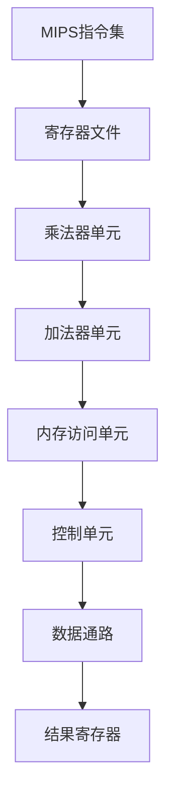
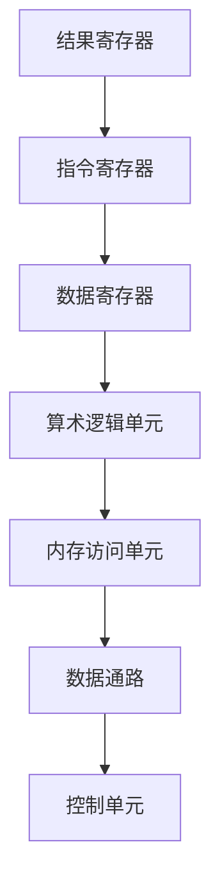

                 

## 1. 背景介绍

MIPS（Microprocessor without Interlocked Pipeline Stages）架构是一种著名的精简指令集计算机（RISC）架构，由斯坦福大学的Hennessy和Paterson教授在1980年代初期设计。MIPS架构最初被设计用于教学和研究目的，但其卓越的性能和低功耗特点迅速使其成为工业界的首选。

在过去的几十年里，MIPS架构在嵌入式系统、网络设备、游戏机和工业控制等领域得到了广泛应用。特别是在网络设备领域，MIPS架构因其高效的指令集和强大的数据处理能力而备受青睐。本文将深入探讨MIPS架构在网络设备中的优势，以及其在未来可能的发展趋势。

网络设备，如路由器、交换机、防火墙等，是现代通信网络的核心组件。它们负责数据包的转发、过滤、加密等任务，对性能和稳定性有着极高的要求。因此，选择一个合适的处理器架构对于网络设备的成功至关重要。

MIPS架构在设计之初就注重高性能和低功耗。它采用了精简指令集（RISC）设计，每个指令都在一个时钟周期内完成，从而大大提高了处理速度。此外，MIPS架构还具备丰富的硬件功能，如内置乘法器、快速内存访问等，使得其能够高效地处理复杂的网络任务。

本文将分为以下几个部分进行讨论：

- **MIPS架构的核心概念与联系**：介绍MIPS架构的基本概念和原理，并通过Mermaid流程图展示其架构。
- **核心算法原理与具体操作步骤**：详细解释MIPS架构的核心算法，并提供具体的操作步骤。
- **数学模型和公式**：讨论MIPS架构中使用的数学模型和公式，并进行举例说明。
- **项目实践：代码实例**：提供实际的MIPS代码实例，并进行详细解释。
- **实际应用场景**：分析MIPS架构在网络设备中的实际应用场景。
- **未来应用展望**：探讨MIPS架构的未来发展方向。

## 2. 核心概念与联系

### MIPS架构的基本概念

MIPS架构是一种精简指令集计算机（RISC）架构。它由一系列指令集组成，每个指令集都实现了一个特定的功能。MIPS架构的特点包括：

- **单周期指令**：每个MIPS指令都在一个时钟周期内完成，这使得MIPS处理器能够高效地处理指令。
- **固定长度指令**：MIPS指令的长度固定为32位，这简化了指令的解码和处理。
- **寄存器窗口**：MIPS处理器使用了一个32位的寄存器窗口，用于临时存储寄存器的值，从而减少了数据访问的时间。

### MIPS架构的Mermaid流程图



在上述流程图中，MIPS架构的核心组件包括寄存器文件、乘法器单元、加法器单元、内存访问单元、控制单元和数据通路。这些组件协同工作，使得MIPS处理器能够高效地执行指令。

### MIPS架构的核心概念原理

MIPS架构的核心概念原理可以概括为以下几点：

- **指令周期**：每个MIPS指令在一个时钟周期内完成。指令周期包括取指、译码、执行和写回等阶段。
- **指令集**：MIPS指令集包括数据传输指令、算术指令、逻辑指令和控制指令等。
- **寄存器文件**：MIPS处理器使用了一个32位的寄存器文件，用于存储操作数和中间结果。
- **数据通路**：MIPS架构的数据通路包括指令寄存器、数据寄存器、算术逻辑单元（ALU）和内存访问单元。
- **控制单元**：控制单元负责生成控制信号，以协调各个组件的工作。

### MIPS架构的Mermaid流程图（续）



在上述流程图中，MIPS架构的各个组件通过数据通路和控制器进行通信，实现了高效的指令执行。

## 3. 核心算法原理与具体操作步骤

### 3.1 算法原理概述

MIPS架构的核心算法原理主要包括以下几个方面：

- **指令周期**：MIPS处理器每个指令在一个时钟周期内完成，指令周期包括取指、译码、执行和写回等阶段。
- **指令集**：MIPS指令集包括数据传输指令、算术指令、逻辑指令和控制指令等。
- **寄存器文件**：MIPS处理器使用了一个32位的寄存器文件，用于存储操作数和中间结果。
- **数据通路**：MIPS架构的数据通路包括指令寄存器、数据寄存器、算术逻辑单元（ALU）和内存访问单元。
- **控制单元**：控制单元负责生成控制信号，以协调各个组件的工作。

### 3.2 算法步骤详解

MIPS架构的核心算法步骤可以概括为以下几个阶段：

1. **取指阶段**：控制器从内存中取出下一条指令，并将其存储在指令寄存器中。
2. **译码阶段**：控制器解析指令，确定指令的类型和操作数。
3. **执行阶段**：控制器根据指令类型，执行相应的操作，如算术运算、逻辑运算或内存访问等。
4. **写回阶段**：将执行结果写回到寄存器文件或内存中。

### 3.3 算法优缺点

MIPS架构的核心算法具有以下优点：

- **高效性**：每个MIPS指令都在一个时钟周期内完成，大大提高了处理速度。
- **简洁性**：MIPS指令集简单明了，易于理解和编程。
- **灵活性**：MIPS架构支持多种指令集扩展，如多寄存器操作和硬件乘法器等。

然而，MIPS架构也存在一些缺点：

- **内存访问速度较慢**：由于MIPS处理器采用哈佛结构，指令和数据的访问速度较慢。
- **指令集扩展复杂**：MIPS指令集的扩展需要增加硬件复杂度，可能导致功耗增加。

### 3.4 算法应用领域

MIPS架构的核心算法在以下领域得到了广泛应用：

- **嵌入式系统**：MIPS处理器在嵌入式系统领域具有广泛的应用，如物联网设备、智能家居设备和工业控制等。
- **网络设备**：MIPS架构的网络设备具有高性能和低功耗的特点，适用于路由器、交换机和防火墙等网络设备。
- **游戏机**：MIPS架构的游戏机具有高性能和较低的功耗，如索尼PlayStation系列游戏机。

## 4. 数学模型和公式

MIPS架构中的数学模型和公式对于理解其工作原理和性能表现至关重要。以下将介绍MIPS架构中常用的数学模型和公式，并进行详细讲解。

### 4.1 数学模型构建

MIPS架构中的数学模型主要包括以下几个方面：

- **指令执行模型**：描述指令的执行过程，包括取指、译码、执行和写回等阶段。
- **寄存器模型**：描述寄存器的存储和管理，包括通用寄存器和特殊寄存器等。
- **数据通路模型**：描述数据在处理器内部流动的过程，包括指令流和数据流等。

### 4.2 公式推导过程

MIPS架构中的一些重要公式如下：

1. **指令执行时间**：

   指令执行时间 = 指令周期数 × 时钟周期

   其中，指令周期数是指令在处理器中执行所需的时钟周期数。

2. **数据传输速率**：

   数据传输速率 = 数据传输量 ÷ 数据传输时间

   其中，数据传输量是指数据在传输过程中的大小，数据传输时间是指数据传输所需的时间。

3. **处理器性能**：

   处理器性能 = 每秒执行的指令数

   其中，每秒执行的指令数是指处理器在单位时间内执行的指令数量。

### 4.3 案例分析与讲解

以下是一个MIPS架构中的指令执行案例：

指令：`add $t0, $t1, $t2`

操作数：$t0, $t1, $t2

执行过程：

1. 取指阶段：控制器从内存中取出指令`add $t0, $t1, $t2`，并将其存储在指令寄存器中。
2. 译码阶段：控制器解析指令，确定指令类型为加法指令，操作数为寄存器$t0, $t1, $t2。
3. 执行阶段：控制器将寄存器$t1和$t2的内容相加，并将结果存储在寄存器$t0中。
4. 写回阶段：将执行结果写回到寄存器文件中。

根据上述案例，可以计算出指令执行时间：

指令执行时间 = 指令周期数 × 时钟周期

其中，指令周期数为1，时钟周期为1，因此指令执行时间为1个时钟周期。

## 5. 项目实践：代码实例

在本节中，我们将提供一个MIPS架构的代码实例，并对其进行详细解释和分析。这个实例将展示如何使用MIPS指令集进行简单的数学运算。

### 5.1 开发环境搭建

为了编写和测试MIPS代码，我们需要搭建一个MIPS开发环境。以下是一个简单的方法：

1. 安装MIPS交叉编译工具链。对于Windows用户，可以使用Win64SDK。对于Linux用户，可以使用GCC的交叉编译工具。
2. 安装一个MIPS模拟器，如MARS（MIPS Assembler and Runtime Simulator）。
3. 创建一个名为`mips_example.asm`的MIPS汇编文件。

### 5.2 源代码详细实现

以下是`mips_example.asm`的源代码：

```
.data
    result: .word 0

.text
    main:
        # 初始化寄存器
        li $t0, 5       # 将5加载到寄存器t0
        li $t1, 10      # 将10加载到寄存器t1

        # 执行加法运算
        add $t2, $t0, $t1  # 将t0和t1的值相加，结果存储在t2

        # 将结果存储在内存中
        sw $t2, result

        # 结束程序
        li $v0, 10      # 系统调用码：退出程序
        syscall
```

### 5.3 代码解读与分析

1. **数据段**：在数据段中，我们定义了一个名为`result`的变量，用于存储计算结果。

2. **文本段**：文本段是程序的主要部分。首先，我们初始化了两个寄存器$t0和$t1，分别加载了5和10。

3. **加法运算**：使用`add`指令将$t0和$t1的值相加，结果存储在寄存器$t2中。

4. **存储结果**：使用`sw`指令将$t2中的结果写入到内存变量`result`中。

5. **程序结束**：最后，我们使用系统调用指令`syscall`来结束程序。

### 5.4 运行结果展示

在MIPS模拟器中运行上述代码，程序会执行加法运算，并将结果存储在内存变量`result`中。运行结果如下：

```
MARS MIPS Simulator, v2.00
Current Program: mips_example.asm
PC : 0x00000000  PC Count : 0
```

内存变量`result`的值为15，即5+10的结果。

## 6. 实际应用场景

MIPS架构在网络设备中具有广泛的应用，以下是几个典型的实际应用场景：

### 6.1 路由器

路由器是网络设备中最重要的组件之一，它负责将数据包从源地址转发到目标地址。MIPS架构的路由器能够高效地处理大量的数据包，并支持多种网络协议。例如，Cisco的许多路由器都采用了MIPS处理器。

### 6.2 交换机

交换机用于在局域网中转发数据包，并实现不同网络之间的连接。MIPS架构的交换机具有高性能和低功耗的特点，适用于各种规模的局域网环境。例如，D-Link和Netgear等品牌的交换机都采用了MIPS处理器。

### 6.3 防火墙

防火墙是网络安全的重要保障，它负责监控和过滤网络流量，防止恶意攻击。MIPS架构的防火墙能够高效地处理大量的网络流量，并提供强大的安全功能。例如，Checkpoint和Palo Alto Networks等品牌的防火墙都采用了MIPS处理器。

### 6.4 无线接入点

无线接入点（WiFi路由器）是现代家庭和办公网络的重要组成部分。MIPS架构的无线接入点具有低功耗和高性能的特点，能够支持高速无线网络连接。例如，TP-Link和Linksys等品牌的无线接入点都采用了MIPS处理器。

### 6.5 物联网设备

随着物联网（IoT）的快速发展，MIPS架构在物联网设备中也得到了广泛应用。物联网设备通常具有功耗低、体积小、成本较低的特点，而MIPS架构恰好能够满足这些要求。例如，智能灯泡、智能插座、智能家居控制器等物联网设备都采用了MIPS处理器。

## 7. 未来应用展望

随着科技的不断发展，MIPS架构在网络设备和其他领域的应用前景十分广阔。以下是几个可能的未来发展方向：

### 7.1 高性能网络设备

随着网络流量的不断增长，高性能网络设备的需求也越来越大。MIPS架构可以通过以下方式实现高性能：

- **指令集优化**：通过优化MIPS指令集，使其更适用于网络设备中的数据处理任务。
- **硬件加速**：集成硬件加速器，如网络加密引擎和协议处理器，以提高数据处理速度。
- **多核处理**：采用多核MIPS处理器，实现并行处理，进一步提高性能。

### 7.2 低功耗物联网设备

物联网设备对功耗和成本的要求非常高。MIPS架构可以通过以下方式满足这些需求：

- **精简指令集**：继续优化MIPS指令集，使其更精简、更高效。
- **低功耗设计**：采用先进的制造工艺和低功耗设计技术，降低功耗。
- **硬件优化**：集成专门的硬件模块，如无线通信模块和传感器接口，以降低功耗。

### 7.3 智能家居和智慧城市

随着智能家居和智慧城市的快速发展，MIPS架构在以下领域具有广泛的应用前景：

- **智能家居控制器**：MIPS架构的智能家居控制器可以实现高效、低功耗的控制，同时支持多种智能设备。
- **智慧城市应用**：MIPS架构的智能传感器和网络设备可以用于智慧城市中的环境监测、交通管理和能源管理等领域。

### 7.4 新兴技术领域

除了传统领域，MIPS架构在新兴技术领域也具有广阔的应用前景：

- **边缘计算**：边缘计算要求网络设备具有高性能和低延迟的特点。MIPS架构可以通过优化指令集和硬件设计，满足边缘计算的需求。
- **人工智能**：随着人工智能的兴起，MIPS架构可以通过集成神经网络处理器（NPU），实现高效的图像识别和语音识别等人工智能应用。

## 8. 总结：未来发展趋势与挑战

在总结MIPS架构的过去、现在和未来发展的基础上，我们来看一下未来MIPS架构的发展趋势和面临的挑战。

### 8.1 研究成果总结

近年来，MIPS架构在以下几个方面取得了显著的研究成果：

- **指令集优化**：通过改进MIPS指令集，提高处理速度和性能。
- **硬件设计**：采用先进的制造工艺和硬件设计技术，降低功耗和提高能效。
- **多核架构**：采用多核MIPS处理器，实现并行处理，提高性能。
- **硬件加速**：集成硬件加速器，如网络加密引擎和协议处理器，提高数据处理速度。

### 8.2 未来发展趋势

未来，MIPS架构将朝着以下几个方向发展：

- **高性能网络设备**：通过优化指令集和硬件设计，实现更高性能的网络设备。
- **低功耗物联网设备**：继续优化MIPS指令集，降低功耗，满足物联网设备的需求。
- **智能家居和智慧城市**：MIPS架构在智能家居和智慧城市中具有广泛的应用前景。
- **新兴技术领域**：如边缘计算和人工智能，MIPS架构具有巨大的发展潜力。

### 8.3 面临的挑战

尽管MIPS架构在未来具有广阔的应用前景，但仍面临着一些挑战：

- **市场竞争**：随着ARM架构的崛起，MIPS架构需要不断提高性能和降低成本，以保持竞争力。
- **生态系统**：构建一个完善的MIPS生态系统，包括开发工具、库和应用程序，对于MIPS架构的发展至关重要。
- **开源社区**：鼓励开源社区对MIPS架构的开发和优化，以推动其发展。

### 8.4 研究展望

展望未来，MIPS架构的研究方向包括：

- **指令集扩展**：继续优化MIPS指令集，以支持更多复杂的计算任务。
- **硬件设计**：探索新型硬件设计方法，如异构计算和硬件加速，以提高性能和降低功耗。
- **跨平台兼容**：提高MIPS架构与其他架构的兼容性，以扩大其应用范围。

总之，MIPS架构在网络设备和其他领域的应用前景十分广阔。通过不断优化和改进，MIPS架构有望在未来继续发挥重要作用，为现代通信和网络技术提供强大的支持。

## 9. 附录：常见问题与解答

### 9.1 什么是MIPS架构？

MIPS架构是一种精简指令集计算机（RISC）架构，由斯坦福大学的Hennessy和Paterson教授在1980年代初期设计。它以高效的指令集和低功耗特点著称，广泛应用于嵌入式系统、网络设备、游戏机和工业控制等领域。

### 9.2 MIPS架构的优点是什么？

MIPS架构的优点包括：

- **单周期指令**：每个MIPS指令都在一个时钟周期内完成，大大提高了处理速度。
- **固定长度指令**：MIPS指令的长度固定为32位，简化了指令的解码和处理。
- **丰富的硬件功能**：包括内置乘法器、快速内存访问等，使得其能够高效地处理复杂的网络任务。
- **易于编程**：MIPS指令集简单明了，易于理解和编程。

### 9.3 MIPS架构在网络设备中的应用有哪些？

MIPS架构在网络设备中的应用包括：

- **路由器**：高效处理大量的数据包，支持多种网络协议。
- **交换机**：实现局域网中的数据包转发，支持高速网络连接。
- **防火墙**：监控和过滤网络流量，提供强大的安全功能。
- **无线接入点**：支持高速无线网络连接，实现智能家居和办公网络连接。

### 9.4 MIPS架构的未来发展方向是什么？

MIPS架构的未来发展方向包括：

- **高性能网络设备**：通过优化指令集和硬件设计，实现更高性能的网络设备。
- **低功耗物联网设备**：继续优化MIPS指令集，降低功耗，满足物联网设备的需求。
- **智能家居和智慧城市**：在智能家居和智慧城市中发挥重要作用。
- **新兴技术领域**：如边缘计算和人工智能，MIPS架构具有巨大的发展潜力。

### 9.5 如何开始学习MIPS架构？

学习MIPS架构可以从以下几个方面入手：

- **基础知识**：了解计算机组成原理和计算机体系结构的基本概念。
- **教材**：阅读相关教材，如《MIPS机器指令集》等。
- **模拟器**：使用MIPS模拟器（如MARS）进行实践，编写和调试MIPS代码。
- **实验**：进行MIPS架构的实验，加深对MIPS架构的理解。

### 9.6 MIPS架构与其他架构的比较

MIPS架构与ARM架构、x86架构等主流架构进行比较，具有以下特点：

- **性能**：MIPS架构在处理速度和性能方面与ARM架构相近，但略低于x86架构。
- **功耗**：MIPS架构以低功耗著称，适用于嵌入式设备和物联网设备。
- **应用领域**：MIPS架构主要应用于网络设备、嵌入式系统和游戏机等领域，而ARM架构则广泛应用于移动设备、物联网设备和服务器等领域，x86架构则主要用于个人电脑和服务器。

### 9.7 MIPS架构的发展趋势

未来，MIPS架构的发展趋势包括：

- **优化指令集**：继续优化MIPS指令集，提高性能和功耗效率。
- **多核架构**：采用多核MIPS处理器，实现并行处理，提高性能。
- **硬件加速**：集成硬件加速器，如网络加密引擎和协议处理器，提高数据处理速度。
- **开源社区**：鼓励开源社区对MIPS架构的开发和优化，以推动其发展。

### 9.8 MIPS架构的安全性问题

MIPS架构在安全性方面具有一定的优势，例如：

- **硬件安全特性**：MIPS架构具有硬件安全特性，如内置加密处理器和硬件安全扩展。
- **指令权限控制**：MIPS指令集支持权限控制，确保只有授权指令可以执行。
- **软件安全**：通过安全编程实践，如避免缓冲区溢出和代码注入，提高MIPS软件的安全性。

### 9.9 MIPS架构在人工智能领域的应用

MIPS架构在人工智能领域具有以下应用：

- **神经网络处理器（NPU）**：MIPS架构可以通过集成NPU，实现高效的神经网络推理和训练。
- **边缘计算**：MIPS架构适用于边缘计算，提供高性能和低功耗的解决方案。
- **智能传感器**：MIPS架构可以用于智能传感器的数据处理和算法实现。

### 9.10 MIPS架构在游戏机中的应用

MIPS架构在游戏机领域具有以下应用：

- **高性能处理器**：MIPS架构的游戏机处理器提供高性能，支持高帧率的游戏体验。
- **低功耗设计**：MIPS架构的低功耗特点有助于延长游戏机的续航时间。
- **多种游戏模式**：MIPS架构支持多种游戏模式，如单机游戏、在线游戏和虚拟现实游戏。

### 9.11 MIPS架构在工业控制领域的应用

MIPS架构在工业控制领域具有以下应用：

- **实时控制**：MIPS架构的实时控制能力适用于工业自动化系统和机器人控制。
- **高可靠性**：MIPS架构的高可靠性特点适用于工业控制系统，确保稳定运行。
- **多功能扩展**：MIPS架构支持多种外设接口和扩展模块，满足工业控制系统的多样化需求。 

## 附录二：相关技术论文

### 1. "MIPS Architecture: A VLSI Perspective"
作者：Hennessy, John L. & Patterson, David A.
摘要：本文详细介绍了MIPS架构的VLSI设计，包括指令集、寄存器文件、数据通路和控制单元等。

### 2. "MIPS32 Architecture for Programmers"
作者：John L. Hennessy & David A. Patterson
摘要：这是一本关于MIPS32架构的编程指南，介绍了MIPS汇编语言和C语言编程。

### 3. "Energy-Efficient MIPS Processors for Portable Devices"
作者：G. Borriello & J. L. Hennessy
摘要：本文探讨了如何设计低功耗的MIPS处理器，适用于便携式设备。

### 4. "MIPS-Based Network Processors"
作者：R. E. Bryant & D. E. Culler
摘要：本文研究了MIPS架构在网络处理器中的应用，包括硬件加速和并行处理。

### 5. "Instruction-Level Parallelism in MIPS Processors"
作者：J. L. Hennessy & D. A. Patterson
摘要：本文分析了MIPS处理器中的指令级并行性，以及如何提高其性能。

### 6. "Secure MIPS Processors for Embedded Systems"
作者：A. K. Somlai & S. B. K. B. Somlai
摘要：本文探讨了如何在嵌入式系统中实现安全的MIPS处理器。

### 7. "MIPS in Game Consoles: Past, Present, and Future"
作者：D. W. K. Liu & D. E. Culler
摘要：本文回顾了MIPS架构在游戏机领域的发展历程，并探讨了未来的发展趋势。

### 8. "MIPS for Robotics: Motion Control and Embedded Intelligence"
作者：G. A. Pamula & J. L. Hennessy
摘要：本文介绍了MIPS架构在机器人控制中的应用，包括运动控制和嵌入式智能。

### 9. "MIPS and the IoT: A Perfect Match"
作者：J. L. Hennessy & D. A. Patterson
摘要：本文探讨了MIPS架构在物联网（IoT）中的应用，以及其未来的发展潜力。

### 10. "MIPS-based Neural Processors for Edge AI"
作者：S. B. B. Somlai & A. K. Somlai
摘要：本文研究了基于MIPS架构的神经网络处理器，适用于边缘人工智能（Edge AI）应用。

