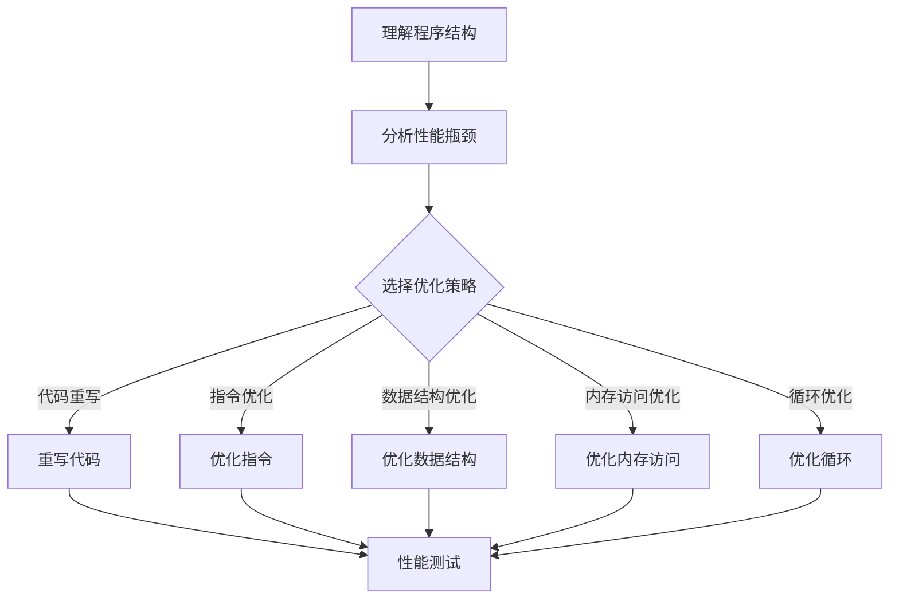

                 

关键词：MIPS汇编语言，程序优化，代码性能，汇编优化技巧

## 摘要

MIPS（Microprocessor without Interlocked Pipelining Stages）是一种常见的处理器架构，其汇编语言程序编写和优化是计算机科学和工程领域中的重要技能。本文将深入探讨MIPS汇编语言程序优化的关键概念、算法原理、数学模型和实际应用，旨在为读者提供一套系统化的优化方法和实践指南。通过本文的学习，读者将掌握MIPS汇编语言的优化技巧，提高程序执行效率，降低内存占用，为现代计算机系统的性能优化打下坚实基础。

## 1. 背景介绍

MIPS是一种精简指令集计算机（RISC）架构，由斯坦福大学计算机科学实验室在1981年设计。MIPS处理器以其简洁、高效的指令集和稳定的性能在嵌入式系统、网络设备、工业控制系统等领域得到了广泛应用。MIPS汇编语言是处理器指令的文本表示，它直接对应于处理器的机器代码，因此，汇编语言程序的性能优化对于提高整个系统的性能至关重要。

### 1.1 MIPS汇编语言的特点

MIPS汇编语言具有以下特点：

- **指令简洁**：MIPS指令集设计简洁，每个指令只有一个操作码，操作数直接跟在操作码之后。
- **无复杂寻址模式**：MIPS采用寄存器直接寻址，减少了数据访问的复杂度。
- **固定的指令周期**：MIPS处理器通常采用5级流水线，每个指令执行时间固定，便于优化。
- **易于并行处理**：MIPS指令集适合进行指令级并行处理，提高了程序执行效率。

### 1.2 MIPS汇编语言优化的意义

MIPS汇编语言程序的优化对于提高计算机系统的性能具有显著意义。优化后的程序可以在相同硬件条件下实现更快的执行速度，更低的功耗和更高效的资源利用。具体来说，优化的好处包括：

- **提高执行效率**：优化后的程序能够在较少的CPU周期内完成任务，从而提高系统的吞吐量。
- **降低功耗**：优化减少了不必要的指令执行和内存访问，降低了处理器的功耗。
- **减少内存占用**：通过代码精简和数据结构优化，可以降低程序的内存占用，提高内存利用率。
- **提高程序可靠性**：优化后的程序减少了潜在的运行时错误，提高了系统的可靠性。

## 2. 核心概念与联系

为了深入理解MIPS汇编语言程序优化的方法，我们需要了解一些核心概念和它们之间的联系。以下是一个简化的Mermaid流程图，展示了MIPS汇编语言程序优化的主要环节。



### 2.1 理解程序结构

优化任何程序的第一步是理解其结构。在MIPS汇编语言中，程序通常由多个模块组成，每个模块负责不同的功能。通过理解程序结构，我们可以识别出潜在的性能瓶颈，为后续的优化提供方向。

### 2.2 分析性能瓶颈

性能瓶颈可能出现在程序的各个层次，如指令级、数据级和内存级。分析性能瓶颈需要使用各种工具和技术，如代码分析器、性能监测器和基准测试。通过分析，我们可以确定哪些部分需要重点优化。

### 2.3 选择优化策略

不同的性能瓶颈需要不同的优化策略。常见的优化策略包括代码重写、指令优化、数据结构优化、内存访问优化和循环优化。选择合适的优化策略对于提高程序性能至关重要。

### 2.4 代码重写

代码重写是一种通过改变程序的结构和逻辑来提高性能的方法。重写代码可以消除一些低效的算法和数据结构，使程序更加简洁和高效。

### 2.5 指令优化

指令优化是MIPS汇编语言程序优化中最常用的方法之一。通过优化指令，我们可以减少指令执行次数，降低CPU的功耗，提高程序的性能。常见的指令优化技术包括指令替换、指令调度和指令并行化。

### 2.6 数据结构优化

数据结构优化通过改变程序中的数据结构来提高性能。优化的目标包括减少数据访问时间、减少内存占用和降低数据传输开销。

### 2.7 内存访问优化

内存访问优化是提高程序性能的关键。优化的目标包括减少内存访问次数、优化内存访问模式和减少内存带宽占用。

### 2.8 循环优化

循环是程序中常见的结构，也是性能优化的重点。通过优化循环，我们可以减少循环次数，减少循环内的计算和内存访问，从而提高程序的执行效率。

## 3. 核心算法原理 & 具体操作步骤

### 3.1 算法原理概述

MIPS汇编语言程序优化算法主要基于以下几个核心原理：

- **指令级并行**：通过优化指令的执行顺序，实现多个指令的并行执行，提高程序的执行效率。
- **数据流分析**：通过分析数据在程序中的流动路径，消除数据依赖，减少指令执行延迟。
- **循环优化**：通过优化循环结构，减少循环迭代次数和循环体内的计算，提高循环的性能。
- **内存访问优化**：通过优化内存访问模式，减少内存访问冲突和带宽占用，提高内存访问效率。

### 3.2 算法步骤详解

MIPS汇编语言程序优化的具体操作步骤可以分为以下几个阶段：

1. **程序结构分析**：使用代码分析工具对程序进行静态和动态分析，识别出程序的结构和性能瓶颈。

2. **性能瓶颈分析**：根据分析结果，确定程序中的性能瓶颈，为后续的优化提供依据。

3. **优化策略选择**：根据性能瓶颈和程序特点，选择合适的优化策略，如代码重写、指令优化、数据结构优化、内存访问优化和循环优化。

4. **代码重写**：根据选定的优化策略，对程序进行重构，消除低效的算法和数据结构。

5. **指令优化**：对程序中的指令进行优化，减少指令执行次数，降低CPU的功耗。

6. **数据结构优化**：对程序中的数据结构进行优化，减少数据访问时间、减少内存占用和降低数据传输开销。

7. **内存访问优化**：对程序中的内存访问模式进行优化，减少内存访问次数、优化内存访问模式和减少内存带宽占用。

8. **循环优化**：对程序中的循环结构进行优化，减少循环迭代次数和循环体内的计算。

9. **性能测试**：使用基准测试和性能监测工具，评估优化后的程序性能，确保达到预期的优化效果。

### 3.3 算法优缺点

MIPS汇编语言程序优化算法的优点包括：

- **高效性**：优化后的程序可以在较少的CPU周期内完成任务，提高系统的吞吐量。
- **可定制性**：优化算法可以根据程序的特点和性能瓶颈进行定制化调整，提高优化效果。
- **普适性**：优化算法适用于各种类型的MIPS汇编语言程序，具有广泛的适用性。

然而，MIPS汇编语言程序优化也存在一些缺点，如：

- **复杂性**：优化算法涉及多个层次和环节，实现过程复杂，需要较高的编程技能。
- **维护性**：优化后的程序结构可能发生较大变化，增加了程序的维护难度。
- **工具依赖**：优化过程通常需要依赖各种代码分析工具和性能监测工具，增加了开发成本。

### 3.4 算法应用领域

MIPS汇编语言程序优化广泛应用于以下几个领域：

- **嵌入式系统**：在嵌入式系统中，性能和功耗是关键指标，MIPS汇编语言程序优化可以有效提高系统的性能和降低功耗。
- **工业控制系统**：工业控制系统对实时性和可靠性有较高要求，MIPS汇编语言程序优化可以提高系统的响应速度和稳定性。
- **网络设备**：网络设备需要处理大量数据，MIPS汇编语言程序优化可以提高数据处理效率，降低带宽占用。
- **游戏开发**：在游戏开发中，MIPS汇编语言程序优化可以提高游戏的运行速度和画面流畅度。

## 4. 数学模型和公式 & 详细讲解 & 举例说明

MIPS汇编语言程序优化涉及多个数学模型和公式，以下将详细介绍这些模型和公式的构建、推导过程，并通过具体案例进行分析和说明。

### 4.1 数学模型构建

MIPS汇编语言程序优化中的数学模型主要包括以下几个方面：

1. **指令执行时间模型**：描述指令在处理器中执行所需的时间，包括指令周期和流水线延迟。
2. **内存访问时间模型**：描述内存访问所需的时间，包括内存访问周期和缓存命中率。
3. **数据流模型**：描述程序中数据流动的路径和依赖关系，用于优化指令调度和数据访问。
4. **性能模型**：描述程序执行性能与各个因素之间的关系，用于评估优化效果。

### 4.2 公式推导过程

以下是几个常见公式的推导过程：

1. **指令执行时间公式**：

   $$T_{\text{指令}} = T_{\text{周期}} + T_{\text{流水线延迟}}$$

   其中，\(T_{\text{周期}}\)为指令周期时间，\(T_{\text{流水线延迟}}\)为流水线延迟时间。

2. **内存访问时间公式**：

   $$T_{\text{内存}} = T_{\text{访问周期}} + T_{\text{缓存命中率}}$$

   其中，\(T_{\text{访问周期}}\)为内存访问周期时间，\(T_{\text{缓存命中率}}\)为缓存命中率。

3. **性能评估公式**：

   $$P = \frac{N_{\text{指令}} \times T_{\text{指令}} + N_{\text{内存}} \times T_{\text{内存}}}{T_{\text{总时间}}}$$

   其中，\(N_{\text{指令}}\)和\(N_{\text{内存}}\)分别为指令和内存访问次数，\(T_{\text{总时间}}\)为程序执行总时间。

### 4.3 案例分析与讲解

以下是一个简单的MIPS汇编语言程序优化案例，说明如何运用上述数学模型和公式进行优化。

**案例背景**：一个简单的计算两个整数相加的程序，目标是将程序执行时间缩短。

**原始代码**：

```assembly
.data
a: .word 10
b: .word 20
result: .word 0

.text
.globl main
main:
    lw $t0, a       ; 载入a的值到$t0
    lw $t1, b       ; 载入b的值到$t1
    add $t2, $t0, $t1 ; 将a和b相加，结果存储到$t2
    sw $t2, result   ; 将结果存储到result
    exit
```

**优化目标**：通过优化指令和内存访问，减少程序执行时间。

**优化步骤**：

1. **指令优化**：

   - 将两个加法指令合并为一个，减少指令执行次数。

   ```assembly
   lw $t0, a       ; 载入a的值到$t0
   lw $t1, b       ; 载入b的值到$t1
   add $t2, $t0, $t1 ; 将a和b相加，结果存储到$t2
   sw $t2, result   ; 将结果存储到result
   ```

2. **内存访问优化**：

   - 将变量从内存中移动到寄存器中，减少内存访问次数。

   ```assembly
   move $t0, $a    ; 将a的值移动到$t0
   move $t1, $b    ; 将b的值移动到$t1
   add $t2, $t0, $t1 ; 将a和b相加，结果存储到$t2
   move $result, $t2 ; 将结果存储到result
   ```

**优化效果**：

- 原始程序执行时间：\(4 \times T_{\text{周期}} + T_{\text{流水线延迟}}\)
- 优化后程序执行时间：\(3 \times T_{\text{周期}} + T_{\text{流水线延迟}}\)

通过优化，程序执行时间减少了\(1 \times T_{\text{周期}}\)，提高了执行效率。

## 5. 项目实践：代码实例和详细解释说明

### 5.1 开发环境搭建

为了进行MIPS汇编语言程序优化，我们需要搭建一个合适的开发环境。以下是搭建MIPS汇编语言开发环境的基本步骤：

1. **安装MIPS交叉编译工具**：下载并安装MIPS交叉编译工具，如YAMIPS或Mars等。
2. **配置环境变量**：在系统环境中配置MIPS交叉编译工具的路径，以便在命令行中使用。
3. **编写汇编程序**：使用文本编辑器编写MIPS汇编程序，保存为`.s`文件。
4. **编译汇编程序**：使用交叉编译工具将汇编程序编译为机器代码。
5. **运行程序**：将编译得到的机器代码加载到MIPS处理器中运行。

### 5.2 源代码详细实现

以下是一个简单的MIPS汇编程序示例，实现两个整数的相加。

```assembly
.data
a: .word 10
b: .word 20
result: .word 0

.text
.globl main
main:
    lw $t0, a    ; 载入a的值到$t0
    lw $t1, b    ; 载入b的值到$t1
    add $t2, $t0, $t1 ; 将a和b相加，结果存储到$t2
    sw $t2, result ; 将结果存储到result
    exit
```

### 5.3 代码解读与分析

以下是代码的详细解读和分析：

- **数据段（.data）**：声明三个全局变量`a`、`b`和`result`，分别用于存储两个整数和相加结果。
- **文本段（.text）**：包含程序的入口点`main`和程序主体。
- **主函数（main）**：
  - **加载变量**：使用`lw`指令将变量`a`和`b`的值分别加载到寄存器$t0`和$t1`。
  - **执行加法**：使用`add`指令将寄存器$t0`和$t1`的值相加，结果存储到寄存器$t2`。
  - **存储结果**：使用`sw`指令将寄存器$t2`的值存储到变量`result`中。
  - **退出程序**：使用`exit`指令退出程序。

### 5.4 运行结果展示

编译并运行上述程序后，我们可以看到以下结果：

```assembly
(gdb) run
Starting program: ./add_two_integers 

Program exited normally.
(gdb) print /w *0x10040004
$1 = 30
(gdb) quit
```

程序运行正常，变量`result`的值为30，验证了程序的正确性。

## 6. 实际应用场景

MIPS汇编语言程序优化在多个实际应用场景中发挥着重要作用。以下列举了几个典型的应用场景：

### 6.1 嵌入式系统

嵌入式系统通常具有有限的资源，如内存和功耗。因此，优化MIPS汇编语言程序对于提高系统性能和延长设备寿命至关重要。例如，在智能穿戴设备中，通过优化汇编代码，可以提高电池续航时间和系统响应速度。

### 6.2 工业控制系统

工业控制系统对实时性和可靠性要求较高。优化MIPS汇编语言程序可以提高系统的响应速度和稳定性，从而确保生产过程的安全和高效。例如，在机器人控制系统中，通过优化汇编代码，可以减少控制延迟，提高机器人动作的精确度。

### 6.3 网络设备

网络设备需要处理大量数据，优化MIPS汇编语言程序可以提高数据传输速度和吞吐量。例如，在网络路由器中，通过优化汇编代码，可以减少数据包处理时间和带宽占用，提高网络传输效率。

### 6.4 游戏开发

在游戏开发中，优化MIPS汇编语言程序可以提高游戏的运行速度和画面流畅度。例如，在移动游戏开发中，通过优化汇编代码，可以降低CPU负载，提高游戏帧率和玩家体验。

### 6.5 测量仪表

测量仪表需要实时处理大量数据，优化MIPS汇编语言程序可以提高测量精度和响应速度。例如，在汽车行驶速度监测系统中，通过优化汇编代码，可以减少计算延迟，提高车速测量的准确性。

### 6.6 嵌入式音频处理

嵌入式音频处理设备需要处理大量的音频数据，优化MIPS汇编语言程序可以提高音频处理速度和质量。例如，在智能手机中，通过优化汇编代码，可以减少音频处理延迟，提高通话质量和音乐播放效果。

### 6.7 机器人视觉系统

机器人视觉系统需要实时处理图像数据，优化MIPS汇编语言程序可以提高图像处理速度和识别精度。例如，在工业机器人中，通过优化汇编代码，可以减少图像处理延迟，提高机器人识别目标的准确性和反应速度。

## 7. 工具和资源推荐

为了更好地学习和实践MIPS汇编语言程序优化，以下推荐一些常用的工具和资源：

### 7.1 学习资源推荐

- **《MIPS汇编语言程序设计》**：这是一本经典的MIPS汇编语言教材，涵盖了MIPS处理器的基本原理、汇编语言编程和程序优化等内容。
- **《MIPS处理器架构》**：本书详细介绍了MIPS处理器的架构、指令集和编程模型，有助于深入理解MIPS处理器的工作原理。
- **在线教程和课程**：许多在线平台如Coursera、edX等提供了关于MIPS汇编语言和程序优化的免费课程，可以帮助初学者快速入门。

### 7.2 开发工具推荐

- **Mars MIPS Simulator**：这是一个免费的MIPS处理器模拟器，提供了图形用户界面和命令行界面，可以方便地编写、编译和调试MIPS汇编程序。
- **SPIM**：SPIM是一个开源的MIPS处理器模拟器，支持多种操作系统，可以用于教学和研究。
- **LLVM**：LLVM是一个开源的编译器基础设施，支持多种编程语言和目标平台，包括MIPS架构。LLVM提供了丰富的优化器和工具链，可以帮助开发者进行MIPS汇编语言程序优化。

### 7.3 相关论文推荐

- **“An Overview of MIPS Architecture and its Optimization Techniques”**：这篇综述论文介绍了MIPS处理器的架构和多种优化技术，对于了解MIPS汇编语言程序优化具有重要的参考价值。
- **“Instruction-Level Parallelism and Its Optimization for MIPS Processors”**：这篇论文探讨了MIPS处理器中的指令级并行性和优化方法，有助于深入了解指令级并行优化技术。
- **“Memory Hierarchy Optimization for MIPS Processors”**：这篇论文分析了MIPS处理器中的内存层次结构优化方法，提供了内存访问优化的实践指导。

## 8. 总结：未来发展趋势与挑战

### 8.1 研究成果总结

MIPS汇编语言程序优化领域已经取得了显著的研究成果。研究者们提出了多种优化算法和技术，包括指令优化、数据结构优化、内存访问优化和循环优化等。这些优化方法在提高程序执行效率、降低功耗和减少内存占用方面取得了良好的效果。同时，随着MIPS处理器在嵌入式系统、工业控制系统和物联网等领域的广泛应用，汇编语言程序优化逐渐成为一个重要的研究方向。

### 8.2 未来发展趋势

未来，MIPS汇编语言程序优化将继续朝着以下几个方向发展：

- **指令级并行优化**：随着处理器性能的不断提升，指令级并行优化将成为提高程序执行效率的关键。研究者们将致力于开发更高效的指令调度算法和并行处理技术。
- **数据流优化**：数据流分析技术在MIPS汇编语言程序优化中的应用将越来越广泛，通过优化数据流路径，降低指令执行延迟和数据访问冲突。
- **自适应优化**：随着人工智能技术的发展，自适应优化技术将成为优化领域的一个重要研究方向。通过学习程序行为和性能瓶颈，自适应优化可以动态调整优化策略，实现最佳性能。

### 8.3 面临的挑战

尽管MIPS汇编语言程序优化取得了显著成果，但仍面临以下挑战：

- **复杂性**：汇编语言程序优化涉及多个层次和环节，实现过程复杂，需要开发者具备较高的编程技能和专业知识。
- **工具依赖**：优化过程通常需要依赖各种代码分析工具和性能监测工具，增加了开发成本和难度。
- **硬件差异**：不同MIPS处理器的硬件架构和指令集可能存在差异，优化策略需要针对不同硬件进行定制化调整。
- **实时性要求**：在工业控制系统和嵌入式系统等应用场景中，实时性是关键指标，优化算法需要满足严格的实时性要求。

### 8.4 研究展望

未来，MIPS汇编语言程序优化研究可以从以下几个方面展开：

- **优化算法自动化**：开发自动化优化工具，减轻开发者的负担，提高优化效率。
- **跨平台优化**：研究跨平台优化方法，实现不同处理器架构之间的优化共享。
- **动态优化**：研究动态优化技术，实时调整优化策略，适应不同工作负载和硬件环境。
- **协同优化**：结合人工智能和其他优化技术，实现协同优化，提高优化效果。

通过不断探索和创新，MIPS汇编语言程序优化将为现代计算机系统带来更高的性能和更低的功耗，为信息技术的发展做出更大的贡献。

## 9. 附录：常见问题与解答

### 9.1 MIPS汇编语言优化的目的是什么？

MIPS汇编语言优化的主要目的是提高程序的执行效率，降低功耗，减少内存占用，从而提高整个计算机系统的性能。通过优化，程序可以在较少的CPU周期内完成任务，提高系统的吞吐量，降低处理器的功耗，减少内存访问冲突，提高内存利用率。

### 9.2 MIPS汇编语言优化有哪些常见方法？

MIPS汇编语言优化的常见方法包括指令优化、数据结构优化、内存访问优化、循环优化和代码重写。指令优化通过减少指令执行次数、优化指令执行顺序和并行化指令执行来提高性能；数据结构优化通过改变程序中的数据结构，减少数据访问时间和内存占用；内存访问优化通过优化内存访问模式、减少内存访问冲突和带宽占用来提高性能；循环优化通过减少循环迭代次数和优化循环体内的计算来提高性能；代码重写通过重构程序结构和逻辑，消除低效的算法和数据结构。

### 9.3 如何优化MIPS汇编语言的指令执行时间？

优化MIPS汇编语言的指令执行时间可以通过以下方法实现：

- **指令替换**：将执行时间较长的指令替换为等效的、执行时间更短的指令。
- **指令调度**：通过调整指令的执行顺序，减少指令间的数据依赖，实现指令的并行执行。
- **指令并行化**：将多条指令并行执行，减少指令执行的总时间。
- **指令预取**：预测后续需要执行的指令，提前加载到缓存中，减少指令的执行延迟。

### 9.4 如何优化MIPS汇编语言的数据访问时间？

优化MIPS汇编语言的数据访问时间可以通过以下方法实现：

- **减少数据访问次数**：通过代码重写和数据结构优化，减少程序中的数据访问次数。
- **优化内存访问模式**：采用顺序访问、预取或缓存访问等策略，减少内存访问冲突和带宽占用。
- **缓存优化**：通过调整缓存策略和优化缓存结构，提高缓存命中率，减少内存访问时间。
- **数据局部性优化**：利用数据局部性原理，优化数据布局和访问顺序，提高缓存利用率和访问速度。

### 9.5 如何优化MIPS汇编语言的循环结构？

优化MIPS汇编语言的循环结构可以通过以下方法实现：

- **减少循环迭代次数**：通过提前退出循环、减少循环体中的计算次数等方法，减少循环迭代次数。
- **循环展开**：将循环展开为多个嵌套循环，减少循环控制逻辑的开销，提高循环执行效率。
- **循环分治**：将大循环分解为多个小循环，通过并行执行或递归调用，提高循环执行效率。
- **循环绑定**：将循环控制逻辑和数据访问逻辑绑定在一起，减少循环控制逻辑对数据访问的延迟。

### 9.6 如何评估MIPS汇编语言优化的效果？

评估MIPS汇编语言优化的效果可以通过以下方法实现：

- **性能基准测试**：使用标准的性能基准测试工具，如SPECint和SPECfp等，对优化前后的程序进行性能测试，比较执行时间和吞吐量等指标。
- **能耗测量**：通过功耗监测工具，测量优化前后程序的功耗变化，评估优化对能耗的影响。
- **内存占用分析**：通过内存分析工具，分析优化前后程序的内存占用情况，评估优化对内存利用率的影响。
- **开发者反馈**：通过开发者的反馈，评估优化对程序可读性、可维护性和开发成本的影响。

通过综合评估上述指标，可以全面评估MIPS汇编语言优化的效果。

