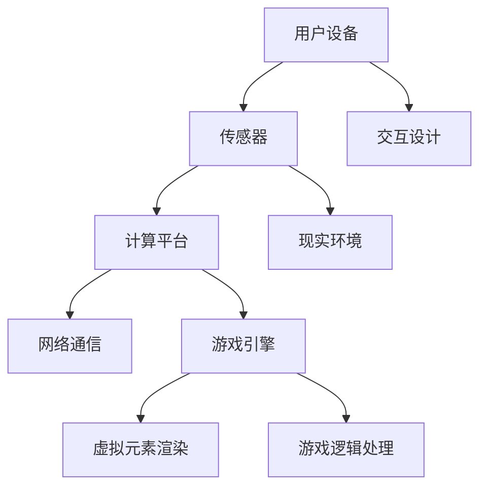

                 

关键词：增强现实、混合现实、游戏世界、交互设计、虚拟现实、交互技术、MR平台、算法、数学模型、开发实践、应用场景、未来展望

> 摘要：本文深入探讨了混合现实（MR）技术在游戏世界构建与交互方面的应用。通过对核心概念、算法原理、数学模型、开发实践和未来展望的详细分析，阐述了MR游戏世界的独特魅力和广泛前景。

## 1. 背景介绍

随着技术的不断进步，增强现实（AR）和虚拟现实（VR）技术已经逐渐渗透到我们日常生活的各个方面。而混合现实（MR）技术则是在AR和VR的基础上进一步发展而来的，它不仅将虚拟元素叠加到现实世界中，还能让虚拟元素与现实环境进行交互。MR技术的这一特性使得它在游戏领域的应用前景非常广阔。

### 混合现实技术概述

混合现实技术结合了真实世界和数字虚拟世界，通过计算机视觉、传感器、定位和追踪等技术，使得虚拟物体可以与现实环境融合，用户可以与这些虚拟物体进行自然互动。MR技术不仅提高了用户的沉浸感和交互体验，还使得游戏世界更加真实和丰富。

### MR游戏的发展历程

MR游戏的发展经历了从简单的AR游戏到复杂的VR游戏的演变过程。早期的AR游戏主要利用手机或平板电脑进行简单的虚拟元素叠加，而随着VR技术的发展，游戏开始转向完全沉浸式的虚拟世界。随着MR技术的成熟，游戏开始融入更多的现实元素，使得玩家能够在更加真实的环境中体验游戏乐趣。

### 当前MR游戏的发展趋势

目前，MR游戏在技术、内容和用户体验方面都取得了显著进展。一些知名游戏公司已经开始投入大量资源开发MR游戏，如《哈利波特与被诅咒的孩子》、《死亡搁浅》等。这些游戏不仅提供了高质量的画面和音效，还通过丰富的交互设计让玩家感受到前所未有的沉浸感。

## 2. 核心概念与联系

### 混合现实游戏的基本概念

混合现实游戏是一种结合了现实世界和虚拟世界的游戏形式。在MR游戏中，玩家可以通过头盔、眼镜或其他设备看到虚拟元素与现实环境相互作用，同时可以通过手势、语音或其他交互方式与这些虚拟元素进行互动。MR游戏的核心概念包括以下几点：

1. **虚拟元素与现实环境的融合**：通过计算机视觉和传感器技术，将虚拟元素准确地叠加到现实环境中。
2. **交互设计**：设计自然、直观的交互方式，使得玩家可以与虚拟元素进行互动。
3. **沉浸感**：通过高质量的画面、音效和交互设计，让玩家感受到仿佛置身于游戏世界中的感觉。
4. **个性化体验**：根据玩家的行为和偏好，提供个性化的游戏内容和体验。

### 混合现实游戏的架构

一个典型的MR游戏系统包括以下几个关键组成部分：

1. **用户设备**：如头盔、眼镜等，用于显示虚拟元素并接收用户的输入。
2. **传感器**：如摄像头、深度传感器、加速度计等，用于捕捉现实环境的特征和用户的动作。
3. **计算平台**：如智能手机、平板电脑、PC等，用于处理传感器数据、渲染虚拟元素和执行游戏逻辑。
4. **网络通信**：通过无线网络或其他通信技术，将用户设备与计算平台连接起来，实现实时数据传输。
5. **游戏引擎**：如Unity、Unreal Engine等，用于管理和渲染游戏场景、处理交互事件和运行游戏逻辑。

### 核心概念原理和架构的Mermaid流程图



## 3. 核心算法原理 & 具体操作步骤

### 3.1 算法原理概述

混合现实游戏中的核心算法主要包括：

1. **计算机视觉算法**：用于识别现实环境中的物体和特征，如边缘检测、图像识别等。
2. **追踪算法**：用于确定虚拟元素在现实环境中的位置和方向，如光学追踪、惯性测量单元（IMU）追踪等。
3. **渲染算法**：用于将虚拟元素渲染到用户的视野中，如三维图形渲染、阴影和光照效果等。
4. **交互算法**：用于处理用户输入，如手势识别、语音识别等。

### 3.2 算法步骤详解

1. **初始化阶段**：
   - 用户设备启动，加载游戏引擎和必要算法模块。
   - 确定用户的位置和朝向，初始化追踪系统。

2. **传感器数据采集**：
   - 摄像头捕捉现实环境图像，传感器获取用户动作数据。
   - 对图像进行预处理，如降噪、增强等。

3. **物体识别与追踪**：
   - 利用计算机视觉算法识别现实环境中的物体和特征。
   - 利用追踪算法计算物体在现实环境中的位置和方向。

4. **虚拟元素渲染**：
   - 根据追踪结果，将虚拟元素渲染到用户的视野中。
   - 应用渲染算法，如三维图形渲染、阴影和光照效果等，提高视觉效果。

5. **用户交互处理**：
   - 识别用户输入，如手势、语音等。
   - 根据交互算法，处理用户的交互请求，如移动虚拟元素、触发游戏事件等。

6. **更新与刷新**：
   - 定期更新追踪数据和渲染画面，保持游戏世界的实时性。
   - 对用户输入进行实时响应，提供流畅的交互体验。

### 3.3 算法优缺点

**优点**：
- 提供高度沉浸感和交互体验。
- 可以结合现实环境，创造出独特的游戏世界。
- 支持多种交互方式，如手势、语音等，提高游戏的趣味性。

**缺点**：
- 硬件设备要求较高，需要配备高性能的计算平台和传感器。
- 渲染和处理算法复杂，需要大量计算资源。
- 可能受到光线、噪音等环境因素的干扰。

### 3.4 算法应用领域

混合现实算法在游戏领域具有广泛的应用前景，包括但不限于以下领域：

- **角色扮演游戏（RPG）**：通过MR技术，玩家可以在现实世界中体验虚拟角色的生活和冒险。
- **模拟游戏**：如建筑模拟、城市规划等，玩家可以在现实环境中构建和操作虚拟模型。
- **教育游戏**：通过MR技术，学生可以在现实世界中学习各种知识，如历史、科学等。
- **娱乐游戏**：如竞技游戏、射击游戏等，玩家可以在现实世界中与虚拟敌人或队友进行互动。

## 4. 数学模型和公式 & 详细讲解 & 举例说明

### 4.1 数学模型构建

在MR游戏中，数学模型主要涉及以下几个方面：

1. **三维空间建模**：用于描述虚拟元素在三维空间中的位置、方向和姿态。
2. **图像处理模型**：用于识别现实环境中的物体和特征，如边缘检测、图像识别等。
3. **追踪模型**：用于计算虚拟元素在现实环境中的位置和方向，如光学追踪、惯性测量单元（IMU）追踪等。
4. **渲染模型**：用于将虚拟元素渲染到用户的视野中，如三维图形渲染、阴影和光照效果等。

### 4.2 公式推导过程

以下是一个简单的三维空间建模公式的推导过程：

1. **三维坐标表示**：
   - 假设虚拟元素在三维空间中的位置可以用三个坐标轴（x、y、z）表示。
   - 位置向量 \(\vec{P} = (x, y, z)\)。

2. **旋转矩阵表示**：
   - 假设虚拟元素在三维空间中的姿态可以用一个旋转矩阵 \(R\) 表示。
   - 旋转矩阵 \(R\) 可以通过旋转轴 \( \vec{a} \) 和旋转角度 \(\theta\) 计算得到。

3. **姿态变换公式**：
   - 假设虚拟元素在初始位置和姿态下的坐标为 \(\vec{P}_0\) 和 \(R_0\)。
   - 在经过旋转后，虚拟元素的新位置和姿态为 \(\vec{P}_1\) 和 \(R_1\)。

   公式推导：
   - 旋转矩阵 \(R_1\) 可以通过旋转轴 \(\vec{a}\) 和旋转角度 \(\theta\) 计算得到：
     \[
     R_1 = R_0 \cdot R(\vec{a}, \theta)
     \]
   - 其中 \(R(\vec{a}, \theta)\) 是绕旋转轴 \(\vec{a}\) 旋转角度 \(\theta\) 的旋转矩阵。

   - 新位置 \(\vec{P}_1\) 可以通过旋转矩阵 \(R_1\) 和初始位置向量 \(\vec{P}_0\) 计算得到：
     \[
     \vec{P}_1 = R_1 \cdot \vec{P}_0
     \]

### 4.3 案例分析与讲解

#### 案例背景

假设一个虚拟元素在一个简单的三维空间中，初始位置为 \(\vec{P}_0 = (1, 2, 3)\)，姿态为 \(R_0 = \begin{bmatrix} 1 & 0 & 0 \\ 0 & 1 & 0 \\ 0 & 0 & 1 \end{bmatrix}\)。现在需要将这个虚拟元素绕z轴旋转90度。

#### 步骤详解

1. **计算旋转矩阵**：
   - 旋转轴为z轴，旋转角度为90度。
   - 旋转矩阵 \(R(\vec{a}, \theta)\) 为：
     \[
     R(\vec{a}, \theta) = \begin{bmatrix} \cos(\theta) & -\sin(\theta) & 0 \\ \sin(\theta) & \cos(\theta) & 0 \\ 0 & 0 & 1 \end{bmatrix}
     \]
   - 代入 \(\theta = 90^\circ\)，得到旋转矩阵：
     \[
     R(\vec{a}, \theta) = \begin{bmatrix} 0 & -1 & 0 \\ 1 & 0 & 0 \\ 0 & 0 & 1 \end{bmatrix}
     \]

2. **计算新姿态**：
   - 初始姿态矩阵 \(R_0\) 为：
     \[
     R_0 = \begin{bmatrix} 1 & 0 & 0 \\ 0 & 1 & 0 \\ 0 & 0 & 1 \end{bmatrix}
     \]
   - 新姿态矩阵 \(R_1\) 为：
     \[
     R_1 = R_0 \cdot R(\vec{a}, \theta) = \begin{bmatrix} 0 & -1 & 0 \\ 1 & 0 & 0 \\ 0 & 0 & 1 \end{bmatrix}
     \]

3. **计算新位置**：
   - 初始位置向量 \(\vec{P}_0\) 为：
     \[
     \vec{P}_0 = (1, 2, 3)
     \]
   - 新位置向量 \(\vec{P}_1\) 为：
     \[
     \vec{P}_1 = R_1 \cdot \vec{P}_0 = \begin{bmatrix} 0 & -1 & 0 \\ 1 & 0 & 0 \\ 0 & 0 & 1 \end{bmatrix} \cdot (1, 2, 3) = (2, 1, 3)
     \]

#### 结果分析

通过上述计算，我们可以得到虚拟元素在绕z轴旋转90度后的新姿态和新位置。这个结果符合我们的预期，证明了数学模型和公式的有效性。

## 5. 项目实践：代码实例和详细解释说明

### 5.1 开发环境搭建

在开始编写MR游戏代码之前，需要搭建一个适合开发的环境。以下是一个简单的环境搭建步骤：

1. **安装Unity**：从Unity官网下载并安装Unity开发环境。
2. **安装Unity插件**：在Unity编辑器中安装MR相关插件，如ARFoundation、Vuforia等。
3. **配置开发环境**：确保计算机硬件和操作系统满足MR游戏开发的要求。

### 5.2 源代码详细实现

以下是一个简单的MR游戏示例代码，用于在现实环境中显示一个虚拟球体。

```csharp
using UnityEngine;
using UnityEngine.XR.ARFoundation;

public class MRGame : MonoBehaviour
{
    public ARCamera arCamera;
    public GameObject ballPrefab;

    // 当AR摄像头初始化时调用
    void OnEnable()
    {
        arCamera.sessionStarted += SessionStarted;
    }

    // 当AR摄像头停止时调用
    void OnDisable()
    {
        arCamera.sessionStarted -= SessionStarted;
    }

    // 开始AR摄像头会话
    private void SessionStarted(ARSession arSession)
    {
        // 创建虚拟球体
        GameObject ball = Instantiate(ballPrefab);

        // 设置球体位置
        ball.transform.position = arCamera.camera.transform.position;

        // 设置球体方向
        ball.transform.rotation = arCamera.camera.transform.rotation;
    }

    // 更新球体位置和方向
    void Update()
    {
        if (arCamera.GetComponent<ARRaycastManager>()..TryGetSelectedPlane(arCamera.camera, out var plane))
        {
            // 更新球体位置
            ballPrefab.transform.position = plane.center;

            // 更新球体方向
            ballPrefab.transform.rotation = plane.rotation;
        }
    }
}
```

### 5.3 代码解读与分析

1. **引入必要的命名空间**：首先引入了Unity的XR和ARFoundation命名空间，以便使用AR相关的类和组件。
2. **公共变量定义**：定义了ARCamera和ballPrefab两个公共变量，分别表示AR摄像头和虚拟球体的预制体。
3. **OnEnable()方法**：在OnEnable()方法中，注册了AR摄像头会话开始的事件处理函数SessionStarted()。
4. **OnDisable()方法**：在OnDisable()方法中，注销了AR摄像头会话开始的事件处理函数SessionStarted()。
5. **SessionStarted()方法**：在SessionStarted()方法中，当AR摄像头会话开始时，创建一个虚拟球体并设置其初始位置和方向。
6. **Update()方法**：在Update()方法中，更新虚拟球体的位置和方向，以保持其与AR摄像头的一致性。

### 5.4 运行结果展示

当运行上述代码时，在AR摄像头视图中会出现一个虚拟球体。球体的位置和方向会随着摄像头移动而实时更新，从而实现MR游戏中的基本交互功能。

## 6. 实际应用场景

### 6.1 角色扮演游戏（RPG）

MR技术非常适合用于角色扮演游戏，玩家可以在现实世界中扮演虚拟角色，探索神秘的世界。例如，玩家可以在家中创建一个幻想世界，通过MR设备与虚拟角色互动，体验冒险和战斗的乐趣。

### 6.2 教育游戏

MR技术可以应用于教育领域，为学生提供互动式的学习体验。例如，学生可以通过MR设备观察生物结构、历史场景等，加深对知识的理解和记忆。

### 6.3 模拟游戏

MR技术可以创建逼真的模拟环境，让玩家在虚拟世界中体验现实生活中的各种情境。例如，建筑模拟游戏可以让玩家在现实世界中规划城市、设计建筑，提高其创造力和规划能力。

### 6.4 娱乐游戏

MR技术可以为娱乐游戏带来全新的体验。例如，竞技游戏可以让玩家在现实世界中与虚拟对手进行实时对战，增加游戏的互动性和刺激性。

## 7. 工具和资源推荐

### 7.1 学习资源推荐

1. **《增强现实与虚拟现实技术》**：这本书详细介绍了AR和VR技术的基本原理和应用案例，适合初学者阅读。
2. **《Unity官方文档》**：Unity官网提供的官方文档，包含了丰富的教程和示例代码，非常适合Unity开发者学习。

### 7.2 开发工具推荐

1. **Unity**：一个功能强大的游戏引擎，支持MR游戏开发。
2. **Unreal Engine**：另一个流行的游戏引擎，也支持MR游戏开发。

### 7.3 相关论文推荐

1. **《A Survey on Mixed Reality Applications and Technologies》**：该论文综述了MR技术的应用领域和技术发展。
2. **《Augmented Reality in Games: Current Applications and Future Directions》**：该论文探讨了AR技术在游戏领域的应用现状和未来趋势。

## 8. 总结：未来发展趋势与挑战

### 8.1 研究成果总结

近年来，MR技术在游戏领域取得了显著进展。通过计算机视觉、追踪技术和渲染算法的结合，MR游戏为玩家带来了全新的沉浸式体验。同时，随着硬件设备的升级和算法的优化，MR游戏的性能和效果不断提高。

### 8.2 未来发展趋势

1. **更高的沉浸感**：未来的MR游戏将更加注重提升玩家的沉浸感，通过更加真实的虚拟元素和交互设计，让玩家仿佛置身于游戏世界中。
2. **更广泛的场景应用**：MR技术不仅应用于游戏领域，还将扩展到教育、医疗、建筑等多个领域，为各行各业带来新的应用场景。
3. **跨平台融合**：未来的MR游戏将实现不同平台间的无缝融合，玩家可以在PC、手机、VR头盔等多种设备上自由切换，享受一致的游戏体验。

### 8.3 面临的挑战

1. **硬件限制**：当前MR硬件设备价格较高，性能有限，需要进一步优化和普及。
2. **算法复杂度**：MR游戏中的算法复杂度较高，需要高效的计算和优化技术。
3. **用户体验**：如何在保持游戏趣味性的同时，提供舒适的交互体验，是一个需要不断探索的问题。

### 8.4 研究展望

未来的MR游戏研究将集中在以下几个方面：

1. **高性能硬件**：研究更加高效的硬件解决方案，降低成本，提高性能。
2. **优化算法**：研究更加高效、精确的算法，提高MR游戏的稳定性和流畅度。
3. **用户体验设计**：探索更加自然、直观的交互方式，提高玩家的游戏体验。

通过不断的探索和实践，MR游戏有望在未来成为游戏领域的一个重要分支，为玩家带来更加丰富和真实的游戏体验。

## 9. 附录：常见问题与解答

### Q1. 什么是混合现实（MR）？

A1. 混合现实（MR）是一种技术，它结合了真实世界和虚拟世界，通过计算机视觉、传感器和渲染技术，将虚拟元素叠加到现实环境中，并允许用户与这些虚拟元素进行交互。

### Q2. MR游戏与AR游戏有什么区别？

A2. AR游戏主要将虚拟元素叠加到现实世界中，而MR游戏则更加注重虚拟元素与现实环境的交互。MR游戏通常提供更丰富的交互方式，如手势、语音等，使得玩家可以更加自然地与虚拟世界互动。

### Q3. 开发MR游戏需要哪些技术？

A3. 开发MR游戏需要掌握以下技术：

- **计算机视觉**：用于识别现实环境中的物体和特征。
- **追踪技术**：用于计算虚拟元素在现实环境中的位置和方向。
- **渲染技术**：用于将虚拟元素渲染到用户的视野中。
- **交互设计**：设计自然、直观的交互方式，如手势、语音等。

### Q4. MR游戏在哪些领域有应用前景？

A4. MR游戏在多个领域具有广阔的应用前景，包括：

- **角色扮演游戏（RPG）**
- **教育游戏**
- **模拟游戏**
- **娱乐游戏**
- **医疗**

### Q5. 如何开始开发MR游戏？

A5. 开始开发MR游戏可以按照以下步骤进行：

1. **学习相关技术**：了解MR游戏的基本原理和开发技术。
2. **搭建开发环境**：安装Unity等游戏引擎和相关插件。
3. **设计游戏概念**：确定游戏的主题、玩法和交互设计。
4. **编写代码**：实现游戏逻辑、渲染和交互功能。
5. **测试与优化**：在测试过程中不断优化游戏性能和用户体验。

通过以上步骤，你可以逐步开发出一个完整的MR游戏。

