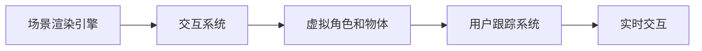

                 

关键词：混合现实（MR），游戏开发，交互设计，虚拟现实（VR），增强现实（AR），人机交互，游戏引擎，3D建模，场景渲染，用户体验（UX），编程，算法，人工智能（AI）。

> 摘要：本文旨在探讨混合现实（MR）技术在游戏世界构建与交互中的应用。首先，我们将回顾MR技术的背景和发展历程，然后深入分析其在游戏领域的关键概念和架构。接着，我们将介绍核心算法原理、数学模型和具体操作步骤。随后，通过实际项目实践和代码实例，我们将展示MR游戏世界的开发流程。最后，我们将讨论MR游戏的实际应用场景、未来展望，并提供相关工具和资源推荐。

## 1. 背景介绍

### 混合现实技术的定义和特点

混合现实（Mixed Reality，简称MR）是一种将现实世界和虚拟世界融合的技术，用户不仅能够看到虚拟对象，还能与之进行实时交互。MR与虚拟现实（Virtual Reality，VR）和增强现实（Augmented Reality，AR）的不同之处在于，MR提供了一个更具沉浸感和交互性的环境。

MR技术的特点包括：

1. **实时交互**：用户可以实时地与虚拟对象进行交互，例如操纵、拖动、移动等。
2. **增强沉浸感**：通过将虚拟对象与现实环境无缝融合，用户可以获得更真实的体验。
3. **空间感知**：用户可以在真实环境中感受到虚拟对象的存在，并在空间中自由移动。
4. **多感官刺激**：通过视觉、听觉、触觉等多种感官的融合，提供更加丰富的体验。

### 混合现实技术的发展历程

MR技术的发展可以追溯到20世纪90年代。最初的MR系统主要依赖于头戴显示器（HMD）和跟踪设备，如NVIDIA的Illuminator和Vuzix的VR920等。这些早期的MR设备由于性能和成本的限制，应用范围较为有限。

随着计算机处理能力和传感器技术的进步，MR技术逐渐成熟。2010年代，微软推出了HoloLens，这标志着MR技术的商业化开始。随后，其他公司如Facebook（现Meta Platforms）的Oculus和谷歌的Daydream也相继推出了自己的MR和VR设备。

### 混合现实技术在不同领域的应用

MR技术已广泛应用于多个领域，包括游戏、医疗、教育、娱乐、军事和工业设计等。在游戏领域，MR技术为游戏开发者提供了全新的创作空间和互动方式。

## 2. 核心概念与联系

### 混合现实游戏的基本概念

混合现实游戏是指利用MR技术构建的虚拟游戏世界，用户可以在现实环境中与虚拟角色和物体进行交互。与传统的游戏相比，MR游戏提供了更加沉浸式和互动性的体验。

### 混合现实游戏的关键架构

要构建一个成功的MR游戏世界，需要以下几个关键组成部分：

1. **场景渲染引擎**：负责生成和渲染虚拟场景，包括角色、物体和背景等。
2. **交互系统**：处理用户与虚拟世界的交互，如手势识别、声音识别和位置追踪等。
3. **虚拟角色和物体**：这些是游戏世界的核心，它们与用户进行交互并提供游戏体验。
4. **用户跟踪系统**：实时跟踪用户的位置和动作，以确保虚拟对象与现实环境的融合。

### Mermaid流程图

以下是构建MR游戏世界的Mermaid流程图：



### MR游戏世界的构建流程

1. **需求分析**：明确游戏的目标和用户需求，确定游戏世界的主题和内容。
2. **场景设计**：设计游戏世界的场景布局和视觉风格。
3. **虚拟角色与物体设计**：创建虚拟角色和物体，包括外观、动作和行为逻辑。
4. **交互系统开发**：实现用户与虚拟世界的交互功能，如手势识别和声音识别。
5. **用户跟踪与融合**：通过摄像头和传感器实时跟踪用户位置和动作，将虚拟对象与现实环境融合。
6. **性能优化**：对游戏进行性能优化，确保流畅的用户体验。

## 3. 核心算法原理 & 具体操作步骤

### 3.1 算法原理概述

MR游戏世界的构建涉及到多个核心算法，其中主要包括：

1. **场景渲染算法**：用于生成和渲染虚拟场景，包括物体、角色和背景等。
2. **交互算法**：实现用户与虚拟世界的交互，如手势识别、声音识别和位置追踪等。
3. **跟踪算法**：实时跟踪用户位置和动作，确保虚拟对象与现实环境的融合。

### 3.2 算法步骤详解

#### 3.2.1 场景渲染算法

1. **场景建模**：使用3D建模软件（如Blender或Maya）创建场景模型。
2. **纹理映射**：为场景中的物体添加纹理，提高视觉效果。
3. **光照模拟**：设置场景中的光照效果，包括光源位置、强度和颜色等。
4. **渲染引擎配置**：配置渲染引擎（如Unity或Unreal Engine），设置渲染参数和效果。

#### 3.2.2 交互算法

1. **手势识别**：使用计算机视觉算法（如OpenCV）识别用户的手势。
2. **声音识别**：使用语音识别技术（如Google Cloud Speech-to-Text）识别用户的声音命令。
3. **位置追踪**：使用传感器（如摄像头、激光雷达）实时跟踪用户的位置和动作。

#### 3.2.3 跟踪算法

1. **摄像头定位**：使用摄像头捕捉用户和环境，并进行图像处理。
2. **传感器融合**：将摄像头数据与其他传感器数据（如加速度计、陀螺仪）进行融合，提高定位精度。
3. **物体跟踪**：使用计算机视觉算法实时跟踪场景中的虚拟物体。

### 3.3 算法优缺点

#### 场景渲染算法

- **优点**：能够生成高质量的虚拟场景，提高用户体验。
- **缺点**：计算资源消耗较大，对硬件性能要求高。

#### 交互算法

- **优点**：提供丰富的用户交互方式，增强沉浸感。
- **缺点**：需要复杂的技术实现，对开发人员要求高。

#### 跟踪算法

- **优点**：实时跟踪用户和环境，实现虚拟与现实的无缝融合。
- **缺点**：受限于传感器精度和计算能力，存在一定误差。

### 3.4 算法应用领域

- **游戏开发**：MR技术为游戏开发者提供了全新的创作空间和互动方式，丰富了游戏体验。
- **教育**：MR技术可以模拟实验和场景，提高学习效果。
- **医疗**：MR技术可用于手术模拟和医疗培训，提高医疗水平。
- **娱乐**：MR技术为娱乐行业带来了新的创意和表现手法。

## 4. 数学模型和公式 & 详细讲解 & 举例说明

### 4.1 数学模型构建

MR游戏世界的构建涉及到多个数学模型，主要包括：

1. **空间变换模型**：用于描述虚拟物体在现实环境中的位置和姿态。
2. **光照模型**：用于模拟现实环境中光照对虚拟物体的影响。
3. **纹理映射模型**：用于将纹理映射到虚拟物体表面。

### 4.2 公式推导过程

以下是一个简单的空间变换模型推导过程：

#### 空间变换模型

假设有一个三维空间中的点P(x, y, z)，将其变换到新的坐标系中，新的点P'为：

$$
P' = T \cdot P
$$

其中，T是一个4x4的变换矩阵，包括平移向量t和旋转矩阵R：

$$
T = \begin{bmatrix}
R & t \\
0 & 1
\end{bmatrix}
$$

R是一个3x3的旋转矩阵，用于描述旋转操作。t是一个3x1的平移向量，用于描述平移操作。

#### 旋转矩阵R的推导

旋转矩阵R可以通过旋转向量v和旋转角度θ来表示：

$$
R = \begin{bmatrix}
v_x^2 + (1 - v_x^2)\cos(\theta) & v_xv_y(1 - \cos(\theta)) - v_z\sin(\theta) & v_xv_z(1 - \cos(\theta)) + v_y\sin(\theta) \\
v_xv_y(1 - \cos(\theta)) + v_z\sin(\theta) & v_y^2 + (1 - v_y^2)\cos(\theta) & v_yv_z(1 - \cos(\theta)) - v_x\sin(\theta) \\
v_xv_z(1 - \cos(\theta)) - v_y\sin(\theta) & v_yv_z(1 - \cos(\theta)) + v_x\sin(\theta) & v_z^2 + (1 - v_z^2)\cos(\theta)
\end{bmatrix}
$$

其中，v是一个单位向量，表示旋转轴，θ是旋转角度。

### 4.3 案例分析与讲解

以下是一个简单的MR游戏世界构建案例：

#### 案例描述

假设我们构建一个简单的MR游戏世界，其中有一个虚拟球体位于现实环境中的一个桌子上。用户可以通过手势将球体移动到桌子的其他位置。

#### 案例实现步骤

1. **场景渲染**：使用3D建模软件创建一个球体模型，并设置纹理。
2. **交互系统**：实现手势识别算法，用于识别用户的手势。
3. **用户跟踪**：使用摄像头和传感器实时跟踪用户的位置和手势。
4. **空间变换**：根据用户手势，计算球体的位置和姿态变化，并更新渲染。

#### 实现细节

1. **场景渲染**：使用Unity作为渲染引擎，将球体模型导入到Unity项目中，并设置合适的材质和光照。
2. **交互系统**：使用OpenCV实现手势识别算法，将摄像头捕捉到的图像转换为手势数据。
3. **用户跟踪**：使用Kinect作为传感器，实时捕捉用户和环境图像，并使用传感器融合算法处理数据。
4. **空间变换**：根据手势数据，计算球体的位置和姿态变化，并更新渲染。

通过这个案例，我们可以看到MR游戏世界的构建涉及到多个技术和算法，包括3D建模、计算机视觉、传感器融合和空间变换等。

## 5. 项目实践：代码实例和详细解释说明

### 5.1 开发环境搭建

要开发一个MR游戏世界，我们需要搭建一个合适的开发环境。以下是一个基于Unity引擎的MR游戏开发环境搭建步骤：

1. **安装Unity Hub**：下载并安装Unity Hub，这是一个方便管理Unity版本的客户端。
2. **创建Unity项目**：打开Unity Hub，创建一个新的Unity项目，选择“3D”模板。
3. **安装MR插件**：在Unity项目中，安装支持MR的插件，如Unity MRTK（Mixed Reality Toolkit）。
4. **配置开发设备**：连接MR设备（如HoloLens）到电脑，并在Unity中配置相应的设备参数。

### 5.2 源代码详细实现

以下是一个简单的MR游戏世界的源代码实现：

```csharp
using UnityEngine;

public class MRGameWorld : MonoBehaviour
{
    public GameObject ball;
    public Transform userPosition;

    private void Update()
    {
        // 跟踪用户位置
        Vector3 newPosition = userPosition.position;

        // 更新球体位置
        ball.transform.position = newPosition;
    }
}
```

这个示例代码展示了如何将球体与用户位置绑定，使球体跟随用户的移动。

### 5.3 代码解读与分析

1. **GameObject ball**：定义一个球体对象，用于在场景中显示。
2. **Transform userPosition**：定义一个用户位置变换组件，用于获取用户的位置。
3. **Update方法**：在每一帧更新时，获取用户位置并更新球体位置。
4. **newPosition**：计算用户位置的新向量。
5. **ball.transform.position**：更新球体位置。

通过这个简单的示例，我们可以看到如何实现MR游戏世界中球体的跟随功能。实际开发中，还需要添加手势识别、声音识别、传感器融合等功能，以提供更丰富的交互体验。

### 5.4 运行结果展示

运行MR游戏世界后，用户可以佩戴MR设备（如HoloLens），在现实环境中看到球体。用户可以通过手势移动球体，球体会跟随用户的动作实时更新位置。


## 6. 实际应用场景

### 6.1 教育培训

MR游戏世界可以用于教育培训，如医学培训、机械操作培训等。通过模拟真实场景，用户可以更直观地学习操作技能。

### 6.2 娱乐体验

MR游戏世界为娱乐行业带来了新的创意和表现手法，如虚拟现实游戏、主题公园等。用户可以沉浸在一个充满奇幻元素的虚拟世界中。

### 6.3 军事模拟

MR游戏世界可以用于军事模拟，如战斗模拟、战术训练等。通过模拟真实战场环境，士兵可以更好地了解战术和策略。

### 6.4 工业设计

MR游戏世界可以用于工业设计，如产品展示、工厂布局等。设计师可以虚拟展示产品，并与客户实时互动，提供更好的设计体验。

## 7. 工具和资源推荐

### 7.1 学习资源推荐

1. **《混合现实技术原理与应用》**：该书详细介绍了MR技术的基本原理和应用案例，适合初学者阅读。
2. **Unity官方文档**：Unity提供了丰富的官方文档，涵盖MR游戏开发的各个方面，是开发者必备的资源。

### 7.2 开发工具推荐

1. **Unity引擎**：作为最流行的游戏开发引擎，Unity支持MR游戏开发，并提供丰富的功能。
2. **Unity MRTK**：Unity MRTK是一个开源的MR开发工具包，提供了丰富的交互组件和示例代码。

### 7.3 相关论文推荐

1. **"Augmented Reality for Mobile Devices: An Overview of the State of the Art"**：该论文总结了移动设备上增强现实技术的研究进展。
2. **"Mixed Reality: From today’s applications to future technology trends"**：该论文探讨了MR技术的应用和未来发展趋势。

## 8. 总结：未来发展趋势与挑战

### 8.1 研究成果总结

MR游戏世界构建与交互技术取得了显著的研究成果，涵盖了场景渲染、交互系统、用户跟踪等多个方面。这些成果为开发高质量的MR游戏提供了坚实的基础。

### 8.2 未来发展趋势

1. **硬件性能提升**：随着硬件技术的进步，MR设备的性能将不断提高，为用户提供更加沉浸式的体验。
2. **人工智能应用**：人工智能技术将在MR游戏中发挥更大作用，如智能角色、自适应交互等。
3. **跨平台开发**：MR游戏将更加普及，支持多种设备和平台，为用户带来更广泛的体验。

### 8.3 面临的挑战

1. **计算资源消耗**：MR游戏对计算资源的需求较高，需要优化算法和架构以提高性能。
2. **用户体验优化**：如何提高用户体验，包括交互体验、视觉体验和听觉体验等，是一个重要的挑战。
3. **隐私和安全问题**：MR游戏涉及用户隐私和安全问题，需要制定相应的隐私保护政策和安全措施。

### 8.4 研究展望

未来，MR游戏世界构建与交互技术将在多个领域发挥重要作用，包括教育、娱乐、医疗、军事等。随着技术的不断进步，MR游戏将变得更加丰富和智能，为用户提供全新的互动体验。

## 9. 附录：常见问题与解答

### 9.1 如何优化MR游戏性能？

1. **使用高效算法**：选择高效的渲染算法和交互算法，降低计算复杂度。
2. **优化硬件配置**：提高设备的硬件性能，如CPU、GPU、内存等。
3. **数据缓存**：使用数据缓存技术，减少实时数据传输和处理。

### 9.2 MR游戏世界的交互方式有哪些？

1. **手势交互**：通过手势识别技术实现用户与虚拟世界的交互。
2. **声音交互**：通过语音识别技术实现用户与虚拟世界的交互。
3. **视线交互**：通过视线跟踪技术实现用户与虚拟世界的交互。

### 9.3 MR游戏世界的安全性和隐私问题如何解决？

1. **数据加密**：对用户数据进行加密，确保数据传输安全。
2. **隐私政策**：制定明确的隐私政策，告知用户数据收集和使用情况。
3. **安全审计**：定期进行安全审计，确保系统安全可靠。

----------------------------------------------------------------

> 作者：禅与计算机程序设计艺术 / Zen and the Art of Computer Programming

