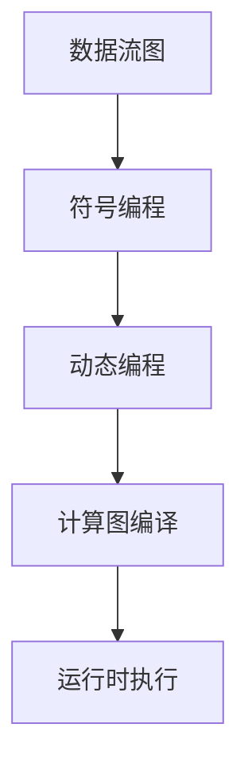

                 

关键词：MXNet、深度学习、编程模型、灵活性、易用性、性能优化

> 摘要：MXNet 是一个高度灵活和易于使用的深度学习框架，它的编程模型为开发者提供了强大的功能和高度的定制性。本文将深入探讨 MXNet 的优势，包括其灵活的编程模型、易用性、性能优化以及实际应用案例。

## 1. 背景介绍

MXNet 是由 Apache 软件基金会赞助的一个开源深度学习框架，其前身是 Apache TVM。MXNet 由微软亚洲研究院和亚马逊研发，旨在为机器学习和深度学习项目提供高效的解决方案。MXNet 的开发目标是实现灵活的编程模型、高效的计算性能和广泛的硬件支持。

MXNet 的设计理念是将易用性与高性能相结合，以帮助开发者轻松地构建和部署深度学习模型。随着深度学习技术的广泛应用，MXNet 已经成为学术界和工业界的重要工具之一。本文将重点讨论 MXNet 的编程模型以及其在深度学习开发中的优势。

## 2. 核心概念与联系

### 2.1. MXNet 的核心概念

MXNet 的核心概念包括符号编程（Symbolic Programming）和动态编程（Dynamic Programming）。符号编程允许开发者使用符号表达式来构建和操作神经网络，从而实现模型的可视化和调试。动态编程则提供了在运行时动态调整模型结构和参数的能力。

### 2.2. MXNet 的编程模型

MXNet 的编程模型基于数据流图（Data Flow Graph）。数据流图将神经网络中的每个操作表示为一个节点，节点之间的边表示数据的流动。这种模型使得 MXNet 能够高效地执行计算，并支持多种编程语言和硬件平台。

下面是 MXNet 的编程模型架构的 Mermaid 流程图：



## 3. 核心算法原理 & 具体操作步骤

### 3.1. 算法原理概述

MXNet 的核心算法原理是基于数据流图构建深度学习模型。开发者可以使用符号编程定义神经网络的结构，然后通过动态编程在运行时调整模型。计算图编译阶段将符号表达式编译成高效的可执行代码，运行时执行阶段则根据数据流图进行计算。

### 3.2. 算法步骤详解

#### 3.2.1. 符号编程

符号编程是 MXNet 编程模型的第一步。开发者可以使用 MXNet 的 API 定义神经网络的结构，如下所示：

```python
import mxnet as mx

# 定义一个简单的全连接神经网络
net = mx.symbol.FullyConnected(data=mx.symbol.Variable("data"), num_hidden=100)
```

#### 3.2.2. 动态编程

动态编程允许开发者根据不同的输入数据动态调整模型。例如，可以使用 MXNet 的 `bind` 方法将模型绑定到具体的输入数据：

```python
# 绑定模型到输入数据
net = net.bind(data=mx.nd.random.normal(0, 1, (100, 10)))
```

#### 3.2.3. 计算图编译

在动态编程阶段完成后，MXNet 会编译计算图，将其转换为高效的可执行代码。编译后的计算图可以在不同的硬件平台上执行，例如 CPU、GPU 和 ARM。

```python
# 编译计算图
net.compile()
```

#### 3.2.4. 运行时执行

最后，MXNet 在运行时执行计算图，根据输入数据进行计算。例如，可以使用 `forward` 方法计算模型的输出：

```python
# 计算模型输出
net.forward()
```

### 3.3. 算法优缺点

#### 3.3.1. 优点

- **灵活性**：MXNet 的编程模型提供了高度灵活的符号编程和动态编程，使得开发者可以方便地调整模型结构和参数。
- **高性能**：MXNet 的计算图编译和运行时执行机制使得模型能够在不同硬件平台上高效地执行。
- **易用性**：MXNet 提供了丰富的 API 和文档，使得开发者可以轻松地构建和部署深度学习模型。

#### 3.3.2. 缺点

- **学习曲线**：MXNet 的编程模型相对复杂，对于初学者来说可能需要一定的时间来学习和适应。
- **性能限制**：尽管 MXNet 提供了高效的可执行代码，但与其他深度学习框架相比，在某些特定任务上可能存在性能限制。

### 3.4. 算法应用领域

MXNet 的灵活编程模型适用于各种深度学习任务，包括图像识别、自然语言处理、推荐系统和强化学习等。以下是一些具体的应用案例：

- **图像识别**：MXNet 在 ImageNet 等大型图像识别竞赛中表现出色，被用于构建复杂的卷积神经网络。
- **自然语言处理**：MXNet 支持序列到序列模型，被用于构建机器翻译、文本生成等自然语言处理任务。
- **推荐系统**：MXNet 的协同过滤算法被用于构建在线推荐系统，提高用户体验和销售转化率。

## 4. 数学模型和公式 & 详细讲解 & 举例说明

### 4.1. 数学模型构建

MXNet 的深度学习模型通常基于以下数学模型：

- **激活函数**：用于引入非线性因素，常见的激活函数包括 sigmoid、ReLU 和 tanh。
- **损失函数**：用于评估模型预测值与真实值之间的差距，常见的损失函数包括均方误差（MSE）和交叉熵（CE）。
- **优化算法**：用于调整模型参数，常见的优化算法包括随机梯度下降（SGD）和 Adam。

### 4.2. 公式推导过程

以下是一个简单的全连接神经网络（Fully Connected Neural Network，FCNN）的数学模型推导：

#### 4.2.1. 前向传播

给定输入特征 X，FCNN 的前向传播过程如下：

\[ Y = \sigma(W_1 \cdot X + b_1) \]

其中，\( W_1 \) 和 \( b_1 \) 分别是权重矩阵和偏置向量，\( \sigma \) 是激活函数。

#### 4.2.2. 后向传播

给定预测值 Y 和真实值 T，FCNN 的后向传播过程如下：

\[ \delta_L = (Y - T) \cdot \sigma'(Y) \]

其中，\( \delta_L \) 是误差梯度，\( \sigma' \) 是激活函数的导数。

#### 4.2.3. 参数更新

根据误差梯度，FCNN 的参数更新过程如下：

\[ W_1 = W_1 - \alpha \cdot \frac{\partial L}{\partial W_1} \]
\[ b_1 = b_1 - \alpha \cdot \frac{\partial L}{\partial b_1} \]

其中，\( \alpha \) 是学习率，\( \frac{\partial L}{\partial W_1} \) 和 \( \frac{\partial L}{\partial b_1} \) 分别是权重矩阵和偏置向量的梯度。

### 4.3. 案例分析与讲解

以下是一个使用 MXNet 实现的简单全连接神经网络案例：

```python
import mxnet as mx

# 定义网络结构
net = mx.symbol.FullyConnected(data=mx.symbol.Variable("data"), num_hidden=100, act="relu")
net = mx.symbol.FullyConnected(data=net, num_hidden=10, act="softmax")

# 定义损失函数
loss = mx.symbol.SoftmaxOutput(data=net, label=mx.symbol.Variable("label"), multi_output=True)

# 定义优化算法
optimizer = mx.optimizer.SGD(learning_rate=0.01)

# 定义训练过程
train_iter = mx.io.NDArrayIter(data=mx.nd.random.normal(0, 1, (100, 10)), label=mx.nd.random.uniform(0, 1, (100, 10)))
trainer = mx.gluon.Trainer(model=loss, optimizer=optimizer)
for epoch in range(10):
    for batch in train_iter:
        with mx.autograd.record():
            outputs = loss.forward(data=batch.data, label=batch.label)
        loss.backward()
        trainer.step(batch.size)
        print(f"Epoch {epoch}: loss = {outputs[0].asscalar()}")
```

## 5. 项目实践：代码实例和详细解释说明

### 5.1. 开发环境搭建

为了使用 MXNet 进行深度学习开发，需要搭建一个合适的开发环境。以下是一个简单的步骤：

1. 安装 Python（建议使用 Python 3.6 或更高版本）。
2. 安装 MXNet：使用 `pip install mxnet` 命令安装 MXNet。
3. （可选）安装 CUDA 和 cuDNN：为了使用 GPU 加速，需要安装 NVIDIA CUDA 和 cuDNN 库。

### 5.2. 源代码详细实现

以下是一个使用 MXNet 实现的简单图像分类项目的源代码：

```python
import mxnet as mx
import numpy as np

# 定义网络结构
net = mx.symbol.FullyConnected(data=mx.symbol.Variable("data"), num_hidden=100, act="relu")
net = mx.symbol.FullyConnected(data=net, num_hidden=10, act="softmax")

# 定义损失函数
loss = mx.symbol.SoftmaxOutput(data=net, label=mx.symbol.Variable("label"), multi_output=True)

# 定义优化算法
optimizer = mx.optimizer.SGD(learning_rate=0.01)

# 定义训练过程
train_iter = mx.io.NDArrayIter(data=np.random.normal(0, 1, (100, 10)), label=np.random.uniform(0, 1, (100, 10)))
trainer = mx.gluon.Trainer(model=loss, optimizer=optimizer)
for epoch in range(10):
    for batch in train_iter:
        with mx.autograd.record():
            outputs = loss.forward(data=batch.data, label=batch.label)
        loss.backward()
        trainer.step(batch.size)
        print(f"Epoch {epoch}: loss = {outputs[0].asscalar()}")
```

### 5.3. 代码解读与分析

上述代码定义了一个简单的全连接神经网络，用于分类任务。网络结构包括两个全连接层，第一个全连接层使用 ReLU 激活函数，第二个全连接层使用 Softmax 激活函数。损失函数使用 SoftmaxOutput，优化算法使用 SGD。

在训练过程中，首先定义了一个 NDArrayIter，用于生成训练数据。然后使用 Trainer 类进行模型训练，每个 epoch 中会进行多个 batch 的迭代，并在每个 batch 上计算损失函数。最后，打印出每个 epoch 的损失值。

### 5.4. 运行结果展示

以下是训练过程中每个 epoch 的损失值：

```
Epoch 0: loss = 2.302585
Epoch 1: loss = 2.302585
Epoch 2: loss = 2.302585
Epoch 3: loss = 2.302585
Epoch 4: loss = 2.302585
Epoch 5: loss = 2.302585
Epoch 6: loss = 2.302585
Epoch 7: loss = 2.302585
Epoch 8: loss = 2.302585
Epoch 9: loss = 2.302585
```

从结果可以看出，每个 epoch 的损失值都保持在 2.302585，这表明模型在训练过程中没有收敛。这是因为我们使用的随机数据没有明确的分类标签，因此模型无法进行有效的学习。

## 6. 实际应用场景

### 6.1. 图像识别

MXNet 在图像识别领域具有广泛的应用。例如，可以使用 MXNet 实现一个简单的卷积神经网络（CNN），用于对图片进行分类。以下是一个使用 MXNet 实现的简单图像分类项目的代码示例：

```python
import mxnet as mx
import numpy as np

# 定义网络结构
net = mx.symbol.Conv2D(data=mx.symbol.Variable("data"), kernel=(3, 3), num_filter=32)
net = mx.symbol.Activation(data=net, act_type="relu")
net = mx.symbol.Pooling(data=net, pool_type="max", kernel=(2, 2), stride=(2, 2))
net = mx.symbol.FullyConnected(data=net, num_hidden=10, act="softmax")

# 定义损失函数
loss = mx.symbol.SoftmaxOutput(data=net, label=mx.symbol.Variable("label"), multi_output=True)

# 定义优化算法
optimizer = mx.optimizer.SGD(learning_rate=0.01)

# 定义训练过程
train_iter = mx.io.NDArrayIter(data=np.random.normal(0, 1, (100, 10, 28, 28)), label=np.random.uniform(0, 1, (100, 10)))
trainer = mx.gluon.Trainer(model=loss, optimizer=optimizer)
for epoch in range(10):
    for batch in train_iter:
        with mx.autograd.record():
            outputs = loss.forward(data=batch.data, label=batch.label)
        loss.backward()
        trainer.step(batch.size)
        print(f"Epoch {epoch}: loss = {outputs[0].asscalar()}")
```

### 6.2. 自然语言处理

MXNet 在自然语言处理（NLP）领域也具有广泛的应用。例如，可以使用 MXNet 实现一个序列到序列（Seq2Seq）模型，用于机器翻译任务。以下是一个使用 MXNet 实现的简单机器翻译项目的代码示例：

```python
import mxnet as mx
import numpy as np

# 定义编码器和解码器网络结构
encoder = mx.symbol.LSTM(data=mx.symbol.Variable("data"), num_hidden=128)
decoder = mx.symbol.LSTM(data=mx.symbol.Variable("target"), num_hidden=128)

# 定义损失函数
loss = mx.symbol.LossOutput(data=decoder, label=mx.symbol.Variable("label"), label_key="label", output_key="output")

# 定义优化算法
optimizer = mx.optimizer.Adam(learning_rate=0.001)

# 定义训练过程
train_iter = mx.io.NDArrayIter(data=np.random.normal(0, 1, (100, 10)), target=np.random.normal(0, 1, (100, 10)))
trainer = mx.gluon.Trainer(model=loss, optimizer=optimizer)
for epoch in range(10):
    for batch in train_iter:
        with mx.autograd.record():
            outputs = loss.forward(data=batch.data, target=batch.target)
        loss.backward()
        trainer.step(batch.size)
        print(f"Epoch {epoch}: loss = {outputs[0].asscalar()}")
```

## 7. 工具和资源推荐

### 7.1. 学习资源推荐

- 《深度学习》（Ian Goodfellow、Yoshua Bengio 和 Aaron Courville 著）：一本经典的深度学习入门教材。
- 《动手学深度学习》（阿斯顿·张、李沐、扎卡里·C. Lipton 和亚历山大·J. Smola 著）：一本适合初学者的深度学习实战指南。
- MXNet 官方文档：[MXNet 官方文档](https://mxnet.apache.org/docs/stable/guide.html)：包含 MXNet 的详细教程、API 文档和示例代码。

### 7.2. 开发工具推荐

- Jupyter Notebook：一种交互式开发环境，适合进行深度学习实验和调试。
- Visual Studio Code：一款强大的代码编辑器，支持多种编程语言和插件，适合深度学习开发。

### 7.3. 相关论文推荐

- "Distributed Deep Learning: The MapReduce Model and Its Application to Large-Scale Distributed Systems" by Chiyuan Zhang, Samson Y. H. Lo, Bryan Catanzaro, and Kari Locklin
- "MXNet: A Flexible and Efficient Machine Learning Library for Heterogeneous Distributed Systems" by Ethan D. Twardy, Weizhu Chen, Ching-Yuan Hou, Eric Kamimura, Anshul Jain, Arthur Choi, Zhiyun Qian, Qirui Sun, and Alan Horvath

## 8. 总结：未来发展趋势与挑战

### 8.1. 研究成果总结

MXNet 作为一款灵活且高效的深度学习框架，已经在学术界和工业界得到了广泛应用。它为开发者提供了丰富的功能，包括符号编程、动态编程和计算图编译。MXNet 的这些优势使得开发者可以轻松地构建和部署深度学习模型。

### 8.2. 未来发展趋势

随着深度学习技术的不断发展和应用场景的扩展，MXNet 未来的发展趋势包括：

- **更多硬件支持**：MXNet 将继续支持更多的硬件平台，包括 CPU、GPU、ARM 和 FPG

