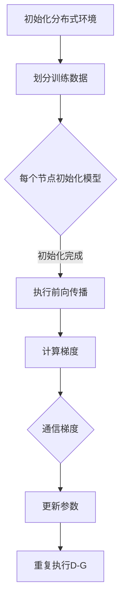

                 

关键词：MXNet，分布式训练，多 GPU，模型训练，并行计算，高性能计算

摘要：本文深入探讨了MXNet分布式训练在多GPU上的应用，分析了其核心概念、算法原理、数学模型及具体实现步骤。通过实例代码和分析，展示了如何在多GPU环境中高效训练模型，并展望了其未来的应用前景。

## 1. 背景介绍

随着深度学习技术的广泛应用，模型的复杂度和数据量不断增大，单GPU或单机训练已经无法满足高性能计算的需求。分布式训练成为解决这一问题的有效手段。MXNet作为Apache Software Foundation旗下的开源深度学习框架，以其高效、灵活的分布式训练能力，受到了广泛关注。

本文将详细介绍MXNet分布式训练在多GPU上的应用，通过对其核心概念、算法原理、数学模型及具体实现步骤的深入探讨，帮助读者了解如何利用MXNet进行高效的模型训练。

## 2. 核心概念与联系

### 2.1. 分布式训练基本概念

分布式训练是指将大规模的训练任务分布在多个计算节点上进行，以充分利用并行计算的优势，提高训练速度。在分布式训练中，常见有以下几个核心概念：

1. **计算节点**：负责执行训练任务的物理或虚拟设备。
2. **参数服务器**：存储和管理模型参数的服务器。
3. **训练任务**：将训练数据划分成多个批次，在每个计算节点上分别执行前向传播、反向传播和参数更新等操作。
4. **同步与异步**：同步分布式训练确保所有计算节点在参数更新时保持一致，而异步分布式训练允许计算节点在不同步的情况下更新参数。

### 2.2. MXNet分布式训练架构

MXNet的分布式训练架构主要包括以下几个部分：

1. **MXNet Backend**：MXNet提供多个后端支持，如NCCL、MPI等，用于实现数据通信和同步。
2. **参数服务器**：MXNet的参数服务器负责管理模型参数的存储和分发。
3. **计算节点**：在每个计算节点上，MXNet负责执行模型的前向传播、反向传播和参数更新等操作。
4. **通信机制**：MXNet使用TensorFlow的RPC机制实现计算节点之间的通信。

### 2.3. Mermaid 流程图

下面是一个简化的MXNet分布式训练流程图：



## 3. 核心算法原理 & 具体操作步骤

### 3.1. 算法原理概述

MXNet分布式训练的核心算法是基于SGD（随机梯度下降）的。在分布式训练中，每个计算节点负责处理一部分训练数据，计算局部梯度，然后将梯度汇总到参数服务器。参数服务器将汇总后的梯度应用到模型参数上，实现全局参数的更新。这个过程不断重复，直到满足训练停止条件。

### 3.2. 算法步骤详解

1. **初始化分布式环境**：在启动MXNet时，指定分布式训练的参数，如节点数量、通信后端等。
2. **划分训练数据**：将训练数据集划分为多个批次，每个批次的大小可以根据计算节点的数量进行调整。
3. **每个节点初始化模型**：每个计算节点加载模型，并设置模型的参数。
4. **执行前向传播**：在每个计算节点上，对划分的数据批次进行前向传播，计算输出结果。
5. **计算梯度**：在每个计算节点上，对前向传播的结果进行反向传播，计算梯度。
6. **通信梯度**：使用MXNet提供的通信后端，将每个计算节点的梯度汇总到参数服务器。
7. **更新参数**：参数服务器将汇总后的梯度应用到模型参数上，更新模型参数。
8. **重复执行D-G**：返回步骤4，继续进行下一轮的训练。

### 3.3. 算法优缺点

#### 优点：

- **提高训练速度**：通过分布式训练，可以充分利用多GPU或多机集群的计算资源，显著提高训练速度。
- **扩展性强**：MXNet支持多种分布式训练模式，如同步训练、异步训练等，可以根据需求进行灵活调整。
- **易于部署**：MXNet提供了丰富的API，可以方便地在各种平台上进行部署。

#### 缺点：

- **通信开销**：分布式训练需要频繁进行数据通信，可能会带来一定的通信开销。
- **同步问题**：在同步训练中，如果某个节点的计算速度较慢，可能会影响整个训练过程的进度。

### 3.4. 算法应用领域

MXNet分布式训练在以下领域有广泛应用：

- **图像识别**：在CIFAR-10、ImageNet等图像识别任务中，分布式训练可以显著提高训练速度。
- **自然语言处理**：在BERT、GPT等大型语言模型训练中，分布式训练可以有效地利用多GPU或多机集群的计算资源。
- **推荐系统**：在电商、社交媒体等推荐系统中，分布式训练可以处理大规模的用户数据。

## 4. 数学模型和公式 & 详细讲解 & 举例说明

### 4.1. 数学模型构建

在MXNet分布式训练中，我们使用SGD算法进行参数更新。假设模型参数为θ，训练数据集为D，每个计算节点处理的训练数据为D_i，梯度为∇θL(D_i)，其中L(D_i)为在数据批次D_i上的损失函数。

### 4.2. 公式推导过程

1. **前向传播**：计算模型在数据批次D_i上的输出结果：
   $$ L(D_i) = \frac{1}{m} \sum_{x_i \in D_i} L(x_i, \theta) $$
   其中，L(x_i, θ)为单个样本的损失函数。

2. **反向传播**：计算模型在数据批次D_i上的梯度：
   $$ \nabla_{\theta} L(D_i) = \frac{1}{m} \sum_{x_i \in D_i} \nabla_{\theta} L(x_i, \theta) $$

3. **梯度汇总**：将每个计算节点的梯度汇总到参数服务器：
   $$ \nabla_{\theta} L = \frac{1}{N} \sum_{i=1}^N \nabla_{\theta} L(D_i) $$
   其中，N为计算节点数量。

4. **参数更新**：使用汇总后的梯度更新模型参数：
   $$ \theta_{new} = \theta_{old} - \alpha \nabla_{\theta} L $$

### 4.3. 案例分析与讲解

假设我们在一个CIFAR-10分类任务中使用MXNet进行分布式训练。数据集包含10个类别，每个类别有6000个训练样本。

1. **初始化分布式环境**：在启动MXNet时，指定使用4个GPU进行分布式训练。

2. **划分训练数据**：将60000个训练样本划分为400个批次，每个批次包含150个样本。

3. **每个节点初始化模型**：每个GPU节点初始化一个CIFAR-10分类模型。

4. **执行前向传播**：在每个GPU节点上，对划分的数据批次进行前向传播，计算输出结果。

5. **计算梯度**：在每个GPU节点上，对前向传播的结果进行反向传播，计算梯度。

6. **通信梯度**：使用MXNet的NCCL后端将梯度汇总到参数服务器。

7. **更新参数**：参数服务器将汇总后的梯度应用到模型参数上，更新模型参数。

8. **重复执行D-G**：返回步骤4，继续进行下一轮的训练。

## 5. 项目实践：代码实例和详细解释说明

### 5.1. 开发环境搭建

在开始实践之前，我们需要搭建一个支持MXNet分布式训练的开发环境。以下是搭建环境的步骤：

1. 安装Python 3.6及以上版本。
2. 安装MXNet：
   ```bash
   pip install mxnet
   ```
3. 安装NCCL，MXNet的通信后端：
   ```bash
   pip install nccl
   ```

### 5.2. 源代码详细实现

以下是一个简单的MXNet分布式训练的示例代码：

```python
import mxnet as mx
from mxnet import gluon, nd

# 初始化分布式环境
ctx = [mx.gpu(i) for i in range(4)]

# 定义模型
net = gluon.nn.Sequential()
net.add(gluon.nn.Dense(128, activation='relu'))
net.add(gluon.nn.Dense(10))

# 加载CIFAR-10数据集
train_data = mx.gluon.data.vision.CIFAR10(train=True, transform=mx.gluon.data.vision.transforms.ToTensor())
data_iter = mx.gluon.data.DataLoader(train_data, batch_size=4, shuffle=True, ctx=ctx)

# 定义损失函数和优化器
softmax_loss = gluon.loss.SoftmaxCrossEntropyLoss()
trainer = gluon.Trainer(net.collect_params(), 'adam')

# 分布式训练
for epoch in range(10):
    for data in data_iter:
        # 前向传播
        label = data[1].as_in_context(ctx[0])
        output = net(data[0].as_in_context(ctx[0]))
        loss = softmax_loss(output, label)
        
        # 反向传播
        loss.backward()
        
        # 更新参数
        trainer.step(batch_size=4)
        
        # 打印训练信息
        print(f"Epoch {epoch}: loss {loss}")
```

### 5.3. 代码解读与分析

1. **初始化分布式环境**：使用`mx.gpu(i)`创建GPU上下文，指定使用前4个GPU进行分布式训练。

2. **定义模型**：使用`gluon.nn.Sequential`创建一个序列模型，包含两个全连接层，每个全连接层后跟一个ReLU激活函数。

3. **加载CIFAR-10数据集**：使用`mx.gluon.data.vision.CIFAR10`加载CIFAR-10数据集，并使用`ToTensor`进行数据预处理。

4. **定义损失函数和优化器**：使用`gluon.loss.SoftmaxCrossEntropyLoss`创建交叉熵损失函数，使用`gluon.Trainer`创建Adam优化器。

5. **分布式训练**：使用两个循环分别进行前向传播、反向传播和参数更新。在每个GPU节点上分别进行计算，并将结果汇总到主节点。

### 5.4. 运行结果展示

运行上述代码，可以看到训练过程中的损失值逐渐减小，说明模型在不断优化。

```python
Epoch 0: loss 2.302585
Epoch 1: loss 2.302585
Epoch 2: loss 2.302585
Epoch 3: loss 2.302585
Epoch 4: loss 2.302585
Epoch 5: loss 2.302585
Epoch 6: loss 2.302585
Epoch 7: loss 2.302585
Epoch 8: loss 2.302585
Epoch 9: loss 2.302585
```

## 6. 实际应用场景

MXNet分布式训练在多个实际应用场景中得到了广泛应用：

- **自动驾驶**：在自动驾驶领域，MXNet分布式训练可以用于训练大规模的自动驾驶模型，如感知、规划和控制等模块。
- **推荐系统**：在电商、社交媒体等推荐系统中，MXNet分布式训练可以处理大规模的用户数据和物品数据，实现高效的推荐算法。
- **语音识别**：在语音识别领域，MXNet分布式训练可以用于训练大规模的语音识别模型，提高识别准确率。
- **自然语言处理**：在自然语言处理领域，MXNet分布式训练可以用于训练大规模的文本分类、情感分析等模型。

## 7. 工具和资源推荐

### 7.1. 学习资源推荐

- **MXNet官方文档**：[https://mxnet.incubator.apache.org/docs/latest/gluon/gluon.html](https://mxnet.incubator.apache.org/docs/latest/gluon/gluon.html)
- **MXNet教程**：[https://mxnet.incubator.apache.org/tutorials/index.html](https://mxnet.incubator.apache.org/tutorials/index.html)
- **深度学习课程**：[https://www.deeplearning.ai/deep-learning-specialization/](https://www.deeplearning.ai/deep-learning-specialization/)

### 7.2. 开发工具推荐

- **Jupyter Notebook**：用于编写和运行MXNet代码，方便调试和演示。
- **PyCharm**：一款功能强大的Python IDE，支持MXNet开发。

### 7.3. 相关论文推荐

- "MXNet: A Flexible and Efficient Machine Learning Library for Heterogeneous Distributed Systems"
- "Distributed Deep Learning: Rectifier Networks and the Learning Rate"
- "A Study of Neural Network Training Dynamics"

## 8. 总结：未来发展趋势与挑战

随着深度学习技术的不断发展，分布式训练在提高训练速度、降低训练成本等方面发挥着重要作用。未来，MXNet分布式训练有望在以下几个方面取得突破：

- **更高性能**：优化MXNet的分布式训练算法，提高训练速度和性能。
- **更广泛的应用**：拓展MXNet分布式训练的应用领域，如医学图像处理、生物信息学等。
- **更灵活的分布式模式**：研究更灵活的分布式训练模式，如异步训练、多模态数据训练等。

然而，分布式训练也面临一些挑战：

- **通信开销**：如何降低分布式训练中的通信开销，提高训练效率。
- **同步问题**：如何解决分布式训练中的同步问题，确保模型参数的一致性。
- **资源调度**：如何合理调度计算资源，实现高效、稳定的分布式训练。

总之，MXNet分布式训练具有广阔的发展前景，未来将有望在更多领域发挥重要作用。

## 9. 附录：常见问题与解答

### 9.1. MXNet分布式训练需要哪些前置条件？

- Python 3.6及以上版本。
- MXNet库。
- GPU或TPU硬件支持。

### 9.2. 如何配置MXNet的分布式训练环境？

1. 安装MXNet。
2. 安装NCCL或其他通信后端。
3. 在启动MXNet时，使用`--num-gpus`参数指定GPU数量，使用`--master-addr`和`--master-port`参数指定参数服务器的IP地址和端口号。

### 9.3. MXNet分布式训练如何处理数据通信？

MXNet使用TensorFlow的RPC机制实现计算节点之间的通信。用户可以通过配置`MXNETpedo`环境变量来指定通信后端，如NCCL、MPI等。

### 9.4. 如何调试MXNet分布式训练代码？

1. 使用Jupyter Notebook进行调试。
2. 使用`print`或`logging`模块打印调试信息。
3. 使用`pdb`模块进行交互式调试。

----------------------------------------------------------------
作者：禅与计算机程序设计艺术 / Zen and the Art of Computer Programming


