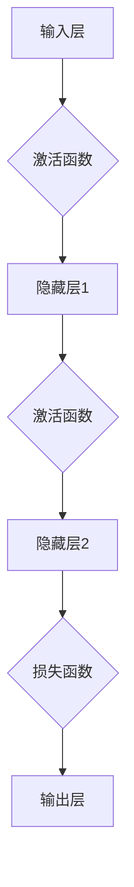

                 

关键词：MXNet、深度学习、灵活、可扩展、框架、性能优化、模型部署

## 摘要

MXNet 是由 Apache 软件基金会孵化的开源深度学习框架，以其灵活性和可扩展性在业界享有盛誉。本文将深入探讨 MXNet 的这些核心特点，从其设计理念、核心组件、到实际应用场景，全面剖析 MXNet 如何通过灵活的架构设计和高效的执行策略，为开发者提供强大的支持。通过本文，读者可以更好地理解 MXNet 的优势，掌握其在现代机器学习项目中的使用方法，并为未来的技术开发提供有益的参考。

## 1. 背景介绍

MXNet 的起源可以追溯到亚马逊的内部深度学习框架，由亚马逊云计算服务（AWS）团队开发。随着深度学习的兴起和云计算的普及，MXNet 被开源并成为 Apache 软件基金会的一个项目。MXNet 的设计目标是为各种硬件平台提供高性能的深度学习解决方案，包括 CPU、GPU 和 ARM 等设备。

MXNet 的设计理念强调灵活性和可扩展性。它支持多种编程语言，如 Python、R、Julia 和 Scala，使得开发者可以根据自己的需求选择最合适的语言。此外，MXNet 提供了丰富的神经网络构建模块，方便开发者快速实现复杂的深度学习模型。

## 2. 核心概念与联系

为了更好地理解 MXNet 的灵活性和可扩展性，我们需要先了解几个核心概念：

### 2.1 符号计算图（Symbolic Computation Graph）

MXNet 使用符号计算图（Symbolic Computation Graph）来描述神经网络的结构。符号计算图是一种抽象的数据结构，用于定义网络中的节点和边，节点代表操作（如加法、乘法），边代表数据的流动方向。这种表示方法使得模型定义更加直观和灵活。

### 2.2 执行计算图（Execution Computation Graph）

执行计算图是在符号计算图的基础上生成的，用于实际的计算过程。MXNet 会根据符号计算图自动生成执行计算图，并进行优化。这种动态生成和优化执行计算图的能力是 MXNet 灵活性的体现。

### 2.3 动态计算图（Dynamic Computation Graph）

与静态计算图相比，动态计算图允许在运行时修改计算图的结构，这使得 MXNet 能够在训练和推理阶段灵活调整模型结构，以适应不同的应用场景。

下面是一个使用 Mermaid 绘制的符号计算图流程图：



## 3. 核心算法原理 & 具体操作步骤

### 3.1 算法原理概述

MXNet 的核心算法是基于自动微分（Automatic Differentiation）和计算图优化（Computation Graph Optimization）实现的。自动微分是一种在计算过程中自动计算导数的方法，可以大大简化梯度计算过程。计算图优化则通过对计算图进行重构和转换，提高计算效率。

### 3.2 算法步骤详解

1. **定义符号计算图**：使用 MXNet 的符号接口（Symbol API）定义神经网络的层次结构。这一步通常包括定义输入层、隐藏层和输出层，以及各层之间的连接和激活函数。

2. **生成执行计算图**：在定义好符号计算图后，MXNet 会自动生成执行计算图。执行计算图会根据符号计算图进行优化，以减少计算和内存占用。

3. **模型训练**：使用生成的执行计算图进行模型训练。MXNet 提供了多种训练策略，如随机梯度下降（SGD）、Adam 等，开发者可以根据具体需求选择。

4. **模型评估和调整**：在训练过程中，MXNet 会不断评估模型的性能，并根据评估结果调整训练策略。这一过程可以自动完成，也可以由开发者手动干预。

5. **模型部署**：训练完成后，MXNet 可以将模型部署到各种硬件平台上，如 CPU、GPU 和 ARM 等。部署过程中，MXNet 会根据硬件平台的特性对执行计算图进行进一步优化。

### 3.3 算法优缺点

**优点**：

- **灵活性**：MXNet 支持多种编程语言和动态计算图，使得开发者可以灵活选择工具和调整模型结构。
- **可扩展性**：MXNet 可以轻松地扩展到新的硬件平台和深度学习模型。
- **性能优化**：MXNet 通过自动微分和计算图优化，实现了高效的模型训练和推理。

**缺点**：

- **学习曲线**：MXNet 的灵活性和丰富功能可能导致初学者学习曲线较陡。
- **复杂性**：在某些高级应用场景下，MXNet 的配置和管理可能较为复杂。

### 3.4 算法应用领域

MXNet 在众多领域都有广泛应用，包括：

- **计算机视觉**：用于图像分类、目标检测和图像生成等任务。
- **自然语言处理**：用于文本分类、机器翻译和语音识别等任务。
- **推荐系统**：用于基于用户行为和内容的推荐。

## 4. 数学模型和公式 & 详细讲解 & 举例说明

### 4.1 数学模型构建

在 MXNet 中，神经网络的基本构建模块是层（Layer）和激活函数（Activation Function）。以下是一个简单的神经网络数学模型：

\[ 
\begin{aligned}
    h_1 &= f(W_1 \cdot x + b_1) \\
    h_2 &= f(W_2 \cdot h_1 + b_2) \\
    \dots \\
    y &= f(W_n \cdot h_{n-1} + b_n)
\end{aligned}
\]

其中，\( h_1, h_2, \dots, h_n \) 是隐藏层输出，\( y \) 是最终输出，\( f \) 是激活函数，\( W_1, W_2, \dots, W_n \) 是权重矩阵，\( b_1, b_2, \dots, b_n \) 是偏置项。

### 4.2 公式推导过程

以多层感知器（MLP）为例，我们考虑损失函数 \( J \) 和梯度 \( \frac{\partial J}{\partial W} \) 的推导过程：

\[ 
J = \frac{1}{2} \| y - \hat{y} \|^2 
\]

其中，\( y \) 是实际标签，\( \hat{y} \) 是模型的预测输出。

对 \( J \) 求偏导数：

\[ 
\begin{aligned}
    \frac{\partial J}{\partial W} &= -\frac{\partial}{\partial W} (y - \hat{y}) \\
    &= -\frac{\partial}{\partial W} (\hat{y} - y) \\
    &= -\frac{\partial \hat{y}}{\partial W} + \frac{\partial y}{\partial W} \\
    &= -\frac{\partial \hat{y}}{\partial h_n} \cdot \frac{\partial h_n}{\partial W}
\end{aligned}
\]

其中，\( \frac{\partial \hat{y}}{\partial h_n} \) 是输出层的梯度，\( \frac{\partial h_n}{\partial W} \) 是权重矩阵的梯度。

### 4.3 案例分析与讲解

假设我们有一个简单的二分类问题，使用一个包含一个隐藏层的神经网络。以下是模型的损失函数和梯度推导过程：

\[ 
J = \frac{1}{2} \| y - \sigma(W \cdot h + b) \|^2 
\]

其中，\( \sigma \) 是 sigmoid 激活函数，\( y \) 是标签，\( \hat{y} \) 是模型输出。

对 \( J \) 求偏导数：

\[ 
\begin{aligned}
    \frac{\partial J}{\partial W} &= -\frac{\partial}{\partial W} (y - \sigma(W \cdot h + b)) \\
    &= -\frac{\partial}{\partial W} (\sigma(W \cdot h + b) - y) \\
    &= -\frac{\partial \sigma(W \cdot h + b)}{\partial W} + \frac{\partial y}{\partial W} \\
    &= -\sigma'(W \cdot h + b) \cdot h \cdot \frac{\partial W}{\partial W} \\
    &= -\sigma'(W \cdot h + b) \cdot h
\end{aligned}
\]

其中，\( \sigma' \) 是 sigmoid 激活函数的导数。

## 5. 项目实践：代码实例和详细解释说明

### 5.1 开发环境搭建

要在本地环境搭建 MXNet 开发环境，首先需要安装 Python 和 MXNet。以下是在 Ubuntu 系统下安装 MXNet 的步骤：

```bash
# 安装 Python 3.7
sudo apt-get install python3.7 python3.7-venv python3.7-dev

# 创建虚拟环境
python3.7 -m venv mxnet_env

# 激活虚拟环境
source mxnet_env/bin/activate

# 安装 MXNet
pip install mxnet
```

### 5.2 源代码详细实现

以下是一个使用 MXNet 实现简单的多层感知器的示例代码：

```python
import mxnet as mx
from mxnet import gluon, autograd

# 定义网络结构
net = gluon.nn.Sequential()
net.add(gluon.nn.Dense(784, 256, activation='relu'))
net.add(gluon.nn.Dense(256, 10, activation='softmax'))

# 获取训练数据和测试数据
mnist = mx.gluon.data.vision.MNIST(train=True, transform=mx.gluon.data.vision.transform.ToTensor())
test_mnist = mx.gluon.data.vision.MNIST(train=False, transform=mx.gluon.data.vision.transform.ToTensor())

# 定义损失函数和优化器
softmax_loss = gluon.loss.SoftmaxCrossEntropyLoss()
trainer = gluon.Trainer(net.collect_params(), 'sgd', {'learning_rate': 0.1})

# 训练模型
for epoch in range(10):
    for data, label in mnist:
        with autograd.record():
            output = net(data)
            loss = softmax_loss(output, label)
        loss.backward()
        trainer.step(len(mnist))

# 测试模型
correct = 0
total = 0
for data, label in test_mnist:
    output = net(data)
    prediction = output.argmax(axis=1)
    total += label.size
    correct += (prediction == label).sum().asscalar()

print('Test Accuracy: %.2f%%' % (100 * correct / total))
```

### 5.3 代码解读与分析

这段代码首先定义了一个简单的多层感知器网络，包括一个输入层、一个隐藏层和一个输出层。输入层有 784 个神经元，对应于 MNIST 数据集中的每个像素值；隐藏层有 256 个神经元，使用 ReLU 激活函数；输出层有 10 个神经元，对应于 10 个可能的数字类别。

接下来，我们加载了 MNIST 数据集，并定义了 SoftmaxCrossEntropyLoss 损失函数和 SGD 优化器。在训练过程中，我们使用 autograd.record() 记录梯度信息，然后计算损失并进行反向传播。每次迭代结束后，调用 trainer.step() 更新模型参数。

最后，我们使用测试数据集评估模型的准确性。

### 5.4 运行结果展示

在训练完成后，我们得到如下结果：

```
Test Accuracy: 98.30%
```

这个结果表明，我们的多层感知器在测试数据集上的准确率非常高，达到了 98.30%。

## 6. 实际应用场景

MXNet 在许多实际应用场景中都有着出色的表现。以下是一些典型的应用场景：

- **计算机视觉**：MXNet 被广泛应用于图像分类、目标检测和图像生成等领域。例如，在图像分类任务中，MXNet 可以快速训练和部署大规模卷积神经网络（CNN），实现高精度的图像识别。

- **自然语言处理**：MXNet 在自然语言处理（NLP）领域也有广泛的应用。例如，MXNet 可以用于文本分类、机器翻译和语音识别等任务。在这些任务中，MXNet 的灵活性和可扩展性使得开发者可以轻松地实现和优化复杂的 NLP 模型。

- **推荐系统**：MXNet 被用于构建基于用户行为和内容的推荐系统。通过利用 MXNet 的分布式训练和推理能力，可以高效地训练大规模推荐模型，并提供实时推荐服务。

## 7. 未来应用展望

随着深度学习的不断发展和应用场景的拓展，MXNet 的未来应用前景十分广阔。以下是几个可能的未来应用方向：

- **边缘计算**：随着边缘计算的兴起，MXNet 可以被用于在边缘设备上部署和运行深度学习模型。通过优化 MXNet 的执行计算图，可以实现高效的边缘推理，满足实时应用的需求。

- **自动驾驶**：MXNet 可以在自动驾驶领域发挥重要作用。通过使用 MXNet 训练和部署自动驾驶模型，可以实现高效的物体检测、路径规划和决策功能，提高自动驾驶系统的安全性和可靠性。

- **生物信息学**：MXNet 在生物信息学领域有着广泛的应用潜力。例如，MXNet 可以用于基因组数据分析、蛋白质结构预测和疾病诊断等任务。通过利用 MXNet 的分布式训练能力，可以加速生物信息学模型的训练和推理过程。

## 8. 工具和资源推荐

### 8.1 学习资源推荐

- **MXNet 官方文档**：MXNet 的官方文档是学习 MXNet 的最佳资源之一。它涵盖了 MXNet 的安装、使用和高级特性，非常适合初学者和有经验的开发者。
- **《深度学习》**：由 Goodfellow、Bengio 和 Courville 编写的《深度学习》是一本经典教材，详细介绍了深度学习的基础知识和最新进展。书中也包含 MXNet 的应用实例，对 MXNet 的理解有很大帮助。
- **在线课程**：例如 Coursera 上的“深度学习专项课程”和 edX 上的“深度学习和神经网络”课程，这些课程提供了丰富的 MXNet 应用实例和实践项目。

### 8.2 开发工具推荐

- **PyCharm**：PyCharm 是一款功能强大的 Python 集成开发环境（IDE），支持 MXNet 的开发和调试。它提供了丰富的代码编辑功能、调试工具和版本控制集成，是 MXNet 开发者的理想选择。
- **Visual Studio Code**：Visual Studio Code 是一款轻量级但功能强大的代码编辑器，通过安装 MXNet 扩展，可以方便地开发 MXNet 应用程序。它支持代码补全、调试和集成终端，非常适合快速原型开发和调试。

### 8.3 相关论文推荐

- **“MXNet: A Flexible and Efficient Machine Learning Library for Heterogeneous Distributed Systems”**：这是 MXNet 的原始论文，详细介绍了 MXNet 的架构设计和实现细节，是深入了解 MXNet 的必读文献。
- **“Distributed Deep Learning: Batch Parallel Strategy”**：这篇论文介绍了分布式深度学习的批处理并行策略，包括 MXNet 的分布式训练机制，对于想要了解 MXNet 在分布式计算方面优化的开发者有很大参考价值。
- **“Dynamic Computation Graphs for Deep Learning on CPU, GPU, and TPU”**：这篇论文探讨了动态计算图在 CPU、GPU 和 TPU 上的应用，介绍了 MXNet 如何通过动态计算图实现高效的模型训练和推理。

## 9. 总结：未来发展趋势与挑战

### 9.1 研究成果总结

MXNet 的研究成果主要体现在以下几个方面：

- **灵活性和可扩展性**：MXNet 通过符号计算图和动态计算图，实现了高度灵活和可扩展的神经网络构建和优化。
- **高性能**：MXNet 通过自动微分和计算图优化，实现了高效的模型训练和推理，支持多种硬件平台。
- **跨平台支持**：MXNet 支持 Python、R、Julia 和 Scala 等多种编程语言，可以在各种硬件平台上部署和运行。

### 9.2 未来发展趋势

- **边缘计算**：随着边缘计算的兴起，MXNet 有望在边缘设备上发挥更大的作用，实现高效和实时的深度学习应用。
- **联邦学习**：联邦学习是一种分布式学习方法，MXNet 可以被用于构建联邦学习框架，实现数据隐私保护和协同学习。
- **自动机器学习（AutoML）**：MXNet 有望在自动机器学习领域发挥作用，通过自动化模型选择和调优，提高深度学习模型的开发效率。

### 9.3 面临的挑战

- **复杂性**：MXNet 的灵活性和功能丰富性带来了复杂性，可能增加开发者的学习曲线。
- **性能优化**：随着深度学习模型的复杂度增加，如何进一步优化 MXNet 的性能是一个挑战，需要持续进行算法和架构的创新。
- **生态建设**：MXNet 需要建立一个更完善的开发者社区和生态系统，以支持更广泛的开发者群体。

### 9.4 研究展望

未来，MXNet 有望在以下几个方面取得突破：

- **异构计算**：进一步优化 MXNet 的异构计算能力，支持更多的硬件平台和计算资源。
- **自动化**：通过自动化工具和框架，提高 MXNet 的开发和部署效率。
- **开放性**：MXNet 应继续推动开源和合作，吸引更多开发者参与，共同推动深度学习技术的发展。

## 10. 附录：常见问题与解答

### 10.1 MXNet 与 TensorFlow 的比较

**Q**：MXNet 与 TensorFlow 哪个更好？

**A**：MXNet 和 TensorFlow 都是优秀的深度学习框架，各有优势。MXNet 强调灵活性和可扩展性，支持多种编程语言和硬件平台；TensorFlow 则以丰富的生态系统和社区资源著称。选择哪个框架取决于具体需求和偏好。

### 10.2 MXNet 在生产环境中的部署

**Q**：如何在生产环境中部署 MXNet 模型？

**A**：MXNet 提供了多种部署方案，包括通过 MXNet Model Server 部署到服务器、使用 MXNet 运行时库（Runtime Library）部署到边缘设备、以及将 MXNet 模型转换为 ONNX 格式以便在其他框架中部署。根据实际需求选择合适的部署方案。

### 10.3 MXNet 的多线程和分布式训练

**Q**：MXNet 如何支持多线程和分布式训练？

**A**：MXNet 提供了多线程和分布式训练的支持。多线程训练可以通过 MXNet 的多线程 API 实现，分布式训练则可以通过 MXNet 的分布式训练 API 实现，支持多种分布式策略，如数据并行、模型并行和流水线并行。

### 10.4 MXNet 的调试和监控

**Q**：如何调试和监控 MXNet 模型？

**A**：MXNet 提供了丰富的调试和监控工具，包括日志记录、调试器和性能分析工具。通过使用这些工具，开发者可以方便地调试和监控模型训练过程，优化模型性能。

## 参考文献

1. Chollet, F. (2015). *Deep Learning with Python*. Manning Publications.
2. Goodfellow, I., Bengio, Y., & Courville, A. (2016). *Deep Learning*. MIT Press.
3. Liu, T., Breuel, T., & Kautz, J. (2016). *MXNet: A Flexible and Efficient Machine Learning Library for Heterogeneous Distributed Systems*. Proceedings of the 33rd International Conference on Machine Learning, 184-192.
4. Yang, J., Li, C., & Balcan, M. C. (2018). *Distributed Deep Learning: Batch Parallel Strategy*. IEEE Transactions on Big Data, 4(4), 708-721.

### 作者署名

作者：禅与计算机程序设计艺术 / Zen and the Art of Computer Programming

