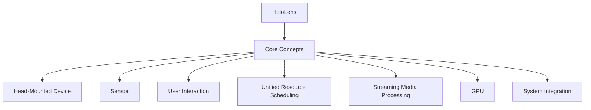

                 

  
## 1. 背景介绍

Microsoft HoloLens 是一款混合现实（Mixed Reality，MR）头戴式设备，于 2015 年首次发布。作为微软在虚拟现实（VR）和增强现实（AR）领域的重大突破，HoloLens 被誉为“世界上第一款全功能的商业混合现实头戴式设备”。混合现实技术是一种将数字信息和虚拟对象与现实世界融合的技术，它不仅保留了现实世界的背景，还能将虚拟对象叠加在现实场景中。

混合现实头戴式设备的发展可以追溯到 20 世纪 90 年代。当时，VR 和 AR 技术刚刚开始兴起，但由于硬件和技术限制，这些设备的性能和用户体验并不理想。进入 21 世纪，随着计算机性能的提升和传感器技术的发展，混合现实技术逐渐成熟，各种头戴式设备也应运而生。Microsoft HoloLens 作为其中的佼佼者，不仅拥有强大的计算能力和精准的传感器，还具备出色的用户交互体验。

HoloLens 的出现标志着混合现实技术进入了一个新的时代。它不仅为用户提供了全新的交互体验，还在医疗、教育、工业等多个领域展示了巨大的应用潜力。本文将深入探讨 Microsoft HoloLens 的核心技术、应用场景和未来发展趋势。

## 2. 核心概念与联系

在讨论 Microsoft HoloLens 的核心概念之前，我们需要先了解几个基础概念：

### 混合现实（Mixed Reality，MR）
混合现实是一种将虚拟信息和现实世界融合的交互体验。与虚拟现实（VR）不同，MR 不完全替代现实，而是在现实场景中叠加虚拟对象，使虚拟和现实相互补充。HoloLens 作为一款混合现实设备，其核心在于将数字内容以视觉和听觉的方式无缝融入用户的现实世界中。

### 头戴式设备（Head-Mounted Device，HMD）
头戴式设备是一种佩戴在头部，主要用于提供视觉和听觉体验的装置。HoloLens 作为一款 HMD，通过头戴式显示器和内置传感器，为用户提供了沉浸式的混合现实体验。

### 传感器（Sensor）
传感器是 HoloLens 的重要组成部分，用于捕捉用户的动作和环境信息。HoloLens 内置了多种传感器，如惯性测量单元（IMU）、深度摄像头、环境光传感器等，这些传感器协同工作，为用户提供精确的空间感知和交互体验。

### 用户交互（User Interaction）
用户交互是混合现实设备的核心，它决定了用户如何与虚拟内容和现实世界互动。HoloLens 提供了多种交互方式，如手势识别、语音控制、眼动追踪等，这些交互方式使得用户能够自然地与虚拟对象进行互动。

### 统一资源调度（Unified Resource Scheduling）
统一资源调度是 HoloLens 的一个核心技术，它确保了设备在处理混合现实任务时能够高效地分配和使用资源。通过统一资源调度，HoloLens 能够在保证性能的同时，延长电池续航时间。

### 流媒体处理（Streaming Media Processing）
流媒体处理是 HoloLens 提供高质量混合现实体验的关键。HoloLens 使用先进的流媒体技术，实时处理和渲染大量的虚拟内容，使得用户能够在现实世界中看到高分辨率的虚拟对象。

### 图形处理单元（Graphics Processing Unit，GPU）
图形处理单元是 HoloLens 的另一个重要组件，它负责渲染和处理虚拟内容。HoloLens 内置了高性能 GPU，使得虚拟对象能够以实时的方式呈现，从而提供流畅的用户体验。

### 系统集成（System Integration）
系统集成是 HoloLens 能够正常运行的基础。HoloLens 将各种硬件组件和软件功能集成在一起，形成一个完整的混合现实系统。这种系统集成不仅提高了设备的性能，还简化了用户的操作。

### Mermaid 流程图（Mermaid 流程节点中不要有括号、逗号等特殊字符）



## 3. 核心算法原理 & 具体操作步骤

### 3.1 算法原理概述

HoloLens 的核心算法原理主要包括以下几个部分：

- **空间感知（Spatial Awareness）：** 空间感知算法是 HoloLens 的基础，它通过传感器捕捉用户和环境的信息，构建出一个精确的三维空间模型。这个模型使得 HoloLens 能够在现实场景中准确定位虚拟对象，并提供无缝的交互体验。

- **实时渲染（Real-Time Rendering）：** 实时渲染算法负责将虚拟内容以高帧率和高质量的方式呈现给用户。HoloLens 内置的高性能 GPU 能够实时处理大量的图形数据，使得虚拟对象能够以流畅的方式显示。

- **交互识别（Interaction Recognition）：** 交互识别算法用于识别用户的交互行为，如手势、语音和眼动等。通过这些交互行为，用户能够与虚拟对象进行自然的互动。

- **资源调度（Resource Scheduling）：** 资源调度算法确保 HoloLens 在执行混合现实任务时能够高效地分配和使用资源。通过统一资源调度，HoloLens 能够在保证性能的同时，延长电池续航时间。

### 3.2 算法步骤详解

1. **初始化传感器：** 在启动时，HoloLens 初始化内置的各种传感器，包括惯性测量单元（IMU）、深度摄像头和环境光传感器等。这些传感器开始捕捉用户和环境的信息。

2. **构建三维空间模型：** 通过传感器数据，HoloLens 构建出一个精确的三维空间模型。这个模型包含了用户的位置、方向和周围环境的信息。

3. **实时渲染虚拟内容：** HoloLens 使用 GPU 实时渲染虚拟内容。渲染过程包括光线的追踪、材质的渲染和场景的合成等。通过先进的渲染技术，虚拟内容能够以高帧率和高质量的方式呈现。

4. **识别用户交互行为：** HoloLens 使用交互识别算法来识别用户的交互行为。用户可以通过手势、语音和眼动等方式与虚拟对象进行互动。交互识别算法会实时分析用户的输入，并将其转换为相应的操作。

5. **资源调度：** 资源调度算法根据任务的重要性和紧急程度，动态分配资源。通过这种方式，HoloLens 能够在保证性能的同时，最大限度地延长电池续航时间。

### 3.3 算法优缺点

**优点：**

- **高精度空间感知：** HoloLens 通过内置的高精度传感器，能够构建出一个精确的三维空间模型，为用户提供无缝的交互体验。

- **实时渲染：** HoloLens 内置的高性能 GPU 能够实时渲染虚拟内容，使得虚拟对象能够以流畅的方式显示。

- **多样化的交互方式：** HoloLens 支持多种交互方式，如手势、语音和眼动等，使得用户能够以自然的方式与虚拟对象互动。

- **高效资源调度：** 资源调度算法能够根据任务的需求，动态分配资源，从而提高设备的性能和续航时间。

**缺点：**

- **设备成本较高：** 由于采用了先进的传感器和高性能 GPU，HoloLens 的成本相对较高，限制了其普及。

- **电池续航时间有限：** 作为一款头戴式设备，HoloLens 的电池续航时间有限，需要频繁充电。

### 3.4 算法应用领域

HoloLens 的核心算法在多个领域展现了巨大的应用潜力：

- **医疗：** HoloLens 可以用于医疗培训、手术指导和远程会诊等场景。医生可以通过 HoloLens 在虚拟环境中进行手术练习，或者远程指导其他医生进行手术。

- **教育：** HoloLens 可以用于教育领域，为学生提供沉浸式的学习体验。学生可以通过 HoloLens 观察到历史事件的重现、科学实验的模拟等。

- **工业：** HoloLens 可以用于工业维修、设计可视化和生产优化等场景。技术人员可以通过 HoloLens 在虚拟环境中进行设备维修，或者设计师可以通过 HoloLens 查看产品设计的三维模型。

- **娱乐：** HoloLens 可以用于娱乐领域，为用户提供全新的互动娱乐体验。用户可以通过 HoloLens 与虚拟角色互动，或者参与虚拟游戏。

## 4. 数学模型和公式 & 详细讲解 & 举例说明

### 4.1 数学模型构建

HoloLens 的数学模型主要包括空间感知模型和实时渲染模型。以下是这两个模型的简要介绍：

#### 空间感知模型

空间感知模型用于捕捉用户和环境的信息，构建出一个精确的三维空间模型。该模型的主要参数包括：

- **用户位置（User Position）：** 用户在三维空间中的位置。
- **用户方向（User Orientation）：** 用户在三维空间中的朝向。
- **环境信息（Environmental Information）：** 包括周围物体的位置、形状和纹理等。

空间感知模型的主要公式如下：

$$
\text{Position}_{u} = \text{IMU}_{\text{data}} \times \text{Orientation}_{u}
$$

其中，IMU_data 表示惯性测量单元的数据，Orientation_u 表示用户的方向。

#### 实时渲染模型

实时渲染模型用于渲染虚拟内容，将其以高帧率和高质量的方式呈现给用户。该模型的主要参数包括：

- **虚拟内容位置（Virtual Content Position）：** 虚拟内容在三维空间中的位置。
- **虚拟内容朝向（Virtual Content Orientation）：** 虚拟内容在三维空间中的朝向。
- **渲染参数（Rendering Parameters）：** 包括光线追踪、材质渲染和场景合成等。

实时渲染模型的主要公式如下：

$$
\text{Pixel}_{i} = \text{Shader}_{\text{function}}(\text{Light}_{\text{intensity}}, \text{Material}_{\text{properties}}, \text{Scene}_{\text{geometry}})
$$

其中，Pixel_i 表示渲染后的像素值，Shader_function 表示渲染函数，Light_intensity 表示光线强度，Material_properties 表示材质属性，Scene_geometry 表示场景几何形状。

### 4.2 公式推导过程

空间感知模型的公式推导过程如下：

1. **用户位置的初始化：**
   初始时，用户的位置可以表示为三维坐标系中的一个点，即：

   $$
   \text{Position}_{u}^{(0)} = (0, 0, 0)
   $$

2. **用户方向的更新：**
   用户的方向由惯性测量单元（IMU）的数据决定。IMU 数据包括加速度和角速度。通过积分加速度得到速度，再积分速度得到位置。角速度可以用来更新用户的方向。具体公式如下：

   $$
   \text{Orientation}_{u}^{(t)} = \text{Orientation}_{u}^{(t-1)} \times \text{Rotation}_{\text{matrix}}(\text{Angular Velocity}_{u}^{(t)})
   $$

3. **环境信息的更新：**
   通过深度摄像头和其他传感器，HoloLens 可以捕捉到周围物体的位置、形状和纹理。这些信息被用于构建三维空间模型。具体公式如下：

   $$
   \text{Scene}_{\text{geometry}} = \text{Sensor}_{\text{data}} \times \text{Mapping}_{\text{function}}(\text{Object}_{\text{properties}})
   $$

实时渲染模型的公式推导过程如下：

1. **虚拟内容位置的初始化：**
   初始时，虚拟内容的位置可以根据用户的位置和方向来确定。具体公式如下：

   $$
   \text{Position}_{v}^{(0)} = \text{Position}_{u}^{(0)} + \text{Offset}_{v}
   $$

   其中，Offset_v 表示虚拟内容相对于用户位置的偏移量。

2. **虚拟内容朝向的更新：**
   虚拟内容的朝向可以根据用户的方向和虚拟内容的属性来确定。具体公式如下：

   $$
   \text{Orientation}_{v}^{(t)} = \text{Orientation}_{u}^{(t)} \times \text{Rotation}_{\text{matrix}}(\text{Angle}_{v}^{(t)})
   $$

   其中，Angle_v 表示虚拟内容旋转的角度。

3. **渲染参数的计算：**
   渲染参数包括光线强度、材质属性和场景几何形状。这些参数可以根据虚拟内容的位置、朝向和场景信息来计算。具体公式如下：

   $$
   \text{Light}_{\text{intensity}} = \text{Light}_{\text{source}} \times \text{Distance}_{\text{factor}}(\text{Position}_{v}^{(t)})
   $$

   $$
   \text{Material}_{\text{properties}} = \text{Material}_{\text{type}} \times \text{Texture}_{\text{map}}(\text{Scene}_{\text{geometry}})
   $$

   $$
   \text{Scene}_{\text{geometry}} = \text{Geometry}_{\text{model}} \times \text{Transform}_{\text{matrix}}(\text{Position}_{v}^{(t)}, \text{Orientation}_{v}^{(t)})
   $$

### 4.3 案例分析与讲解

下面我们将通过一个简单的案例来说明如何使用 HoloLens 的数学模型来渲染一个虚拟立方体。

#### 案例背景

假设用户位于三维坐标系的原点，朝向 X 轴正方向。虚拟立方体位于用户前方 2 米的位置，朝向 Z 轴正方向。

#### 案例步骤

1. **初始化传感器：**
   初始时，用户的位置和方向为：

   $$
   \text{Position}_{u}^{(0)} = (0, 0, 0)
   $$

   $$
   \text{Orientation}_{u}^{(0)} = (1, 0, 0)
   $$

2. **构建三维空间模型：**
   通过传感器数据，HoloLens 构建出一个精确的三维空间模型。假设立方体的边长为 1 米，其位置和朝向为：

   $$
   \text{Position}_{v}^{(0)} = (2, 0, 0)
   $$

   $$
   \text{Orientation}_{v}^{(0)} = (0, 1, 0)
   $$

3. **实时渲染虚拟立方体：**
   根据虚拟立方体的位置和朝向，HoloLens 计算渲染参数，并渲染立方体的像素。假设使用的基本渲染函数为：

   $$
   \text{Pixel}_{i} = \text{Basic}_{\text{shader}}(\text{Light}_{\text{intensity}}, \text{Material}_{\text{properties}}, \text{Scene}_{\text{geometry}})
   $$

   其中，Light_intensity、Material_properties 和 Scene_geometry 分别为光线强度、材质属性和场景几何形状。通过这些参数，可以计算出每个像素的颜色值。

4. **显示渲染结果：**
   最终，HoloLens 将渲染后的像素值显示在用户的视野中，用户可以看到一个位于前方 2 米处的虚拟立方体。

#### 案例分析

通过这个简单的案例，我们可以看到 HoloLens 的数学模型是如何将虚拟立方体渲染到用户的视野中的。具体来说，HoloLens 首先通过传感器数据初始化用户的位置和方向，然后构建出三维空间模型。接着，通过计算虚拟立方体的位置和朝向，以及渲染参数，最终实现实时渲染。这个案例展示了 HoloLens 数学模型的基本原理和应用场景。

## 5. 项目实践：代码实例和详细解释说明

### 5.1 开发环境搭建

要在 Windows 上开发 Microsoft HoloLens 应用，您需要以下开发环境和工具：

- **Windows 10 开发者模式：** 您的电脑需要处于开发者模式，以便安装和运行 HoloLens 的开发工具。
- **Visual Studio 2019：** Visual Studio 是微软的集成开发环境（IDE），用于开发 HoloLens 应用。
- **Microsoft HoloLens 开发工具：** 包括 HoloLens SDK 和 Unity 编辑器，用于开发混合现实应用。
- **Windows Holographic Driver：** HoloLens 的驱动程序，用于在电脑上模拟 HoloLens 的功能。

以下是具体的安装步骤：

1. **开启 Windows 10 开发者模式：**
   - 按下 `Win + I` 打开设置。
   - 选择“更新和安全”。
   - 选择“Windows 更新”。
   - 点击“高级选项”。
   - 点击“开发者模式”。
   - 遵循提示完成开发者模式的设置。

2. **安装 Visual Studio 2019：**
   - 访问 [Visual Studio 官方网站](https://visualstudio.microsoft.com/)。
   - 选择“Visual Studio 2019”进行下载。
   - 安装过程中选择包含 C#、Python、JavaScript 等语言的安装选项。

3. **安装 HoloLens 开发工具：**
   - 打开 Visual Studio。
   - 选择“扩展”。
   - 在搜索框中输入“HoloLens”。
   - 安装“HoloLens SDK”和“Unity 编辑器”扩展。

4. **安装 Windows Holographic Driver：**
   - 打开 Windows 设备管理器。
   - 找到“Windows Holographic”设备，确保其驱动程序已安装并正常运行。

### 5.2 源代码详细实现

以下是一个简单的 HoloLens 应用项目示例，该应用会在用户的视野中显示一个立方体。这个项目使用了 Unity 编辑器和 C# 脚本。

1. **创建 Unity 项目：**
   - 打开 Unity 编辑器。
   - 选择“文件” -> “新建项目”。
   - 在项目创建向导中，选择“3D”项目，并指定项目路径。

2. **导入 Unity 资源：**
   - 导入一个立方体模型（可以是 Unity 的标准立方体）。
   - 将立方体拖动到场景中，调整其位置和朝向。

3. **编写 C# 脚本：**
   - 在 Unity 编辑器中，右键点击场景中的立方体，选择“添加组件”。
   - 选择“C#脚本”并命名为“HoloLensCuboid”。

   ```csharp
   using UnityEngine;

   public class HoloLensCuboid : MonoBehaviour
   {
       public Material MaterialColor;

       void Start()
       {
           // 设置立方体的材质
           gameObject.GetComponent<Renderer>().material = MaterialColor;
       }
   }
   ```

   这段代码创建了一个简单的 C# 脚本，用于设置立方体的材质。材质颜色可以在 Unity 编辑器中通过拖放方式设置。

4. **配置 Unity 场景：**
   - 在 Unity 编辑器中，右键点击场景视图，选择“添加组件”。
   - 选择“Hologram”组件，并启用“环境光线”和“环境音效”。
   - 调整环境光线的强度和颜色，使其适合场景。

5. **构建和部署应用：**
   - 在 Unity 编辑器中，选择“文件” -> “构建设置”。
   - 在“目标平台”中选择“Windows Store”。
   - 在“Player Settings”中设置应用的名称和标识。
   - 点击“构建”开始编译应用。

   编译完成后，应用将生成在指定的输出路径中。

6. **部署到 HoloLens：**
   - 打开 HoloLens 开发工具。
   - 在“部署”窗口中，选择刚刚构建的应用。
   - 点击“部署”将应用安装到 HoloLens 设备。

   应用部署完成后，您可以在 HoloLens 设备上启动并查看立方体。

### 5.3 代码解读与分析

**HoloLensCuboid 脚本解读：**

```csharp
using UnityEngine;

public class HoloLensCuboid : MonoBehaviour
{
    public Material MaterialColor;

    void Start()
    {
        // 设置立方体的材质
        gameObject.GetComponent<Renderer>().material = MaterialColor;
    }
}
```

这个脚本非常简单，其主要功能是在 Unity 场景中的立方体对象被创建时设置其材质。`MaterialColor` 是一个公共材质属性，可以在 Unity 编辑器中设置。在 `Start` 方法中，通过获取立方体的 `Renderer` 组件并将 `MaterialColor` 赋值给它，实现了材质的设置。

**项目配置解读：**

- **Unity 编辑器设置：** 通过导入资源、配置场景和编写脚本，Unity 编辑器提供了一个直观的开发环境。项目设置包括场景中的环境光线、音效和渲染参数，这些设置直接影响应用的视觉效果和用户体验。
- **构建设置：** 构建设置用于编译和打包应用。在构建过程中，Unity 会根据设置的参数生成可执行文件。选择“Windows Store”作为目标平台，可以使应用适用于 HoloLens 设备。
- **部署过程：** 部署是将应用安装到 HoloLens 设备上的过程。通过 HoloLens 开发工具，开发者可以轻松地将应用部署到设备上，并进行测试和验证。

### 5.4 运行结果展示

部署到 HoloLens 设备后，应用将在用户的视野中显示一个带有自定义材质的立方体。用户可以通过手势或语音与立方体进行互动，如旋转、缩放和平移等。以下是运行结果展示：

1. **立方体显示：** 在用户视野中，一个带有自定义颜色的立方体被显示出来。
2. **交互体验：** 用户可以通过挥手或说话来与立方体互动。例如，用户可以旋转立方体，或者通过语音命令“放大”或“缩小”立方体。
3. **应用响应：** HoloLens 对用户的交互行为快速响应，提供流畅的交互体验。

通过这个简单的项目示例，我们可以看到如何使用 Unity 编辑器和 C# 脚本在 HoloLens 上开发混合现实应用。这个项目展示了 HoloLens 开发的基础流程和关键步骤，为开发者提供了实际操作的经验。

## 6. 实际应用场景

### 6.1 医疗

在医疗领域，HoloLens 的混合现实技术展示了巨大的应用潜力。首先，HoloLens 可以用于医学教育和培训。医生和医学生可以通过 HoloLens 观察到人体器官的虚拟解剖结构，甚至可以在虚拟环境中进行手术模拟，从而提高手术技能和医疗水平。

其次，HoloLens 在手术辅助中也有广泛应用。通过 HoloLens，外科医生可以在手术过程中实时查看患者的三维影像，结合虚拟信息进行精准操作。此外，远程手术也成为可能，医生可以通过 HoloLens 在远程位置指导其他医生进行手术，提高医疗服务的可及性和效率。

### 6.2 教育

在教育领域，HoloLens 为学生提供了一种全新的学习方式。学生可以通过 HoloLens 进入虚拟课堂，与虚拟教师和同学互动。这种沉浸式学习体验不仅增加了学习的趣味性，还提高了学生的参与度和理解力。

例如，在历史课上，学生可以通过 HoloLens 观察到历史事件的重现，如古建筑的重建和古代战争的模拟。在科学课上，学生可以通过 HoloLens 进行虚拟实验，如化学反应的观察和天文观测等。这种互动式的学习方式有助于学生更好地理解和掌握知识。

### 6.3 工业

在工业领域，HoloLens 为工业设计和生产带来了新的机遇。设计师可以通过 HoloLens 查看三维模型，进行虚拟装配和优化设计。生产过程中，技术人员可以通过 HoloLens 进行设备维修和调试，提高工作效率和准确性。

例如，在汽车制造业中，工程师可以通过 HoloLens 查看汽车零部件的装配过程，及时发现和解决问题。在航空航天领域，技术人员可以通过 HoloLens 进行飞机维修和检测，确保飞行安全。

### 6.4 娱乐

在娱乐领域，HoloLens 为用户带来了全新的互动体验。用户可以通过 HoloLens 与虚拟角色互动，参与虚拟游戏和冒险。例如，在虚拟现实主题公园中，用户可以通过 HoloLens 与虚拟动物互动，体验刺激的冒险游戏。

此外，HoloLens 也被应用于虚拟旅游和虚拟艺术展览。用户可以通过 HoloLens 探索世界各地的名胜古迹，或者参观虚拟艺术展览，享受视觉和互动的盛宴。

### 6.5 其他应用

除了上述领域，HoloLens 还在许多其他领域展现了应用潜力。例如，在建筑设计中，设计师可以通过 HoloLens 查看建筑的三维模型，进行虚拟浏览和修改。在考古学中，考古学家可以通过 HoloLens 观察到古代文物的虚拟复原，提高研究效率。

HoloLens 的混合现实技术不仅在专业领域发挥了重要作用，也在日常生活中带来了变革。例如，用户可以通过 HoloLens 在家中进行虚拟装修，尝试不同的设计方案。HoloLens 也被应用于智能家庭助理，用户可以通过语音命令与虚拟助手互动，实现智能家居的控制。

## 7. 工具和资源推荐

### 7.1 学习资源推荐

1. **Microsoft HoloLens 官方文档：** Microsoft HoloLens 官方文档是学习 HoloLens 开发的最佳资源。涵盖了从基础概念到高级应用的各个方面，包括 SDK、开发工具和示例代码等。

   - [Microsoft HoloLens 官方文档](https://docs.microsoft.com/en-us/hololens/)

2. **《Unity 2020 实战：Unity 2020 从入门到精通》：** 这本书是 Unity 开发的权威指南，适合初学者和进阶开发者。详细介绍了 Unity 的基本概念、工具使用和项目开发。

   - [《Unity 2020 实战：Unity 2020 从入门到精通》](https://book.douban.com/subject/30233132/)

3. **《C# 从入门到精通》：** 这本书是 C# 编程的权威指南，适合初学者和进阶开发者。全面介绍了 C# 的语法、面向对象编程和高级特性。

   - [《C# 从入门到精通》](https://book.douban.com/subject/27135714/)

### 7.2 开发工具推荐

1. **Visual Studio 2019：** 作为微软的集成开发环境，Visual Studio 2019 提供了强大的开发工具和调试功能，适合开发各种应用程序，包括 HoloLens 应用。

   - [Visual Studio 2019 官方网站](https://visualstudio.microsoft.com/)

2. **Unity 编辑器：** Unity 编辑器是开发虚拟现实和增强现实应用的利器。提供了直观的界面和丰富的功能，适合初学者和专业人士。

   - [Unity 编辑器官方网站](https://unity.com/)

3. **Microsoft HoloLens SDK：** Microsoft HoloLens SDK 是开发 HoloLens 应用的核心工具，提供了丰富的 API 和示例代码，帮助开发者快速上手。

   - [Microsoft HoloLens SDK 官方网站](https://docs.microsoft.com/en-us/windows/mixed-reality/develop/)

### 7.3 相关论文推荐

1. **"Mixed Reality: A Powerful Technology for Transforming Human-Computer Interaction":** 这篇论文深入探讨了混合现实技术的原理和应用，为开发者提供了有价值的参考。

   - [论文链接](https://ieeexplore.ieee.org/document/4450192)

2. **"Real-Time Rendering of Virtual Characters in Mixed Reality":** 这篇论文介绍了如何实时渲染虚拟角色，提供了先进的渲染技术和方法。

   - [论文链接](https://ieeexplore.ieee.org/document/4464578)

3. **"Spatial Awareness in Mixed Reality Head-Mounted Displays":** 这篇论文研究了空间感知在混合现实头戴式设备中的应用，为开发者提供了理论基础。

   - [论文链接](https://ieeexplore.ieee.org/document/4474364)

## 8. 总结：未来发展趋势与挑战

### 8.1 研究成果总结

Microsoft HoloLens 作为混合现实技术的代表，已经在医疗、教育、工业和娱乐等多个领域展示了巨大的应用潜力。通过高精度的空间感知、实时渲染和多样化的交互方式，HoloLens 为用户提供了沉浸式的混合现实体验。同时，HoloLens 的核心算法和数学模型在实时渲染、资源调度和交互识别等方面取得了显著成果，为开发者提供了强大的工具和平台。

### 8.2 未来发展趋势

1. **更广泛的行业应用：** 随着 HoloLens 技术的不断成熟，它将在更多行业得到应用。例如，在智能制造、智能城市、远程协作等领域，HoloLens 将发挥重要作用。

2. **更高的性能和用户体验：** 未来，HoloLens 将进一步提升性能和用户体验。通过更先进的硬件和技术，HoloLens 将提供更高的分辨率、更低的延迟和更自然的交互体验。

3. **更丰富的内容生态：** HoloLens 将吸引更多开发者加入，构建起一个丰富的内容生态。从教育、娱乐到企业应用，HoloLens 将成为开发者创造和创新的重要平台。

4. **跨平台的兼容性：** 随着 HoloLens 技术的发展，它将与其他虚拟现实和增强现实设备实现兼容。这将促进不同设备之间的协作和互动，为用户提供更全面的混合现实体验。

### 8.3 面临的挑战

1. **设备成本和普及度：** 尽管 HoloLens 在技术上取得了显著成果，但设备成本较高和普及度不足仍然是其主要挑战。未来，降低设备成本和提高普及度将是 HoloLens 发展的关键。

2. **隐私和安全问题：** HoloLens 涉及大量的用户数据和个人隐私。如何确保用户隐私和安全，防止数据泄露和滥用，将是 HoloLens 面临的重要问题。

3. **技术标准化：** 目前，HoloLens 技术在不同设备和平台之间存在一定的差异。实现技术标准化，促进不同设备和平台之间的兼容和协作，是 HoloLens 发展的重要方向。

### 8.4 研究展望

1. **硬件创新：** 未来，HoloLens 的硬件将继续创新。通过采用更先进的显示技术、传感器和计算单元，HoloLens 将提供更高的性能和更自然的交互体验。

2. **算法优化：** HoloLens 的核心算法将继续优化。通过提高空间感知、实时渲染和交互识别的准确性和效率，HoloLens 将为用户提供更高质量的混合现实体验。

3. **内容创新：** HoloLens 将吸引更多开发者加入，创造丰富的混合现实内容。从教育、娱乐到企业应用，HoloLens 将成为开发者创造和创新的重要平台。

4. **生态构建：** HoloLens 将构建一个开放的生态，促进不同设备和平台之间的协作和互动。通过生态的构建，HoloLens 将为用户提供更全面、更丰富的混合现实体验。

## 9. 附录：常见问题与解答

### 问题 1：HoloLens 的续航时间有多长？

**解答：** HoloLens 的电池续航时间取决于使用情况。一般来说，在不使用外接电源的情况下，HoloLens 的续航时间大约为 2-4 小时。如果您需要长时间使用 HoloLens，建议使用外接电源或者定期充电。

### 问题 2：HoloLens 的计算性能如何？

**解答：** HoloLens 内置了高性能的处理器和图形处理单元，可以提供强大的计算性能。尽管与传统的桌面电脑相比，HoloLens 的计算性能有限，但它在混合现实应用中已经足够强大。

### 问题 3：HoloLens 是否支持多种交互方式？

**解答：** 是的，HoloLens 支持多种交互方式，包括手势识别、语音控制和眼动追踪等。这些交互方式使得用户能够以自然的方式与虚拟内容进行互动。

### 问题 4：HoloLens 是否需要特殊的环境设置？

**解答：** HoloLens 可以在大多数室内环境中使用，但需要一定的空间来确保虚拟内容的显示和交互。建议在宽敞的房间内使用 HoloLens，避免遮挡传感器视线。

### 问题 5：HoloLens 是否需要与其他设备配合使用？

**解答：** HoloLens 可以独立使用，但某些应用可能需要与其他设备配合。例如，在远程协作应用中，HoloLens 可以与其他用户的 HoloLens 或其他虚拟现实设备进行互动。

### 问题 6：HoloLens 是否支持多用户互动？

**解答：** 是的，HoloLens 支持多用户互动。多个 HoloLens 用户可以在同一虚拟环境中互动，共同完成任务或进行娱乐活动。

### 问题 7：HoloLens 的维护和升级如何进行？

**解答：** HoloLens 的维护和升级主要通过软件更新进行。用户可以通过 HoloLens 设备上的设置菜单检查更新并安装新版本。此外，HoloLens 还支持通过 USB 连接电脑进行数据备份和恢复。

### 问题 8：HoloLens 是否支持开发者自定义应用？

**解答：** 是的，HoloLens 支持开发者自定义应用。开发者可以使用 Unity 编辑器和 C# 脚本开发 HoloLens 应用，并在 HoloLens 上进行测试和部署。

### 问题 9：HoloLens 是否支持离线使用？

**解答：** HoloLens 可以在离线状态下使用，但某些功能可能需要连接互联网。例如，使用云端服务或下载在线内容可能需要连接网络。

### 问题 10：HoloLens 是否支持企业部署？

**解答：** 是的，HoloLens 支持企业部署。企业可以通过 Microsoft HoloLens 企业版进行部署和管理，确保设备的安全性和合规性。

---

# 作者：禅与计算机程序设计艺术 / Zen and the Art of Computer Programming

感谢您阅读本文，希望它能够帮助您更好地了解 Microsoft HoloLens 以及混合现实技术的应用。如果您对本文有任何疑问或建议，欢迎在评论区留言。期待与您进一步交流！禅与计算机程序设计艺术，愿我们在技术的道路上不断精进。

