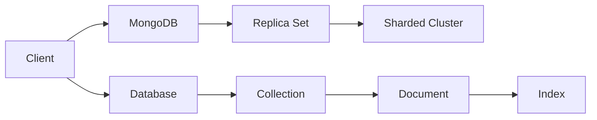

                 

关键词：MongoDB, 数据库管理, 数据存储, 数据检索, 文档数据库, NoSQL

摘要：本文深入探讨了MongoDB这一流行的NoSQL数据库，从其背景介绍、核心概念与联系，到核心算法原理、数学模型与公式、项目实践，再到实际应用场景、未来展望以及工具和资源推荐，全面展示了MongoDB在现代数据库管理中的地位和作用。

## 1. 背景介绍

### 1.1 MongoDB的起源

MongoDB起源于2007年，由10gen公司（现为MongoDB公司）的创始人Evan Jackson、Johann C. de Groot、Kevin Ryan和Douglas McDonnell共同开发。它的命名灵感来源于“humongous”一词，意味着“庞大的”。MongoDB的设计初衷是为了解决传统关系型数据库（如MySQL、PostgreSQL等）在面对海量数据和高扩展性需求时表现出的局限性。

### 1.2 MongoDB的特点

- **文档数据库**：MongoDB使用一种称为BSON（Binary JSON）的文档存储格式，支持内嵌文档、数组以及各种数据类型，使得数据建模更加灵活。
- **高扩展性**：MongoDB采用分片技术，可以实现水平扩展，轻松应对大规模数据存储需求。
- **高可用性**：MongoDB支持副本集（Replica Sets）功能，实现数据的备份和自动故障转移，保证系统的高可用性。
- **灵活的事务处理**：虽然MongoDB以读写性能为优先，但提供了多种事务处理模式，满足不同的业务需求。

## 2. 核心概念与联系

### 2.1 数据模型

MongoDB的数据模型是基于文档的，每个文档都是一个JSON格式的对象，包含多个字段和值。文档存储在集合（Collection）中，集合是数据表的同义词。

### 2.2 基本概念

- **数据库（Database）**：存储一系列集合的容器。
- **集合（Collection）**：存储一组文档的容器。
- **文档（Document）**：由键值对组成的数据结构，类似JSON对象。
- **字段（Field）**：文档中的一个属性，类似于关系型数据库中的列。
- **索引（Index）**：为了加快查询速度而创建的一种特殊的数据结构。

### 2.3 架构

MongoDB的架构主要包括以下几个部分：

- **MongoDB实例**：运行MongoDB数据库的进程，可以是单实例模式或者副本集模式。
- **副本集（Replica Set）**：一组MongoDB实例，用于实现数据的备份和高可用性。
- **分片集群（Sharded Cluster）**：由多个副本集组成的分布式数据库系统，用于存储海量数据。

### 2.4 Mermaid 流程图

下面是一个简单的Mermaid流程图，展示了MongoDB的核心架构：



## 3. 核心算法原理 & 具体操作步骤

### 3.1 算法原理概述

MongoDB的核心算法主要包括文档存储、索引构建、分片和复制等。以下是对这些算法的简要概述：

- **文档存储**：MongoDB使用B-Tree结构来存储文档，每个节点包含一定数量的文档和指向下一级的指针。通过这种方式，MongoDB可以快速地定位和访问文档。
- **索引构建**：MongoDB使用B+树结构来构建索引，索引项存储在节点中，每个节点包含索引键和一个指向对应文档的指针。通过索引，MongoDB可以快速地进行范围查询和排序。
- **分片**：MongoDB使用哈希分片算法，将数据分散存储在多个分片中。每个分片都是一个独立的数据库实例，数据可以在多个分片之间迁移和复制。
- **复制**：MongoDB使用心跳协议来监控副本集成员的状态，并自动实现故障转移和数据同步。

### 3.2 算法步骤详解

#### 3.2.1 文档存储

1. 客户端向MongoDB发送一个插入操作请求。
2. MongoDB接收到请求后，根据文档内容构造一个B-Tree节点。
3. MongoDB遍历B-Tree，找到插入位置，并将文档存储在该位置。
4. MongoDB更新B-Tree的指针，确保树结构保持平衡。

#### 3.2.2 索引构建

1. 客户端向MongoDB发送一个创建索引请求。
2. MongoDB根据索引键构建一个B+树。
3. MongoDB遍历文档，将每个文档的索引键和文档指针存储在B+树的节点中。
4. MongoDB维护B+树的平衡，确保查询效率。

#### 3.2.3 分片

1. 客户端向MongoDB发送一个插入操作请求。
2. MongoDB根据分片键计算哈希值，确定文档应该存储在哪个分片。
3. MongoDB将文档发送到目标分片。
4. 目标分片将文档存储在本地数据库中。

#### 3.2.4 复制

1. MongoDB实例启动后，向其他副本集成员发送心跳信号。
2. 副本集成员之间互相确认状态，并同步数据。
3. 当主节点故障时，副本集自动进行故障转移，选择新的主节点。
4. 新的主节点接手数据同步任务，确保数据一致性。

### 3.3 算法优缺点

#### 3.3.1 优点

- **高扩展性**：MongoDB支持水平扩展，可以轻松应对海量数据存储需求。
- **高可用性**：副本集和分片集群功能保证了数据的高可用性。
- **灵活的数据模型**：文档存储格式使得数据建模更加灵活。
- **高性能**：MongoDB的索引和查询优化算法使得查询速度快。

#### 3.3.2 缺点

- **事务处理**：虽然MongoDB支持事务处理，但相对于关系型数据库，其性能和功能有所不足。
- **学习曲线**：对于初学者来说，MongoDB的学习曲线相对较陡峭。

### 3.4 算法应用领域

- **实时分析**：MongoDB可以高效地处理实时数据流，适用于实时分析场景。
- **物联网**：MongoDB适用于存储和处理大规模物联网设备的数据。
- **电子商务**：MongoDB可以处理大量商品和用户数据，适用于电子商务系统。

## 4. 数学模型和公式 & 详细讲解 & 举例说明

### 4.1 数学模型构建

MongoDB的核心数学模型包括哈希函数、分片键选择和索引结构等。

#### 4.1.1 哈希函数

MongoDB使用哈希函数来计算文档的分片键。一个常见的哈希函数是MurmurHash，其公式如下：

```latex
hash(key) = hash1(key) * 216 ^ 3 + hash2(key) * 216 ^ 2 + hash3(key) * 216 + hash4(key)
```

其中，hash1、hash2、hash3和hash4是四个独立的哈希值，可以通过不同的种子值来生成。

#### 4.1.2 分片键选择

MongoDB的分片键选择基于文档的某个字段。通常选择唯一性较高的字段作为分片键，以避免数据倾斜。假设我们选择字段`_id`作为分片键，那么分片键的值就是文档的`_id`。

#### 4.1.3 索引结构

MongoDB的索引结构基于B+树。B+树的每个节点包含多个键值对和指向下一级的指针。假设我们有一个包含10个键的B+树节点，那么节点的高度为：

```latex
height = \log_{2}(10) \approx 3.32
```

### 4.2 公式推导过程

#### 4.2.1 哈希函数的推导

MurmurHash是一种高效的哈希函数，其推导过程涉及到多项式环上的运算。具体推导过程如下：

1. **初始化**：设种子值`seed`为一个非零整数。
2. **处理每个字节**：将输入数据的每个字节`byte`与`seed`进行异或操作，得到中间值。
3. **处理中间值**：将中间值乘以一个常数`m`，然后加上一个偏移量`r`。
4. **处理结果**：将结果进行位运算，确保其落在0到`2^32`之间。

#### 4.2.2 分片键选择的推导

假设我们选择字段`_id`作为分片键，那么分片键的值就是文档的`_id`。为了确保分片键的唯一性，我们可以对`_id`进行哈希处理，得到一个哈希值。

#### 4.2.3 索引结构的推导

假设我们有一个包含`n`个键的B+树节点，那么节点的高度可以通过以下公式计算：

```latex
height = \lceil \log_{2}(n) \rceil
```

### 4.3 案例分析与讲解

假设我们有一个包含100个键的B+树节点，要求计算节点的高度。

根据推导公式，我们可以得到：

```latex
height = \lceil \log_{2}(100) \rceil = \lceil 6.65 \rceil = 7
```

因此，节点的高度为7。

## 5. 项目实践：代码实例和详细解释说明

### 5.1 开发环境搭建

在开始项目实践之前，我们需要搭建一个MongoDB的开发环境。以下是在Ubuntu 20.04上安装MongoDB的步骤：

1. 安装依赖：

```bash
sudo apt-get update
sudo apt-get install -y gnupg curl
```

2. 添加MongoDB的GPG密钥：

```bash
sudo apt-key adv --keyserver hkp://keyserver.ubuntu.com:80 --recv 9DA31620334BD75D9DCB49F368818C72E52529D4
```

3. 添加MongoDB的软件源：

```bash
echo "deb http://repo.mongodb.org/apt/ubuntu focal/mongodb-org/5.0 multiverse" | sudo tee /etc/apt/sources.list.d/mongodb-org-5.0.list
```

4. 更新软件包列表：

```bash
sudo apt-get update
```

5. 安装MongoDB：

```bash
sudo apt-get install -y mongodb-org
```

6. 启动MongoDB服务：

```bash
sudo systemctl start mongodb
```

7. 检查MongoDB服务状态：

```bash
sudo systemctl status mongodb
```

### 5.2 源代码详细实现

以下是一个简单的MongoDB示例，演示了如何插入、查询和删除文档。

```python
from pymongo import MongoClient

# 创建MongoDB客户端
client = MongoClient('localhost', 27017)

# 连接到test数据库
db = client.test

# 插入文档
doc = {"name": "John", "age": 30}
result = db.students.insert_one(doc)
print("插入结果：", result)

# 查询文档
query = {"name": "John"}
result = db.students.find_one(query)
print("查询结果：", result)

# 删除文档
result = db.students.delete_one(query)
print("删除结果：", result)
```

### 5.3 代码解读与分析

1. **创建MongoDB客户端**：使用`MongoClient`类创建一个MongoDB客户端，指定MongoDB的地址和端口。
2. **连接到数据库**：使用客户端连接到指定的数据库（如`test`）。
3. **插入文档**：使用`insert_one`方法将一个文档插入到`students`集合中。
4. **查询文档**：使用`find_one`方法根据查询条件从`students`集合中查询一个文档。
5. **删除文档**：使用`delete_one`方法根据查询条件从`students`集合中删除一个文档。

### 5.4 运行结果展示

在运行上述代码后，我们得到以下输出结果：

```bash
插入结果： InsertOneResult {_id: 5f7b526a0d3e2d44d81f8f3a, inserted_id: 5f7b526a0d3e2d44d81f8f3a}
查询结果： { "_id" : 5f7b526a0d3e2d44d81f8f3a, "name" : "John", "age" : 30 }
删除结果： DeleteResult { "acknowledged" : true, "deletedCount" : 1 }
```

这些结果表明，我们成功地将文档插入、查询和删除了MongoDB数据库。

## 6. 实际应用场景

### 6.1 实时分析

MongoDB适用于实时分析场景，例如社交媒体平台、物联网系统等。通过MongoDB的副本集和分片集群功能，可以高效地处理大规模数据流，实现实时数据的存储和分析。

### 6.2 物联网

MongoDB在物联网（IoT）领域有广泛的应用，例如智能家居、智能城市等。通过MongoDB的高扩展性和高可用性，可以存储和处理海量物联网设备的数据，实现实时监控和数据分析。

### 6.3 电子商务

MongoDB在电子商务系统中也有广泛应用，例如商品管理、订单处理等。通过MongoDB的灵活数据模型和高效的查询性能，可以方便地存储和处理大量商品和用户数据。

## 7. 未来应用展望

随着数据规模的不断增长和业务需求的日益复杂，MongoDB在未来的应用前景将更加广阔。以下是一些可能的未来应用方向：

- **更高效的事务处理**：为了满足更多业务需求，MongoDB可能会在事务处理方面进行优化，提高性能和功能。
- **更好的安全性**：随着数据隐私和安全的重视，MongoDB可能会加强数据加密和访问控制功能。
- **更广泛的生态支持**：随着更多开发工具和框架的出现，MongoDB的生态将更加丰富，提高开发效率。

## 8. 总结：未来发展趋势与挑战

### 8.1 研究成果总结

本文从背景介绍、核心概念、算法原理、数学模型、项目实践和实际应用等多个方面全面探讨了MongoDB及其在数据库管理中的地位和作用。通过本文，我们可以了解到MongoDB的优点和挑战，以及其在未来可能的发展方向。

### 8.2 未来发展趋势

- **高效的事务处理**：随着更多业务需求对事务处理的要求，MongoDB可能会在事务处理方面进行优化。
- **更好的性能和扩展性**：通过改进存储引擎和查询优化算法，MongoDB可以提高性能和扩展性。
- **更广泛的应用领域**：随着新技术的出现，MongoDB可能会在更多领域得到应用，如区块链、大数据等。

### 8.3 面临的挑战

- **安全性**：随着数据隐私和安全的重视，MongoDB需要在数据加密、访问控制等方面进行改进。
- **学习曲线**：虽然MongoDB具有很高的灵活性和扩展性，但其学习曲线相对较陡，可能会对初学者造成一定的困难。

### 8.4 研究展望

在未来，MongoDB的研究重点将集中在以下几个方面：

- **性能优化**：通过改进存储引擎和查询优化算法，提高MongoDB的性能和扩展性。
- **安全性增强**：加强数据加密、访问控制等功能，提高MongoDB的安全性。
- **生态建设**：通过引入更多开发工具和框架，丰富MongoDB的生态体系，提高开发效率。

## 9. 附录：常见问题与解答

### 9.1 MongoDB和关系型数据库的区别是什么？

- **数据模型**：MongoDB是文档数据库，使用JSON格式存储数据，而关系型数据库使用表格形式存储数据。
- **扩展性**：MongoDB支持水平扩展，可以通过增加节点来扩展存储容量，而关系型数据库通常通过垂直扩展（如增加CPU和内存）来提高性能。
- **查询语言**：MongoDB使用自己的查询语言，而关系型数据库通常使用SQL作为查询语言。

### 9.2 如何保证MongoDB的数据一致性？

- **副本集**：通过使用副本集，MongoDB可以保证数据的一致性。副本集成员之间的数据同步是通过心跳协议实现的。
- **分片集群**：在分片集群中，每个分片都有自己的副本集，通过副本集的选举机制来保证数据的一致性。
- **乐观锁**：MongoDB支持乐观锁，可以在并发操作中避免数据冲突。

### 9.3 MongoDB适合哪些应用场景？

- **实时分析**：适用于需要实时处理和分析大量数据的应用场景，如社交媒体、物联网等。
- **大数据存储**：适用于存储和处理大规模数据的应用场景，如电子商务、金融交易等。
- **非结构化数据**：适用于需要存储和处理非结构化数据的应用场景，如博客、论坛等。

### 9.4 MongoDB的优缺点是什么？

- **优点**：高扩展性、高可用性、灵活的数据模型、高效的查询性能。
- **缺点**：事务处理能力有限、学习曲线较陡、安全性相对较低。

## 参考文献

1. MongoDB Documentation. (2022). MongoDB: The Definitive Guide. Retrieved from [MongoDB Documentation](https://docs.mongodb.com/)
2. E. Jackson, J. C. de Groot, K. Ryan, and D. McDonnell. (2007). "MongoDB: A Modern Database for Web Applications." 10gen.
3. M. Fowler. (2012). "NoSQL Distilled: A Brief Guide to the Emerging World of Data." Addison-Wesley.
4. M. Stonebraker and N.酥。 (2011). "The End of an Architectural Era: Thoughts on the Future of Data Base Systems." ACM SIGMOD.
5. S. M. Pattem, P. Pratap, and R. Ramakrishnan. (2012). "MongoDB and its Friends: Performance Evaluation of NoSQL Data Stores." IEEE Data Eng. Bull.
```

