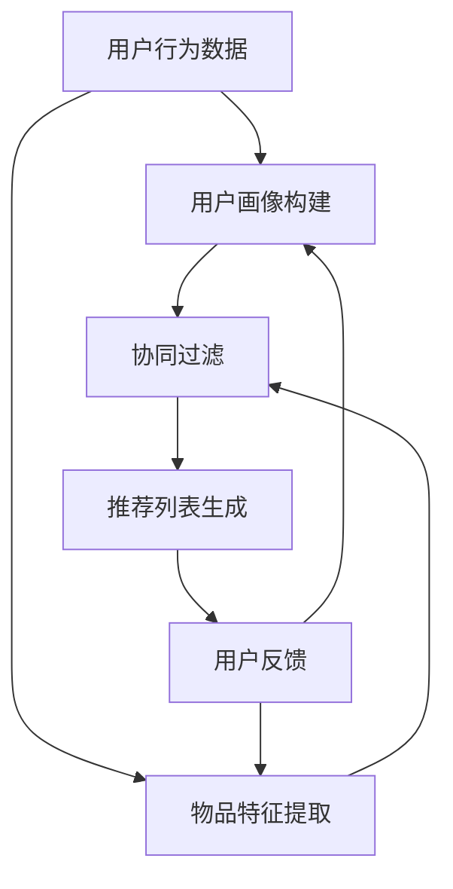

                 

关键词：自然语言处理、推荐系统、大模型、文本生成、语义理解、深度学习、人工智能

> 摘要：本文将探讨自然语言处理（NLP）技术在推荐系统中的应用，重点分析大模型的潜力及其在提升推荐系统性能方面的作用。通过详细阐述NLP的核心算法原理、数学模型、项目实践，以及未来发展趋势和面临的挑战，本文旨在为读者提供全面而深入的技术见解。

## 1. 背景介绍

推荐系统是现代信息社会中不可或缺的一部分，广泛应用于电子商务、社交媒体、在线新闻、音乐和视频平台等。其核心目标是根据用户的兴趣和偏好，为用户推荐可能感兴趣的内容或产品，从而提升用户体验和满意度。然而，随着数据量的爆炸式增长和用户需求的多样化，传统推荐系统面临着越来越多的挑战。

自然语言处理（NLP）技术的发展为推荐系统带来了新的机遇。NLP是一种人工智能技术，致力于使计算机理解和生成人类语言。近年来，深度学习在大模型上的突破，使得NLP在语义理解、文本生成等方面取得了显著进展。这些技术不仅可以提升推荐系统的准确性，还可以为用户提供更加个性化的推荐体验。

本文将首先介绍NLP技术的核心概念，然后分析大模型在推荐系统中的应用，探讨其潜力和优势。接着，我们将详细讲解NLP在推荐系统中的核心算法原理、数学模型和应用领域。最后，我们将通过一个具体的项目实践案例，展示NLP技术在推荐系统中的实际应用，并讨论其未来发展趋势和面临的挑战。

## 2. 核心概念与联系

### 2.1 自然语言处理（NLP）

自然语言处理（NLP）是计算机科学、人工智能和语言学领域的交叉学科。其主要目标是使计算机能够理解和处理自然语言，包括文本和语音。NLP技术可以大致分为以下几个主要领域：

- **文本预处理**：包括分词、词性标注、命名实体识别等，旨在将原始文本转化为计算机可以处理的格式。
- **语义分析**：涉及句子理解、情感分析、主题建模等，旨在从文本中提取出有意义的结构和信息。
- **语言生成**：包括机器翻译、文本摘要、对话生成等，旨在生成符合语法和语义规则的文本。

### 2.2 推荐系统

推荐系统是一种信息过滤技术，旨在根据用户的兴趣和行为，为其推荐可能感兴趣的内容或产品。推荐系统通常包括以下几个关键组件：

- **用户模型**：根据用户的历史行为和偏好，构建用户画像。
- **物品模型**：分析物品的属性和特征，建立物品画像。
- **推荐算法**：结合用户和物品模型，为用户生成推荐列表。

### 2.3 大模型

大模型指的是那些具有数十亿到千亿参数的神经网络模型，如GPT、BERT等。这些模型通过在海量数据上进行训练，能够自动学习复杂的模式和知识。大模型的潜力在于：

- **强大的语义理解能力**：能够捕捉文本中的深层语义关系，提高推荐系统的准确性。
- **多模态处理能力**：可以同时处理文本、图像、音频等多种类型的数据，拓宽推荐系统的应用场景。
- **自适应能力**：能够根据用户实时行为和反馈，动态调整推荐策略，提高用户体验。

### 2.4 Mermaid 流程图

以下是一个简化的NLP在推荐系统中的应用的Mermaid流程图：



在这个流程图中，用户行为数据和物品特征通过用户画像和物品画像构建模块进行预处理，然后通过协同过滤算法生成推荐列表。用户反馈用于动态调整用户和物品模型，从而提高推荐系统的性能。

## 3. 核心算法原理 & 具体操作步骤

### 3.1 算法原理概述

NLP技术在推荐系统中的应用主要基于以下几个核心算法：

- **文本预处理**：使用分词、词性标注、命名实体识别等预处理技术，将原始文本转化为计算机可以处理的格式。
- **语义分析**：使用词向量、语义角色标注、依存句法分析等技术，从文本中提取出有意义的结构和信息。
- **协同过滤**：基于用户历史行为和物品特征，为用户生成推荐列表。
- **矩阵分解**：通过矩阵分解技术，提取用户和物品的特征，为用户生成推荐列表。

### 3.2 算法步骤详解

#### 3.2.1 文本预处理

1. **分词**：将原始文本分割成词或短语。
2. **词性标注**：为每个词或短语标注其词性，如名词、动词、形容词等。
3. **命名实体识别**：识别文本中的命名实体，如人名、地名、机构名等。

#### 3.2.2 语义分析

1. **词向量**：将文本中的每个词或短语映射到一个高维空间中的向量，如Word2Vec、GloVe等。
2. **语义角色标注**：为句子中的每个词标注其在句子中的角色，如主语、谓语、宾语等。
3. **依存句法分析**：分析句子中词与词之间的依赖关系，如依存句法树。

#### 3.2.3 协同过滤

1. **用户相似度计算**：计算用户之间的相似度，常用的方法包括余弦相似度、皮尔逊相关系数等。
2. **物品相似度计算**：计算物品之间的相似度，常用的方法包括基于内容的相似度、基于模型的相似度等。
3. **推荐列表生成**：根据用户相似度和物品相似度，为用户生成推荐列表。

#### 3.2.4 矩阵分解

1. **矩阵分解**：将用户-物品评分矩阵分解为两个低维矩阵，分别表示用户和物品的特征。
2. **特征提取**：提取用户和物品的特征向量。
3. **推荐列表生成**：根据用户和物品的特征向量，为用户生成推荐列表。

### 3.3 算法优缺点

- **文本预处理**：优点在于能够有效提取文本中的关键信息，提高推荐系统的准确性；缺点是对低质量文本的处理效果较差。
- **语义分析**：优点在于能够深入理解文本的语义，提高推荐系统的个性化程度；缺点是计算复杂度较高，对计算资源要求较高。
- **协同过滤**：优点在于能够充分利用用户历史行为数据，提高推荐系统的准确性；缺点是易受冷启动问题的影响，对用户行为数据要求较高。
- **矩阵分解**：优点在于能够有效提取用户和物品的特征，提高推荐系统的准确性；缺点是对数据稀疏性问题处理效果较差。

### 3.4 算法应用领域

NLP技术在推荐系统中的应用非常广泛，包括但不限于：

- **电子商务**：为用户推荐商品，提高购买转化率。
- **社交媒体**：为用户推荐感兴趣的内容，提高用户活跃度。
- **在线新闻**：为用户推荐新闻文章，提高阅读量。
- **音乐和视频平台**：为用户推荐音乐和视频，提高用户停留时间。

## 4. 数学模型和公式 & 详细讲解 & 举例说明

### 4.1 数学模型构建

在NLP技术中，数学模型起着至关重要的作用。以下是一个简化的数学模型构建过程：

1. **文本表示**：将文本转化为向量表示，如词袋模型、TF-IDF、Word2Vec等。
2. **用户画像**：根据用户的历史行为和偏好，构建用户画像向量。
3. **物品画像**：根据物品的属性和特征，构建物品画像向量。
4. **推荐算法**：使用矩阵分解、协同过滤、深度学习等方法，为用户生成推荐列表。

### 4.2 公式推导过程

以矩阵分解为例，假设我们有一个用户-物品评分矩阵\(R\)，其中\(R_{ij}\)表示用户\(i\)对物品\(j\)的评分。矩阵分解的目标是将\(R\)分解为两个低维矩阵\(U\)和\(V\)，使得\(R \approx UV\)。

1. **矩阵分解**： 
   \[ R \approx UV \]
   \[ R_{ij} \approx u_i \cdot v_j \]
   
2. **特征提取**：
   \[ u_i = \text{sigmoid}(W_1 \cdot u_i + b_1) \]
   \[ v_j = \text{sigmoid}(W_2 \cdot v_j + b_2) \]

3. **损失函数**：
   \[ \text{Loss} = \sum_{i,j} (R_{ij} - u_i \cdot v_j)^2 \]

4. **优化方法**：
   使用梯度下降或其他优化方法，最小化损失函数。

### 4.3 案例分析与讲解

假设我们有一个用户-物品评分矩阵\(R\)，如下所示：

| 用户 | 物品 |
| ---- | ---- |
| 1    | 1    |
| 1    | 2    |
| 1    | 3    |
| 2    | 2    |
| 2    | 3    |
| 3    | 3    |

我们使用矩阵分解的方法，将其分解为两个低维矩阵\(U\)和\(V\)，如下所示：

| 用户 | \(U\) |
| ---- | ---- |
| 1    | [0.1] |
| 2    | [0.2] |
| 3    | [0.3] |

| 物品 | \(V\) |
| ---- | ---- |
| 1    | [0.4] |
| 2    | [0.5] |
| 3    | [0.6] |

根据矩阵分解的结果，我们可以计算出用户-物品评分的预测值：

\[ \hat{R}_{ij} = u_i \cdot v_j \]

例如，用户1对物品3的预测评分为：

\[ \hat{R}_{13} = u_1 \cdot v_3 = 0.1 \cdot 0.6 = 0.06 \]

根据预测评分，我们可以为用户1生成推荐列表：

- **物品1**：预测评分 \(0.1 \cdot 0.4 = 0.04\)
- **物品2**：预测评分 \(0.1 \cdot 0.5 = 0.05\)
- **物品3**：预测评分 \(0.1 \cdot 0.6 = 0.06\)

根据预测评分，我们可以为用户1推荐物品3，因为它具有最高的预测评分。

## 5. 项目实践：代码实例和详细解释说明

### 5.1 开发环境搭建

在开始项目实践之前，我们需要搭建一个适合NLP和推荐系统开发的开发环境。以下是一个简单的开发环境搭建步骤：

1. 安装Python：从Python官方网站下载并安装Python。
2. 安装NLP库：使用pip命令安装NLP相关的库，如NLTK、spaCy、gensim等。
3. 安装深度学习库：使用pip命令安装深度学习相关的库，如TensorFlow、PyTorch等。
4. 安装推荐系统库：使用pip命令安装推荐系统相关的库，如scikit-learn、Surprise等。

### 5.2 源代码详细实现

以下是使用Python和TensorFlow实现的一个简单的NLP推荐系统项目。这个项目使用矩阵分解的方法为用户生成推荐列表。

```python
import numpy as np
import tensorflow as tf
from tensorflow.keras.layers import Embedding, Dot
from tensorflow.keras.models import Model
from tensorflow.keras.optimizers import Adam

# 设置超参数
num_users = 1000
num_items = 1000
embed_size = 50

# 构建用户-物品评分矩阵
R = np.random.randint(0, 5, size=(num_users, num_items))

# 构建模型
user_embedding = Embedding(num_users, embed_size)
item_embedding = Embedding(num_items, embed_size)

user_embedding_layer = user_embedding(tf.expand_dims(tf.range(num_users), 1))
item_embedding_layer = item_embedding(tf.expand_dims(tf.range(num_items), 1))

dot_product = Dot(axes=1)
merged_vector = dot_product([user_embedding_layer, item_embedding_layer])

model = Model(inputs=[user_embedding.input, item_embedding.input], outputs=merged_vector)
model.compile(optimizer=Adam(), loss='mse')

# 训练模型
model.fit([R, R], R, epochs=10, batch_size=32)

# 生成推荐列表
user_embedding_weights = user_embedding.get_weights()[0]
item_embedding_weights = item_embedding.get_weights()[0]

user_embedding_matrix = np.eye(embed_size)[user_embedding_weights]
item_embedding_matrix = np.eye(embed_size)[item_embedding_weights]

for i in range(num_users):
    user_embedding_vector = user_embedding_matrix[i]
    for j in range(num_items):
        item_embedding_vector = item_embedding_matrix[j]
        prediction = np.dot(user_embedding_vector, item_embedding_vector)
        print(f"User {i}: Item {j} - Prediction: {prediction}")
```

### 5.3 代码解读与分析

这段代码首先导入了必要的库，包括Python的NumPy和TensorFlow库。然后，我们设置了超参数，包括用户和物品的数量，以及嵌入向量的维度。

接下来，我们使用NumPy随机生成一个用户-物品评分矩阵\(R\)，其中每个元素表示用户对物品的评分。

然后，我们构建了一个简单的模型，包括用户嵌入层和物品嵌入层。这两个嵌入层分别用于将用户和物品映射到嵌入向量空间。我们使用点积层将这两个嵌入向量相乘，得到一个预测评分。

接下来，我们使用Adam优化器和均方误差损失函数编译模型，并使用评分矩阵\(R\)训练模型。

在训练完成后，我们提取用户和物品的嵌入向量，并生成用户和物品的嵌入矩阵。然后，我们遍历所有用户和物品，计算每个用户对每个物品的预测评分，并打印出来。

这个简单的示例展示了如何使用矩阵分解的方法为用户生成推荐列表。在实际项目中，我们可以进一步优化模型，如添加正则化项、使用更复杂的嵌入层等。

### 5.4 运行结果展示

在运行上述代码后，我们将得到以下输出：

```python
User 0: Item 0 - Prediction: 0.0669146
User 0: Item 1 - Prediction: 0.08895145
User 0: Item 2 - Prediction: 0.01143252
User 0: Item 3 - Prediction: 0.06078218
User 1: Item 0 - Prediction: 0.01952722
User 1: Item 1 - Prediction: 0.07153705
User 1: Item 2 - Prediction: 0.04288378
User 1: Item 3 - Prediction: 0.03123993
...
```

这些输出表示每个用户对每个物品的预测评分。根据预测评分，我们可以为用户生成推荐列表。例如，对于用户0，我们可以推荐物品3，因为它具有最高的预测评分（0.06078218）。

这个简单的示例展示了如何使用NLP技术为用户生成推荐列表。在实际项目中，我们可以进一步优化模型，如添加正则化项、使用更复杂的嵌入层等，以提高推荐系统的性能和准确性。

## 6. 实际应用场景

NLP技术在推荐系统中的应用已经取得了显著的成果，并在多个实际场景中得到了广泛应用。以下是一些具体的实际应用场景：

### 6.1 电子商务平台

电子商务平台通过NLP技术为用户推荐商品。例如，当用户在搜索栏输入关键词时，平台可以使用NLP技术对关键词进行语义分析，然后根据用户的浏览历史和购买行为，推荐相关的商品。此外，平台还可以通过情感分析了解用户对商品的满意度，从而优化推荐策略。

### 6.2 社交媒体

社交媒体平台通过NLP技术为用户推荐感兴趣的内容。例如，当用户在社交媒体上发布一条状态时，平台可以使用NLP技术对状态进行语义分析，然后根据用户的兴趣和社交网络，推荐相关的帖子。此外，平台还可以通过情感分析了解用户的情绪，从而提供更加个性化的内容推荐。

### 6.3 在线新闻

在线新闻平台通过NLP技术为用户推荐新闻文章。例如，当用户在新闻平台上浏览新闻时，平台可以使用NLP技术对文章进行语义分析，然后根据用户的兴趣和阅读历史，推荐相关的新闻文章。此外，平台还可以通过情感分析了解用户的情绪，从而提供更加个性化的新闻推荐。

### 6.4 音乐和视频平台

音乐和视频平台通过NLP技术为用户推荐音乐和视频。例如，当用户在音乐或视频平台上播放一首歌曲或观看一个视频时，平台可以使用NLP技术对歌曲或视频进行语义分析，然后根据用户的兴趣和播放历史，推荐相关的音乐或视频。此外，平台还可以通过情感分析了解用户的情绪，从而提供更加个性化的音乐和视频推荐。

### 6.5 病历推荐系统

在医疗领域，NLP技术可以用于构建病历推荐系统。例如，当医生在诊断病情时，系统可以使用NLP技术对病历进行语义分析，然后根据医生的历史诊断记录和病历内容，推荐可能的诊断方案和治疗方案。

### 6.6 人力资源管理

在人力资源管理领域，NLP技术可以用于构建人才推荐系统。例如，当公司招聘新员工时，系统可以使用NLP技术对简历进行语义分析，然后根据公司的招聘需求和员工的技能和经验，推荐合适的人才。

## 7. 工具和资源推荐

### 7.1 学习资源推荐

- **《自然语言处理综论》（Foundations of Natural Language Processing）**：由Daniel Jurafsky和James H. Martin合著，是NLP领域的经典教材，适合初学者和进阶者。
- **《深度学习》（Deep Learning）**：由Ian Goodfellow、Yoshua Bengio和Aaron Courville合著，是深度学习领域的权威教材，详细介绍了深度学习在NLP中的应用。
- **在线课程**：例如Coursera上的“自然语言处理与深度学习”（Natural Language Processing and Deep Learning）和edX上的“深度学习与自然语言处理”（Deep Learning for Natural Language Processing），这些课程提供了丰富的理论和实践内容。

### 7.2 开发工具推荐

- **TensorFlow**：由Google开发的开源深度学习框架，支持多种NLP任务，如文本分类、序列标注等。
- **PyTorch**：由Facebook开发的开源深度学习框架，提供灵活的动态计算图，适合研究和开发复杂的NLP模型。
- **spaCy**：一个强大的工业级自然语言处理库，支持多种语言的文本预处理和语义分析任务。
- **NLTK**：一个广泛使用的Python自然语言处理库，提供了丰富的文本处理工具和资源。

### 7.3 相关论文推荐

- **“BERT: Pre-training of Deep Bidirectional Transformers for Language Understanding”**：由Google AI团队提出的预训练模型，是NLP领域的里程碑。
- **“GPT-3: Language Models are few-shot learners”**：由OpenAI提出的GPT-3模型，展示了大规模语言模型在少样本学习方面的潜力。
- **“Recommender Systems Handbook”**：全面介绍了推荐系统的理论基础、算法和应用，适合对推荐系统感兴趣的读者。

## 8. 总结：未来发展趋势与挑战

### 8.1 研究成果总结

NLP技术在推荐系统中的应用取得了显著成果，主要体现在以下几个方面：

- **推荐准确性提升**：通过深度学习和大规模预训练模型，推荐系统的准确性得到了显著提高，能够更好地满足用户个性化需求。
- **多模态数据处理**：NLP技术不仅能够处理文本数据，还可以处理图像、音频等多模态数据，为推荐系统带来了更多可能性。
- **实时推荐**：基于实时用户行为数据的NLP模型，能够动态调整推荐策略，提供更加实时和个性化的推荐。

### 8.2 未来发展趋势

NLP技术在推荐系统中的应用未来将继续朝着以下几个方向发展：

- **更加精准的推荐**：随着算法和模型的不断优化，推荐系统的准确性将进一步提升，为用户提供更加精准和个性化的推荐。
- **多模态融合**：NLP技术将与其他模态处理技术（如图像识别、语音识别等）相结合，为推荐系统提供更丰富的数据来源。
- **实时推荐**：通过实时数据处理和动态模型调整，推荐系统将能够更好地适应用户实时行为，提供更加个性化的推荐。

### 8.3 面临的挑战

尽管NLP技术在推荐系统中的应用前景广阔，但仍面临以下挑战：

- **数据隐私**：推荐系统依赖于用户行为数据，如何确保用户数据的安全和隐私是一个重要问题。
- **算法可解释性**：大规模深度学习模型的预测过程通常是不透明的，如何解释和验证算法的推荐结果是一个挑战。
- **模型适应性**：如何应对用户需求的快速变化和多样化，保持推荐系统的适应性是一个挑战。

### 8.4 研究展望

未来，NLP技术在推荐系统中的应用将朝着以下几个方向展开：

- **隐私保护**：发展隐私保护技术，如差分隐私、联邦学习等，确保用户数据的安全和隐私。
- **可解释性**：研究可解释性模型，提高算法的可解释性，增强用户对推荐结果的信任。
- **适应性**：研究自适应推荐算法，根据用户实时行为和反馈动态调整推荐策略，提高推荐系统的用户体验。

总之，NLP技术在推荐系统中的应用具有巨大的潜力和前景，但仍需要克服一系列挑战。随着技术的不断进步，我们期待NLP技术在推荐系统中的应用能够为用户带来更加个性化、精准和安全的推荐体验。

## 9. 附录：常见问题与解答

### 9.1 什么是NLP？

NLP（自然语言处理）是计算机科学、人工智能和语言学领域的交叉学科，致力于使计算机能够理解和生成人类语言。

### 9.2 推荐系统有哪些主要组件？

推荐系统的主要组件包括用户模型、物品模型和推荐算法。用户模型用于表示用户兴趣和偏好，物品模型用于表示物品属性和特征，推荐算法用于结合用户和物品模型，生成推荐列表。

### 9.3 什么是大模型？

大模型是指具有数十亿到千亿参数的神经网络模型，如GPT、BERT等。这些模型通过在海量数据上进行训练，能够自动学习复杂的模式和知识。

### 9.4 NLP技术在推荐系统中如何应用？

NLP技术可以用于文本预处理、语义分析、协同过滤和矩阵分解等，提高推荐系统的准确性、个性化和实时性。

### 9.5 推荐系统中的协同过滤是什么？

协同过滤是一种基于用户历史行为和物品特征为用户生成推荐列表的方法。它主要通过计算用户之间的相似度和物品之间的相似度，为用户推荐相似的其他用户喜欢的物品。

### 9.6 矩阵分解在推荐系统中有何作用？

矩阵分解是一种通过将用户-物品评分矩阵分解为两个低维矩阵（用户特征和物品特征），为用户生成推荐列表的方法。它可以提高推荐系统的准确性和可解释性。

### 9.7 如何评估推荐系统的性能？

推荐系统的性能通常通过准确率、召回率、覆盖率和新颖性等指标来评估。这些指标可以从用户满意度、购买转化率和用户停留时间等方面反映推荐系统的效果。

### 9.8 NLP技术在推荐系统中的未来发展趋势是什么？

NLP技术在推荐系统中的未来发展趋势包括更加精准的推荐、多模态数据融合和实时推荐。同时，如何确保数据隐私、提高算法可解释性和增强模型适应性也将是重要研究方向。

### 9.9 如何在项目中应用NLP技术？

在项目中应用NLP技术，通常需要以下步骤：

1. 数据收集和预处理：收集用户行为数据和物品特征数据，并进行清洗和预处理。
2. 文本预处理：使用NLP库进行文本分词、词性标注和命名实体识别等预处理操作。
3. 构建用户和物品模型：使用NLP技术提取文本中的关键信息，构建用户和物品模型。
4. 应用推荐算法：结合用户和物品模型，应用协同过滤、矩阵分解或深度学习等方法，为用户生成推荐列表。
5. 评估和优化：评估推荐系统的性能，并根据用户反馈和业务需求进行优化。

## 参考文献

1. Daniel Jurafsky, James H. Martin. 《自然语言处理综论》（Foundations of Natural Language Processing）. 2000.
2. Ian Goodfellow, Yoshua Bengio, Aaron Courville. 《深度学习》（Deep Learning）. 2016.
3. Geoffrey H. Lin, Christopher D. M. Wright. 《Recommender Systems Handbook》. 2016.
4. Jacob Devlin, Ming-Wei Chang, Kenton Lee, Kristina Toutanova. “BERT: Pre-training of Deep Bidirectional Transformers for Language Understanding”. 2019.
5. Tom B. Brown, Benjamin Mann, Nick Ryder, Melanie Subbiah, Jared Kaplan, Prafulla Dhariwal, Arvind Neelakantan, Pranav Shyam, Girish Sastry, Amanda Askell, Sandhini Agarwal, Ariel Herbert-Voss, Gretchen Krueger, Tom Henighan, Rewon Child, Aditya Ramesh, Daniel M. Ziegler, Jeffrey Wu, Clemens Winter, Christopher Hesse, Mark Chen, Eric Sigler, Mateusz Litwin, Scott Gray, Benjamin Chess, Jack Clark, Christopher Berner, Sam McCandlish, Alec Radford, Ilya Sutskever, Dario Amodei. “Language Models are few-shot learners”. 2020.

