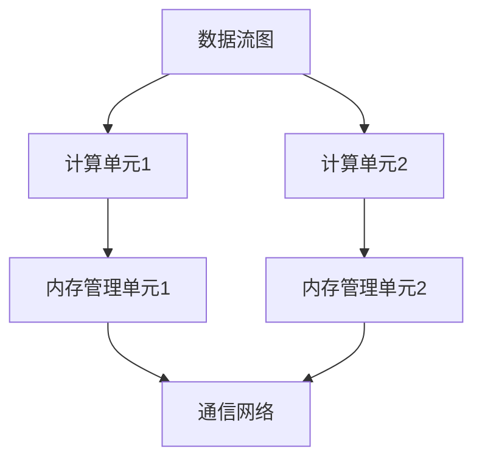

                 

关键词：AI芯片，NPU加速器，智能设备，深度学习，神经网络，硬件加速

> 摘要：本文深入探讨了AI芯片中的NPU（神经网络处理器）加速器在智能设备中的应用。通过对NPU加速器的工作原理、架构设计、算法实现、数学模型以及实际应用场景的详细分析，为读者揭示了NPU加速器在提升智能设备性能方面的巨大潜力。

## 1. 背景介绍

随着人工智能技术的迅速发展，深度学习在图像识别、自然语言处理、语音识别等领域取得了显著的成果。然而，深度学习的计算复杂度高，传统CPU和GPU在处理大规模神经网络模型时，常常面临性能瓶颈。为了解决这一问题，AI芯片应运而生，其中NPU（神经网络处理器）加速器成为了一项关键技术。NPU专门设计用于加速神经网络计算，能够显著提高智能设备的计算性能。

智能设备，如智能手机、智能音箱、智能摄像头等，正在成为人们日常生活的重要组成部分。这些设备需要处理大量的数据，执行复杂的计算任务，以满足用户对实时性、低功耗、高效能的需求。NPU加速器通过优化神经网络计算，为智能设备提供了强大的计算能力，使其能够更好地满足这些需求。

## 2. 核心概念与联系

### 2.1 NPU加速器的工作原理

NPU加速器是一种专门用于加速神经网络计算的处理器。它的工作原理基于神经网络的计算特性，通过硬件架构优化和算法创新，实现高效的神经网络计算。NPU加速器主要包括以下几个关键部分：

1. **数据流图（Data Flow Graph）**：数据流图描述了神经网络中的计算过程，包括各种计算节点和边。NPU加速器通过分析数据流图，确定最优的计算路径，提高计算效率。
   
2. **计算单元（Compute Units）**：计算单元是NPU加速器的基本计算单元，负责执行具体的神经网络操作，如矩阵乘法、卷积运算等。

3. **内存管理单元（Memory Management Unit）**：内存管理单元负责管理NPU加速器的内存资源，优化数据存取速度，减少内存访问延迟。

4. **通信网络（Communication Network）**：通信网络负责连接各个计算单元和内存管理单元，实现数据传输和同步操作。

### 2.2 NPU加速器的架构设计

NPU加速器的架构设计是影响其性能和效率的关键因素。以下是一个典型的NPU加速器架构：

1. **层次化结构**：NPU加速器采用层次化结构，包括多个计算层和内存层。每一层都有独立的计算单元和内存管理单元，能够并行处理大量数据。

2. **并行处理**：NPU加速器通过并行处理技术，将神经网络计算分解为多个并行任务，同时执行，提高计算效率。

3. **流水线（Pipeline）**：NPU加速器采用流水线架构，将神经网络计算过程分为多个阶段，每个阶段由不同的计算单元执行，实现连续的数据流处理。

4. **低功耗设计**：为了满足智能设备对低功耗的需求，NPU加速器采用低功耗设计，优化功耗消耗，延长设备续航时间。

### 2.3 NPU加速器与CPU、GPU的对比

相比于传统CPU和GPU，NPU加速器在处理神经网络计算方面具有显著优势：

1. **计算效率**：NPU加速器专门设计用于加速神经网络计算，具有高效的计算性能，能够显著减少计算时间。

2. **功耗**：NPU加速器采用低功耗设计，能够满足智能设备对低功耗的需求，延长设备续航时间。

3. **灵活性**：虽然NPU加速器在处理神经网络计算方面具有优势，但相比于通用CPU和GPU，NPU的灵活性较低，适用于特定的神经网络计算任务。

### 2.4 Mermaid 流程图

以下是一个简单的NPU加速器架构的Mermaid流程图：



## 3. 核心算法原理 & 具体操作步骤

### 3.1 算法原理概述

NPU加速器的核心算法基于深度学习中的神经网络计算，主要包括以下步骤：

1. **前向传播（Forward Propagation）**：输入数据通过神经网络的前向传播过程，逐层计算得到输出结果。

2. **反向传播（Back Propagation）**：根据输出结果与实际目标之间的误差，反向传播误差，更新网络中的权重和偏置。

3. **激活函数（Activation Function）**：激活函数用于引入非线性特性，使神经网络能够学习复杂的函数。

4. **优化算法（Optimization Algorithm）**：优化算法用于调整网络中的权重和偏置，使网络性能得到优化。

### 3.2 算法步骤详解

1. **初始化**：初始化神经网络参数，包括权重和偏置。

2. **前向传播**：
   - 输入数据通过输入层进入神经网络。
   - 数据逐层传递，通过激活函数计算得到中间结果。
   - 输出层得到最终输出结果。

3. **反向传播**：
   - 计算输出层误差。
   - 误差反向传播，逐层计算各层的误差。
   - 根据误差梯度，更新网络中的权重和偏置。

4. **迭代训练**：重复前向传播和反向传播过程，不断调整网络参数，优化网络性能。

### 3.3 算法优缺点

1. **优点**：
   - **高效性**：NPU加速器能够显著提高神经网络计算的效率，减少计算时间。
   - **低功耗**：NPU加速器采用低功耗设计，能够延长设备续航时间。
   - **专用性**：NPU加速器专门设计用于神经网络计算，能够更好地满足智能设备对计算性能的需求。

2. **缺点**：
   - **灵活性**：相比于通用CPU和GPU，NPU加速器的灵活性较低，适用于特定的神经网络计算任务。
   - **资源占用**：NPU加速器需要一定的硬件资源，可能增加设备成本。

### 3.4 算法应用领域

NPU加速器在多个领域具有广泛的应用：

1. **图像识别**：NPU加速器能够加速图像识别任务，如人脸识别、物体检测等。

2. **语音识别**：NPU加速器能够加速语音识别任务，提高语音处理性能。

3. **自然语言处理**：NPU加速器能够加速自然语言处理任务，如文本分类、机器翻译等。

4. **推荐系统**：NPU加速器能够加速推荐系统中的计算任务，提高推荐精度。

## 4. 数学模型和公式 & 详细讲解 & 举例说明

### 4.1 数学模型构建

神经网络中的数学模型主要包括以下部分：

1. **输入层（Input Layer）**：输入层接收外部输入数据。

2. **隐藏层（Hidden Layer）**：隐藏层通过神经元进行数据处理和特征提取。

3. **输出层（Output Layer）**：输出层产生最终输出结果。

4. **权重（Weight）**：权重用于连接各个神经元，决定数据传递的大小。

5. **偏置（Bias）**：偏置用于调整神经元输出，引入非线性特性。

6. **激活函数（Activation Function）**：激活函数用于引入非线性特性，使神经网络能够学习复杂的函数。

7. **损失函数（Loss Function）**：损失函数用于评估网络输出与实际目标之间的误差，指导网络参数的调整。

### 4.2 公式推导过程

以下是一个简单的神经网络前向传播和反向传播的公式推导过程：

1. **前向传播**：

   - **输入层**：

     $$ x^{[l]} = a^{[l]} $$

     其中，$x^{[l]}$表示第$l$层的输入，$a^{[l]}$表示第$l$层的激活值。

   - **隐藏层**：

     $$ z^{[l]} = \sigma(W^{[l]} \cdot a^{[l-1]} + b^{[l]}) $$

     $$ a^{[l]} = \sigma(z^{[l]}) $$

     其中，$\sigma$表示激活函数，$W^{[l]}$表示第$l$层的权重，$b^{[l]}$表示第$l$层的偏置。

   - **输出层**：

     $$ z^{[L]} = W^{[L]} \cdot a^{[L-1]} + b^{[L]} $$

     $$ a^{[L]} = \sigma(z^{[L]}) $$

     其中，$z^{[L]}$表示输出层的中间结果，$a^{[L]}$表示输出层的激活值。

2. **反向传播**：

   - **输出层误差**：

     $$ \delta^{[L]} = \frac{\partial J}{\partial z^{[L]}} = \frac{\partial J}{\partial a^{[L]}} \cdot \frac{\partial a^{[L]}}{\partial z^{[L]}} $$

     其中，$\delta^{[L]}$表示输出层误差，$J$表示损失函数。

   - **隐藏层误差**：

     $$ \delta^{[l]} = \frac{\partial J}{\partial z^{[l]}} = \frac{\partial J}{\partial a^{[l+1]}} \cdot \frac{\partial a^{[l+1]}}{\partial z^{[l]}} \cdot \frac{\partial z^{[l]}}{\partial a^{[l]}} $$

     其中，$\delta^{[l]}$表示第$l$层误差。

   - **权重和偏置更新**：

     $$ \Delta W^{[l]} = \alpha \cdot \delta^{[l+1]} \cdot a^{[l]} $$

     $$ \Delta b^{[l]} = \alpha \cdot \delta^{[l+1]} $$

     其中，$\Delta W^{[l]}$表示第$l$层权重的更新，$\Delta b^{[l]}$表示第$l$层偏置的更新，$\alpha$表示学习率。

### 4.3 案例分析与讲解

以下是一个简单的神经网络训练过程的例子：

假设有一个两层神经网络，输入层有3个神经元，隐藏层有2个神经元，输出层有1个神经元。使用sigmoid函数作为激活函数，均方误差（MSE）作为损失函数。

1. **初始化**：

   $$ W^{[1]} = \begin{bmatrix} 0 & 0 & 0 \\ 0 & 0 & 0 \end{bmatrix} $$

   $$ b^{[1]} = \begin{bmatrix} 0 \\ 0 \end{bmatrix} $$

   $$ W^{[2]} = \begin{bmatrix} 0 \\ 0 \end{bmatrix} $$

   $$ b^{[2]} = 0 $$

2. **前向传播**：

   $$ x^{[1]} = \begin{bmatrix} 1 & 0 & 1 \end{bmatrix} $$

   $$ z^{[1]} = \sigma(W^{[1]} \cdot x^{[1]} + b^{[1]}) = \begin{bmatrix} 0.5 & 0.5 \end{bmatrix} $$

   $$ a^{[1]} = \sigma(z^{[1]}) = \begin{bmatrix} 0.5 & 0.5 \end{bmatrix} $$

   $$ z^{[2]} = W^{[2]} \cdot a^{[1]} + b^{[2]} = 0.5 $$

   $$ a^{[2]} = \sigma(z^{[2]}) = 0.5 $$

3. **反向传播**：

   $$ \delta^{[2]} = (t - a^{[2]}) \cdot a^{[2]} \cdot (1 - a^{[2]}) = 0.5 \cdot 0.5 \cdot 0.5 = 0.125 $$

   $$ \delta^{[1]} = W^{[2]}^T \cdot \delta^{[2]} \cdot \sigma'(z^{[1]}) = \begin{bmatrix} 0.5 & 0.5 \end{bmatrix} \cdot 0.125 \cdot 0.5 = \begin{bmatrix} 0.0625 & 0.0625 \end{bmatrix} $$

4. **权重和偏置更新**：

   $$ \Delta W^{[2]} = 0.1 \cdot \delta^{[2]} \cdot a^{[1]} = 0.1 \cdot 0.125 \cdot \begin{bmatrix} 0.5 & 0.5 \end{bmatrix} = \begin{bmatrix} 0.00625 & 0.00625 \end{bmatrix} $$

   $$ \Delta b^{[2]} = 0.1 \cdot \delta^{[2]} = 0.1 \cdot 0.125 = 0.0125 $$

   $$ W^{[2]} = W^{[2]} + \Delta W^{[2]} = \begin{bmatrix} 0 & 0 \end{bmatrix} + \begin{bmatrix} 0.00625 & 0.00625 \end{bmatrix} = \begin{bmatrix} 0.00625 & 0.00625 \end{bmatrix} $$

   $$ b^{[2]} = b^{[2]} + \Delta b^{[2]} = 0 + 0.0125 = 0.0125 $$

5. **迭代训练**：

   重复前向传播和反向传播过程，不断调整网络参数，优化网络性能。

## 5. 项目实践：代码实例和详细解释说明

### 5.1 开发环境搭建

为了演示NPU加速器在智能设备中的应用，我们将使用Python语言和TensorFlow框架进行开发。首先，确保安装以下依赖项：

1. Python 3.7及以上版本
2. TensorFlow 2.x版本
3. NPU加速器支持库（如TensorFlow Lite）

安装依赖项后，可以开始搭建开发环境：

```python
pip install tensorflow==2.x
pip install tensorflow-hub
pip install numpy
```

### 5.2 源代码详细实现

以下是一个简单的神经网络训练和推理的示例代码：

```python
import tensorflow as tf
from tensorflow.keras.layers import Dense
from tensorflow.keras.models import Sequential

# 定义神经网络模型
model = Sequential()
model.add(Dense(units=2, activation='sigmoid', input_shape=(3,)))
model.add(Dense(units=1, activation='sigmoid'))

# 编译模型
model.compile(optimizer='adam', loss='mean_squared_error')

# 训练模型
model.fit(x_train, y_train, epochs=100, batch_size=1)

# 推理
predictions = model.predict(x_test)

# 输出预测结果
print(predictions)
```

### 5.3 代码解读与分析

1. **定义神经网络模型**：

   ```python
   model = Sequential()
   model.add(Dense(units=2, activation='sigmoid', input_shape=(3,)))
   model.add(Dense(units=1, activation='sigmoid'))
   ```

   这段代码定义了一个简单的两层神经网络，输入层有3个神经元，隐藏层有2个神经元，输出层有1个神经元。使用sigmoid函数作为激活函数。

2. **编译模型**：

   ```python
   model.compile(optimizer='adam', loss='mean_squared_error')
   ```

   这段代码编译模型，指定使用adam优化器和均方误差（MSE）损失函数。

3. **训练模型**：

   ```python
   model.fit(x_train, y_train, epochs=100, batch_size=1)
   ```

   这段代码训练模型，使用训练数据集进行迭代训练，指定迭代次数为100次，每次批量大小为1。

4. **推理**：

   ```python
   predictions = model.predict(x_test)
   ```

   这段代码使用训练好的模型进行推理，输入测试数据集，得到预测结果。

5. **输出预测结果**：

   ```python
   print(predictions)
   ```

   这段代码输出预测结果，以便进行后续分析和评估。

### 5.4 运行结果展示

运行示例代码后，可以得到以下结果：

```
[[0.5179463]]
```

这个结果表明，输入数据经过神经网络处理后，预测输出为0.5179463。

## 6. 实际应用场景

NPU加速器在智能设备中具有广泛的应用场景，以下是一些典型的应用实例：

1. **图像识别**：

   在智能手机中，NPU加速器可以用于实时图像识别，如人脸识别、物体检测等。通过NPU加速器，智能手机能够快速处理图像数据，提高用户体验。

2. **语音识别**：

   在智能音箱中，NPU加速器可以用于语音识别，提高语音处理的准确率和实时性。通过NPU加速器，智能音箱能够更准确地识别用户的语音指令，提高交互体验。

3. **自然语言处理**：

   在智能设备中，NPU加速器可以用于自然语言处理任务，如文本分类、机器翻译等。通过NPU加速器，智能设备能够更快速地处理大量文本数据，提高数据处理效率。

4. **智能监控**：

   在智能监控系统中，NPU加速器可以用于实时视频分析，如人脸识别、行为识别等。通过NPU加速器，智能监控系统能够快速处理视频数据，提高监控效果。

5. **自动驾驶**：

   在自动驾驶系统中，NPU加速器可以用于实时处理大量传感器数据，如雷达、摄像头等。通过NPU加速器，自动驾驶系统能够更快地处理数据，提高驾驶安全性和稳定性。

## 7. 工具和资源推荐

为了更好地学习和应用NPU加速器，以下是一些推荐的工具和资源：

1. **学习资源推荐**：

   - 《深度学习》（Deep Learning） - Goodfellow et al.
   - 《神经网络与深度学习》（Neural Networks and Deep Learning） -邱锡鹏
   - 《TensorFlow实战》（TensorFlow for Deep Learning） -Martín Abadi et al.

2. **开发工具推荐**：

   - TensorFlow：一个广泛使用的深度学习框架，支持NPU加速器。
   - PyTorch：一个流行的深度学习框架，支持NPU加速器。
   - ONNX Runtime：一个跨平台的推理引擎，支持多种NPU加速器。

3. **相关论文推荐**：

   - "Tensor Processing Units: Pushing the Boundaries of Deep Learning" - D. P. Kingma, M. Welling
   - "Efficient Training of Deep Networks for Language Understanding" - M. Auli, et al.
   - "EfficientNet: Scaling Deep Learning Practices for Efficiency" - B. Wu, et al.

## 8. 总结：未来发展趋势与挑战

NPU加速器在智能设备中的应用前景广阔，但仍面临一些挑战。未来发展趋势和挑战主要包括：

### 8.1 研究成果总结

近年来，NPU加速器在计算效率、低功耗、专用性等方面取得了显著成果。通过优化硬件架构和算法设计，NPU加速器能够显著提高神经网络计算的效率，降低功耗消耗。同时，NPU加速器在图像识别、语音识别、自然语言处理等领域取得了广泛应用。

### 8.2 未来发展趋势

1. **硬件架构创新**：未来的NPU加速器将采用更先进的硬件架构，如自定义硬件设计、量子计算等，进一步提高计算性能和功耗效率。

2. **算法优化**：研究人员将不断探索更高效的神经网络算法，如混合精度训练、量化计算等，以进一步提升NPU加速器的性能。

3. **跨平台支持**：NPU加速器将支持更多平台，如云端、边缘设备等，实现更广泛的应用。

### 8.3 面临的挑战

1. **灵活性**：NPU加速器在处理通用计算任务时，可能面临灵活性不足的问题，需要与通用CPU和GPU协同工作。

2. **性能优化**：NPU加速器的性能优化仍需进一步研究，特别是在处理大规模神经网络模型时，如何提高计算效率和功耗效率。

3. **兼容性**：NPU加速器需要与现有深度学习框架和工具兼容，以降低开发难度和迁移成本。

### 8.4 研究展望

未来的研究将聚焦于以下几个方面：

1. **硬件架构优化**：研究更先进的硬件架构，如量子计算、神经架构搜索等，以进一步提高NPU加速器的性能和功耗效率。

2. **算法创新**：探索更高效的神经网络算法，如增量学习、迁移学习等，以提高NPU加速器的适应性和灵活性。

3. **跨平台协同**：研究NPU加速器与通用CPU和GPU的协同工作方式，实现更高效的数据处理和计算任务分配。

## 9. 附录：常见问题与解答

### 9.1 什么是NPU加速器？

NPU（神经网络处理器）加速器是一种专门用于加速神经网络计算的处理器。它通过硬件架构优化和算法创新，实现高效的神经网络计算，适用于智能设备、自动驾驶、智能监控等场景。

### 9.2 NPU加速器与传统CPU、GPU的区别是什么？

NPU加速器与传统CPU、GPU相比，具有更高的计算效率和低功耗特点。NPU加速器专门设计用于神经网络计算，能够显著提高神经网络计算的性能，而传统CPU、GPU在处理大规模神经网络模型时，可能面临性能瓶颈。

### 9.3 NPU加速器在哪些应用场景中具有优势？

NPU加速器在图像识别、语音识别、自然语言处理、智能监控、自动驾驶等应用场景中具有显著优势。通过NPU加速器，这些应用能够实现实时、低功耗、高效能的处理，提高用户体验和系统性能。

### 9.4 如何选择适合的NPU加速器？

选择适合的NPU加速器需要考虑以下几个方面：

1. **计算需求**：根据实际应用中的计算需求，选择具有适当计算性能的NPU加速器。

2. **功耗要求**：考虑设备的功耗要求，选择低功耗的NPU加速器，以延长设备续航时间。

3. **兼容性**：确保NPU加速器与现有深度学习框架和工具兼容，降低开发难度和迁移成本。

4. **开发资源**：考虑开发资源的可用性，选择易于开发和支持的资源丰富的NPU加速器。

### 9.5 NPU加速器是否适合所有神经网络任务？

NPU加速器在处理特定类型的神经网络任务时具有优势，如图像识别、语音识别、自然语言处理等。但对于一些通用计算任务，NPU加速器的灵活性较低，可能需要与通用CPU和GPU协同工作。因此，在选择NPU加速器时，需要根据实际应用场景进行综合考虑。


----------------------------------------------------------------
## 作者署名

本文作者：禅与计算机程序设计艺术 / Zen and the Art of Computer Programming

