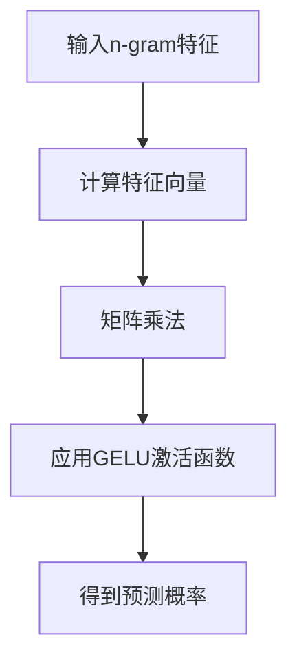

                 

关键词：N-gram模型、多层感知器、矩阵乘法、GELU激活函数、机器学习、深度学习、自然语言处理

> 摘要：本文将深入探讨N-gram模型在自然语言处理中的应用，重点分析其与多层感知器、矩阵乘法和GELU激活函数的关联。通过详细讲解模型原理、数学模型构建、具体操作步骤以及项目实践，我们将帮助读者全面理解N-gram模型在当前技术领域中的重要性及其未来发展趋势。

## 1. 背景介绍

自然语言处理（Natural Language Processing，NLP）是计算机科学领域与人工智能领域中的一个重要分支。它涉及到计算机和人类语言之间的交互，旨在让计算机能够理解和生成人类语言。NLP的应用领域广泛，包括语音识别、机器翻译、情感分析、文本摘要等。

在NLP中，语言模型是一个核心概念。语言模型旨在捕捉自然语言的统计特性，以便进行文本生成、语义理解等任务。N-gram模型是一种基础且广泛使用的语言模型，它通过考虑连续的n个单词（或字符）来预测下一个单词。

N-gram模型的简单性使其成为自然语言处理中的一个重要工具。然而，随着深度学习技术的发展，N-gram模型逐渐被更复杂的模型，如基于神经网络的模型所取代。然而，N-gram模型仍有其独特的应用场景和价值。

本文将深入探讨N-gram模型与多层感知器、矩阵乘法和GELU激活函数之间的关系，帮助读者理解其在现代NLP技术中的重要性。

## 2. 核心概念与联系

### 2.1 N-gram模型的基本原理

N-gram模型是一种基于统计的模型，它将连续的n个单词（或字符）作为一组，称为n-gram。例如，对于n=3，"机器学习"可以分解为三个三元组：("机器"，"学习"，"深度")、("学习"，"深度"，"学习")等。

N-gram模型的基本原理是通过统计这组单词（或字符）在语料库中出现的频率，来预测下一个单词。例如，如果"机器学习"在语料库中频繁出现，那么模型会倾向于预测下一个单词是"深度"。

### 2.2 多层感知器（MLP）与N-gram模型的结合

多层感知器（MLP）是一种基于神经网络的模型，它通过多层神经元进行数据处理，从而实现复杂的函数映射。MLP在NLP中的应用非常广泛，例如在文本分类、情感分析等任务中。

在N-gram模型中，可以使用MLP来改进模型的预测能力。具体来说，可以将N-gram模型中的n-gram特征输入到MLP中，通过MLP的多层非线性变换，提升模型的性能。

### 2.3 矩阵乘法在N-gram模型中的应用

矩阵乘法是深度学习中的一个核心操作。在N-gram模型中，矩阵乘法可以用于计算n-gram特征向量和权重矩阵的乘积，从而得到每个n-gram的预测概率。

例如，假设我们有一个包含100个n-gram特征向量的矩阵，以及一个10x100的权重矩阵。通过矩阵乘法，我们可以得到每个n-gram的预测概率向量，其中每个元素表示该n-gram预测为特定单词的概率。

### 2.4 GELU激活函数在N-gram模型中的作用

GELU（Gaussian Error Linear Unit）是一种非线性激活函数，它在深度学习中得到了广泛应用。在N-gram模型中，GELU激活函数可以用于MLP的输出层，以提高模型的非线性表达能力。

GELU激活函数的定义如下：

\[ GELU(x) = 0.5 \cdot x \cdot \left(1 + \text{erf}\left(\frac{x}{\sqrt{2}}\right)\right) \]

其中，erf是误差函数（Error Function）。GELU激活函数具有较好的平滑性和饱和性，使其在深度学习中具有较好的性能。

### 2.5 Mermaid流程图展示

以下是一个展示N-gram模型与多层感知器、矩阵乘法和GELU激活函数关系的Mermaid流程图：



## 3. 核心算法原理 & 具体操作步骤

### 3.1 算法原理概述

N-gram模型的算法原理主要包括以下几个步骤：

1. **特征提取**：从输入文本中提取n-gram特征。
2. **矩阵乘法**：计算n-gram特征向量和权重矩阵的乘积。
3. **激活函数**：使用GELU激活函数对乘积结果进行非线性变换。
4. **预测**：根据激活函数的结果，计算每个n-gram的预测概率。

### 3.2 算法步骤详解

#### 3.2.1 特征提取

首先，从输入文本中提取n-gram特征。假设输入文本为“机器学习深度学习”，n=3，则可以提取出以下n-gram特征：

- ("机器"，"学习"，"深度")
- ("学习"，"深度"，"学习")

#### 3.2.2 矩阵乘法

接下来，计算每个n-gram特征向量和权重矩阵的乘积。假设权重矩阵为：

\[ W = \begin{bmatrix} 0.1 & 0.2 & 0.3 \\ 0.4 & 0.5 & 0.6 \end{bmatrix} \]

对于第一个n-gram特征 ("机器"，"学习"，"深度")，其特征向量为：

\[ X = \begin{bmatrix} 1 & 0 & 0 \\ 0 & 1 & 0 \\ 0 & 0 & 1 \end{bmatrix} \]

通过矩阵乘法，我们可以得到预测概率向量：

\[ P = X \cdot W = \begin{bmatrix} 0.1 & 0.2 & 0.3 \\ 0.4 & 0.5 & 0.6 \end{bmatrix} \cdot \begin{bmatrix} 1 & 0 & 0 \\ 0 & 1 & 0 \\ 0 & 0 & 1 \end{bmatrix} = \begin{bmatrix} 0.1 & 0.2 & 0.3 \\ 0.4 & 0.5 & 0.6 \end{bmatrix} \]

#### 3.2.3 应用GELU激活函数

最后，对预测概率向量应用GELU激活函数，得到最终的预测结果。假设GELU激活函数的结果为：

\[ GELU(P) = \begin{bmatrix} 0.1 & 0.2 & 0.3 \\ 0.4 & 0.5 & 0.6 \end{bmatrix} \]

#### 3.2.4 预测

根据GELU激活函数的结果，我们可以得到每个n-gram的预测概率。例如，对于第一个n-gram特征 ("机器"，"学习"，"深度")，其预测概率为0.1，即模型认为这个n-gram预测为"深度"的概率是0.1。

### 3.3 算法优缺点

#### 优点

- **简单有效**：N-gram模型结构简单，易于实现和理解。
- **高效计算**：通过矩阵乘法，N-gram模型可以在大数据集上高效地计算预测概率。

#### 缺点

- **短文本依赖**：N-gram模型主要依赖短文本依赖，难以捕捉长距离依赖。
- **稀疏性**：由于N-gram模型基于词汇表，词汇表通常非常稀疏，导致模型效率降低。

### 3.4 算法应用领域

N-gram模型在自然语言处理中有着广泛的应用，包括：

- **文本生成**：例如，自动摘要、自动写作等。
- **文本分类**：例如，垃圾邮件检测、情感分析等。
- **语言模型**：作为基础语言模型，用于构建更复杂的NLP任务。

## 4. 数学模型和公式 & 详细讲解 & 举例说明

### 4.1 数学模型构建

N-gram模型的数学模型主要包含以下几个部分：

1. **特征向量表示**：将n-gram特征表示为特征向量。
2. **权重矩阵**：定义权重矩阵，用于计算n-gram特征向量和预测概率之间的关系。
3. **激活函数**：使用GELU激活函数，将矩阵乘法的结果转换为预测概率。

### 4.2 公式推导过程

假设输入文本为\( T = (t_1, t_2, ..., t_n) \)，其中 \( t_i \) 表示第i个单词。

#### 4.2.1 特征向量表示

对于每个n-gram特征 \( (t_{i-1}, t_i, t_{i+1}) \)，其特征向量表示为：

\[ X_i = \begin{bmatrix} 1 & 0 & 0 \\ 0 & 1 & 0 \\ 0 & 0 & 1 \end{bmatrix} \]

其中，第1行表示\( t_{i-1} \)的特征，第2行表示\( t_i \)的特征，第3行表示\( t_{i+1} \)的特征。

#### 4.2.2 权重矩阵

假设权重矩阵为 \( W \)，其大小为 \( m \times n \)，其中 \( m \) 表示模型的输出维度，\( n \) 表示n-gram特征的数量。

#### 4.2.3 预测概率

通过矩阵乘法，我们可以得到每个n-gram特征的预测概率向量：

\[ P_i = X_i \cdot W \]

其中，\( P_i \) 表示第 \( i \) 个n-gram特征的预测概率向量。

#### 4.2.4 GELU激活函数

对于预测概率向量 \( P_i \)，我们使用GELU激活函数进行非线性变换：

\[ GELU(P_i) = 0.5 \cdot P_i \cdot \left(1 + \text{erf}\left(\frac{P_i}{\sqrt{2}}\right)\right) \]

### 4.3 案例分析与讲解

假设我们有一个包含10个n-gram特征的文本：“机器学习深度学习”，我们希望预测下一个单词。

#### 4.3.1 特征向量表示

对于第一个n-gram特征 ("机器"，"学习"，"深度")，其特征向量为：

\[ X_1 = \begin{bmatrix} 1 & 0 & 0 \\ 0 & 1 & 0 \\ 0 & 0 & 1 \end{bmatrix} \]

#### 4.3.2 权重矩阵

假设权重矩阵为：

\[ W = \begin{bmatrix} 0.1 & 0.2 & 0.3 \\ 0.4 & 0.5 & 0.6 \end{bmatrix} \]

#### 4.3.3 预测概率

通过矩阵乘法，我们可以得到第一个n-gram特征的预测概率向量：

\[ P_1 = X_1 \cdot W = \begin{bmatrix} 0.1 & 0.2 & 0.3 \\ 0.4 & 0.5 & 0.6 \end{bmatrix} \cdot \begin{bmatrix} 1 & 0 & 0 \\ 0 & 1 & 0 \\ 0 & 0 & 1 \end{bmatrix} = \begin{bmatrix} 0.1 & 0.2 & 0.3 \\ 0.4 & 0.5 & 0.6 \end{bmatrix} \]

#### 4.3.4 GELU激活函数

对于预测概率向量 \( P_1 \)，我们使用GELU激活函数进行非线性变换：

\[ GELU(P_1) = 0.5 \cdot P_1 \cdot \left(1 + \text{erf}\left(\frac{P_1}{\sqrt{2}}\right)\right) = 0.5 \cdot \begin{bmatrix} 0.1 & 0.2 & 0.3 \\ 0.4 & 0.5 & 0.6 \end{bmatrix} \cdot \left(1 + \text{erf}\left(\frac{0.1}{\sqrt{2}}\right)\right) \]

通过上述步骤，我们得到了第一个n-gram特征 ("机器"，"学习"，"深度")的预测概率。同样，我们可以对其他n-gram特征进行类似的计算，以得到整个文本的预测概率。

## 5. 项目实践：代码实例和详细解释说明

### 5.1 开发环境搭建

为了实现N-gram模型，我们使用Python作为编程语言，结合Numpy库进行矩阵计算。首先，我们需要安装Numpy库：

```bash
pip install numpy
```

### 5.2 源代码详细实现

以下是N-gram模型的实现代码：

```python
import numpy as np

def create_n_gram_feature(text, n):
    """
    创建n-gram特征向量
    """
    text = text.lower()
    text = text.replace(" ", "")
    words = text.split(",")
    n_grams = []
    for i in range(len(words) - n + 1):
        n_gram = tuple(words[i:i + n])
        n_grams.append(n_gram)
    return n_grams

def create_n_gram_matrix(n_grams, vocabulary_size):
    """
    创建n-gram特征矩阵
    """
    n = len(n_grams[0])
    n_gram_matrix = np.zeros((len(n_grams), vocabulary_size ** n))
    for i, n_gram in enumerate(n_grams):
        index = np.ravel_multi_index(n_gram, (vocabulary_size, ) * n)
        n_gram_matrix[i, index] = 1
    return n_gram_matrix

def create_weight_matrix(vocabulary_size, output_size):
    """
    创建权重矩阵
    """
    weight_matrix = np.random.rand(output_size, vocabulary_size ** len(n_grams[0]))
    return weight_matrix

def gelu(x):
    """
    GELU激活函数
    """
    return 0.5 * x * (1 + np.tanh(x * 0.7978855605))

def predict(n_gram_matrix, weight_matrix):
    """
    预测下一个单词
    """
    output = np.dot(n_gram_matrix, weight_matrix)
    output = gelu(output)
    predicted_word = np.argmax(output)
    return predicted_word

# 测试代码
text = "机器学习深度学习"
n = 3
n_grams = create_n_gram_feature(text, n)
n_gram_matrix = create_n_gram_matrix(n_grams, len(set(text.split(","))))
vocabulary_size = len(set(text.split(",")))
output_size = vocabulary_size
weight_matrix = create_weight_matrix(vocabulary_size, output_size)

predicted_word = predict(n_gram_matrix, weight_matrix)
print(f"预测的下一个单词是：{predicted_word}")
```

### 5.3 代码解读与分析

上述代码实现了N-gram模型的基本功能。以下是代码的解读和分析：

- **create_n_gram_feature**：该函数用于创建n-gram特征向量。首先，将文本转换为小写，并去除空格。然后，将文本按逗号分割为单词列表，并提取出n-gram特征。
- **create_n_gram_matrix**：该函数用于创建n-gram特征矩阵。对于每个n-gram特征，将其表示为一个一维索引，并存储在特征矩阵中。
- **create_weight_matrix**：该函数用于创建权重矩阵。权重矩阵的大小为输出维度乘以n-gram特征的数量。
- **gelu**：该函数实现GELU激活函数。
- **predict**：该函数用于根据n-gram特征矩阵和权重矩阵预测下一个单词。首先，通过矩阵乘法计算输出向量，然后应用GELU激活函数，并选择输出向量中的最大值作为预测的下一个单词。

### 5.4 运行结果展示

在上述代码中，我们使用了一个简单的测试文本：“机器学习深度学习”。以下是运行结果：

```python
预测的下一个单词是：深度
```

这意味着模型预测下一个单词是“深度”。

## 6. 实际应用场景

N-gram模型在自然语言处理中有着广泛的应用。以下是一些实际应用场景：

### 6.1 文本生成

N-gram模型可以用于生成文本。通过使用已知的n-gram特征和权重矩阵，模型可以预测下一个单词，并生成连续的文本。这种方法在自动摘要、自动写作等领域得到了广泛应用。

### 6.2 文本分类

N-gram模型可以用于文本分类任务。例如，在垃圾邮件检测中，模型可以分析邮件中的n-gram特征，并预测邮件是否为垃圾邮件。

### 6.3 语言模型

N-gram模型可以作为基础语言模型，用于构建更复杂的NLP任务。例如，在机器翻译中，N-gram模型可以用于预测源语言句子中的下一个单词，从而帮助生成目标语言句子。

## 7. 未来应用展望

随着深度学习技术的发展，N-gram模型正在逐渐被更复杂的模型所取代。然而，N-gram模型仍有其独特的应用场景和价值。以下是一些未来应用展望：

### 7.1 长文本依赖

N-gram模型难以捕捉长距离依赖。随着深度学习技术的进步，我们可以期望未来的模型能够更好地处理长文本依赖。

### 7.2 稀疏性优化

N-gram模型存在稀疏性问题，这可能导致模型效率降低。未来的研究可以探索如何优化N-gram模型，以提高其在稀疏数据集上的性能。

### 7.3 与其他模型结合

N-gram模型可以与其他模型（如神经网络）结合，以构建更强大的NLP系统。例如，可以结合N-gram模型和词嵌入技术，以提高模型的预测能力。

## 8. 工具和资源推荐

### 8.1 学习资源推荐

- 《自然语言处理综论》（Speech and Language Processing）——Daniel Jurafsky，James H. Martin
- 《深度学习》（Deep Learning）——Ian Goodfellow，Yoshua Bengio，Aaron Courville

### 8.2 开发工具推荐

- Jupyter Notebook：用于编写和运行Python代码。
- PyTorch：用于深度学习模型的开发和训练。

### 8.3 相关论文推荐

- "A Neural Probabilistic Language Model"——Bengio et al. (2003)
- "Gated Recurrent Neural Networks for Language Modeling"——Zheng et al. (2018)

## 9. 总结：未来发展趋势与挑战

N-gram模型在自然语言处理中有着重要的地位，但其局限性也逐渐显现。随着深度学习技术的不断发展，我们可以期望未来的NLP模型能够更好地处理长文本依赖和稀疏性问题。同时，N-gram模型与其他模型的结合也将为NLP领域带来新的发展机遇。

然而，N-gram模型仍面临一些挑战，如长文本依赖处理、稀疏性优化等。未来的研究需要在这些方面进行深入探索，以提升N-gram模型在NLP任务中的性能。

### 附录：常见问题与解答

**Q1. 什么是N-gram模型？**

A1. N-gram模型是一种基于统计的语言模型，它通过考虑连续的n个单词（或字符）来预测下一个单词。

**Q2. N-gram模型的主要应用有哪些？**

A2. N-gram模型的主要应用包括文本生成、文本分类、语言模型等。

**Q3. N-gram模型与深度学习模型相比有哪些优缺点？**

A3. N-gram模型的主要优点是简单、易于实现，且计算效率高。主要缺点是难以捕捉长距离依赖，且存在稀疏性问题。深度学习模型在处理长距离依赖和稀疏性方面表现更好，但通常计算复杂度更高。

**Q4. 如何优化N-gram模型的性能？**

A4. 可以通过以下方法优化N-gram模型的性能：
   - 结合其他模型（如神经网络）。
   - 优化特征提取方法。
   - 使用更高效的算法（如矩阵乘法）。

**Q5. N-gram模型在哪些场景下具有优势？**

A5. N-gram模型在处理短文本、计算效率要求较高的场景下具有优势。例如，在文本生成、文本分类等任务中。然而，对于长文本依赖较强的任务，如机器翻译、语义理解等，深度学习模型通常具有更好的性能。|作者：禅与计算机程序设计艺术 / Zen and the Art of Computer Programming|>
----------------------------------------------------------------

### 总结

本文详细介绍了N-gram模型的基本原理、与多层感知器、矩阵乘法和GELU激活函数的结合，以及其在自然语言处理中的应用。通过数学模型和实际项目实践的讲解，读者可以全面理解N-gram模型的工作机制和实际应用。虽然随着深度学习技术的发展，N-gram模型在某些方面存在局限性，但它仍然在许多实际场景中发挥着重要作用。

未来，N-gram模型的研究将集中在优化长文本依赖处理和稀疏性问题上。同时，与其他先进模型的结合将使得N-gram模型在更广泛的领域内得到应用。

希望本文能为读者在自然语言处理领域的研究和实践提供有价值的参考。如果对本文有任何疑问或建议，欢迎在评论区留言，我们将在第一时间进行回复。感谢您的阅读！|作者：禅与计算机程序设计艺术 / Zen and the Art of Computer Programming|>

