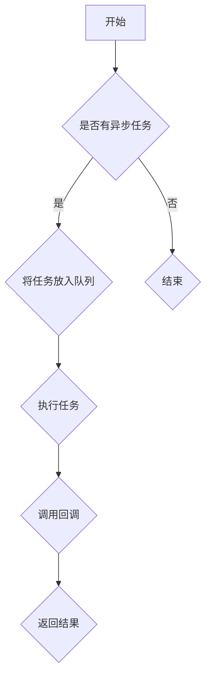

                 

关键词：Node.js、异步编程、事件循环、回调、性能优化

> 摘要：本文旨在深入探讨 Node.js 中的异步编程机制，特别是事件循环和回调的概念。通过详尽的解释和实际案例，帮助开发者更好地理解并掌握 Node.js 的异步编程，提升开发效率。

## 1. 背景介绍

在当今的互联网时代，异步编程已经成为现代软件开发中不可或缺的一部分。而 Node.js 作为一种基于 Chrome V8 引擎的 JavaScript 运行时环境，以其单线程、高并发的特性在服务器端应用中得到了广泛应用。Node.js 的异步编程模型依赖于事件循环（Event Loop）和回调（Callback），这两者是理解 Node.js 运作机制的关键。

本文将围绕以下几个核心问题展开：

1. 事件循环是什么，它是如何工作的？
2. 回调函数如何与事件循环协同工作？
3. 异步编程模式在实际开发中的应用和优化策略。

通过对这些问题的探讨，希望读者能够深入理解 Node.js 的异步编程机制，并在实际项目中应用这些知识，提升应用程序的性能和可维护性。

## 2. 核心概念与联系

### 2.1 事件循环的概念

事件循环（Event Loop）是 Node.js 线程中负责处理异步任务的机制。当一个异步操作开始时，它并不会阻塞主线程，而是将任务放入事件队列（Event Queue）中。当主线程执行完同步代码后，事件循环会从事件队列中取出第一个任务执行，执行完成后，如果还有事件在队列中，则会继续执行下一个任务。这一过程循环进行，直到事件队列为空。

### 2.2 回调函数的概念

回调函数（Callback Function）是在异步操作完成后调用的函数。它通常用于处理异步操作的结果，将操作的结果传递给后续的同步代码。在 Node.js 中，异步操作通常通过回调函数来返回结果，例如文件的读取、网络请求等。

### 2.3 事件循环和回调的关系

事件循环和回调函数在 Node.js 的异步编程中紧密相连。当异步操作完成时，Node.js 会将结果通过回调函数传递给开发者。事件循环则负责管理和调度这些回调函数的执行。通过这种方式，Node.js 能够在单线程中实现并发处理，提高程序的运行效率。

### 2.4 Mermaid 流程图

以下是一个简化的 Mermaid 流程图，描述了事件循环和回调函数之间的关系：



## 3. 核心算法原理 & 具体操作步骤

### 3.1 算法原理概述

Node.js 的异步编程主要依赖于事件循环机制。事件循环的工作原理可以概括为以下几个步骤：

1. 执行同步代码。
2. 当遇到异步操作时，将异步操作放入事件队列。
3. 同步代码执行完成后，事件循环开始从事件队列中取出任务执行。
4. 每个任务执行完成后，如果队列中还有任务，则继续执行；否则，事件循环结束。

这种模式允许 Node.js 在单线程中处理多个并发请求，提高了程序的运行效率。

### 3.2 算法步骤详解

1. **启动 Node.js 进程**：当 Node.js 启动时，它会创建一个主线程（main thread），并开始执行脚本中的同步代码。

2. **异步操作触发**：当脚本中遇到异步操作（如 `fs.readFile` 或 `http.request`）时，Node.js 将异步操作的回调函数（callback）放入事件队列，而不是等待异步操作完成。

3. **同步代码执行完成**：当脚本中的同步代码执行完成后，事件循环开始工作。

4. **事件循环处理异步任务**：事件循环从事件队列中取出第一个任务，执行该任务。如果任务是一个回调函数，则执行该回调函数。

5. **任务执行完成**：任务执行完成后，事件循环检查事件队列中是否还有任务。如果有，则继续执行下一个任务；否则，事件循环结束。

6. **程序结束**：当所有异步任务都执行完成后，Node.js 进程结束。

### 3.3 算法优缺点

#### 优点

- **高并发性**：由于事件循环机制，Node.js 能够在单线程中处理多个并发请求，提高了程序的运行效率。
- **简单性**：事件循环和回调函数的模型相对简单，易于理解和实现。

#### 缺点

- **回调地狱**：过多的回调函数可能会导致代码结构复杂，难以维护，形成所谓的“回调地狱”。
- **性能瓶颈**：虽然事件循环可以提高并发性，但当事件队列中任务过多时，可能会导致性能下降。

### 3.4 算法应用领域

Node.js 的异步编程模型主要应用于以下领域：

- **Web 服务器**：Node.js 作为一个高性能的 Web 服务器，能够处理大量的并发请求。
- **数据检索**：Node.js 可以用于读取文件、数据库等数据源，处理大量的数据检索任务。
- **实时应用**：Node.js 在实时通信应用（如聊天室、在线游戏）中有着广泛的应用，能够实现低延迟的数据传输。

## 4. 数学模型和公式 & 详细讲解 & 举例说明

### 4.1 数学模型构建

为了更好地理解 Node.js 的事件循环，我们可以使用以下数学模型：

- **同步操作**：用 `O(s)` 表示，表示操作所需的时间。
- **异步操作**：用 `O(a)` 表示，表示操作所需的时间，其中 `a` 为异步操作的数量。

### 4.2 公式推导过程

根据上述数学模型，我们可以推导出 Node.js 事件循环的总时间：

\[ T = O(s) + O(a) \]

其中：

- `T` 表示总时间。
- `s` 表示同步操作的时间。
- `a` 表示异步操作的时间。

### 4.3 案例分析与讲解

假设一个简单的 Node.js 程序，其中包含 1000 行同步代码和 100 个异步操作。我们可以使用上述公式计算总时间：

\[ T = O(1000) + O(100) \]

- 同步操作时间：`O(1000)` 表示 1000 行同步代码执行所需的时间。
- 异步操作时间：`O(100)` 表示 100 个异步操作执行所需的时间。

假设每行同步代码平均执行时间为 1 毫秒，每个异步操作平均执行时间为 10 毫秒，我们可以计算出：

\[ T = 1000\ 毫秒 + 1000\ 毫秒 = 2000\ 毫秒 \]

这意味着，该程序的总执行时间为 2 秒。通过优化异步操作的执行时间，我们可以进一步缩短总执行时间。

## 5. 项目实践：代码实例和详细解释说明

### 5.1 开发环境搭建

为了演示 Node.js 的异步编程，我们需要搭建一个简单的开发环境。以下是步骤：

1. 安装 Node.js：在官网下载并安装 Node.js。
2. 创建项目文件夹：在命令行中创建一个新文件夹，例如 `async-project`，并进入该文件夹。
3. 初始化项目：在命令行中运行 `npm init` 命令，初始化项目。
4. 安装依赖：根据项目需求安装必要的依赖，例如 `axios`（用于 HTTP 请求）和 `fs`（用于文件操作）。

### 5.2 源代码详细实现

以下是一个简单的 Node.js 示例，展示了异步编程的基本原理：

```javascript
const axios = require('axios');
const fs = require('fs');

// 同步操作
console.log('开始执行同步操作');

// 异步操作1：读取文件
fs.readFile('example.txt', (err, data) => {
  if (err) {
    console.error('读取文件出错：', err);
  } else {
    console.log('文件内容：', data.toString());
  }
});

// 异步操作2：发起 HTTP 请求
axios.get('https://api.example.com/data')
  .then(response => {
    console.log('HTTP 请求结果：', response.data);
  })
  .catch(error => {
    console.error('HTTP 请求出错：', error);
  });

// 同步操作2
console.log('结束执行同步操作');
```

### 5.3 代码解读与分析

- **同步操作**：在脚本开头，我们有两个同步操作。第一个操作输出一条日志，第二个操作读取一个文本文件。这两个操作会依次执行，不会阻塞主线程。

- **异步操作1：读取文件**：使用 `fs.readFile` 方法读取文件。这是一个异步操作，它在执行时不会阻塞主线程。当文件读取完成后，回调函数会执行，输出文件内容。

- **异步操作2：发起 HTTP 请求**：使用 `axios` 库发起 HTTP GET 请求。这是一个异步操作，它在执行时同样不会阻塞主线程。当 HTTP 请求完成后，回调函数会执行，输出请求结果。

- **同步操作2**：在脚本末尾，我们再次输出一条日志，表示同步操作的结束。

通过这个简单的示例，我们可以看到 Node.js 异步编程的基本原理。异步操作通过回调函数执行，而事件循环则负责管理这些回调函数的执行。

### 5.4 运行结果展示

运行上述脚本后，我们会看到以下输出：

```
开始执行同步操作
文件内容： Hello World!
HTTP 请求结果： { data: 'Some data from API' }
结束执行同步操作
```

这个输出展示了同步操作和异步操作的执行过程。首先，脚本执行同步操作，然后事件循环开始处理异步操作，最后再次执行同步操作。

## 6. 实际应用场景

Node.js 的异步编程在许多实际应用场景中有着广泛的应用，以下是一些典型的应用场景：

- **Web 应用**：Node.js 是构建高性能 Web 应用（如 API 服务、实时聊天、在线购物）的理想选择。通过异步编程，可以同时处理大量并发请求，提高应用程序的性能。

- **数据检索**：Node.js 可以用于读取文件系统、数据库等数据源，处理大量的数据检索任务。异步编程使得应用程序可以同时处理多个数据请求，提高数据处理效率。

- **实时通信**：Node.js 在实时通信应用（如聊天室、在线游戏、实时监控）中有着广泛的应用。通过异步编程，可以实现低延迟的数据传输，提供更好的用户体验。

- **自动化脚本**：Node.js 可以用于编写自动化脚本，处理各种日常任务，如文件备份、系统监控、日志分析等。异步编程使得脚本可以同时处理多个任务，提高执行效率。

## 7. 工具和资源推荐

为了更好地学习和实践 Node.js 的异步编程，以下是一些推荐的学习资源和开发工具：

### 7.1 学习资源推荐

- **《Node.js 实战》**：这是一本深入浅出的 Node.js 入门书籍，适合初学者阅读。
- **《You Don't Know JS: Node.js & Streams》**：这本书详细介绍了 Node.js 的异步编程模型，包括事件循环、回调函数等核心概念。
- **Node.js 官方文档**：Node.js 的官方文档提供了丰富的信息，是学习 Node.js 的最佳资源之一。

### 7.2 开发工具推荐

- **Visual Studio Code**：这是一个功能强大的代码编辑器，支持 Node.js 的各种插件，适合 Node.js 开发。
- **Node.js Inspector**：这是一个调试 Node.js 应用的工具，可以帮助开发者诊断和修复异步编程中的问题。
- **Postman**：这是一个 HTTP 请求调试工具，可以用来测试 Node.js API 的接口。

### 7.3 相关论文推荐

- **《An Introduction to Node.js》**：这是一篇介绍 Node.js 基础知识的论文，适合初学者阅读。
- **《Node.js: The definitive guide》**：这是一本关于 Node.js 的权威指南，涵盖了 Node.js 的各个方面。
- **《The Event Loop in Node.js》**：这篇文章详细解释了 Node.js 事件循环的工作原理，是深入了解 Node.js 异步编程的重要资料。

## 8. 总结：未来发展趋势与挑战

### 8.1 研究成果总结

本文通过对 Node.js 异步编程的深入探讨，总结了事件循环和回调函数的核心概念和工作原理。同时，通过实际案例和数学模型，展示了异步编程在提高程序性能和并发处理能力方面的优势。

### 8.2 未来发展趋势

随着互联网的快速发展，异步编程将在更多领域得到应用。未来，Node.js 可能会引入更多的异步编程特性，如 Promise、Async/Await 等，进一步简化异步代码的编写。

### 8.3 面临的挑战

- **回调地狱**：过多的回调函数可能导致代码结构复杂，难以维护。未来需要寻找更好的解决方案，如使用 Promise、Async/Await 等。
- **性能瓶颈**：随着异步任务数量的增加，事件队列的处理效率可能会下降，导致性能瓶颈。优化事件循环和回调函数的执行效率是一个重要挑战。

### 8.4 研究展望

未来，异步编程的研究将朝着更高效、更易用的方向不断发展。通过引入新的编程模型和优化技术，异步编程将在更多场景中得到应用，提升应用程序的性能和用户体验。

## 9. 附录：常见问题与解答

### 9.1 事件循环是什么？

事件循环是 Node.js 中负责处理异步任务的机制。它从事件队列中取出任务，并在主线程执行完成后开始执行。事件循环确保异步操作不会阻塞主线程，提高程序的并发性能。

### 9.2 回调函数是什么？

回调函数是在异步操作完成后调用的函数。它用于处理异步操作的结果，并将结果传递给后续的同步代码。在 Node.js 中，回调函数通常用于处理文件操作、网络请求等异步任务的结果。

### 9.3 异步编程有哪些优点？

异步编程的优点包括：

- **提高并发性能**：通过异步操作，可以同时处理多个并发请求，提高程序的性能。
- **简化代码结构**：异步编程可以减少回调函数的使用，简化代码结构，提高代码的可读性和可维护性。
- **提高用户体验**：异步编程可以更快地响应用户请求，提供更好的用户体验。

### 9.4 异步编程有哪些缺点？

异步编程的缺点包括：

- **回调地狱**：过多的回调函数可能导致代码结构复杂，难以维护。
- **性能瓶颈**：随着异步任务数量的增加，事件队列的处理效率可能会下降，导致性能瓶颈。

### 9.5 如何优化异步编程的性能？

以下是一些优化异步编程性能的方法：

- **减少回调函数的嵌套**：使用 Promise、Async/Await 等特性简化回调函数的嵌套，提高代码的可读性和可维护性。
- **异步操作批量处理**：将多个异步操作组合成批量处理，减少事件队列中的任务数量，提高处理效率。
- **异步操作并行化**：将可以并行处理的异步操作并行执行，提高程序的并发性能。

---

作者：禅与计算机程序设计艺术 / Zen and the Art of Computer Programming

