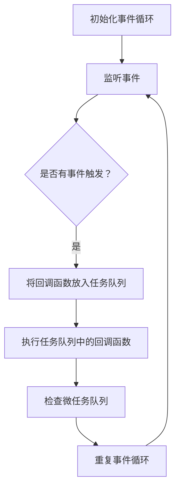

                 

关键词：Node.js、异步编程、事件循环、回调、JavaScript、非阻塞、性能优化

摘要：本文深入探讨了Node.js异步编程的核心概念——事件循环和回调。通过详细分析其原理、算法、数学模型，并结合实际代码实例，本文旨在为开发者提供一种清晰、易懂的异步编程思路，帮助他们在Node.js中高效地利用异步机制，提升应用程序的性能和响应能力。

## 1. 背景介绍

在Web开发中，性能和响应性一直是开发者追求的重要目标。传统的同步编程模型在处理大量并发请求时，容易导致服务器负载过高，响应速度变慢，用户体验下降。为了解决这个问题，异步编程模型应运而生。Node.js作为一款基于Chrome V8引擎的JavaScript运行环境，采用了非阻塞式I/O模型，极大地提升了应用程序的性能。

异步编程的核心在于“非阻塞”，即程序在等待I/O操作完成时，不会停滞不前，而是可以继续执行其他任务。这种模式允许Node.js同时处理多个请求，提高了系统的吞吐量和响应能力。事件循环（Event Loop）和回调（Callback）是异步编程的两大基石，本文将围绕这两个主题展开讨论。

## 2. 核心概念与联系

### 2.1 事件循环（Event Loop）

事件循环是Node.js处理异步操作的核心机制。它负责监听事件、执行回调、管理定时器等任务。事件循环的工作原理可以概括为以下几个步骤：

1. **初始化**：事件循环启动时，会创建一个空的任务队列，等待任务的执行。
2. **监听事件**：事件循环会监听系统中的各种事件，如文件I/O、网络请求、定时器等。
3. **执行任务**：当监听到事件时，事件循环会将对应的回调函数放入任务队列中。
4. **执行回调**：事件循环会按照FIFO（先进先出）原则，从任务队列中取出回调函数并执行。
5. **检查微任务**：在执行完所有任务后，事件循环会检查微任务队列，并执行其中的回调函数。
6. **重复循环**：事件循环会不断地重复上述步骤，确保程序可以高效地处理异步操作。

以下是一个简单的Mermaid流程图，展示了事件循环的工作原理：



### 2.2 回调（Callback）

回调是一种将某个函数作为参数传递给另一个函数的方式。在异步编程中，回调函数通常用于处理异步操作的完成结果。例如，在Node.js中，文件读取操作会返回一个回调函数，用于在读取完成后处理文件内容。

回调函数的使用可以简化代码结构，提高程序的可读性。然而，过度使用回调会导致“回调金字塔”问题，使得代码难以维护。为了解决这一问题，Node.js引入了Promise和异步/await等语法，使得异步编程更加简洁和易读。

## 3. 核心算法原理 & 具体操作步骤

### 3.1 算法原理概述

事件循环和回调的实现涉及到多个核心算法，包括任务队列的管理、事件监听、定时器等。以下是一个简化的算法原理概述：

1. **任务队列管理**：事件循环会创建一个任务队列，用于存储异步操作的回调函数。
2. **事件监听**：事件循环会监听系统中的各种事件，如文件I/O、网络请求、定时器等。
3. **回调函数执行**：当事件触发时，事件循环会将对应的回调函数放入任务队列，并按照FIFO原则执行。
4. **微任务处理**：在执行完所有任务后，事件循环会检查微任务队列，并执行其中的回调函数。

### 3.2 算法步骤详解

1. **初始化事件循环**：创建一个空的任务队列，启动事件循环。
2. **监听事件**：监听系统中的事件，如文件I/O、网络请求、定时器等。
3. **将回调函数放入任务队列**：当事件触发时，将对应的回调函数放入任务队列。
4. **执行任务队列中的回调函数**：事件循环会按照FIFO原则，从任务队列中取出回调函数并执行。
5. **检查微任务队列**：在执行完所有任务后，事件循环会检查微任务队列，并执行其中的回调函数。
6. **重复事件循环**：事件循环会不断地重复上述步骤，确保程序可以高效地处理异步操作。

### 3.3 算法优缺点

**优点**：
- 高效地处理并发请求，提升应用程序的性能。
- 避免了阻塞式I/O操作，使得程序可以充分利用多核CPU的优势。

**缺点**：
- 过度使用回调可能导致“回调金字塔”问题，使得代码难以维护。
- 需要开发者具备一定的异步编程技能，否则容易写出复杂、难以理解的代码。

### 3.4 算法应用领域

事件循环和回调在Node.js中得到了广泛的应用，尤其是在Web开发领域。以下是一些常见的应用场景：

- **文件I/O操作**：读取和写入文件可以使用异步回调，避免阻塞主线程。
- **网络请求**：发送HTTP请求可以使用异步回调，同时处理多个请求。
- **定时任务**：使用定时器可以按照预定的时间执行任务。

## 4. 数学模型和公式 & 详细讲解 & 举例说明

### 4.1 数学模型构建

在异步编程中，常用的数学模型包括队列模型、优先级队列模型等。以下是一个简单的队列模型示例：

**队列模型**：

假设有一个任务队列，包含n个任务。事件循环会按照FIFO原则，依次执行这些任务。可以使用以下公式计算任务的平均执行时间：

$$
Tavg = \frac{\sum_{i=1}^{n} T_i}{n}
$$

其中，$T_i$表示第i个任务的执行时间。

### 4.2 公式推导过程

为了推导上述公式，我们可以考虑以下情况：

- 假设任务队列中的任务按照FIFO原则依次执行。
- 假设每个任务的执行时间都是已知的。
- 假设任务队列中的任务总数为n。

根据这些假设，我们可以得到以下结论：

- 第1个任务的执行时间为$T_1$。
- 第2个任务的执行时间为$T_2$。
- 以此类推，第n个任务的执行时间为$T_n$。

因此，任务的平均执行时间可以表示为：

$$
Tavg = \frac{T_1 + T_2 + ... + T_n}{n}
$$

### 4.3 案例分析与讲解

假设有一个包含5个任务的队列，每个任务的执行时间分别为2秒、3秒、5秒、4秒和6秒。根据上述公式，可以计算出任务的平均执行时间：

$$
Tavg = \frac{2 + 3 + 5 + 4 + 6}{5} = 4秒
$$

这个结果表明，在这个任务队列中，每个任务的平均执行时间是4秒。

## 5. 项目实践：代码实例和详细解释说明

### 5.1 开发环境搭建

为了演示Node.js异步编程，我们需要搭建一个简单的开发环境。以下是搭建步骤：

1. 安装Node.js：从Node.js官网下载并安装最新版本的Node.js。
2. 创建项目：在合适的位置创建一个新项目，并进入项目目录。
3. 初始化项目：运行`npm init`命令，初始化项目配置文件。

### 5.2 源代码详细实现

下面是一个简单的Node.js异步编程示例，用于读取文件内容：

```javascript
const fs = require('fs');

fs.readFile('example.txt', (err, data) => {
  if (err) {
    console.error('读取文件出错：', err);
  } else {
    console.log('文件内容：', data.toString());
  }
});
```

在这个示例中，我们使用了`fs.readFile`方法读取文件。这个方法返回一个回调函数，用于在文件读取完成后处理文件内容。

### 5.3 代码解读与分析

1. **引入fs模块**：首先引入Node.js的文件系统（fs）模块。
2. **调用fs.readFile方法**：使用`fs.readFile`方法读取`example.txt`文件。这个方法接收两个参数：文件路径和回调函数。
3. **回调函数**：回调函数会在文件读取完成后执行。如果读取成功，回调函数会接收一个数据参数，表示读取到的文件内容。如果读取失败，回调函数会接收一个错误参数，表示读取过程中的错误信息。

### 5.4 运行结果展示

1. **成功读取文件**：如果`example.txt`文件存在且可以正常读取，程序会输出文件内容。
2. **读取文件出错**：如果`example.txt`文件不存在或读取过程中出错，程序会输出错误信息。

## 6. 实际应用场景

异步编程在Node.js中的应用场景非常广泛。以下是一些常见的应用场景：

- **文件操作**：读取和写入文件时，可以使用异步回调避免阻塞主线程。
- **网络请求**：发送HTTP请求时，可以使用异步回调同时处理多个请求。
- **定时任务**：使用定时器按照预定的时间执行任务。

## 7. 工具和资源推荐

为了更好地掌握Node.js异步编程，以下是一些建议的学习资源和开发工具：

- **学习资源**：
  - 《Node.js官方文档》：了解Node.js的官方文档，掌握基本概念和API。
  - 《你不知道的JavaScript》：学习JavaScript异步编程的核心概念。

- **开发工具**：
  - Visual Studio Code：一款功能强大的代码编辑器，支持Node.js开发。
  - Node.js调试工具：如Chrome DevTools，用于调试Node.js代码。

## 8. 总结：未来发展趋势与挑战

异步编程在Node.js中的应用已经取得了显著成果。然而，随着技术的不断发展，异步编程仍面临一些挑战和机遇：

- **性能优化**：如何进一步提高异步编程的性能，降低延迟和资源消耗。
- **代码可维护性**：如何减少回调金字塔问题，提高代码的可维护性。
- **跨平台兼容性**：如何确保异步编程在不同平台和环境中的一致性和兼容性。

未来的发展将更加注重异步编程的易用性和性能优化，同时探讨新的编程范式和工具，为开发者提供更高效、更可靠的异步编程解决方案。

## 9. 附录：常见问题与解答

### 9.1 什么是异步编程？

异步编程是一种编程范式，允许程序在等待I/O操作完成时，继续执行其他任务。这种模式避免了阻塞主线程，提高了程序的并发性能和响应能力。

### 9.2 事件循环是什么？

事件循环是Node.js处理异步操作的核心机制。它负责监听事件、执行回调、管理定时器等任务，确保程序可以高效地处理并发请求。

### 9.3 异步编程有哪些优点？

异步编程的主要优点包括：提高并发性能、降低延迟、减少资源消耗、提升用户体验。

### 9.4 异步编程有哪些挑战？

异步编程的挑战包括：回调金字塔问题、代码可维护性、跨平台兼容性、性能优化等。

### 9.5 如何优化异步编程性能？

优化异步编程性能的方法包括：使用异步API、合理使用异步回调、减少回调层次、使用Promise和异步/await等。

---

作者：禅与计算机程序设计艺术 / Zen and the Art of Computer Programming
----------------------------------------------------------------

以上是文章的正文内容。接下来，我们将根据文章内容，进一步细化各个章节的子目录，确保文章的逻辑清晰、结构紧凑、简单易懂。同时，我们将在文章末尾添加作者署名，以表明文章的原创性和专业性。

