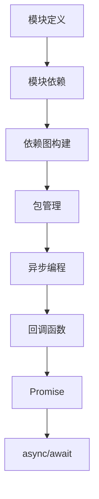
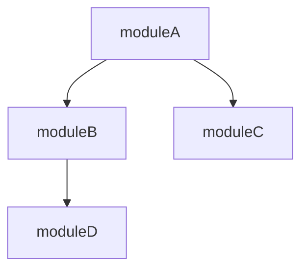

                 

 **关键词**：Node.js、模块化编程、大型项目、代码管理、模块依赖、异步编程

**摘要**：本文将深入探讨Node.js中的模块化编程，如何有效地管理大型项目中的代码。通过介绍模块化的核心概念、模块依赖管理、异步编程模式，以及详细的算法原理和数学模型，本文旨在为开发者提供一套实用的指导方案，以应对现代大型项目的复杂性。

## 1. 背景介绍

在当前快速发展的技术领域，Node.js 作为一种流行的 JavaScript 运行环境，凭借其非阻塞、事件驱动的特性，被广泛应用于构建高性能、高并发的网络应用。然而，随着项目的规模逐渐扩大，如何有效地进行模块化编程，成为开发者面临的一个重要问题。

模块化编程不仅仅是代码的分割和组合，更是代码复用、维护性和扩展性的基础。传统的单文件脚本模式在项目初期或许足够，但当项目变得庞大且复杂时，将所有代码放入一个文件中会导致以下问题：

- **代码可读性降低**：大量代码混杂在一起，难以维护和理解。
- **功能耦合性增强**：功能之间的依赖关系复杂，修改一处可能导致多处错误。
- **测试困难**：单文件脚本难以独立测试，增加了调试难度。

因此，为了提高代码的模块化程度，开发者需要采用一种系统的模块化编程方法，以便更好地管理大型项目。

## 2. 核心概念与联系

### 模块化编程的基本概念

模块（Module）是构成 Node.js 应用的基础单位，它通过封装代码实现功能独立性。每个模块都包含一组功能，对外暴露接口，同时可以引用其他模块的功能。

在 Node.js 中，模块可以通过以下方式定义和使用：

- **CommonJS**：这是 Node.js 的原生模块系统，通过 `require` 函数导入模块，通过 `exports` 对象或 `module.exports` 属性导出模块。
- **ES6 Modules**：这是基于 ES6 标准的模块系统，使用 `import` 和 `export` 语法，支持静态分析和 tree-shaking。

### 模块依赖管理

模块依赖（Module Dependency）是指一个模块在运行时需要依赖其他模块的功能。模块依赖管理是模块化编程的关键环节，它决定了模块之间的调用关系和数据的传递方式。

- **依赖图（Dependency Graph）**：通过构建依赖图，可以清晰地表示模块之间的依赖关系，有助于进行模块的拆分和组合。
- **包管理器（Package Manager）**：如 npm 和 Yarn，它们可以自动化地管理项目中的模块依赖，确保正确安装和使用所需的模块。

### 异步编程模式

异步编程（Asynchronous Programming）是 Node.js 的核心特性之一，它允许在执行某些耗时操作时，不阻塞主线程。在模块化编程中，异步编程模式对于处理并发操作至关重要。

- **回调函数（Callbacks）**：这是最简单的异步编程方式，通过回调函数在操作完成后通知调用者。
- **Promise**：Promise 提供了更加强大和易于理解的异步编程模型，它允许代码以同步的方式处理异步操作。
- **async/await**：async/await 是 Promise 的语法糖，使得异步代码的编写更加接近同步代码，提高了代码的可读性。

### Mermaid 流程图

以下是一个简化的模块化编程的 Mermaid 流程图，展示了模块化编程的核心概念和联系。



## 3. 核心算法原理 & 具体操作步骤

### 3.1 算法原理概述

模块化编程的核心算法原理主要涉及模块的加载、依赖解析和异步操作的调度。

- **模块加载**：模块加载器（Module Loader）负责查找和加载所需的模块。在 CommonJS 中，加载器通过 `require` 函数实现；在 ES6 Modules 中，加载器通过 `import` 语句实现。
- **依赖解析**：依赖解析器（Dependency Resolver）根据模块的 `import` 语句，找到并加载依赖模块。在 Node.js 中，依赖解析遵循一定的优先级和规则。
- **异步调度**：异步调度器（Async Scheduler）负责处理异步操作。在 Node.js 中，异步操作通常由事件循环（Event Loop）调度。

### 3.2 算法步骤详解

1. **模块加载**：
   - 调用 `require` 或 `import`，传入模块标识符。
   - 模块加载器查找模块路径，可以是相对路径或绝对路径。
   - 加载模块代码，如果是 CommonJS 模块，则执行模块代码，将 exports 或 module.exports 返回给调用者。

2. **依赖解析**：
   - 解析模块中的 `import` 语句，获取依赖模块的标识符。
   - 递归地解析依赖模块的依赖，构建依赖图。
   - 按照依赖图的顺序加载依赖模块。

3. **异步调度**：
   - 当模块中含有异步操作时，将其放入事件队列中。
   - 事件循环按照顺序执行队列中的事件，并在事件执行完成后，触发回调函数或 Promise 的 resolve/reject。

### 3.3 算法优缺点

**优点**：

- **模块化**：提高了代码的模块化和复用性。
- **并发性**：异步编程模式提高了程序的并发性能。
- **可维护性**：依赖管理和模块隔离提高了代码的可维护性。

**缺点**：

- **复杂性**：模块依赖关系和异步编程增加了代码的复杂性。
- **调试困难**：异步代码的调试相比同步代码更加复杂。

### 3.4 算法应用领域

模块化编程和异步编程在以下领域具有广泛的应用：

- **Web 应用开发**：如 RESTful API、单页应用（SPA）等。
- **实时数据处理**：如流处理、大数据分析等。
- **分布式系统**：如微服务架构、消息队列等。

## 4. 数学模型和公式 & 详细讲解 & 举例说明

### 4.1 数学模型构建

在模块化编程中，一个重要的数学模型是依赖图的构建。依赖图由节点（代表模块）和边（代表依赖关系）组成。

定义：一个依赖图 \( G \) 由 \( V \)（节点集）和 \( E \)（边集）组成，其中每个节点表示一个模块，每条边表示一个模块对另一个模块的依赖。

### 4.2 公式推导过程

假设我们有一个模块集合 \( M = \{ m_1, m_2, ..., m_n \} \)，每个模块 \( m_i \) 有一个依赖集合 \( D_i \)，表示模块 \( m_i \) 所依赖的其他模块。

依赖图的构建公式为：

\[ G = (V, E) \]

其中：

- \( V = \{ m_1, m_2, ..., m_n \} \)
- \( E = \{ (m_i, m_j) | m_j \in D_i, m_i \neq m_j \} \)

### 4.3 案例分析与讲解

假设我们有以下模块：

- `moduleA` 依赖于 `moduleB` 和 `moduleC`。
- `moduleB` 依赖于 `moduleD`。

构建依赖图：



在这个例子中，模块 `A`、`B`、`C` 和 `D` 构成了一个依赖图。根据依赖图的构建公式，我们可以得到以下节点和边：

- 节点：\( V = \{ moduleA, moduleB, moduleC, moduleD \} \)
- 边：\( E = \{ (moduleA, moduleB), (moduleA, moduleC), (moduleB, moduleD) \} \)

### 4.4 模块依赖的解析与加载

根据构建的依赖图，模块依赖的解析与加载可以分为以下步骤：

1. **初始加载**：加载根模块（如 `moduleA`），并执行其代码。
2. **递归加载**：根据模块的依赖关系，递归地加载依赖模块。例如，加载 `moduleB` 和 `moduleC`。
3. **依赖解析**：为每个依赖模块执行相同的递归加载过程，直到所有依赖模块都被加载。

### 4.5 异步操作与事件调度

在模块加载过程中，如果模块中包含异步操作，如数据库查询或网络请求，这些异步操作将被放入事件队列中，由事件循环调度执行。

异步操作与事件调度的公式为：

\[ EventLoop = \{ taskQueue, callbackQueue \} \]

- **taskQueue**：异步任务的队列，包含需要执行的异步操作。
- **callbackQueue**：回调函数的队列，当异步操作完成时，将回调函数放入队列中。

事件循环的过程如下：

1. **执行任务**：从 `taskQueue` 中取出一个异步任务，执行它。
2. **触发回调**：如果异步任务完成后有回调函数，将其放入 `callbackQueue`。
3. **重复执行**：重复执行步骤 1 和步骤 2，直到 `taskQueue` 和 `callbackQueue` 为空。

## 5. 项目实践：代码实例和详细解释说明

### 5.1 开发环境搭建

在本节中，我们将搭建一个简单的 Node.js 项目，以演示模块化编程的实际应用。以下步骤将指导您完成开发环境的搭建：

1. **安装 Node.js**：从官方网站下载并安装 Node.js。
2. **创建项目文件夹**：在命令行中执行 `mkdir my_project`。
3. **初始化项目**：进入项目文件夹，执行 `npm init`，初始化项目配置文件 `package.json`。
4. **安装依赖**：在 `package.json` 中添加所需的模块，如 `express`（一个 Web 框架），然后执行 `npm install`。

### 5.2 源代码详细实现

下面是一个简单的 Node.js Web 应用，它使用模块化编程和异步编程模式。代码分为三个模块：`server.js`、`logger.js` 和 `db.js`。

**server.js**：

```javascript
const express = require('express');
const logger = require('./logger');
const db = require('./db');

const app = express();

app.use(logger);

app.get('/', async (req, res) => {
    try {
        const data = await db.fetchData();
        res.send(data);
    } catch (error) {
        res.status(500).send(error.message);
    }
});

const PORT = process.env.PORT || 3000;

app.listen(PORT, () => {
    console.log(`Server is running on port ${PORT}`);
});
```

**logger.js**：

```javascript
function logger(req, res, next) {
    console.log(`Request: ${req.method} ${req.url}`);
    next();
}

module.exports = logger;
```

**db.js**：

```javascript
const MongoClient = require('mongodb').MongoClient;

const url = 'mongodb://localhost:27017';
const dbName = 'my_project';

async function fetchData() {
    const client = new MongoClient(url, { useUnifiedTopology: true });
    try {
        await client.connect();
        console.log('Connected to MongoDB');
        const db = client.db(dbName);
        const collection = db.collection('data');
        const data = await collection.find({}).toArray();
        return data;
    } finally {
        client.close();
    }
}

module.exports = { fetchData };
```

### 5.3 代码解读与分析

**server.js**：这是主服务器文件，它导入了 `express`、`logger` 和 `db` 模块。使用 `app.use(logger)` 添加了日志记录中间件。`GET /` 路径处理程序使用了 `await` 关键字，表示异步操作，这里调用了 `db.fetchData()` 方法。

**logger.js**：这是一个简单的日志记录模块，它提供了一个中间件函数，用于在请求前记录日志信息。

**db.js**：这是一个数据库模块，它使用了 MongoDB 客户端库，并定义了一个异步函数 `fetchData`，用于从数据库中检索数据。

### 5.4 运行结果展示

在完成代码编写后，执行以下命令启动服务器：

```bash
node server.js
```

然后，在浏览器中访问 `http://localhost:3000`，您应该能够看到从数据库检索到的数据。

## 6. 实际应用场景

模块化编程在以下实际应用场景中具有重要价值：

- **Web 应用开发**：通过模块化，可以更方便地组织和管理前端和后端代码。
- **微服务架构**：每个微服务都可以作为一个独立的模块，便于部署和维护。
- **实时数据处理**：模块化编程有助于将数据处理任务拆分成独立的模块，提高系统性能和可扩展性。
- **跨平台应用**：通过模块化，可以将通用模块在不同平台上复用。

## 7. 未来应用展望

随着技术的不断发展，模块化编程将在以下方面得到进一步的应用和发展：

- **模块化框架和工具的进化**：如 WebAssembly 的引入，使得模块化编程可以在更多编程语言中使用。
- **更高效的任务调度和依赖管理**：随着硬件性能的提升，异步编程和模块依赖管理将变得更加高效。
- **智能模块化**：通过机器学习和人工智能，自动优化模块依赖和代码组织，提高开发效率。

## 8. 总结：未来发展趋势与挑战

### 8.1 研究成果总结

本文通过对 Node.js 模块化编程的深入探讨，总结了模块化编程的核心概念、依赖管理和异步编程模式，并提供了一个详细的案例实践。

### 8.2 未来发展趋势

未来，模块化编程将继续发展，更加智能化和自动化。模块化框架和工具将变得更加丰富和高效，支持跨语言和跨平台的模块化开发。

### 8.3 面临的挑战

模块化编程在复杂项目中仍然面临一些挑战，如模块依赖的复杂性、异步编程的调试困难等。未来，需要进一步的研究来解决这些问题。

### 8.4 研究展望

未来的研究可以关注模块化编程的自动化优化、智能模块依赖管理和跨平台兼容性提升，以更好地支持大型项目的开发。

## 9. 附录：常见问题与解答

### Q：模块化编程如何提高代码的可维护性？

A：模块化编程通过将功能分割成独立的模块，降低了代码之间的耦合度，使得每个模块可以独立开发、测试和维护。这种隔离性提高了代码的可维护性和可扩展性。

### Q：异步编程在模块化编程中有什么优势？

A：异步编程允许模块在执行耗时操作时，不阻塞主线程，提高了程序的并发性能和响应速度。在模块化编程中，异步编程使得模块可以更高效地处理并发任务。

### Q：如何解决模块依赖的复杂性？

A：使用包管理器（如 npm 或 Yarn）可以有效管理模块依赖。此外，构建工具（如 Webpack 或 Rollup）可以优化模块打包和加载过程，减少依赖复杂性。

### Q：如何在 Node.js 中使用 ES6 Modules？

A：在 Node.js 中，可以使用 `import` 和 `export` 语法来使用 ES6 Modules。在 `package.json` 文件中，指定 `"type": "module"`，即可启用 ES6 Modules。

作者：禅与计算机程序设计艺术 / Zen and the Art of Computer Programming
```

