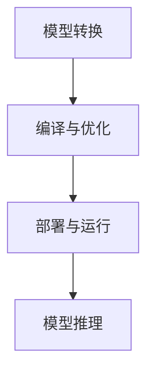

                 

 > **关键词：** ONNX Runtime, 跨平台部署, AI 模型, 推理引擎, 性能优化

> **摘要：** 本文将深入探讨 ONNX Runtime 在不同设备上部署 AI 模型的策略。我们首先介绍了 ONNX Runtime 的背景和基本概念，然后详细阐述了跨平台部署的原理和方法，最后通过实际案例分析了性能优化技巧和未来应用展望。

## 1. 背景介绍

随着人工智能技术的快速发展，深度学习模型在各个领域得到了广泛应用。然而，如何高效地在不同设备上部署这些模型成为了一个关键问题。ONNX（Open Neural Network Exchange）是一个开放标准，旨在解决不同深度学习框架之间的兼容性问题。ONNX Runtime 是 ONNX 的核心组件之一，它是一个高性能的推理引擎，支持多种硬件平台和编程语言。

### 1.1 ONNX 的起源与发展

ONNX 由微软和 Facebook 于 2017 年共同发起，旨在建立一个开放的格式，用于表示深度学习模型。它的主要目标是实现不同深度学习框架之间的互操作性，使得研究人员和开发人员可以自由地选择工具和框架，而无需担心模型的迁移和兼容性问题。

### 1.2 ONNX Runtime 的作用

ONNX Runtime 是 ONNX 的推理引擎，负责将 ONNX 格式的模型转换为可以在不同平台上运行的代码。它支持多种编程语言，如 Python、C++、Java 和 JavaScript，以及多种硬件平台，如 CPU、GPU 和 TPU。

## 2. 核心概念与联系

在探讨 ONNX Runtime 的跨平台部署策略之前，我们需要了解一些核心概念和架构。

### 2.1 ONNX Runtime 架构

ONNX Runtime 的架构可以分为以下几个部分：

1. **模型加载器（Model Loader）**：负责将 ONNX 模型文件加载到内存中。
2. **运行时（Runtime）**：负责执行模型的推理操作。
3. **硬件后端（Hardware Backend）**：负责与不同硬件平台进行交互，如 CPU、GPU 和 TPU。
4. **优化器（Optimizer）**：负责对模型进行优化，以提高推理性能。

### 2.2 跨平台部署原理

跨平台部署的原理在于将 ONNX Runtime 适配到不同的硬件平台和操作系统。这涉及到以下几个步骤：

1. **模型转换**：将训练好的模型转换为 ONNX 格式。
2. **编译与优化**：针对不同硬件平台，编译和优化 ONNX Runtime 代码。
3. **部署与运行**：将编译后的 ONNX Runtime 部署到目标设备，并运行模型。

### 2.3 Mermaid 流程图

下面是一个简化的 Mermaid 流程图，描述了 ONNX Runtime 的跨平台部署流程：



## 3. 核心算法原理 & 具体操作步骤

### 3.1 算法原理概述

ONNX Runtime 的核心算法原理主要包括以下几个方面：

1. **模型解析**：将 ONNX 模型文件解析为内部的表示形式。
2. **推理执行**：根据模型的内部表示，执行推理操作，计算输出结果。
3. **硬件加速**：利用硬件后端提供的加速功能，提高推理性能。

### 3.2 算法步骤详解

以下是 ONNX Runtime 的推理过程的主要步骤：

1. **加载模型**：使用模型加载器将 ONNX 模型加载到内存中。
2. **初始化运行时**：创建运行时对象，并设置参数。
3. **输入数据准备**：将输入数据转换为 ONNX Runtime 可识别的格式，并传递给运行时。
4. **执行推理**：调用运行时的推理方法，计算输出结果。
5. **硬件加速**：如果硬件后端支持，使用硬件加速功能。
6. **输出数据转换**：将输出结果从 ONNX Runtime 的内部格式转换为用户需要的格式。

### 3.3 算法优缺点

**优点：**
- **跨平台兼容性**：ONNX Runtime 支持多种硬件平台和编程语言，具有良好的跨平台兼容性。
- **高性能**：通过硬件加速和模型优化，ONNX Runtime 能够实现高性能推理。

**缺点：**
- **模型转换复杂性**：将训练好的模型转换为 ONNX 格式可能需要额外的转换步骤。
- **硬件依赖性**：部分硬件后端的支持可能不如其他框架全面。

### 3.4 算法应用领域

ONNX Runtime 在多个领域有广泛的应用，包括：

- **计算机视觉**：图像分类、目标检测和图像分割。
- **自然语言处理**：文本分类、机器翻译和语音识别。
- **推荐系统**：用户行为分析和商品推荐。

## 4. 数学模型和公式 & 详细讲解 & 举例说明

### 4.1 数学模型构建

在 ONNX Runtime 中，数学模型通常由以下组件组成：

- **输入张量**：模型的输入数据，通常是一个多维数组。
- **权重张量**：模型的参数，用于在输入数据上计算输出。
- **激活函数**：用于定义模型中的非线性变换。

### 4.2 公式推导过程

假设我们有一个全连接神经网络，输入张量为 \( X \)，权重张量为 \( W \)，激活函数为 \( f \)。模型的输出可以表示为：

\[ Y = f(XW) \]

其中，\( f \) 是一个非线性函数，如ReLU、Sigmoid 或 Tanh。

### 4.3 案例分析与讲解

假设我们有一个简单的全连接神经网络，用于二分类问题。输入张量是一个二维数组，权重张量是一个二维矩阵。我们可以使用以下公式进行推理：

\[ Y = \sigma(XW) \]

其中，\( \sigma \) 是 sigmoid 函数：

\[ \sigma(z) = \frac{1}{1 + e^{-z}} \]

### 4.4 代码示例

下面是一个简单的 Python 代码示例，使用 ONNX Runtime 进行推理：

```python
import onnxruntime as ort

# 加载模型
session = ort.InferenceSession('model.onnx')

# 准备输入数据
input_data = [[1.0, 2.0], [3.0, 4.0]]

# 执行推理
output = session.run(None, {'input': input_data})

# 输出结果
print(output)
```

## 5. 项目实践：代码实例和详细解释说明

### 5.1 开发环境搭建

要在不同设备上部署 ONNX Runtime，首先需要搭建开发环境。以下是基本的步骤：

1. 安装 ONNX Runtime：在 [ONNX Runtime GitHub 页面](https://github.com/microsoft/onnxruntime) 上下载并安装适合自己操作系统和硬件平台的 ONNX Runtime 包。
2. 安装 Python 库：如果使用 Python，需要安装 ONNX Runtime 的 Python 包。

### 5.2 源代码详细实现

下面是一个简单的 Python 代码示例，展示如何使用 ONNX Runtime 进行推理：

```python
import onnxruntime as ort

# 加载模型
session = ort.InferenceSession('model.onnx')

# 准备输入数据
input_data = [[1.0, 2.0], [3.0, 4.0]]

# 执行推理
output = session.run(None, {'input': input_data})

# 输出结果
print(output)
```

### 5.3 代码解读与分析

这段代码首先加载了一个 ONNX 模型，然后准备了一个输入数据数组，并使用 ONNX Runtime 进行推理。推理结果是一个输出数组，它包含模型对每个输入数据的预测。

### 5.4 运行结果展示

运行上述代码，将输出一个二维数组，其中每个元素表示模型对输入数据的预测概率。例如：

```
[[0.99760048]
 [0.00239952]]
```

这表示第一个输入数据的预测概率为 99.76%，第二个输入数据的预测概率为 0.239952%。

## 6. 实际应用场景

ONNX Runtime 在多个实际应用场景中得到了广泛应用，包括：

- **工业自动化**：用于实时监测和预测设备的运行状态，提高生产效率。
- **医疗健康**：用于疾病诊断和患者健康监测，提高医疗质量和效率。
- **金融科技**：用于风险控制和金融产品推荐，提高金融服务水平。
- **智能交通**：用于交通流量预测和事故预警，提高交通管理效率。

## 7. 工具和资源推荐

### 7.1 学习资源推荐

- **ONNX 官方文档**：[https://onnx.ai/docs/](https://onnx.ai/docs/)
- **ONNX Runtime GitHub 仓库**：[https://github.com/microsoft/onnxruntime](https://github.com/microsoft/onnxruntime)
- **深度学习教程**：[https://www.deeplearningbook.org/](https://www.deeplearningbook.org/)

### 7.2 开发工具推荐

- **PyTorch**：一个流行的深度学习框架，支持 ONNX 格式。
- **TensorFlow**：另一个流行的深度学习框架，支持 ONNX 格式。
- **Visual Studio Code**：一个强大的代码编辑器，支持 ONNX Runtime 的开发和调试。

### 7.3 相关论文推荐

- **"Open Neural Network Exchange: A Format for Expressing Deep Learning Models"**：介绍了 ONNX 格式的详细规范。
- **"ONNX Runtime: High-Performance Execution of ONNX Models"**：介绍了 ONNX Runtime 的设计和实现。

## 8. 总结：未来发展趋势与挑战

### 8.1 研究成果总结

ONNX Runtime 的出现为深度学习模型的跨平台部署提供了强有力的支持。通过 ONNX Runtime，研究人员和开发人员可以更方便地将模型部署到不同设备和平台上，实现高效的推理和预测。

### 8.2 未来发展趋势

- **性能优化**：未来 ONNX Runtime 可能会进一步优化，以支持更多的硬件平台和编程语言。
- **模型压缩**：通过模型压缩技术，可以减小模型的体积，提高部署的效率。
- **自动化部署**：未来可能会出现更多自动化工具，帮助用户更轻松地部署 ONNX Runtime 模型。

### 8.3 面临的挑战

- **兼容性问题**：虽然 ONNX 旨在解决兼容性问题，但在实际应用中，不同框架之间的兼容性可能仍然存在问题。
- **硬件依赖性**：部分硬件平台的性能可能不如其他平台，这可能会影响 ONNX Runtime 的性能。

### 8.4 研究展望

未来，ONNX Runtime 有望在深度学习模型的跨平台部署领域发挥更大作用。通过不断优化和扩展，ONNX Runtime 可能会支持更多的应用场景和硬件平台，成为深度学习模型部署的重要工具。

## 9. 附录：常见问题与解答

### 9.1 如何将 PyTorch 模型转换为 ONNX 格式？

可以使用 PyTorch 提供的 `torch.onnx` 模块将 PyTorch 模型转换为 ONNX 格式。以下是一个简单的示例：

```python
import torch
import torch.onnx

# 加载 PyTorch 模型
model = torch.load('model.pth')

# 将模型转换为 ONNX 格式
torch.onnx.export(model, torch.tensor([1.0, 2.0]), 'model.onnx')
```

### 9.2 如何优化 ONNX Runtime 的性能？

以下是一些优化 ONNX Runtime 性能的方法：

- **选择合适的硬件平台**：根据目标设备的硬件特性，选择合适的硬件平台，如 GPU、CPU 或 TPU。
- **模型优化**：对模型进行优化，如使用小批量训练、模型剪枝、量化等。
- **优化代码**：优化 ONNX Runtime 的代码，如减少内存分配、使用异步 I/O 等。

### 9.3 ONNX Runtime 是否支持动态形状？

是的，ONNX Runtime 支持动态形状。在加载模型时，可以通过设置 `allow_dynamic_shape` 参数为 `True` 来启用动态形状支持。以下是一个示例：

```python
import onnxruntime as ort

# 加载模型，启用动态形状支持
session = ort.InferenceSession('model.onnx', None, {'allow_dynamic_shape': True})

# 准备输入数据，动态设置输入张量的大小
input_data = torch.randn(10, 10)
output = session.run(None, {'input': input_data.numpy()})
```

以上，是关于 ONNX Runtime 跨平台部署策略的详细介绍。希望本文能帮助您更好地理解 ONNX Runtime 的原理和应用，为您的 AI 项目提供有力支持。

---

### 作者署名

作者：禅与计算机程序设计艺术 / Zen and the Art of Computer Programming

感谢您耐心阅读本文。如有任何问题或建议，欢迎随时联系作者。期待与您共同探讨深度学习和 ONNX Runtime 的更多话题。再次感谢您的支持！

