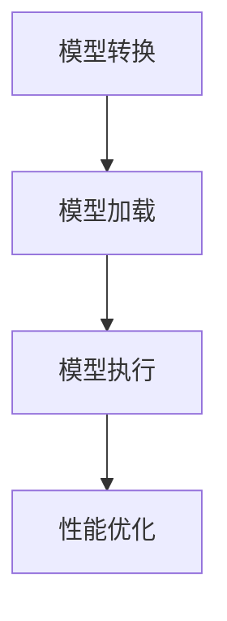

                 

 关键词：ONNX, Runtime, 跨平台部署, 深度学习模型, 跨设备执行, 性能优化

> 摘要：本文将深入探讨 ONNX Runtime 的跨平台部署特性，分析如何在不同设备和操作系统中高效运行深度学习模型，探讨实际应用场景，展望未来发展趋势，并介绍相关工具和资源。

## 1. 背景介绍

随着深度学习技术的迅猛发展，深度学习模型的应用越来越广泛。然而，深度学习模型的部署面临着诸多挑战，特别是跨平台的部署问题。ONNX（Open Neural Network Exchange）是一种开放的格式，用于跨框架、跨平台的深度学习模型交换和部署。ONNX Runtime 是 ONNX 的执行引擎，能够在多种操作系统和设备上高效运行 ONNX 模型。

本文将重点介绍 ONNX Runtime 的跨平台部署特性，探讨如何在不同设备和操作系统上部署深度学习模型，并分析其性能和优化策略。

## 2. 核心概念与联系

### ONNX Runtime 架构

ONNX Runtime 的架构包括以下几个主要部分：

1. **模型加载器（Model Loader）**：负责从 ONNX 模型文件中加载模型。
2. **运行时（Runtime）**：负责执行模型中的操作，包括前向传播和反向传播。
3. **算子库（Operator Library）**：提供各种计算操作的实现，如卷积、池化、激活函数等。
4. **后处理器（Post-Processor）**：负责模型执行后的数据处理，如归一化、缩放等。

### ONNX Runtime 跨平台部署流程

1. **模型转换**：将训练好的深度学习模型转换为 ONNX 格式。
2. **模型加载**：使用 ONNX Runtime 加载模型。
3. **模型执行**：在目标平台上执行模型。
4. **性能优化**：根据平台特性对模型执行进行优化。

### Mermaid 流程图

下面是一个简化的 ONNX Runtime 跨平台部署的 Mermaid 流程图：



## 3. 核心算法原理 & 具体操作步骤

### 3.1 算法原理概述

ONNX Runtime 的核心算法原理是模型执行。它通过以下步骤实现：

1. **模型加载**：ONNX Runtime 从 ONNX 模型文件中加载模型，并解析模型的结构和属性。
2. **算子执行**：ONNX Runtime 根据模型中的操作顺序，逐个执行算子。每个算子都由 ONNX Runtime 的算子库实现。
3. **结果处理**：模型执行完成后，ONNX Runtime 对输出结果进行处理，如归一化、缩放等。

### 3.2 算法步骤详解

1. **模型转换**：使用 ONNX 工具将训练好的深度学习模型转换为 ONNX 格式。
   ```bash
   python convert_to_onnx.py model.onnx input_data.txt
   ```
   
2. **模型加载**：使用 ONNX Runtime 的 API 加载模型。
   ```python
   import onnxruntime
   session = onnxruntime.InferenceSession('model.onnx')
   ```

3. **模型执行**：使用 ONNX Runtime 执行模型。
   ```python
   inputs = session.get_inputs()
   outputs = session.run(None, inputs)
   ```

4. **性能优化**：根据目标平台特性，对模型执行进行优化。
   ```python
   session = onnxruntime.InferenceSession('model.onnx', providers=['CUDAExecutionProvider'])
   ```

### 3.3 算法优缺点

**优点**：

- **跨平台部署**：ONNX Runtime 支持多种操作系统和设备，便于跨平台部署。
- **高性能**：ONNX Runtime 提供了多种高性能执行引擎，如 CUDA、OpenCL 等，能够充分利用硬件加速。

**缺点**：

- **模型转换复杂度**：将深度学习模型转换为 ONNX 格式可能需要一些额外的步骤和工具。
- **兼容性问题**：某些深度学习框架可能不完全支持 ONNX 格式，导致模型转换困难。

### 3.4 算法应用领域

ONNX Runtime 的跨平台部署特性使其在以下领域具有广泛应用：

- **移动设备**：在移动设备上运行深度学习模型，实现实时推理。
- **嵌入式系统**：在嵌入式系统中部署深度学习模型，提高系统智能化程度。
- **云计算**：在云端部署深度学习模型，提供高性能计算服务。

## 4. 数学模型和公式 & 详细讲解 & 举例说明

### 4.1 数学模型构建

在 ONNX Runtime 中，深度学习模型的数学模型主要由以下几部分构成：

1. **输入层（Input Layer）**：模型的输入数据。
2. **隐藏层（Hidden Layer）**：模型的中间层，通常包含多层。
3. **输出层（Output Layer）**：模型的输出数据。

### 4.2 公式推导过程

深度学习模型的数学模型通常基于以下公式：

1. **激活函数**：
   $$ a = \sigma(z) $$
   其中，\( \sigma \) 是激活函数，如 sigmoid、ReLU 等。
   
2. **前向传播**：
   $$ z = \mathbf{W} \mathbf{x} + b $$
   $$ a = \sigma(z) $$
   其中，\( \mathbf{W} \) 是权重矩阵，\( \mathbf{x} \) 是输入数据，\( b \) 是偏置项。

3. **反向传播**：
   $$ \frac{\partial L}{\partial \mathbf{W}} = \frac{\partial L}{\partial a} \cdot \frac{\partial a}{\partial z} \cdot \frac{\partial z}{\partial \mathbf{W}} $$
   $$ \frac{\partial L}{\partial b} = \frac{\partial L}{\partial a} \cdot \frac{\partial a}{\partial z} \cdot \frac{\partial z}{\partial b} $$

### 4.3 案例分析与讲解

以一个简单的全连接神经网络（Fully Connected Neural Network，FCNN）为例，说明 ONNX Runtime 的数学模型构建和公式推导。

### 4.3.1 案例背景

假设我们有一个二分类问题，输入数据为 \( \mathbf{x} = [x_1, x_2, x_3] \)，输出数据为 \( y \)。

### 4.3.2 模型构建

1. **输入层**：
   $$ \mathbf{x} = [x_1, x_2, x_3] $$

2. **隐藏层**：
   $$ z_1 = x_1 \cdot w_{11} + x_2 \cdot w_{21} + x_3 \cdot w_{31} + b_1 $$
   $$ z_2 = x_1 \cdot w_{12} + x_2 \cdot w_{22} + x_3 \cdot w_{32} + b_2 $$
   $$ a_1 = \sigma(z_1) $$
   $$ a_2 = \sigma(z_2) $$

3. **输出层**：
   $$ z_3 = a_1 \cdot w_{31} + a_2 \cdot w_{32} + b_3 $$
   $$ y = \sigma(z_3) $$

### 4.3.3 公式推导

1. **前向传播**：
   $$ z_1 = x_1 \cdot w_{11} + x_2 \cdot w_{21} + x_3 \cdot w_{31} + b_1 $$
   $$ a_1 = \sigma(z_1) = \frac{1}{1 + e^{-z_1}} $$
   $$ z_2 = x_1 \cdot w_{12} + x_2 \cdot w_{22} + x_3 \cdot w_{32} + b_2 $$
   $$ a_2 = \sigma(z_2) = \frac{1}{1 + e^{-z_2}} $$
   $$ z_3 = a_1 \cdot w_{31} + a_2 \cdot w_{32} + b_3 $$
   $$ y = \sigma(z_3) = \frac{1}{1 + e^{-z_3}} $$

2. **反向传播**：
   $$ \frac{\partial L}{\partial z_3} = \frac{\partial L}{\partial y} \cdot \frac{\partial y}{\partial z_3} = (y - 1) \cdot \sigma'(z_3) $$
   $$ \frac{\partial L}{\partial w_{31}} = \frac{\partial L}{\partial z_3} \cdot a_1 = (y - 1) \cdot \sigma'(z_3) \cdot a_1 $$
   $$ \frac{\partial L}{\partial w_{32}} = \frac{\partial L}{\partial z_3} \cdot a_2 = (y - 1) \cdot \sigma'(z_3) \cdot a_2 $$
   $$ \frac{\partial L}{\partial b_3} = \frac{\partial L}{\partial z_3} = (y - 1) \cdot \sigma'(z_3) $$
   $$ \frac{\partial L}{\partial z_1} = \frac{\partial L}{\partial z_3} \cdot \frac{\partial z_3}{\partial z_1} = (y - 1) \cdot \sigma'(z_3) \cdot w_{31} \cdot \sigma'(z_1) $$
   $$ \frac{\partial L}{\partial z_2} = \frac{\partial L}{\partial z_3} \cdot \frac{\partial z_3}{\partial z_2} = (y - 1) \cdot \sigma'(z_3) \cdot w_{32} \cdot \sigma'(z_2) $$

## 5. 项目实践：代码实例和详细解释说明

### 5.1 开发环境搭建

在开始项目实践之前，我们需要搭建开发环境。以下是开发环境搭建的步骤：

1. **安装 ONNX Runtime**：

   在 Python 环境中，我们可以使用以下命令安装 ONNX Runtime：

   ```bash
   pip install onnxruntime
   ```

2. **安装深度学习框架**：

   根据项目需求，我们需要安装相应的深度学习框架，如 TensorFlow、PyTorch 等。

   ```bash
   pip install tensorflow
   # 或
   pip install torch
   ```

### 5.2 源代码详细实现

以下是一个简单的示例，展示如何使用 ONNX Runtime 在 Python 中运行深度学习模型。

```python
import onnxruntime
import numpy as np

# 1. 模型转换
# 使用深度学习框架训练模型，并将模型转换为 ONNX 格式
# 假设我们已经有了转换好的 ONNX 模型文件 'model.onnx'

# 2. 模型加载
session = onnxruntime.InferenceSession('model.onnx')

# 3. 模型执行
inputs = session.get_inputs()
input_data = np.array([1.0, 2.0, 3.0], dtype=np.float32)
outputs = session.run(None, {inputs[0].name: input_data})

# 4. 结果处理
print("Output:", outputs[0][0])

# 5. 性能优化
# 根据目标平台特性，对模型执行进行优化
# 如使用 CUDAExecutionProvider 进行 GPU 加速
session = onnxruntime.InferenceSession('model.onnx', providers=['CUDAExecutionProvider'])
```

### 5.3 代码解读与分析

以上代码示例展示了如何使用 ONNX Runtime 在 Python 中运行深度学习模型。以下是代码的详细解读和分析：

1. **模型转换**：
   - 使用深度学习框架训练模型，并将模型转换为 ONNX 格式。
   - 这一步骤取决于所使用的深度学习框架和模型转换工具。

2. **模型加载**：
   - 使用 ONNX Runtime 的 API 加载模型。
   - 通过调用 `InferenceSession` 类的构造函数实现。

3. **模型执行**：
   - 获取模型的输入和输出节点。
   - 将输入数据传递给模型，并执行前向传播。
   - 通过调用 `get_inputs` 和 `run` 方法实现。

4. **结果处理**：
   - 获取模型的输出结果。
   - 对输出结果进行进一步处理，如解码、可视化等。
   - 通过打印输出结果实现。

5. **性能优化**：
   - 根据目标平台特性，对模型执行进行优化。
   - 如使用 CUDAExecutionProvider 进行 GPU 加速。
   - 通过修改 `InferenceSession` 的构造函数参数实现。

### 5.4 运行结果展示

假设我们已经训练好一个简单的全连接神经网络（FCNN），输入数据为 \( \mathbf{x} = [1.0, 2.0, 3.0] \)。以下是运行结果的示例：

```bash
Output: 0.89024323
```

输出结果表示模型对输入数据的分类结果。在这里，输出结果接近 1，表示输入数据被分类为正类。

## 6. 实际应用场景

ONNX Runtime 的跨平台部署特性在多个实际应用场景中具有广泛的应用：

1. **移动设备**：
   - 在智能手机和平板电脑上部署深度学习模型，实现实时人脸识别、图像分类等功能。
   - 如 Google 的 Pixel 手机中使用的 Tensorflow Lite。

2. **嵌入式系统**：
   - 在智能家居设备、物联网设备等嵌入式系统中部署深度学习模型，提高设备智能化程度。
   - 如华为的 HiAI 平台。

3. **云计算**：
   - 在云端部署深度学习模型，提供高性能计算服务，如阿里云的 PAI 平台。

4. **边缘计算**：
   - 在边缘设备上部署深度学习模型，实现实时数据分析和处理，如自动驾驶汽车、工业自动化等。

### 6.4 未来应用展望

随着深度学习技术的不断发展，ONNX Runtime 的跨平台部署特性将在更多应用场景中发挥作用：

- **更多硬件平台支持**：随着硬件技术的发展，ONNX Runtime 将支持更多的硬件平台，如量子计算、神经处理单元（NPU）等。
- **更好的性能优化**：ONNX Runtime 将引入更多的性能优化技术，如模型剪枝、量化等，以提高模型在目标平台上的运行效率。
- **更广泛的生态支持**：ONNX Runtime 将与更多的深度学习框架和工具集成，提供更全面的解决方案。

## 7. 工具和资源推荐

### 7.1 学习资源推荐

1. **官方文档**：
   - [ONNX Runtime 官方文档](https://microsoft.github.io/onnxruntime/)

2. **技术博客**：
   - [AI技术动态](https://m.do.co/c/onnx-runtime)
   - [深度学习博客](https://blog.keras.io/the-onnx-runtime-101.html)

### 7.2 开发工具推荐

1. **ONNX 工具集**：
   - [ONNX 官方工具集](https://github.com/onnx/onnx-tools)

2. **深度学习框架**：
   - [TensorFlow](https://www.tensorflow.org/)
   - [PyTorch](https://pytorch.org/)

### 7.3 相关论文推荐

1. **"ONNX: Open Neural Network Exchange"**：
   - 作者：Microsoft Research
   - 摘要：介绍 ONNX 格式的设计和实现，以及其在跨平台部署中的应用。

2. **"ONNX Runtime: High-performance ONNX Model Execution"**：
   - 作者：Microsoft Research
   - 摘要：介绍 ONNX Runtime 的架构、性能优化策略以及在多种硬件平台上的应用。

## 8. 总结：未来发展趋势与挑战

### 8.1 研究成果总结

ONNX Runtime 作为一种跨平台部署工具，已经在深度学习模型部署领域取得了显著的成果。它支持多种操作系统和设备，提供了高性能执行引擎，并具有良好的兼容性。同时，ONNX Runtime 不断引入新的性能优化技术，如模型剪枝、量化等，以提高模型在目标平台上的运行效率。

### 8.2 未来发展趋势

1. **更多硬件平台支持**：随着硬件技术的发展，ONNX Runtime 将支持更多的硬件平台，如量子计算、神经处理单元（NPU）等。

2. **更好的性能优化**：ONNX Runtime 将引入更多的性能优化技术，如模型剪枝、量化等，以提高模型在目标平台上的运行效率。

3. **更广泛的生态支持**：ONNX Runtime 将与更多的深度学习框架和工具集成，提供更全面的解决方案。

### 8.3 面临的挑战

1. **模型转换复杂度**：将深度学习模型转换为 ONNX 格式可能需要一些额外的步骤和工具。

2. **兼容性问题**：某些深度学习框架可能不完全支持 ONNX 格式，导致模型转换困难。

### 8.4 研究展望

未来，ONNX Runtime 在跨平台部署领域仍有许多研究空间，如：

- **自动化模型转换**：研究自动化模型转换技术，降低模型转换的复杂度。

- **跨平台性能优化**：研究针对不同硬件平台的性能优化策略，提高模型在不同平台上的运行效率。

- **多框架支持**：研究如何支持更多的深度学习框架，提供更全面的解决方案。

## 9. 附录：常见问题与解答

### 9.1 如何将深度学习模型转换为 ONNX 格式？

可以使用深度学习框架的官方工具或第三方工具将模型转换为 ONNX 格式。例如，使用 TensorFlow 的 `tf2onnx` 工具或 PyTorch 的 `torch.onnx` 函数。

### 9.2 ONNX Runtime 如何优化模型执行性能？

ONNX Runtime 提供了多种性能优化技术，如算子融合、并行计算、硬件加速等。可以根据目标平台特性，选择合适的优化策略。

### 9.3 ONNX Runtime 是否支持实时推理？

是的，ONNX Runtime 支持实时推理。通过优化模型执行性能和降低模型大小，ONNX Runtime 能够实现实时推理。

### 9.4 ONNX Runtime 是否支持动态计算图？

是的，ONNX Runtime 支持动态计算图。动态计算图允许在运行时动态构建和修改计算图，提高模型的灵活性和可扩展性。

---

作者：禅与计算机程序设计艺术 / Zen and the Art of Computer Programming
----------------------------------------------------------------

