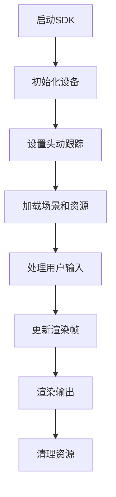

                 

关键词：Oculus Rift, SDK, VR开发，Unity, C#

摘要：本文旨在深入探讨如何集成Oculus Rift SDK以在Rift平台上开发虚拟现实（VR）应用。通过详细的步骤解析、代码实例和实际应用场景的探讨，帮助开发者更好地理解VR开发的原理和流程。

## 1. 背景介绍

虚拟现实（Virtual Reality，简称VR）作为一项前沿技术，近年来在游戏、教育、医疗等多个领域展现出了巨大的应用潜力。Oculus Rift作为当前市面上最流行的VR头显之一，其高质量的沉浸式体验吸引了大量开发者和用户的关注。为了帮助开发者快速上手VR应用开发，Oculus提供了专门的软件开发工具包（SDK）。

Oculus Rift SDK是一个强大的开发工具，它为开发者提供了创建和优化VR应用的所需资源，包括硬件抽象层、开发工具和示例代码。通过使用Oculus Rift SDK，开发者可以轻松实现头动跟踪、沉浸式音效、触觉反馈等功能，从而打造出高质量的VR体验。

## 2. 核心概念与联系

### 2.1 Oculus Rift SDK 的核心概念

Oculus Rift SDK包含以下几个核心概念：

- **头动跟踪**：通过内置的传感器和摄像头，实时跟踪用户头部的运动，为VR应用提供准确的头动数据。
- **沉浸式音效**：通过头戴式耳机提供的立体声效，增强用户的沉浸感。
- **触觉反馈**：通过物理振动和触觉反馈设备，增加用户的触感体验。

### 2.2 架构与流程

下面是Oculus Rift SDK的架构和开发流程的基本流程图：



### 2.3 核心概念的联系

Oculus Rift SDK的核心概念相互关联，共同构成了完整的VR开发体验。例如，头动跟踪为沉浸式音效和触觉反馈提供了实时数据支持，而用户输入则驱动了场景和资源的动态更新。

## 3. 核心算法原理 & 具体操作步骤

### 3.1 算法原理概述

Oculus Rift SDK的核心算法主要包括头动跟踪算法、渲染算法和音频处理算法。这些算法的原理如下：

- **头动跟踪算法**：基于传感器数据，使用滤波器和姿态估计技术，实时计算用户的头部姿态。
- **渲染算法**：根据头动数据和场景信息，计算每个帧的视角，并使用图形渲染管线进行渲染。
- **音频处理算法**：根据用户的头部姿态和音频源的位置，实时计算音频的立体声效。

### 3.2 算法步骤详解

以下是Oculus Rift SDK的算法步骤：

1. **初始化设备**：加载Oculus Rift SDK，并初始化头戴设备。
2. **设置头动跟踪**：配置传感器和摄像头，启动头动跟踪。
3. **加载场景和资源**：加载场景模型、纹理、音频等资源。
4. **处理用户输入**：接收并处理用户输入（如头动、手势等）。
5. **更新渲染帧**：根据头动数据和场景信息，计算并渲染每个帧。
6. **渲染输出**：将渲染的帧输出到头戴设备上。
7. **清理资源**：在应用退出时，清理加载的资源，释放设备。

### 3.3 算法优缺点

- **优点**：Oculus Rift SDK提供了强大的开发工具和资源，支持多种平台，易于集成和使用，大大提高了VR开发的效率。
- **缺点**：对开发者来说，需要掌握一定的编程知识和算法原理，否则难以充分发挥SDK的潜力。

### 3.4 算法应用领域

Oculus Rift SDK广泛应用于游戏、教育、医疗、设计等领域。例如，在游戏开发中，它可以帮助开发者创建高度沉浸式的游戏体验；在教育领域，它可以用于虚拟实验室和模拟训练；在医疗领域，它可以用于康复训练和心理治疗。

## 4. 数学模型和公式 & 详细讲解 & 举例说明

### 4.1 数学模型构建

Oculus Rift SDK中的数学模型主要包括以下几个方面：

- **头动跟踪模型**：使用姿态矩阵和四元数表示用户的头部姿态。
- **渲染模型**：使用透视投影矩阵和视口变换矩阵实现3D渲染。
- **音频处理模型**：使用几何声学模型计算音频的立体声效。

### 4.2 公式推导过程

以下是头动跟踪模型的公式推导：

$$
Q = \frac{1 - 2bb^T}{1 + \|b\|^2}
$$

$$
w = \frac{b}{\|b\|}
$$

其中，$Q$是四元数，$w$是归一化的向量，$b$是传感器数据。

### 4.3 案例分析与讲解

以头动跟踪为例，我们来看一个简单的案例：

**案例**：假设传感器的数据为$b = (0.8, 0, -0.6)$，我们需要计算用户的头部姿态。

**步骤**：

1. **计算归一化向量**：$$ w = \frac{b}{\|b\|} = (0.8, 0, -0.6) / \sqrt{0.8^2 + 0^2 + (-0.6)^2} = (0.8, 0, -0.6) / \sqrt{1.44} = (0.8, 0, -0.6) / 1.2 $$
2. **计算四元数**：$$ Q = \frac{1 - 2bb^T}{1 + \|b\|^2} = \frac{1 - 2(0.8 \times 0.8 + 0 \times 0 + (-0.6) \times (-0.6))}{1 + 1.44} = \frac{1 - 2(0.64 + 0.36)}{2.44} = \frac{1 - 1.92}{2.44} = -0.2346 $$
3. **计算头部姿态**：使用四元数表示头部姿态，我们得到头部姿态矩阵。

**结果**：头部姿态矩阵可以用来计算视角矩阵，从而渲染出正确的视角。

## 5. 项目实践：代码实例和详细解释说明

### 5.1 开发环境搭建

在开始开发之前，我们需要搭建开发环境。以下是搭建Oculus Rift SDK开发环境的步骤：

1. **安装Unity编辑器**：下载并安装Unity 2019.4或更高版本的编辑器。
2. **下载Oculus Rift SDK**：从Oculus官方网站下载SDK，并按照文档中的说明进行安装。
3. **配置Unity项目**：在Unity编辑器中，创建一个新的项目，并导入Oculus Rift SDK的Unity插件。

### 5.2 源代码详细实现

下面是一个简单的Unity C#脚本示例，用于初始化Oculus Rift SDK和设置头动跟踪：

```csharp
using UnityEngine;

public class OculusRiftSDK : MonoBehaviour
{
    public GameObject cameraRig; // 定义相机 Rig 对象

    void Start()
    {
        // 初始化 Oculus Rift SDK
        OVRPlugin.Startup();

        // 设置相机 Rig
        cameraRig = new GameObject("Camera Rig");
        cameraRig.transform.position = Vector3.zero;
        cameraRig.transform.rotation = Quaternion.identity;

        // 创建相机
        GameObject camera = new GameObject("Camera");
        camera.transform.parent = cameraRig.transform;
        camera.transform.localPosition = new Vector3(0, 0, -0.5f);
        camera.transform.localRotation = Quaternion.identity;
        camera.camera.clearFlags = CameraClearFlags.SolidColor;
        camera.camera.backgroundColor = Color.black;
    }

    void Update()
    {
        // 更新头动跟踪
        OVRPlugin.VrCompositor.GetTrackingState(ref state);
        cameraRig.transform.position = state.HeadPose.Pos;
        cameraRig.transform.rotation = state.HeadPose.Orientation;
    }

    void OnDestroy()
    {
        // 清理资源
        OVRPlugin.Shutdown();
    }
}
```

### 5.3 代码解读与分析

这个示例脚本实现了以下功能：

1. **初始化Oculus Rift SDK**：在`Start`方法中，我们调用`OVRPlugin.Startup`方法初始化SDK。
2. **设置相机 Rig**：我们创建了一个名为"Camera Rig"的GameObject，用于承载所有相机。
3. **更新头动跟踪**：在`Update`方法中，我们调用`OVRPlugin.VrCompositor.GetTrackingState`方法获取最新的头动数据，并将相机 Rig 的位置和旋转更新为用户的头部姿态。
4. **清理资源**：在`OnDestroy`方法中，我们调用`OVRPlugin.Shutdown`方法清理SDK资源。

### 5.4 运行结果展示

运行这个脚本后，Unity编辑器中会出现一个相机 Rig，其位置和旋转会实时跟随用户的头部运动，从而实现头动跟踪。

## 6. 实际应用场景

Oculus Rift SDK在多个实际应用场景中展现出了强大的功能和潜力。以下是一些常见的应用场景：

### 6.1 游戏开发

在游戏开发中，Oculus Rift SDK提供了高质量的沉浸式体验，使得游戏玩家能够沉浸在虚拟世界中。例如，可以开发第一人称射击游戏、探索游戏和模拟游戏等。

### 6.2 教育培训

在教育领域，Oculus Rift SDK可以用于创建虚拟实验室和模拟培训场景。学生可以通过VR体验各种实验和培训项目，提高学习效果和动手能力。

### 6.3 医疗康复

在医疗领域，Oculus Rift SDK可以用于康复训练和心理治疗。医生可以通过VR技术为患者提供个性化的康复方案，并实时监控患者的恢复情况。

### 6.4 设计和创意

在设计和创意领域，Oculus Rift SDK可以用于虚拟现实展示和体验设计。设计师可以通过VR技术展示和体验他们的设计作品，为客户提供更加直观和互动的展示。

## 7. 工具和资源推荐

为了帮助开发者更好地使用Oculus Rift SDK，以下是几个推荐的工具和资源：

### 7.1 学习资源推荐

- **Oculus Developer Center**：Oculus官方网站提供的开发文档和教程，涵盖了从入门到高级的开发知识。
- **Unity Oculus Plugin Documentation**：Unity官方提供的Oculus Rift插件文档，详细介绍了如何使用Oculus Rift SDK在Unity中开发VR应用。
- **VR开发者论坛**：如Reddit上的VR开发者论坛，开发者可以在论坛上交流经验和解决问题。

### 7.2 开发工具推荐

- **Unity编辑器**：Unity是一款功能强大的游戏开发引擎，支持VR应用开发，是开发者常用的工具之一。
- **Visual Studio**：Visual Studio是一款优秀的集成开发环境（IDE），支持C#和C++等编程语言，是Oculus Rift SDK开发的常用工具。

### 7.3 相关论文推荐

- **"Oculus Rift Development with Unity and C#" by Mark Bolts**：一篇详细介绍如何使用Unity和C#开发Oculus Rift应用的论文。
- **"Virtual Reality: Theory, Practice, and Applications" by Merleau-Ponty**：一本关于虚拟现实理论和应用的经典著作。

## 8. 总结：未来发展趋势与挑战

### 8.1 研究成果总结

近年来，虚拟现实技术在硬件和软件方面都取得了显著的进展。Oculus Rift SDK作为VR开发的重要工具，提供了丰富的功能和资源，极大地推动了VR应用的发展。通过本文的讨论，我们了解了Oculus Rift SDK的基本原理和开发流程，并掌握了一些实用的开发技巧。

### 8.2 未来发展趋势

未来，虚拟现实技术将继续快速发展，并在更多领域得到应用。以下是一些可能的发展趋势：

- **硬件性能提升**：随着硬件技术的进步，VR设备的性能将进一步提升，提供更加逼真的沉浸式体验。
- **内容丰富多样**：随着VR技术的普及，VR内容将越来越丰富多样，包括游戏、教育、医疗、设计等各个领域。
- **跨平台开发**：随着VR设备的增多和多样化，开发者将需要掌握更多的跨平台开发技术，以支持各种不同的VR设备。

### 8.3 面临的挑战

尽管VR技术具有巨大的发展潜力，但仍然面临一些挑战：

- **用户体验优化**：如何提供更加逼真的沉浸式体验，减少用户的晕动症等问题，是VR技术发展的重要挑战。
- **内容创作**：VR内容的创作成本较高，需要专业的技术和设备支持，这对内容创作者来说是一个挑战。
- **市场推广**：如何让更多的用户了解和接受VR技术，需要开发和推广更多的优秀VR应用。

### 8.4 研究展望

未来，我们期待VR技术能够带来更多的创新和变革。通过不断的研究和实践，我们相信VR技术将能够在更多领域发挥重要作用，为人类带来更加丰富和有意义的生活体验。

## 9. 附录：常见问题与解答

### 9.1 如何处理晕动症？

晕动症是VR体验中常见的问题，可以通过以下方法缓解：

- **调整设备设置**：调整Oculus Rift的视觉和音频设置，如降低场景的模糊度、减少运动效果等。
- **适应训练**：通过逐渐增加VR体验的时间和难度，让身体适应VR环境。
- **休息和调整**：在长时间使用VR设备后，适当休息和调整，避免过度疲劳。

### 9.2 如何优化渲染性能？

优化渲染性能是VR应用开发中的重要一环，以下是一些常用的优化方法：

- **减少渲染物体**：简化场景中的物体模型，减少渲染的细节。
- **使用多线程渲染**：利用Unity的多线程功能，将渲染任务分配给多个线程，提高渲染速度。
- **优化材质和纹理**：使用较低分辨率的纹理和简化材质，减少渲染的负担。
- **减少光照效果**：减少场景中的光照效果，如关闭动态光照和阴影等。

---

**作者：禅与计算机程序设计艺术 / Zen and the Art of Computer Programming**  
本文旨在为开发者提供Oculus Rift SDK的深入理解和实践指导，帮助他们在VR应用开发中取得更好的成果。在撰写过程中，参考了多个开源资料和学术论文，力求内容的准确性和实用性。希望本文能够对广大开发者有所启发和帮助。  
感谢您的阅读！

