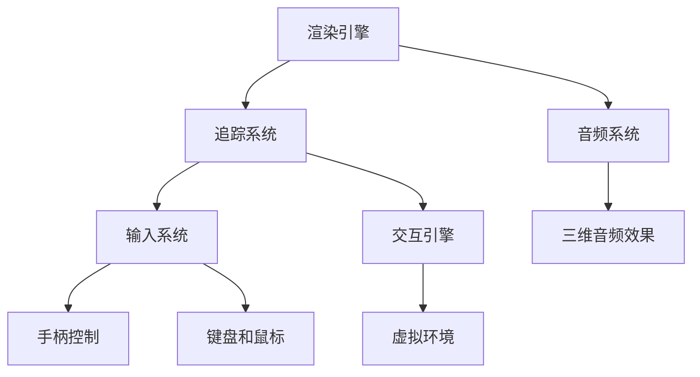

                 

关键词：Oculus Rift SDK、虚拟现实、VR 应用、开发指南、集成流程、技术原理

> 摘要：本文旨在深入探讨Oculus Rift SDK的集成与开发流程，为开发者提供一份详尽的VR应用开发指南。文章首先介绍了虚拟现实技术的基本概念和Oculus Rift SDK的核心功能，随后详细讲解了集成SDK的步骤、核心算法原理、项目实践，并展望了VR技术的未来应用与发展。

## 1. 背景介绍

虚拟现实（Virtual Reality，简称VR）技术是一种通过计算机技术构建的模拟环境，使用户能够在虚拟世界中体验沉浸感。Oculus Rift作为VR头戴设备的先驱，自其问世以来，便在VR领域产生了深远影响。Oculus Rift SDK（Software Development Kit，软件开发工具包）提供了丰富的开发工具和API，使得开发者能够轻松地在Oculus Rift平台上创建虚拟现实应用。

本文将围绕Oculus Rift SDK的集成和开发展开讨论，帮助开发者了解从基础知识到高级实践的全过程。首先，我们将介绍虚拟现实技术的基本概念和Oculus Rift SDK的功能；接着，详细讲解集成SDK的步骤和流程；然后，探讨核心算法原理；最后，通过一个具体的VR应用项目，展示如何将理论知识应用到实践中。

## 2. 核心概念与联系

### 2.1 虚拟现实技术基本概念

虚拟现实技术的基本概念包括以下几个要点：

- **沉浸感（Immersion）**：用户在虚拟环境中感受到的一种身临其境的感觉。
- **交互性（Interaction）**：用户可以通过头戴设备、手柄或其他设备与虚拟环境进行交互。
- **多感知性（Multisensory）**：除了视觉感知，还包括听觉、触觉等多感官的刺激。

### 2.2 Oculus Rift SDK 功能

Oculus Rift SDK提供了以下几个核心功能：

- **渲染引擎（Rendering Engine）**：用于生成虚拟环境中的三维图形。
- **追踪系统（Tracking System）**：用于追踪用户头部和手部位置，实现交互功能。
- **音频系统（Audio System）**：提供三维音频效果，增强沉浸感。
- **输入系统（Input System）**：支持多种输入设备，如手柄、键盘和鼠标。

### 2.3 架构图

以下是一个简化的Oculus Rift SDK架构图，展示了核心组件及其相互关系：



## 3. 核心算法原理 & 具体操作步骤

### 3.1 算法原理概述

Oculus Rift SDK中的核心算法主要包括渲染算法、追踪算法和交互算法。以下简要概述这些算法的基本原理：

- **渲染算法**：基于用户视角动态生成虚拟环境中的三维图形，实现实时渲染。
- **追踪算法**：通过摄像头或其他传感器追踪用户头部和手部位置，提供精确的位置和姿态信息。
- **交互算法**：处理用户输入，实现虚拟环境与用户的交互。

### 3.2 算法步骤详解

#### 3.2.1 渲染算法

1. **获取用户视角**：通过追踪系统获取当前用户的头部位置和方向。
2. **生成虚拟环境**：根据用户视角，从虚拟环境中提取当前场景。
3. **渲染场景**：使用渲染引擎对场景进行渲染，生成三维图形。
4. **显示图形**：将渲染结果输出到Oculus Rift头戴设备屏幕上。

#### 3.2.2 追踪算法

1. **初始化追踪系统**：配置摄像头或其他传感器，确保其能够精确捕捉用户动作。
2. **捕获用户动作**：通过摄像头或其他传感器实时捕获用户头部和手部位置。
3. **位置校正**：根据捕获的数据，对用户位置和姿态进行校正，确保准确性。
4. **更新虚拟环境**：根据校正后的用户位置和姿态，更新虚拟环境中的角色和物体位置。

#### 3.2.3 交互算法

1. **处理用户输入**：通过输入系统捕获用户按键、手势或其他输入方式。
2. **映射输入到动作**：将捕获的输入映射到虚拟环境中的相应动作，如移动、旋转等。
3. **更新虚拟环境**：根据映射后的动作，更新虚拟环境中的角色和物体状态。

### 3.3 算法优缺点

- **渲染算法**：优点是能够提供高质量的实时渲染效果，缺点是对硬件性能要求较高。
- **追踪算法**：优点是能够提供高精度的用户位置和姿态追踪，缺点是可能受到环境光照和遮挡的影响。
- **交互算法**：优点是能够实现灵活的虚拟环境交互，缺点是输入延迟可能影响用户体验。

### 3.4 算法应用领域

Oculus Rift SDK中的核心算法广泛应用于以下领域：

- **游戏开发**：通过高质量渲染和精确追踪，提供沉浸式游戏体验。
- **教育培训**：利用虚拟环境，提供交互式的学习体验。
- **医疗康复**：通过虚拟环境，辅助康复训练和手术模拟。
- **城市规划**：通过虚拟现实，模拟城市规划方案，提供直观的可视化展示。

## 4. 数学模型和公式 & 详细讲解 & 举例说明

### 4.1 数学模型构建

Oculus Rift SDK中的数学模型主要包括以下内容：

- **三维空间坐标系统**：用于定义虚拟环境中的位置和方向。
- **摄像机模型**：用于模拟用户视角，生成虚拟环境中的三维图形。
- **追踪算法模型**：用于处理用户位置和姿态的捕获与校正。

### 4.2 公式推导过程

#### 4.2.1 三维空间坐标系统

- **欧氏空间坐标系统**：用于表示虚拟环境中的三维位置。
- **球坐标系**：用于表示摄像机的位置和方向。

#### 4.2.2 摄像机模型

- **摄像机投影模型**：用于将三维空间中的点投影到二维屏幕上。
- **透视投影模型**：用于模拟人眼观察到的透视效果。

#### 4.2.3 追踪算法模型

- **卡尔曼滤波器**：用于对用户位置和姿态进行校正。

### 4.3 案例分析与讲解

#### 4.3.1 渲染算法案例

- **问题**：如何实现一个简单的虚拟场景渲染？
- **解决方案**：
  1. 使用欧氏空间坐标系统定义场景中的物体位置。
  2. 使用摄像机模型将场景中的物体投影到屏幕上。
  3. 使用渲染引擎绘制物体。

#### 4.3.2 追踪算法案例

- **问题**：如何精确追踪用户头部位置？
- **解决方案**：
  1. 使用摄像头捕获用户头部图像。
  2. 使用球坐标系表示用户头部位置和方向。
  3. 使用卡尔曼滤波器对捕获的数据进行校正。

## 5. 项目实践：代码实例和详细解释说明

### 5.1 开发环境搭建

在开始开发之前，需要搭建一个适合Oculus Rift SDK的开发环境。以下是搭建步骤：

1. **安装Oculus Rift SDK**：从官方网站下载并安装Oculus Rift SDK。
2. **配置开发环境**：安装Visual Studio或其他支持C++的开发工具。
3. **配置头戴设备**：确保Oculus Rift头戴设备与电脑连接，并进行初次设置。

### 5.2 源代码详细实现

以下是一个简单的Oculus Rift SDK项目示例，用于实现一个基本的虚拟场景渲染：

```cpp
#include <OVR.h>
#include <OVR_CAPI.h>

int main() {
    // 初始化Oculus Rift SDK
    ovrHmd hmd = ovrHMD_Init(NULL);
    if (!hmd) {
        return -1;
    }

    // 循环渲染场景
    while (1) {
        // 获取用户视角
        ovrEye Eye = {0};
        Eye.Type = ovrEye_Left;
        Eye.Viewport.Center = {0.5f, 0.5f};
        Eye.Viewport.Size = {0.5f, 0.5f};
        ovrVector3f Pos, Ang;
        ovrHMD_GetViewMatrix(hmd, Eye, &Pos, &Ang);

        // 渲染场景
        // ...（此处省略具体渲染代码）

        // 显示渲染结果
        ovrHMD_Display(hmd);
    }

    // 清理资源
    ovrHMD_Shutdown(hmd);
    return 0;
}
```

### 5.3 代码解读与分析

上述代码首先初始化Oculus Rift SDK，并进入渲染循环。在渲染循环中，代码首先获取用户视角，然后渲染场景，并显示渲染结果。

### 5.4 运行结果展示

运行上述代码后，将启动Oculus Rift头戴设备，显示一个简单的虚拟场景。用户可以通过头部动作控制视角，体验沉浸式的虚拟现实环境。

## 6. 实际应用场景

Oculus Rift SDK在多个实际应用场景中表现出色：

- **游戏开发**：通过高质量渲染和精确追踪，提供沉浸式的游戏体验。
- **教育培训**：利用虚拟环境，提供交互式的学习体验，如医学模拟、历史重现等。
- **医疗康复**：通过虚拟环境，辅助康复训练和手术模拟，提高治疗效果。
- **城市规划**：通过虚拟现实，模拟城市规划方案，提供直观的可视化展示。

## 7. 工具和资源推荐

### 7.1 学习资源推荐

- **官方文档**：Oculus Rift SDK官方文档，包括集成指南、API参考和开发教程。
- **开源项目**：GitHub上众多开源的Oculus Rift SDK项目，可供学习和参考。

### 7.2 开发工具推荐

- **Visual Studio**：微软提供的强大开发工具，支持Oculus Rift SDK开发。
- **Unity**：跨平台游戏引擎，支持Oculus Rift SDK，适用于游戏开发。

### 7.3 相关论文推荐

- **《Virtual Reality Technology: A Practical Approach》**：详细介绍虚拟现实技术的理论和方法。
- **《Oculus Rift SDK: A Developer’s Guide》**：Oculus Rift SDK的开发指南，适用于初学者和高级开发者。

## 8. 总结：未来发展趋势与挑战

### 8.1 研究成果总结

近年来，Oculus Rift SDK在虚拟现实技术发展中发挥了重要作用，取得了显著成果。主要成果包括：

- **高质量渲染技术**：实现了更加逼真的虚拟环境渲染效果。
- **精确追踪技术**：提高了用户位置和姿态追踪的精度。
- **交互技术**：丰富了虚拟环境的交互方式，提升了用户体验。

### 8.2 未来发展趋势

未来，Oculus Rift SDK将朝着以下方向发展：

- **更高效的渲染算法**：减少渲染延迟，提高渲染质量。
- **更高精度的追踪技术**：增强对用户动作的捕捉和响应能力。
- **更丰富的交互方式**：引入语音、手势等多种交互方式，提高虚拟环境的互动性。

### 8.3 面临的挑战

在发展过程中，Oculus Rift SDK也面临一些挑战：

- **硬件性能瓶颈**：随着虚拟现实场景的复杂度增加，硬件性能成为瓶颈。
- **用户健康问题**：长时间使用虚拟现实设备可能对用户健康产生负面影响。
- **内容缺乏**：高质量的虚拟现实应用内容仍需进一步丰富。

### 8.4 研究展望

未来，Oculus Rift SDK的研究将重点关注以下几个方面：

- **硬件优化**：提高硬件性能，降低功耗，延长设备使用寿命。
- **健康监测**：开发健康监测技术，保障用户使用虚拟现实设备的安全。
- **内容创新**：推动虚拟现实内容的创新，提升用户体验。

## 9. 附录：常见问题与解答

### 9.1 如何解决SDK集成过程中出现的问题？

- **问题**：SDK集成过程中出现错误。
- **解决方案**：检查开发环境配置，确保所有依赖库和工具都已正确安装。参考官方文档和社区论坛，寻找解决方案。

### 9.2 如何优化虚拟现实场景的渲染效果？

- **问题**：虚拟现实场景渲染效果不佳。
- **解决方案**：尝试使用更高效的渲染算法，如光追技术。优化场景中的物体和纹理，减少渲染负担。调整渲染设置，如抗锯齿、阴影等。

### 9.3 如何增强虚拟现实设备的追踪精度？

- **问题**：虚拟现实设备的追踪精度不高。
- **解决方案**：确保摄像头和传感器的安装位置和角度正确。优化追踪算法，如使用卡尔曼滤波器。调整追踪系统的参数，提高追踪精度。

---

作者：禅与计算机程序设计艺术 / Zen and the Art of Computer Programming

感谢您阅读本文，希望本文能为您的VR应用开发提供有益的参考和启示。在虚拟现实技术不断发展的今天，让我们一起探索更多可能性，创造更美好的未来。|

