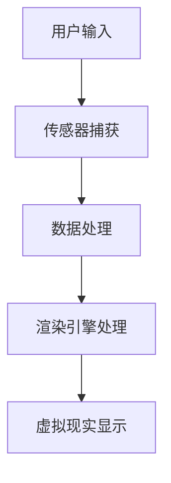

                 

关键词：Oculus Rift SDK、VR 开发、虚拟现实、软件开发、开发工具、开发者指南

> 摘要：本文将深入探讨 Oculus Rift SDK 的使用，为开发者提供在 Rift 平台上开发 VR 体验的全面指南，从基础搭建到高级实践，助您轻松驾驭 VR 开发。

## 1. 背景介绍

Oculus Rift 是一款由 Oculus VR 开发的虚拟现实头戴式显示器。它利用高分辨率的屏幕和低延迟的头动追踪技术，为用户提供了一种沉浸式的虚拟体验。Oculus Rift SDK（软件开发工具包）是 Oculus 提供的一套开发工具，旨在帮助开发者创建各种虚拟现实体验，从简单的互动式演示到复杂的游戏和应用。

### 1.1 虚拟现实技术简介

虚拟现实（VR）是一种计算机仿真技术，通过头戴式显示器或其他设备，将用户带入一个由计算机生成的三维虚拟世界。VR 技术的快速发展，为教育、娱乐、医疗、军事等领域带来了新的可能性。

### 1.2 Oculus Rift SDK 介绍

Oculus Rift SDK 是一套全面的开发工具，它包括：

- **Oculus 运行时**：确保应用程序在 Rift 头戴设备上正常运行。
- **Oculus 工具**：用于创建和测试 VR 应用。
- **示例项目**：演示如何使用 SDK 开发 VR 应用。
- **文档和教程**：提供详细的开发指南。

### 1.3 软件开发工具包（SDK）的重要性

SDK 为开发者提供了必要的工具和资源，使得 VR 应用开发变得更加高效和便捷。通过使用 SDK，开发者可以专注于实现创意和功能，而无需从零开始构建底层系统。

## 2. 核心概念与联系

在 VR 开发中，理解以下几个核心概念和它们的相互关系至关重要。

### 2.1 虚拟现实硬件与软件

- **硬件**：包括 Oculus Rift 头戴设备、手柄、外部传感器等。
- **软件**：包括 VR 应用程序、驱动程序、SDK 等。

### 2.2 渲染引擎与 VR 应用

- **渲染引擎**：如 Unity、Unreal Engine，用于创建和管理三维场景。
- **VR 应用**：基于渲染引擎开发的具体 VR 体验。

### 2.3 传感器与头动追踪

- **传感器**：如陀螺仪、加速度计，用于检测用户的头动。
- **头动追踪**：将用户的头部运动映射到虚拟世界中，实现沉浸式体验。

### 2.4 Mermaid 流程图

## 3. 核心算法原理 & 具体操作步骤

### 3.1 算法原理概述

在 VR 开发中，核心算法主要包括：

- **三维渲染算法**：用于创建和管理三维虚拟场景。
- **头动追踪算法**：将用户的头部运动转换为虚拟世界的视角变换。

### 3.2 算法步骤详解

#### 3.2.1 三维渲染算法

1. **场景构建**：使用渲染引擎创建三维场景。
2. **光照和材质**：设置场景的光照和材质属性。
3. **相机设置**：定义虚拟摄像机的参数。
4. **渲染循环**：根据用户输入和传感器数据，实时渲染场景。

#### 3.2.2 头动追踪算法

1. **传感器数据读取**：从传感器获取用户的头部位置和方向。
2. **姿态估计**：使用传感器数据计算用户的头部姿态。
3. **视角更新**：根据用户姿态更新虚拟摄像机的视角。

### 3.3 算法优缺点

- **优点**：高沉浸感、实时交互、丰富的应用场景。
- **缺点**：硬件成本较高、对开发者的要求较高。

### 3.4 算法应用领域

VR 技术广泛应用于：

- **游戏**：提供沉浸式的游戏体验。
- **教育**：模拟历史场景、科学实验等。
- **医疗**：进行虚拟手术训练、心理治疗等。
- **军事**：模拟战场环境、飞行模拟等。

## 4. 数学模型和公式 & 详细讲解 & 举例说明

### 4.1 数学模型构建

在 VR 开发中，常用的数学模型包括：

- **三维空间坐标系**：定义虚拟世界的空间结构。
- **矩阵运算**：实现三维空间中的变换操作。
- **向量运算**：用于描述方向和大小。

### 4.2 公式推导过程

#### 4.2.1 三维空间坐标系

- **笛卡尔坐标系**：\(x, y, z\) 坐标轴。
- **球坐标系**：\(\rho, \theta, \phi\) 坐标轴。

#### 4.2.2 矩阵运算

- **变换矩阵**：实现物体在三维空间中的变换。
- **矩阵乘法**：实现多个变换的叠加。

### 4.3 案例分析与讲解

#### 4.3.1 头动追踪

- **公式**：头动追踪的公式涉及传感器数据、姿态估计和视角更新。
- **实现**：使用 Unity 渲染引擎实现头动追踪功能。

## 5. 项目实践：代码实例和详细解释说明

### 5.1 开发环境搭建

- **系统要求**：确保开发环境满足 Oculus Rift SDK 的要求。
- **安装步骤**：安装 Oculus Rift SDK 和 Unity 渲染引擎。

### 5.2 源代码详细实现

- **代码结构**：详细说明项目的目录结构和代码结构。
- **关键代码**：展示实现核心功能的代码片段。

### 5.3 代码解读与分析

- **代码功能**：分析代码实现的具体功能。
- **优化建议**：提供代码优化的建议。

### 5.4 运行结果展示

- **运行环境**：展示项目的运行环境。
- **运行结果**：展示项目运行后的效果。

## 6. 实际应用场景

### 6.1 游戏开发

- **沉浸式游戏**：利用 Oculus Rift SDK 开发沉浸式游戏。
- **多人在线游戏**：实现多人在线互动。

### 6.2 教育培训

- **虚拟实验室**：模拟实验室环境，进行虚拟实验。
- **历史重现**：重现历史事件，提供沉浸式的学习体验。

### 6.3 医疗应用

- **虚拟手术训练**：模拟手术过程，提高手术技能。
- **心理治疗**：利用 VR 技术进行心理治疗。

### 6.4 未来应用展望

- **社交互动**：利用 VR 技术进行远程社交互动。
- **虚拟现实广告**：提供沉浸式的广告体验。

## 7. 工具和资源推荐

### 7.1 学习资源推荐

- **官方文档**：Oculus Rift SDK 的官方文档。
- **在线教程**：各种 VR 开发的在线教程和课程。

### 7.2 开发工具推荐

- **Unity 渲染引擎**：用于 VR 应用开发。
- **Unreal Engine**：用于高端 VR 游戏开发。

### 7.3 相关论文推荐

- **VR 技术发展**：研究 VR 技术的最新进展。
- **VR 算法优化**：探讨 VR 开发中的算法优化。

## 8. 总结：未来发展趋势与挑战

### 8.1 研究成果总结

- **技术进步**：VR 技术不断进步，性能和用户体验持续提升。
- **应用拓展**：VR 技术在各个领域的应用日益广泛。

### 8.2 未来发展趋势

- **硬件升级**：更高分辨率、更低延迟的 VR 硬件。
- **软件创新**：更多的 VR 应用场景和功能。

### 8.3 面临的挑战

- **硬件成本**：VR 硬件价格较高，限制普及。
- **开发者需求**：VR 开发需要较高的技术门槛。

### 8.4 研究展望

- **跨领域融合**：VR 技术与其他领域的结合，带来更多创新。
- **教育普及**：降低 VR 开发的门槛，普及 VR 技术教育。

## 9. 附录：常见问题与解答

### 9.1 如何搭建开发环境？

- **步骤1**：检查系统要求。
- **步骤2**：下载并安装 Oculus Rift SDK。
- **步骤3**：安装 Unity 渲染引擎。

### 9.2 如何优化 VR 应用性能？

- **优化1**：减少渲染物体。
- **优化2**：使用适当的纹理和材质。

---

作者：禅与计算机程序设计艺术 / Zen and the Art of Computer Programming

本文作者对 Oculus Rift SDK 的深入研究和实践经验，为开发者提供了全面、系统的 VR 开发指南，从基础搭建到高级实践，为您轻松驾驭 VR 开发提供了有力支持。随着 VR 技术的不断进步和应用领域的拓展，相信本文将为您在 VR 领域的研究和实践提供宝贵的参考和启示。|<|html_format|>

