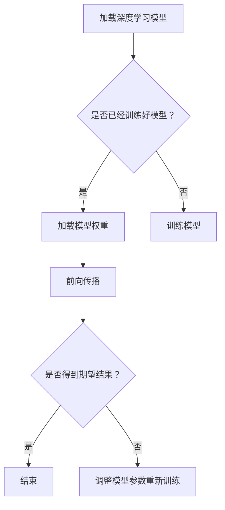

                 

关键词：OpenCV，DNN模块，深度学习，模型集成，图像识别，神经网络，计算机视觉

> 摘要：本文将深入探讨OpenCV中的DNN模块，详细介绍深度学习模型在OpenCV中的快速集成方法，包括核心概念、算法原理、数学模型、具体实现以及实际应用等，旨在为读者提供一套完整的深度学习模型集成指南。

## 1. 背景介绍

随着深度学习技术的迅速发展，其在计算机视觉、自然语言处理、语音识别等领域的应用越来越广泛。OpenCV（Open Source Computer Vision Library）作为一个强大的计算机视觉库，也不断更新和完善，引入了DNN（Deep Neural Network）模块，使得深度学习模型的集成变得更加简单和高效。

OpenCV的DNN模块提供了一个简洁的API，使得用户可以轻松地将深度学习模型集成到OpenCV中，进行图像识别、目标检测等任务。本文将围绕OpenCV DNN模块，探讨其核心概念、算法原理、数学模型以及具体实现。

## 2. 核心概念与联系

### 2.1 核心概念

- **深度神经网络（DNN）**：一种多层神经网络，通过前向传播和反向传播算法进行训练，可以用于处理复杂的非线性问题。
- **卷积神经网络（CNN）**：一种特殊类型的深度神经网络，常用于图像识别和图像处理。
- **深度学习框架**：用于构建、训练和优化深度学习模型的软件框架，如TensorFlow、PyTorch等。

### 2.2 深度学习与计算机视觉的联系

深度学习在计算机视觉领域有着广泛的应用，如：

- **图像分类**：将图像划分为预定义的类别。
- **目标检测**：在图像中识别和定位特定的对象。
- **人脸识别**：识别图像中的人脸并标注其位置。

### 2.3 Mermaid 流程图

下面是一个描述深度学习模型在OpenCV中集成的Mermaid流程图：



## 3. 核心算法原理 & 具体操作步骤

### 3.1 算法原理概述

深度学习模型的核心是神经网络，包括输入层、隐藏层和输出层。在训练过程中，通过反向传播算法不断调整网络中的权重，以最小化损失函数，使得模型能够对输入数据进行准确的预测。

### 3.2 算法步骤详解

- **加载深度学习模型**：使用OpenCV DNN模块的API加载预训练的深度学习模型。
- **前向传播**：将图像数据输入到模型中，通过前向传播计算得到模型的输出。
- **损失函数计算**：计算输出结果与真实值之间的差异，得到损失函数的值。
- **反向传播**：根据损失函数的梯度信息，通过反向传播算法更新模型的权重。
- **模型评估**：在测试集上评估模型的性能，包括准确率、召回率等指标。

### 3.3 算法优缺点

- **优点**：深度学习模型具有强大的表征能力和泛化能力，能够处理复杂的图像任务。
- **缺点**：训练深度学习模型需要大量的数据和计算资源，训练时间较长。

### 3.4 算法应用领域

深度学习模型在计算机视觉领域有着广泛的应用，如：

- **图像分类**：如物体识别、场景分类等。
- **目标检测**：如车辆检测、人脸检测等。
- **图像生成**：如风格迁移、图像修复等。

## 4. 数学模型和公式 & 详细讲解 & 举例说明

### 4.1 数学模型构建

深度学习模型的数学模型主要包括：

- **输入层**：接收外部输入的数据。
- **隐藏层**：进行特征提取和变换。
- **输出层**：产生最终的输出结果。

### 4.2 公式推导过程

深度学习模型的训练过程主要包括：

- **前向传播**：根据输入数据和模型参数，计算输出结果。
- **损失函数计算**：计算输出结果与真实值之间的差异。
- **反向传播**：根据损失函数的梯度信息，更新模型参数。

### 4.3 案例分析与讲解

假设我们有一个简单的图像分类任务，需要将图像划分为猫和狗两个类别。我们可以使用一个简单的卷积神经网络进行训练。

输入层：大小为 \(28 \times 28\) 的图像数据。

隐藏层：使用两个卷积层和两个全连接层。

输出层：大小为 1 的输出层，用于预测图像的类别。

损失函数：交叉熵损失函数。

在训练过程中，我们需要使用大量的猫和狗的图像数据，通过训练迭代，不断调整模型的权重，使得模型能够准确预测图像的类别。

## 5. 项目实践：代码实例和详细解释说明

### 5.1 开发环境搭建

为了在OpenCV中使用DNN模块，我们需要安装以下软件：

- Python 3.x
- OpenCV 4.x
- DNN模块的依赖库（如CUDA、cuDNN等）

### 5.2 源代码详细实现

下面是一个简单的图像分类示例代码：

```python
import cv2
import numpy as np

# 加载深度学习模型
model = cv2.dnn.readNetFromTensorFlow('path/to/model.pb')

# 读取图像数据
image = cv2.imread('path/to/image.jpg')

# 调整图像大小为模型输入大小
image = cv2.resize(image, (224, 224))

# 增加一个维度，将图像转化为batch形式
image = np.expand_dims(image, axis=0)

# 前向传播，获取模型的输出
output = model.forward(image)

# 解析输出结果
label = np.argmax(output)

# 显示图像和预测结果
cv2.imshow('Image', image)
cv2.putText(image, f'Class: {label}', (10, 30), cv2.FONT_HERSHEY_SIMPLEX, 1, (0, 0, 255), 2)
cv2.imshow('Output', image)

# 关闭窗口
cv2.waitKey(0)
cv2.destroyAllWindows()
```

### 5.3 代码解读与分析

- 第1行：导入必要的库。
- 第3行：加载深度学习模型。
- 第5行：读取图像数据。
- 第7行：调整图像大小。
- 第9行：增加一个维度，将图像转化为batch形式。
- 第11行：前向传播，获取模型的输出。
- 第13行：解析输出结果。
- 第15行：显示图像和预测结果。

## 6. 实际应用场景

深度学习模型在计算机视觉领域有着广泛的应用，如：

- **自动驾驶**：用于车辆检测、行人检测等。
- **医疗影像**：用于疾病诊断、病灶检测等。
- **安防监控**：用于人脸识别、目标跟踪等。
- **工业自动化**：用于质量检测、缺陷检测等。

## 7. 工具和资源推荐

### 7.1 学习资源推荐

- 《深度学习》（Goodfellow、Bengio、Courville 著）
- 《动手学深度学习》（A. G.华人刘磊、李沐 著）
- OpenCV官方文档

### 7.2 开发工具推荐

- TensorFlow
- PyTorch
- Keras

### 7.3 相关论文推荐

- "Deep Learning for Image Recognition"（2012）
- "Rethinking the Inception Architecture for Computer Vision"（2015）
- "Faster R-CNN: Towards Real-Time Object Detection with Region Proposal Networks"（2015）

## 8. 总结：未来发展趋势与挑战

### 8.1 研究成果总结

深度学习模型在计算机视觉领域取得了显著的成果，如图像分类、目标检测、人脸识别等。OpenCV的DNN模块为深度学习模型在图像处理任务中的应用提供了方便。

### 8.2 未来发展趋势

随着硬件性能的不断提升和深度学习算法的优化，深度学习模型在计算机视觉领域的应用将更加广泛，如自动驾驶、智能监控、医疗影像等。

### 8.3 面临的挑战

深度学习模型在训练过程中需要大量的数据和计算资源，训练时间较长。此外，深度学习模型的可解释性也是一个重要的研究方向。

### 8.4 研究展望

未来，深度学习模型在计算机视觉领域的应用将更加多样化和高效化。同时，研究者将致力于提高模型的鲁棒性和可解释性，为实际应用提供更好的支持。

## 9. 附录：常见问题与解答

### 9.1 如何加载预训练的深度学习模型？

使用OpenCV DNN模块的`readNetFromTensorFlow`函数，指定模型文件路径即可加载预训练的深度学习模型。

### 9.2 如何调整模型的输入大小？

使用`cv2.resize`函数将图像调整为模型要求的输入大小。

### 9.3 如何解析模型的输出结果？

使用`np.argmax`函数获取模型输出的最大值，即预测结果。

---

作者：禅与计算机程序设计艺术 / Zen and the Art of Computer Programming
-------------------------------------------------------------------

