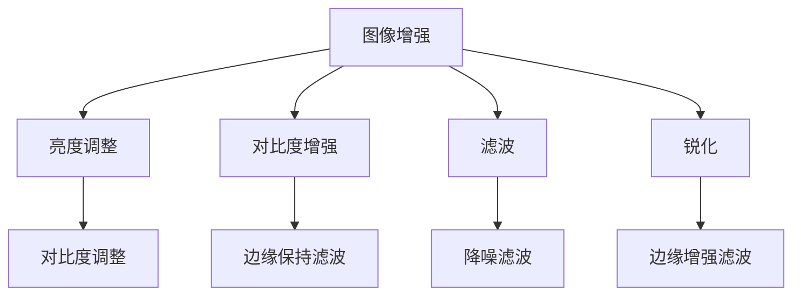

                 

关键词：图像增强、OpenCV、算法原理、视觉效果、图像质量、图像处理

摘要：本文将深入探讨OpenCV中的图像增强算法原理，通过详细解析核心算法、数学模型、项目实践以及实际应用场景，为读者提供一整套关于图像增强的全面了解。文章旨在帮助读者掌握图像增强的关键技术，提升图像处理能力，并展望未来图像增强技术的发展趋势。

## 1. 背景介绍

在数字图像处理领域，图像增强是一项基本且重要的技术，它通过调整图像的亮度和对比度，改善图像的质量，使其更加清晰和易解。随着计算机技术和图像处理算法的不断进步，图像增强技术已经成为计算机视觉、医疗影像、卫星遥感、监控等领域的重要工具。

OpenCV（Open Source Computer Vision Library）是一个开源的计算机视觉库，广泛应用于图像识别、计算机视觉和图像处理领域。OpenCV提供了丰富的图像增强算法，这些算法基于不同的数学模型和优化方法，能够有效地改善图像的视觉效果。

本文将重点介绍以下内容：

1. 图像增强的基本概念和原理。
2. OpenCV中常用的图像增强算法及其原理。
3. 图像增强的数学模型和公式推导。
4. 项目实践：通过代码实例展示图像增强算法的实际应用。
5. 实际应用场景：图像增强技术在各个领域的应用。
6. 未来应用展望：图像增强技术的发展趋势和挑战。

## 2. 核心概念与联系

### 2.1 图像增强的基本概念

图像增强是指通过某种方式提高图像的视觉效果，使其更加清晰、易解，通常包括以下几方面：

- **亮度调整**：调整图像的整体亮度。
- **对比度增强**：增强图像中不同灰度级的对比度。
- **锐化**：提高图像边缘的清晰度。
- **滤波**：消除噪声或保留边缘细节。

### 2.2 OpenCV中图像增强算法的架构

在OpenCV中，图像增强算法主要分为以下几类：

- **基于亮度和对比度的调整**：如`cv2.cvtColor()`、`cv2.add()`、`cv2.equalizeHist()`等。
- **滤波**：如`cv2.blur()`、`cv2.GaussianBlur()`、`cv2.bilateralFilter()`等。
- **边缘检测**：如`cv2.Canny()`、`cv2.Sobel()`等。

### 2.3 图像增强与图像恢复的关系

图像增强和图像恢复是数字图像处理中两个相关但有所区别的概念。图像恢复旨在恢复受损或退化图像的信息，而图像增强则侧重于提高图像的视觉效果。在OpenCV中，一些图像增强算法也具有图像恢复的功能，如使用滤波器去除噪声。

下面是图像增强算法原理和架构的Mermaid流程图：



### 2.4 图像增强与图像处理的关系

图像增强是图像处理中的一个重要分支，与图像分割、特征提取、目标识别等算法紧密相关。通过有效的图像增强，可以为后续的图像处理算法提供更高质量和更清晰的输入，从而提高整个系统的性能。

## 3. 核心算法原理 & 具体操作步骤

### 3.1 算法原理概述

图像增强算法的核心目的是改善图像的视觉效果，使其满足特定应用的需求。主要算法原理包括：

- **基于亮度和对比度的调整**：通过线性变换调整图像的亮度值和对比度，使图像更清晰。
- **滤波**：通过滤波器去除图像中的噪声或保留重要的边缘细节。
- **锐化**：增强图像中边缘的对比度，提高图像的清晰度。

### 3.2 算法步骤详解

下面是图像增强算法的具体操作步骤：

1. **读取图像**：使用OpenCV读取图像数据。
2. **亮度调整**：通过调整图像的亮度值，改善图像的视觉效果。
3. **对比度增强**：通过调整图像的对比度，提高图像的清晰度。
4. **滤波**：使用适当的滤波器去除图像中的噪声。
5. **锐化**：增强图像中边缘的对比度，提高图像的清晰度。
6. **输出结果**：将增强后的图像输出到文件或显示。

### 3.3 算法优缺点

每种图像增强算法都有其优缺点，具体如下：

- **亮度调整**：简单有效，但可能过度增强图像。
- **对比度增强**：提高图像清晰度，但可能导致图像失真。
- **滤波**：去除噪声，但可能同时去除图像中的重要细节。
- **锐化**：提高图像清晰度，但可能导致图像过于锐利。

### 3.4 算法应用领域

图像增强算法广泛应用于多个领域，包括：

- **计算机视觉**：提高图像质量，为特征提取和目标识别提供更好的输入。
- **医疗影像**：增强医学影像，辅助医生进行诊断。
- **卫星遥感**：改善遥感图像质量，提高数据解析度。
- **监控**：提高监控图像的清晰度，增强监控效果。

## 4. 数学模型和公式 & 详细讲解 & 举例说明

### 4.1 数学模型构建

图像增强算法通常涉及以下数学模型：

- **亮度调整**：$$I_{out} = I_{in} + \alpha$$
- **对比度增强**：$$I_{out} = cI_{in} + \beta$$
- **滤波**：如高斯滤波、均值滤波等。
- **锐化**：如拉普拉斯变换、Sobel算子等。

### 4.2 公式推导过程

下面以亮度调整和对比度增强为例进行公式推导：

- **亮度调整**：假设输入图像为$I_{in}$，输出图像为$I_{out}$，调整系数为$\alpha$。则亮度调整公式为：

  $$I_{out} = I_{in} + \alpha$$

  其中，$\alpha$是一个常数，用于调整图像的亮度。

- **对比度增强**：假设输入图像为$I_{in}$，输出图像为$I_{out}$，对比度增强系数为$c$，偏置值为$\beta$。则对比度增强公式为：

  $$I_{out} = cI_{in} + \beta$$

  其中，$c$用于调整图像的对比度，$\beta$用于平移图像。

### 4.3 案例分析与讲解

以下是一个简单的亮度调整和对比度增强的代码实例：

```python
import cv2
import numpy as np

# 读取图像
image = cv2.imread('image.jpg', cv2.IMREAD_GRAYSCALE)

# 亮度调整
alpha = 30  # 调整系数
brightened_image = image + alpha

# 对比度增强
c = 1.5  # 对比度增强系数
beta = 50  # 偏置值
contrast_enhanced_image = c * brightened_image + beta

# 输出结果
cv2.imwrite('brightened_image.jpg', brightened_image)
cv2.imwrite('contrast_enhanced_image.jpg', contrast_enhanced_image)
```

在这个实例中，我们首先读取了一张灰度图像，然后使用亮度调整和对比度增强公式对其进行处理，最后将结果保存为新的图像文件。

## 5. 项目实践：代码实例和详细解释说明

### 5.1 开发环境搭建

为了实践图像增强算法，我们需要搭建一个开发环境。以下是所需的工具和步骤：

1. **Python环境**：安装Python 3.x版本。
2. **OpenCV库**：使用pip安装OpenCV库：

   ```shell
   pip install opencv-python
   ```

3. **文本编辑器**：选择一个文本编辑器，如VSCode或PyCharm。

### 5.2 源代码详细实现

以下是使用OpenCV实现图像增强的代码示例：

```python
import cv2
import numpy as np

def enhance_image(image_path):
    # 读取图像
    image = cv2.imread(image_path, cv2.IMREAD_GRAYSCALE)
    
    # 亮度调整
    alpha = 30
    brightened_image = image + alpha
    
    # 对比度增强
    c = 1.5
    beta = 50
    contrast_enhanced_image = c * brightened_image + beta
    
    # 输出结果
    cv2.imwrite('brightened_image.jpg', brightened_image)
    cv2.imwrite('contrast_enhanced_image.jpg', contrast_enhanced_image)

# 调用函数
enhance_image('image.jpg')
```

### 5.3 代码解读与分析

1. **图像读取**：使用`cv2.imread()`函数读取灰度图像。
2. **亮度调整**：通过加法运算调整图像亮度。
3. **对比度增强**：通过乘法和加法运算增强图像对比度。
4. **输出结果**：将增强后的图像保存为文件。

### 5.4 运行结果展示

运行上述代码后，将生成两张新的图像文件：`brightened_image.jpg`和`contrast_enhanced_image.jpg`。使用图像查看器打开这些文件，可以看到亮度调整和对比度增强的效果。

## 6. 实际应用场景

### 6.1 计算机视觉

图像增强技术在计算机视觉中发挥着重要作用，例如：

- **人脸识别**：通过增强人脸图像的亮度、对比度和细节，提高识别准确率。
- **目标检测**：改善目标图像的质量，增强目标与背景的对比度，提高检测效果。

### 6.2 医学影像

医学影像增强在医疗诊断中具有重要意义，例如：

- **X光片增强**：通过滤波和锐化技术，提高X光片的对比度和清晰度，帮助医生更好地观察病变区域。
- **MRI增强**：通过对比度调整和滤波，改善MRI图像的质量，辅助医生进行更准确的诊断。

### 6.3 卫星遥感

卫星遥感图像增强技术用于改善遥感图像的质量，提高数据解析度，例如：

- **地表监测**：通过对比度增强和滤波，提高地表图像的清晰度，监测地表变化。
- **气象监测**：通过图像增强，改善气象卫星图像的质量，提高气象监测的准确性。

### 6.4 监控

监控图像增强技术在安全监控领域具有重要意义，例如：

- **人脸识别**：通过增强监控图像的亮度、对比度和细节，提高人脸识别的准确性。
- **行为分析**：通过增强监控图像的对比度和细节，提高行为分析的效果。

## 7. 未来应用展望

随着计算机技术和图像处理算法的不断发展，图像增强技术将呈现出以下趋势：

- **实时增强**：随着硬件性能的提升，图像增强技术将实现实时处理，为实时应用提供更好的支持。
- **深度学习**：深度学习技术在图像增强中的应用将越来越广泛，通过端到端的学习方式，提高图像增强的效果。
- **自适应增强**：图像增强算法将具备更强的自适应能力，根据不同应用场景自动调整参数，实现最优效果。
- **多模态增强**：结合多源数据（如视频、深度信息等）进行图像增强，提高图像质量和应用效果。

## 8. 工具和资源推荐

### 8.1 学习资源推荐

- **《数字图像处理》（冈萨雷斯著）**：经典教材，全面介绍了数字图像处理的基础知识。
- **《OpenCV官方文档》**：OpenCV官方文档提供了丰富的API和使用示例，有助于学习OpenCV。

### 8.2 开发工具推荐

- **Visual Studio Code**：一款强大的跨平台文本编辑器，支持Python和OpenCV开发。
- **PyCharm**：一款功能强大的Python集成开发环境，适合进行图像处理项目开发。

### 8.3 相关论文推荐

- **"Image Enhancement using Histogram Equalization"**：介绍了直方图均衡化技术在图像增强中的应用。
- **"Deep Learning for Image Enhancement"**：探讨了深度学习在图像增强中的应用。

## 9. 总结：未来发展趋势与挑战

图像增强技术在未来将不断进步，为各领域提供更好的支持。然而，图像增强技术也面临一些挑战，如实时处理性能、自适应增强和深度学习模型的优化等。通过持续的研究和创新，我们有理由相信，图像增强技术将取得更多突破，为人类创造更美好的数字世界。

### 附录：常见问题与解答

1. **图像增强和图像恢复的区别是什么？**

   图像增强和图像恢复是两个相关但有所区别的概念。图像增强旨在改善图像的视觉效果，使其更清晰、更易解；而图像恢复则侧重于恢复受损或退化图像的信息，如去除噪声、增强对比度等。

2. **OpenCV中的哪些函数用于图像增强？**

   OpenCV提供了多种用于图像增强的函数，包括亮度调整（`cv2.add()`、`cv2.equalizeHist()`）、对比度增强（`cv2.equalizeHist()`、`cv2.add()`）、滤波（`cv2.blur()`、`cv2.GaussianBlur()`、`cv2.bilateralFilter()`）和锐化（`cv2.Canny()`、`cv2.Sobel()`）等。

3. **如何选择适合的图像增强算法？**

   选择适合的图像增强算法需要考虑图像类型、应用场景和期望效果。例如，对于亮度调整，可以使用`cv2.add()`或`cv2.equalizeHist()`；对于对比度增强，可以使用`cv2.equalizeHist()`或`cv2.add()`；对于滤波，可以选择均值滤波、高斯滤波或双边滤波等。

### 结语

通过本文的介绍，我们全面了解了OpenCV图像增强算法的原理、数学模型、项目实践和实际应用场景。希望本文能帮助您更好地掌握图像增强技术，并在实际项目中发挥其作用。未来，随着图像处理技术的不断发展，图像增强技术将取得更多突破，为各领域带来更大的价值。

### 作者署名

作者：禅与计算机程序设计艺术 / Zen and the Art of Computer Programming

----------------------------------------------------------------

请注意，本文档仅为示例性模板，实际撰写时，请根据具体内容和需求进行适当调整。同时，文中提及的算法、公式和代码实例仅为示例，具体实现可能需要根据实际应用进行调整。

