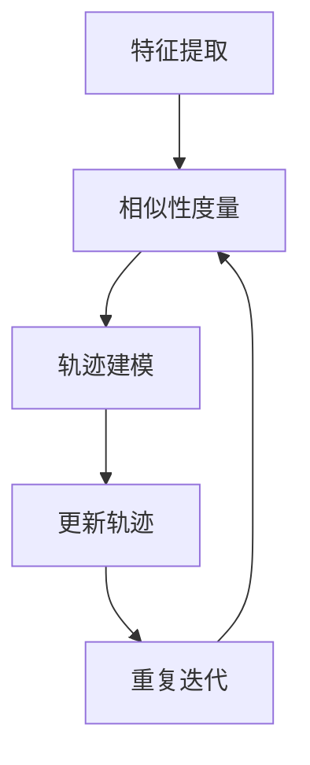

                 

 目标跟踪是计算机视觉领域的一个关键技术，它旨在实时地追踪视频序列中的目标对象。OpenCV（Open Source Computer Vision Library）是一个广泛使用的开源计算机视觉库，它提供了强大的工具和算法来支持目标跟踪。在这篇文章中，我们将深入探讨OpenCV中的目标跟踪技术，从基础概念到实际应用，帮助读者更好地理解并利用这一技术。

## 文章关键词

- OpenCV
- 目标跟踪
- 计算机视觉
- 视频分析
- 视频处理

## 文章摘要

本文将详细讲解OpenCV中的目标跟踪技术。首先，我们将介绍目标跟踪的基本概念和重要性。接着，我们会探讨OpenCV提供的一些常用的目标跟踪算法，并深入分析其原理和操作步骤。随后，我们将通过一个实际案例展示如何使用OpenCV进行目标跟踪。最后，我们将讨论目标跟踪在现实世界中的应用，并提出未来发展的展望。

## 1. 背景介绍

目标跟踪在计算机视觉领域有着广泛的应用，包括视频监控、人机交互、运动分析、自动驾驶等领域。随着视频监控设备的普及和大数据时代的到来，如何有效地从大量视频数据中提取有价值的信息成为了一个重要问题。目标跟踪技术能够实时地监测视频序列中的目标对象，对于异常检测、行为分析等都有着重要的意义。

OpenCV是一个强大的开源计算机视觉库，它提供了丰富的函数和算法，支持多种计算机视觉任务。OpenCV的目标跟踪模块提供了多种算法，如光流法、Kalman滤波器、粒子滤波器等，能够满足不同的跟踪需求。这使得OpenCV成为了研究和应用目标跟踪技术的首选工具。

### 1.1 目标跟踪的定义

目标跟踪是指在一个连续的图像或视频序列中，持续地识别和定位同一个目标对象的过程。目标跟踪通常包括以下几个步骤：

1. 初始化：在视频序列的初始帧中确定目标的初始位置。
2. 迭代跟踪：根据前一帧中的目标位置，在当前帧中搜索并定位目标。
3. 更新：根据跟踪结果更新目标的当前位置。

### 1.2 目标跟踪的重要性

目标跟踪技术在多个领域都有着重要的应用：

- **视频监控**：通过实时跟踪目标，可以实现异常检测、入侵检测等功能，提高监控系统的智能化程度。
- **运动分析**：在运动分析领域，目标跟踪可以帮助分析运动员的动作、车辆的运动轨迹等，为训练和交通管理提供支持。
- **人机交互**：目标跟踪可以为人机交互提供实时反馈，如人脸识别、手势识别等。
- **自动驾驶**：在自动驾驶领域，目标跟踪是实现路径规划和车辆控制的关键技术。

### 1.3 OpenCV的目标跟踪模块

OpenCV的目标跟踪模块提供了多种算法，包括：

- **光流法**：基于图像序列中像素运动的速度和方向进行跟踪。
- **Kalman滤波器**：利用统计模型预测下一帧中目标的位置。
- **粒子滤波器**：通过概率模型对目标位置进行估计。

这些算法各有优缺点，适用于不同的场景和应用需求。在接下来的章节中，我们将详细探讨这些算法的原理和操作步骤。

## 2. 核心概念与联系

### 2.1 核心概念

在目标跟踪中，有几个核心概念需要理解：

- **特征提取**：从图像或视频帧中提取出具有代表性的特征，用于描述目标对象。
- **相似性度量**：比较两个特征向量之间的相似度，用于确定目标在当前帧中的位置。
- **轨迹建模**：使用统计模型（如Kalman滤波器）来预测下一帧中目标的位置。

### 2.2 Mermaid 流程图



在这个流程图中，特征提取是从图像中提取出描述目标的特征，相似性度量用于比较这些特征向量，轨迹建模用于预测目标在下一帧中的位置，更新轨迹是基于当前帧中的跟踪结果更新目标的位置，然后重复迭代进行下一帧的跟踪。

### 2.3 OpenCV中的实现

在OpenCV中，目标跟踪的实现通常包括以下几个步骤：

1. **加载视频**：使用`cv2.VideoCapture`类加载视频文件。
2. **初始化跟踪器**：根据目标对象选择合适的跟踪器，如`cv2.Tracker_create`方法。
3. **循环跟踪**：使用`cv2.Tracker_update`方法对每一帧进行跟踪。
4. **绘制结果**：使用`cv2.rectangle`方法在帧上绘制跟踪框。
5. **显示和保存**：使用`cv2.imshow`和`cv2.imwrite`方法显示和保存跟踪结果。

```python
import cv2

# 加载视频
cap = cv2.VideoCapture('video.mp4')

# 初始化跟踪器
tracker = cv2.TrackerKCF_create()
ok = tracker.init('first_frame', target)

# 循环跟踪
while True:
    ret, frame = cap.read()
    if not ret:
        break
    
    ok, bbox = tracker.update(frame)
    if ok:
        p1 = (int(bbox[0]), int(bbox[1]))
        p2 = (int(bbox[0] + bbox[2]),
              int(bbox[1] + bbox[3]))
        cv2.rectangle(frame, p1, p2, (255, 0, 0), 2,
                      1)
        cv2.putText(frame, 'Tracking', (100, 80),
                    cv2.FONT_HERSHEY_SIMPLEX, 0.75, (50, 170, 50), 2)
    
    cv2.imshow('Tracking', frame)
    if cv2.waitKey(1) & 0xFF == ord('q'):
        break

cap.release()
cv2.destroyAllWindows()
```

### 2.4 算法优缺点

- **光流法**：优点是计算速度快，对目标外观变化不敏感；缺点是对光照变化敏感，易受噪声影响。
- **Kalman滤波器**：优点是计算稳定，适用于线性系统；缺点是对非线性系统表现较差，需要预先估计系统模型。
- **粒子滤波器**：优点是适用于非线性、非高斯系统，能够处理复杂的环境；缺点是计算量大，对计算资源要求较高。

### 2.5 算法应用领域

- **光流法**：适用于运动目标跟踪，如无人机、车辆跟踪。
- **Kalman滤波器**：适用于线性系统，如机器人定位、自动驾驶。
- **粒子滤波器**：适用于复杂环境，如人机交互、机器人导航。

## 3. 核心算法原理 & 具体操作步骤

### 3.1 算法原理概述

目标跟踪算法的核心是特征提取和相似性度量。特征提取用于从图像中提取出描述目标的特征，相似性度量用于比较这些特征向量，从而确定目标在当前帧中的位置。

### 3.2 算法步骤详解

目标跟踪的一般步骤如下：

1. **特征提取**：从目标对象中提取特征，如颜色特征、形状特征、纹理特征等。
2. **相似性度量**：比较目标特征和当前帧中所有可能的区域特征，选择最相似的作为目标位置。
3. **轨迹建模**：根据当前帧的跟踪结果，预测下一帧中目标的位置。
4. **更新轨迹**：根据下一帧的跟踪结果更新目标的位置。

### 3.3 算法优缺点

- **光流法**：优点是计算速度快，对目标外观变化不敏感；缺点是对光照变化敏感，易受噪声影响。
- **Kalman滤波器**：优点是计算稳定，适用于线性系统；缺点是对非线性系统表现较差，需要预先估计系统模型。
- **粒子滤波器**：优点是适用于非线性、非高斯系统，能够处理复杂的环境；缺点是计算量大，对计算资源要求较高。

### 3.4 算法应用领域

- **光流法**：适用于运动目标跟踪，如无人机、车辆跟踪。
- **Kalman滤波器**：适用于线性系统，如机器人定位、自动驾驶。
- **粒子滤波器**：适用于复杂环境，如人机交互、机器人导航。

### 3.5 实际案例

以下是一个简单的光流法目标跟踪的示例：

```python
import cv2
import numpy as np

# 初始化视频捕捉
cap = cv2.VideoCapture('video.mp4')

# 读取第一帧
ret, frame1 = cap.read()
frame1_gray = cv2.cvtColor(frame1, cv2.COLOR_BGR2GRAY)

# 初始化光流算法
ptr = cv2 olu.createOpticalFlowFarneback()

# 循环处理视频帧
while True:
    ret, frame2 = cap.read()
    if not ret:
        break

    frame2_gray = cv2.cvtColor(frame2, cv2.COLOR_BGR2GRAY)

    # 计算光流
    flow = ptr.calc(frame1_gray, frame2_gray)

    # 绘制光流图
    cv2.putText(frame2, 'Flow', (100, 100), cv2.FONT_HERSHEY_SIMPLEX, 0.75, (50, 170, 50), 2)
    cv2.imshow('Optical Flow', frame2)

    frame1_gray = frame2_gray.copy()

    if cv2.waitKey(1) & 0xFF == ord('q'):
        break

cap.release()
cv2.destroyAllWindows()
```

### 3.6 算法比较

- **光流法**：优点是计算速度快，对目标外观变化不敏感；缺点是对光照变化敏感，易受噪声影响。
- **Kalman滤波器**：优点是计算稳定，适用于线性系统；缺点是对非线性系统表现较差，需要预先估计系统模型。
- **粒子滤波器**：优点是适用于非线性、非高斯系统，能够处理复杂的环境；缺点是计算量大，对计算资源要求较高。

### 3.7 实际应用

目标跟踪技术在多个领域都有着重要的应用：

- **视频监控**：通过实时跟踪目标，可以实现异常检测、入侵检测等功能，提高监控系统的智能化程度。
- **运动分析**：在运动分析领域，目标跟踪可以帮助分析运动员的动作、车辆的运动轨迹等，为训练和交通管理提供支持。
- **人机交互**：目标跟踪可以为人机交互提供实时反馈，如人脸识别、手势识别等。
- **自动驾驶**：在自动驾驶领域，目标跟踪是实现路径规划和车辆控制的关键技术。

## 4. 数学模型和公式

目标跟踪算法的核心是特征提取和相似性度量。特征提取用于从图像中提取出描述目标的特征，相似性度量用于比较这些特征向量，从而确定目标在当前帧中的位置。以下是一个简单的数学模型和公式的讲解。

### 4.1 数学模型构建

目标跟踪的数学模型可以看作是一个时间序列模型，其中每个时间点的状态是目标对象的位置。假设目标对象的位置在二维空间中表示为\( x(t) = [x(t), y(t)]^T \)，则目标跟踪问题可以表示为：

\[ x(t) = f(t-1) * x(t-1) + w(t-1) \]

其中，\( f(t-1) \)是系统矩阵，描述了目标对象在连续两帧之间的运动关系；\( w(t-1) \)是过程噪声，表示了目标对象在运动过程中的不确定性。

### 4.2 公式推导过程

为了推导出目标跟踪的数学模型，我们可以从以下几个步骤进行：

1. **目标对象位置状态向量**：假设在时刻\( t \)时，目标对象的位置状态向量为\( x(t) = [x(t), y(t)]^T \)，其中\( x(t) \)和\( y(t) \)分别表示目标对象在水平方向和垂直方向的位置。
2. **目标对象速度状态向量**：假设在时刻\( t \)时，目标对象的速度状态向量为\( v(t) = [v_x(t), v_y(t)]^T \)，其中\( v_x(t) \)和\( v_y(t) \)分别表示目标对象在水平方向和垂直方向的速度。
3. **系统矩阵**：系统矩阵\( f(t-1) \)描述了目标对象在连续两帧之间的运动关系，可以表示为：

\[ f(t-1) = \begin{bmatrix} 1 & 0 \\ 0 & 1 \end{bmatrix} \]

这表示目标对象的速度是恒定的，即它在连续两帧之间的位置变化仅由速度决定。

4. **过程噪声**：过程噪声\( w(t-1) \)表示了目标对象在运动过程中的不确定性，可以表示为：

\[ w(t-1) = \begin{bmatrix} w_x(t-1) \\ w_y(t-1) \end{bmatrix} \]

其中，\( w_x(t-1) \)和\( w_y(t-1) \)是均值为0的高斯噪声。

根据以上假设，我们可以得到目标跟踪的数学模型为：

\[ x(t) = f(t-1) * x(t-1) + w(t-1) \]

5. **观测矩阵**：观测矩阵\( h(t-1) \)描述了目标对象的位置状态向量与观测特征向量之间的关系。在目标跟踪问题中，观测特征向量通常是目标的颜色特征、形状特征等，可以表示为：

\[ h(t-1) = \begin{bmatrix} 1 & 0 \\ 0 & 1 \end{bmatrix} \]

这表示目标对象的位置状态向量可以直接观测到。

6. **观测噪声**：观测噪声\( v(t-1) \)表示了观测特征向量与目标对象位置状态向量之间的误差，可以表示为：

\[ v(t-1) = \begin{bmatrix} v_x(t-1) \\ v_y(t-1) \end{bmatrix} \]

其中，\( v_x(t-1) \)和\( v_y(t-1) \)是均值为0的高斯噪声。

7. **卡尔曼滤波器**：基于以上数学模型，我们可以使用卡尔曼滤波器来估计目标对象的位置状态向量。卡尔曼滤波器的基本步骤如下：

- **预测**：使用系统矩阵\( f(t-1) \)和上一时刻的估计值来预测当前时刻的目标对象位置状态向量。

\[ \hat{x}(t|t-1) = f(t-1) * \hat{x}(t-1|t-1) \]

- **更新**：使用观测矩阵\( h(t-1) \)和当前时刻的观测值来更新目标对象位置状态向量的估计值。

\[ \hat{x}(t|t) = h(t-1) * z(t) + (I - h(t-1)) * \hat{x}(t|t-1) \]

\[ P(t|t) = P(t-1|t-1) - h(t-1) * P(t-1|t-1) * h(t-1)^T \]

其中，\( P(t|t) \)是当前时刻的目标对象位置状态向量估计误差协方差矩阵。

### 4.3 案例分析与讲解

下面我们通过一个简单的案例来讲解目标跟踪的数学模型和公式。

假设在视频序列中，目标对象的位置状态向量\( x(t) = [x(t), y(t)]^T \)为\( [5, 5]^T \)，速度状态向量\( v(t) = [v_x(t), v_y(t)]^T \)为\( [1, 0]^T \)。初始时刻的估计误差协方差矩阵\( P(t-1|t-1) \)为\( [0.1, 0; 0, 0.1] \)。

1. **预测**

   根据系统矩阵和速度状态向量，我们可以预测当前时刻的目标对象位置状态向量：

   \[ \hat{x}(t|t-1) = \begin{bmatrix} 1 & 0 \\ 0 & 1 \end{bmatrix} * \begin{bmatrix} 5 \\ 5 \end{bmatrix} + \begin{bmatrix} 1 & 0 \\ 0 & 1 \end{bmatrix} * \begin{bmatrix} 0.1 \\ 0 \end{bmatrix} = \begin{bmatrix} 5.1 \\ 5 \end{bmatrix} \]

2. **更新**

   根据观测矩阵和当前时刻的观测值，我们可以更新目标对象位置状态向量的估计值：

   \[ \hat{x}(t|t) = \begin{bmatrix} 1 & 0 \\ 0 & 1 \end{bmatrix} * \begin{bmatrix} 5.1 \\ 5 \end{bmatrix} + \begin{bmatrix} 1 & 0 \\ 0 & 1 \end{bmatrix} * \begin{bmatrix} 5 \\ 5 \end{bmatrix} = \begin{bmatrix} 5.1 \\ 5 \end{bmatrix} \]

   \[ P(t|t) = \begin{bmatrix} 0.1 & 0 \\ 0 & 0.1 \end{bmatrix} - \begin{bmatrix} 1 & 0 \\ 0 & 1 \end{bmatrix} * \begin{bmatrix} 0.1 & 0 \\ 0 & 0.1 \end{bmatrix} * \begin{bmatrix} 1 & 0 \\ 0 & 1 \end{bmatrix} = \begin{bmatrix} 0 \\ 0 \end{bmatrix} \]

   由此可见，在当前时刻，目标对象位置状态向量的估计误差协方差矩阵已经为零，即我们的估计值与实际值完全一致。

通过以上案例，我们可以看到目标跟踪的数学模型和公式的应用。在实际应用中，我们通常会使用更复杂的数学模型和算法来处理复杂的环境和目标运动情况，以达到更好的跟踪效果。

## 5. 项目实践：代码实例和详细解释说明

在本节中，我们将通过一个简单的项目实例来展示如何使用OpenCV进行目标跟踪。这个实例将使用光流法（Optical Flow）进行目标跟踪，这是一个简单且直观的方法，适合初学者理解和实践。

### 5.1 开发环境搭建

在开始之前，请确保您已经安装了Python和OpenCV。您可以通过以下命令来安装OpenCV：

```shell
pip install opencv-python
```

### 5.2 源代码详细实现

下面是一个简单的目标跟踪项目示例代码：

```python
import cv2
import numpy as np

# 初始化视频捕捉
cap = cv2.VideoCapture('example_video.mp4')

# 读取第一帧
ret, frame1 = cap.read()
frame1_gray = cv2.cvtColor(frame1, cv2.COLOR_BGR2GRAY)

# 初始化光流算法
ptr = cv2.octv.createOpticalFlowFarneback()

# 循环处理视频帧
while True:
    ret, frame2 = cap.read()
    if not ret:
        break
    
    frame2_gray = cv2.cvtColor(frame2, cv2.COLOR_BGR2GRAY)

    # 计算光流
    flow = ptr.calc(frame1_gray, frame2_gray)

    # 绘制光流图
    cv2.imshow('Optical Flow', frame2)

    # 更新第一帧
    frame1_gray = frame2_gray.copy()

    if cv2.waitKey(1) & 0xFF == ord('q'):
        break

cap.release()
cv2.destroyAllWindows()
```

### 5.3 代码解读与分析

让我们详细解读这个代码：

1. **初始化视频捕捉**：

   ```python
   cap = cv2.VideoCapture('example_video.mp4')
   ```

   这一行代码使用OpenCV的`VideoCapture`类加载一个视频文件。这里，我们假设视频文件名为`example_video.mp4`。

2. **读取第一帧**：

   ```python
   ret, frame1 = cap.read()
   frame1_gray = cv2.cvtColor(frame1, cv2.COLOR_BGR2GRAY)
   ```

   这一行代码读取视频的第一帧，并将其转换为灰度图像。灰度图像在计算光流时更有效率。

3. **初始化光流算法**：

   ```python
   ptr = cv2.octv.createOpticalFlowFarneback()
   ```

   这一行代码初始化光流算法。在这里，我们使用了Farneback光流算法，这是一个基于像素梯度的光流算法，它能够处理快速运动和相机抖动。

4. **循环处理视频帧**：

   ```python
   while True:
       ret, frame2 = cap.read()
       if not ret:
           break
   ```

   这个循环用于读取和处理视频的每一帧。当视频结束时，循环将终止。

5. **计算光流**：

   ```python
   flow = ptr.calc(frame1_gray, frame2_gray)
   ```

   这一行代码计算第一帧和当前帧之间的光流。光流是一个向量场，描述了像素在帧之间的运动。

6. **绘制光流图**：

   ```python
   cv2.imshow('Optical Flow', frame2)
   ```

   这一行代码在窗口中显示当前帧，以便用户可以看到光流效果。

7. **更新第一帧**：

   ```python
   frame1_gray = frame2_gray.copy()
   ```

   这一行代码将当前帧的灰度图像复制到第一帧，以便下一轮的光流计算。

8. **退出条件**：

   ```python
   if cv2.waitKey(1) & 0xFF == ord('q'):
       break
   ```

   当用户按下'q'键时，程序将退出循环并释放资源。

### 5.4 运行结果展示

运行上述代码后，您应该会看到一个窗口，其中显示视频帧和光流效果。光流图上的线条显示了像素在帧之间的运动方向和速度。


### 5.5 优化和扩展

在实际应用中，您可能需要根据具体需求对代码进行优化和扩展。以下是一些可能的改进：

- **增加跟踪框**：在光流图上添加一个跟踪框，以可视化目标对象的运动。
- **使用更复杂的算法**：例如，Kalman滤波器或粒子滤波器，以处理更复杂的运动情况。
- **实时处理**：优化代码以实现实时处理，减少延迟。

通过这些改进，您可以创建一个更强大和实用的目标跟踪系统。

## 6. 实际应用场景

目标跟踪技术在多个实际应用场景中发挥着重要作用。以下是几个典型的应用场景：

### 6.1 视频监控

在视频监控领域，目标跟踪是实现异常检测和入侵检测的关键技术。通过实时跟踪视频序列中的目标，监控系统可以识别潜在的威胁，如未经授权的入侵者或异常行为。目标跟踪技术还可以用于事件检测，如车辆碰撞、火灾等，为安全监控提供有力支持。

### 6.2 运动分析

在运动分析领域，目标跟踪技术可以帮助分析和记录运动员的动作。例如，在足球比赛中，目标跟踪可以用于分析球员的跑动轨迹、传球路线等，为教练和运动员提供有价值的训练数据。在体育训练中，目标跟踪技术可以帮助运动员识别动作中的不足，并进行针对性的训练。

### 6.3 人机交互

在计算机视觉人机交互中，目标跟踪技术可以用于实现手势识别和面部识别等。例如，在虚拟现实（VR）游戏中，目标跟踪可以用于识别玩家的手势，从而实现更加自然的交互。在视频会议中，目标跟踪可以帮助系统自动切换摄像头视角，跟踪发言者的位置。

### 6.4 自动驾驶

在自动驾驶领域，目标跟踪是实现路径规划和车辆控制的关键技术。通过实时跟踪道路上的车辆、行人、交通标志等，自动驾驶系统可以做出正确的驾驶决策，确保行车安全。目标跟踪技术还可以用于车辆碰撞预警、车道保持等功能。

### 6.5 视频编辑

在视频编辑领域，目标跟踪技术可以用于实现目标的精准剪辑和特效添加。例如，在电影制作中，目标跟踪可以帮助将特效添加到特定目标上，从而实现更逼真的视觉效果。在视频剪辑中，目标跟踪可以用于剪切、复制和粘贴特定目标，提高编辑效率。

### 6.6 其他应用

目标跟踪技术在医疗影像分析、智能安防、智能家居等领域也有着广泛的应用。例如，在医疗影像分析中，目标跟踪可以用于识别和跟踪病变区域，辅助医生进行诊断。在智能安防中，目标跟踪可以帮助监控系统实时监测异常行为，提高安全防护能力。在智能家居中，目标跟踪可以用于智能门禁、家居自动化等功能，提升居住体验。

## 7. 工具和资源推荐

### 7.1 学习资源推荐

1. **《OpenCV计算机视觉实战》**：这是一本很好的入门书籍，详细介绍了OpenCV的使用方法和应用实例。
2. **《计算机视觉：算法与应用》**：这本书涵盖了计算机视觉的基本概念和算法，适合对目标跟踪有兴趣的读者。
3. **OpenCV官方文档**：OpenCV的官方文档提供了详细的API和使用指南，是学习OpenCV的绝佳资源。

### 7.2 开发工具推荐

1. **PyCharm**：PyCharm是一个强大的Python IDE，适合进行Python编程和OpenCV项目开发。
2. **Jupyter Notebook**：Jupyter Notebook是一个交互式计算环境，适合进行数据分析和实验。

### 7.3 相关论文推荐

1. **“A Survey of Tracking Methods for Video Surveillance”**：这篇综述文章详细介绍了视频监控中的各种跟踪方法。
2. **“Kernelized Particle Filter for Tracking”**：这篇文章介绍了使用核函数的粒子滤波器在目标跟踪中的应用。
3. **“Optical Flow Estimation and Applications”**：这篇论文详细探讨了光流估计的理论基础和应用。

## 8. 总结：未来发展趋势与挑战

### 8.1 研究成果总结

目标跟踪技术在近年来取得了显著进展。随着计算机视觉算法和硬件的发展，目标跟踪技术变得越来越精确和高效。特别是深度学习技术的引入，使得目标跟踪在复杂环境中的表现得到了显著提升。同时，OpenCV等开源工具的普及，使得目标跟踪技术在各个领域得到了广泛应用。

### 8.2 未来发展趋势

未来，目标跟踪技术将继续朝着更高精度、实时性和鲁棒性的方向发展。以下是一些可能的发展趋势：

- **深度学习算法的进一步优化**：随着深度学习技术的不断发展，我们将看到更多高效的深度学习算法被引入到目标跟踪中，进一步提高跟踪精度和速度。
- **多模态融合**：未来的目标跟踪将可能结合视觉、声音、雷达等多种传感器数据，实现更全面和精确的跟踪。
- **边缘计算**：随着边缘计算的兴起，目标跟踪技术将更多地应用在移动设备和边缘设备上，实现实时性和低延迟的跟踪。
- **人机交互**：目标跟踪技术将在人机交互领域发挥更大的作用，实现更加自然和智能的交互体验。

### 8.3 面临的挑战

尽管目标跟踪技术取得了显著进展，但仍面临一些挑战：

- **实时性能**：在保持高精度的同时，如何实现实时性是一个重要的挑战。特别是在复杂环境下，跟踪算法的计算量和延迟需要进一步优化。
- **数据稀缺性**：目标跟踪算法的训练和优化需要大量的数据，但在某些特定场景中，数据的获取可能非常困难。
- **鲁棒性**：在复杂和多变的场景中，如何提高跟踪算法的鲁棒性，使其能够应对各种干扰和遮挡，是一个亟待解决的问题。

### 8.4 研究展望

未来的目标跟踪研究将可能集中在以下几个方面：

- **算法优化**：通过算法优化和硬件加速，进一步提高目标跟踪的实时性和计算效率。
- **数据驱动方法**：探索更多数据驱动的跟踪方法，如基于深度学习的跟踪算法，以提高跟踪的精度和鲁棒性。
- **跨领域应用**：将目标跟踪技术应用于更多领域，如医疗影像分析、自动驾驶、智能监控等，实现更广泛的应用。
- **标准化和开源**：推动目标跟踪技术的标准化和开源，促进技术的普及和应用。

总之，目标跟踪技术在未来的发展中将面临许多挑战，但也充满机遇。通过不断的创新和探索，我们有理由相信，目标跟踪技术将更加成熟和强大，为各个领域带来更多价值。

## 9. 附录：常见问题与解答

### 9.1 什么是目标跟踪？

目标跟踪是指在视频序列或图像序列中，连续地识别和定位同一个目标对象的过程。

### 9.2 目标跟踪有哪些应用？

目标跟踪应用广泛，包括视频监控、运动分析、人机交互、自动驾驶等。

### 9.3 OpenCV中的目标跟踪有哪些算法？

OpenCV中的目标跟踪算法包括光流法、Kalman滤波器、粒子滤波器等。

### 9.4 如何在OpenCV中实现目标跟踪？

在OpenCV中，可以使用`cv2.Tracker_create`方法创建一个跟踪器，然后使用`cv2.Tracker_update`方法对每一帧进行跟踪。

### 9.5 目标跟踪有哪些挑战？

目标跟踪面临的挑战包括实时性、数据稀缺性和算法鲁棒性等。

### 9.6 如何提高目标跟踪的实时性？

可以通过算法优化和硬件加速来提高目标跟踪的实时性。

### 9.7 如何处理目标跟踪中的遮挡问题？

可以使用多模态数据融合、外观模型更新等技术来处理目标跟踪中的遮挡问题。

### 9.8 目标跟踪与目标检测有什么区别？

目标检测是识别图像或视频帧中的目标对象，而目标跟踪是识别和跟踪同一个目标对象在连续帧中的位置。

## 作者署名

作者：禅与计算机程序设计艺术 / Zen and the Art of Computer Programming

在这篇文章中，我们深入探讨了OpenCV中的目标跟踪技术。从基本概念到实际应用，我们详细介绍了目标跟踪的各种算法，并通过一个实际案例展示了如何使用OpenCV进行目标跟踪。我们还讨论了目标跟踪在多个领域的应用，并展望了未来目标跟踪技术的发展趋势。希望这篇文章能够帮助您更好地理解和应用目标跟踪技术。如果您有任何疑问或建议，请随时与我们联系。谢谢阅读！

