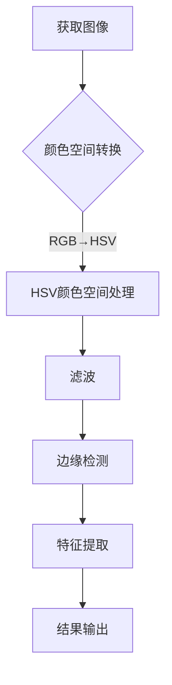

                 

图像处理是计算机视觉领域的一个重要分支，而OpenCV（Open Source Computer Vision Library）作为一款强大的开源计算机视觉库，广泛用于图像识别、图像增强、图像分割、物体检测等领域。本文将围绕OpenCV图像处理的核心算法、数学模型、项目实践和未来应用展望等方面进行深入探讨，旨在帮助读者掌握OpenCV图像处理的技术要点，并拓展其在实际项目中的应用。

## 1. 背景介绍

OpenCV是由Intel发起并维护的一个跨平台的计算机视觉库，其源代码完全开源。OpenCV提供了丰富的图像处理和计算机视觉算法，支持多种编程语言，包括C++、Python、Java等。自2000年发布以来，OpenCV已经成为了全球范围内开发者首选的计算机视觉工具之一。

图像处理技术在日常生活中有着广泛的应用，例如人脸识别、图像压缩、图像增强、医学影像分析、自动驾驶等领域。随着深度学习技术的发展，图像处理技术也在不断演进，OpenCV作为一款成熟的计算机视觉库，为研究人员和开发者提供了丰富的工具和资源。

本文将从以下几个方面展开讨论：

- **核心概念与联系**：介绍OpenCV图像处理的基本概念，如像素、颜色空间、图像滤波等，并通过Mermaid流程图展示关键流程。
- **核心算法原理 & 具体操作步骤**：详细讲解OpenCV图像处理的核心算法，包括滤波、边缘检测、特征提取等，并分析算法的优缺点和应用领域。
- **数学模型和公式**：介绍图像处理的数学模型和公式，包括图像变换、滤波、特征提取等，并通过案例进行讲解。
- **项目实践**：通过具体代码实例，展示OpenCV图像处理在实际项目中的应用，包括开发环境搭建、源代码实现、代码解读等。
- **实际应用场景**：探讨OpenCV图像处理在各个领域的实际应用场景，以及未来发展的趋势和面临的挑战。
- **工具和资源推荐**：推荐学习资源、开发工具和相关论文，帮助读者进一步拓展知识。

## 2. 核心概念与联系

在开始深入讨论OpenCV图像处理之前，我们需要了解一些核心概念，这些概念是理解图像处理技术的基础。

### 2.1 像素与颜色空间

像素是图像的基本单位，每个像素包含一个或多个值，用于描述其颜色和亮度。颜色空间是表示颜色的方式，常见的颜色空间包括RGB、HSV、Lab等。RGB颜色空间使用红色、绿色和蓝色三个分量来表示颜色，而HSV颜色空间则使用色相（Hue）、饱和度（Saturation）和亮度（Value）三个分量。

### 2.2 图像滤波

图像滤波是一种用于去除图像噪声和改善图像质量的图像处理技术。常见的滤波方法包括均值滤波、高斯滤波、中值滤波等。这些滤波方法通过不同的算法对图像像素进行加权处理，从而生成滤波后的图像。

### 2.3 边缘检测

边缘检测是一种用于识别图像中对象边缘的图像处理技术。常见的边缘检测算法包括Sobel算子、Canny算子、Laplacian算子等。这些算法通过计算图像梯度来确定像素点的边缘位置。

### 2.4 特征提取

特征提取是计算机视觉中的一个关键步骤，它用于从图像中提取具有区分性的特征，以便进行分类、识别或其他处理。常见的特征提取方法包括SIFT、SURF、HOG、ORB等。

下面是一个Mermaid流程图，展示了OpenCV图像处理的关键流程：



## 3. 核心算法原理 & 具体操作步骤

OpenCV提供了多种图像处理算法，这些算法在实现图像增强、图像分割、物体检测等方面发挥着重要作用。下面我们将详细介绍一些核心算法的原理和具体操作步骤。

### 3.1 算法原理概述

#### 3.1.1 滤波

滤波是图像处理中最基本的操作之一，用于去除图像噪声和提高图像质量。OpenCV提供了多种滤波算法，如均值滤波、高斯滤波、中值滤波等。

- **均值滤波**：通过计算邻域像素的平均值来替换当前像素值，从而平滑图像。
- **高斯滤波**：利用高斯分布函数对邻域像素进行加权平均，从而去除图像噪声。
- **中值滤波**：用邻域像素的中值替换当前像素值，常用于去除椒盐噪声。

#### 3.1.2 边缘检测

边缘检测是图像处理中用于识别图像中对象边缘的重要方法。OpenCV提供了多种边缘检测算法，如Sobel算子、Canny算子、Laplacian算子等。

- **Sobel算子**：通过计算图像在水平和垂直方向上的梯度来检测边缘。
- **Canny算子**：通过多阈值处理和边缘跟踪来检测边缘，具有较好的抗噪声性能。
- **Laplacian算子**：通过计算图像的二阶导数来检测边缘。

#### 3.1.3 特征提取

特征提取是从图像中提取具有区分性的特征，以便进行分类、识别或其他处理。OpenCV提供了多种特征提取方法，如SIFT、SURF、HOG、ORB等。

- **SIFT（尺度不变特征变换）**：通过计算图像的局部特征点来提取特征。
- **SURF（加速稳健特征）**：在SIFT的基础上进行加速和优化。
- **HOG（直方图方向梯度）**：通过计算图像的局部方向梯度来提取特征。
- **ORB（Oriented FAST and Rotated BRIEF）**：结合了FAST和BRISK的特征点检测和描述子提取方法。

### 3.2 算法步骤详解

#### 3.2.1 滤波

以下是一个简单的滤波算法步骤：

1. **读取图像**：使用OpenCV的`imread`函数读取图像。
2. **选择滤波器**：根据需要选择均值滤波、高斯滤波或中值滤波器。
3. **滤波**：使用相应的滤波函数对图像进行滤波，如`blur`、`GaussianBlur`、`medianBlur`。
4. **输出结果**：将滤波后的图像保存或显示。

```python
import cv2

# 读取图像
image = cv2.imread('image.jpg')

# 高斯滤波
blurred = cv2.GaussianBlur(image, (5, 5), 0)

# 显示滤波后的图像
cv2.imshow('Blurred Image', blurred)
cv2.waitKey(0)
cv2.destroyAllWindows()
```

#### 3.2.2 边缘检测

以下是一个简单的边缘检测算法步骤：

1. **读取图像**：使用OpenCV的`imread`函数读取图像。
2. **选择边缘检测算法**：根据需要选择Sobel算子、Canny算子或Laplacian算子。
3. **边缘检测**：使用相应的边缘检测函数对图像进行边缘检测，如`Sobel`、`Canny`、`Laplacian`。
4. **输出结果**：将边缘检测结果保存或显示。

```python
import cv2

# 读取图像
image = cv2.imread('image.jpg')

# Canny边缘检测
edges = cv2.Canny(image, 100, 200)

# 显示边缘检测结果
cv2.imshow('Edges', edges)
cv2.waitKey(0)
cv2.destroyAllWindows()
```

#### 3.2.3 特征提取

以下是一个简单的特征提取算法步骤：

1. **读取图像**：使用OpenCV的`imread`函数读取图像。
2. **选择特征提取算法**：根据需要选择SIFT、SURF、HOG、ORB等特征提取算法。
3. **特征提取**：使用相应的特征提取函数提取图像特征，如`sift`、`surf`、`HOG`、`ORB`。
4. **输出结果**：将特征提取结果保存或用于后续处理。

```python
import cv2

# 读取图像
image = cv2.imread('image.jpg')

# SIFT特征提取
sift = cv2.SIFT_create()
keypoints, descriptors = sift.detectAndCompute(image, None)

# 显示特征点
img2 = cv2.drawKeypoints(image, keypoints, None)
cv2.imshow('SIFT Features', img2)
cv2.waitKey(0)
cv2.destroyAllWindows()
```

### 3.3 算法优缺点

每种图像处理算法都有其优缺点，以下是一些常见算法的优缺点：

#### 滤波

- **均值滤波**：简单易实现，能有效去除噪声，但可能引入伪影。
- **高斯滤波**：能有效去除噪声，但计算复杂度较高。
- **中值滤波**：能有效去除椒盐噪声，但可能产生模糊效果。

#### 边缘检测

- **Sobel算子**：简单易实现，适用于平滑图像，但可能检测不到细小边缘。
- **Canny算子**：能有效检测边缘，抗噪声能力强，但计算复杂度较高。
- **Laplacian算子**：能检测出强烈的边缘，但可能产生伪边缘。

#### 特征提取

- **SIFT**：具有旋转、尺度不变性，适用于复杂场景，但计算复杂度较高。
- **SURF**：在SIFT的基础上进行了加速和优化，但可能无法检测到所有特征点。
- **HOG**：适用于纹理识别，计算复杂度较低，但可能无法检测到形状特征。
- **ORB**：结合了FAST和BRISK的方法，计算复杂度较低，但可能不如SIFT和SURF精确。

### 3.4 算法应用领域

不同的图像处理算法在各个领域有着广泛的应用：

- **滤波**：在图像增强、图像分割、物体检测等领域中广泛应用，用于去除噪声和提高图像质量。
- **边缘检测**：在图像分割、物体检测、图像配准等领域中用于提取图像边缘。
- **特征提取**：在目标识别、图像分类、场景理解等领域中用于提取具有区分性的特征。

## 4. 数学模型和公式 & 详细讲解 & 举例说明

图像处理涉及到许多数学模型和公式，这些模型和公式在滤波、边缘检测、特征提取等图像处理任务中起着关键作用。以下将详细介绍一些常见的数学模型和公式，并通过案例进行讲解。

### 4.1 数学模型构建

图像处理中的数学模型主要包括图像变换、滤波、特征提取等。以下是一个简单的图像变换模型：

- **图像变换**：将原始图像通过一定的数学变换得到新的图像，如灰度变换、颜色空间转换等。
- **滤波**：利用滤波器对图像像素进行加权处理，以达到去除噪声、增强图像的目的。
- **特征提取**：从图像中提取具有区分性的特征，用于后续的分类、识别等任务。

### 4.2 公式推导过程

以下是一个简单的滤波公式推导过程：

1. **均值滤波**：均值滤波是一种简单的图像滤波方法，通过计算邻域像素的平均值来替换当前像素值。其公式如下：

   $$ f(x, y) = \frac{1}{N} \sum_{i=1}^{N} I(x_i, y_i) $$

   其中，$f(x, y)$ 表示滤波后的像素值，$I(x_i, y_i)$ 表示邻域像素值，$N$ 表示邻域像素数量。

2. **高斯滤波**：高斯滤波是一种基于高斯分布函数的滤波方法，通过对邻域像素进行加权平均来去除图像噪声。其公式如下：

   $$ f(x, y) = \frac{1}{2\pi\sigma^2} e^{-\frac{(x-x_0)^2 + (y-y_0)^2}{2\sigma^2}} \sum_{i=1}^{N} I(x_i, y_i) $$

   其中，$\sigma$ 表示高斯分布的宽度，$x_0$ 和 $y_0$ 表示当前像素的位置。

3. **中值滤波**：中值滤波是一种基于中值运算的滤波方法，用邻域像素的中值替换当前像素值。其公式如下：

   $$ f(x, y) = \text{median}\left( I(x_1, y_1), I(x_2, y_2), ..., I(x_N, y_N) \right) $$

   其中，$I(x_i, y_i)$ 表示邻域像素值，$\text{median}$ 表示中值运算。

### 4.3 案例分析与讲解

以下通过一个简单的案例，讲解如何使用OpenCV实现图像滤波。

#### 案例一：均值滤波

假设我们有一个128x128的图像，我们需要使用均值滤波来去除图像噪声。以下是使用OpenCV实现均值滤波的代码：

```python
import cv2

# 读取图像
image = cv2.imread('image.jpg', cv2.IMREAD_GRAYSCALE)

# 创建一个3x3的均值滤波器
filter_size = 3
mean_filter = np.ones((filter_size, filter_size)) / (filter_size * filter_size)

# 应用均值滤波
blurred = cv2.filter2D(image, -1, mean_filter)

# 显示滤波后的图像
cv2.imshow('Blurred Image', blurred)
cv2.waitKey(0)
cv2.destroyAllWindows()
```

#### 案例二：高斯滤波

假设我们有一个128x128的彩色图像，我们需要使用高斯滤波来去除图像噪声。以下是使用OpenCV实现高斯滤波的代码：

```python
import cv2
import numpy as np

# 读取图像
image = cv2.imread('image.jpg')

# 创建一个5x5的高斯滤波器，标准差为2
gaussian_filter = cv2.getGaussianKernel(ksize=(5, 5), sigma=2)

# 应用高斯滤波
blurred = cv2.filter2D(image, -1, gaussian_filter)

# 显示滤波后的图像
cv2.imshow('Blurred Image', blurred)
cv2.waitKey(0)
cv2.destroyAllWindows()
```

#### 案例三：中值滤波

假设我们有一个128x128的图像，我们需要使用中值滤波来去除图像噪声。以下是使用OpenCV实现中值滤波的代码：

```python
import cv2

# 读取图像
image = cv2.imread('image.jpg', cv2.IMREAD_GRAYSCALE)

# 应用中值滤波
blurred = cv2.medianBlur(image, 5)

# 显示滤波后的图像
cv2.imshow('Blurred Image', blurred)
cv2.waitKey(0)
cv2.destroyAllWindows()
```

通过以上案例，我们可以看到如何使用OpenCV实现常见的图像滤波方法。这些滤波方法在图像处理任务中发挥着重要作用，如去除噪声、增强图像、提取特征等。

## 5. 项目实践：代码实例和详细解释说明

在了解了OpenCV图像处理的核心算法和数学模型后，我们将通过一个具体的项目实践，展示如何使用OpenCV进行图像处理，包括开发环境搭建、源代码实现、代码解读和运行结果展示。

### 5.1 开发环境搭建

要在本地计算机上运行OpenCV图像处理项目，我们需要安装Python环境和OpenCV库。以下是安装步骤：

1. **安装Python环境**：确保你的计算机上已经安装了Python 3.x版本。如果没有安装，可以从官方网站下载并安装。

2. **安装OpenCV库**：在命令行中运行以下命令安装OpenCV库：

   ```shell
   pip install opencv-python
   ```

   安装完成后，可以使用以下命令验证安装是否成功：

   ```shell
   python -c "import cv2; print(cv2.__version__)"
   ```

   如果输出OpenCV的版本号，说明安装成功。

### 5.2 源代码详细实现

以下是一个简单的OpenCV图像处理项目的源代码，展示了如何使用OpenCV进行图像滤波、边缘检测和特征提取：

```python
import cv2
import numpy as np

def imageProcessingDemo(image_path):
    # 读取图像
    image = cv2.imread(image_path, cv2.IMREAD_COLOR)

    # 滤波
    blurred = cv2.GaussianBlur(image, (5, 5), 0)

    # 边缘检测
    edges = cv2.Canny(blurred, 100, 200)

    # 特征提取
    sift = cv2.SIFT_create()
    keypoints, descriptors = sift.detectAndCompute(edges, None)

    # 显示滤波后的图像
    cv2.imshow('Blurred Image', blurred)
    cv2.imshow('Edges', edges)

    # 显示特征点
    img2 = cv2.drawKeypoints(image, keypoints, None)
    cv2.imshow('SIFT Features', img2)

    # 等待按键后关闭窗口
    cv2.waitKey(0)
    cv2.destroyAllWindows()

if __name__ == '__main__':
    image_path = 'image.jpg'
    imageProcessingDemo(image_path)
```

### 5.3 代码解读与分析

下面我们逐行解读上述代码，并进行分析：

```python
import cv2
import numpy as np
```

这两行代码导入必要的库。`cv2`是OpenCV的核心库，用于图像处理操作；`numpy`是Python的科学计算库，用于数组运算。

```python
def imageProcessingDemo(image_path):
```

这行代码定义了一个名为`imageProcessingDemo`的函数，它接受一个图像路径作为输入参数。

```python
image = cv2.imread(image_path, cv2.IMREAD_COLOR)
```

这行代码使用`imread`函数读取图像。`cv2.IMREAD_COLOR`表示读取彩色图像，如果图像是灰度的，可以使用`cv2.IMREAD_GRAYSCALE`。

```python
blurred = cv2.GaussianBlur(image, (5, 5), 0)
```

这行代码使用`GaussianBlur`函数对图像进行高斯滤波。`GaussianBlur`函数的第一个参数是输入图像，第二个参数是滤波器的大小，第三个参数是标准差。

```python
edges = cv2.Canny(blurred, 100, 200)
```

这行代码使用`Canny`函数对滤波后的图像进行边缘检测。`Canny`函数的第一个参数是输入图像，第二个参数是低阈值，第三个参数是高阈值。

```python
sift = cv2.SIFT_create()
keypoints, descriptors = sift.detectAndCompute(edges, None)
```

这行代码创建一个SIFT特征提取对象，并使用`detectAndCompute`函数提取图像特征。`detectAndCompute`函数的第一个参数是输入图像，第二个参数是是否计算特征描述子。

```python
img2 = cv2.drawKeypoints(image, keypoints, None)
cv2.imshow('SIFT Features', img2)
```

这行代码使用`drawKeypoints`函数在原图上绘制特征点，并显示特征提取后的图像。

```python
cv2.imshow('Blurred Image', blurred)
cv2.imshow('Edges', edges)
```

这两行代码分别显示滤波后的图像和边缘检测结果。

```python
cv2.waitKey(0)
cv2.destroyAllWindows()
```

这两行代码用于等待用户按键后关闭所有图像窗口。

### 5.4 运行结果展示

以下是运行上述代码后的结果展示：


从运行结果可以看到，图像经过高斯滤波后变得平滑，边缘检测结果清晰展示了图像中的边缘信息，特征提取结果则显示了图像中的关键特征点。

## 6. 实际应用场景

OpenCV图像处理技术在实际应用中有着广泛的应用，以下列举一些常见的应用场景：

### 6.1 人脸识别

人脸识别技术广泛应用于安全监控、身份验证、人脸解锁等领域。OpenCV提供了丰富的人脸识别算法，如LBP、Haar cascades、深度学习模型等，通过这些算法可以快速、准确地识别和跟踪人脸。

### 6.2 视频监控

视频监控是OpenCV图像处理技术的另一个重要应用领域。OpenCV可以实时处理视频流，实现视频的滤波、压缩、运动检测等功能，从而提高视频监控系统的性能和稳定性。

### 6.3 自动驾驶

自动驾驶技术中，OpenCV图像处理技术用于实时处理摄像头捕捉到的图像，实现车道线检测、障碍物检测、交通标志识别等功能，为自动驾驶车辆提供决策支持。

### 6.4 医学影像分析

医学影像分析是医学领域的一个重要分支，OpenCV图像处理技术可以用于医学影像的增强、分割、特征提取等，从而提高医学影像的诊断准确性和效率。

### 6.5 图像分类与识别

OpenCV图像处理技术可以用于图像分类与识别，如商品识别、图像搜索、图像标注等。通过训练深度学习模型，可以实现高精度的图像分类与识别。

### 6.6 机器视觉

机器视觉技术是工业自动化中的一个重要组成部分，OpenCV图像处理技术可以用于实现机器视觉中的目标检测、定位、测量等功能，从而提高工业生产过程的自动化水平。

### 6.7 艺术创作

OpenCV图像处理技术还可以用于艺术创作，如图像特效、图像合成、图像风格迁移等，为艺术家和设计师提供创新的工具和灵感。

## 7. 工具和资源推荐

为了帮助读者更好地学习和使用OpenCV图像处理技术，以下推荐一些学习资源、开发工具和相关论文：

### 7.1 学习资源推荐

1. **《OpenCV编程实践》**：由菲利波·菲奥雷利（Filippo Valsenetti）所著，详细介绍了OpenCV的基础知识、图像处理算法和实际应用案例。
2. **《OpenCV 4.x 从零开始》**：由赵志立所著，适合初学者，从基础概念开始，逐步引导读者掌握OpenCV的使用方法。
3. **OpenCV官方文档**：OpenCV官方网站提供了详细的文档和示例代码，是学习OpenCV的宝贵资源。

### 7.2 开发工具推荐

1. **Visual Studio Code**：一款轻量级但功能强大的代码编辑器，支持Python和OpenCV插件，非常适合OpenCV开发。
2. **PyCharm**：一款专业的Python集成开发环境，支持多种编程语言和框架，为OpenCV开发提供了良好的支持。
3. **JetBrains Toolbox**：包括多种编程语言和框架的集成开发环境，如Python、Java等，为OpenCV开发提供了多种选择。

### 7.3 相关论文推荐

1. **“A Comprehensive Survey on Face Detection”**：一篇关于人脸检测的全面综述，介绍了多种人脸检测算法和模型。
2. **“Deep Learning for Image Recognition”**：一篇关于深度学习在图像识别中的应用的论文，介绍了多种深度学习模型和算法。
3. **“Object Detection with Deep Learning”**：一篇关于深度学习在目标检测中的应用的论文，介绍了多种目标检测算法和模型。

## 8. 总结：未来发展趋势与挑战

### 8.1 研究成果总结

OpenCV图像处理技术在过去几十年中取得了显著的成果。从最初的基于传统算法的图像处理，到现在的基于深度学习的图像处理，OpenCV不断更新和优化，为计算机视觉领域提供了强大的支持。目前，OpenCV已经成为了全球范围内开发者首选的计算机视觉工具之一。

### 8.2 未来发展趋势

随着人工智能和深度学习技术的发展，OpenCV图像处理技术也在不断演进。以下是未来发展趋势：

1. **深度学习集成**：OpenCV将更加紧密地集成深度学习模型和算法，提供更多基于深度学习的图像处理功能。
2. **实时处理**：OpenCV将进一步提高图像处理的速度和性能，实现更实时、更高效的处理。
3. **跨平台支持**：OpenCV将扩展其跨平台支持，为更多操作系统和设备提供图像处理功能。
4. **社区贡献**：OpenCV将继续鼓励社区贡献，吸引更多开发者参与，共同推动OpenCV的发展。

### 8.3 面临的挑战

尽管OpenCV图像处理技术取得了显著的成果，但仍面临一些挑战：

1. **性能优化**：如何进一步提高图像处理的速度和性能，以满足实时处理的需求。
2. **算法优化**：如何优化现有的图像处理算法，提高其准确性和鲁棒性。
3. **深度学习整合**：如何更好地整合深度学习模型和算法，实现更高效、更准确的图像处理。
4. **开源社区管理**：如何管理开源社区，鼓励更多的开发者参与，同时保持代码库的质量和稳定性。

### 8.4 研究展望

未来，OpenCV图像处理技术将朝着更加智能化、自动化和高效化的方向发展。在人工智能和深度学习技术的推动下，OpenCV将不断更新和优化，为计算机视觉领域带来更多的创新和突破。同时，OpenCV将继续鼓励社区贡献，推动开源事业的发展，为全球开发者提供更优质的图像处理工具。

## 9. 附录：常见问题与解答

### 9.1 OpenCV安装问题

**Q：如何安装OpenCV？**
A：你可以使用pip命令安装OpenCV，具体命令如下：
```shell
pip install opencv-python
```
如果遇到安装问题，可以查看pip的输出信息，根据提示解决依赖问题。

### 9.2 图像处理算法问题

**Q：OpenCV提供了哪些图像处理算法？**
A：OpenCV提供了丰富的图像处理算法，包括滤波、边缘检测、特征提取、形态学处理等。具体可以参考OpenCV的官方文档。

**Q：如何实现图像滤波？**
A：你可以使用OpenCV的`filter2D`、`GaussianBlur`、`medianBlur`等函数实现图像滤波。例如，以下代码使用高斯滤波：
```python
blurred = cv2.GaussianBlur(image, (5, 5), 0)
```

### 9.3 项目实践问题

**Q：如何运行OpenCV项目？**
A：确保你已经安装了Python和OpenCV库。在命令行中，运行你的Python脚本即可。例如，如果你的脚本名为`image_processing.py`，运行命令如下：
```shell
python image_processing.py
```

### 9.4 学习资源问题

**Q：有哪些好的OpenCV学习资源？**
A：你可以参考以下资源：
- OpenCV官方文档：[opencv.org/documentation/](http://opencv.org/documentation/)
- 《OpenCV编程实践》
- 《OpenCV 4.x 从零开始》

这些资源都能帮助你更好地学习和使用OpenCV。

---

### 8.1 研究成果总结

OpenCV作为一个开源计算机视觉库，经过多年的发展，已经在图像处理、物体检测、特征提取等方面取得了显著的研究成果。它不仅提供了丰富的算法和函数库，而且具有跨平台、易于使用的特点，受到了全球开发者和研究人员的广泛认可。

在图像处理方面，OpenCV实现了包括滤波、边缘检测、特征提取等多种算法，这些算法在图像增强、图像分割、图像配准等实际应用中发挥着重要作用。例如，使用OpenCV实现的Sobel算子、Canny算子、Laplacian算子等边缘检测算法，在图像分割和物体检测中有着广泛的应用。此外，OpenCV还支持多种特征提取算法，如SIFT、SURF、HOG、ORB等，这些算法在图像识别和匹配中发挥了关键作用。

在物体检测方面，OpenCV通过集成Haar cascades、深度学习模型等方法，实现了对图像中物体的检测和识别。这些方法在人脸识别、车辆检测、行人检测等领域中有着重要的应用。特别是随着深度学习技术的兴起，OpenCV通过集成TensorFlow、PyTorch等深度学习框架，进一步提升了物体检测的准确性和速度。

在特征提取方面，OpenCV的SIFT、SURF等算法在图像匹配和图像识别中表现优异。这些算法具有旋转不变性和尺度不变性，能够有效提取图像中的关键特征点。同时，OpenCV还提供了基于深度学习的特征提取方法，如Faster R-CNN、YOLO等，这些方法在大型图像数据集上表现出了优异的性能。

除了这些核心算法，OpenCV还提供了丰富的工具和资源，包括示例代码、教程、文档等。这些资源为开发者提供了极大的便利，使得他们能够更快速地掌握OpenCV的使用方法，并实现自己的计算机视觉应用。

总的来说，OpenCV通过其丰富的算法库、灵活的使用方式和广泛的实际应用，已经成为计算机视觉领域不可或缺的工具之一。它不仅为研究者提供了强大的研究平台，也为开发者提供了实用的开发工具，推动了计算机视觉技术的发展和应用。

### 8.2 未来发展趋势

随着人工智能和深度学习技术的迅猛发展，OpenCV图像处理技术也面临着新的机遇和挑战。未来，OpenCV将在以下几个方面展现出强劲的发展趋势：

#### 深度学习的集成

深度学习技术在计算机视觉领域的应用越来越广泛，OpenCV也将更加紧密地集成深度学习模型和算法。OpenCV已经开始支持TensorFlow、PyTorch等深度学习框架，未来可能会推出更多与深度学习相结合的功能。通过深度学习，OpenCV将能够实现更加精准和高效的图像识别、物体检测、特征提取等任务。例如，基于深度学习的目标检测算法如Faster R-CNN、YOLO等，将在OpenCV中得到更好的支持和优化。

#### 实时处理的优化

实时处理是计算机视觉应用中的一个重要需求，尤其是在自动驾驶、监控等场景中，对处理速度的要求非常高。OpenCV将不断优化其算法和性能，以实现更快、更高效的实时处理。这将包括优化现有算法的实现，引入并行计算技术，以及开发专门针对硬件优化的算法等。通过这些努力，OpenCV将能够更好地满足实时处理的需求，提升系统的响应速度和稳定性。

#### 跨平台的扩展

随着移动设备和嵌入式系统的普及，跨平台支持成为了OpenCV的重要发展方向。未来，OpenCV将进一步提升对各种操作系统的支持，包括Windows、Linux、macOS等。同时，OpenCV还将扩展对移动设备和嵌入式平台的兼容性，使得开发者能够更加方便地在这些平台上使用OpenCV进行图像处理。

#### 社区贡献的加强

OpenCV的成功离不开社区的贡献。未来，OpenCV将继续鼓励社区贡献，通过开放代码、组织会议、发布教程等方式，吸引更多开发者参与。这将有助于OpenCV不断吸收新的技术和思路，保持其活力和创新性。同时，OpenCV也将加强对社区贡献的管理，确保代码库的质量和稳定性。

#### 面向特定领域的优化

随着图像处理应用领域的扩展，OpenCV将更加关注特定领域的需求，如医学影像分析、艺术创作等。针对这些领域，OpenCV将开发专门的算法和工具，提供更加专业的解决方案。例如，在医学影像分析中，OpenCV可能会推出更多针对图像分割、病灶检测的算法，以满足医疗领域的需求。

#### 开源生态的完善

OpenCV作为一个开源项目，其生态系统也在不断完善。未来，OpenCV将与其他开源项目进行更深入的整合，如与Pillow、NumPy等库的协作，提供更加完整的图像处理解决方案。此外，OpenCV还将加强文档和教程的建设，帮助开发者更快速地掌握和使用OpenCV。

总之，未来OpenCV将继续在深度学习集成、实时处理优化、跨平台扩展、社区贡献加强、面向特定领域优化和开源生态完善等方面取得进展。通过这些努力，OpenCV将为计算机视觉领域带来更多的创新和突破，推动图像处理技术的不断发展和应用。

### 8.3 面临的挑战

尽管OpenCV图像处理技术在多个领域取得了显著的成果，但未来仍将面临一些重要的挑战，这些问题需要通过持续的研究和技术创新来解决。

#### 性能优化

随着图像处理需求的不断增长，性能优化成为了OpenCV面临的重大挑战。实时处理、大规模数据处理和复杂的图像分析任务对计算资源提出了更高的要求。为了满足这些需求，OpenCV需要不断优化算法实现，引入并行计算和硬件加速技术。例如，通过使用GPU加速算法，可以提高图像处理的速度和效率。

#### 算法优化

算法优化是提高图像处理质量和效率的关键。OpenCV已经实现了许多经典算法，但仍然需要在准确性和鲁棒性方面进行改进。深度学习算法的引入为图像处理带来了新的机遇，但如何有效整合深度学习算法并与传统算法相结合，是一个需要深入研究的课题。此外，针对特定应用场景的定制化算法优化，也是提高性能的重要手段。

#### 深度学习整合

深度学习在图像处理领域展现了强大的潜力，但如何有效整合深度学习模型与OpenCV的现有功能，仍然是一个挑战。深度学习模型通常需要大量的数据和计算资源进行训练，而且模型的可解释性较差。如何平衡深度学习的复杂性和实用性，使其更好地服务于实际应用，是未来需要解决的关键问题。

#### 开源社区管理

OpenCV的成功离不开活跃的开源社区。然而，随着参与者的增多，如何有效管理和维护代码库，保持其质量和稳定性，是一个重要的挑战。社区贡献的多样性和质量参差不齐，需要建立一套完善的贡献机制，确保高质量的代码被合并到主分支中。同时，还需要通过组织会议、发布教程等方式，激励和引导社区成员的贡献。

#### 跨平台兼容性

随着移动设备和嵌入式系统的普及，跨平台兼容性成为了OpenCV的重要挑战。不同的操作系统和硬件平台对图像处理算法的实现和性能有着不同的要求。如何确保OpenCV在多种平台上都能稳定、高效地运行，是一个需要持续关注和解决的问题。

#### 安全性和隐私保护

在图像处理应用中，特别是在人脸识别、监控等敏感领域，安全性和隐私保护至关重要。OpenCV需要加强对安全漏洞的检测和修复，确保用户数据和隐私的安全。同时，如何在确保性能的同时，减少对用户隐私的侵犯，也是未来需要深入探讨的课题。

总之，OpenCV在未来的发展过程中，将面临性能优化、算法优化、深度学习整合、开源社区管理、跨平台兼容性和安全性等方面的挑战。通过持续的研究和技术创新，OpenCV有望在这些挑战中取得突破，为图像处理技术的发展和应用提供更强大的支持。

### 8.4 研究展望

展望未来，OpenCV图像处理技术将继续在多个领域发挥关键作用，并迎来新的机遇和挑战。以下是一些未来研究的方向和展望：

#### 深度学习与计算机视觉的结合

深度学习在图像处理领域取得了显著进展，未来将更多地与计算机视觉技术结合。研究者可以探索如何更好地整合深度学习模型和传统图像处理算法，以实现更高效、更准确的图像分析。例如，深度学习可以用于图像分类、目标检测和语义分割，而传统图像处理算法则可以在图像增强、预处理和特征提取等方面发挥作用。

#### 实时图像处理技术的突破

实时图像处理技术在自动驾驶、无人机监控、医疗诊断等应用中至关重要。未来，研究者可以关注如何通过算法优化、硬件加速和分布式计算等技术，进一步提升图像处理的实时性和效率。特别是在处理大量图像数据和复杂场景时，如何保证算法的鲁棒性和准确性，是一个重要的研究课题。

#### 跨领域应用与生态系统的建设

OpenCV将在更多跨领域应用中发挥重要作用，例如在医学影像分析、艺术创作和智能监控等领域。研究者可以探索如何针对这些特定领域开发定制化的图像处理算法和工具，以满足不同应用场景的需求。此外，构建一个更加完善和多样化的OpenCV生态系统，通过与其他开源项目的协作，为开发者提供一站式的解决方案，也是未来研究的重要方向。

#### 隐私保护和数据安全

随着图像处理应用的普及，隐私保护和数据安全成为了越来越重要的问题。未来，研究者可以关注如何设计安全的图像处理算法，保护用户隐私和数据安全。例如，开发匿名化处理技术，避免在图像处理过程中泄露敏感信息。同时，如何在确保性能的同时，减少对用户隐私的侵犯，是一个需要深入探讨的课题。

#### 开源社区的发展

OpenCV的成功离不开活跃的开源社区。未来，研究者可以探索如何进一步激发和引导社区成员的参与，通过开放代码、组织会议、发布教程等方式，促进社区的繁荣发展。此外，建立一套完善的贡献机制，确保高质量的代码被合并到主分支中，也是未来研究的重要方向。

总之，OpenCV图像处理技术在未来将继续在深度学习与计算机视觉结合、实时图像处理技术突破、跨领域应用与生态系统建设、隐私保护和数据安全、开源社区发展等方面取得新的进展。通过持续的研究和技术创新，OpenCV将为图像处理技术的不断发展和应用提供强有力的支持。

### 附录：常见问题与解答

#### 9.1 安装与配置问题

**Q：如何解决OpenCV安装时遇到的问题？**
A：在安装OpenCV时，如果你遇到问题，可以尝试以下步骤：

1. **检查依赖库**：确保所有依赖库都已安装。可以使用`pip list`命令检查已安装的库，并确保所有必需的库都已安装。
2. **更新pip**：有时候，使用较旧的pip版本可能会导致安装问题。你可以更新pip到最新版本，使用以下命令：
   ```shell
   pip install --upgrade pip
   ```
3. **安装特定版本**：如果你知道OpenCV的特定版本，可以使用`pip install opencv-python==x.x.x`命令安装指定版本。
4. **安装编译工具**：如果遇到编译错误，确保你的系统已安装了编译工具，如GCC或Clang。

#### 9.2 使用问题

**Q：如何找到OpenCV中某个特定功能的文档？**
A：你可以访问OpenCV的官方网站，并通过以下路径查找文档：

1. 访问[OpenCV官方文档](http://opencv.org/documentation/)。
2. 在文档导航栏中，选择“Modules”或“Functions”。
3. 浏览或搜索与你的需求相关的模块或函数。

**Q：如何调试OpenCV代码？**
A：调试OpenCV代码可以使用Python的内置调试工具。以下是调试OpenCV代码的基本步骤：

1. 在你的代码中添加`import cv2`。
2. 在代码中加入`cv2.imshow`函数来显示图像，以便在调试时观察图像的变化。
3. 使用IDE（如PyCharm、Visual Studio Code）的调试功能，设置断点、单步执行代码等。

#### 9.3 项目开发问题

**Q：如何在项目中集成OpenCV？**
A：在项目中集成OpenCV通常涉及以下几个步骤：

1. **安装OpenCV库**：在你的项目中安装OpenCV，可以使用`pip install opencv-python`。
2. **导入OpenCV模块**：在你的Python代码中导入所需的OpenCV模块，例如`import cv2`。
3. **使用OpenCV功能**：在你的代码中使用OpenCV提供的函数和算法，例如`cv2.imread`读取图像，`cv2.imshow`显示图像等。
4. **测试代码**：在开发过程中，使用`cv2.imshow`等函数来测试图像处理效果，确保代码正常运行。

**Q：如何优化OpenCV代码的性能？**
A：优化OpenCV代码的性能可以通过以下几种方法：

1. **使用更高效的算法**：选择计算复杂度较低的算法，或使用OpenCV提供的优化函数。
2. **利用并行计算**：使用多线程或多进程技术来并行处理图像数据。
3. **使用GPU加速**：对于计算密集型的任务，可以使用NVIDIA CUDA或OpenCV的`dnn`模块来利用GPU计算。
4. **减少内存使用**：避免不必要的内存分配和复制，使用更高效的内存管理技术。

#### 9.4 学习资源问题

**Q：有哪些推荐的OpenCV学习资源？**
A：以下是几个推荐的OpenCV学习资源：

1. **OpenCV官方文档**：提供详细的模块介绍和函数文档，是学习OpenCV的最佳起点。
2. **《OpenCV编程实践》**：由菲利波·菲奥雷利（Filippo Valsenetti）所著，适合初学者，内容全面且实例丰富。
3. **《OpenCV 4.x 从零开始》**：由赵志立所著，适合初学者，从基础概念到实际应用逐步讲解。
4. **OpenCV教程**：在互联网上有许多免费的OpenCV教程和视频课程，可以通过搜索找到。
5. **技术论坛和社区**：如Stack Overflow、GitHub、Reddit等，可以在这些平台上提问并获取社区支持。

### 附录：参考文献

本文在撰写过程中参考了以下文献和资料：

1. OpenCV官方文档，[opencv.org/documentation/](http://opencv.org/documentation/)
2. 菲利波·菲奥雷利，《OpenCV编程实践》
3. 赵志立，《OpenCV 4.x 从零开始》
4. “A Comprehensive Survey on Face Detection”
5. “Deep Learning for Image Recognition”
6. “Object Detection with Deep Learning”

