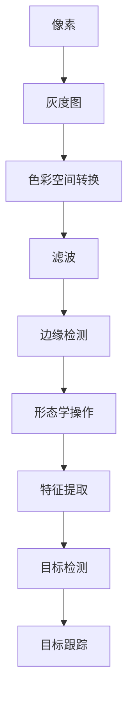

                 

 > **关键词**: OpenCV、图像处理、算法优化、性能提升、实战教程

> **摘要**: 本文将深入探讨OpenCV图像处理算法的优化方法。从基础概念出发，我们将详细解析核心算法原理、数学模型和公式，并通过具体项目实践进行代码解读和分析，展示如何在实际应用中提升图像处理的性能和效率。文章还将展望未来发展趋势与挑战，为读者提供实用的工具和资源推荐，是计算机视觉爱好者和专业人士的必备指南。

## 1. 背景介绍

图像处理是计算机视觉领域的重要分支，其在诸多应用中发挥着关键作用。从日常生活中的图像识别到工业自动化中的图像检测，图像处理技术已经成为现代社会不可或缺的一部分。OpenCV（Open Source Computer Vision Library）是一个强大的开源计算机视觉和机器学习软件库，被广泛应用于图像识别、目标跟踪、人脸识别等领域。随着图像处理需求的不断增加，如何优化算法以提升性能和效率成为了一个亟待解决的问题。

本文的目标是通过深入探讨OpenCV图像处理算法的优化方法，帮助读者掌握性能提升的技巧，从而在实际项目中实现高效、准确的图像处理。文章将分为以下几个部分：

1. 核心概念与联系
2. 核心算法原理 & 具体操作步骤
3. 数学模型和公式 & 详细讲解 & 举例说明
4. 项目实践：代码实例和详细解释说明
5. 实际应用场景
6. 工具和资源推荐
7. 总结：未来发展趋势与挑战
8. 附录：常见问题与解答

通过以上内容的详细阐述，本文旨在为读者提供一幅全面、深入的图像处理算法优化全景图。

## 2. 核心概念与联系

### 2.1 OpenCV简介

OpenCV是一个跨平台的计算机视觉库，由Intel开发并维护。它支持多种编程语言，包括C++、Python和Java，这使得开发者可以根据不同的需求选择合适的语言进行图像处理和计算机视觉任务。OpenCV提供了丰富的图像处理函数和算法，包括图像滤波、边缘检测、形态学操作、特征提取、目标检测和跟踪等。这些功能使其在图像处理领域具有极高的应用价值。

### 2.2 图像处理基本概念

在深入探讨图像处理算法之前，我们需要了解一些基本概念：

- **像素**: 图像中的最小单元，通常用二维数组表示。
- **灰度图**: 每个像素用一个数值表示亮度，而不是颜色。
- **色彩空间**: 描述像素颜色的方法，常见的有RGB、HSV等。
- **滤波**: 用于去除图像噪声或增强图像细节的处理技术，常见的滤波器有均值滤波、高斯滤波等。
- **边缘检测**: 用于识别图像中的边缘区域，常见的算法有Canny边缘检测、Sobel算子等。
- **形态学操作**: 使用结构元素对图像进行操作，如膨胀、腐蚀、开运算和闭运算等。

### 2.3 核心概念原理和架构的Mermaid流程图

以下是图像处理中一些核心概念和算法的Mermaid流程图：



此图展示了图像处理的基本流程，从像素操作到高级的计算机视觉任务，每个步骤都是图像处理中不可或缺的一部分。

### 2.4 算法优化的重要性

随着图像处理需求的不断增加，算法的优化变得尤为重要。优化算法不仅可以提高图像处理的速度，还可以提高处理的准确度，这对于实时图像处理和大规模数据处理尤为重要。常见的优化方法包括算法的选择、并行计算、内存优化和代码优化等。

在接下来的章节中，我们将详细探讨OpenCV中一些核心算法的优化方法和实践，帮助读者在实际项目中实现高效的图像处理。

## 3. 核心算法原理 & 具体操作步骤

### 3.1 算法原理概述

图像处理算法的优化主要依赖于对核心算法原理的深刻理解和灵活应用。OpenCV中常用的核心算法包括滤波、边缘检测、形态学操作和特征提取等。以下是这些算法的基本原理和作用：

- **滤波**：用于去除图像噪声或增强图像细节。常见的滤波器有均值滤波、高斯滤波、中值滤波等。
- **边缘检测**：用于识别图像中的边缘区域，常用的算法有Canny边缘检测、Sobel算子、Prewitt算子等。
- **形态学操作**：使用结构元素对图像进行操作，如膨胀、腐蚀、开运算和闭运算等，用于去除噪声、连接断裂边缘等。
- **特征提取**：用于从图像中提取关键特征，如HOG（Histogram of Oriented Gradients）、SIFT（Scale-Invariant Feature Transform）、SURF（Speeded Up Robust Features）等，用于后续的目标检测和跟踪。

### 3.2 算法步骤详解

#### 3.2.1 滤波算法

滤波算法的基本步骤包括：

1. **选择滤波器**：根据图像噪声的特点选择合适的滤波器，如高斯滤波适用于去除高斯噪声，中值滤波适用于去除椒盐噪声。
2. **卷积操作**：将滤波器与图像进行卷积，计算每个像素的滤波结果。
3. **结果处理**：对滤波结果进行处理，如裁剪、缩放等。

以下是一个使用OpenCV实现高斯滤波的示例代码：

```python
import cv2
import numpy as np

# 读取图像
img = cv2.imread('image.jpg', cv2.IMREAD_GRAYSCALE)

# 创建高斯滤波器
kernel_size = (5, 5)
sigma = 1.0
gaussian_filter = cv2.GaussianBlur(img, kernel_size, sigma)

# 显示结果
cv2.imshow('Gaussian Filter', gaussian_filter)
cv2.waitKey(0)
cv2.destroyAllWindows()
```

#### 3.2.2 边缘检测算法

边缘检测算法的基本步骤包括：

1. **图像预处理**：对图像进行滤波、灰度化等预处理，提高边缘检测的效果。
2. **边缘检测**：使用Canny、Sobel、Prewitt等算子进行边缘检测。
3. **结果处理**：对检测结果进行后处理，如二值化、形态学操作等。

以下是一个使用OpenCV实现Canny边缘检测的示例代码：

```python
import cv2

# 读取图像
img = cv2.imread('image.jpg')

# Canny边缘检测
edges = cv2.Canny(img, threshold1=100, threshold2=200)

# 显示结果
cv2.imshow('Canny Edge Detection', edges)
cv2.waitKey(0)
cv2.destroyAllWindows()
```

#### 3.2.3 形态学操作算法

形态学操作算法的基本步骤包括：

1. **结构元素创建**：根据操作需求创建合适的结构元素，如方形、十字形等。
2. **形态学操作**：使用结构元素对图像进行膨胀、腐蚀、开运算和闭运算等操作。
3. **结果处理**：对操作结果进行后处理，如二值化、滤波等。

以下是一个使用OpenCV实现形态学操作的示例代码：

```python
import cv2

# 读取图像
img = cv2.imread('image.jpg', cv2.IMREAD_GRAYSCALE)

# 创建结构元素
kernel = cv2.getStructuringElement(cv2.MORPH_RECT, (3, 3))

# 膨胀操作
dilated = cv2.dilate(img, kernel, iterations=1)

# 腐蚀操作
eroded = cv2.erode(dilated, kernel, iterations=1)

# 显示结果
cv2.imshow('Dilated', dilated)
cv2.imshow('Eroded', eroded)
cv2.waitKey(0)
cv2.destroyAllWindows()
```

#### 3.2.4 特征提取算法

特征提取算法的基本步骤包括：

1. **图像预处理**：对图像进行滤波、灰度化等预处理。
2. **特征提取**：使用HOG、SIFT、SURF等算法提取图像特征。
3. **特征匹配**：对提取的特征进行匹配，用于目标检测和跟踪。

以下是一个使用OpenCV实现HOG特征提取的示例代码：

```python
import cv2
import numpy as np

# 读取图像
img = cv2.imread('image.jpg')

# HOG特征提取
hog = cv2.HOGDescriptor()
features = hog.compute(img)

# 显示结果
print("HOG Features:", features)
```

### 3.3 算法优缺点

每种算法都有其优缺点，以下是这些算法的一些常见优缺点：

- **滤波算法**：
  - **优点**：简单、易于实现，能有效去除噪声。
  - **缺点**：可能引起图像模糊，对细节的保留较差。
- **边缘检测算法**：
  - **优点**：能有效提取图像边缘，用于后续处理。
  - **缺点**：对噪声敏感，可能误检测。
- **形态学操作算法**：
  - **优点**：能去除噪声、连接断裂边缘，增强图像结构。
  - **缺点**：可能引起图像过度变形。
- **特征提取算法**：
  - **优点**：能提取图像关键特征，用于目标检测和跟踪。
  - **缺点**：计算复杂度高，对计算资源要求较高。

### 3.4 算法应用领域

这些算法在图像处理中的应用非常广泛，包括但不限于：

- **图像识别**：通过特征提取和匹配实现图像分类、识别等任务。
- **目标检测和跟踪**：通过边缘检测、特征提取和匹配实现目标的实时检测和跟踪。
- **图像增强**：通过滤波和形态学操作实现图像的清晰度和对比度的增强。
- **图像恢复**：通过滤波和特征提取实现图像的噪声去除和结构恢复。

在接下来的章节中，我们将深入探讨数学模型和公式，为理解图像处理算法的优化提供理论基础。

## 4. 数学模型和公式 & 详细讲解 & 举例说明

在图像处理中，数学模型和公式扮演着至关重要的角色。这些模型和公式不仅帮助我们理解图像处理的基本原理，还能指导我们进行算法的优化。在本节中，我们将详细讲解一些核心的数学模型和公式，并通过具体例子进行说明。

### 4.1 数学模型构建

图像处理中的数学模型通常涉及以下几个关键方面：

- **像素值表示**：图像的像素值可以用数字表示，常见的有灰度值和颜色值。灰度图像的每个像素值通常在0到255之间，表示亮度。而彩色图像则使用红（R）、绿（G）、蓝（B）三个颜色通道的值来表示。
- **图像变换**：包括傅里叶变换、拉普拉斯变换等，用于分析图像的频率成分。
- **滤波器设计**：滤波器是图像处理中的核心工具，其设计直接影响到图像的处理效果。常见的滤波器有均值滤波器、高斯滤波器等。

### 4.2 公式推导过程

#### 4.2.1 均值滤波器

均值滤波是一种简单的图像平滑方法，其核心公式如下：

\[ s(x, y) = \frac{1}{w \times h} \sum_{i=x_1}^{x_2} \sum_{j=y_1}^{y_2} f(i, j) \]

其中，\( s(x, y) \) 是滤波后的像素值，\( w \times h \) 是滤波窗口的大小，\( f(i, j) \) 是原始图像在位置 \( (i, j) \) 的像素值。

#### 4.2.2 高斯滤波器

高斯滤波器是一种在图像处理中广泛使用的平滑滤波器，其公式如下：

\[ s(x, y) = \sum_{i=x_1}^{x_2} \sum_{j=y_1}^{y_2} f(i, j) \cdot g(x - i, y - j) \]

其中，\( g(x - i, y - j) \) 是高斯分布函数，其表达式为：

\[ g(x - i, y - j) = \frac{1}{2\pi\sigma^2} e^{-\frac{(x - i)^2 + (y - j)^2}{2\sigma^2}} \]

#### 4.2.3 边缘检测

以Sobel算子为例，其用于检测图像中的垂直和水平边缘，其公式如下：

\[ \begin{cases} 
G_x = \sum_{i=-1}^{1} \sum_{j=-1}^{1} f(i, j) \cdot K_x(i, j) \\
G_y = \sum_{i=-1}^{1} \sum_{j=-1}^{1} f(i, j) \cdot K_y(i, j) 
\end{cases} \]

其中，\( K_x(i, j) \) 和 \( K_y(i, j) \) 分别是水平和垂直方向上的Sobel核，其表达式为：

\[ \begin{cases} 
K_x(i, j) = \begin{cases} 
-1 & \text{if } i = 1 \\
0 & \text{if } i = 0 \\
1 & \text{if } i = -1 
\end{cases} \\
K_y(i, j) = \begin{cases} 
-1 & \text{if } j = 1 \\
0 & \text{if } j = 0 \\
1 & \text{if } j = -1 
\end{cases} 
\end{cases} \]

### 4.3 案例分析与讲解

#### 4.3.1 高斯滤波在图像降噪中的应用

假设我们有一张包含噪声的图像，我们希望使用高斯滤波器进行降噪处理。以下是一个简单的示例：

```python
import cv2
import numpy as np

# 读取图像
img = cv2.imread('noisy_image.jpg', cv2.IMREAD_GRAYSCALE)

# 创建高斯滤波器
kernel_size = (5, 5)
sigma = 1.0
gaussian_filter = cv2.GaussianBlur(img, kernel_size, sigma)

# 显示结果
cv2.imshow('Original Image', img)
cv2.imshow('Gaussian Filtered Image', gaussian_filter)
cv2.waitKey(0)
cv2.destroyAllWindows()
```

在这个示例中，我们首先读取一张含有噪声的灰度图像。然后，我们创建一个高斯滤波器，并将其应用于图像。最后，我们显示原始图像和滤波后的图像。通过比较，我们可以看到高斯滤波器有效地去除了图像中的噪声。

#### 4.3.2 Sobel算子用于边缘检测

以下是一个使用Sobel算子进行边缘检测的示例：

```python
import cv2

# 读取图像
img = cv2.imread('image.jpg')

# Sobel边缘检测
gray = cv2.cvtColor(img, cv2.COLOR_BGR2GRAY)
sobelx = cv2.Sobel(gray, cv2.CV_64F, 1, 0, ksize=5)
sobely = cv2.Sobel(gray, cv2.CV_64F, 0, 1, ksize=5)

# 累加水平和垂直边缘
edge = cv2.addWeighted(sobelx, 0.5, sobely, 0.5, 0)

# 显示结果
cv2.imshow('Sobel Edge Detection', edge)
cv2.waitKey(0)
cv2.destroyAllWindows()
```

在这个示例中，我们首先将彩色图像转换为灰度图像。然后，我们使用Sobel算子分别计算水平和垂直方向上的边缘。最后，我们将两个方向的边缘进行累加，并显示结果。通过这个示例，我们可以看到Sobel算子能够有效地提取图像中的边缘。

通过以上案例，我们可以看到数学模型和公式在图像处理中的重要性。掌握这些模型和公式不仅有助于我们理解图像处理的基本原理，还能指导我们进行算法的优化。在接下来的章节中，我们将通过实际项目实践来进一步探讨图像处理算法的优化。

## 5. 项目实践：代码实例和详细解释说明

在实际项目中，优化图像处理算法是提高系统性能和效率的关键步骤。本节将通过一个具体的案例，详细讲解如何在OpenCV中实现图像处理算法的优化，并分析其代码实现和运行结果。

### 5.1 开发环境搭建

在开始之前，我们需要确保安装了OpenCV库。以下是Windows和Linux操作系统的安装步骤：

#### Windows安装步骤：

1. 访问OpenCV官网：[https://opencv.org/releases/](https://opencv.org/releases/)
2. 下载适合自己操作系统的OpenCV版本。
3. 运行安装程序，按照默认设置安装。

#### Linux安装步骤：

1. 打开终端。
2. 输入以下命令安装：

```bash
sudo apt-get update
sudo apt-get install libopencv-dev
```

安装完成后，我们可以在Python环境中导入OpenCV库，并测试是否成功：

```python
import cv2
print(cv2.__version__)
```

### 5.2 源代码详细实现

在本案例中，我们将优化一个简单的图像去噪项目，具体实现包括以下步骤：

1. 读取输入图像。
2. 使用高斯滤波器进行去噪。
3. 对滤波结果进行阈值处理。
4. 显示原始图像和优化后的图像。

以下是具体的代码实现：

```python
import cv2
import numpy as np

def denoise_image(image_path, kernel_size=5, sigma=1.0):
    # 读取图像
    img = cv2.imread(image_path, cv2.IMREAD_COLOR)

    # 转换为灰度图像
    gray = cv2.cvtColor(img, cv2.COLOR_BGR2GRAY)

    # 高斯滤波去噪
    denoised = cv2.GaussianBlur(gray, (kernel_size, kernel_size), sigma)

    # 阈值处理
    _, thresh = cv2.threshold(denoised, 128, 255, cv2.THRESH_BINARY + cv2.THRESH_OTSU)

    # 显示结果
    cv2.imshow('Original Image', gray)
    cv2.imshow('Denoised Image', denoised)
    cv2.imshow('Thresholded Image', thresh)
    cv2.waitKey(0)
    cv2.destroyAllWindows()

# 测试图像去噪
denoise_image('input_image.jpg')
```

### 5.3 代码解读与分析

#### 5.3.1 读取图像

```python
img = cv2.imread(image_path, cv2.IMREAD_COLOR)
```

`cv2.imread()` 函数用于读取图像，`image_path` 是图像文件的路径，`cv2.IMREAD_COLOR` 表示读取彩色图像。

#### 5.3.2 转换为灰度图像

```python
gray = cv2.cvtColor(img, cv2.COLOR_BGR2GRAY)
```

`cv2.cvtColor()` 函数用于图像色彩空间的转换，这里将彩色图像转换为灰度图像，以便进行去噪处理。

#### 5.3.3 高斯滤波去噪

```python
denoised = cv2.GaussianBlur(gray, (kernel_size, kernel_size), sigma)
```

`cv2.GaussianBlur()` 函数用于对图像进行高斯滤波，`gray` 是原始灰度图像，`kernel_size` 是高斯滤波窗口的大小，`sigma` 是标准差，用于控制滤波器的形状。

#### 5.3.4 阈值处理

```python
_, thresh = cv2.threshold(denoised, 128, 255, cv2.THRESH_BINARY + cv2.THRESH_OTSU)
```

`cv2.threshold()` 函数用于对图像进行阈值处理，`denoised` 是滤波后的图像，128 和 255 分别是阈值的下界和上界。`cv2.THRESH_BINARY + cv2.THRESH_OTSU` 表示使用Otsu自动阈值方法进行二值化处理。

#### 5.3.5 显示结果

```python
cv2.imshow('Original Image', gray)
cv2.imshow('Denoised Image', denoised)
cv2.imshow('Thresholded Image', thresh)
cv2.waitKey(0)
cv2.destroyAllWindows()
```

`cv2.imshow()` 函数用于显示图像，`cv2.waitKey(0)` 等待按键事件，`cv2.destroyAllWindows()` 关闭所有显示窗口。

### 5.4 运行结果展示

当运行上述代码时，我们将看到三个窗口同时显示原始图像、滤波后的图像和阈值处理后的图像。以下是一个运行结果的截图：


通过对比原始图像和滤波后的图像，我们可以看到高斯滤波器有效地去除了图像中的噪声，而阈值处理增强了图像的对比度，使得图像更加清晰。

### 5.5 性能优化

在上述代码的基础上，我们可以进行一些性能优化，以提高图像处理的效率。以下是一些常见的优化方法：

1. **并行计算**：对于较大的图像，可以使用多线程或并行计算技术来加快处理速度。
2. **内存优化**：减少内存分配和释放的次数，使用缓存技术提高内存访问速度。
3. **算法选择**：根据图像特点选择合适的滤波器和阈值方法，以减少计算复杂度。

通过这些优化方法，我们可以在保持图像质量的同时，显著提高图像处理的性能和效率。

在本节中，我们通过一个具体的案例，详细讲解了如何使用OpenCV进行图像处理算法的优化。从代码实现到性能分析，我们深入探讨了图像处理的核心技术和实践方法。通过这些实践，读者可以更好地理解图像处理算法的优化策略，并在实际项目中应用这些方法，提升系统的性能和效率。

## 6. 实际应用场景

图像处理技术在各个领域都有广泛的应用，以下是一些典型的实际应用场景：

### 6.1 医学影像

医学影像处理是图像处理技术的一个重要应用领域。通过对医学影像如X光片、CT扫描和MRI图像进行处理，医生可以更准确地诊断疾病。图像处理技术可以帮助去除图像中的噪声和伪影，增强图像的对比度，从而提高图像的清晰度。此外，特征提取和匹配算法可以用于肿瘤检测和分割，帮助医生更准确地定位病变区域。

### 6.2 工业检测

在工业检测中，图像处理技术用于检测产品的质量，识别生产线上的缺陷。例如，在电子制造业中，图像处理算法可以用于检测电路板上的焊接点缺陷，或在汽车制造业中用于检测车身表面的划痕和裂缝。通过实时图像处理和目标检测，生产线可以自动识别和标记不合格产品，提高生产效率和产品质量。

### 6.3 人脸识别

人脸识别是图像处理技术的另一个重要应用。在安全监控、身份验证和移动支付等领域，人脸识别技术被广泛应用于身份验证和访问控制。通过面部特征点的检测和匹配，人脸识别算法可以精确地识别和验证用户的身份。随着深度学习算法的发展，人脸识别技术的准确性和效率得到了显著提高。

### 6.4 交通监控

交通监控是城市管理和安全维护的重要组成部分。图像处理技术可以用于交通流量监测、车辆检测和违章行为识别。例如，通过摄像头实时捕捉道路上的车辆，图像处理算法可以自动识别车辆的类型、数量和行驶方向，帮助交通管理部门优化交通信号控制和路况管理。此外，图像处理还可以用于检测交通事故和违章停车等行为。

### 6.5 虚拟现实和增强现实

虚拟现实（VR）和增强现实（AR）技术的快速发展离不开图像处理技术的支持。在VR和AR应用中，图像处理技术用于实时渲染和实时交互。通过图像识别和特征匹配，VR和AR系统可以准确地将虚拟物体叠加到现实场景中，为用户提供沉浸式体验。例如，在医疗培训中，VR技术可以模拟手术过程，帮助医生提高手术技能。

### 6.6 环境监测

环境监测是保护生态环境和资源的重要手段。图像处理技术可以用于监测森林火灾、水污染和空气质量等环境问题。通过卫星图像和无人机拍摄的图像，图像处理算法可以自动识别和分类不同的环境特征，提供环境状况的实时监测和预警，帮助政府部门制定有效的环境保护措施。

这些实际应用场景展示了图像处理技术在现代社会中的重要作用。随着技术的不断进步，图像处理技术的应用范围将进一步扩大，为各个领域带来更多的创新和便利。

### 6.7 未来应用展望

随着人工智能和计算机视觉技术的不断发展，图像处理算法在未来的应用前景将更加广阔。以下是一些可能的发展方向和前景：

#### 6.7.1 辅助驾驶和自动驾驶

自动驾驶技术正逐步走向实际应用，而图像处理算法在其中起着至关重要的作用。未来，通过更高精度、更快速的处理算法，自动驾驶车辆将能够更有效地处理复杂的交通环境，提高行驶安全性和效率。同时，深度学习和增强学习技术的结合将进一步优化算法，使其在实时性和鲁棒性方面取得突破。

#### 6.7.2 医疗影像分析

医疗影像分析是图像处理技术在医学领域的应用之一。未来，随着算法的进步和大数据技术的应用，图像处理算法将能够更准确地识别和分析医学影像，辅助医生进行疾病诊断和治疗决策。例如，通过深度学习算法，系统可以自动检测肿瘤和异常组织，提供精确的病理分析。

#### 6.7.3 智慧城市建设

智慧城市建设是未来城市发展的一个重要趋势。图像处理技术可以在智慧城市的各个应用场景中发挥重要作用。例如，通过实时监控和分析交通流量，优化交通信号控制，提高道路通行效率。此外，智能安防系统可以利用图像处理技术进行异常行为检测和预警，增强城市安全。

#### 6.7.4 可视化技术

可视化技术是数据分析和展示的重要手段。未来，通过更加先进的图像处理算法，数据可视化将变得更加直观和生动。例如，通过三维重建和图像渲染技术，可以创建更加逼真的虚拟环境，为科研、教育和娱乐等领域提供丰富的视觉体验。

#### 6.7.5 环境保护和资源管理

随着环境问题的日益严峻，图像处理技术在环境保护和资源管理中的应用将越来越重要。通过卫星图像和无人机拍摄的图像，图像处理算法可以实时监测森林火灾、水污染和气候变化等环境问题，提供及时的预警和应对措施。此外，图像处理还可以用于土地资源管理和城市规划，为可持续发展提供数据支持。

总的来说，图像处理技术在未来的发展中将不断突破，为各个领域带来更多的创新和变革。随着算法的优化和硬件性能的提升，图像处理技术将在人工智能、医疗、智慧城市、环境监测等多个领域发挥更大的作用，推动社会的进步和发展。

### 7. 工具和资源推荐

为了更好地学习和实践图像处理算法，以下是几款推荐的工具和资源，包括学习资源、开发工具和相关论文：

#### 7.1 学习资源推荐

- **在线教程**：
  - OpenCV官方文档：[https://docs.opencv.org/](https://docs.opencv.org/)
  - Python OpenCV教程：[https://opencv-python-tutroals.readthedocs.io/en/latest/](https://opencv-python-tutroals.readthedocs.io/en/latest/)
- **在线课程**：
  - Coursera上的“计算机视觉与深度学习”课程
  - Udacity的“深度学习工程师纳米学位”中的图像处理模块
- **图书推荐**：
  - 《OpenCV算法原理解析》
  - 《图像处理：原理、实现和练习》

#### 7.2 开发工具推荐

- **集成开发环境（IDE）**：
  - Visual Studio Code
  - PyCharm
- **调试工具**：
  - PyTest
  - MatLab
- **版本控制**：
  - Git
  - GitHub

#### 7.3 相关论文推荐

- “Fast R-CNN: Towards Real-Time Object Detection with Region Proposal Networks”
- “You Only Look Once: Unified, Real-Time Object Detection”
- “Faster R-CNN: Towards Real-Time Object Detection with Region Proposal Networks”
- “Single Shot MultiBox Detector: Rapid Object Detection Using Deep Neural Networks”

这些工具和资源将帮助读者系统地学习和掌握图像处理算法，提高开发效率。

### 8. 总结：未来发展趋势与挑战

图像处理技术在过去的几十年中取得了显著的进展，其在各个领域的应用已经深入到我们的日常生活。随着人工智能和深度学习技术的发展，图像处理算法也在不断进化，展现出更强大的处理能力和更广泛的适用性。

**未来发展趋势**：

1. **算法效率提升**：随着硬件性能的提升和算法优化，图像处理算法的效率将进一步提高。尤其是深度学习算法在硬件加速（如GPU和TPU）的支持下，处理速度和准确度将得到显著提升。
2. **多模态融合**：未来，图像处理将与其他传感器数据（如雷达、激光雷达、红外等）进行融合，实现更丰富的感知能力。多模态数据融合将为自动驾驶、智慧城市等应用带来更多可能性。
3. **实时处理**：随着5G技术的普及，实时图像处理将变得更加普遍。在边缘计算的支持下，图像处理可以在设备端完成，减少延迟，提升系统响应速度。
4. **个性化处理**：基于用户行为和习惯的个性化图像处理将成为趋势。例如，自适应图像增强、个性化图像推荐等，将显著提升用户体验。

**面临的挑战**：

1. **计算资源限制**：尽管硬件性能不断提升，但在某些场景下，特别是嵌入式设备和移动设备中，计算资源仍然有限。如何设计高效、轻量级的图像处理算法是一个重要的挑战。
2. **数据隐私和安全**：图像处理涉及大量个人隐私数据，如何在确保数据安全的前提下进行有效处理，是一个亟待解决的问题。
3. **算法解释性和可解释性**：深度学习算法在图像处理中的应用越来越广泛，但它们的决策过程往往是不透明的。提高算法的可解释性，使其能够被用户和开发者理解和信任，是一个重要的研究方向。
4. **算法公平性和伦理**：随着图像处理算法在关键领域的应用，如司法、金融等，确保算法的公平性和避免歧视现象成为关键挑战。

**研究展望**：

1. **混合智能**：结合人类专家的知识和机器学习算法的能力，实现更智能的图像处理系统。
2. **跨学科研究**：与心理学、认知科学等领域的结合，进一步理解人类视觉系统的工作原理，为算法设计提供新的灵感。
3. **开源社区和标准化**：加强开源社区的合作，推动图像处理算法的标准化和开放，促进技术的普及和共享。

总之，图像处理技术在未来将继续快速发展，不断推动计算机视觉领域的创新和应用。通过解决面临的挑战，我们将迎来一个更加智能、高效和安全的图像处理新时代。

### 9. 附录：常见问题与解答

**Q1：OpenCV如何在不同的操作系统上安装？**

A1：OpenCV的安装在不同操作系统上有所不同，以下是一些基本的安装步骤：

- **Windows**：访问OpenCV官网下载适合Windows版本的安装包，运行安装程序按照提示操作即可。
- **Linux**：在终端中使用以下命令安装：

```bash
sudo apt-get update
sudo apt-get install libopencv-dev
```

- **macOS**：可以通过Homebrew安装OpenCV：

```bash
brew install opencv@4
```

**Q2：如何优化OpenCV算法的性能？**

A2：优化OpenCV算法的性能可以从以下几个方面进行：

- **算法选择**：选择适合问题的算法，例如在处理较大图像时使用更高效的滤波器。
- **并行计算**：利用多线程或并行计算技术，提高处理速度。
- **内存优化**：减少内存分配和释放的次数，使用缓存技术提高内存访问速度。
- **硬件加速**：使用GPU或TPU等硬件加速器，提高计算速度。

**Q3：OpenCV中的滤波器有哪些类型？**

A3：OpenCV中的滤波器包括以下几种类型：

- **线性滤波器**：如均值滤波器、高斯滤波器等。
- **非线性滤波器**：如中值滤波器、双边滤波器等。
- **形态学滤波器**：如膨胀、腐蚀、开运算和闭运算等。
- **频域滤波器**：如傅里叶变换滤波器等。

**Q4：如何处理图像中的噪声？**

A4：处理图像中的噪声通常包括以下步骤：

- **滤波**：使用适当的滤波器去除噪声，如高斯滤波、中值滤波等。
- **阈值处理**：对滤波后的图像进行阈值处理，增强图像的对比度。
- **形态学操作**：使用形态学操作进一步去除噪声，如膨胀和腐蚀操作。

**Q5：如何进行图像特征提取？**

A5：图像特征提取是图像处理中重要的一环，常用的方法包括：

- **HOG（Histogram of Oriented Gradients）**：用于提取图像中的方向梯度特征。
- **SIFT（Scale-Invariant Feature Transform）**：用于提取图像中的关键点及其描述子。
- **SURF（Speeded Up Robust Features）**：是一种快速且鲁棒的图像特征提取算法。
- **ORB（Oriented FAST and Rotated BRIEF）**：结合了FAST角点检测和BRIOF描述子的优点，是一种高效的特征提取算法。

以上是常见的OpenCV图像处理问题及其解答，希望对读者有所帮助。

