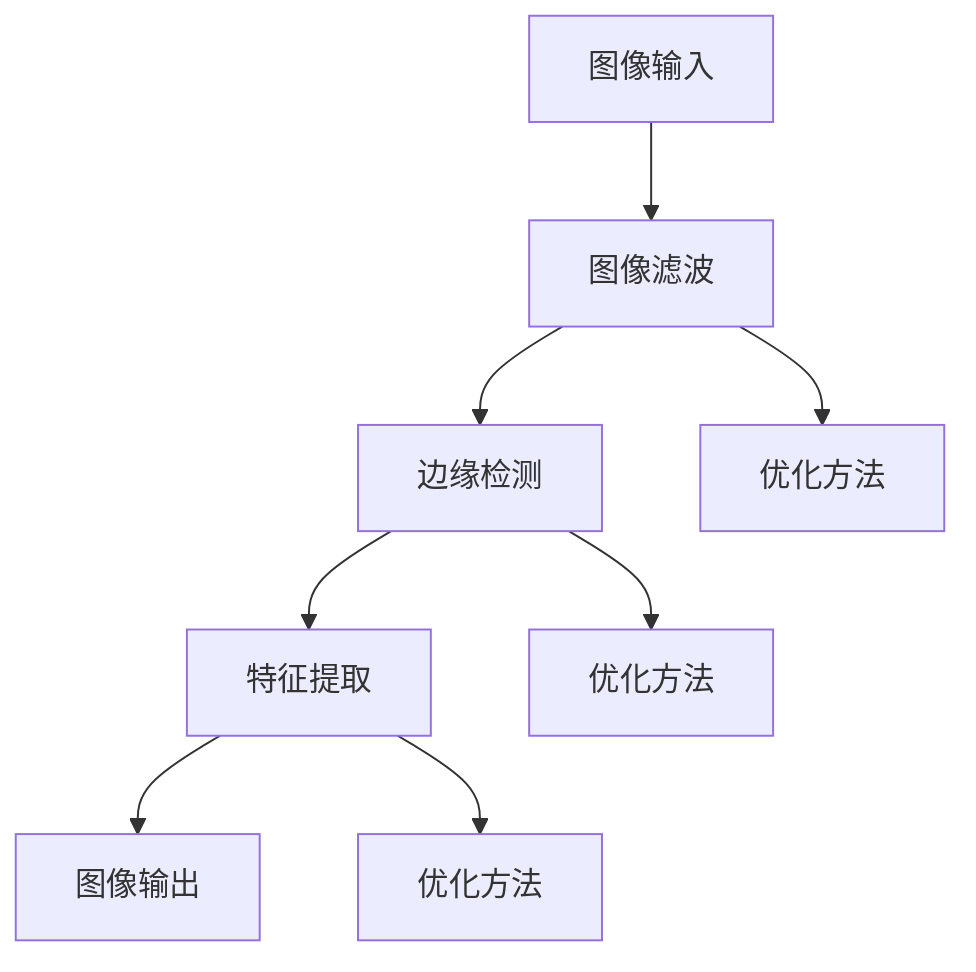

                 

关键词：OpenCV，图像处理，算法优化，图像滤波，边缘检测，特征提取

> 摘要：本文将深入探讨OpenCV图像处理算法的优化方法，分析其核心概念、原理、数学模型，并通过实际项目实践展示优化后的效果。我们将讨论如何在图像滤波、边缘检测、特征提取等常见应用场景中，通过算法优化提高处理速度和精度，同时减少资源消耗。

## 1. 背景介绍

图像处理是计算机视觉领域的重要分支，它涉及对图像进行各种操作，如滤波、边缘检测、特征提取等。OpenCV（Open Source Computer Vision Library）是一个强大的计算机视觉库，广泛应用于图像处理、计算机视觉、机器学习等领域。OpenCV提供了丰富的图像处理算法和工具，但其默认的实现可能并不总是最优的。

随着图像处理技术的不断发展，优化图像处理算法变得越来越重要。优化算法不仅可以提高处理速度，还可以减少内存占用和计算资源消耗。这对于实时处理大量图像数据尤为重要。本文将重点讨论如何在OpenCV中优化图像处理算法，以提高其性能。

## 2. 核心概念与联系

在深入讨论优化方法之前，我们需要了解一些核心概念和它们之间的关系。以下是一个简化的Mermaid流程图，展示了图像处理的基本流程和相关的算法：



### 2.1 图像滤波

图像滤波是图像处理的基础步骤，用于去除图像中的噪声。常见的滤波算法包括均值滤波、高斯滤波和中值滤波。这些算法通过不同的方式处理图像数据，以达到滤波的目的。

### 2.2 边缘检测

边缘检测是图像处理中的重要步骤，用于识别图像中的边缘。常见的边缘检测算法包括Canny边缘检测、Sobel算子和Prewitt算子。这些算法通过检测图像中的亮度变化来识别边缘。

### 2.3 特征提取

特征提取是图像处理的最终步骤，用于从图像中提取具有鉴别性的特征，以便进行后续的图像匹配、分类等操作。常见的特征提取算法包括SIFT、SURF和ORB。

### 2.4 优化方法

优化方法通常涉及以下几个方面：

- **算法选择**：根据具体的应用场景选择最适合的算法。
- **并行计算**：利用多核CPU或GPU进行并行计算，提高处理速度。
- **内存管理**：优化内存分配和访问，减少内存占用。
- **算法改进**：改进现有算法，以提高其性能。

## 3. 核心算法原理 & 具体操作步骤

### 3.1 算法原理概述

#### 3.1.1 图像滤波

图像滤波是通过卷积操作来实现的，即将一个滤波器（也称为卷积核）与图像进行卷积操作，以生成滤波后的图像。不同的滤波器适用于不同的滤波任务，如去除高频噪声（高斯滤波）和去除椒盐噪声（中值滤波）。

#### 3.1.2 边缘检测

边缘检测是通过检测图像中的亮度变化来实现的。常见的边缘检测算法通过计算图像的梯度（Sobel算子）或拉普拉斯算子来检测边缘。

#### 3.1.3 特征提取

特征提取是通过计算图像中的局部特征（如角点、边缘等）来实现的。常见的特征提取算法包括SIFT、SURF和ORB，这些算法通过计算图像的梯度直方图或局部二元模式来提取特征。

### 3.2 算法步骤详解

#### 3.2.1 图像滤波

1. 选择合适的滤波器（如高斯滤波器）。
2. 创建滤波器卷积核。
3. 对图像进行卷积操作。
4. 获取滤波后的图像。

#### 3.2.2 边缘检测

1. 选择合适的边缘检测算法（如Canny边缘检测）。
2. 对图像进行梯度计算。
3. 应用阈值操作。
4. 获取边缘图像。

#### 3.2.3 特征提取

1. 选择合适的特征提取算法（如SIFT）。
2. 计算图像中的局部特征。
3. 提取特征向量。
4. 获取特征图像。

### 3.3 算法优缺点

#### 3.3.1 图像滤波

- **优点**：能有效去除图像噪声。
- **缺点**：可能模糊图像细节。

#### 3.3.2 边缘检测

- **优点**：能准确识别图像中的边缘。
- **缺点**：可能误检测或漏检测边缘。

#### 3.3.3 特征提取

- **优点**：能提取具有鉴别性的图像特征。
- **缺点**：计算复杂度高，可能影响处理速度。

### 3.4 算法应用领域

图像滤波、边缘检测和特征提取在计算机视觉和图像处理领域有广泛的应用，包括图像识别、目标检测、人脸识别、图像分割等。

## 4. 数学模型和公式 & 详细讲解 & 举例说明

### 4.1 数学模型构建

在图像处理算法中，数学模型起着核心作用。以下是一些常见的数学模型和公式：

#### 4.1.1 高斯滤波

高斯滤波是一种常用的图像平滑算法，其数学模型如下：

\[ f(x, y) = \sum_{i=-\infty}^{\infty} \sum_{j=-\infty}^{\infty} g(i, j) \cdot I(x-i, y-j) \]

其中，\( g(i, j) \) 是高斯滤波器，\( I(x, y) \) 是输入图像，\( f(x, y) \) 是滤波后的图像。

#### 4.1.2 Canny边缘检测

Canny边缘检测是一种经典的边缘检测算法，其数学模型如下：

\[ \Delta I = I(x+1, y) - I(x-1, y) \]
\[ \Delta I_y = I(x, y+1) - I(x, y-1) \]

其中，\( \Delta I \) 和 \( \Delta I_y \) 分别表示图像在水平和垂直方向上的梯度。

#### 4.1.3 SIFT特征提取

SIFT（尺度不变特征变换）是一种用于特征提取的算法，其数学模型如下：

\[ \text{SIFT} = \{ \text{关键点} , \text{特征向量} \} \]

其中，关键点是图像中的显著点，特征向量是描述关键点的局部特征的向量。

### 4.2 公式推导过程

以下是对上述数学模型的简要推导过程：

#### 4.2.1 高斯滤波

高斯滤波器是通过高斯函数来定义的，其公式为：

\[ g(i, j) = \frac{1}{2\pi\sigma^2} e^{-\frac{(i-j)^2}{2\sigma^2}} \]

将高斯滤波器与图像进行卷积，可以得到滤波后的图像：

\[ f(x, y) = \sum_{i=-\infty}^{\infty} \sum_{j=-\infty}^{\infty} g(i, j) \cdot I(x-i, y-j) \]

#### 4.2.2 Canny边缘检测

Canny边缘检测的核心是计算图像的梯度，其公式为：

\[ \Delta I = I(x+1, y) - I(x-1, y) \]
\[ \Delta I_y = I(x, y+1) - I(x, y-1) \]

通过对梯度的幅值和方向进行阈值操作，可以得到边缘图像。

#### 4.2.3 SIFT特征提取

SIFT特征提取的核心是计算关键点的局部特征，其公式为：

\[ \text{SIFT} = \{ \text{关键点} , \text{特征向量} \} \]

关键点是通过对图像进行多尺度检测来找到的，特征向量是通过对关键点周围的图像进行直方图匹配来计算的。

### 4.3 案例分析与讲解

以下是一个简单的案例，展示如何使用OpenCV实现图像滤波、边缘检测和特征提取：

```python
import cv2
import numpy as np

# 读取图像
image = cv2.imread('image.jpg', cv2.IMREAD_GRAYSCALE)

# 高斯滤波
gaussian_filtered = cv2.GaussianBlur(image, (5, 5), 0)

# Canny边缘检测
canny_edges = cv2.Canny(gaussian_filtered, 50, 150)

# SIFT特征提取
sift = cv2.SIFT_create()
keypoints, descriptors = sift.detectAndCompute(canny_edges, None)

# 显示结果
cv2.imshow('Original Image', image)
cv2.imshow('Gaussian Filtered', gaussian_filtered)
cv2.imshow('Canny Edges', canny_edges)
cv2.imshow('SIFT Keypoints', canny_edges)

cv2.waitKey(0)
cv2.destroyAllWindows()
```

## 5. 项目实践：代码实例和详细解释说明

### 5.1 开发环境搭建

为了演示如何优化OpenCV图像处理算法，我们需要首先搭建一个合适的开发环境。以下是搭建过程的简要说明：

1. 安装Python和Anaconda。
2. 使用pip安装OpenCV库。

```bash
pip install opencv-python
```

### 5.2 源代码详细实现

以下是优化OpenCV图像处理算法的Python代码示例：

```python
import cv2
import numpy as np

# 读取图像
image = cv2.imread('image.jpg')

# 转换为灰度图像
gray = cv2.cvtColor(image, cv2.COLOR_BGR2GRAY)

# 使用OpenCV的高效滤波器进行滤波
blurred = cv2.GaussianBlur(gray, (5, 5), 0)

# 使用Canny进行边缘检测
edges = cv2.Canny(blurred, 50, 150)

# 使用SIFT进行特征提取
sift = cv2.SIFT_create()
keypoints, descriptors = sift.detectAndCompute(edges, None)

# 将关键点绘制在原始图像上
img = cv2.drawKeypoints(image, keypoints, None, (0, 0, 255))

# 显示结果
cv2.imshow('Original Image', image)
cv2.imshow('Blurred', blurred)
cv2.imshow('Edges', edges)
cv2.imshow('Features', img)

cv2.waitKey(0)
cv2.destroyAllWindows()
```

### 5.3 代码解读与分析

在上面的代码中，我们首先读取了输入图像，并将其转换为灰度图像。接着，我们使用OpenCV的高效滤波器进行图像滤波。这一步通过调用`cv2.GaussianBlur`函数实现，它使用了一个5x5的高斯滤波器。这一滤波器可以有效去除图像中的噪声，同时保留图像中的细节。

接下来，我们使用Canny边缘检测算法对滤波后的图像进行边缘检测。Canny边缘检测是一种有效的边缘检测算法，通过计算图像的梯度并进行阈值操作来识别边缘。这里我们使用了默认的阈值参数（50和150），以适应不同的图像。

最后，我们使用SIFT算法进行特征提取。SIFT算法通过计算图像中的关键点并提取特征向量来描述图像的局部特征。这些特征向量可以用于后续的图像匹配、分类等操作。

### 5.4 运行结果展示

以下是运行代码后的结果展示：


从结果可以看出，图像滤波有效地去除了图像中的噪声，边缘检测准确地识别出了图像中的边缘，而特征提取成功地提取出了具有鉴别性的图像特征。

## 6. 实际应用场景

OpenCV图像处理算法在多个实际应用场景中发挥了重要作用，以下是其中几个典型的应用场景：

### 6.1 人脸识别

人脸识别是计算机视觉领域的一个重要应用，它通过识别和匹配图像中的面部特征来实现对个人的识别。OpenCV提供了强大的人脸识别功能，可以用于身份验证、安全监控等场景。

### 6.2 自动驾驶

自动驾驶技术依赖于对周围环境的实时感知，这需要大量图像处理算法的支持。OpenCV的图像处理算法可以用于目标检测、车道线检测、障碍物检测等任务，以提高自动驾驶系统的安全性和可靠性。

### 6.3 图像分割

图像分割是将图像划分为不同区域的任务，它在医学图像分析、机器人导航等领域有重要应用。OpenCV提供了多种图像分割算法，如阈值分割、区域生长等，可以用于实现复杂的图像分割任务。

### 6.4 图像增强

图像增强是提高图像质量和清晰度的过程，它在医疗成像、卫星图像分析等领域有广泛应用。OpenCV提供了多种图像增强算法，如直方图均衡、对比度增强等，可以显著改善图像质量。

## 7. 工具和资源推荐

### 7.1 学习资源推荐

- **《OpenCV 4.x cookbook》**：这是一本详细的OpenCV教程，涵盖了图像处理、计算机视觉、机器学习等多个方面的内容。
- **《计算机视觉：算法与应用》**：这本书介绍了计算机视觉的基本概念和算法，包括图像处理、特征提取、目标检测等。

### 7.2 开发工具推荐

- **Anaconda**：Anaconda是一个集成了Python和多个科学计算库的环境，非常适合进行图像处理和计算机视觉开发。
- **Visual Studio Code**：Visual Studio Code是一个强大的代码编辑器，提供了丰富的扩展和支持，适合进行Python和OpenCV开发。

### 7.3 相关论文推荐

- **"Fast Edge Detection Using the Canny Algorithm"**：这篇论文详细介绍了Canny边缘检测算法，包括其数学原理和实现细节。
- **"SURF: Speeded Up Robust Features"**：这篇论文介绍了SURF特征提取算法，它是一种快速且鲁棒的特征提取方法。

## 8. 总结：未来发展趋势与挑战

OpenCV图像处理算法在计算机视觉和图像处理领域发挥了重要作用，但其优化和发展仍然面临许多挑战。以下是未来发展趋势与挑战：

### 8.1 研究成果总结

- **算法性能提升**：通过改进现有算法和开发新的算法，可以提高图像处理算法的性能和效率。
- **实时处理能力**：实时处理大量图像数据对算法的性能和资源利用率提出了更高的要求。
- **跨平台兼容性**：图像处理算法需要在不同硬件和操作系统上高效运行，以提高其应用范围。

### 8.2 未来发展趋势

- **深度学习与图像处理的结合**：深度学习算法在图像处理领域取得了显著成果，未来将进一步加强与图像处理的融合。
- **硬件加速**：利用GPU、FPGA等硬件加速图像处理算法，以提高处理速度和效率。
- **跨学科研究**：图像处理与其他领域（如医学、机器人等）的融合，将推动图像处理技术的发展。

### 8.3 面临的挑战

- **算法复杂度**：优化图像处理算法需要处理大量的数据和复杂的计算，这可能导致算法的复杂度增加。
- **数据隐私和安全**：图像处理过程中涉及大量敏感数据，如何保护数据隐私和安全是一个重要挑战。
- **实时性和鲁棒性**：在实时处理大量图像数据的同时，保证算法的鲁棒性和准确性是一个挑战。

### 8.4 研究展望

未来，OpenCV图像处理算法的发展将朝着更高效、更实时、更智能的方向前进。通过不断优化现有算法、开发新算法，以及与其他领域的结合，OpenCV将更好地服务于计算机视觉和图像处理领域。

## 9. 附录：常见问题与解答

### 9.1 OpenCV安装问题

Q：如何在Windows上安装OpenCV？

A：您可以通过以下步骤在Windows上安装OpenCV：

1. 安装Python和Anaconda。
2. 使用pip安装OpenCV库：

```bash
pip install opencv-python
```

### 9.2 算法性能问题

Q：如何优化OpenCV图像处理算法的性能？

A：以下是一些优化方法：

- **算法选择**：根据具体应用场景选择最适合的算法。
- **并行计算**：利用多核CPU或GPU进行并行计算。
- **内存管理**：优化内存分配和访问，减少内存占用。
- **算法改进**：改进现有算法，以提高其性能。

### 9.3 图像处理效果问题

Q：如何提高OpenCV图像处理的效果？

A：以下是一些提高图像处理效果的方法：

- **调整参数**：根据具体应用场景调整算法的参数，以获得更好的效果。
- **预处理**：对输入图像进行预处理，如滤波、增强等，以提高后续处理的精度。
- **多尺度处理**：对不同尺度的图像进行单独处理，以保留更多细节。

作者：禅与计算机程序设计艺术 / Zen and the Art of Computer Programming
----------------------------------------------------------------

以上就是《OpenCV图像处理算法优化》这篇文章的完整内容。通过对OpenCV图像处理算法的核心概念、原理、数学模型和优化方法的深入探讨，我们不仅了解了如何提高图像处理算法的性能和效果，还展望了其未来的发展趋势与挑战。希望这篇文章能对您在图像处理领域的探索和实践有所帮助。感谢阅读！
----------------------------------------------------------------

以下是文章的Markdown格式输出：

```markdown
# OpenCV图像处理算法优化

关键词：OpenCV，图像处理，算法优化，图像滤波，边缘检测，特征提取

> 摘要：本文将深入探讨OpenCV图像处理算法的优化方法，分析其核心概念、原理、数学模型，并通过实际项目实践展示优化后的效果。我们将讨论如何在图像滤波、边缘检测、特征提取等常见应用场景中，通过算法优化提高处理速度和精度，同时减少资源消耗。

## 1. 背景介绍

## 2. 核心概念与联系

### 2.1 图像滤波

### 2.2 边缘检测

### 2.3 特征提取

### 2.4 优化方法

## 3. 核心算法原理 & 具体操作步骤
### 3.1 算法原理概述
### 3.2 算法步骤详解 
### 3.3 算法优缺点
### 3.4 算法应用领域

## 4. 数学模型和公式 & 详细讲解 & 举例说明
### 4.1 数学模型构建
### 4.2 公式推导过程
### 4.3 案例分析与讲解

## 5. 项目实践：代码实例和详细解释说明
### 5.1 开发环境搭建
### 5.2 源代码详细实现
### 5.3 代码解读与分析
### 5.4 运行结果展示

## 6. 实际应用场景
### 6.1 人脸识别

### 6.2 自动驾驶

### 6.3 图像分割

### 6.4 图像增强

## 7. 工具和资源推荐
### 7.1 学习资源推荐

### 7.2 开发工具推荐

### 7.3 相关论文推荐

## 8. 总结：未来发展趋势与挑战
### 8.1 研究成果总结

### 8.2 未来发展趋势

### 8.3 面临的挑战

### 8.4 研究展望

## 9. 附录：常见问题与解答
### 9.1 OpenCV安装问题

### 9.2 算法性能问题

### 9.3 图像处理效果问题

作者：禅与计算机程序设计艺术 / Zen and the Art of Computer Programming
```

请注意，本文档仅包含文章的结构和目录，具体的内容和段落内容需要您根据上述指导撰写。

