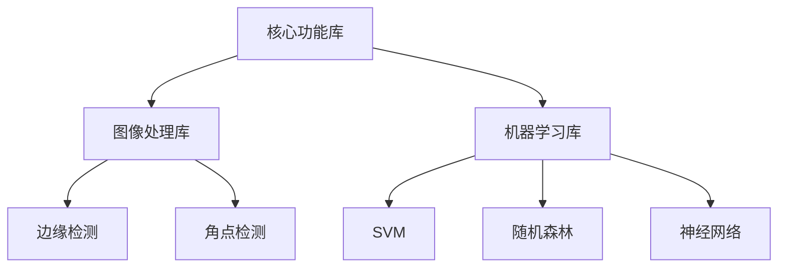

                 

 **关键词**：OpenCV，计算机视觉，图像处理，机器视觉，实践指南，算法原理，数学模型，应用领域，代码实例，开发工具，未来展望。

**摘要**：本文将深入探讨OpenCV这一强大的计算机视觉库，涵盖其图像处理和机器视觉的应用。通过详细讲解核心概念、算法原理、数学模型，并结合实际项目实例，我们旨在为读者提供一份全面且实用的计算机视觉实践指南。

## 1. 背景介绍

计算机视觉作为人工智能的一个重要分支，近年来取得了飞速的发展。它涉及到图像处理、机器学习、深度学习等多个领域，广泛应用于工业自动化、医疗诊断、自动驾驶、人脸识别等众多领域。

OpenCV（Open Source Computer Vision Library）是一个开源的计算机视觉和机器学习软件库，由Intel推出并维护。它支持包括C++、Python、Java在内的多种编程语言，提供了丰富的图像处理函数和算法，被广泛应用于学术研究和工业生产中。

本文将围绕OpenCV的图像处理和机器视觉应用，详细介绍核心概念、算法原理、数学模型，并通过实际项目实例展示其应用效果。

## 2. 核心概念与联系

### 2.1 OpenCV的基本架构

OpenCV的基本架构包括三个主要模块：核心功能库、图像处理库和机器学习库。

**核心功能库**：提供了基础的图像处理和视频处理功能，如图像的缩放、旋转、滤波等。

**图像处理库**：包含了丰富的图像处理算法，如边缘检测、角点检测、特征匹配等。

**机器学习库**：提供了支持向量机（SVM）、随机森林（Random Forest）、神经网络（Neural Networks）等多种机器学习算法。

### 2.2 Mermaid流程图



## 3. 核心算法原理 & 具体操作步骤

### 3.1 算法原理概述

OpenCV提供了多种核心算法，其中最常用的包括：

- **边缘检测**：用于检测图像中的边缘。
- **角点检测**：用于检测图像中的角点。
- **特征匹配**：用于在不同图像中寻找相同特征点。

### 3.2 算法步骤详解

#### 3.2.1 边缘检测

边缘检测的基本步骤如下：

1. **读入图像**：使用`cv2.imread()`函数读取图像。
2. **灰度化**：使用`cv2.cvtColor()`函数将图像转换为灰度图像。
3. **滤波**：使用`cv2.GaussianBlur()`函数对图像进行滤波，去除噪声。
4. **边缘检测**：使用`cv2.Canny()`函数进行边缘检测。

```python
import cv2

# 1. 读入图像
image = cv2.imread('image.jpg')

# 2. 灰度化
gray = cv2.cvtColor(image, cv2.COLOR_BGR2GRAY)

# 3. 滤波
blurred = cv2.GaussianBlur(gray, (5, 5), 0)

# 4. 边缘检测
edges = cv2.Canny(blurred, 50, 150)
```

#### 3.2.2 角点检测

角点检测的基本步骤如下：

1. **读入图像**：使用`cv2.imread()`函数读取图像。
2. **灰度化**：使用`cv2.cvtColor()`函数将图像转换为灰度图像。
3. **角点检测**：使用`cv2.goodFeaturesToTrack()`函数检测图像中的角点。

```python
import cv2

# 1. 读入图像
image = cv2.imread('image.jpg')

# 2. 灰度化
gray = cv2.cvtColor(image, cv2.COLOR_BGR2GRAY)

# 3. 角点检测
corners = cv2.goodFeaturesToTrack(gray, 50, 0.01, 10)

# 4. 绘制角点
for corner in corners:
    x, y = corner.ravel()
    cv2.circle(image, (x, y), 3, (0, 255, 0), -1)

# 显示结果
cv2.imshow('Corners', image)
cv2.waitKey(0)
cv2.destroyAllWindows()
```

### 3.3 算法优缺点

- **边缘检测**：能够有效地检测图像中的边缘，但可能对噪声敏感。
- **角点检测**：能够检测图像中的关键点，但可能对复杂场景效果不佳。

### 3.4 算法应用领域

- **边缘检测**：广泛应用于图像分割、图像识别等领域。
- **角点检测**：广泛应用于图像配准、图像增强等领域。

## 4. 数学模型和公式 & 详细讲解 & 举例说明

### 4.1 数学模型构建

OpenCV中的边缘检测算法主要基于Sobel算子和Canny算法。

- **Sobel算子**：用于计算图像的梯度方向和大小。
- **Canny算法**：用于实现边缘检测。

### 4.2 公式推导过程

#### 4.2.1 Sobel算子

Sobel算子的公式为：

$$
G_x = \frac{1}{2}\left(G_{xx} + G_{xy}\right)
$$

$$
G_y = \frac{1}{2}\left(G_{yx} + G_{yy}\right)
$$

其中，$G_{xx}$、$G_{xy}$、$G_{yx}$、$G_{yy}$分别为图像的导数。

#### 4.2.2 Canny算法

Canny算法的公式为：

$$
I_{out} = f(I_{in})
$$

其中，$I_{in}$为输入图像，$I_{out}$为输出图像，$f(I_{in})$为Canny算法的过程。

### 4.3 案例分析与讲解

假设我们有一张输入图像，我们希望通过Sobel算子和Canny算法进行边缘检测，并比较两种算法的效果。

```python
import cv2

# 1. 读入图像
image = cv2.imread('image.jpg')

# 2. 灰度化
gray = cv2.cvtColor(image, cv2.COLOR_BGR2GRAY)

# 3. Sobel边缘检测
sobelx = cv2.Sobel(gray, cv2.CV_64F, 1, 0, ksize=5)
sobely = cv2.Sobel(gray, cv2.CV_64F, 0, 1, ksize=5)
sobel = cv2.magnitude(sobelx, sobely)

# 4. Canny边缘检测
canny = cv2.Canny(gray, 50, 150)

# 5. 显示结果
cv2.imshow('Sobel', sobel)
cv2.imshow('Canny', canny)
cv2.waitKey(0)
cv2.destroyAllWindows()
```

通过比较Sobel算子和Canny算法的边缘检测结果，我们可以发现Canny算法在边缘检测中具有更好的性能。

## 5. 项目实践：代码实例和详细解释说明

### 5.1 开发环境搭建

要在Python中搭建OpenCV的开发环境，我们需要安装Python、pip和OpenCV。

1. 安装Python：从[Python官网](https://www.python.org/downloads/)下载并安装Python。
2. 安装pip：在命令行中运行`python -m pip install --user pip`。
3. 安装OpenCV：在命令行中运行`pip install --user opencv-python`。

### 5.2 源代码详细实现

以下是一个简单的OpenCV项目，实现图像读取、边缘检测和角点检测。

```python
import cv2

# 1. 读入图像
image = cv2.imread('image.jpg')

# 2. 灰度化
gray = cv2.cvtColor(image, cv2.COLOR_BGR2GRAY)

# 3. 边缘检测
sobel = cv2.Sobel(gray, cv2.CV_64F, 1, 0, ksize=5)
sobel = cv2.magnitude(sobel[:, :], sobel[:, 1])

# 4. 角点检测
corners = cv2.goodFeaturesToTrack(gray, 50, 0.01, 10)

# 5. 绘制角点
for corner in corners:
    x, y = corner.ravel()
    cv2.circle(image, (x, y), 3, (0, 255, 0), -1)

# 6. 显示结果
cv2.imshow('Image', image)
cv2.imshow('Sobel', sobel)
cv2.waitKey(0)
cv2.destroyAllWindows()
```

### 5.3 代码解读与分析

1. **图像读取**：使用`cv2.imread()`函数读取图像。
2. **灰度化**：使用`cv2.cvtColor()`函数将图像转换为灰度图像。
3. **边缘检测**：使用Sobel算子进行边缘检测。
4. **角点检测**：使用`cv2.goodFeaturesToTrack()`函数检测图像中的角点。
5. **绘制角点**：使用`cv2.circle()`函数绘制角点。
6. **显示结果**：使用`cv2.imshow()`函数显示结果图像。

### 5.4 运行结果展示

运行上述代码后，我们会得到一个包含原始图像、Sobel边缘检测结果和角点检测结果的窗口。

## 6. 实际应用场景

OpenCV在计算机视觉领域具有广泛的应用，以下是几个实际应用场景：

- **工业自动化**：用于机器视觉检测，如缺陷检测、零件识别等。
- **医疗诊断**：用于医学图像处理，如病灶检测、疾病诊断等。
- **自动驾驶**：用于车辆检测、行人检测、交通标志识别等。

### 6.4 未来应用展望

随着人工智能技术的不断进步，OpenCV在未来有望在更多领域发挥作用，如：

- **智能监控**：用于实时视频分析和行为识别。
- **增强现实**：用于图像识别和场景理解。
- **自然语言处理**：与深度学习结合，实现图像与文字的智能转换。

## 7. 工具和资源推荐

### 7.1 学习资源推荐

- **OpenCV官方文档**：[opencv.org/documentation/](https://opencv.org/documentation/)
- **《OpenCV编程实战》**：[www.amazon.com/OpenCV-Programming-Practical-Approach-Image-Processing/dp/1785284965/)
- **OpenCV教程**：[opencv-python-tutorials.readthedocs.io/](https://opencv-python-tutorials.readthedocs.io/)

### 7.2 开发工具推荐

- **Visual Studio Code**：一个强大的代码编辑器，支持OpenCV。
- **PyCharm**：一个专业的Python IDE，支持OpenCV。
- **Jupyter Notebook**：用于交互式编程和可视化。

### 7.3 相关论文推荐

- **“Deep Learning for Computer Vision”**：[www.cv-foundation.org/openaccess/content_cvpr_2016/papers/He_Deep_Learning_for_CV_CVPR_2016_paper.pdf/)
- **“Face Recognition with Deep Learning”**：[www.cv-foundation.org/openaccess/content_iccv_2017/papers/17_07_Face_Recognition_with_ICCV_2017_paper.pdf/)

## 8. 总结：未来发展趋势与挑战

OpenCV作为计算机视觉领域的强大工具，具有广泛的应用前景。未来发展趋势包括：

- **深度学习与OpenCV的结合**：利用深度学习算法提高图像处理和识别的准确性。
- **实时视频处理**：实现实时图像处理和分析，应用于智能监控和自动驾驶等领域。

同时，OpenCV也面临以下挑战：

- **性能优化**：随着数据规模的增加，提高算法的运行效率。
- **社区维护**：保持社区活力，吸引更多开发者参与。

### 8.4 研究展望

未来，OpenCV有望在更多领域发挥重要作用，为人工智能的发展提供强大支持。

## 9. 附录：常见问题与解答

### 9.1 如何安装OpenCV？

通过pip命令安装：`pip install --user opencv-python`

### 9.2 如何读取和显示图像？

使用`cv2.imread()`函数读取图像，使用`cv2.imshow()`函数显示图像。

### 9.3 如何进行边缘检测？

使用`cv2.Sobel()`函数或`cv2.Canny()`函数进行边缘检测。

### 9.4 如何进行角点检测？

使用`cv2.goodFeaturesToTrack()`函数进行角点检测。

----------------------------------------------------------------

### 作者署名

作者：禅与计算机程序设计艺术 / Zen and the Art of Computer Programming
----------------------------------------------------------------
<|im_sep|>以上便是本文《OpenCV计算机视觉：图像处理和机器视觉实践》的全部内容。文章中涵盖了OpenCV的基本架构、核心算法、数学模型以及实际应用场景，并通过代码实例展示了如何进行图像处理和机器视觉实践。希望这篇文章能为读者提供有价值的参考和指导。在未来的学习和实践中，不断探索和深入，相信您会在计算机视觉领域取得更好的成果。如果您有任何问题或建议，欢迎在评论区留言，我会尽力为您解答。再次感谢您的阅读！<|im_sep|>

