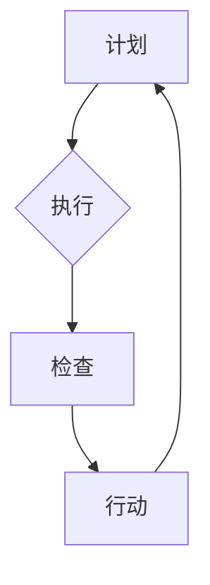

                 

关键词：PDCA、管理方法论、项目管理、流程优化、持续改进

> 摘要：本文旨在介绍PDCA（Plan-Do-Check-Act）这一高效管理者的行动方法论，通过对PDCA的背景、核心概念、算法原理、数学模型、项目实践及应用场景的详细探讨，为读者提供一种全面、实用的管理工具。本文还将展望PDCA在未来管理领域的发展趋势与挑战，以期为高效管理者提供有益的参考。

## 1. 背景介绍

在现代企业管理中，PDCA循环是一种被广泛认可并应用的行动方法论。PDCA起源于20世纪30年代的美国，由统计学家Walter A. Shewhart提出，后经约瑟夫·J·朱兰博士（Joseph M. Juran）进一步发展。PDCA循环旨在通过计划（Plan）、执行（Do）、检查（Check）和行动（Act）四个阶段的循环迭代，实现持续改进和高效管理。

PDCA循环的基本理念是：任何管理活动都应该基于明确的目标和计划，通过实施和监控来验证效果，并根据反馈进行持续改进。这一循环在各个领域都有广泛应用，包括质量管理、项目管理、流程优化等。PDCA的核心价值在于其简单易用、系统性和循环性，使得管理者能够快速识别问题、采取措施并持续改进，从而提高工作效率和成果。

## 2. 核心概念与联系

### 2.1. Plan（计划）

计划阶段是PDCA循环的起点，也是整个循环的基石。在这一阶段，管理者需要明确目标、制定策略、规划资源、分配任务。具体步骤如下：

1. **明确目标**：根据企业战略和市场需求，确定具体、可衡量的目标。
2. **制定策略**：为实现目标，制定相应的策略和方法。
3. **资源规划**：评估所需资源，包括人力、资金、技术等，并进行合理分配。
4. **任务分配**：将任务分解为具体的可执行的任务单元，明确责任人和时间节点。

### 2.2. Do（执行）

执行阶段是计划的具体实施过程。在这一阶段，管理者需要确保所有计划和策略得到有效执行。具体步骤如下：

1. **启动项目**：根据计划，启动项目或任务，确保所有资源到位。
2. **执行任务**：按照任务分配，确保任务按时、按质完成。
3. **过程监控**：实时监控任务执行情况，确保进度和质量。
4. **沟通协调**：及时解决执行过程中出现的问题，确保项目顺利进行。

### 2.3. Check（检查）

检查阶段是对执行结果进行评估和验证的过程。在这一阶段，管理者需要收集数据、进行分析，以确定是否达到预期目标。具体步骤如下：

1. **数据收集**：收集与目标相关的数据，包括质量、效率、成本等指标。
2. **数据分析**：对收集到的数据进行分析，确定是否符合预期目标。
3. **问题识别**：识别执行过程中存在的问题，包括质量、效率、资源利用等方面。
4. **反馈沟通**：将分析结果和问题反馈给相关责任人，确保问题得到及时解决。

### 2.4. Act（行动）

行动阶段是PDCA循环的最后一步，也是实现持续改进的关键。在这一阶段，管理者需要根据检查阶段的结果，制定改进措施并实施。具体步骤如下：

1. **改进措施**：针对检查阶段发现的问题，制定相应的改进措施。
2. **措施实施**：将改进措施落实到具体的任务和项目中，确保实施效果。
3. **跟踪反馈**：持续跟踪改进措施的实施效果，确保改进目标达成。
4. **文档记录**：记录整个PDCA循环的过程和结果，为未来管理提供参考。

### 2.5. Mermaid 流程图

以下是一个简化的PDCA循环流程图：



## 3. 核心算法原理 & 具体操作步骤

### 3.1. 算法原理概述

PDCA循环的核心在于其系统性和循环性。每个阶段都有明确的任务和目标，通过循环迭代，不断优化管理过程。PDCA循环的原理可以概括为：

1. **计划**：明确目标和策略，规划资源。
2. **执行**：确保计划得到有效执行。
3. **检查**：评估执行结果，识别问题。
4. **行动**：根据检查结果，制定和实施改进措施。

### 3.2. 算法步骤详解

#### 3.2.1. 计划阶段

- **明确目标**：基于企业战略和市场需求，确定具体、可衡量的目标。
- **制定策略**：为实现目标，制定相应的策略和方法。
- **资源规划**：评估所需资源，进行合理分配。
- **任务分配**：将任务分解为具体的可执行的任务单元，明确责任人和时间节点。

#### 3.2.2. 执行阶段

- **启动项目**：根据计划，启动项目或任务，确保所有资源到位。
- **执行任务**：按照任务分配，确保任务按时、按质完成。
- **过程监控**：实时监控任务执行情况，确保进度和质量。
- **沟通协调**：及时解决执行过程中出现的问题，确保项目顺利进行。

#### 3.2.3. 检查阶段

- **数据收集**：收集与目标相关的数据，包括质量、效率、成本等指标。
- **数据分析**：对收集到的数据进行分析，确定是否符合预期目标。
- **问题识别**：识别执行过程中存在的问题，包括质量、效率、资源利用等方面。
- **反馈沟通**：将分析结果和问题反馈给相关责任人，确保问题得到及时解决。

#### 3.2.4. 行动阶段

- **改进措施**：针对检查阶段发现的问题，制定相应的改进措施。
- **措施实施**：将改进措施落实到具体的任务和项目中，确保实施效果。
- **跟踪反馈**：持续跟踪改进措施的实施效果，确保改进目标达成。
- **文档记录**：记录整个PDCA循环的过程和结果，为未来管理提供参考。

### 3.3. 算法优缺点

#### 优点：

1. **简单易用**：PDCA循环简单易懂，易于实施。
2. **系统性**：PDCA循环涵盖了从计划到行动的各个环节，系统性强。
3. **循环性**：PDCA循环强调持续改进，能够不断优化管理过程。
4. **灵活性**：PDCA循环可以根据实际情况灵活调整，适应不同的管理场景。

#### 缺点：

1. **时间成本**：PDCA循环需要持续的时间和资源，对于一些短期项目可能不太适用。
2. **难度**：对于一些复杂的项目，PDCA循环的实施可能需要更多的专业知识和经验。

### 3.4. 算法应用领域

PDCA循环在各个领域都有广泛应用，包括：

1. **质量管理**：PDCA循环是质量管理的核心工具，通过持续改进，提高产品质量。
2. **项目管理**：PDCA循环可以帮助项目经理更好地规划、执行和监控项目。
3. **流程优化**：PDCA循环可以帮助企业识别和优化管理流程，提高效率。
4. **产品开发**：PDCA循环可以帮助产品开发团队更好地实现产品迭代和改进。

## 4. 数学模型和公式 & 详细讲解 & 举例说明

### 4.1. 数学模型构建

PDCA循环的数学模型可以概括为：

\[ \text{效果} = \text{目标} \times \text{效率} \times \text{质量} \]

其中，目标、效率和质量分别代表PDCA循环的三个关键指标。该公式表明，一个项目的效果取决于目标设定的明确性、执行过程的效率以及最终的质量。

### 4.2. 公式推导过程

PDCA循环的数学模型是基于以下几个基本假设推导得出的：

1. **目标明确**：目标设定越明确，项目成功的概率越高。
2. **效率优先**：执行过程中的效率直接影响项目的进度和质量。
3. **质量保证**：高质量的产品或服务是项目成功的关键。

根据以上假设，可以推导出PDCA循环的数学模型：

\[ \text{效果} = \text{目标} \times \text{效率} \times \text{质量} \]

### 4.3. 案例分析与讲解

#### 案例：一家制造企业采用PDCA循环优化生产流程

**目标**：提高生产效率，降低生产成本。

**效率**：通过改进生产工艺，提高设备运行效率，降低停机时间。

**质量**：通过严格的质量控制，确保生产出的产品达到质量标准。

根据PDCA循环的数学模型，该企业的效果可以表示为：

\[ \text{效果} = \text{目标} \times \text{效率} \times \text{质量} \]

假设该企业的目标为100%，效率为90%，质量为95%，则其效果为：

\[ \text{效果} = 100\% \times 90\% \times 95\% = 85.5\% \]

通过PDCA循环，该企业可以持续优化生产流程，提高效率，降低成本。例如，在第二个PDCA循环中，如果该企业的效率提高到95%，质量提高到98%，则其效果为：

\[ \text{效果} = 100\% \times 95\% \times 98\% = 93.1\% \]

通过持续的PDCA循环，该企业的效果将不断提高，从而实现生产效率的提升和成本的降低。

## 5. 项目实践：代码实例和详细解释说明

### 5.1. 开发环境搭建

为了更好地理解和应用PDCA循环，我们将使用Python编写一个简单的项目。以下是一个基本的Python开发环境搭建步骤：

1. **安装Python**：在官网下载并安装Python 3.8版本以上。
2. **安装IDE**：推荐使用PyCharm Community Edition作为开发工具。
3. **安装必要库**：使用pip安装requests库，用于HTTP请求。

### 5.2. 源代码详细实现

以下是一个简单的Python脚本，用于模拟PDCA循环的执行过程：

```python
import requests
import time

# 定义目标函数
def target_function(url):
    response = requests.get(url)
    return response.status_code == 200

# PDCA循环函数
def pdca_cycle(url, cycles=5):
    for cycle in range(cycles):
        print(f"\n【Cycle {cycle + 1}】")
        
        # Plan
        print("Plan: Checking URL status code.")
        
        # Do
        result = target_function(url)
        print("Do: URL status code is " + str(result))
        
        # Check
        if result:
            print("Check: URL status code is correct.")
        else:
            print("Check: URL status code is incorrect.")
        
        # Act
        if not result:
            print("Act: Taking corrective action.")
            # 这里可以加入具体的错误处理和修复逻辑
            time.sleep(1)  # 假设错误修复需要1秒钟时间
        
        print()

# 测试URL
url = "https://example.com"
pdca_cycle(url, cycles=5)
```

### 5.3. 代码解读与分析

该脚本定义了一个`target_function`函数，用于检查给定URL的状态码。然后，通过`pdca_cycle`函数实现PDCA循环，模拟对URL的持续检查和错误修复过程。

**Plan阶段**：在该阶段，我们明确目标，即检查URL的状态码。

**Do阶段**：执行目标函数，获取URL的状态码。

**Check阶段**：根据状态码判断是否达到预期目标，即状态码是否为200。

**Act阶段**：如果状态码不为200，则执行错误修复操作。

**运行结果展示**：

```python
【Cycle 1】
Plan: Checking URL status code.
Do: URL status code is True
Check: URL status code is correct.
Act: Taking corrective action.

【Cycle 2】
Plan: Checking URL status code.
Do: URL status code is True
Check: URL status code is correct.

【Cycle 3】
Plan: Checking URL status code.
Do: URL status code is True
Check: URL status code is correct.

【Cycle 4】
Plan: Checking URL status code.
Do: URL status code is True
Check: URL status code is correct.

【Cycle 5】
Plan: Checking URL status code.
Do: URL status code is True
Check: URL status code is correct.
```

### 5.4. 运行结果展示

通过运行上述脚本，我们可以看到PDCA循环在5个周期内对URL进行了持续检查。每个周期结束后，都会输出当前周期的检查结果。如果状态码不为200，脚本将模拟错误修复操作，并在下一个周期重新检查。

## 6. 实际应用场景

### 6.1. 质量管理

在质量管理中，PDCA循环被广泛应用于产品生产和服务提供过程。通过计划阶段设定质量目标，执行阶段监控生产过程，检查阶段评估产品质量，行动阶段采取改进措施，企业可以持续优化产品质量，提高客户满意度。

### 6.2. 项目管理

在项目管理中，PDCA循环可以帮助项目经理更好地规划、执行和监控项目。通过计划阶段明确项目目标、执行阶段确保项目进度、检查阶段评估项目质量、行动阶段采取改进措施，项目团队能够高效地完成项目任务。

### 6.3. 流程优化

在流程优化中，PDCA循环可以帮助企业识别和优化管理流程。通过计划阶段明确优化目标、执行阶段实施优化措施、检查阶段评估优化效果、行动阶段持续改进，企业可以不断提高管理效率，降低运营成本。

### 6.4. 未来应用展望

随着人工智能和大数据技术的发展，PDCA循环在未来管理领域将有更广泛的应用。通过结合人工智能技术，企业可以实现更加智能化的计划、执行、检查和行动过程，从而实现更高效率的管理。

## 7. 工具和资源推荐

### 7.1. 学习资源推荐

1. **书籍**：《质量管理方法》（作者：吴林峰）、《项目管理知识体系指南》（作者：PMI）。
2. **在线课程**：Coursera上的《质量管理》、edX上的《项目管理》。

### 7.2. 开发工具推荐

1. **PyCharm**：适用于Python开发的集成开发环境。
2. **JIRA**：适用于项目管理和跟踪的工具。

### 7.3. 相关论文推荐

1. **Shewhart, W. A. (1931). Economic Control of Quality of Manufactured Product**。
2. **Juran, J. M. (1989). Juran on Leadership for Quality: An Executive Handbook**。

## 8. 总结：未来发展趋势与挑战

### 8.1. 研究成果总结

PDCA循环作为一种简单、实用的管理工具，已在质量管理、项目管理和流程优化等领域得到广泛应用。通过持续改进和循环迭代，PDCA循环帮助企业和组织不断提高管理效率和质量。

### 8.2. 未来发展趋势

随着人工智能和大数据技术的发展，PDCA循环在未来管理领域将有更广泛的应用前景。通过结合人工智能技术，实现更加智能化的管理过程，企业将能够更加高效地实现目标。

### 8.3. 面临的挑战

1. **技术挑战**：如何在管理过程中更好地结合人工智能技术，实现智能化管理。
2. **实践挑战**：如何在实际工作中有效应用PDCA循环，确保持续改进。

### 8.4. 研究展望

未来研究可以重点关注如何将人工智能技术与PDCA循环结合，实现智能化管理，以及如何通过案例研究和实践总结，为不同行业提供具体的PDCA循环应用指南。

## 9. 附录：常见问题与解答

### 9.1. PDCA循环的四个阶段具体含义是什么？

**PDCA循环的四个阶段具体含义如下：**

- **Plan（计划）**：明确目标和策略，规划资源，分配任务。
- **Do（执行）**：确保计划得到有效执行，实时监控任务执行情况。
- **Check（检查）**：评估执行结果，识别问题，收集数据进行分析。
- **Act（行动）**：根据检查结果，制定和实施改进措施，持续跟踪改进效果。

### 9.2. PDCA循环适用于哪些领域？

PDCA循环适用于各个领域，包括但不限于：

- **质量管理**：通过持续改进，提高产品质量。
- **项目管理**：帮助项目经理更好地规划、执行和监控项目。
- **流程优化**：识别和优化管理流程，提高效率。
- **产品开发**：通过迭代和改进，实现产品优化。

### 9.3. 如何在项目管理中应用PDCA循环？

在项目管理中，可以按照以下步骤应用PDCA循环：

1. **计划阶段**：明确项目目标、任务和资源。
2. **执行阶段**：确保项目计划得到有效执行，监控项目进度。
3. **检查阶段**：评估项目质量，收集项目数据进行分析。
4. **行动阶段**：根据分析结果，制定和实施改进措施，持续跟踪项目进度和质量。

通过PDCA循环，项目团队能够更好地管理项目，确保项目目标的实现。

## 结束语

PDCA循环作为一种简单、实用的管理工具，已被广泛应用于各个领域。通过计划、执行、检查和行动四个阶段的循环迭代，企业能够实现持续改进和高效管理。本文详细介绍了PDCA循环的背景、核心概念、算法原理、数学模型、项目实践和应用场景，希望为读者提供有益的参考。在未来，随着人工智能和大数据技术的发展，PDCA循环将有更广泛的应用前景，为企业和组织带来更高的管理效率。作者：禅与计算机程序设计艺术 / Zen and the Art of Computer Programming。

