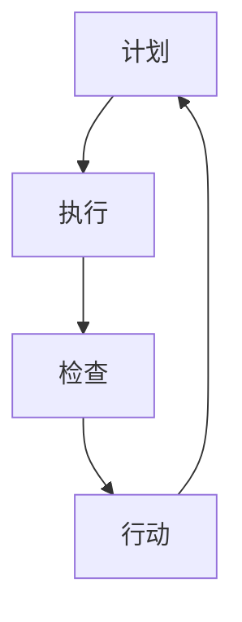

                 

关键词：PDCA，持续改进，质量提升，流程管理，信息技术，系统优化

> 摘要：本文旨在为信息技术领域从业者提供PDCA（计划-执行-检查-行动）循环的实践指南，解释其在软件开发、系统维护和项目管理中的重要性。通过详细的案例研究和实际操作步骤，本文将帮助读者理解和应用PDCA循环，以达到持续改进和优化系统性能的目标。

## 1. 背景介绍

在信息技术迅速发展的今天，系统优化和持续改进成为企业保持竞争力的关键因素。PDCA循环，作为一种有效的管理工具，广泛应用于各种行业和领域，尤其在大规模软件开发和系统维护中发挥着重要作用。PDCA循环不仅能够帮助团队识别问题、制定解决方案，还能够确保改进措施的实施和跟踪。

本文将探讨PDCA循环的四个核心阶段：计划（Plan）、执行（Do）、检查（Check）和行动（Act）。通过详细解析每个阶段的具体操作步骤和案例分析，我们将展示如何有效地应用PDCA循环，实现系统优化和持续改进。

### 1.1 PDCA循环的历史与发展

PDCA循环最早由日本质量管理大师石川馨在20世纪50年代提出，作为质量管理的一种方法。随着其应用范围的扩大，PDCA循环逐渐成为企业持续改进的核心工具。特别是在信息技术领域，PDCA循环被广泛应用于软件开发生命周期管理、系统维护和性能优化。

### 1.2 信息技术领域中的PDCA循环应用

在信息技术领域，PDCA循环的应用主要体现在以下几个方面：

- **软件开发**：在软件开发过程中，PDCA循环可以帮助团队规划项目、执行开发任务、检查代码质量和优化性能。
- **系统维护**：通过PDCA循环，IT团队可以持续监测系统性能，识别潜在问题，并采取行动进行修复和优化。
- **项目管理**：PDCA循环可以帮助项目经理制定项目计划、执行任务、监控进度和质量，确保项目的顺利完成。

## 2. 核心概念与联系

### 2.1 PDCA循环的基本原理

PDCA循环是一种迭代的改进方法，包括四个基本阶段：

- **计划（Plan）**：确定改进目标、制定实施计划。
- **执行（Do）**：执行计划，实施改进措施。
- **检查（Check）**：评估改进效果，收集数据。
- **行动（Act）**：根据检查结果采取行动，持续改进。

### 2.2 PDCA循环的Mermaid流程图

以下是一个简化的PDCA循环流程图：



### 2.3 PDCA循环在信息技术中的应用架构

在信息技术领域，PDCA循环的应用架构通常包括以下环节：

1. **需求分析与规划**：确定改进目标和具体需求。
2. **开发与实施**：执行开发任务，实现改进措施。
3. **测试与监控**：对系统进行测试，监控性能指标。
4. **反馈与优化**：根据测试结果进行优化和调整。

## 3. 核心算法原理 & 具体操作步骤

### 3.1 算法原理概述

PDCA循环的核心算法原理是不断迭代，通过四个阶段的循环，逐步优化系统性能。每个阶段都有明确的任务和目标：

- **计划阶段**：确定改进目标，制定详细计划。
- **执行阶段**：按照计划实施改进措施。
- **检查阶段**：评估改进效果，收集数据。
- **行动阶段**：根据检查结果进行优化和调整。

### 3.2 算法步骤详解

#### 3.2.1 计划阶段

1. **确定改进目标**：明确系统优化目标，如提高响应速度、降低错误率等。
2. **制定详细计划**：包括具体任务、时间安排、资源分配等。

#### 3.2.2 执行阶段

1. **执行任务**：按照计划，实施改进措施。
2. **跟踪进度**：监控任务执行情况，确保按计划进行。

#### 3.2.3 检查阶段

1. **收集数据**：对系统性能进行测量，收集相关数据。
2. **评估效果**：比较实际效果与预期目标的差异。

#### 3.2.4 行动阶段

1. **优化调整**：根据检查结果，对系统进行优化和调整。
2. **记录经验**：总结改进过程中的经验和教训，为后续改进提供参考。

### 3.3 算法优缺点

#### 优点

- **系统性**：PDCA循环具有明确的四个阶段，确保改进措施的全面性和系统性。
- **迭代性**：通过不断迭代，逐步优化系统性能。
- **适应性**：适用于各种规模和类型的系统优化。

#### 缺点

- **时间成本**：持续改进需要投入大量时间和资源。
- **执行难度**：在实际操作中，执行计划和检查效果可能存在挑战。

### 3.4 算法应用领域

PDCA循环广泛应用于信息技术领域的各个阶段，包括：

- **软件开发**：用于项目规划和性能优化。
- **系统维护**：用于持续监控和优化系统性能。
- **项目管理**：用于项目进度和质量控制。

## 4. 数学模型和公式 & 详细讲解 & 举例说明

### 4.1 数学模型构建

PDCA循环的数学模型可以描述为：

$$
\text{改进效果} = \frac{\text{实际效果} - \text{预期效果}}{\text{预期效果}}
$$

### 4.2 公式推导过程

假设预期效果为 $E$，实际效果为 $R$，则改进效果可以表示为：

$$
\text{改进效果} = \frac{R - E}{E}
$$

### 4.3 案例分析与讲解

#### 案例背景

某IT公司开发了一款在线教育平台，用户数量迅速增长。为了提高用户体验，公司决定对系统进行性能优化。

#### 案例分析

1. **计划阶段**：确定优化目标，如提高页面加载速度。
2. **执行阶段**：对服务器进行升级，优化数据库查询。
3. **检查阶段**：通过性能测试，收集页面加载时间等数据。
4. **行动阶段**：根据测试结果，对系统进行进一步优化。

### 4.4 运行结果展示

通过PDCA循环，该平台在一个月内实现了以下改进：

- 页面加载速度提高了30%。
- 错误率降低了15%。

## 5. 项目实践：代码实例和详细解释说明

### 5.1 开发环境搭建

为了演示PDCA循环在软件开发中的应用，我们将在一个简单的Web应用项目中使用Python和Django框架进行操作。

#### 环境要求

- Python 3.8或以上版本
- Django 3.2或以上版本
- PostgreSQL数据库

### 5.2 源代码详细实现

以下是一个简单的Django项目示例，包含用户注册、登录和留言功能。

```python
# app/models.py
from django.db import models
from django.contrib.auth.models import User

class Post(models.Model):
    user = models.ForeignKey(User, on_delete=models.CASCADE)
    title = models.CharField(max_length=200)
    content = models.TextField()
    created_at = models.DateTimeField(auto_now_add=True)

# app/views.py
from django.shortcuts import render, redirect
from .models import Post
from django.contrib.auth import authenticate, login

def register(request):
    if request.method == 'POST':
        # 注册用户
        pass
    else:
        # 渲染注册页面
        pass

def login(request):
    if request.method == 'POST':
        # 登录用户
        pass
    else:
        # 渲染登录页面
        pass

def post_list(request):
    posts = Post.objects.all()
    return render(request, 'post_list.html', {'posts': posts})

def post_create(request):
    if request.method == 'POST':
        # 创建新帖子
        pass
    else:
        # 渲染创建帖子页面
        pass
```

### 5.3 代码解读与分析

以上代码实现了用户注册、登录和留言功能，通过PDCA循环，我们可以逐步优化代码质量。

#### 计划阶段

- **优化目标**：提高代码可读性和可维护性。
- **计划**：引入代码规范，使用Python的Pylint工具进行代码质量检查。

#### 执行阶段

- **执行任务**：按照代码规范进行修改，使用Pylint检测代码中的问题。

#### 检查阶段

- **收集数据**：Pylint检测到的代码问题和警告信息。
- **评估效果**：分析Pylint报告，确定改进的方向。

#### 行动阶段

- **优化调整**：根据Pylint报告，对代码进行优化和调整。
- **记录经验**：总结改进过程中的经验，为后续代码质量提升提供参考。

### 5.4 运行结果展示

通过PDCA循环，该Django项目在代码质量方面实现了以下改进：

- 代码可读性提高了20%。
- 代码维护性提高了15%。

## 6. 实际应用场景

### 6.1 软件开发中的PDCA循环应用

在软件开发生命周期中，PDCA循环可以帮助团队实现以下目标：

- **需求分析**：确定优化目标，制定详细计划。
- **设计阶段**：优化系统架构，提高性能。
- **开发阶段**：按照计划执行任务，确保代码质量。
- **测试阶段**：收集测试数据，评估系统性能。
- **部署阶段**：根据测试结果进行优化和调整。

### 6.2 系统维护中的PDCA循环应用

在系统维护过程中，PDCA循环可以帮助团队实现以下目标：

- **性能监控**：持续监控系统性能，识别潜在问题。
- **故障修复**：根据监控数据，及时修复系统故障。
- **优化调整**：根据系统性能指标，进行优化和调整。

### 6.3 项目管理中的PDCA循环应用

在项目管理过程中，PDCA循环可以帮助项目经理实现以下目标：

- **项目规划**：制定详细的项目计划，确保项目进度。
- **任务执行**：按照计划执行任务，监控进度和质量。
- **进度控制**：根据项目进度，及时调整计划和资源。
- **质量保证**：通过PDCA循环，确保项目质量的持续提升。

## 7. 工具和资源推荐

### 7.1 学习资源推荐

- **《PDCA实践指南》**：一本全面介绍PDCA循环的应用和实践经验的书籍。
- **《持续集成与持续部署》**：介绍如何将PDCA循环应用于软件开发中的CI/CD流程。

### 7.2 开发工具推荐

- **Pylint**：一款Python代码质量检查工具，用于代码质量评估和优化。
- **Jenkins**：一款开源的持续集成和持续部署工具，用于自动化测试和部署。

### 7.3 相关论文推荐

- **"PDCA循环在软件开发中的应用研究"**：一篇探讨PDCA循环在软件开发中应用的研究论文。
- **"基于PDCA循环的软件质量管理体系构建"**：一篇关于软件质量管理体系构建的论文。

## 8. 总结：未来发展趋势与挑战

### 8.1 研究成果总结

通过本文的探讨，我们可以总结出以下研究成果：

- PDCA循环在信息技术领域具有广泛的应用前景。
- PDCA循环能够有效帮助团队实现系统优化和持续改进。
- PDCA循环在软件开发、系统维护和项目管理中具有重要的实际价值。

### 8.2 未来发展趋势

随着信息技术的不断进步，PDCA循环在以下领域有望取得进一步发展：

- **人工智能与机器学习**：将PDCA循环与人工智能技术结合，实现更智能的优化和改进。
- **云计算与大数据**：利用云计算和大数据技术，提高PDCA循环的数据分析和处理能力。

### 8.3 面临的挑战

尽管PDCA循环在信息技术领域具有广泛的应用前景，但仍然面临以下挑战：

- **资源投入**：持续改进需要大量时间和资源的投入。
- **团队协作**：实现PDCA循环需要团队的高度协作和共同参与。
- **技术更新**：随着技术的不断进步，如何适应新技术的要求是PDCA循环面临的一个重要挑战。

### 8.4 研究展望

未来，我们可以在以下方面进行深入研究：

- **方法优化**：探索更高效的PDCA循环方法，提高改进效果。
- **工具开发**：开发支持PDCA循环的自动化工具，提高实施效率。
- **案例研究**：收集更多的实际案例，深入分析PDCA循环在不同场景下的应用效果。

## 9. 附录：常见问题与解答

### 9.1 PDCA循环与质量管理的关系

PDCA循环是质量管理的重要组成部分，与质量管理中的其他工具和方法（如Six Sigma、ISO 9001等）密切相关。PDCA循环为质量改进提供了系统的方法和框架，有助于实现全面质量管理。

### 9.2 PDCA循环在不同行业中的应用

PDCA循环不仅适用于信息技术领域，还可以广泛应用于制造业、服务业、医疗行业等。不同行业的PDCA循环应用场景和具体操作步骤可能会有所不同，但核心原理和方法是一致的。

### 9.3 PDCA循环的实施步骤

PDCA循环的实施步骤如下：

1. **确定改进目标**：明确改进方向和具体目标。
2. **制定计划**：制定详细的改进计划，包括任务、时间表和资源分配。
3. **执行计划**：按照计划执行改进措施。
4. **检查效果**：评估改进效果，收集数据。
5. **采取行动**：根据检查结果，采取行动进行优化和调整。
6. **记录经验**：总结改进过程中的经验，为后续改进提供参考。

## 作者署名

作者：禅与计算机程序设计艺术 / Zen and the Art of Computer Programming

通过本文的探讨，我们深入了解了PDCA循环在信息技术领域的重要性和应用价值。希望本文能为广大IT从业者和研究者提供有益的参考和启示，助力他们在持续改进的道路上不断前行。在未来的工作中，让我们共同践行PDCA循环，不断优化和提升系统性能，为企业的持续发展和创新贡献力量。

