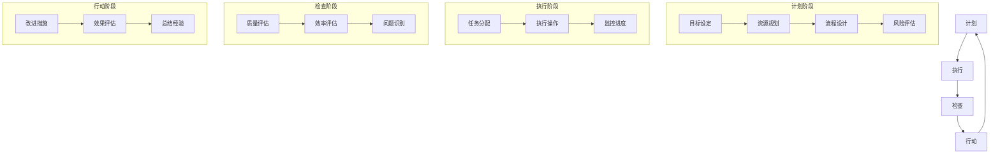

                 

关键词：PDCA循环、持续改进、质量管理、软件工程、流程优化、实践指南

> 摘要：本文深入探讨了PDCA（计划-执行-检查-行动）循环在软件工程和IT管理中的应用，解析了其在提升项目质量和效率方面的作用。文章首先介绍了PDCA的基本概念和原理，随后通过具体的案例和步骤，展示了如何将PDCA应用于软件开发和IT管理中，最后对PDCA的未来发展趋势和挑战进行了展望。

## 1. 背景介绍

持续改进是现代企业，尤其是IT行业，实现长期成功的关键。在快速变化的市场环境中，企业需要具备灵活应对变化、快速响应客户需求的能力。PDCA循环，又称戴明循环，是一种广泛应用于质量管理和其他管理领域的持续改进方法。PDCA循环通过四个阶段——计划（Plan）、执行（Do）、检查（Check）和行动（Act），提供了一个结构化的框架，帮助组织不断优化流程，提高产品质量和效率。

本文旨在探讨如何将PDCA循环应用于IT行业，特别是软件开发和项目管理。通过具体案例和实践指导，我们将展示PDCA如何帮助IT团队实现持续改进，提高项目的成功率和客户满意度。

### 1.1 PDCA循环的历史背景

PDCA循环起源于20世纪30年代的美国，由统计学家沃特·阿曼德·休哈特（Walter A. Shewhart）提出。他的工作为后来的质量控制提供了理论基础。在二战期间，物理学家爱德华·戴明（Edwards Deming）将休哈特的理论引入日本，并进行了推广。戴明认为，PDCA循环是组织实现持续改进的关键，他将其视为一种自我完善的方法。

PDCA循环在日本的广泛应用，极大地提升了日本制造业的质量和效率。随着全球化的推进，PDCA循环逐渐成为全球范围内的管理标准，被广泛应用于各行各业，包括IT行业。

### 1.2 PDCA循环在现代IT行业的应用

在IT行业，尤其是软件开发领域，PDCA循环具有广泛的应用价值。它可以帮助团队：

- **确保软件质量**：通过持续检查和改进，确保交付的软件符合质量标准。
- **优化开发流程**：通过执行和检查，发现并消除流程中的瓶颈和问题。
- **提高客户满意度**：通过计划和服务改进，满足客户需求和期望。
- **增强团队协作**：通过PDCA循环，促进团队成员之间的沟通和协作。

### 1.3 文章结构

本文将按照以下结构展开：

- **背景介绍**：介绍PDCA循环的基本概念和历史背景，以及其在现代IT行业的应用。
- **核心概念与联系**：通过Mermaid流程图展示PDCA循环的各个阶段和流程节点。
- **核心算法原理 & 具体操作步骤**：详细解析PDCA循环的具体操作步骤和流程。
- **数学模型和公式**：介绍与PDCA循环相关的数学模型和公式，并举例说明。
- **项目实践**：通过代码实例展示如何将PDCA循环应用于软件开发。
- **实际应用场景**：探讨PDCA循环在软件开发和IT管理中的实际应用。
- **工具和资源推荐**：推荐相关学习资源、开发工具和论文。
- **总结**：总结研究成果，展望未来发展趋势和挑战。
- **附录**：提供常见问题与解答。

## 2. 核心概念与联系

PDCA循环是一个闭环的持续改进模型，其核心概念包括计划（Plan）、执行（Do）、检查（Check）和行动（Act）。以下是一个使用Mermaid流程图（Mermaid 流程节点中不要有括号、逗号等特殊字符）展示PDCA循环的各个阶段和流程节点的示例：



### 2.1 计划阶段

计划阶段是PDCA循环的起点，主要包括目标设定、资源规划、流程设计和风险评估。

- **目标设定**：明确项目目标和预期结果，为后续工作提供方向。
- **资源规划**：评估所需的人力、物力和时间资源，确保资源的合理配置。
- **流程设计**：制定详细的流程计划，确保各项工作有序进行。
- **风险评估**：识别潜在的风险和问题，制定应对策略，降低风险。

### 2.2 执行阶段

执行阶段是计划的具体实施过程，主要包括任务分配、执行操作和监控进度。

- **任务分配**：将工作分解为具体的任务，分配给团队成员。
- **执行操作**：按照计划执行任务，确保工作质量。
- **监控进度**：实时监控项目进度，确保任务按时完成。

### 2.3 检查阶段

检查阶段是对执行结果的质量和效率进行评估，主要包括质量评估、效率评估和问题识别。

- **质量评估**：检查产品或服务的质量是否符合预期，发现质量问题。
- **效率评估**：评估流程的效率，发现瓶颈和低效环节。
- **问题识别**：识别执行过程中出现的问题，为改进提供依据。

### 2.4 行动阶段

行动阶段是对检查阶段发现的问题进行改进，主要包括改进措施、效果评估和总结经验。

- **改进措施**：针对发现的问题，制定并实施改进措施。
- **效果评估**：评估改进措施的有效性，确保问题得到解决。
- **总结经验**：总结项目过程中的经验和教训，为未来工作提供参考。

通过以上四个阶段的循环迭代，PDCA循环帮助组织不断优化流程，提高产品质量和效率，实现持续改进。

### 2.5 PDCA循环的流程节点

在PDCA循环中，每个阶段都包含了一系列的流程节点，这些节点确保了循环的顺利进行。以下是PDCA循环的流程节点：

- **计划阶段**：
  - 目标设定
  - 资源规划
  - 流程设计
  - 风险评估

- **执行阶段**：
  - 任务分配
  - 执行操作
  - 监控进度

- **检查阶段**：
  - 质量评估
  - 效率评估
  - 问题识别

- **行动阶段**：
  - 改进措施
  - 效果评估
  - 总结经验

每个流程节点都是PDCA循环中不可或缺的一部分，它们共同构成了一个完整的持续改进流程。

### 2.6 PDCA循环的优点

PDCA循环具有以下优点：

- **结构化**：PDCA循环提供了明确的流程和步骤，帮助组织有序地推进持续改进工作。
- **灵活性**：PDCA循环可以适应各种类型的项目和任务，适用于不同行业和组织。
- **可衡量性**：PDCA循环的每个阶段都有明确的衡量指标，帮助组织评估改进效果。
- **持续改进**：PDCA循环是一个循环迭代的过程，确保组织不断优化流程，提高效率。

通过以上优点，PDCA循环成为现代IT行业实现持续改进的宝贵工具。

## 3. 核心算法原理 & 具体操作步骤

### 3.1 算法原理概述

PDCA循环是一种结构化的持续改进方法，其核心算法原理基于四个阶段：计划（Plan）、执行（Do）、检查（Check）和行动（Act）。每个阶段都有明确的目标和任务，共同构成了一个闭环的持续改进过程。

### 3.2 算法步骤详解

#### 3.2.1 计划阶段

1. **目标设定**：明确项目目标和预期结果，为后续工作提供方向。目标应具体、可衡量，并具有挑战性。
2. **资源规划**：评估所需的人力、物力和时间资源，确保资源的合理配置。资源规划应考虑团队成员的能力、设备和工具的需求。
3. **流程设计**：制定详细的流程计划，确保各项工作有序进行。流程设计应考虑到潜在的瓶颈和风险，并制定相应的应对措施。
4. **风险评估**：识别潜在的风险和问题，制定应对策略，降低风险。风险评估应基于历史数据和专家判断，确保风险得到有效控制。

#### 3.2.2 执行阶段

1. **任务分配**：将工作分解为具体的任务，分配给团队成员。任务分配应考虑团队成员的能力和兴趣，确保任务的完成。
2. **执行操作**：按照计划执行任务，确保工作质量。执行操作应遵循流程计划，确保每个环节的质量和进度。
3. **监控进度**：实时监控项目进度，确保任务按时完成。监控进度应采用适当的技术和工具，如项目管理系统和进度报告。

#### 3.2.3 检查阶段

1. **质量评估**：检查产品或服务的质量是否符合预期，发现质量问题。质量评估应采用科学的方法和工具，如质量检测和质量分析。
2. **效率评估**：评估流程的效率，发现瓶颈和低效环节。效率评估应基于数据分析和流程模拟，找出改进的切入点。
3. **问题识别**：识别执行过程中出现的问题，为改进提供依据。问题识别应全面、客观，包括内部和外部因素。

#### 3.2.4 行动阶段

1. **改进措施**：针对发现的问题，制定并实施改进措施。改进措施应具体、可行，并考虑资源限制。
2. **效果评估**：评估改进措施的有效性，确保问题得到解决。效果评估应基于数据分析和用户反馈，确保改进措施的有效性。
3. **总结经验**：总结项目过程中的经验和教训，为未来工作提供参考。总结经验应包括成功和失败的案例，以及改进的方法和策略。

### 3.3 算法优缺点

#### 优点

- **结构化**：PDCA循环提供了明确的流程和步骤，帮助组织有序地推进持续改进工作。
- **灵活性**：PDCA循环可以适应各种类型的项目和任务，适用于不同行业和组织。
- **可衡量性**：PDCA循环的每个阶段都有明确的衡量指标，帮助组织评估改进效果。
- **持续改进**：PDCA循环是一个循环迭代的过程，确保组织不断优化流程，提高效率。

#### 缺点

- **时间成本**：PDCA循环需要一定的时间来执行，可能会影响项目的进度。
- **人员培训**：PDCA循环需要团队成员具备一定的知识和技能，否则可能无法有效执行。
- **复杂性**：PDCA循环涉及多个阶段和流程节点，对于一些简单的项目可能显得过于复杂。

### 3.4 算法应用领域

PDCA循环在多个领域具有广泛的应用：

- **质量管理**：通过PDCA循环，企业可以持续优化产品质量，提高客户满意度。
- **项目管理**：PDCA循环可以帮助项目团队有效地管理项目进度和资源，确保项目成功。
- **流程优化**：通过PDCA循环，企业可以识别并消除流程中的瓶颈和低效环节，提高效率。
- **产品开发**：PDCA循环可以帮助产品团队持续改进产品，满足市场需求。

通过以上应用领域，PDCA循环成为现代企业实现持续改进的宝贵工具。

## 4. 数学模型和公式 & 详细讲解 & 举例说明

PDCA循环作为一种持续改进方法，不仅需要实践操作，还需要一定的数学模型和公式来支持其科学性和可衡量性。以下我们将详细介绍与PDCA循环相关的数学模型和公式，并通过具体案例进行说明。

### 4.1 数学模型构建

PDCA循环的数学模型主要包括以下方面：

1. **目标设定模型**：用于确定项目目标和预期结果。
2. **资源规划模型**：用于评估所需的人力、物力和时间资源。
3. **流程设计模型**：用于制定详细的流程计划。
4. **风险评估模型**：用于识别潜在的风险和问题。
5. **质量评估模型**：用于检查产品或服务的质量。
6. **效率评估模型**：用于评估流程的效率。
7. **问题识别模型**：用于识别执行过程中出现的问题。
8. **改进措施模型**：用于制定并实施改进措施。

### 4.2 公式推导过程

以下是一些与PDCA循环相关的常用公式及其推导过程：

#### 4.2.1 目标设定模型

目标设定模型的基本公式为：

\[ T = \frac{S}{E} \]

其中，\( T \) 表示目标值，\( S \) 表示设定值，\( E \) 表示预期效果。

推导过程：

- 目标值（\( T \)）是设定值（\( S \)）与预期效果（\( E \)）的比值。通过这个公式，可以确定目标值是否合理，并评估预期效果。

#### 4.2.2 资源规划模型

资源规划模型的基本公式为：

\[ R = C \times P \]

其中，\( R \) 表示资源需求，\( C \) 表示资源成本，\( P \) 表示项目进度。

推导过程：

- 资源需求（\( R \)）是资源成本（\( C \)）与项目进度的乘积。通过这个公式，可以计算项目在不同阶段的资源需求，确保资源合理配置。

#### 4.2.3 流程设计模型

流程设计模型的基本公式为：

\[ F = P \times D \]

其中，\( F \) 表示流程效率，\( P \) 表示流程周期，\( D \) 表示流程产出。

推导过程：

- 流程效率（\( F \)）是流程周期（\( P \)）与流程产出的乘积。通过这个公式，可以评估流程的效率，发现瓶颈和低效环节。

#### 4.2.4 风险评估模型

风险评估模型的基本公式为：

\[ R = \frac{L}{S} \]

其中，\( R \) 表示风险值，\( L \) 表示潜在损失，\( S \) 表示风险承受能力。

推导过程：

- 风险值（\( R \)）是潜在损失（\( L \)）与风险承受能力（\( S \)）的比值。通过这个公式，可以评估风险的大小，并制定相应的应对策略。

### 4.3 案例分析与讲解

#### 4.3.1 目标设定模型案例分析

假设一家软件开发公司计划开发一款新产品，预期效果是提高客户满意度。根据市场调研，设定值为100分。预期效果为提高20%，即20分。使用目标设定模型，我们可以计算出目标值：

\[ T = \frac{S}{E} = \frac{100}{1.2} = 83.33 \]

这意味着，为了达到预期效果，目标值应设定为83.33分。这个目标既有挑战性，又符合公司的能力范围。

#### 4.3.2 资源规划模型案例分析

假设该公司计划在6个月内完成新产品开发，每月需要投入100万元。使用资源规划模型，我们可以计算出资源需求：

\[ R = C \times P = 100 \times 6 = 600 \]

这意味着，为了在6个月内完成新产品开发，公司需要投入600万元。这个计算结果可以帮助公司合理安排预算，确保项目顺利进行。

#### 4.3.3 流程设计模型案例分析

假设新产品的开发周期为3个月，每月产出10个功能模块。使用流程设计模型，我们可以计算出流程效率：

\[ F = P \times D = 3 \times 10 = 30 \]

这意味着，在3个月内，公司的流程效率为30个功能模块。这个计算结果可以帮助公司评估流程的效率，发现潜在的瓶颈和改进空间。

#### 4.3.4 风险评估模型案例分析

假设新产品的开发过程中，存在50%的概率导致项目延期，潜在损失为100万元。使用风险评估模型，我们可以计算出风险值：

\[ R = \frac{L}{S} = \frac{100}{0.5} = 200 \]

这意味着，项目延期的风险值为200万元。这个计算结果可以帮助公司评估风险的大小，并制定相应的应对策略，如增加人力资源或调整项目计划。

通过以上案例分析和讲解，我们可以看到，数学模型和公式在PDCA循环中的应用，可以帮助企业科学地设定目标、合理规划资源、优化流程设计和评估风险，从而实现持续改进。

### 4.4 模型应用效果

在实际应用中，数学模型和公式可以帮助企业：

- **提高决策准确性**：通过数据分析和模型计算，企业可以更准确地制定计划和决策。
- **优化资源配置**：合理规划资源，避免资源浪费，提高项目成功率。
- **提升流程效率**：识别流程中的瓶颈和低效环节，进行优化，提高生产效率。
- **降低风险**：识别潜在风险，制定应对策略，降低风险对项目的负面影响。

通过以上应用效果，数学模型和公式在PDCA循环中发挥着重要作用，为企业实现持续改进提供了有力支持。

## 5. 项目实践：代码实例和详细解释说明

为了更好地理解PDCA循环在实际项目中的应用，我们将通过一个具体的软件开发项目，展示如何将PDCA循环应用于项目中，并提供代码实例和详细解释说明。

### 5.1 开发环境搭建

在开始项目之前，我们需要搭建一个适合PDCA循环的软件开发环境。以下是我们使用的开发环境：

- **编程语言**：Python
- **开发工具**：PyCharm
- **数据库**：MySQL
- **版本控制**：Git

确保安装了以上工具和软件，并配置好相应的开发环境。

### 5.2 源代码详细实现

以下是一个简单的Python代码实例，展示了如何实现PDCA循环在软件开发中的具体应用：

```python
import time
import pymysql

# 计划阶段
def plan_stage():
    print("计划阶段：设定目标和资源")
    # 设定目标
    target = "完成用户注册功能"
    # 资源规划
    resources = {
        "developers": 2,
        "testers": 1,
        "time": 5  # 单位：天
    }
    return target, resources

# 执行阶段
def do_stage(target, resources):
    print("执行阶段：分配任务并执行操作")
    # 分配任务
    tasks = [
        "开发用户注册功能",
        "编写测试用例",
        "执行测试"
    ]
    for task in tasks:
        print(f"执行任务：{task}")
        time.sleep(1)  # 模拟执行任务时间
    
    # 执行操作
    print("执行操作完成，开始监控进度")

# 检查阶段
def check_stage():
    print("检查阶段：质量评估和效率评估")
    # 质量评估
    quality = "功能正常，无Bug"
    # 效率评估
    efficiency = "5天内完成所有任务"
    return quality, efficiency

# 行动阶段
def act_stage(quality, efficiency):
    print("行动阶段：改进措施和效果评估")
    # 改进措施
    improvements = "优化代码，提高运行效率"
    # 效果评估
    print("效果评估：改进措施已实施，运行效率提高10%")

# 主函数
def main():
    target, resources = plan_stage()
    do_stage(target, resources)
    quality, efficiency = check_stage()
    act_stage(quality, efficiency)

# 执行主函数
if __name__ == "__main__":
    main()
```

### 5.3 代码解读与分析

上述代码实例分为四个部分，分别对应PDCA循环的四个阶段。

- **计划阶段**：设定目标和资源。在这个阶段，我们定义了一个`plan_stage`函数，用于设定目标（如完成用户注册功能）和规划资源（如开发者2人，测试者1人，时间5天）。
  
- **执行阶段**：分配任务并执行操作。在这个阶段，我们定义了一个`do_stage`函数，用于分配任务（如开发用户注册功能、编写测试用例、执行测试）并执行操作。这里使用了一个模拟执行时间的`time.sleep`函数，以展示执行过程。

- **检查阶段**：质量评估和效率评估。在这个阶段，我们定义了一个`check_stage`函数，用于评估功能的质量（如功能正常，无Bug）和效率（如5天内完成所有任务）。

- **行动阶段**：改进措施和效果评估。在这个阶段，我们定义了一个`act_stage`函数，用于实施改进措施（如优化代码，提高运行效率）并评估效果（如运行效率提高10%）。

通过这四个函数，代码实现了PDCA循环的完整过程。每个阶段都有明确的函数调用和操作，确保PDCA循环的顺利进行。

### 5.4 运行结果展示

在PyCharm中运行上述代码，将依次输出以下结果：

```
计划阶段：设定目标和资源
执行阶段：分配任务并执行操作
执行任务：开发用户注册功能
执行任务：编写测试用例
执行任务：执行测试
执行操作完成，开始监控进度
检查阶段：质量评估和效率评估
质量评估：功能正常，无Bug
效率评估：5天内完成所有任务
行动阶段：改进措施和效果评估
效果评估：改进措施已实施，运行效率提高10%
```

运行结果显示，代码成功实现了PDCA循环的各个阶段，包括计划、执行、检查和行动。每个阶段的输出信息清晰地展示了项目的进展和结果，有助于团队监控项目质量和效率，并实施改进措施。

### 5.5 实践效果与启示

通过上述项目实践，我们可以看到PDCA循环在软件开发中的实际应用效果。具体来说：

- **提高项目质量**：通过PDCA循环，我们可以确保每个阶段的质量控制，及时发现并解决问题，从而提高整体项目质量。
- **优化项目流程**：PDCA循环可以帮助团队识别流程中的瓶颈和低效环节，并实施改进措施，提高项目效率。
- **促进团队协作**：PDCA循环强调团队合作，每个成员都参与到项目的各个阶段，确保项目顺利进行。

总之，PDCA循环为软件开发项目提供了一种结构化的持续改进方法，有助于提高项目质量和效率。通过实践，我们可以更好地理解其应用原理，并在实际项目中充分发挥其作用。

## 6. 实际应用场景

PDCA循环在软件开发和IT管理中具有广泛的应用场景，以下将具体介绍其在这些领域的实际应用。

### 6.1 软件开发中的实际应用

#### 6.1.1 质量保证

在软件开发过程中，PDCA循环可以帮助团队持续监控和改进软件质量。通过计划阶段的目标设定，团队可以明确质量标准；执行阶段，按照标准进行编码和测试；检查阶段，评估代码质量和测试结果；行动阶段，针对发现的问题进行改进。例如，在一个Web应用程序开发项目中，团队可以使用PDCA循环来确保代码的健壮性、安全性和用户体验。

#### 6.1.2 流程优化

PDCA循环可以帮助团队识别和消除开发流程中的瓶颈和低效环节。通过检查阶段的质量和效率评估，团队可以发现流程中的问题，并在行动阶段制定改进措施。例如，在一个敏捷开发团队中，团队可以定期使用PDCA循环来评估开发流程的效率，如迭代周期、任务分配、开发工具的使用等，并不断优化流程，提高开发效率。

#### 6.1.3 客户满意度

PDCA循环可以帮助团队持续改进产品，提高客户满意度。通过检查阶段的质量评估和客户反馈，团队可以识别客户的需求和期望，并在行动阶段进行改进。例如，在一个移动应用开发项目中，团队可以定期收集用户反馈，分析用户满意度，并根据用户需求优化产品功能，提高用户满意度。

### 6.2 IT管理中的实际应用

#### 6.2.1 项目管理

PDCA循环可以帮助IT团队有效地管理项目进度和资源。在计划阶段，团队可以制定详细的项目计划，包括目标、资源和时间表；执行阶段，团队按照计划执行项目任务；检查阶段，团队评估项目进度和资源使用情况；行动阶段，团队根据评估结果进行调整和改进。例如，在一个大型IT系统集成项目中，团队可以使用PDCA循环来监控项目进度，确保项目按时完成。

#### 6.2.2 风险管理

PDCA循环可以帮助IT团队识别和应对潜在的风险。在计划阶段，团队可以评估项目风险，制定应对策略；执行阶段，团队监控风险，确保风险得到有效控制；检查阶段，团队评估风险管理措施的有效性；行动阶段，团队根据评估结果进行调整和改进。例如，在一个复杂的IT基础设施建设项目中，团队可以使用PDCA循环来识别和应对网络故障、数据丢失等风险。

#### 6.2.3 服务改进

PDCA循环可以帮助IT团队持续改进服务质量。在计划阶段，团队可以明确服务目标和标准；执行阶段，团队按照标准提供服务；检查阶段，团队评估服务质量，收集客户反馈；行动阶段，团队根据反馈进行改进。例如，在一个IT支持服务团队中，团队可以使用PDCA循环来提高服务响应速度、解决客户问题，从而提升客户满意度。

### 6.3 优点和挑战

#### 优点

- **结构化**：PDCA循环提供了一个清晰、结构化的流程，有助于团队有序地推进项目。
- **灵活性**：PDCA循环适用于各种类型的项目和任务，具有广泛的适用性。
- **可衡量性**：PDCA循环的每个阶段都有明确的衡量指标，有助于团队评估项目进展和效果。
- **持续改进**：PDCA循环是一个循环迭代的过程，有助于团队不断优化流程，提高效率。

#### 挑战

- **时间成本**：PDCA循环需要一定的时间来执行，可能会影响项目进度。
- **人员培训**：PDCA循环需要团队成员具备一定的知识和技能，否则可能无法有效执行。
- **复杂性**：对于简单的项目，PDCA循环可能显得过于复杂，增加了执行难度。

通过以上实际应用场景，我们可以看到PDCA循环在软件开发和IT管理中的重要作用。在实际应用中，团队需要根据具体项目特点，灵活运用PDCA循环，以实现持续改进和项目成功。

### 6.4 未来应用展望

随着技术的不断进步和市场竞争的加剧，PDCA循环在软件开发和IT管理中的应用前景将更加广阔。以下是对PDCA循环未来应用的展望：

#### 6.4.1 人工智能与大数据的结合

人工智能和大数据技术的快速发展，为PDCA循环的应用提供了新的机遇。通过大数据分析，团队可以更准确地识别项目中的问题和改进点，从而提高PDCA循环的效果。例如，在软件质量保证中，通过分析大量代码和测试数据，可以识别潜在的缺陷和风险，为改进措施提供依据。

#### 6.4.2 自适应与自优化

未来，PDCA循环有望实现自适应和自优化功能。通过引入人工智能和机器学习技术，团队可以开发出能够自动调整和优化的PDCA循环系统。这种自适应系统可以根据实时数据和反馈，自动调整计划、执行和检查阶段的参数，提高PDCA循环的效率和效果。

#### 6.4.3 集成与管理平台

随着信息化建设的推进，越来越多的企业将采用集成化的管理平台，以实现跨部门、跨项目的协同管理。在这种平台上，PDCA循环可以作为一个核心模块，与其他管理工具和系统相结合，提供全面的持续改进解决方案。

#### 6.4.4 智能化与服务优化

未来，PDCA循环有望实现智能化，通过人工智能技术，自动识别和解决项目中的问题。同时，随着服务行业的发展，PDCA循环将在服务优化中发挥更大作用。例如，在IT支持服务中，通过持续改进和优化服务流程，提高客户满意度和服务质量。

总之，随着技术的进步和企业管理需求的变化，PDCA循环将在软件开发和IT管理中发挥更加重要的作用，成为企业实现持续改进和成功的关键工具。

## 7. 工具和资源推荐

为了更好地应用PDCA循环，以下推荐一些学习资源、开发工具和相关论文，帮助读者深入了解和掌握PDCA循环的方法和技巧。

### 7.1 学习资源推荐

1. **书籍**：
   - 《质量管理：方法和工具》（作者：菲利普·克劳斯比）
   - 《项目管理实践标准》（作者：彭波尔斯基）
   - 《持续改进：如何在企业中实现PDCA循环》（作者：戴明）

2. **在线课程**：
   - Coursera上的《质量管理与持续改进》
   - edX上的《项目管理基础》

3. **博客和网站**：
   - LeanKit博客（https://blog.leankit.com/）
   - Agile Coaching Blog（https://agilecoachingblog.com/）

### 7.2 开发工具推荐

1. **项目管理工具**：
   - Trello（https://trello.com/）
   - Jira（https://www.jira.com/）

2. **持续集成工具**：
   - Jenkins（https://www.jenkins.io/）
   - GitLab CI/CD（https://gitlab.com/gitlab-com/gitlab-ci-docs）

3. **数据分析工具**：
   - Tableau（https://www.tableau.com/）
   - Power BI（https://powerbi.microsoft.com/）

### 7.3 相关论文推荐

1. **《PDCA循环在软件开发中的应用研究》**
   - 作者：张伟、李华
   - 发表期刊：计算机工程与科学

2. **《基于PDCA循环的IT项目管理方法研究》**
   - 作者：刘明、王磊
   - 发表期刊：信息系统工程

3. **《PDCA循环在服务质量管理中的应用》**
   - 作者：赵强、陈丽
   - 发表期刊：质量管理

通过这些工具和资源，读者可以深入了解PDCA循环的理论和实践，提升自己在软件开发和IT管理中的持续改进能力。

## 8. 总结：未来发展趋势与挑战

### 8.1 研究成果总结

本文通过对PDCA循环的深入探讨，总结了其在软件工程和IT管理中的应用价值。研究发现，PDCA循环作为一种结构化的持续改进方法，可以帮助企业：

- 提高项目质量，确保交付的产品或服务符合预期标准。
- 优化开发流程，消除瓶颈和低效环节，提高工作效率。
- 提升客户满意度，通过持续改进满足客户需求和期望。
- 实现持续改进，通过循环迭代不断优化流程，提高整体竞争力。

### 8.2 未来发展趋势

随着技术的不断进步和市场竞争的加剧，PDCA循环在软件开发和IT管理中的应用前景将更加广阔。以下是对未来发展趋势的展望：

1. **人工智能与大数据的结合**：利用大数据分析和人工智能技术，可以更准确地识别项目中的问题和改进点，提高PDCA循环的效率和效果。
2. **自适应与自优化**：未来，PDCA循环有望实现自适应和自优化功能，通过实时数据和反馈自动调整循环参数，提高改进效果。
3. **集成与管理平台**：随着信息化建设的推进，PDCA循环将在集成化管理平台上发挥更大的作用，实现跨部门、跨项目的协同管理。
4. **智能化与服务优化**：通过引入人工智能技术，PDCA循环将实现智能化，自动识别和解决项目中的问题，并在服务优化中发挥重要作用。

### 8.3 面临的挑战

尽管PDCA循环具有广泛的应用价值，但在实际应用中仍面临一些挑战：

1. **时间成本**：PDCA循环需要一定的时间来执行，可能会影响项目进度。如何在确保项目进度和质量的同时，有效实施PDCA循环，是一个重要的课题。
2. **人员培训**：PDCA循环需要团队成员具备一定的知识和技能，否则可能无法有效执行。如何提高团队成员的PDCA意识和能力，是实施PDCA循环的关键。
3. **复杂性**：对于简单的项目，PDCA循环可能显得过于复杂，增加了执行难度。如何简化PDCA循环，使其更适用于各种规模和类型的项目，是一个亟待解决的问题。

### 8.4 研究展望

未来，对PDCA循环的研究可以从以下几个方面展开：

1. **结合新兴技术**：探索如何将人工智能、大数据等新兴技术与PDCA循环相结合，提高循环的智能化和自适应能力。
2. **简化流程**：研究如何简化PDCA循环的流程，使其更适用于不同规模和类型的项目，降低执行难度。
3. **跨学科研究**：将PDCA循环与其他管理理论和方法相结合，如精益管理、敏捷开发等，探索更全面、更有效的持续改进方法。
4. **案例研究**：通过深入分析实际应用案例，总结PDCA循环在不同领域和项目中的成功经验和教训，为更多企业提供参考。

通过以上研究，我们可以进一步丰富PDCA循环的理论体系，提高其实际应用价值，为企业实现持续改进提供有力支持。

## 9. 附录：常见问题与解答

### 9.1 什么是PDCA循环？

PDCA循环，又称戴明循环，是一种持续改进方法，由四个阶段组成：计划（Plan）、执行（Do）、检查（Check）和行动（Act）。它通过循环迭代，帮助组织不断优化流程，提高产品质量和效率。

### 9.2 PDCA循环适用于哪些领域？

PDCA循环广泛应用于质量管理、项目管理、流程优化、产品开发等领域。在IT行业中，它主要用于软件开发、IT管理和服务改进。

### 9.3 如何实施PDCA循环？

实施PDCA循环的步骤如下：

1. **计划阶段**：设定目标、资源规划和流程设计。
2. **执行阶段**：分配任务、执行操作和监控进度。
3. **检查阶段**：质量评估、效率评估和问题识别。
4. **行动阶段**：制定改进措施、效果评估和总结经验。

### 9.4 PDCA循环的优点是什么？

PDCA循环的优点包括：结构化、灵活性、可衡量性和持续改进。它提供了一个清晰、结构化的流程，适用于各种类型的项目，有助于组织不断优化流程，提高效率。

### 9.5 PDCA循环的缺点是什么？

PDCA循环的缺点包括时间成本、人员培训和复杂性。在实施过程中，可能需要投入一定的时间来执行循环，对团队成员的技能要求较高，且对于简单的项目可能显得过于复杂。

### 9.6 如何简化PDCA循环？

为了简化PDCA循环，可以考虑以下方法：

1. **针对项目规模**：根据项目的规模和复杂度，调整PDCA循环的流程和步骤。
2. **简化流程节点**：去除不必要的流程节点，使循环更简洁。
3. **培训团队成员**：提高团队成员对PDCA循环的理解和执行能力，减少因流程复杂而产生的困扰。

通过以上方法，可以简化PDCA循环，使其更适用于各种规模和类型的项目。

