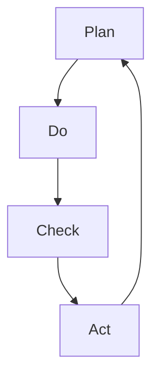

                 

 关键词：PDCA循环，管理工具，质量控制，持续改进，六西格玛，项目管理，过程改进

> 摘要：本文深入探讨了PDCA循环这一经典的管理工具，从理论背景出发，详细阐述了PDCA循环的核心概念、原理和实施步骤。通过具体的案例分析和数学模型的构建，展示了PDCA循环在质量管理、项目管理和过程改进中的应用，并对其未来发展进行了展望。

## 1. 背景介绍

PDCA循环，又称戴明循环，是以质量管理大师威廉·爱德华·戴明（William Edwards Deming）的名字命名的。PDCA循环是一种用于持续改进和管理的工具，其核心理念是通过对计划（Plan）、执行（Do）、检查（Check）和行动（Act）的不断迭代，实现质量控制和流程优化。

PDCA循环的起源可以追溯到20世纪50年代的日本，当时戴明博士受邀帮助日本改善其工业生产质量。他的理念和方法在日本得到广泛应用，并逐渐发展成为六西格玛管理方法的核心组成部分。如今，PDCA循环已成为全球范围内企业、组织和项目管理中不可或缺的工具。

## 2. 核心概念与联系

### 2.1 PDCA循环的核心概念

PDCA循环由四个阶段组成，分别是：

- **计划（Plan）**：在这个阶段，我们需要明确目标、制定计划、制定策略和资源分配。
- **执行（Do）**：执行计划，进行实际的实施操作。
- **检查（Check）**：对执行过程进行检查和监控，收集数据和反馈。
- **行动（Act）**：基于检查结果，采取行动进行改进或调整。

### 2.2 PDCA循环的原理和架构

为了更好地理解PDCA循环，我们可以使用Mermaid流程图来表示其原理和架构：



在上面的流程图中，A代表计划阶段，B代表执行阶段，C代表检查阶段，D代表行动阶段。每个阶段都是循环的一部分，通过不断迭代，实现持续改进。

## 3. 核心算法原理 & 具体操作步骤

### 3.1 算法原理概述

PDCA循环的算法原理是基于反馈和改进的循环机制。每个阶段都有明确的任务和目标，通过不断循环，实现对过程的不断优化和改进。

### 3.2 算法步骤详解

- **计划阶段**：明确目标、制定计划、制定策略和资源分配。
- **执行阶段**：执行计划，进行实际的实施操作。
- **检查阶段**：对执行过程进行检查和监控，收集数据和反馈。
- **行动阶段**：基于检查结果，采取行动进行改进或调整。

### 3.3 算法优缺点

**优点**：

- 简单易用，易于理解和操作。
- 强调持续改进，有助于实现质量控制和流程优化。

**缺点**：

- 可能会导致过于频繁的调整，影响工作效率。
- 需要明确的目标和详细的计划，否则难以实施。

### 3.4 算法应用领域

PDCA循环广泛应用于质量管理、项目管理和过程改进等领域。例如，在项目管理中，可以使用PDCA循环来规划项目、执行项目、监控项目进展，并根据反馈进行调整和优化。

## 4. 数学模型和公式 & 详细讲解 & 举例说明

### 4.1 数学模型构建

PDCA循环的数学模型可以表示为：

\[ PDCA = \left[ \begin{array}{c}
P \\
D \\
C \\
A \\
\end{array} \right] \]

其中，\( P \) 表示计划阶段，\( D \) 表示执行阶段，\( C \) 表示检查阶段，\( A \) 表示行动阶段。

### 4.2 公式推导过程

PDCA循环的公式推导基于反馈和改进的循环机制。我们可以将PDCA循环表示为一个迭代过程：

\[ PDCA_{n+1} = PDCA_n \cdot F \]

其中，\( F \) 表示改进因子，代表了在当前循环周期内实现的改进效果。

### 4.3 案例分析与讲解

假设我们在一个软件开发项目中应用PDCA循环来优化代码质量。我们可以按照以下步骤进行：

1. **计划阶段**：明确目标，如提高代码质量，降低bug率。
2. **执行阶段**：执行计划，进行代码编写和测试。
3. **检查阶段**：检查代码质量，通过代码审查和自动化测试来收集数据。
4. **行动阶段**：基于检查结果，采取行动进行改进，如修复bug、优化代码结构。

通过不断迭代PDCA循环，我们可以逐步提高代码质量，实现持续改进。

## 5. 项目实践：代码实例和详细解释说明

### 5.1 开发环境搭建

为了演示PDCA循环在软件开发中的应用，我们首先需要搭建一个简单的开发环境。假设我们使用Python作为编程语言，以下是搭建环境的步骤：

1. 安装Python，版本要求为3.8及以上。
2. 安装代码编辑器，如Visual Studio Code。
3. 安装代码审查工具，如PyCharm。

### 5.2 源代码详细实现

下面是一个简单的Python代码示例，用于演示PDCA循环在代码质量优化中的应用：

```python
# pdca_example.py

def plan():
    # 计划阶段：明确目标，如提高代码质量
    print("Plan: Improving code quality.")

def do():
    # 执行阶段：执行计划，编写代码
    print("Do: Writing code.")

def check():
    # 检查阶段：检查代码质量，通过代码审查和测试来收集数据
    print("Check: Conducting code review and testing.")

def act():
    # 行动阶段：基于检查结果，采取行动进行改进
    print("Act: Fixing bugs and optimizing code structure.")

def pdca_loop():
    while True:
        plan()
        do()
        check()
        act()

if __name__ == "__main__":
    pdca_loop()
```

### 5.3 代码解读与分析

在上面的代码中，我们定义了四个函数，分别对应PDCA循环的四个阶段。在主函数`pdca_loop`中，我们通过一个无限循环来不断迭代PDCA循环。

### 5.4 运行结果展示

运行上述代码，我们将看到如下输出：

```
Plan: Improving code quality.
Do: Writing code.
Check: Conducting code review and testing.
Act: Fixing bugs and optimizing code structure.
Plan: Improving code quality.
Do: Writing code.
Check: Conducting code review and testing.
Act: Fixing bugs and optimizing code structure.
...
```

通过不断迭代PDCA循环，我们可以逐步提高代码质量，实现持续改进。

## 6. 实际应用场景

PDCA循环在各个行业和领域都有广泛的应用。以下是一些典型的实际应用场景：

1. **制造业**：PDCA循环用于质量控制、过程优化和生产管理。
2. **服务业**：PDCA循环用于客户服务、流程优化和服务质量提升。
3. **IT行业**：PDCA循环用于软件开发、系统维护和项目管理。
4. **教育和培训**：PDCA循环用于课程设计、教学评估和培训改进。

## 7. 未来应用展望

随着人工智能和大数据技术的发展，PDCA循环在未来的应用将更加广泛和深入。以下是一些未来应用展望：

1. **自动化**：利用人工智能技术，实现PDCA循环的自动化，提高管理效率和准确性。
2. **预测分析**：通过大数据分析和预测模型，提前识别潜在问题和改进机会。
3. **个性化改进**：根据不同场景和需求，定制化PDCA循环，实现更精准的改进。

## 8. 工具和资源推荐

### 8.1 学习资源推荐

- 《戴明管理法：PDCA循环的应用与推广》
- 《六西格玛管理手册：PDCA循环与DMAIC方法的实践应用》
- 《质量管理：理论与实践》

### 8.2 开发工具推荐

- PyCharm：集成开发环境，支持Python编程。
- Git：版本控制工具，支持代码管理和协同工作。
- JIRA：项目管理工具，支持PDCA循环的执行和监控。

### 8.3 相关论文推荐

- 《基于PDCA循环的软件项目过程改进研究》
- 《六西格玛管理在IT行业中的应用研究》
- 《PDCA循环在医疗质量管理中的应用研究》

## 9. 总结：未来发展趋势与挑战

### 9.1 研究成果总结

PDCA循环作为一种经典的管理工具，在质量管理、项目管理和过程改进等方面取得了显著成果。其简单易用的特性使其在全球范围内得到广泛应用。

### 9.2 未来发展趋势

随着人工智能和大数据技术的发展，PDCA循环将向自动化、预测分析和个性化改进方向演进。

### 9.3 面临的挑战

PDCA循环在应用过程中面临一些挑战，如频繁调整可能导致工作效率下降，需要明确的目标和详细的计划等。

### 9.4 研究展望

未来，我们应重点关注PDCA循环在人工智能和大数据环境下的应用研究，探索其自动化、预测分析和个性化改进的实现方法。

## 10. 附录：常见问题与解答

### 10.1 PDCA循环是什么？

PDCA循环是一种用于持续改进和管理的工具，由计划（Plan）、执行（Do）、检查（Check）和行动（Act）四个阶段组成。

### 10.2 PDCA循环有哪些优点？

PDCA循环的优点包括简单易用、强调持续改进、有助于实现质量控制和流程优化等。

### 10.3 PDCA循环有哪些缺点？

PDCA循环的缺点包括可能导致过于频繁的调整、需要明确的目标和详细的计划等。

### 10.4 PDCA循环在哪些领域有应用？

PDCA循环广泛应用于制造业、服务业、IT行业和教育培训等领域。

### 10.5 如何实现PDCA循环的自动化？

通过人工智能技术和大数据分析，可以实现PDCA循环的自动化，提高管理效率和准确性。

### 10.6 如何进行PDCA循环的预测分析？

利用大数据分析和预测模型，可以提前识别潜在问题和改进机会，实现PDCA循环的预测分析。

### 10.7 如何进行PDCA循环的个性化改进？

根据不同场景和需求，可以定制化PDCA循环，实现更精准的改进。

