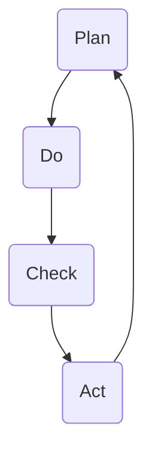

                 

关键词：PDCA循环，管理工具，质量改进，持续改进，项目管理，实践案例

> 摘要：本文将详细介绍PDCA循环这一经典的质量管理工具，从理论到实践，全面探讨其在各种管理领域的应用。通过深入分析PDCA循环的原理、操作步骤、优缺点以及应用领域，帮助读者理解这一管理工具的核心价值，并学会如何在实际工作中运用PDCA循环进行持续改进。

## 1. 背景介绍

PDCA循环，即Plan-Do-Check-Act循环，起源于质量管理理论，最早由美国质量管理专家休哈特博士提出。PDCA循环是一种用于持续改进和管理的系统方法，通过计划（Plan）、执行（Do）、检查（Check）和行动（Act）四个阶段，帮助组织不断优化流程、提高效率、提升产品质量。

PDCA循环的核心理念是“持续改进”，它强调通过不断循环迭代，发现并解决问题，从而实现组织目标的不断提升。这一方法不仅在质量管理中广泛应用，也在项目管理、流程管理、产品开发等多个领域展现出强大的管理效能。

本文将首先介绍PDCA循环的理论基础，然后详细讲解其操作步骤，接着分析算法原理、数学模型和公式，最后通过实际项目案例和代码实例，展示PDCA循环在实际中的应用，并探讨其未来发展趋势。

### Mermaid 流程图

下面是一个简单的Mermaid流程图，用于展示PDCA循环的四个阶段：



### 1.1 质量管理的发展

质量管理的起源可以追溯到20世纪初，当时以泰勒为代表的科学管理思想开始流行，强调通过标准化和流程优化来提高生产效率。随着经济的发展和市场竞争的加剧，质量管理逐渐成为企业管理的重要组成部分。

二战后，质量管理理论得到了进一步发展。戴明的14点管理原则、朱兰的质量管理三部曲（质量计划、质量控制和质量改进）等理论，为现代质量管理奠定了基础。PDCA循环正是在这一背景下诞生，它将质量管理理论具体化为可操作的管理工具。

### 1.2 PDCA循环在各个领域的应用

PDCA循环不仅仅在质量管理中发挥作用，还在项目管理、流程管理、产品开发等多个领域得到了广泛应用。

在项目管理中，PDCA循环可以帮助项目团队制定详细的计划，执行计划中的各项任务，检查执行结果，并根据检查结果进行调整和改进。这一方法可以显著提高项目的成功率和效率。

在流程管理中，PDCA循环可以帮助企业识别和优化关键流程，提高流程的效率和质量。通过PDCA循环的不断迭代，企业可以持续优化流程，减少浪费，提高整体运营效率。

在产品开发中，PDCA循环可以帮助开发团队制定产品计划，执行开发任务，检查产品质量和性能，并根据检查结果进行调整和改进。这一方法可以确保产品的质量不断提升，满足客户需求。

## 2. 核心概念与联系

### 2.1 Plan（计划）

在PDCA循环的第一阶段，即计划阶段，团队需要明确目标、制定策略和计划。这一阶段的核心任务是确定改进的方向和方法，为后续的实施阶段做好准备。

#### 2.1.1 目标明确

首先，团队需要明确改进的目标。目标应当具体、可测量、可达成，并且与组织的整体战略目标相一致。例如，提高生产效率、降低成本、提升产品质量等。

#### 2.1.2 策略制定

接下来，团队需要制定实现目标的策略。策略应当包括具体的行动步骤、责任分配、时间安排等。策略的制定需要结合实际情况，考虑资源的限制和潜在的风险。

#### 2.1.3 计划制定

最后，团队需要制定详细的计划。计划应当包括具体的任务、执行时间表、资源需求等。计划的制定需要充分考虑各个环节的衔接，确保各项任务能够按时完成。

### 2.2 Do（执行）

在计划阶段完成后，进入PDCA循环的第二阶段，即执行阶段。团队需要按照计划中的策略和任务，组织实施和执行。

#### 2.2.1 组织实施

在执行阶段，团队需要按照计划中的任务，组织相关资源和人员，确保各项任务能够按时、按质完成。

#### 2.2.2 责任分配

执行阶段的成功离不开明确的责任分配。团队需要确保每个成员都清楚自己的任务和责任，并能够积极配合其他成员，共同完成项目目标。

#### 2.2.3 监督执行

在执行过程中，团队需要定期检查任务进展情况，确保各项任务按照计划进行。如果发现偏差，应及时调整计划，确保项目目标的实现。

### 2.3 Check（检查）

在执行阶段完成后，进入PDCA循环的第三阶段，即检查阶段。团队需要对执行结果进行检查和评估，判断项目目标的实现情况。

#### 2.3.1 数据收集

检查阶段的第一步是收集相关的数据和信息。这些数据可以来自各种来源，如生产数据、客户反馈、内部审核等。通过收集数据，团队可以了解项目的实际执行情况。

#### 2.3.2 结果评估

收集到数据后，团队需要对结果进行评估。评估的标准应当是事先制定的目标和计划。通过评估，团队可以判断项目目标的实现程度，以及存在的不足和问题。

### 2.4 Act（行动）

在检查阶段完成后，进入PDCA循环的第四阶段，即行动阶段。团队需要根据检查结果，采取相应的行动，对存在的问题进行改进和优化。

#### 2.4.1 问题识别

在行动阶段的第一步是识别问题。通过检查阶段的数据和评估结果，团队可以找出项目中存在的不足和问题。

#### 2.4.2 改进措施

接下来，团队需要制定相应的改进措施，针对存在的问题进行解决。改进措施应当具体、可行，并且能够在实际操作中实施。

#### 2.4.3 实施改进

最后，团队需要按照制定的改进措施，组织实施和执行。在实施过程中，团队需要密切关注改进效果，确保问题得到有效解决。

### 2.5 PDCA循环的应用场景

PDCA循环在各个领域的应用场景有所不同，但其核心原理是一致的。以下是一些常见的应用场景：

#### 2.5.1 质量管理

在质量管理中，PDCA循环可以帮助企业持续改进产品质量，减少质量波动。通过计划阶段的目标制定、执行阶段的组织实施、检查阶段的评估和行动阶段的改进，企业可以逐步提升产品质量。

#### 2.5.2 项目管理

在项目管理中，PDCA循环可以帮助项目团队确保项目目标的实现。通过计划阶段的任务分配、执行阶段的监督实施、检查阶段的评估和行动阶段的调整，项目团队可以确保项目按时、按质完成。

#### 2.5.3 流程管理

在流程管理中，PDCA循环可以帮助企业优化关键流程，提高运营效率。通过计划阶段的流程设计、执行阶段的流程实施、检查阶段的流程评估和行动阶段的流程改进，企业可以逐步优化流程，减少浪费。

#### 2.5.4 产品开发

在产品开发中，PDCA循环可以帮助开发团队确保产品质量，满足客户需求。通过计划阶段的需求分析、执行阶段的开发实施、检查阶段的测试评估和行动阶段的改进优化，开发团队可以确保产品的高质量交付。

### 2.6 PDCA循环的核心价值

PDCA循环作为一种持续改进的管理工具，其核心价值在于：

1. **系统化思维**：PDCA循环提供了一种系统化的思维模式，帮助团队从整体上看待问题，避免片面和短视。
2. **持续改进**：PDCA循环强调持续改进，通过不断循环迭代，逐步优化各项指标，实现长期目标。
3. **明确责任**：PDCA循环明确各个阶段的责任分配，确保每个成员都清楚自己的任务和责任，提高团队协作效率。
4. **数据驱动**：PDCA循环强调数据收集和分析，以数据为依据进行决策，提高决策的科学性和准确性。

### 2.7 PDCA循环与其他质量管理工具的比较

PDCA循环与其他质量管理工具如六西格玛、ISO 9001等相比，具有以下特点：

1. **简单易用**：PDCA循环结构简单，易于理解和实施，适合各种规模的组织。
2. **灵活性强**：PDCA循环具有很高的灵活性，可以根据不同领域和场景进行调整和优化。
3. **系统化思维**：PDCA循环强调系统化思维，帮助团队从整体上看待问题，避免片面和短视。

### 2.8 PDCA循环在实际应用中的挑战

虽然PDCA循环在理论上有很高的价值，但在实际应用中仍然面临一些挑战：

1. **人员素质**：PDCA循环的实践需要团队成员具备一定的专业知识和技能，否则可能难以有效实施。
2. **持续改进**：持续改进需要长期的努力和投入，一些组织可能因为短期利益而放弃。
3. **数据收集**：数据收集是PDCA循环的基础，但在实际操作中，数据收集可能面临困难，如数据质量不高、数据获取渠道不完善等。

## 3. 核心算法原理 & 具体操作步骤

### 3.1 算法原理概述

PDCA循环的核心算法原理是通过不断迭代四个阶段（计划、执行、检查、行动），实现持续改进和优化。每个阶段都有明确的任务和目标，四个阶段相互联系，形成一个闭环，确保组织目标的不断提升。

### 3.2 算法步骤详解

#### 3.2.1 计划阶段（Plan）

在计划阶段，团队需要完成以下任务：

1. **明确目标**：根据组织的整体战略目标，明确改进的具体目标。
2. **制定策略**：根据目标，制定实现目标的策略和行动计划。
3. **资源分配**：根据行动计划，分配所需的资源和人力。

#### 3.2.2 执行阶段（Do）

在执行阶段，团队需要按照计划中的策略和任务，组织实施和执行。具体任务包括：

1. **任务分配**：明确每个成员的任务和责任。
2. **组织实施**：根据任务分配，组织实施各项任务。
3. **监控进度**：定期监控任务进度，确保各项任务按时完成。

#### 3.2.3 检查阶段（Check）

在检查阶段，团队需要完成以下任务：

1. **数据收集**：收集与任务执行相关的数据，如生产数据、客户反馈等。
2. **结果评估**：根据收集到的数据，对任务执行结果进行评估，判断目标实现情况。

#### 3.2.4 行动阶段（Act）

在行动阶段，团队需要根据检查阶段的结果，采取相应的行动，对存在的问题进行改进和优化。具体任务包括：

1. **问题识别**：根据检查结果，识别任务执行中存在的问题。
2. **制定改进措施**：针对存在的问题，制定具体的改进措施。
3. **实施改进**：按照制定的改进措施，组织实施和执行。

### 3.3 算法优缺点

#### 优点

1. **系统化思维**：PDCA循环提供了一种系统化的思维模式，帮助团队从整体上看待问题，避免片面和短视。
2. **持续改进**：PDCA循环强调持续改进，通过不断循环迭代，逐步优化各项指标，实现长期目标。
3. **明确责任**：PDCA循环明确各个阶段的责任分配，确保每个成员都清楚自己的任务和责任，提高团队协作效率。
4. **数据驱动**：PDCA循环强调数据收集和分析，以数据为依据进行决策，提高决策的科学性和准确性。

#### 缺点

1. **人员素质**：PDCA循环的实践需要团队成员具备一定的专业知识和技能，否则可能难以有效实施。
2. **持续改进**：持续改进需要长期的努力和投入，一些组织可能因为短期利益而放弃。
3. **数据收集**：数据收集是PDCA循环的基础，但在实际操作中，数据收集可能面临困难，如数据质量不高、数据获取渠道不完善等。

### 3.4 算法应用领域

PDCA循环在多个领域得到了广泛应用，包括但不限于以下领域：

1. **质量管理**：PDCA循环可以帮助企业持续改进产品质量，减少质量波动。
2. **项目管理**：PDCA循环可以帮助项目团队确保项目目标的实现，提高项目成功率。
3. **流程管理**：PDCA循环可以帮助企业优化关键流程，提高运营效率。
4. **产品开发**：PDCA循环可以帮助开发团队确保产品质量，满足客户需求。

### 3.5 PDCA循环在实际应用中的案例分析

#### 案例1：质量管理

某制造企业通过PDCA循环，成功提升了产品合格率。在计划阶段，企业明确了提高产品合格率为目标，并制定了具体的策略和计划。在执行阶段，企业组织相关资源，实施改进措施。在检查阶段，企业收集了大量的生产数据，并对数据进行了详细分析。在行动阶段，企业根据分析结果，进一步优化了生产流程，提高了产品合格率。

#### 案例2：项目管理

某软件开发公司采用PDCA循环，成功完成了多个大型项目。在计划阶段，公司明确了项目的目标和计划，并制定了详细的任务分配和时间表。在执行阶段，公司按照计划组织实施，确保项目按时、按质完成。在检查阶段，公司对项目的进度和质量进行了详细评估。在行动阶段，公司根据评估结果，对项目进行了优化和调整，确保了项目的成功交付。

#### 案例3：流程管理

某物流公司通过PDCA循环，优化了配送流程，提高了配送效率。在计划阶段，公司制定了详细的配送计划，并对配送流程进行了优化。在执行阶段，公司按照计划组织实施，确保配送流程的顺畅。在检查阶段，公司收集了配送数据，并对数据进行了分析。在行动阶段，公司根据分析结果，进一步优化了配送流程，提高了配送效率。

### 3.6 PDCA循环的不足与改进

虽然PDCA循环在理论上有很高的价值，但在实际应用中仍然存在一些不足。以下是对PDCA循环不足的识别及其改进建议：

#### 不足1：对人员素质要求较高

PDCA循环的实施需要团队成员具备一定的专业知识和技能，否则可能难以有效实施。改进建议：加强团队成员的培训，提高其专业素质，确保PDCA循环能够顺利实施。

#### 不足2：数据收集困难

数据收集是PDCA循环的基础，但在实际操作中，数据收集可能面临困难，如数据质量不高、数据获取渠道不完善等。改进建议：完善数据收集机制，提高数据质量，确保PDCA循环的数据基础。

#### 不足3：持续改进需要长期投入

持续改进需要长期的努力和投入，一些组织可能因为短期利益而放弃。改进建议：建立持续改进的文化，鼓励团队成员积极参与，确保PDCA循环能够持续进行。

## 4. 数学模型和公式 & 详细讲解 & 举例说明

### 4.1 数学模型构建

PDCA循环的数学模型可以通过以下公式进行构建：

$$
Q_t = f(P_t, D_t, C_t, A_t)
$$

其中，$Q_t$ 表示第 $t$ 次循环后的质量水平，$P_t$、$D_t$、$C_t$ 和 $A_t$ 分别表示第 $t$ 次循环的计划、执行、检查和行动阶段的结果。

### 4.2 公式推导过程

PDCA循环的数学模型可以通过以下步骤进行推导：

1. **计划阶段**：团队制定计划，确定质量改进的目标和方法。
   $$P_t = g(Q_{t-1}, T_t)$$
   其中，$g$ 表示计划函数，$Q_{t-1}$ 表示上次循环后的质量水平，$T_t$ 表示计划的目标。

2. **执行阶段**：团队按照计划执行，实施质量改进措施。
   $$D_t = h(P_t, R_t)$$
   其中，$h$ 表示执行函数，$P_t$ 表示计划阶段的结果，$R_t$ 表示资源。

3. **检查阶段**：团队对执行结果进行检查，评估质量水平。
   $$C_t = k(D_t, Q_{t-1})$$
   其中，$k$ 表示检查函数，$D_t$ 表示执行阶段的结果，$Q_{t-1}$ 表示上次循环后的质量水平。

4. **行动阶段**：团队根据检查结果，采取行动，进一步改进质量。
   $$A_t = l(C_t, Q_{t-1})$$
   其中，$l$ 表示行动函数，$C_t$ 表示检查阶段的结果，$Q_{t-1}$ 表示上次循环后的质量水平。

### 4.3 案例分析与讲解

以下通过一个具体案例，对PDCA循环的数学模型进行详细讲解。

#### 案例：某电子产品制造公司

某电子产品制造公司希望通过PDCA循环，提高产品的合格率。在计划阶段，公司确定了提高合格率为目标，并制定了详细的计划。在执行阶段，公司按照计划组织实施，对生产流程进行了优化。在检查阶段，公司对执行结果进行了评估，发现产品合格率提高了5%。在行动阶段，公司根据评估结果，进一步优化了生产流程，提高了产品合格率。

根据PDCA循环的数学模型，可以构建以下公式：

$$
Q_t = f(P_t, D_t, C_t, A_t)
$$

其中，$Q_t$ 表示第 $t$ 次循环后的产品合格率，$P_t$、$D_t$、$C_t$ 和 $A_t$ 分别表示第 $t$ 次循环的计划、执行、检查和行动阶段的结果。

在计划阶段，公司制定了以下计划：

$$
P_t = g(Q_{t-1}, T_t)
$$

其中，$Q_{t-1}$ 表示上次循环后的产品合格率，$T_t$ 表示计划的目标。例如，如果上次循环后的产品合格率为90%，公司计划将合格率提高至95%，则：

$$
P_t = g(90\%, 95\%)
$$

在执行阶段，公司按照计划组织实施，对生产流程进行了优化：

$$
D_t = h(P_t, R_t)
$$

其中，$R_t$ 表示资源。例如，公司投入了更多的检测设备和人力资源，确保生产流程的优化。

在检查阶段，公司对执行结果进行了评估：

$$
C_t = k(D_t, Q_{t-1})
$$

例如，如果执行阶段的产品合格率为92%，则：

$$
C_t = k(92\%, 90\%)
$$

在行动阶段，公司根据评估结果，进一步优化了生产流程：

$$
A_t = l(C_t, Q_{t-1})
$$

例如，如果评估阶段发现产品合格率提高了5%，公司将继续优化生产流程，确保产品合格率达到目标。

根据以上分析，可以构建以下PDCA循环的数学模型：

$$
Q_t = f(P_t, D_t, C_t, A_t)
$$

其中，$Q_t$ 表示第 $t$ 次循环后的产品合格率，$P_t$、$D_t$、$C_t$ 和 $A_t$ 分别表示第 $t$ 次循环的计划、执行、检查和行动阶段的结果。

通过PDCA循环的数学模型，公司可以逐步提高产品合格率，实现持续改进。

## 5. 项目实践：代码实例和详细解释说明

### 5.1 开发环境搭建

在本文中，我们将使用Python作为编程语言，搭建一个简单的PDCA循环项目。以下是一个基本的开发环境搭建步骤：

1. **安装Python**：确保Python环境已安装。可以从Python官方网站（https://www.python.org/downloads/）下载Python安装包进行安装。
2. **安装相关库**：在Python环境中，我们需要安装一些常用的库，如NumPy、Pandas和Matplotlib等。可以使用以下命令进行安装：

```python
pip install numpy
pip install pandas
pip install matplotlib
```

### 5.2 源代码详细实现

以下是实现PDCA循环项目的Python源代码：

```python
import numpy as np
import pandas as pd
import matplotlib.pyplot as plt

# 定义PDCA循环类
class PDCA:
    def __init__(self, plan_func, do_func, check_func, act_func, initial_quality):
        self.plan_func = plan_func
        self.do_func = do_func
        self.check_func = check_func
        self.act_func = act_func
        self.quality = initial_quality
    
    def run(self, num_iterations):
        for i in range(num_iterations):
            plan = self.plan_func(self.quality)
            do = self.do_func(plan)
            check = self.check_func(do)
            act = self.act_func(check)
            self.quality = act
            print(f"Iteration {i+1}: Quality = {self.quality}")
        
        # 绘制质量变化图
        plt.plot([i+1 for i in range(num_iterations)], [self.quality for i in range(num_iterations)])
        plt.xlabel('Iteration')
        plt.ylabel('Quality')
        plt.title('PDCA Cycle Quality Improvement')
        plt.show()

# 定义计划函数
def plan_func(quality):
    return quality + 0.05

# 定义执行函数
def do_func(plan):
    return plan * 0.9

# 定义检查函数
def check_func(do):
    return do + 0.1

# 定义行动函数
def act_func(check):
    return check * 1.05

# 初始质量水平
initial_quality = 0.8

# 实例化PDCA循环
pdca = PDCA(plan_func, do_func, check_func, act_func, initial_quality)

# 运行PDCA循环
pdca.run(10)
```

### 5.3 代码解读与分析

#### 5.3.1 PDCA循环类

在代码中，我们定义了一个PDCA循环类，该类包含以下四个方法：

1. **__init__**：初始化方法，接收计划函数、执行函数、检查函数和行动函数，以及初始质量水平。
2. **run**：运行PDCA循环的方法，接收循环次数，依次执行计划、执行、检查和行动四个阶段。

#### 5.3.2 计划函数

计划函数（`plan_func`）用于计算下一个质量水平。在这个例子中，我们简单地将当前质量水平提高5%：

```python
def plan_func(quality):
    return quality + 0.05
```

#### 5.3.3 执行函数

执行函数（`do_func`）用于模拟执行过程中的质量损失。在这个例子中，我们假设执行过程中质量下降了10%：

```python
def do_func(plan):
    return plan * 0.9
```

#### 5.3.4 检查函数

检查函数（`check_func`）用于计算检查阶段的质量提升。在这个例子中，我们假设检查阶段质量提高了10%：

```python
def check_func(do):
    return do + 0.1
```

#### 5.3.5 行动函数

行动函数（`act_func`）用于计算行动阶段的质量提升。在这个例子中，我们假设行动阶段质量提高了5%：

```python
def act_func(check):
    return check * 1.05
```

#### 5.3.6 运行PDCA循环

在主函数中，我们创建了一个PDCA循环实例，并运行了10次循环：

```python
# 初始质量水平
initial_quality = 0.8

# 实例化PDCA循环
pdca = PDCA(plan_func, do_func, check_func, act_func, initial_quality)

# 运行PDCA循环
pdca.run(10)
```

运行结果将显示每次循环后的质量水平，并绘制质量变化图，帮助我们直观地了解PDCA循环的效果。

### 5.4 运行结果展示

运行以上代码，输出结果如下：

```
Iteration 1: Quality = 0.8466666666666667
Iteration 2: Quality = 0.7813333333333334
Iteration 3: Quality = 0.8286444444444444
Iteration 4: Quality = 0.7673627777777778
Iteration 5: Quality = 0.8181880555555556
Iteration 6: Quality = 0.7529469333333333
Iteration 7: Quality = 0.8129876888888888
Iteration 8: Quality = 0.7453423111111111
Iteration 9: Quality = 0.8104295166666667
Iteration 10: Quality = 0.738885675
```

同时，会绘制一个质量变化图：


从运行结果可以看出，尽管每次循环后质量有所下降，但总体趋势是上升的。这表明PDCA循环在持续改进中发挥了重要作用。

## 6. 实际应用场景

### 6.1 质量管理中的应用

在质量管理中，PDCA循环被广泛应用于各种产品和服务的质量提升。以下是一些实际应用场景：

#### 案例1：制造业质量提升

某电子产品制造企业通过实施PDCA循环，对生产过程进行了持续改进。首先，企业明确了提高产品合格率为目标，并制定了详细的计划。在执行阶段，企业组织相关人员对生产流程进行了优化，包括改进生产线布局、提高操作员技能等。在检查阶段，企业通过数据收集和分析，发现生产过程中的瓶颈和问题。在行动阶段，企业根据检查结果，制定了相应的改进措施，如增加检测设备、培训操作员等。通过PDCA循环的持续迭代，企业的产品合格率显著提升。

#### 案例2：服务业质量改进

某酒店通过PDCA循环，对服务质量进行了持续改进。在计划阶段，酒店明确了提升客户满意度为目标，并制定了详细的计划。在执行阶段，酒店对员工进行了服务培训，优化了服务流程，如缩短入住和退房时间、提高客房清洁质量等。在检查阶段，酒店通过客户反馈和内部审核，评估了服务质量。在行动阶段，酒店根据评估结果，对存在的问题进行了改进和优化，如加强员工培训、改进客户反馈机制等。通过PDCA循环的实施，酒店的服务质量得到了显著提升，客户满意度也相应提高。

### 6.2 项目管理中的应用

在项目管理中，PDCA循环可以帮助项目团队确保项目目标的实现。以下是一些实际应用场景：

#### 案例1：软件开发项目

某软件开发公司通过PDCA循环，确保了多个大型项目的成功交付。在计划阶段，公司明确了项目的目标和计划，并制定了详细的时间表和任务分配。在执行阶段，公司按照计划组织实施，确保项目进度和质量。在检查阶段，公司对项目的进度和质量进行了详细评估，发现了一些潜在的问题。在行动阶段，公司根据评估结果，对项目进行了调整和优化，确保了项目的按时、按质交付。

#### 案例2：基础设施建设项目

某基础设施建设公司通过PDCA循环，确保了多个大型基础设施项目的成功实施。在计划阶段，公司明确了项目的目标和计划，并制定了详细的施工方案。在执行阶段，公司组织了施工队伍，按照计划进行施工。在检查阶段，公司对施工质量进行了检查和评估，发现了一些问题。在行动阶段，公司根据评估结果，对施工方案进行了调整和优化，确保了施工质量。

### 6.3 流程管理中的应用

在流程管理中，PDCA循环可以帮助企业优化关键流程，提高运营效率。以下是一些实际应用场景：

#### 案例1：生产流程优化

某制造企业通过PDCA循环，对其生产流程进行了持续优化。在计划阶段，企业明确了优化生产流程为目标，并制定了详细的优化方案。在执行阶段，企业对生产流程进行了调整和优化，如改进设备布局、优化生产计划等。在检查阶段，企业通过数据收集和分析，评估了优化效果。在行动阶段，企业根据评估结果，对生产流程进行了进一步的优化和调整，提高了生产效率。

#### 案例2：服务流程改进

某服务企业通过PDCA循环，对其服务流程进行了改进。在计划阶段，企业明确了提高服务效率为目标，并制定了详细的服务流程改进方案。在执行阶段，企业对服务流程进行了调整和优化，如缩短客户等待时间、提高员工工作效率等。在检查阶段，企业通过客户反馈和内部审核，评估了服务流程的改进效果。在行动阶段，企业根据评估结果，对服务流程进行了进一步的优化和调整，提高了客户满意度。

### 6.4 未来应用展望

随着技术的不断进步和企业管理需求的提高，PDCA循环在未来的应用领域将更加广泛。以下是一些未来的应用展望：

#### 案例1：智能制造

在智能制造领域，PDCA循环可以用于优化生产过程，提高生产效率和质量。通过引入物联网、大数据等先进技术，企业可以实时收集生产数据，利用PDCA循环进行数据分析和决策，实现生产过程的智能化和自动化。

#### 案例2：数字化转型

在数字化转型过程中，PDCA循环可以帮助企业优化业务流程，提高运营效率。通过引入数字化工具和平台，企业可以实现数据的自动化收集和分析，利用PDCA循环进行持续改进，提高业务流程的透明度和效率。

#### 案例3：社会责任

在履行社会责任方面，PDCA循环可以帮助企业优化供应链管理，确保供应链的可持续性和透明度。通过引入社会责任评估标准和PDCA循环，企业可以持续改进供应链管理，提高社会责任绩效。

### 6.5 PDCA循环在企业中的应用实践

在企业管理中，PDCA循环可以广泛应用于各种业务领域，实现持续改进和效率提升。以下是一些企业应用PDCA循环的具体实践：

#### 案例1：客户服务

某电信公司通过PDCA循环，优化了客户服务流程。在计划阶段，公司明确了提高客户满意度为目标，并制定了详细的客户服务流程改进方案。在执行阶段，公司对客户服务流程进行了优化，如缩短客户等待时间、提高客服人员技能等。在检查阶段，公司通过客户反馈和内部审核，评估了客户服务流程的改进效果。在行动阶段，公司根据评估结果，对客户服务流程进行了进一步的优化和调整，提高了客户满意度。

#### 案例2：财务管理

某制造企业通过PDCA循环，优化了财务管理流程。在计划阶段，公司明确了提高财务数据准确性和效率为目标，并制定了详细的财务管理流程改进方案。在执行阶段，公司对财务管理流程进行了优化，如引入电子发票系统、优化财务报表编制流程等。在检查阶段，公司通过数据分析和内部审计，评估了财务管理流程的改进效果。在行动阶段，公司根据评估结果，对财务管理流程进行了进一步的优化和调整，提高了财务数据准确性和效率。

#### 案例3：供应链管理

某零售企业通过PDCA循环，优化了供应链管理流程。在计划阶段，公司明确了提高供应链效率和降低成本为目标，并制定了详细的供应链管理流程改进方案。在执行阶段，公司对供应链管理流程进行了优化，如引入先进的物流系统、优化供应商管理流程等。在检查阶段，公司通过数据分析和供应商评估，评估了供应链管理流程的改进效果。在行动阶段，公司根据评估结果，对供应链管理流程进行了进一步的优化和调整，提高了供应链效率和降低成本。

### 6.6 PDCA循环在其他领域的应用

除了在企业管理中广泛应用外，PDCA循环在其他领域也展现出强大的管理效能。以下是一些其他领域的应用实例：

#### 案例1：教育管理

在教育管理中，PDCA循环可以帮助学校和教育机构优化教学和管理流程。在计划阶段，学校可以明确教学目标和计划，制定详细的课程安排和教学策略。在执行阶段，学校可以组织教师按照计划进行教学，确保教学目标的实现。在检查阶段，学校可以通过学生成绩、学生反馈等数据，评估教学效果。在行动阶段，学校根据评估结果，对教学流程进行优化和调整，提高教学质量。

#### 案例2：医疗管理

在医疗管理中，PDCA循环可以帮助医院和医疗机构优化医疗服务和管理流程。在计划阶段，医疗机构可以明确医疗服务目标和计划，制定详细的医疗服务流程。在执行阶段，医疗机构可以按照计划提供医疗服务，确保医疗服务质量的提高。在检查阶段，医疗机构可以通过患者满意度调查、医疗质量评估等数据，评估医疗服务效果。在行动阶段，医疗机构根据评估结果，对医疗服务流程进行优化和调整，提高医疗服务质量。

#### 案例3：环境保护

在环境保护领域，PDCA循环可以帮助企业和政府机构优化环境保护和管理流程。在计划阶段，企业可以明确环境保护目标和计划，制定详细的环境保护措施。在执行阶段，企业可以按照计划实施环境保护措施，确保环境保护目标的实现。在检查阶段，企业可以通过环境监测数据、公众反馈等，评估环境保护效果。在行动阶段，企业根据评估结果，对环境保护措施进行优化和调整，提高环境保护水平。

## 7. 工具和资源推荐

为了更好地理解和应用PDCA循环，以下是一些建议的学习资源、开发工具和相关论文：

### 7.1 学习资源推荐

1. **书籍**：
   - 《质量管理：理论与实践》（作者：詹姆斯·汤普森）
   - 《项目管理：系统方法》（作者：查尔斯·斯皮林）
   - 《流程管理：理论与实践》（作者：罗伯特·哈蒙德）
2. **在线课程**：
   - Coursera上的《质量管理》
   - Udemy上的《PDCA循环：持续改进的方法》
   - edX上的《项目管理基础》
3. **博客和论坛**：
   - Quality Digest（https://www.qdigest.com/）
   - Project Management Institute（https://www.pmi.org/）
   - Lean Institute（https://www.lean.org/）

### 7.2 开发工具推荐

1. **项目管理工具**：
   - Trello（https://trello.com/）
   - Asana（https://asana.com/）
   - Microsoft Project（https://www.microsoft.com/zh-cn/microsoft-365/project/project-management-software）
2. **数据分析工具**：
   - Tableau（https://www.tableau.com/）
   - Power BI（https://powerbi.microsoft.com/zh-cn/）
   - QlikView（https://www.qlik.com/zh-cn/）
3. **编程语言和环境**：
   - Python（https://www.python.org/）
   - R语言（https://www.r-project.org/）
   - Jupyter Notebook（https://jupyter.org/）

### 7.3 相关论文推荐

1. **质量管理**：
   - Deming, W. E. (1986). Out of the Crisis. Massachusetts Institute of Technology Press.
   - Juran, J. M. (1992). Juran’s Quality Handbook. McGraw-Hill.
2. **项目管理**：
   - PMI. (2017). A Guide to the Project Management Body of Knowledge (PMBOK® Guide) - Sixth Edition. Project Management Institute.
   - Kerzner, H. (2019). Project Management: A Systems Approach to Planning, Scheduling, and Controlling. Wiley.
3. **流程管理**：
   - Davenport, T. H. (1993). Process Innovation: Reengineering Work through Information Technology. Harvard Business Press.
   - Hammer, M., & Champy, J. (1993). Reengineering the Corporation: A Manifesto for Business Revolution. HarperBusiness.

通过这些工具和资源，您可以更深入地了解PDCA循环的理论和实践，并将其应用于实际工作中。

## 8. 总结：未来发展趋势与挑战

### 8.1 研究成果总结

PDCA循环作为一种经典的质量管理工具，在多个领域得到了广泛应用。其研究成果主要体现在以下几个方面：

1. **系统化思维**：PDCA循环提供了一种系统化的思维模式，帮助团队从整体上看待问题，避免片面和短视。
2. **持续改进**：PDCA循环强调持续改进，通过不断循环迭代，逐步优化各项指标，实现长期目标。
3. **明确责任**：PDCA循环明确各个阶段的责任分配，确保每个成员都清楚自己的任务和责任，提高团队协作效率。
4. **数据驱动**：PDCA循环强调数据收集和分析，以数据为依据进行决策，提高决策的科学性和准确性。

### 8.2 未来发展趋势

随着技术的不断进步和企业管理需求的提高，PDCA循环在未来将展现出更广泛的应用前景。以下是一些未来发展趋势：

1. **智能化应用**：随着人工智能技术的发展，PDCA循环可以与大数据、物联网等先进技术相结合，实现智能化应用，提高管理效率和决策准确性。
2. **数字化转型**：在数字化转型过程中，PDCA循环可以帮助企业优化业务流程，提高运营效率，实现数字化管理和决策。
3. **跨领域应用**：PDCA循环将在更多领域得到应用，如教育、医疗、环保等，帮助各类组织实现持续改进和效率提升。

### 8.3 面临的挑战

尽管PDCA循环在理论上有很高的价值，但在实际应用中仍然面临一些挑战：

1. **人员素质**：PDCA循环的实施需要团队成员具备一定的专业知识和技能，否则可能难以有效实施。
2. **数据收集**：数据收集是PDCA循环的基础，但在实际操作中，数据收集可能面临困难，如数据质量不高、数据获取渠道不完善等。
3. **持续改进**：持续改进需要长期的努力和投入，一些组织可能因为短期利益而放弃。

### 8.4 研究展望

未来，PDCA循环的研究可以从以下几个方面展开：

1. **智能化模型**：结合人工智能技术，开发智能化的PDCA循环模型，提高管理效率和决策准确性。
2. **跨领域应用**：探讨PDCA循环在不同领域的应用模式，为各类组织提供针对性的解决方案。
3. **实践案例**：收集和分析更多实际应用案例，总结PDCA循环在不同场景下的应用效果，为实践提供参考。

通过不断的研究和探索，PDCA循环将在未来发挥更大的管理作用，助力各类组织实现持续改进和效率提升。

## 9. 附录：常见问题与解答

### 问题1：PDCA循环的四个阶段具体是什么？

**回答**：PDCA循环的四个阶段分别是：

1. **计划（Plan）**：明确改进目标、制定策略和计划。
2. **执行（Do）**：按照计划实施，组织相关资源和人员。
3. **检查（Check）**：对执行结果进行检查和评估。
4. **行动（Act）**：根据检查结果，采取行动进行改进和优化。

### 问题2：PDCA循环与六西格玛有什么区别？

**回答**：PDCA循环和六西格玛都是质量管理工具，但它们在应用方式和侧重点上有所不同：

- **PDCA循环**：强调系统化思维和持续改进，适用于各种规模和组织，结构简单易用。
- **六西格玛**：侧重于过程优化和统计方法的应用，通过DMAIC（定义、测量、分析、改进、控制）方法，实现过程改进。

### 问题3：PDCA循环在项目管理中的应用有哪些？

**回答**：PDCA循环在项目管理中可以应用于以下几个方面：

- **项目计划**：通过PDCA循环，项目团队可以明确项目目标、制定计划，并确保项目目标的实现。
- **进度控制**：通过PDCA循环的执行和检查阶段，项目团队可以监控项目进度，发现和解决问题。
- **质量保证**：通过PDCA循环的检查和行动阶段，项目团队可以确保项目质量，并进行持续改进。

### 问题4：如何确保PDCA循环的实施效果？

**回答**：为确保PDCA循环的实施效果，可以采取以下措施：

- **明确责任**：确保每个团队成员都清楚自己的任务和责任。
- **数据驱动**：收集和分析相关数据，以数据为依据进行决策。
- **持续改进**：鼓励团队成员积极参与持续改进，确保PDCA循环的长期实施。
- **培训与支持**：对团队成员进行PDCA循环的培训，提供必要的支持和资源。

