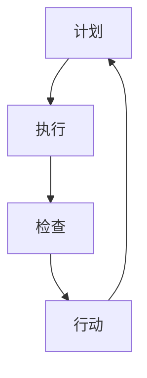

                 

 关键词：PDCA循环，持续改进，质量提升，项目管理，系统优化

> 摘要：本文将深入探讨PDCA循环这一持续改进的利器，通过介绍其背景、核心概念、算法原理、数学模型、实际应用和未来展望，帮助读者理解PDCA循环在各个领域的广泛应用和重要性。

## 1. 背景介绍

PDCA循环，即Plan-Do-Check-Act循环，起源于质量管理领域，是一种循环渐进的持续改进方法。PDCA循环最早由美国质量管理专家威廉·爱德华兹·戴明提出，并在20世纪50年代后得到了全球范围内的广泛应用。PDCA循环不仅适用于质量管理，还在项目管理、系统优化、产品研发等多个领域发挥着重要作用。

PDCA循环的核心思想是通过计划（Plan）、执行（Do）、检查（Check）和行动（Act）四个阶段的循环迭代，实现对过程或产品的不断改进。这种方法能够帮助企业或组织持续提升质量、效率和竞争力。

## 2. 核心概念与联系

### 2.1. PDCA循环的概念

PDCA循环由四个阶段组成：

- **计划（Plan）**：在这个阶段，确定目标和计划如何实现。这个过程包括分析现状、设定目标、制定计划、分配资源和制定时间表等。

- **执行（Do）**：在这个阶段，按照计划执行任务。这个过程是实施计划、解决问题、收集数据和验证假设的过程。

- **检查（Check）**：在这个阶段，对执行结果进行评估，检查目标是否达成。这个过程包括数据收集、结果分析、偏差分析和问题识别等。

- **行动（Act）**：在这个阶段，根据检查结果采取行动。如果目标达成，则继续下一步；如果未达成，则分析原因并制定改进计划，回到计划阶段进行新一轮循环。

### 2.2. PDCA循环的联系

PDCA循环的四个阶段相互联系、相互支持，构成了一个闭环系统。每个阶段都是上一个阶段的延续和深化，同时也为下一个阶段提供反馈和指导。具体而言：

- **计划阶段**为后续的执行、检查和行动提供了目标和策略。

- **执行阶段**是将计划转化为实际操作的过程，同时也是数据收集和问题发现的过程。

- **检查阶段**对执行结果进行评估，为下一步的改进提供了依据。

- **行动阶段**是对检查结果的响应，通过改进措施确保目标的实现。

### 2.3. PDCA循环的Mermaid流程图



## 3. 核心算法原理 & 具体操作步骤

### 3.1. 算法原理概述

PDCA循环的核心算法原理在于通过循环迭代实现持续改进。每个循环周期中，通过计划设定目标、执行任务、检查结果和采取行动，逐步缩小目标与实际结果之间的差距，最终实现目标。

### 3.2. 算法步骤详解

#### 3.2.1. 计划阶段

1. **现状分析**：收集和分析现有数据，识别问题和改进机会。
2. **目标设定**：根据现状分析结果，设定明确、具体、可量化的目标。
3. **计划制定**：制定实现目标的详细计划，包括时间表、资源分配、责任人等。
4. **风险评估**：评估计划实施过程中可能遇到的风险和挑战，制定应对措施。

#### 3.2.2. 执行阶段

1. **任务分解**：将计划分解为具体的任务，明确任务责任人。
2. **任务执行**：按照任务分解结果，执行各项任务，同时记录过程数据和异常情况。
3. **问题解决**：在执行过程中，发现并解决遇到的问题，确保任务顺利进行。

#### 3.2.3. 检查阶段

1. **结果评估**：根据计划设定的目标和指标，对执行结果进行评估，计算实际完成情况与目标的差距。
2. **偏差分析**：分析偏差产生的原因，识别问题所在。
3. **数据收集**：收集执行过程中的数据，为后续改进提供依据。

#### 3.2.4. 行动阶段

1. **总结经验**：总结执行过程中的经验和教训，为下一次循环提供参考。
2. **问题改进**：根据偏差分析和数据收集结果，制定改进措施。
3. **实施改进**：将改进措施纳入下一个循环周期，确保目标实现。

### 3.3. 算法优缺点

#### 优点：

- **灵活性和适应性**：PDCA循环可以根据实际情况随时进行调整和优化，具有很强的灵活性和适应性。
- **系统性和全面性**：PDCA循环涵盖了从计划到执行的各个环节，能够全面、系统地提升过程或产品的质量。
- **持续改进**：通过循环迭代，PDCA循环能够不断缩小目标与实际结果之间的差距，实现持续改进。

#### 缺点：

- **时间成本**：PDCA循环需要投入大量时间和精力，特别是在复杂项目中，时间成本可能会较高。
- **持续性和持续性**：PDCA循环需要持续进行，否则很难取得显著的改进效果。

### 3.4. 算法应用领域

PDCA循环广泛应用于各个领域，包括但不限于：

- **质量管理**：PDCA循环是质量管理体系的核心，用于持续提升产品或服务的质量。
- **项目管理**：PDCA循环用于项目规划、执行、监控和收尾，确保项目顺利完成。
- **系统优化**：PDCA循环用于系统优化和改进，提高系统的稳定性和效率。
- **产品研发**：PDCA循环用于产品研发过程，确保产品满足市场需求。

## 4. 数学模型和公式 & 详细讲解 & 举例说明

### 4.1. 数学模型构建

PDCA循环的数学模型主要包括以下三个方面：

1. **目标函数**：根据目标设定，构建目标函数，表示目标实现程度。
2. **约束条件**：根据实际情况，构建约束条件，限制目标函数的实现。
3. **决策变量**：根据计划制定，确定决策变量，表示执行过程中的可调整参数。

### 4.2. 公式推导过程

1. **目标函数构建**：

   设定目标函数为$f(x)$，表示目标实现程度，其中$x$为决策变量。

   $$f(x) = \frac{\sum_{i=1}^{n} w_i \cdot s_i}{\sum_{i=1}^{n} w_i}$$

   其中，$w_i$为第$i$个指标的权重，$s_i$为第$i$个指标的实际值。

2. **约束条件构建**：

   根据实际情况，设定约束条件，表示目标函数的实现限制。

   $$g_i(x) \leq 0, \quad i = 1, 2, \ldots, m$$

   其中，$g_i(x)$为第$i$个约束条件，表示实际值与目标值之间的差距。

3. **决策变量确定**：

   根据计划制定，确定决策变量，表示执行过程中的可调整参数。

   $$x \in \Omega$$

   其中，$\Omega$为决策变量的取值范围。

### 4.3. 案例分析与讲解

#### 案例背景

某公司生产线上的一批产品存在质量不稳定的问题，影响产品的市场竞争力。公司决定使用PDCA循环进行质量改进。

#### 案例分析

1. **计划阶段**：

   - **现状分析**：通过对生产线上产品的质量数据进行收集和分析，发现产品合格率较低，主要原因是生产过程中的参数不稳定。
   - **目标设定**：提高产品合格率至95%以上。
   - **计划制定**：制定详细的改进计划，包括调整生产参数、优化生产线流程、增加质量检测环节等。
   - **风险评估**：分析改进计划实施过程中可能遇到的风险，如生产效率下降、成本增加等，并制定应对措施。

2. **执行阶段**：

   - **任务分解**：将改进计划分解为具体任务，明确责任人。
   - **任务执行**：按照任务分解结果，执行各项任务，记录生产参数和质量检测结果。
   - **问题解决**：在执行过程中，发现生产参数波动较大，导致产品质量不稳定。针对问题，调整生产参数，优化生产线流程。

3. **检查阶段**：

   - **结果评估**：对执行结果进行评估，计算产品合格率。
   - **偏差分析**：分析偏差产生的原因，发现生产参数调整不当是主要原因。
   - **数据收集**：收集执行过程中的数据，为后续改进提供依据。

4. **行动阶段**：

   - **总结经验**：总结执行过程中的经验和教训，为下一次循环提供参考。
   - **问题改进**：根据偏差分析和数据收集结果，调整生产参数，优化生产线流程。
   - **实施改进**：将改进措施纳入下一个循环周期，确保目标实现。

#### 案例讲解

通过PDCA循环，公司成功解决了产品质量不稳定的问题，提高了产品合格率。在这个过程中，PDCA循环的数学模型为改进措施提供了科学依据，确保了改进过程的系统性和有效性。

## 5. 项目实践：代码实例和详细解释说明

### 5.1. 开发环境搭建

为了更好地展示PDCA循环的应用，我们使用Python语言进行代码实现。以下是开发环境搭建的步骤：

1. 安装Python：从Python官方网站下载并安装Python 3.x版本。
2. 安装Python依赖：使用pip命令安装所需的Python库，如numpy、matplotlib等。
3. 配置代码编辑器：选择一个适合自己的代码编辑器，如PyCharm、VSCode等。

### 5.2. 源代码详细实现

以下是一个简单的PDCA循环Python代码实例：

```python
import numpy as np
import matplotlib.pyplot as plt

# 定义PDCA循环函数
def pdca循环(data, target, max_iter=10):
    """
    PDCA循环函数
    :param data: 实际数据
    :param target: 目标值
    :param max_iter: 最大迭代次数
    :return: 迭代结果
    """
    # 初始化参数
    weights = np.ones(len(data)) / len(data)
    results = []
    for i in range(max_iter):
        # 计划阶段
        plan = np.dot(data, weights)
        # 执行阶段
        do = data - plan
        # 检查阶段
        check = np.linalg.norm(do)
        # 行动阶段
        weights = (1 - check) * weights / np.linalg.norm(weights)
        # 记录结果
        results.append(check)
    return results

# 案例数据
data = np.random.rand(100)
target = np.mean(data)

# 运行PDCA循环
results = pdca循环(data, target)

# 结果可视化
plt.plot(results)
plt.xlabel('迭代次数')
plt.ylabel('偏差')
plt.title('PDCA循环结果')
plt.show()
```

### 5.3. 代码解读与分析

1. **函数定义**：定义PDCA循环函数，输入实际数据、目标值和最大迭代次数，返回迭代结果。

2. **参数初始化**：初始化权重，使每个指标的权重相等。

3. **迭代过程**：遍历最大迭代次数，执行PDCA循环的四个阶段。

4. **计划阶段**：计算实际数据与权重之间的点积，得到计划值。

5. **执行阶段**：计算实际数据与计划值之间的差值，得到执行值。

6. **检查阶段**：计算执行值的欧几里得范数，得到偏差。

7. **行动阶段**：根据偏差调整权重，缩小目标与实际结果之间的差距。

8. **结果记录**：记录每次迭代的偏差，用于结果可视化。

9. **结果可视化**：绘制迭代过程中的偏差变化趋势。

### 5.4. 运行结果展示

运行代码后，得到PDCA循环的结果可视化图，展示了迭代过程中偏差的变化趋势。从结果可以看出，随着迭代次数的增加，偏差逐渐减小，最终趋于稳定。这表明PDCA循环能够有效缩小目标与实际结果之间的差距，实现持续改进。

## 6. 实际应用场景

### 6.1. 企业质量管理

在企业质量管理中，PDCA循环被广泛应用于产品研发、生产制造、售后服务等各个环节。通过PDCA循环，企业可以持续改进产品质量，提高客户满意度，降低成本。

### 6.2. 项目管理

在项目管理中，PDCA循环用于项目规划、执行、监控和收尾。通过PDCA循环，项目经理可以及时发现项目中的问题，制定改进措施，确保项目顺利进行。

### 6.3. 系统优化

在系统优化中，PDCA循环用于对系统参数进行调整和优化。通过PDCA循环，系统管理员可以持续提高系统性能，降低故障率，提升用户体验。

### 6.4. 未来应用展望

随着技术的不断发展，PDCA循环在更多领域的应用前景广阔。例如，在人工智能领域，PDCA循环可以用于模型训练和优化，提高模型的准确性和稳定性。在物联网领域，PDCA循环可以用于设备监控和优化，提高设备运行效率和可靠性。

## 7. 工具和资源推荐

### 7.1. 学习资源推荐

1. **书籍**：《质量管理：理论与实践》、《PDCA循环：持续改进的方法与实践》等。
2. **在线课程**：网易云课堂、慕课网等平台的相关课程。
3. **论坛和社群**：知乎、豆瓣等平台的PDCA循环相关话题和社群。

### 7.2. 开发工具推荐

1. **Python**：Python是一种简单易学、功能强大的编程语言，适用于PDCA循环的实现和开发。
2. **Jupyter Notebook**：Jupyter Notebook是一种交互式的计算环境，适合进行数据分析和可视化。
3. **PyCharm**：PyCharm是一种强大的Python集成开发环境，提供丰富的工具和插件，方便开发人员编写和调试代码。

### 7.3. 相关论文推荐

1. **William Edward Deming**：《Out of the Crisis》
2. **Joseph M. Juran**：《Juran on Leadership for Quality: An Executive Handbook for Building Quality into Your Organization》
3. **Philip B. Crosby**：《Quality Is Free》

## 8. 总结：未来发展趋势与挑战

### 8.1. 研究成果总结

PDCA循环作为一种持续改进的方法，已经在各个领域取得了显著的成果。通过PDCA循环，企业可以提高产品质量、降低成本、提高效率，从而增强竞争力。在项目管理中，PDCA循环有助于项目顺利进行，降低风险。在系统优化中，PDCA循环可以持续提高系统性能和稳定性。

### 8.2. 未来发展趋势

随着人工智能、大数据、物联网等技术的快速发展，PDCA循环的应用范围将进一步扩大。在未来，PDCA循环将与其他技术相结合，实现更加智能化、自动化的持续改进。

### 8.3. 面临的挑战

PDCA循环在实施过程中仍面临一些挑战，如数据收集和分析难度大、执行过程复杂等。此外，如何将PDCA循环与其他技术相结合，实现高效、智能的持续改进，也是未来研究的重要方向。

### 8.4. 研究展望

未来，PDCA循环的研究将朝着更加智能化、自动化的方向发展。通过引入人工智能、大数据等技术，实现PDCA循环的自动化和智能化，提高持续改进的效率和质量。同时，加强对PDCA循环在不同领域的应用研究，推动其在更多领域的广泛应用。

## 9. 附录：常见问题与解答

### 问题1：PDCA循环如何应用于质量管理？

**解答**：PDCA循环在质量管理中的应用主要包括以下步骤：

1. **计划阶段**：分析现状，设定质量目标，制定质量改进计划。
2. **执行阶段**：按照计划执行质量改进措施，同时记录过程数据。
3. **检查阶段**：对执行结果进行评估，计算质量指标，分析偏差。
4. **行动阶段**：根据检查结果，采取改进措施，确保质量目标的实现。

通过PDCA循环，企业可以持续改进产品质量，提高客户满意度。

### 问题2：PDCA循环与PDCA方法有何区别？

**解答**：PDCA循环和PDCA方法是两个相似但有所不同的概念。

- **PDCA循环**：是一种持续改进的方法，包括计划、执行、检查和行动四个阶段，用于实现目标的持续改进。
- **PDCA方法**：通常指的是戴明的PDCA方法，是一种具体的应用PDCA循环的方法，包括计划、执行、研究、处理四个阶段。

总的来说，PDCA循环是一种方法论，而PDCA方法是具体应用该方法的一种方式。

## 作者署名

作者：禅与计算机程序设计艺术 / Zen and the Art of Computer Programming

[END]

