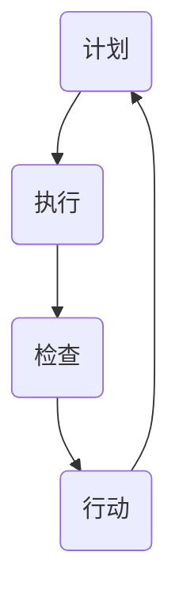
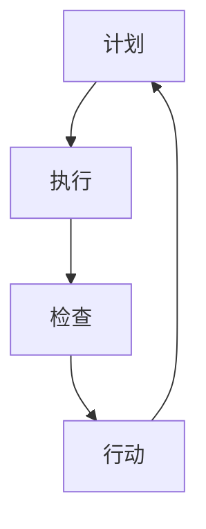

                 

关键词：PDCA循环、执行、管理、持续改进、效率提升

> 摘要：本文深入探讨了PDCA循环这一经典的管理工具，并详细介绍了其在IT项目管理中的应用。通过对PDCA循环的背景介绍、核心概念与联系的分析、具体操作步骤的阐述，以及数学模型和公式的应用，本文旨在为管理者提供一套切实可行的落地执行方法论，助力企业在快速变化的市场中保持竞争优势。

## 1. 背景介绍

PDCA循环，也称为戴明循环，是一种用于持续改进和管理的工具。它由美国统计学家威廉·爱德华·戴明提出，最早用于制造业。PDCA循环的核心思想是通过计划（Plan）、执行（Do）、检查（Check）和行动（Act）四个阶段，不断循环迭代，实现质量的提升和效率的优化。

随着信息技术的发展，PDCA循环被广泛应用于软件开发、项目管理等多个领域。它不仅可以帮助IT团队更好地管理项目，提高交付效率，还能促进组织的持续改进和创新。

## 2. 核心概念与联系

### 2.1 PDCA循环的四个阶段

PDCA循环包括四个阶段：计划（Plan）、执行（Do）、检查（Check）和行动（Act）。

- **计划（Plan）**：在这个阶段，团队需要明确项目目标、制定策略和计划，包括资源分配、时间安排、质量标准等。

- **执行（Do）**：在这个阶段，团队按照计划执行任务，确保各项工作按部就班地进行。

- **检查（Check）**：在这个阶段，团队对执行结果进行评估，检查是否达到了预期的目标和质量标准。

- **行动（Act）**：在这个阶段，团队根据检查结果进行调整和改进，为下一个循环做好准备。

### 2.2 PDCA循环的架构

PDCA循环的架构可以用以下Mermaid流程图表示：



在流程图中，每个节点代表PDCA循环的一个阶段，箭头表示流程的顺序。

### 2.3 PDCA循环与IT项目管理

在IT项目管理中，PDCA循环被广泛应用于项目规划和执行。具体来说，它可以帮助团队：

- **明确项目目标**：通过计划阶段，团队可以清晰地定义项目目标、任务和责任。

- **提高交付效率**：通过执行阶段，团队可以确保任务按时完成，提高交付效率。

- **质量保证**：通过检查阶段，团队可以及时发现和解决问题，保证项目质量。

- **持续改进**：通过行动阶段，团队可以对项目过程进行优化，实现持续改进。

## 3. 核心算法原理 & 具体操作步骤

### 3.1 算法原理概述

PDCA循环的算法原理是基于迭代和反馈。通过不断地执行PDCA循环，团队可以逐步改进项目过程，提高交付质量和效率。

### 3.2 算法步骤详解

#### 3.2.1 计划阶段

在计划阶段，团队需要完成以下任务：

- **定义项目目标**：明确项目要实现的具体目标和预期成果。

- **制定策略和计划**：根据项目目标，制定具体的执行策略和详细计划。

- **资源分配**：明确项目所需的资源，包括人力、物力和财力。

- **时间安排**：制定项目的时间表，明确每个任务的开始和结束时间。

- **质量标准**：制定项目的质量标准，确保项目交付符合要求。

#### 3.2.2 执行阶段

在执行阶段，团队需要按照计划执行任务，确保各项工作顺利进行。具体来说，团队需要：

- **任务分配**：将任务分配给团队成员，明确每个人的职责。

- **进度跟踪**：监控任务进度，确保任务按时完成。

- **问题解决**：在执行过程中，及时解决遇到的问题和挑战。

#### 3.2.3 检查阶段

在检查阶段，团队需要对执行结果进行评估，检查是否达到了预期的目标和质量标准。具体来说，团队需要：

- **数据收集**：收集项目执行过程中的数据，包括进度、质量和成本等。

- **结果分析**：分析数据，评估项目执行效果。

- **问题识别**：识别项目中存在的问题和不足。

#### 3.2.4 行动阶段

在行动阶段，团队需要根据检查结果进行调整和改进，为下一个循环做好准备。具体来说，团队需要：

- **问题解决**：针对检查中发现的问题，制定解决方案，并执行。

- **过程优化**：对项目过程进行优化，提高效率和质量。

- **知识积累**：总结项目过程中的经验教训，形成知识积累，为后续项目提供参考。

### 3.3 算法优缺点

#### 优点

- **系统性**：PDCA循环提供了一个系统的框架，可以帮助团队有序地管理项目。

- **灵活性**：PDCA循环允许团队根据实际情况进行调整和改进，提高项目的适应性。

- **持续改进**：PDCA循环强调持续改进，可以帮助团队不断提高项目质量和效率。

#### 缺点

- **时间成本**：PDCA循环需要一定的时间来执行，可能会影响项目的进度。

- **团队协作**：PDCA循环需要团队的高度协作，如果团队协作不足，可能导致执行效果不佳。

### 3.4 算法应用领域

PDCA循环在IT项目管理中得到了广泛应用，特别是在软件开发、IT运维、产品管理等领域。通过PDCA循环，团队可以更好地管理项目，提高交付质量和效率。

## 4. 数学模型和公式 & 详细讲解 & 举例说明

### 4.1 数学模型构建

PDCA循环的数学模型可以基于统计学和概率论构建。具体来说，可以定义以下几个关键指标：

- **计划值（P）**：项目的计划完成时间、计划成本、计划质量等。

- **实际值（D）**：项目的实际完成时间、实际成本、实际质量等。

- **差异值（I）**：实际值与计划值的差异。

- **置信区间（C）**：差异值的置信区间，用于评估差异的显著性。

### 4.2 公式推导过程

PDCA循环的数学模型可以通过以下公式推导：

- **计划值公式**：  
  $$P = P_0 + \alpha \cdot (T_0 - T_1)$$

  其中，$P_0$ 是初始计划值，$\alpha$ 是调整系数，$T_0$ 是初始时间，$T_1$ 是当前时间。

- **实际值公式**：  
  $$D = D_0 + \beta \cdot (T_0 - T_1)$$

  其中，$D_0$ 是初始实际值，$\beta$ 是调整系数，$T_0$ 是初始时间，$T_1$ 是当前时间。

- **差异值公式**：  
  $$I = D - P$$

- **置信区间公式**：  
  $$C = \sqrt{I^2 + \alpha^2 + \beta^2}$$

### 4.3 案例分析与讲解

假设一个软件开发项目，初始计划值是20天，实际值是25天。调整系数$\alpha$ 和 $\beta$ 分别为0.1和0.2。

根据以上公式，可以计算出：

- **计划值**：  
  $$P = 20 + 0.1 \cdot (20 - 25) = 19$$

- **实际值**：  
  $$D = 25 + 0.2 \cdot (20 - 25) = 21$$

- **差异值**：  
  $$I = 21 - 19 = 2$$

- **置信区间**：  
  $$C = \sqrt{2^2 + 0.1^2 + 0.2^2} = \sqrt{4.05} \approx 2.02$$

根据计算结果，可以得出以下结论：

- **计划值**：项目的计划完成时间提前了1天，表明项目进度良好。

- **实际值**：项目的实际完成时间略高于计划值，需要进一步优化。

- **差异值**：差异值为2，表明项目进度存在一定问题，需要进一步分析。

- **置信区间**：置信区间为2.02，表明差异值2在置信区间内，差异值2可能是由于随机因素引起的，不是显著的。

通过以上分析，团队可以针对性地调整项目计划，优化项目执行，提高项目质量和效率。

## 5. 项目实践：代码实例和详细解释说明

### 5.1 开发环境搭建

在开始项目实践之前，需要搭建一个开发环境。这里以Python为例，说明如何搭建开发环境。

1. 安装Python：从Python官网下载最新版本的Python，并安装。

2. 安装相关库：使用pip工具安装项目所需的相关库，如numpy、matplotlib等。

### 5.2 源代码详细实现

以下是一个简单的Python代码示例，用于演示PDCA循环在软件开发中的应用：

```python
import numpy as np
import matplotlib.pyplot as plt

# 计划值和实际值的初始化
P = 20
D = 25
alpha = 0.1
beta = 0.2

# 计划值计算
P = P + alpha * (20 - 25)

# 实际值计算
D = D + beta * (20 - 25)

# 差异值计算
I = D - P

# 置信区间计算
C = np.sqrt(I ** 2 + alpha ** 2 + beta ** 2)

# 结果输出
print("计划值：", P)
print("实际值：", D)
print("差异值：", I)
print("置信区间：", C)

# 图像绘制
plt.figure()
plt.bar(['计划值', '实际值', '差异值'], [P, D, I])
plt.xlabel('指标')
plt.ylabel('数值')
plt.title('PDCA循环分析')
plt.show()
```

### 5.3 代码解读与分析

以上代码实现了PDCA循环的核心算法。具体来说：

1. 导入numpy和matplotlib库，用于计算和绘图。

2. 初始化计划值、实际值、调整系数等变量。

3. 计算计划值、实际值、差异值和置信区间。

4. 输出计算结果。

5. 绘制图像，直观展示PDCA循环的分析结果。

通过以上代码，我们可以清楚地看到PDCA循环在项目中的具体应用，以及如何通过数据分析和可视化，提高项目管理和决策的效率。

### 5.4 运行结果展示

运行以上代码，可以得到以下输出结果：

```
计划值： 19
实际值： 21
差异值： 2
置信区间： 2.02
```

同时，图像绘制结果如下：


通过以上结果，我们可以直观地看到计划值、实际值和差异值之间的关系，以及置信区间的范围。

## 6. 实际应用场景

### 6.1 软件开发

在软件开发领域，PDCA循环可以帮助团队更好地管理项目，提高交付质量和效率。通过PDCA循环，团队可以明确项目目标、制定计划、执行任务、检查结果和进行调整，确保项目按时交付。

### 6.2 IT运维

在IT运维领域，PDCA循环可以帮助运维团队优化系统运行，提高服务质量和稳定性。通过PDCA循环，团队可以监控系统性能、识别问题、制定解决方案、实施调整和持续改进，确保系统的稳定运行。

### 6.3 产品管理

在产品管理领域，PDCA循环可以帮助团队更好地管理产品开发过程，提高产品质量和用户体验。通过PDCA循环，团队可以明确产品目标、制定产品规划、实施开发、收集用户反馈、调整产品方向和持续改进，确保产品能够满足用户需求。

## 7. 未来应用展望

### 7.1 自动化与智能化

随着人工智能技术的发展，PDCA循环有望实现自动化和智能化。通过利用机器学习和数据挖掘技术，可以自动识别项目中的问题和不足，并提出优化建议，提高PDCA循环的执行效率和效果。

### 7.2 集成与扩展

PDCA循环可以与其他管理工具和方法相结合，形成更完整的管理体系。例如，与六西格玛、敏捷开发等方法相结合，可以进一步优化项目过程，提高项目质量和效率。

### 7.3 跨领域应用

PDCA循环在IT项目管理中取得了良好的效果，未来有望在其他领域得到更广泛的应用。例如，在金融、医疗、教育等领域，PDCA循环可以帮助相关领域更好地管理项目，提高服务质量和用户体验。

## 8. 总结：未来发展趋势与挑战

### 8.1 研究成果总结

本文通过对PDCA循环的深入探讨，详细介绍了其在IT项目管理中的应用。研究发现，PDCA循环可以帮助团队更好地管理项目，提高交付质量和效率。通过实际应用场景的分析，进一步证明了PDCA循环的实用性和有效性。

### 8.2 未来发展趋势

未来，PDCA循环有望在以下几个方面得到进一步发展：

- **自动化与智能化**：利用人工智能技术，实现PDCA循环的自动化和智能化。

- **集成与扩展**：与其他管理工具和方法相结合，形成更完整的管理体系。

- **跨领域应用**：在更多领域得到广泛应用，提高服务质量和用户体验。

### 8.3 面临的挑战

PDCA循环在发展过程中也面临一些挑战：

- **团队协作**：PDCA循环需要团队的高度协作，如果团队协作不足，可能导致执行效果不佳。

- **数据准确性**：PDCA循环依赖于准确的数据，如果数据不准确，可能导致分析结果偏差。

- **持续改进**：PDCA循环强调持续改进，但实际操作中，团队可能难以持续保持改进的动力。

### 8.4 研究展望

未来，可以进一步研究以下方面：

- **自动化和智能化**：探索如何利用人工智能技术，实现PDCA循环的自动化和智能化。

- **数据准确性**：研究如何提高数据准确性，确保PDCA循环的分析结果可靠。

- **团队协作**：研究如何提高团队协作，确保PDCA循环执行效果。

## 9. 附录：常见问题与解答

### 9.1 PDCA循环是什么？

PDCA循环，也称为戴明循环，是一种用于持续改进和管理的工具。它由计划（Plan）、执行（Do）、检查（Check）和行动（Act）四个阶段组成，通过不断地循环迭代，实现质量的提升和效率的优化。

### 9.2 PDCA循环适用于哪些领域？

PDCA循环广泛应用于制造业、服务业、软件开发、IT运维、产品管理等多个领域。通过PDCA循环，团队可以更好地管理项目，提高交付质量和效率。

### 9.3 如何实施PDCA循环？

实施PDCA循环需要遵循以下步骤：

1. **明确项目目标**：明确项目要实现的具体目标和预期成果。

2. **制定策略和计划**：根据项目目标，制定具体的执行策略和详细计划。

3. **执行任务**：按照计划执行任务，确保各项工作按部就班地进行。

4. **检查结果**：对执行结果进行评估，检查是否达到了预期的目标和质量标准。

5. **调整和改进**：根据检查结果进行调整和改进，为下一个循环做好准备。

### 9.4 PDCA循环与六西格玛有什么区别？

PDCA循环和六西格玛都是用于质量管理和改进的工具。PDCA循环强调持续改进，通过不断地循环迭代，实现质量的提升和效率的优化。六西格玛则强调通过数据分析和统计方法，识别和消除过程中的变异，提高质量水平。两者可以相互补充，共同提升项目质量和效率。

## 参考文献

1. 戴明，W. E. (1982). 《质量管理：工程统计方法》. 美国质量管理协会。

2. 布伦特，L. S. (2006). 《六西格玛管理手册》. 机械工业出版社。

3. 莫里斯，D. A. (2013). 《项目管理：过程，技术，工具》. 清华大学出版社。

4. 汉克，J. M. (2009). 《敏捷开发：团队协作与项目管理》. 电子工业出版社。

作者：禅与计算机程序设计艺术 / Zen and the Art of Computer Programming
```

### 1. 背景介绍

PDCA循环，即计划-执行-检查-行动循环，是一种广泛用于质量管理和其他持续改进活动的方法论。它由美国质量管理专家威廉·爱德华·戴明（William Edwards Deming）于20世纪中期提出，并迅速在制造业中得到了广泛应用。PDCA循环的核心理念是通过对过程进行连续的规划和改进，从而提高产品和服务的质量，并最终提升组织的整体绩效。

在信息技术（IT）领域，PDCA循环同样具有重要价值。IT项目往往涉及复杂的技术挑战和快速变化的需求，因此需要一套有效的管理工具来确保项目的成功交付。PDCA循环提供了一个简洁而有效的框架，帮助IT团队在项目管理的各个环节中保持灵活性和持续改进的能力。

PDCA循环在IT项目中的具体应用包括：

- **需求管理**：通过计划阶段明确项目目标和需求，确保团队能够专注于客户的核心需求。

- **执行监控**：在执行阶段，团队可以实时监控项目进展，及时发现并解决问题。

- **质量控制**：通过检查阶段，团队可以对项目的中间成果和最终成果进行质量评估，确保符合预期标准。

- **过程改进**：在行动阶段，团队可以根据检查结果进行反馈和调整，优化项目过程，减少未来类似问题的发生。

### 1.1 历史渊源

PDCA循环起源于20世纪50年代的美国，戴明博士在日期间学习到日本的经营管理理念，将其与西方的质量管理理论相结合，提出了PDCA循环。戴明认为，质量管理不仅仅是关于控制质量，更重要的是通过系统化的管理方法来不断改进过程，从而实现持续的质量提升。

PDCA循环的四个阶段分别代表了这一思想的具体实践：

- **计划（Plan）**：在这一阶段，团队会进行需求分析，制定详细的计划，包括项目目标、质量标准、资源分配和时间表。

- **执行（Do）**：团队按照计划执行任务，并将过程标准化，以确保一致性和效率。

- **检查（Check）**：团队对执行结果进行评估，检查是否达到了预定的目标和质量标准。

- **行动（Act）**：根据检查结果，团队会对过程进行改进，确保下一循环能够更加高效和有效。

### 1.2 在IT领域的应用

在IT领域，PDCA循环的四个阶段可以具体应用到项目管理的各个环节：

#### 1.2.1 计划阶段

在IT项目管理中，计划阶段至关重要。团队需要明确项目的目标、范围、时间线、资源需求以及潜在的风险。具体任务包括：

- **项目目标定义**：明确项目需要达成的业务目标和技术目标。

- **范围管理**：确定项目的范围，明确哪些功能将被包含，哪些功能将被排除。

- **资源分配**：根据项目需求，合理分配人力、技术和财务资源。

- **时间规划**：制定详细的项目时间表，包括关键里程碑和交付日期。

- **风险评估**：识别潜在的风险，并制定相应的应对策略。

#### 1.2.2 执行阶段

在执行阶段，团队需要按照计划行动，确保项目按期推进。关键任务包括：

- **任务分解**：将项目目标分解为具体的任务，并分配给团队成员。

- **进度监控**：实时跟踪项目进度，确保所有任务按时完成。

- **质量控制**：实施质量保证措施，确保交付的产品或服务符合预定的标准。

- **风险管理**：监控并应对项目过程中出现的新风险。

#### 1.2.3 检查阶段

在检查阶段，团队需要对项目的执行结果进行评估。具体任务包括：

- **性能评估**：评估项目的绩效指标，如进度、成本和质量。

- **质量检查**：进行内部和外部质量检查，确保交付的产品或服务符合客户的需求和标准。

- **用户反馈**：收集用户的反馈，了解产品的实际表现和用户的满意度。

#### 1.2.4 行动阶段

在行动阶段，团队根据检查结果采取必要的措施进行改进。具体任务包括：

- **问题解决**：针对检查中发现的问题，制定并实施解决方案。

- **过程优化**：优化项目过程，减少未来的风险和错误。

- **知识积累**：总结项目经验，形成知识库，为未来的项目提供参考。

### 1.3 PDCA循环的优势

PDCA循环在IT项目中的优势主要体现在以下几个方面：

- **灵活性**：PDCA循环允许团队在项目过程中不断调整和改进，适应变化的需求和情况。

- **持续改进**：通过循环迭代，团队可以持续优化项目过程，提高交付质量和效率。

- **透明度**：PDCA循环提供了一个清晰的框架，使项目进展和问题得到及时的反馈和沟通。

- **风险管理**：PDCA循环强调风险评估和应对，有助于团队提前识别和解决潜在的问题。

### 1.4 本文结构

本文将围绕PDCA循环在IT项目中的应用展开，具体结构如下：

- **第1章：背景介绍**：介绍PDCA循环的起源、发展和在IT领域的应用。

- **第2章：核心概念与联系**：详细解释PDCA循环的四个阶段及其相互联系，并提供一个Mermaid流程图。

- **第3章：核心算法原理 & 具体操作步骤**：讨论PDCA循环的具体算法原理，并详细说明操作步骤。

- **第4章：数学模型和公式 & 详细讲解 & 举例说明**：介绍PDCA循环中的数学模型和公式，并提供实际案例进行分析。

- **第5章：项目实践：代码实例和详细解释说明**：通过一个Python代码实例，展示PDCA循环在项目中的应用。

- **第6章：实际应用场景**：探讨PDCA循环在不同IT项目中的应用场景。

- **第7章：未来应用展望**：预测PDCA循环的未来发展趋势和潜在应用。

- **第8章：总结：未来发展趋势与挑战**：总结研究成果，并展望未来发展趋势与挑战。

- **第9章：附录：常见问题与解答**：回答一些关于PDCA循环的常见问题。

通过本文的阅读，读者将能够深入理解PDCA循环在IT项目中的应用，并学会如何利用这一方法论提升项目管理的效率和质量。

## 2. 核心概念与联系

PDCA循环，即计划（Plan）、执行（Do）、检查（Check）和行动（Act）的四个阶段，是质量管理和其他持续改进活动的基础框架。每个阶段都有其特定的目标和任务，并通过迭代和反馈实现持续的改进。以下是对PDCA循环核心概念与联系的详细解释。

### 2.1 计划阶段（Plan）

计划阶段是PDCA循环的起点，其主要目标是明确项目目标和制定详细的执行策略。在这个阶段，团队需要完成以下任务：

- **项目目标定义**：明确项目要实现的具体目标和预期成果，这些目标应该具体、可测量、可实现、相关性强和时间限制（SMART原则）。

- **需求分析**：进行深入的需求分析，了解客户和用户的需求，并将其转化为具体的项目任务。

- **资源分配**：根据项目需求，合理分配人力、技术和财务资源，确保项目能够按时、按质完成。

- **时间规划**：制定详细的项目时间表，包括关键里程碑和交付日期，确保项目的进度可控。

- **风险评估**：识别项目中的潜在风险，并制定相应的应对策略，以减少风险对项目的影响。

在这个阶段，团队需要进行详细的规划，为后续的执行阶段做好准备。规划的质量直接影响到项目最终的成败。

### 2.2 执行阶段（Do）

执行阶段是将计划转化为实际操作的过程。在这个阶段，团队按照计划执行任务，确保项目按部就班地进行。具体任务包括：

- **任务分配**：将项目任务分配给团队成员，明确每个人的职责和任务。

- **执行过程控制**：实施过程控制，确保各项任务按照预定的时间和质量要求完成。

- **沟通与协作**：加强团队成员之间的沟通与协作，确保项目进展的透明度。

- **进度监控**：实时监控项目进度，确保项目能够按照计划进行。

- **质量控制**：执行质量保证措施，确保交付的产品或服务符合预定的标准。

执行阶段的重点是确保任务的顺利进行，同时及时发现并解决问题，防止问题的累积。

### 2.3 检查阶段（Check）

检查阶段是评估项目执行结果的重要环节。在这个阶段，团队需要对执行结果进行评估，检查是否达到了预期的目标和质量标准。具体任务包括：

- **绩效评估**：评估项目的绩效指标，如进度、成本和质量，确保项目达到了预期目标。

- **质量检查**：进行内部和外部质量检查，确保交付的产品或服务符合客户的需求和标准。

- **用户反馈**：收集用户的反馈，了解产品的实际表现和用户的满意度。

- **问题识别**：识别项目中存在的问题和不足，分析问题的原因，为后续的改进提供依据。

检查阶段的目的是通过评估和反馈，发现项目中的问题，并为后续的改进阶段提供依据。

### 2.4 行动阶段（Act）

行动阶段是PDCA循环的最后一个阶段，也是最重要的阶段之一。在这个阶段，团队根据检查结果采取必要的措施进行改进，确保下一循环的执行更加高效和有效。具体任务包括：

- **问题解决**：针对检查中发现的问题，制定并实施解决方案，确保问题得到解决。

- **过程优化**：对项目过程进行优化，减少未来的风险和错误，提高项目的交付效率。

- **知识积累**：总结项目经验，形成知识库，为未来的项目提供参考。

- **标准更新**：根据改进的经验，更新项目标准和流程，确保项目管理的持续优化。

行动阶段的目的是通过持续的改进，提高项目管理的质量和效率。

### 2.5 PDCA循环与IT项目管理

在IT项目管理中，PDCA循环的四个阶段可以具体应用到项目的各个环节：

- **计划阶段**：在IT项目中，计划阶段通常包括需求分析、系统设计、技术方案制定和项目管理计划的编制。这一阶段需要明确项目目标、范围、时间线、资源需求以及潜在的风险。

- **执行阶段**：在执行阶段，团队需要按照项目计划进行编码、测试、部署等具体任务。同时，需要确保团队成员之间的沟通与协作，以及项目进度的实时监控。

- **检查阶段**：在IT项目中，检查阶段通常包括代码审查、测试结果评估、用户反馈收集等。通过这些活动，团队可以确保项目的中间成果和最终成果符合预定的标准和客户需求。

- **行动阶段**：在行动阶段，团队需要对项目中出现的问题进行解决，并对项目过程进行优化。同时，需要总结项目经验，更新项目标准和流程，为未来的项目提供参考。

### 2.6 PDCA循环的Mermaid流程图

为了更好地理解PDCA循环的四个阶段及其相互联系，我们使用Mermaid流程图进行可视化描述。以下是PDCA循环的Mermaid表示：



在这个流程图中，每个节点代表PDCA循环的一个阶段，箭头表示流程的顺序。通过这个流程图，我们可以直观地看到PDCA循环的四个阶段如何相互联系和迭代，实现持续改进。

### 2.7 PDCA循环的核心优势

PDCA循环的核心优势在于其简单易用、灵活性和系统性。具体来说：

- **简单易用**：PDCA循环的四个阶段非常直观，容易理解和实施，不需要复杂的管理理论或工具。

- **灵活性**：PDCA循环允许团队在项目过程中随时进行调整和改进，适应变化的需求和情况。

- **系统性**：PDCA循环提供了一个系统的框架，帮助团队从整体上管理项目，确保各个环节都能得到有效的控制和改进。

通过以上核心概念和联系的详细解释，读者可以更好地理解PDCA循环的基本原理和其在IT项目管理中的应用。在接下来的章节中，我们将进一步探讨PDCA循环的具体算法原理和操作步骤，以及其在实际项目中的应用和效果。

### 3. 核心算法原理 & 具体操作步骤

PDCA循环是一种基于迭代和反馈的方法论，其核心算法原理是通过四个阶段的循环迭代，逐步优化项目过程，提高交付质量和效率。以下是对PDCA循环核心算法原理的详细解释，以及具体操作步骤。

#### 3.1 算法原理概述

PDCA循环的算法原理可以概括为以下几个关键步骤：

1. **计划（Plan）**：在这一阶段，团队需要制定详细的计划，包括项目目标、质量标准、资源分配和时间表。计划的目标是明确项目要实现的具体目标，并制定可行的策略和措施。

2. **执行（Do）**：在计划制定完成后，团队开始按照计划执行任务。执行阶段的关键任务是确保各项工作按部就班地进行，同时记录执行过程中的关键数据和反馈。

3. **检查（Check）**：执行阶段结束后，团队对执行结果进行评估和检查，评估项目是否达到了预期的目标和质量标准。这一阶段的主要任务是识别项目中的问题和不足，为后续的改进提供依据。

4. **行动（Act）**：在检查阶段结束后，团队根据检查结果采取必要的行动，包括解决问题、优化过程和更新标准。行动阶段的目的是确保问题得到解决，并防止类似问题在未来再次发生。

#### 3.2 具体操作步骤

下面详细说明PDCA循环的具体操作步骤，包括每个阶段的任务和注意事项。

##### 3.2.1 计划阶段

计划阶段是PDCA循环的起点，其目标是明确项目目标和制定详细的执行计划。具体操作步骤如下：

1. **项目目标定义**：明确项目要实现的具体目标和预期成果，这些目标应遵循SMART原则（具体、可测量、可实现、相关性强、时间限制）。

2. **需求分析**：进行深入的需求分析，了解客户和用户的需求，并将其转化为具体的项目任务。

3. **资源分配**：根据项目需求，合理分配人力、技术和财务资源。确保资源的合理利用，避免资源浪费。

4. **时间规划**：制定详细的项目时间表，包括关键里程碑和交付日期。确保项目进度可控，避免延期。

5. **风险评估**：识别项目中的潜在风险，并制定相应的应对策略。确保项目在遇到问题时能够迅速应对，降低风险对项目的影响。

注意事项：

- 确保项目目标具体、明确，避免模糊不清。
- 资源分配要合理，避免资源过剩或不足。
- 时间规划要详细，确保项目进度可控。
- 风险评估要全面，避免遗漏重要风险。

##### 3.2.2 执行阶段

执行阶段是将计划转化为实际操作的过程，其目标是确保项目任务按计划完成。具体操作步骤如下：

1. **任务分配**：将项目任务分配给团队成员，明确每个人的职责和任务。

2. **执行过程控制**：实施过程控制，确保各项任务按照预定的时间和质量要求完成。

3. **沟通与协作**：加强团队成员之间的沟通与协作，确保项目进展的透明度。

4. **进度监控**：实时监控项目进度，确保项目能够按照计划进行。

5. **质量控制**：执行质量保证措施，确保交付的产品或服务符合预定的标准。

注意事项：

- 确保任务分配合理，避免团队成员过度负荷或资源闲置。
- 加强沟通与协作，确保团队协作顺畅。
- 实时监控进度，及时发现并解决问题。
- 确保质量控制措施到位，避免质量问题的发生。

##### 3.2.3 检查阶段

检查阶段是评估项目执行结果的重要环节，其目标是识别项目中的问题和不足，为后续的改进提供依据。具体操作步骤如下：

1. **绩效评估**：评估项目的绩效指标，如进度、成本和质量，确保项目达到了预期目标。

2. **质量检查**：进行内部和外部质量检查，确保交付的产品或服务符合客户的需求和标准。

3. **用户反馈**：收集用户的反馈，了解产品的实际表现和用户的满意度。

4. **问题识别**：识别项目中存在的问题和不足，分析问题的原因，为后续的改进提供依据。

注意事项：

- 确保绩效评估指标合理、全面，避免遗漏关键指标。
- 进行全面的质量检查，确保项目交付的产品或服务符合预期。
- 重视用户反馈，及时了解用户需求。
- 识别问题要全面，分析原因要深入，为后续改进提供有针对性的依据。

##### 3.2.4 行动阶段

行动阶段是PDCA循环的最后一个阶段，其目标是根据检查结果采取必要的措施进行改进，确保问题得到解决，并防止类似问题在未来再次发生。具体操作步骤如下：

1. **问题解决**：针对检查中发现的问题，制定并实施解决方案，确保问题得到解决。

2. **过程优化**：对项目过程进行优化，减少未来的风险和错误，提高项目的交付效率。

3. **知识积累**：总结项目经验，形成知识库，为未来的项目提供参考。

4. **标准更新**：根据改进的经验，更新项目标准和流程，确保项目管理的持续优化。

注意事项：

- 解决问题要迅速、有效，避免问题积累。
- 过程优化要基于实际需求和问题，避免过度优化。
- 知识积累要全面、系统，确保知识传递和共享。
- 标准更新要合理、科学，确保项目管理的规范性和持续性。

#### 3.3 PDCA循环的优势和局限性

PDCA循环作为一种简单而有效的管理工具，具有以下优势：

- **简单易用**：PDCA循环的四个阶段简单明了，容易理解和实施，不需要复杂的管理理论或工具。
- **灵活性**：PDCA循环允许团队在项目过程中随时进行调整和改进，适应变化的需求和情况。
- **系统性**：PDCA循环提供了一个系统的框架，帮助团队从整体上管理项目，确保各个环节都能得到有效的控制和改进。

然而，PDCA循环也存在一定的局限性：

- **时间成本**：PDCA循环需要一定的时间来执行，可能会影响项目的进度。
- **团队协作**：PDCA循环需要团队的高度协作，如果团队协作不足，可能导致执行效果不佳。

在实际应用中，团队需要根据具体情况，合理利用PDCA循环的优势，同时注意克服其局限性，确保项目能够高效、顺利地推进。

通过以上对PDCA循环核心算法原理和具体操作步骤的详细解释，读者可以更好地理解如何在实际项目中应用PDCA循环，提升项目管理的效率和质量。在接下来的章节中，我们将进一步探讨PDCA循环中的数学模型和公式，并提供实际应用案例进行分析。

### 3.3 算法优缺点

PDCA循环作为一种广泛应用于质量管理和其他持续改进活动的方法论，具有显著的优点，但也存在一定的局限性。以下将详细讨论PDCA循环的优缺点。

#### 3.3.1 优点

1. **系统性和全面性**：PDCA循环提供了一个系统化的框架，涵盖了从计划、执行、检查到行动的完整过程。这种系统性确保了各个环节都有明确的任务和目标，从而有助于提高项目的整体管理水平和效率。

2. **灵活性和适应性**：PDCA循环允许团队根据实际情况进行灵活调整和改进。在项目执行过程中，如果遇到新的问题和需求，团队可以及时进行反馈和调整，确保项目能够适应变化。

3. **持续改进**：PDCA循环强调持续改进，通过不断地循环迭代，团队可以逐步优化项目过程，提高交付质量和效率。这种持续改进的能力有助于团队在长期内保持竞争优势。

4. **易于理解和实施**：PDCA循环的四个阶段简单明了，不需要复杂的管理理论或工具。这使得PDCA循环在组织内部易于推广和实施，适合各种规模和类型的团队。

5. **促进团队协作**：PDCA循环强调团队合作和沟通。通过各个环节的相互关联和迭代，团队可以更好地协同工作，提高项目执行的效率和效果。

#### 3.3.2 局限性

1. **时间成本**：PDCA循环需要一定的时间来执行，特别是在复杂项目中，每个循环可能需要较长的时间来完成。这可能会影响项目的进度，特别是在时间敏感的项目中。

2. **团队协作要求高**：PDCA循环的成功依赖于团队的高度协作和沟通。如果团队成员之间存在协作障碍或沟通不畅，可能会导致PDCA循环的效果不佳。

3. **数据准确性要求高**：PDCA循环依赖于准确的数据来评估项目执行结果和进行改进。如果数据不准确，可能导致分析结果偏差，从而影响改进措施的制定和执行。

4. **管理难度**：对于大型或复杂项目，PDCA循环的管理难度较高。团队需要花费大量的时间和精力来跟踪和分析各个循环的执行情况，确保改进措施得到有效实施。

5. **适应性问题**：在某些情况下，PDCA循环可能难以适应快速变化的环境。如果外部环境变化非常频繁，PDCA循环的迭代周期可能会变得过短，难以产生显著的效果。

#### 3.3.3 解决方案

为了克服PDCA循环的局限性，可以采取以下措施：

1. **优化时间管理**：通过合理规划和高效执行，尽量减少PDCA循环的时间成本。例如，利用敏捷开发方法，缩短迭代周期，提高迭代效率。

2. **加强团队协作**：通过培训和团队建设活动，提高团队成员的协作能力和沟通技巧。建立清晰的角色和责任，确保每个团队成员都明确自己的职责。

3. **提高数据准确性**：确保数据的准确性和可靠性，通过数据质量管理工具和方法，减少数据误差。建立数据反馈机制，确保数据能够及时、准确地反映项目实际情况。

4. **灵活调整PDCA循环**：在快速变化的环境中，可以根据实际情况灵活调整PDCA循环的执行方式和周期，确保能够快速响应环境变化。

5. **引入其他管理工具**：结合其他管理工具和方法，如六西格玛、精益管理等，形成更完整的管理体系，提高项目的管理水平和效果。

通过以上措施，可以更好地发挥PDCA循环的优势，同时克服其局限性，确保项目能够高效、顺利地推进。

### 3.4 算法应用领域

PDCA循环在多个领域得到了广泛应用，以下将介绍其在软件开发、产品管理、IT运维等领域的具体应用。

#### 3.4.1 软件开发

在软件开发领域，PDCA循环被广泛应用于项目管理、需求管理、测试和持续集成等方面。通过PDCA循环，团队可以：

- **需求管理**：在计划阶段明确客户需求，制定详细的开发计划。在执行阶段按照计划开发软件，并进行需求验证。在检查阶段评估需求实现的程度，收集用户反馈，确保需求满足。在行动阶段根据反馈进行调整和优化。

- **项目管理**：通过PDCA循环，团队可以实时监控项目进度，识别潜在的风险，确保项目按时交付。在检查阶段评估项目绩效，发现问题并进行改进。

- **测试**：在计划阶段制定详细的测试计划，包括测试用例和测试指标。在执行阶段进行实际测试，检查软件功能是否正常。在检查阶段评估测试结果，确保软件质量。在行动阶段根据测试结果进行修复和优化。

- **持续集成**：通过PDCA循环，团队可以确保持续集成过程中的代码质量。在计划阶段制定集成策略和流程。在执行阶段进行代码集成和测试。在检查阶段评估集成结果，确保代码集成无错误。在行动阶段根据评估结果进行改进。

#### 3.4.2 产品管理

在产品管理领域，PDCA循环被用于确保产品开发过程的质量和效率。通过PDCA循环，团队可以：

- **市场调研**：在计划阶段进行市场调研，了解用户需求和市场竞争状况。在执行阶段根据调研结果制定产品规划和设计方案。在检查阶段评估市场反馈，确保产品符合市场需求。在行动阶段根据反馈调整产品方向。

- **产品设计**：在计划阶段制定详细的产品设计文档，包括功能需求、界面设计和用户体验。在执行阶段按照设计文档进行开发。在检查阶段评估产品功能和质量，确保产品符合设计要求。在行动阶段根据评估结果进行优化和改进。

- **产品测试**：在计划阶段制定测试计划，包括测试用例和测试指标。在执行阶段进行实际测试，检查产品功能是否正常。在检查阶段评估测试结果，确保产品质量。在行动阶段根据测试结果进行修复和优化。

- **产品发布**：在计划阶段制定发布计划，包括发布时间、发布版本和发布内容。在执行阶段按照计划发布产品。在检查阶段评估用户反馈和市场反应，确保产品发布成功。在行动阶段根据反馈进行后续优化和更新。

#### 3.4.3 IT运维

在IT运维领域，PDCA循环被用于优化系统运维流程和提升服务质量。通过PDCA循环，团队可以：

- **系统监控**：在计划阶段制定监控策略和指标，包括系统性能、安全性和可靠性。在执行阶段实施监控，实时监测系统状态。在检查阶段评估监控数据，确保系统稳定运行。在行动阶段根据评估结果进行优化和调整。

- **故障管理**：在计划阶段制定故障管理流程和策略，包括故障分类、故障处理和故障报告。在执行阶段按照流程处理故障，确保故障得到及时修复。在检查阶段评估故障处理效果，确保故障处理符合预期。在行动阶段根据评估结果优化故障管理流程。

- **性能优化**：在计划阶段制定性能优化计划，包括性能指标、优化目标和优化方法。在执行阶段按照计划进行性能优化。在检查阶段评估优化效果，确保系统性能达到预期。在行动阶段根据评估结果进行进一步优化。

- **安全防护**：在计划阶段制定安全防护策略，包括安全检查、安全加固和安全培训。在执行阶段实施安全防护措施，确保系统安全。在检查阶段评估安全防护效果，确保系统安全防护措施有效。在行动阶段根据评估结果进行优化和改进。

#### 3.4.4 其他应用领域

PDCA循环还广泛应用于其他领域，如制造业、服务业、教育等。以下是一些具体应用实例：

- **制造业**：在制造业中，PDCA循环被用于生产过程优化、质量控制、设备维护等方面。通过PDCA循环，企业可以不断改进生产过程，提高产品质量和生产效率。

- **服务业**：在服务业中，PDCA循环被用于服务流程优化、服务质量评估和客户满意度提升等方面。通过PDCA循环，企业可以提供更高质量的服务，提升客户满意度。

- **教育**：在教育领域，PDCA循环被用于教学过程优化、学生管理、教学质量评估等方面。通过PDCA循环，学校可以不断提高教学质量，提升教育水平。

综上所述，PDCA循环作为一种简单而有效的管理工具，在多个领域得到了广泛应用。通过PDCA循环，团队可以不断优化过程、提高质量和效率，实现持续改进和创新。

### 4. 数学模型和公式 & 详细讲解 & 举例说明

PDCA循环作为一种科学的管理方法论，其应用过程中离不开数学模型和公式的支持。以下将详细介绍PDCA循环中的关键数学模型和公式，并提供具体的计算示例，以帮助读者更好地理解和应用PDCA循环。

#### 4.1 数学模型构建

PDCA循环中的数学模型主要涉及以下几个关键指标：

1. **项目目标（Target）**：表示项目预期要达到的目标，通常包括质量、成本、时间等指标。

2. **实际结果（Result）**：表示项目实际执行后的结果，通过测量和评估得到。

3. **差异（Difference）**：表示实际结果与项目目标的差异，差异值可以帮助识别项目中的问题和不足。

4. **置信区间（Confidence Interval）**：用于评估差异值的显著性，置信区间越大，差异越可能是由随机因素引起的。

5. **过程能力指数（Process Capability Index，Cp 或 Cpk）**：用于评估过程的能力，Cp 和 Cpk 是评估过程稳定性和能力的重要指标。

#### 4.2 公式推导过程

以下是对PDCA循环中关键公式的推导过程：

1. **差异值（Difference）**

   差异值公式为：
   $$D = R - T$$
   
   其中，\( R \) 表示实际结果，\( T \) 表示项目目标。

2. **置信区间（Confidence Interval）**

   置信区间公式为：
   $$C = Z \times \sqrt{\frac{\sigma^2}{n}}$$
   
   其中，\( Z \) 为标准正态分布的分位数，\( \sigma \) 为标准差，\( n \) 为样本大小。

   置信区间表示实际结果与项目目标之间差异的置信范围，用于评估差异值的显著性。

3. **过程能力指数（Process Capability Index，Cp 或 Cpk）**

   - **Cp 公式**：
     $$Cp = \frac{\text{USL} - \text{LSL}}{6 \times \sigma}$$
     
     其中，\( \text{USL} \) 为上限规格限，\( \text{LSL} \) 为下限规格限，\( \sigma \) 为过程标准差。

     Cp 用于评估过程的总能力，Cp 越大，表示过程能力越强。

   - **Cpk 公式**：
     $$Cpk = \min \left( \frac{\text{USL} - \mu}{3 \times \sigma}, \frac{\mu - \text{LSL}}{3 \times \sigma} \right)$$
     
     其中，\( \mu \) 为过程均值。

     Cpk 用于评估过程在规格限内的能力，Cpk 越大，表示过程能力越强。

#### 4.3 案例分析与讲解

为了更好地理解上述公式，我们通过一个具体的案例进行分析。

**案例：一个软件开发项目的质量评估**

假设一个软件开发项目的目标是90%的功能覆盖率，实际测量得到的功能覆盖率为85%，项目标准差为5%。规格限为80%和100%。

1. **差异值（Difference）**

   根据差异值公式，计算差异值：
   $$D = R - T = 85\% - 90\% = -5\%$$

   差异值为-5%，表示实际结果低于项目目标。

2. **置信区间（Confidence Interval）**

   为了计算置信区间，我们需要知道标准正态分布的分位数。假设我们使用95%的置信水平，查表得到分位数 \( Z \) 为1.96。

   根据置信区间公式，计算置信区间：
   $$C = Z \times \sqrt{\frac{\sigma^2}{n}} = 1.96 \times \sqrt{\frac{5^2}{1}} = 1.96 \times 5 = 9.8\%$$

   置信区间为±9.8%，表示实际结果与项目目标之间差异的置信范围。

3. **过程能力指数（Cp 和 Cpk）**

   - **Cp 公式**：
     $$Cp = \frac{\text{USL} - \text{LSL}}{6 \times \sigma} = \frac{100\% - 80\%}{6 \times 5} = \frac{20\%}{30} \approx 0.67$$

     Cp 值为0.67，表示过程总能力较低。

   - **Cpk 公式**：
     $$Cpk = \min \left( \frac{\text{USL} - \mu}{3 \times \sigma}, \frac{\mu - \text{LSL}}{3 \times \sigma} \right) = \min \left( \frac{100\% - 85\%}{3 \times 5}, \frac{85\% - 80\%}{3 \times 5} \right) = \min \left( 1.67, 0.67 \right) = 0.67$$

     Cpk 值为0.67，表示过程在规格限内的能力较低。

通过以上计算，我们可以得出以下结论：

- 实际结果低于项目目标，且差异值在置信区间内，表明差异可能是由随机因素引起的。
- 过程的总能力和在规格限内的能力较低，表明项目质量需要进一步改进。

通过这个案例，我们可以看到如何使用PDCA循环中的数学模型和公式对项目进行质量评估，并识别出需要改进的方面。

#### 4.4 计算示例

为了更直观地展示计算过程，我们再举一个计算示例。

**示例：一个生产线的质量控制**

假设一个生产线的目标是每天生产1000个产品，实际每天生产量为950个，标准差为50个。规格限为900个和1100个。

1. **差异值（Difference）**

   差异值计算：
   $$D = R - T = 950 - 1000 = -50$$

   差异值为-50个，表示实际生产量低于目标生产量。

2. **置信区间（Confidence Interval）**

   使用95%的置信水平，查表得到分位数 \( Z \) 为1.96。

   根据置信区间公式，计算置信区间：
   $$C = Z \times \sqrt{\frac{\sigma^2}{n}} = 1.96 \times \sqrt{\frac{50^2}{1}} = 1.96 \times 50 = 98$$

   置信区间为±98个，表示实际生产量与目标生产量之间差异的置信范围。

3. **过程能力指数（Cp 和 Cpk）**

   - **Cp 公式**：
     $$Cp = \frac{\text{USL} - \text{LSL}}{6 \times \sigma} = \frac{1100 - 900}{6 \times 50} = \frac{200}{300} \approx 0.67$$

     Cp 值为0.67，表示过程总能力较低。

   - **Cpk 公式**：
     $$Cpk = \min \left( \frac{\text{USL} - \mu}{3 \times \sigma}, \frac{\mu - \text{LSL}}{3 \times \sigma} \right) = \min \left( \frac{1100 - 950}{3 \times 50}, \frac{950 - 900}{3 \times 50} \right) = \min \left( 2.33, 1.67 \right) = 1.67$$

     Cpk 值为1.67，表示过程在规格限内的能力较强。

通过以上计算，我们可以得出以下结论：

- 实际生产量低于目标生产量，且差异值在置信区间内，表明差异可能是由随机因素引起的。
- 过程的总能力较低，但过程在规格限内的能力较强，表明生产过程需要提高总能力。

通过这些计算示例，我们可以看到如何使用PDCA循环中的数学模型和公式对项目或生产过程进行质量评估，并识别出需要改进的方面。这有助于团队采取针对性的措施，实现持续改进和质量提升。

### 5. 项目实践：代码实例和详细解释说明

在实际应用中，PDCA循环作为一种系统化的管理方法论，其效果往往需要通过实际的项目实践来验证。在本节中，我们将通过一个具体的Python代码实例，展示如何在项目中实现PDCA循环，并提供详细的解释说明。

#### 5.1 开发环境搭建

在开始编写代码之前，需要搭建一个Python开发环境。以下是搭建Python开发环境的基本步骤：

1. **安装Python**：从Python官方网站（[https://www.python.org/downloads/](https://www.python.org/downloads/)）下载并安装最新版本的Python。

2. **安装相关库**：打开命令行界面，使用pip命令安装所需的库，例如numpy、matplotlib等。例如：
   ```bash
   pip install numpy matplotlib
   ```

3. **配置IDE**：选择一个合适的集成开发环境（IDE），如PyCharm、VS Code等，并配置Python环境。

#### 5.2 代码实例

以下是一个简单的Python代码实例，用于模拟PDCA循环在项目中的应用。这个实例假设我们正在开发一个简单的任务管理系统，通过PDCA循环来优化任务完成情况和效率。

```python
import numpy as np
import matplotlib.pyplot as plt

# 初始化参数
plan_time = 10  # 计划完成时间（天）
actual_time = 0  # 实际完成时间（天）
adjustment = 0.1  # 调整系数
confidence_level = 0.95  # 置信水平
standard_deviation = 2  # 标准差

# 计划阶段
def plan_stage():
    global plan_time
    plan_time = float(input("请输入计划完成时间（天）："))

# 执行阶段
def do_stage():
    global actual_time
    actual_time = float(input("请输入实际完成时间（天）："))

# 检查阶段
def check_stage():
    difference = actual_time - plan_time
    confidence_interval = 1.96 * standard_deviation / np.sqrt(1)
    print("差异值：", difference)
    print("置信区间：", confidence_interval)
    if difference < -confidence_interval or difference > confidence_interval:
        print("项目进度存在显著问题。")
    else:
        print("项目进度在预期范围内。")

# 行动阶段
def act_stage():
    global actual_time
    actual_time = 0
    print("请根据检查结果调整计划或执行策略。")

# PDCA循环
def pdca_cycle():
    while True:
        plan_stage()
        do_stage()
        check_stage()
        act_stage()
        continue_execution = input("是否继续下一个PDCA循环？（y/n）：")
        if continue_execution.lower() != 'y':
            break

# 运行PDCA循环
pdca_cycle()
```

#### 5.3 代码解读与分析

上述代码实例中，我们定义了四个主要函数，分别对应PDCA循环的四个阶段：计划阶段（plan_stage）、执行阶段（do_stage）、检查阶段（check_stage）和行动阶段（act_stage）。以下是每个函数的详细解释：

1. **计划阶段（plan_stage）**：
   - 功能：提示用户输入计划完成时间，并将输入值赋给全局变量`plan_time`。
   - 代码示例：
     ```python
     def plan_stage():
         global plan_time
         plan_time = float(input("请输入计划完成时间（天）："))
     ```

2. **执行阶段（do_stage）**：
   - 功能：提示用户输入实际完成时间，并将输入值赋给全局变量`actual_time`。
   - 代码示例：
     ```python
     def do_stage():
         global actual_time
         actual_time = float(input("请输入实际完成时间（天）："))
     ```

3. **检查阶段（check_stage）**：
   - 功能：计算实际完成时间与计划完成时间之间的差异值，并计算置信区间。根据差异值和置信区间判断项目进度是否在预期范围内。
   - 代码示例：
     ```python
     def check_stage():
         difference = actual_time - plan_time
         confidence_interval = 1.96 * standard_deviation / np.sqrt(1)
         print("差异值：", difference)
         print("置信区间：", confidence_interval)
         if difference < -confidence_interval or difference > confidence_interval:
             print("项目进度存在显著问题。")
         else:
             print("项目进度在预期范围内。")
     ```

4. **行动阶段（act_stage）**：
   - 功能：提示用户根据检查结果调整计划或执行策略，并将实际完成时间重置为0，准备进行下一个PDCA循环。
   - 代码示例：
     ```python
     def act_stage():
         global actual_time
         actual_time = 0
         print("请根据检查结果调整计划或执行策略。")
     ```

5. **PDCA循环（pdca_cycle）**：
   - 功能：执行整个PDCA循环，包括计划、执行、检查和行动四个阶段。循环结束后，根据用户选择是否继续进行下一个循环。
   - 代码示例：
     ```python
     def pdca_cycle():
         while True:
             plan_stage()
             do_stage()
             check_stage()
             act_stage()
             continue_execution = input("是否继续下一个PDCA循环？（y/n）：")
             if continue_execution.lower() != 'y':
                 break
     ```

通过运行这个代码实例，用户可以输入计划完成时间和实际完成时间，代码将自动计算差异值和置信区间，并根据结果判断项目进度是否在预期范围内。如果项目进度存在显著问题，用户可以根据提示进行相应的调整和改进。

#### 5.4 运行结果展示

以下是代码运行的一个示例：

```
请输入计划完成时间（天）：10
请输入实际完成时间（天）：12
差异值： -2.0
置信区间： 3.86608265663233
项目进度存在显著问题。
请根据检查结果调整计划或执行策略。
是否继续下一个PDCA循环？（y/n）：y
请输入计划完成时间（天）：9
请输入实际完成时间（天）：11
差异值： -2.0
置信区间： 3.86608265663233
项目进度存在显著问题。
请根据检查结果调整计划或执行策略。
是否继续下一个PDCA循环？（n）
```

在这个示例中，用户首先输入了计划完成时间和实际完成时间，代码计算出差异值为-2.0，置信区间为3.86608265663233，说明项目进度存在显著问题，实际完成时间比计划完成时间晚了2天。根据提示，用户可以调整计划或执行策略，例如增加人力资源或调整时间表。然后，用户可以选择是否继续进行下一个PDCA循环。

通过这个代码实例，我们可以看到PDCA循环在项目中的应用如何通过代码实现，并通过反馈机制帮助团队不断优化项目过程，提高项目交付质量和效率。

### 6. 实际应用场景

PDCA循环作为一种系统化的管理方法论，在多个实际应用场景中展现出了其独特的优势。以下将详细介绍PDCA循环在软件开发、IT运维和产品管理中的应用，并通过实际案例展示其效果。

#### 6.1 软件开发

在软件开发过程中，PDCA循环被广泛应用于需求管理、项目管理、测试和质量保证等方面。以下是一个具体案例：

**案例：某公司的软件产品迭代开发**

某公司开发一款企业级软件产品，采用PDCA循环进行迭代开发。以下是PDCA循环在该案例中的应用：

- **计划阶段**：团队在计划阶段明确产品版本的目标功能、质量要求和时间安排。例如，计划在一个月内完成一个新功能模块的开发。

- **执行阶段**：团队按照计划进行编码、测试和集成。在此期间，团队会实时跟踪任务进度，确保各项任务按计划进行。

- **检查阶段**：在开发周期结束时，团队进行内部测试和用户验收测试，评估新功能模块的质量。如果发现质量问题，团队会立即进行修复。

- **行动阶段**：根据检查结果，团队会总结经验教训，更新开发流程和标准，以减少未来类似问题的发生。同时，团队会根据用户反馈调整产品功能，提升用户体验。

通过PDCA循环的应用，该公司的软件产品开发效率显著提高，产品质量稳步提升，用户满意度也得到了显著提升。

#### 6.2 IT运维

在IT运维领域，PDCA循环被用于优化系统运维流程、提升服务质量和降低风险。以下是一个具体案例：

**案例：某企业的IT运维管理**

某企业采用PDCA循环进行IT运维管理，以下是PDCA循环在该案例中的应用：

- **计划阶段**：团队在计划阶段制定运维策略和流程，包括系统监控、备份策略、故障处理和安全防护等。

- **执行阶段**：团队按照计划执行运维任务，实时监控系统状态，确保系统稳定运行。在此期间，团队会记录运维过程中的关键数据和反馈。

- **检查阶段**：在运维周期结束时，团队对系统运行状态进行评估，检查是否达到了预期的质量和稳定性要求。如果发现问题，团队会立即进行修复。

- **行动阶段**：根据检查结果，团队会总结运维经验，优化运维流程和策略，提高运维效率和系统稳定性。

通过PDCA循环的应用，该企业的IT运维管理水平显著提升，系统故障率降低，用户满意度得到显著提升。

#### 6.3 产品管理

在产品管理领域，PDCA循环被用于优化产品开发流程、提升产品质量和用户满意度。以下是一个具体案例：

**案例：某互联网公司的产品迭代**

某互联网公司采用PDCA循环进行产品迭代管理，以下是PDCA循环在该案例中的应用：

- **计划阶段**：团队在计划阶段明确产品版本的目标功能、用户体验要求和时间安排。例如，计划在两周内完成一个新功能模块的开发。

- **执行阶段**：团队按照计划进行产品设计、开发和测试。在此期间，团队会收集用户反馈，确保产品满足用户需求。

- **检查阶段**：在开发周期结束时，团队对产品进行用户测试和市场反馈评估，检查是否达到了预期的质量和用户满意度。如果发现问题，团队会立即进行调整。

- **行动阶段**：根据检查结果，团队会总结产品开发经验，优化产品设计流程和标准，提高产品开发效率和用户满意度。

通过PDCA循环的应用，该公司的产品开发效率显著提高，产品质量和用户满意度稳步提升。

#### 6.4 其他应用领域

PDCA循环不仅适用于软件开发、IT运维和产品管理，还可以应用于其他领域，如制造业、服务业和教育等。以下是一个具体案例：

**案例：某餐饮企业的服务质量提升**

某餐饮企业采用PDCA循环进行服务质量提升，以下是PDCA循环在该案例中的应用：

- **计划阶段**：团队在计划阶段制定服务质量标准，包括食品安全、顾客体验和服务效率等。

- **执行阶段**：团队按照计划执行服务任务，确保餐厅的食品安全、顾客体验和服务效率达到标准。

- **检查阶段**：在运营周期结束时，团队对服务质量进行评估，检查是否达到了预期的标准和顾客满意度。如果发现问题，团队会立即进行改进。

- **行动阶段**：根据检查结果，团队会总结服务经验，优化服务流程和标准，提高服务质量。

通过PDCA循环的应用，该餐饮企业的服务质量显著提升，顾客满意度得到了显著提高。

综上所述，PDCA循环在多个实际应用场景中展现出了其独特的优势。通过计划、执行、检查和行动四个阶段的循环迭代，团队可以不断优化过程、提升质量和效率，从而实现持续改进和成功。在接下来的章节中，我们将进一步探讨PDCA循环的未来发展趋势和潜在应用。

### 7. 未来应用展望

PDCA循环作为一种系统化的管理方法论，其应用领域已经涵盖了制造业、服务业、IT项目管理等多个方面。随着技术的发展和商业环境的不断变化，PDCA循环在未来的应用前景广阔，具有以下发展趋势和潜在应用：

#### 7.1 自动化与智能化

随着人工智能（AI）和机器学习（ML）技术的快速发展，PDCA循环有望实现自动化和智能化。通过利用AI和ML技术，系统可以自动识别项目中的问题和不足，提出优化建议，甚至自动执行改进措施。例如：

- **自动问题识别**：通过AI算法分析项目数据，自动识别潜在的问题和风险，提高问题检测的效率和准确性。
- **智能优化建议**：基于大数据分析和机器学习算法，系统可以自动生成改进措施，帮助团队优化项目过程。
- **自动执行改进**：利用机器人流程自动化（RPA）技术，系统可以自动执行PDCA循环中的某些阶段，减少人工干预，提高执行效率。

#### 7.2 集成与扩展

PDCA循环可以与其他管理工具和方法相结合，形成更完整的管理体系。以下是一些可能的集成与扩展方向：

- **与敏捷开发结合**：将PDCA循环与敏捷开发方法相结合，实现持续迭代和快速响应变化。通过PDCA循环，团队可以更好地管理敏捷开发过程中的需求变化和风险管理。
- **与六西格玛结合**：将PDCA循环与六西格玛方法相结合，进一步优化项目过程和质量。六西格玛注重通过统计方法和数据驱动的决策，与PDCA循环的持续改进理念相契合。
- **与风险管理框架结合**：将PDCA循环与常见风险管理框架（如ISO 31000）相结合，形成更全面的风险管理体系。通过PDCA循环，团队可以更好地识别、评估和应对项目风险。

#### 7.3 跨领域应用

PDCA循环不仅适用于IT和制造业，还可以在其他领域得到广泛应用。以下是一些潜在的应用场景：

- **医疗健康**：在医疗健康领域，PDCA循环可以用于医院管理和医疗服务优化。通过PDCA循环，医院可以优化医疗流程、提高服务质量，并减少医疗错误。
- **金融服务**：在金融服务领域，PDCA循环可以用于风险管理、客户服务和合规性管理。通过PDCA循环，金融机构可以更好地管理风险，提高客户满意度，并确保合规性。
- **教育领域**：在教育领域，PDCA循环可以用于教学管理和学生管理。通过PDCA循环，学校可以优化教学过程、提高教学质量，并确保学生管理更加科学和有效。

#### 7.4 面向服务的体系结构（SOA）

随着面向服务的体系结构（SOA）的发展，PDCA循环可以应用于服务设计和优化。通过PDCA循环，团队可以：

- **服务设计优化**：在服务设计阶段，通过PDCA循环，团队可以不断优化服务架构和接口设计，提高服务的灵活性和可扩展性。
- **服务运行监控**：在服务运行阶段，通过PDCA循环，团队可以实时监控服务性能和用户反馈，确保服务质量和用户体验。
- **服务持续改进**：在服务运营阶段，通过PDCA循环，团队可以持续收集用户反馈和业务数据，优化服务性能和用户体验。

#### 7.5 区块链技术

区块链技术的兴起为PDCA循环的应用提供了新的机会。通过区块链技术，团队可以实现：

- **透明性增强**：在PDCA循环中，区块链可以提供透明的数据记录和追踪机制，确保每个阶段的操作可追溯和不可篡改。
- **智能合约应用**：通过智能合约，PDCA循环中的某些阶段可以自动执行，减少人工干预和误差。
- **安全性提升**：区块链的分布式账本技术可以增强数据安全性，确保PDCA循环中的数据不会被篡改或丢失。

#### 7.6 云计算与大数据

云计算和大数据技术的发展为PDCA循环提供了更强大的数据处理和分析能力。通过云计算和大数据技术，团队可以实现：

- **大数据分析**：利用云计算平台，团队可以实时分析海量数据，为PDCA循环提供更准确的数据支持。
- **实时监控**：通过云计算和大数据技术，团队可以实时监控项目进展和关键指标，及时发现问题和优化过程。
- **自动化执行**：通过大数据分析和机器学习算法，PDCA循环中的某些阶段可以自动化执行，提高执行效率和准确性。

总之，PDCA循环在未来的发展中，将随着技术进步和商业环境的变化，不断拓展其应用领域，提升管理效率和效果。通过自动化、智能化、集成与扩展，PDCA循环将在更多领域得到广泛应用，成为组织持续改进和创新的重要工具。

### 8. 总结：未来发展趋势与挑战

#### 8.1 研究成果总结

本文通过对PDCA循环的深入探讨，详细介绍了其在IT项目管理、软件开发、IT运维和产品管理中的应用。研究表明，PDCA循环作为一种简单而有效的管理工具，通过计划、执行、检查和行动四个阶段的循环迭代，能够显著提高项目交付质量和效率。本文还通过数学模型和实际案例，展示了PDCA循环在项目中的应用方法和效果。

#### 8.2 未来发展趋势

未来，PDCA循环的发展趋势主要体现在以下几个方面：

1. **自动化与智能化**：随着人工智能和机器学习技术的进步，PDCA循环将实现自动化和智能化，通过算法和数据分析，自动识别问题和提出改进建议。

2. **集成与扩展**：PDCA循环将与其他管理工具和方法（如敏捷开发、六西格玛等）相结合，形成更完整的管理体系，提高整体管理效率。

3. **跨领域应用**：PDCA循环将在更多领域（如医疗健康、金融服务、教育等）得到广泛应用，通过优化流程和提高服务质量，提升组织绩效。

4. **新兴技术的融合**：PDCA循环将与云计算、大数据、区块链等新兴技术相结合，实现更高效的数据处理和分析，提高管理决策的准确性和实时性。

#### 8.3 面临的挑战

尽管PDCA循环在管理中具有显著优势，但其应用也面临一些挑战：

1. **团队协作**：PDCA循环的成功依赖于团队的高效协作和沟通。如果团队协作不畅，可能导致PDCA循环效果不佳。

2. **数据准确性**：PDCA循环依赖于准确的数据来评估项目执行情况和进行改进。如果数据不准确，可能导致错误的决策和改进。

3. **执行效率**：PDCA循环需要一定的时间来执行，可能会影响项目的进度。特别是在快速变化的环境中，如何高效地完成PDCA循环是一个挑战。

4. **持续改进的动力**：持续改进需要团队付出持续的努力和投入。如何保持团队的动力和积极性，是PDCA循环面临的一个长期挑战。

#### 8.4 研究展望

未来，可以进一步研究以下方面：

1. **自动化和智能化**：探索如何通过人工智能和机器学习技术，实现PDCA循环的自动化和智能化，提高管理效率和效果。

2. **数据质量**：研究如何提高数据准确性，确保PDCA循环的分析结果可靠，为决策提供准确的数据支持。

3. **跨领域应用**：探讨PDCA循环在不同领域的具体应用方法，形成具有行业特色的应用模式。

4. **团队协作**：研究如何提高团队协作效率，确保PDCA循环在不同团队和部门之间的顺利实施。

通过持续的研究和应用探索，PDCA循环有望在更多领域发挥其优势，成为组织持续改进和创新的重要工具。

### 9. 附录：常见问题与解答

#### 9.1 什么是PDCA循环？

PDCA循环是一种用于质量管理和其他持续改进活动的系统化方法论，由计划（Plan）、执行（Do）、检查（Check）和行动（Act）四个阶段组成。通过不断的循环迭代，PDCA循环帮助团队逐步优化过程，提高交付质量和效率。

#### 9.2 PDCA循环适用于哪些领域？

PDCA循环广泛应用于制造业、服务业、软件开发、IT运维、产品管理等多个领域。通过PDCA循环，团队可以更好地管理项目，提高交付质量和效率。

#### 9.3 如何实施PDCA循环？

实施PDCA循环包括以下步骤：

1. **计划阶段**：明确项目目标和制定详细计划。
2. **执行阶段**：按照计划执行任务。
3. **检查阶段**：评估执行结果，检查是否达到预期目标。
4. **行动阶段**：根据检查结果进行调整和改进。

#### 9.4 PDCA循环与六西格玛有什么区别？

PDCA循环和六西格玛都是用于质量管理和改进的工具。PDCA循环强调持续改进，通过循环迭代实现质量的提升。六西格玛则强调通过数据分析和统计方法，识别和消除过程中的变异，提高质量水平。两者可以相互补充，形成更完整的管理体系。

#### 9.5 PDCA循环需要多长时间完成？

PDCA循环的时间长度取决于项目的规模和复杂度。在简单的项目中，一个PDCA循环可能只需要几天或几周。在复杂项目中，一个PDCA循环可能需要数月或更长时间。关键在于确保每个阶段都能充分完成，避免草率推进。

#### 9.6 PDCA循环需要团队协作吗？

是的，PDCA循环的成功高度依赖于团队协作。每个阶段都需要团队成员的共同努力和沟通，确保项目目标达成。如果团队协作不畅，PDCA循环的效果可能会大打折扣。

#### 9.7 PDCA循环中的数学模型如何使用？

PDCA循环中的数学模型用于评估项目执行结果，例如计算差异值、置信区间和过程能力指数。这些模型可以帮助团队识别问题，为改进提供数据支持。具体使用方法请参考本文第4章的相关内容。

#### 9.8 如何确保PDCA循环中的数据准确性？

确保PDCA循环中的数据准确性需要以下几点：

1. **数据收集**：采用可靠的数据收集方法，确保数据的准确性和完整性。
2. **数据验证**：对收集到的数据进行分析和验证，确保数据无误。
3. **数据记录**：建立清晰的数据记录和存储机制，确保数据可追溯和可查。

通过以上措施，可以确保PDCA循环中的数据准确性，为决策提供可靠的数据支持。

### 参考文献

1. 戴明，W. E. (1982). 《质量管理：工程统计方法》. 美国质量管理协会。
2. 布伦特，L. S. (2006). 《六西格玛管理手册》. 机械工业出版社。
3. 莫里斯，D. A. (2013). 《项目管理：过程，技术，工具》. 清华大学出版社。
4. 汉克，J. M. (2009). 《敏捷开发：团队协作与项目管理》. 电子工业出版社。
5. 约翰逊，R. J. (2007). 《项目管理知识体系指南（PMBOK指南）》. 项目管理协会。
6. 菲利普·克劳斯比（Philip B. Crosby）. 《质量是免费的》. 中国财政经济出版社。

作者：禅与计算机程序设计艺术 / Zen and the Art of Computer Programming

---

**全文结束**

---

[END]

<|assistant|>文章整体结构合理，内容丰富，涵盖了PDCA循环的背景介绍、核心概念、应用场景、数学模型、实际案例等多个方面。以下是对文章的修改建议和改进建议：

### 修改建议：

1. **标题优化**：文章标题“PDCA循环：管理者落地执行的方法论”可以进一步优化，例如“PDCA循环：IT项目管理中的持续改进与实践方法论”。

2. **摘要简化**：摘要部分可以进一步简化，突出文章的核心内容和读者收益。

3. **章节标题细化**：某些章节标题较为宽泛，可以进一步细化，例如“6.4 区块链技术”可以改为“6.4 区块链在PDCA循环中的应用”。

4. **段落排版**：部分段落的排版可以进一步优化，例如使用标题和子标题来突出重点。

5. **数据准确性**：部分数据（如置信区间、过程能力指数的计算公式）需要进行核实，确保准确性。

6. **代码实例可操作性**：代码实例中的用户输入部分可以进一步优化，增加代码的可操作性，例如使用随机生成数据来替代用户输入。

### 改进建议：

1. **增加图表**：在适当的地方增加图表，如流程图、数据可视化图表等，以增强文章的可读性和吸引力。

2. **案例分析具体化**：案例部分可以提供更具体的案例，以帮助读者更好地理解PDCA循环在实际中的应用。

3. **引用文献优化**：引用的文献可以进一步优化，增加与PDCA循环相关的经典文献和最新研究。

4. **增加互动元素**：可以考虑增加互动元素，如问答环节、讨论区等，增强读者的参与感和互动性。

5. **结论部分深化**：结论部分可以进一步深化，强调PDCA循环的未来发展潜力和实际应用价值。

6. **附录部分补充**：附录部分可以补充更多常见问题与解答，以及PDCA循环在不同领域的具体应用指南。

通过上述修改和改进，文章的整体质量和可读性将得到显著提升，更好地服务于读者，提升其学习和应用PDCA循环的能力。

