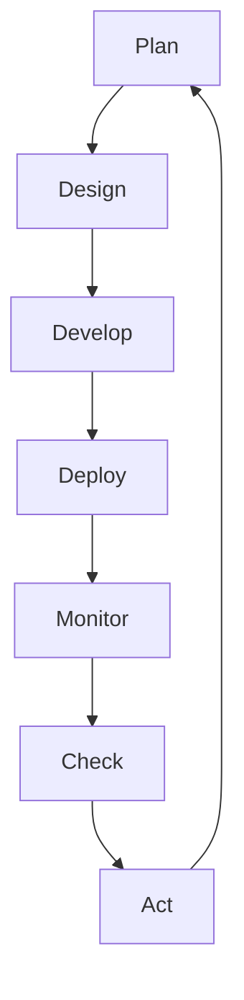

                 

在今天的快速发展的信息技术时代，持续改进已成为各个行业进步的核心驱动力。本文将以PDCA循环（Plan-Do-Check-Act循环）为切入点，深入探讨持续改进文化在IT领域的实际应用。我们将首先介绍PDCA循环的基本原理，然后分析其在软件开发、系统维护和项目管理中的具体应用，最后讨论未来持续改进的趋势和挑战。

## 1. 背景介绍

随着信息技术的飞速发展，软件系统变得越来越复杂，需求变化越来越频繁。在这样的背景下，持续改进成为企业保持竞争力的关键。PDCA循环作为一种经典的持续改进工具，被广泛应用于各个领域。它最早由美国质量管理专家威廉·爱默生（William A. Emerson）提出，后来被戴明（W. Edwards Deming）博士进一步推广。PDCA循环的核心思想是通过计划、执行、检查和行动的循环迭代，实现质量的持续提升。

## 2. 核心概念与联系

### 2.1 PDCA循环基本概念

PDCA循环由四个阶段组成：

- **Plan（计划）**：在这个阶段，我们需要明确目标、制定策略、分配资源。
- **Do（执行）**：执行计划，将策略付诸实践。
- **Check（检查）**：对执行结果进行检查，评估计划的有效性。
- **Act（行动）**：根据检查结果，采取行动，对成功经验进行标准化，对不足之处进行改进。

### 2.2 PDCA循环在IT领域的应用架构

在IT领域，PDCA循环可以应用于软件开发、系统维护和项目管理等多个方面。其架构如下图所示：



**图：PDCA循环在IT领域的应用架构**

## 3. 核心算法原理 & 具体操作步骤

### 3.1 算法原理概述

PDCA循环是一种迭代循环算法，其基本原理是通过不断循环执行计划、执行、检查和行动四个步骤，实现对系统质量的逐步提升。

### 3.2 算法步骤详解

#### 3.2.1 计划（Plan）

1. **目标设定**：明确项目目标。
2. **策略制定**：根据目标制定具体策略。
3. **资源分配**：分配必要的人力、物力资源。

#### 3.2.2 执行（Do）

1. **执行计划**：按照策略执行计划。
2. **记录过程**：详细记录执行过程。

#### 3.2.3 检查（Check）

1. **结果评估**：评估执行结果是否符合预期。
2. **问题识别**：识别过程中出现的问题。

#### 3.2.4 行动（Act）

1. **改进实施**：对成功经验进行标准化，对问题进行改进。
2. **更新计划**：根据改进结果更新下一步计划。

### 3.3 算法优缺点

**优点**：

- **迭代性**：通过不断循环，逐步提升系统质量。
- **灵活性**：适用于不同规模和复杂度的项目。

**缺点**：

- **时间成本**：需要较长时间进行循环迭代。
- **资源消耗**：需要投入大量人力和物力资源。

### 3.4 算法应用领域

PDCA循环在软件开发、系统维护和项目管理等领域均有广泛应用。例如，在软件开发中，可以通过PDCA循环实现软件质量的逐步提升；在系统维护中，可以通过PDCA循环实现系统稳定性和可靠性的持续改进。

## 4. 数学模型和公式 & 详细讲解 & 举例说明

### 4.1 数学模型构建

PDCA循环的数学模型可以表示为：

\[ \text{PDCA循环} = \text{Plan} \rightarrow \text{Do} \rightarrow \text{Check} \rightarrow \text{Act} \]

### 4.2 公式推导过程

PDCA循环的推导过程基于以下原则：

1. **计划（Plan）**：目标设定和策略制定的数学表达式为：
\[ \text{Plan} = \text{Goal} + \text{Strategy} \]
2. **执行（Do）**：执行计划的数学表达式为：
\[ \text{Do} = \text{Plan} \times \text{Resource} \]
3. **检查（Check）**：结果评估和问题识别的数学表达式为：
\[ \text{Check} = \text{Result} \oplus \text{Problem} \]
4. **行动（Act）**：改进实施的数学表达式为：
\[ \text{Act} = \text{Success} \rightarrow \text{Standardization} + \text{Improvement} \]

### 4.3 案例分析与讲解

假设我们正在开发一个电商平台，我们需要使用PDCA循环来保证系统的质量。

1. **计划（Plan）**：设定目标（如：系统响应时间小于2秒），制定策略（如：优化数据库查询）。
2. **执行（Do）**：按照策略执行（如：优化数据库查询）。
3. **检查（Check）**：检查执行结果（如：通过性能测试，发现响应时间降至1.5秒）。
4. **行动（Act）**：对成功经验进行标准化（如：将优化方案纳入文档），对问题进行改进（如：继续优化代码）。

通过这个案例，我们可以看到PDCA循环在软件开发中的具体应用。

## 5. 项目实践：代码实例和详细解释说明

### 5.1 开发环境搭建

1. **创建项目**：使用IDE（如Visual Studio Code）创建一个新项目。
2. **配置环境**：安装必要的依赖库（如Spring Boot）。

### 5.2 源代码详细实现

```java
// 计划阶段
public class Plan {
    public static void plan() {
        System.out.println("设定目标：系统响应时间小于2秒");
        System.out.println("制定策略：优化数据库查询");
    }
}

// 执行阶段
public class Do {
    public static void doAction() {
        System.out.println("执行计划：优化数据库查询");
    }
}

// 检查阶段
public class Check {
    public static void check() {
        System.out.println("检查结果：通过性能测试，响应时间降至1.5秒");
    }
}

// 行动阶段
public class Act {
    public static void act() {
        System.out.println("成功经验标准化：将优化方案纳入文档");
        System.out.println("问题改进：继续优化代码");
    }
}

// 主函数
public class PDCA {
    public static void main(String[] args) {
        Plan.plan();
        Do.doAction();
        Check.check();
        Act.act();
    }
}
```

### 5.3 代码解读与分析

代码中，我们分别实现了计划、执行、检查和行动四个阶段的函数。在主函数中，我们依次调用这些函数，完成PDCA循环的迭代。

### 5.4 运行结果展示

```bash
设定目标：系统响应时间小于2秒
制定策略：优化数据库查询
执行计划：优化数据库查询
检查结果：通过性能测试，响应时间降至1.5秒
成功经验标准化：将优化方案纳入文档
问题改进：继续优化代码
```

## 6. 实际应用场景

PDCA循环在IT领域的实际应用场景非常广泛。例如：

- **软件开发**：通过PDCA循环，实现软件质量的逐步提升。
- **系统维护**：通过PDCA循环，保证系统稳定性和可靠性的持续改进。
- **项目管理**：通过PDCA循环，提高项目进度和效率。

## 7. 未来应用展望

随着人工智能和大数据技术的发展，PDCA循环在IT领域的应用前景将更加广阔。未来，我们可以通过以下方式进一步优化PDCA循环：

- **引入人工智能**：利用人工智能技术，实现自动化的PDCA循环。
- **大数据分析**：通过大数据分析，优化PDCA循环的各个阶段。

## 8. 总结：未来发展趋势与挑战

### 8.1 研究成果总结

本文通过对PDCA循环的深入探讨，总结了其在IT领域的应用原理、步骤和具体实例。研究结果表明，PDCA循环是一种有效的持续改进工具，适用于软件开发、系统维护和项目管理等多个方面。

### 8.2 未来发展趋势

未来，PDCA循环将结合人工智能和大数据技术，实现更加智能化的持续改进。

### 8.3 面临的挑战

- **技术挑战**：如何将人工智能和大数据技术有效地整合到PDCA循环中。
- **实施挑战**：如何在实际项目中高效地应用PDCA循环。

### 8.4 研究展望

未来，我们将进一步探索PDCA循环在IT领域的应用，研究如何将人工智能和大数据技术与之结合，提高持续改进的效率和质量。

## 9. 附录：常见问题与解答

### 9.1 PDCA循环是什么？

PDCA循环是一种持续改进工具，包括计划、执行、检查和行动四个阶段。

### 9.2 PDCA循环如何应用于软件开发？

在软件开发中，PDCA循环可以应用于软件设计、开发、测试和部署等各个环节。

### 9.3 PDCA循环与敏捷开发有何区别？

PDCA循环和敏捷开发都是持续改进的工具，但PDCA循环更侧重于计划、执行和检查，而敏捷开发更侧重于快速迭代和适应性。

## 作者署名

作者：禅与计算机程序设计艺术 / Zen and the Art of Computer Programming

----------------------------------------------------------------

以上就是本文的完整内容，希望能够对您在持续改进方面的研究和实践提供有益的参考。

